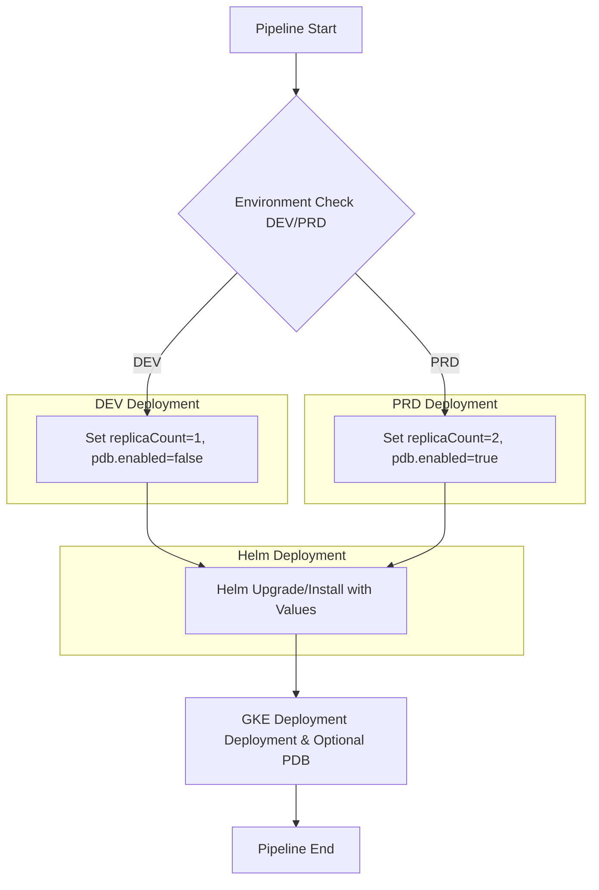

- [summary](#summary)
- [**GKE 部署 PDB 动æ€æ§åˆ¶æ–¹æ¡ˆ**](#gke-部署-pdb-动æ€æ§åˆ¶æ–¹æ¡ˆ)
  - [**背景**](#背景)
  - [**需求分æ**](#需求分æ)
  - [**方案设计**](#方案设计)
- [DeepSeek](#deepseek)
    - [1. Helm Values 分层设计（核心æ§åˆ¶é€»è¾‘）](#1-helm-values-分层设计核心æ§åˆ¶é€»è¾‘)
    - [2. 智能 PDB 生æˆé€»è¾‘（Helm Template）](#2-智能-pdb-生æˆé€»è¾‘helm-template)
    - [3. 生命周期自动化设计](#3-生命周期自动化设计)
      - [部署阶段逻辑：](#部署阶段逻辑)
      - [清ç†é˜¶æ®µé€»è¾‘：](#清ç†é˜¶æ®µé€»è¾‘)
    - [4. 多ç¯å¢ƒå…¼å®¹å®ç°æ–¹æ¡ˆ](#4-多ç¯å¢ƒå…¼å®¹å®ç°æ–¹æ¡ˆ)
    - [5. CI/CD æµæ°´çº¿å¢å¼ºå»ºè®®](#5-cicd-æµæ°´çº¿å¢å¼ºå»ºè®®)
    - [6. è¿ç»´ç›‘æ§å¢å¼º](#6-è¿ç»´ç›‘æ§å¢å¼º)
    - [技术选å‹å¯¹æ¯”表](#技术选å‹å¯¹æ¯”表)
    - [å®æ–½è·¯çº¿å›¾](#å®æ–½è·¯çº¿å›¾)
    - [关键é£é™©æ§åˆ¶](#关键é£é™©æ§åˆ¶)
- [Other](#other)
- [**GKE 部署 PDB 动æ€æ§åˆ¶æ–¹æ¡ˆ**](#gke-部署-pdb-动æ€æ§åˆ¶æ–¹æ¡ˆ-1)
- [**GKE Helm 部署 PDB 动æ€æ§åˆ¶æ–¹æ¡ˆ**](#gke-helm-部署-pdb-动æ€æ§åˆ¶æ–¹æ¡ˆ)
  - [**背景**](#背景-1)
  - [**需求分æ**](#需求分æ-1)
  - [**方案设计**](#方案设计-1)
    - [**1. `values.yaml` é…ç½®**](#1-valuesyaml-é…ç½®)
- [æµç¨‹è®¾è®¡](#æµç¨‹è®¾è®¡)
- [Grok](#grok)
- [gemini](#gemini)

# summary 
- target
	1.	PRD ç¯å¢ƒï¼šç¡®ä¿ replicas >= 2 时应用 PDB 以ä¿è¯å‡çº§æ—¶æœ€å°‘有 1 个 Pod å¯ç”¨ã€‚
	2.	DEV ç¯å¢ƒï¼šreplicas = 1 æ—¶ä¸åº”用 PDB，因为 PDB å¯èƒ½ä¼šé˜»æ­¢å‡çº§ã€‚
	3.	CD Pipeline：动æ€åˆ¤æ–­ç¯å¢ƒå¹¶å†³å®šæ˜¯å¦åº”用 PDB。
	4.	清ç†é€»è¾‘：删除 api_name_version_X.Y.Z 时，也è¦æ¸…ç† PDB。
    5.  Using Helm 部署 PDB 动æ€æ§åˆ¶æ–¹æ¡ˆ
    6.  Verify new Deployment User number in PRD

# **GKE 部署 PDB 动æ€æ§åˆ¶æ–¹æ¡ˆ**
## **背景**

ä¸ºäº†ç¡®ä¿ **GKE Cluster** 在å‡çº§è¿‡ç¨‹ä¸­å¹³æ»‘进行，并ä¿è¯ **æœ€å° Pod æ•°é‡å¯ç”¨**，我们计划在 **PRD ç¯å¢ƒ** é…ç½® **PodDisruptionBudget (PDB)**，但 **DEV ç¯å¢ƒä¸éœ€è¦**。当然这个针对的用户的Runtime而言.

---

## **需求分æ**
| 需求 | 方案 |
|------|------|
| 仅在 PRD æ—¶å¯ç”¨ PDB | `values.yaml` 里动æ€æ§åˆ¶ PDB ç”Ÿæˆ |
| PRD 至少 2 个 replicas | `values-prd.yaml` 里 `replicas: 2` |
| DEV 仅 1 个 Pod 且无 PDB | `values.yaml` 里 `replicas: 1` 且 `pdb.enabled: false` |
| Helm ç»Ÿä¸€ç®¡ç† PDB å’Œ Deployment | `helm upgrade --install` 时动æ€æ¸²æŸ“ |
| 删除 API æ—¶è‡ªåŠ¨æ¸…ç† PDB | `helm uninstall` è‡ªåŠ¨åˆ é™¤ç›¸å…³èµ„æº |

---

## **方案设计**
1. templates/pdb.yaml（动æ€åˆ›å»º PDB）
- Helm çš„ tpl 语法å…许我们动æ€æ§åˆ¶ PDB 是å¦éƒ¨ç½²ï¼š
```yaml
{{- if and (eq .Values.environment "PRD") (ge .Values.replicas 2) }}
{{- if or (eq .Values.environment "PRD") (eq .Values.environment "PPP") }}
apiVersion: policy/v1
kind: PodDisruptionBudget
metadata:
  name: {{ .api_name_version }}-pdb
spec:
  minAvailable: {{ .Values.pdb.minAvailable }}
  selector:
    matchLabels:
      app: {{ .api_name_version }}
{{- end }}
```
逻辑解æ：
	•	eq .Values.environment "PRD" Or PPP  → 仅在 PRD PPP ç¯å¢ƒå¯ç”¨ PDB。
	•	ge .Values.replicas 2 → 仅在 replicas ≥ 2 æ—¶å¯ç”¨ PDB。 我们å¯ä»¥ä¸è€ƒè™‘这个逻辑了 æˆ–è€…ä¹Ÿè€ƒè™‘è¿›å» ,有些测试用户需求比较多?
        {{- if or (eq .Values.environment "PRD") (eq .Values.environment "PPP") }}
	•	minAvailable: {{ .Values.pdb.minAvailable }} → 动æ€è°ƒæ•´ PDB 的最å°å¯ç”¨ Pod 数。
```yaml
{{- if eq .Values.environment "PRD" }}
{{- if or (eq .Values.environment "PRD") (eq .Values.environment "PPP") (ge .Values.replicas 2) }}
apiVersion: policy/v1
kind: PodDisruptionBudget
metadata:
  name: {{ .api_name_version }}-pdb
  labels:
    app: {{ .api_name_version }}
    environment: {{ .Values.environment }}
spec:
  minAvailable: 1
  selector:
    matchLabels:
      app: {{ .api_name_version }}
{{- end }}
```


CD Pipeline 渲染 Helm

在 CI/CD Pipeline 部署时：

1. DEV 部署（ä¸ä¼šåˆ›å»º PDB）
`helm upgrade --install my-api ./my-api-chart -f values.yaml`

1. PRD 部署（会创建 PDB）
`helm upgrade --install my-api ./my-api-chart -f values-prd.yaml`

	•	在 DEV ç¯å¢ƒ → pdb.yaml 逻辑ä¸ä¼šæ‰§è¡Œï¼ˆä¸ä¼šåˆ›å»º PDB）。
	•	在 PRD ç¯å¢ƒ → pdb.yaml 逻辑会执行（创建 PDB）。

1. 清ç†é€»è¾‘

当用户删除 api_name_version_1.0.0 时：

`helm uninstall api_name_version_1.0.0`

Helm 会自动删除 Deployment å’Œ PDBï¼Œæ— éœ€æ‰‹åŠ¨ç®¡ç† PDB 资æºã€‚


# DeepSeek
æ ¹æ®ä½ çš„éœ€æ±‚ï¼Œç»“åˆ Helm çš„çµæ´»æ€§å’Œ Kubernetes çš„ PDB 机制，我为你设计以下解决方案：

---

### 1. Helm Values 分层设计（核心æ§åˆ¶é€»è¾‘）
在 `values.yaml` 中定义ç¯å¢ƒå·®å¼‚å‚数，æ¨è使用分层 values 文件结æ„：

```yaml
# values-dev.yaml
environment: dev
replicaCount: 1
pdb:
  enabled: false

# values-prd.yaml
environment: prd
replicaCount: 2
pdb:
  enabled: true
  minAvailable: 1  # 或 maxUnavailable: 1
```

---

### 2. 智能 PDB 生æˆé€»è¾‘（Helm Template）
在 Helm Chart çš„ `templates/pdb.yaml` 中å®ç°åŠ¨æ€åˆ¤æ–­ï¼š

```yaml
{{- if .Values.pdb.enabled }}
{{- $replicaCheck := ge (int .Values.replicaCount) 2 }}
{{- if or (eq .Values.environment "prd") $replicaCheck }}
apiVersion: policy/v1
kind: PodDisruptionBudget
metadata:
  name: {{ include "fullname" . }}-pdb
  labels:
    {{- include "labels" . | nindent 4 }}
spec:
  {{- if .Values.pdb.minAvailable }}
  minAvailable: {{ .Values.pdb.minAvailable }}
  {{- else if .Values.pdb.maxUnavailable }}
  maxUnavailable: {{ .Values.pdb.maxUnavailable }}
  {{- end }}
  selector:
    matchLabels:
      app: {{ include "appname" . }}
{{- end }}
{{- end }}
```

---

### 3. 生命周期自动化设计
#### 部署阶段逻辑：
```python
if (env == PRD) || (replicas >= 2):
    deploy_pdb()
else:
    skip_pdb()
```

#### 清ç†é˜¶æ®µé€»è¾‘：
```python
# 通过 Helm Hook å®ç°çº§è”删除
annotations:
  "helm.sh/hook": pre-delete,pre-upgrade
  "helm.sh/hook-weight": "-5"
```

---

### 4. 多ç¯å¢ƒå…¼å®¹å®ç°æ–¹æ¡ˆ
建议采用 **æ¡ä»¶åˆ¤æ–­ + 默认值继承** 的模å¼ï¼š

```yaml
# _helpers.tpl
{{- define "shouldCreatePDB" -}}
{{- if .Values.pdb.enabled -}}
{{- if or (eq .Values.environment "prd") (ge (int .Values.replicaCount) 2) -}}
true
{{- end -}}
{{- end -}}
{{- end -}}
```

---

### 5. CI/CD æµæ°´çº¿å¢å¼ºå»ºè®®
在部署æµæ°´çº¿ä¸­å¢åŠ ç¯å¢ƒæ ¡éªŒï¼š

```bash
# Pipeline 示例
if [[ "$ENV" == "prd" ]]; then
   helm upgrade --install -f values-prd.yaml
else
   helm upgrade --install -f values-dev.yaml
fi
```

---

### 6. è¿ç»´ç›‘æ§å¢å¼º
建议在监æ§ç³»ç»Ÿä¸­é…ç½® PDB 状æ€å‘Šè­¦ï¼š

```yaml
# Prometheus 告警规则示例
- alert: PDBViolation
  expr: kube_poddisruptionbudget_status_current_healthy < kube_poddisruptionbudget_status_desired_healthy
  for: 5m
  labels:
    severity: critical
  annotations:
    description: PDB {{ $labels.name }} 处äºè¿å状æ€
```

---

### 技术选å‹å¯¹æ¯”表
| 方案 | 优点 | 缺点 | 适用场景 |
|------|------|------|----------|
| ç¯å¢ƒå˜é‡æ§åˆ¶ | 简å•ç›´è§‚ | 需维护多套é…ç½® | ç¯å¢ƒå·®å¼‚æ˜æ˜¾æ—¶ |
| 副本数自动判断 | 动æ€é€‚应å˜åŒ– | 需处ç†ä¸´ç•Œå€¼é—®é¢˜ | 弹性伸缩场景 |
| 显å¼å¼€å…³æ§åˆ¶ | 完全å¯æ§ | å¢åŠ é…ç½®å¤æ‚度 | 需è¦ç²¾ç»†æ§åˆ¶æ—¶ |

---

### å®æ–½è·¯çº¿å›¾
1. **Phase 1**：在 Helm Chart 中å®ç° PDB 模æ¿
2. **Phase 2**：é…ç½®ä¸åŒç¯å¢ƒçš„ values 文件
3. **Phase 3**：在 CI/CD æµæ°´çº¿é›†æˆç¯å¢ƒæ£€æµ‹
4. **Phase 4**：å®æ–½ç›‘æ§å‘Šè­¦é…ç½®
5. **Phase 5**：文档化è¿ç»´æµç¨‹ï¼ˆå«æ¸…ç†è§„范）

---

### 关键é£é™©æ§åˆ¶
1. **Dev ç¯å¢ƒè¯¯å¯ç”¨**：通过 `values-dev.yaml` 硬é”定 `pdb.enabled: false`
2. **临界值处ç†**：当 PRD ç¯å¢ƒç¼©å®¹åˆ° 1 个副本时自动ç¦ç”¨ PDB
3. **残留资æºæ¸…ç†**：使用 Helm Hook ç¡®ä¿çº§è”删除

```yaml
# 清ç†é’©å­ç¤ºä¾‹
annotations:
  "helm.sh/hook-delete-policy": before-hook-creation,hook-succeeded
```

---

该方案通过 Helm 的模æ¿èƒ½åŠ›å®ç°ç¯å¢ƒå·®å¼‚的智能处ç†ï¼ŒåŒæ—¶ä¿æŒé…置的简æ´æ€§ã€‚PDB 的创建/清ç†å®Œå…¨ç”± Helm 生命周期管ç†ï¼Œæ— éœ€é¢å¤–è¿ç»´æ“作。建议在å®æ–½å‰åœ¨æµ‹è¯•ç¯å¢ƒéªŒè¯ä¸´ç•Œå€¼åœºæ™¯ã€‚


# Other

# **GKE 部署 PDB 动æ€æ§åˆ¶æ–¹æ¡ˆ**
# **GKE Helm 部署 PDB 动æ€æ§åˆ¶æ–¹æ¡ˆ**

## **背景**

ä¸ºäº†ç¡®ä¿ **GKE Cluster** 在å‡çº§è¿‡ç¨‹ä¸­å¹³æ»‘进行，并ä¿è¯ **æœ€å° Pod æ•°é‡å¯ç”¨**，我们计划在 **PRD ç¯å¢ƒ** é…ç½® **PodDisruptionBudget (PDB)**，但 **DEV ç¯å¢ƒä¸éœ€è¦**。当然这个针对的用户的Runtime而言.

---

## **需求分æ**
| 需求 | 方案 |
|------|------|
| 仅在 PRD æ—¶å¯ç”¨ PDB | `values.yaml` 里动æ€æ§åˆ¶ PDB ç”Ÿæˆ |
| PRD 至少 2 个 replicas | `values-prd.yaml` 里 `replicas: 2` |
| DEV 仅 1 个 Pod 且无 PDB | `values.yaml` 里 `replicas: 1` 且 `pdb.enabled: false` |
| Helm ç»Ÿä¸€ç®¡ç† PDB å’Œ Deployment | `helm upgrade --install` 时动æ€æ¸²æŸ“ |
| 删除 API æ—¶è‡ªåŠ¨æ¸…ç† PDB | `helm uninstall` è‡ªåŠ¨åˆ é™¤ç›¸å…³èµ„æº |

---

## **方案设计**

### **1. `values.yaml` é…ç½®**
`values.yaml` 是 Helm çš„é…置文件，我们å¯ä»¥åœ¨è¿™é‡Œå®šä¹‰ **ç¯å¢ƒå˜é‡ (`environment`)** å’Œ **Pod æ•°é‡ (`replicas`)**，åŒæ—¶ç”¨ `pdb.enabled` å˜é‡å†³å®šæ˜¯å¦å¯ç”¨ **PodDisruptionBudget (PDB)**。

```yaml
# ç¯å¢ƒé…置（DEV 或 PRD）
environment: DEV   # å¯ä»¥è®¾ç½®ä¸º PRD

# Deployment 相关é…ç½®
replicas: 1  # PRD >= 2，DEV = 1

# PDB 相关é…ç½®
pdb:
  enabled: false  # PRD 下且 replicas >= 2 时自动å¯ç”¨
  minAvailable: 1  # PDB 至少ä¿æŒ 1 个 Pod å¯ç”¨
```
2. templates/pdb.yaml（动æ€åˆ›å»º PDB）

Helm çš„ tpl 语法å…许我们动æ€æ§åˆ¶ PDB 是å¦éƒ¨ç½²ï¼š
```yaml
{{- if and (eq .Values.environment "PRD") (ge .Values.replicas 2) }}
{{- if or (eq .Values.environment "PRD") (eq .Values.environment "PPP") }}
apiVersion: policy/v1
kind: PodDisruptionBudget
metadata:
  name: {{ .api_name_version }}-pdb
spec:
  minAvailable: {{ .Values.pdb.minAvailable }}
  selector:
    matchLabels:
      app: {{ .api_name_version }}
{{- end }}
```
逻辑解æ：
	•	eq .Values.environment "PRD" → 仅在 PRD ç¯å¢ƒå¯ç”¨ PDB。
	•	ge .Values.replicas 2 → 仅在 replicas ≥ 2 æ—¶å¯ç”¨ PDB。
	•	minAvailable: {{ .Values.pdb.minAvailable }} → 动æ€è°ƒæ•´ PDB 的最å°å¯ç”¨ Pod 数。
```yaml
{{- if eq .Values.environment "PRD" }}
{{- if or (eq .Values.environment "PRD") (eq .Values.environment "PPP") }}
apiVersion: policy/v1
kind: PodDisruptionBudget
metadata:
  name: {{ .api_name_version }}-pdb
  labels:
    app: {{ .api_name_version }}
    environment: {{ .Values.environment }}
spec:
  minAvailable: 1
  selector:
    matchLabels:
      app: {{ .api_name_version }}
{{- end }}
```
3. templates/deployment.yaml（动æ€è°ƒæ•´ replicas）

如æœå¸Œæœ› replicas 也å¯ä»¥åŠ¨æ€è°ƒæ•´ï¼Œä¿®æ”¹ deployment.yaml：
```yaml
apiVersion: apps/v1
kind: Deployment
metadata:
  name: {{ .api_name_version }}
spec:
  replicas: {{ .Values.replicas }}
  selector:
    matchLabels:
      app: {{ .api_name_version }}
  template:
    metadata:
      labels:
        app: {{ .api_name_version }}
    spec:
      containers:
        - name: my-app
          image: my-app-image:latest
```
4. values-prd.yaml（PRD ç¯å¢ƒé…置）
- 为了区分 DEV å’Œ PRD，我们å¯ä»¥åˆ›å»ºä¸€ä¸ª values-prd.yaml：
- 这个åŠæ³•ä¸å¤ªå¥½.
```yaml
environment: PRD
replicas: 2  # PRD 下至少 2 个 Pod
pdb:
  enabled: true
  minAvailable: 1
```
5. CD Pipeline 渲染 Helm

在 CI/CD Pipeline 部署时：

6. DEV 部署（ä¸ä¼šåˆ›å»º PDB）
`helm upgrade --install my-api ./my-api-chart -f values.yaml`

7. PRD 部署（会创建 PDB）
`helm upgrade --install my-api ./my-api-chart -f values-prd.yaml`

	•	在 DEV ç¯å¢ƒ → pdb.yaml 逻辑ä¸ä¼šæ‰§è¡Œï¼ˆä¸ä¼šåˆ›å»º PDB）。
	•	在 PRD ç¯å¢ƒ → pdb.yaml 逻辑会执行（创建 PDB）。

8. 清ç†é€»è¾‘

当用户删除 api_name_version_1.0.0 时：

`helm uninstall api_name_version_1.0.0`

Helm 会自动删除 Deployment å’Œ PDBï¼Œæ— éœ€æ‰‹åŠ¨ç®¡ç† PDB 资æºã€‚

最终方案总结

这套方案兼顾了 动æ€æ§åˆ¶ã€å¹³æ»‘å‡çº§ã€è‡ªåŠ¨æ¸…ç†ï¼Œå¹¶ä¸”完ç¾é€‚é… CD Pipeline å’Œ Helm 部署。🚀


# æµç¨‹è®¾è®¡

1. CD Pipeline 逻辑

CD Pipeline 在部署 API 时：
	•	解æç¯å¢ƒå˜é‡ ENV（PRD 或 DEV）。
	•	解æ replicas å€¼ï¼Œç¡®ä¿ PRD replicas >= 2。
	•	åªæœ‰åœ¨ PRD 且 replicas >= 2 时，æ‰éƒ¨ç½² PDB。

2. Helm 或 Kustomize 方案

CD Pipeline å¯ä»¥åŸºäº Helm 或 Kustomize 动æ€ç®¡ç† PDB：
	•	Helm 方案
	•	使用 values.yaml é…ç½® replicas å’Œ PDB 是å¦å¯ç”¨ã€‚
	•	仅在 PRD 时应用 PodDisruptionBudget。
	•	通过 --set environment=PRD 动æ€æ§åˆ¶ã€‚
示例 Helm values.yaml
```yaml
environment: DEV   # 或 PRD
replicas: 1
pdb:
  enabled: false
```
templates/pdb.yaml（仅在 PRD å¯ç”¨ PDB）
```yaml
{{- if and (eq .Values.environment "PRD") (ge .Values.replicas 2) }}
{{- if or (eq .Values.environment "PRD") (eq .Values.environment "PPP") }}
apiVersion: policy/v1
kind: PodDisruptionBudget
metadata:
  name: {{ .api_name_version }}-pdb
spec:
  minAvailable: 1
  selector:
    matchLabels:
      app: {{ .api_name_version }}
{{- end }}
```
CD Pipeline 渲染

`helm upgrade --install my-api ./my-api-chart --set environment=PRD --set replicas=2`


	•	Kustomize 方案
	•	base 目录定义 Deployment，ä¸åŒ…å« PDB。
	•	overlays/prd 目录添加 PDB 资æºï¼Œä»…é€‚ç”¨äº PRD。
示例 kustomization.yaml
```yaml
namespace: my-api-ns
resources:
  - deployment.yaml
```
overlays/prd/kustomization.yaml
```yaml
namespace: my-api-ns
resources:
  - ../../base
  - pdb.yaml
```
CD Pipeline
```bash
if [ "$ENV" == "PRD" ]; then
  kustomize build overlays/prd | kubectl apply -f -
else
  kustomize build base | kubectl apply -f -
fi
```
3. 资æºæ¸…ç†é€»è¾‘

当用户删除 api_name_version_1.0.0 时：
	•	kubectl delete deployment api_name_version_1.0.0
	•	åŒæ—¶åˆ é™¤å¯¹åº”çš„ PDB

`kubectl delete pdb api_name_version_1.0.0-pdb --ignore-not-found`


如æœä½¿ç”¨ Helm：

`helm uninstall api_name_version_1.0.0`

Helm 会自动删除 PDB 和 Deployment。

如æœä½¿ç”¨ Kustomize：

`kubectl delete -k overlays/prd`

最终方案总结

| 方案         | 逻辑                                                | 适用场景             |
| ------------ | --------------------------------------------------- | -------------------- |
| Helm         | 使用 values.yaml 动æ€æ§åˆ¶ PDB 是å¦å¯ç”¨              | 适用äºæ ‡å‡†åŒ–çš„ CI/CD |
| Kustomize    | base 目录定义基础资æºï¼Œoverlays/prd ä»… PRD 添加 PDB | é€‚ç”¨äº GitOps        |
| 手动 kubectl | Pipeline ç›´æ¥æ£€æŸ¥ ENV å†³å®šæ˜¯å¦ apply PDB            | 适用äºå·²æœ‰ CI/CD     |

ä½ å¯ä»¥æ ¹æ®ç°æœ‰çš„ CD æ–¹å¼é€‰æ‹©åˆé€‚的方案，æ¨è Helm 进行管ç†ï¼Œç¡®ä¿ PRD ç¯å¢ƒå¹³æ»‘å‡çº§ï¼ŒåŒæ—¶ä¿è¯æ¸…ç†é€»è¾‘完整。


# Grok
你的问题涉åŠå¦‚何在 GKE 集群中使用 PodDisruptionBudget (PDB) å®ç°å¹³æ»‘å‡çº§ï¼ŒåŒæ—¶é€‚é… DEV å’Œ PRD ç¯å¢ƒçš„å·®å¼‚åŒ–éœ€æ±‚ï¼Œå¹¶ç»“åˆ Helm å’Œ CI/CD pipeline 进行管ç†å’Œæ¸…ç†ã€‚以下是一个系统的设计方案，é€æ­¥è§£ç­”你的需求：
设计目标
平滑å‡çº§ï¼šç¡®ä¿ GKE 集群å‡çº§æ—¶å§‹ç»ˆæœ‰å¯ç”¨å®ä¾‹ï¼ŒPRD ç¯å¢ƒé€šè¿‡ PDB ä¿è¯é«˜å¯ç”¨ã€‚
ç¯å¢ƒå·®å¼‚化：DEV ç¯å¢ƒ replicas=1 无需 PDB，PRD ç¯å¢ƒ replicas>=2 时部署 PDB。
模版化部署：通过 Helm çš„ values.yaml 动æ€æ§åˆ¶ PDB 部署。
清ç†é€»è¾‘ï¼šç¡®ä¿ PDB 资æºè·Ÿéš Deployment 生命周期被正确清ç†ã€‚
Pipeline 集æˆï¼šåœ¨ CD æµç¨‹ä¸­æ ¹æ®ç¯å¢ƒåŠ¨æ€è°ƒæ•´é€»è¾‘。
整体设计方案
1. Helm Chart 结æ„设计
使用 Helm 模版化部署，动æ€å†³å®šæ˜¯å¦ç”Ÿæˆ PDB 资æºã€‚以下是æ¨èçš„ Helm Chart 结æ„：
```bash
my-chart/
├── templates/
│   ├── deployment.yaml       # Deployment 模版
│   ├── pdb.yaml             # PDB 模版（æ¡ä»¶æ¸²æŸ“）
│   └── _helpers.tpl         # 辅助函数
├── values.yaml              # 默认é…ç½®
└── values-prd.yaml          # PRD ç¯å¢ƒä¸“用é…ç½®
```
a. values.yaml（默认é…ç½®ï¼Œé€‚ç”¨äº DEV）
```yaml
replicaCount: 1
environment: "dev"
pdb:
  enabled: false
  minAvailable: 1
app:
  name: "my-app"
```
b. values-prd.yaml（PRD 专用é…置）
```yaml
replicaCount: 2
environment: "prd"
pdb:
  enabled: true
  minAvailable: 1  # 或根æ®éœ€æ±‚调整
app:
  name: "my-app"
```
c. templates/deployment.yaml
```yaml
apiVersion: apps/v1
kind: Deployment
metadata:
  name: {{ .Values.app.name }}
spec:
  replicas: {{ .Values.replicaCount }}
  selector:
    matchLabels:
      app: {{ .Values.app.name }}
  template:
    metadata:
      labels:
        app: {{ .Values.app.name }}
    spec:
      containers:
      - name: {{ .Values.app.name }}
        image: "your-image:{{ .Values.image.tag }}"
```
d. templates/pdb.yaml
```yaml
{{- if .Values.pdb.enabled }}
apiVersion: policy/v1
kind: PodDisruptionBudget
metadata:
  name: {{ .Values.app.name }}-pdb
spec:
  minAvailable: {{ .Values.pdb.minAvailable }}
  selector:
    matchLabels:
      app: {{ .Values.app.name }}
{{- end }}
```
通过 {{- if .Values.pdb.enabled }} æ¡ä»¶ï¼Œç¡®ä¿ PDB åªåœ¨å¯ç”¨æ—¶ç”Ÿæˆã€‚
2. ç¯å¢ƒå·®å¼‚化逻辑
DEV ç¯å¢ƒï¼šreplicaCount=1，pdb.enabled=false，ä¸ä¼šç”Ÿæˆ PDB 资æºã€‚
PRD ç¯å¢ƒï¼šreplicaCount>=2，pdb.enabled=trueï¼Œç”Ÿæˆ PDB 资æºã€‚
动æ€æ§åˆ¶ï¼šåœ¨ Helm values 文件中通过 environment å’Œ replicaCount 判断是å¦å¯ç”¨ PDB。
å¯ä»¥åœ¨ _helpers.tpl 中定义辅助逻辑，进一步å¢å¼ºæ¡ä»¶åˆ¤æ–­ï¼š
```yaml
{{/* _helpers.tpl */}}
{{- define "pdb.enabled" -}}
{{- if and (eq .Values.environment "prd") (ge .Values.replicaCount 2) -}}
true
{{- else -}}
false
{{- end -}}
{{- end -}}
```
然å在 pdb.yaml 中使用：
```yaml
{{- if (include "pdb.enabled" .) }}
apiVersion: policy/v1
kind: PodDisruptionBudget
metadata:
  name: {{ .Values.app.name }}-pdb
spec:
  minAvailable: {{ .Values.pdb.minAvailable }}
  selector:
    matchLabels:
      app: {{ .Values.app.name }}
{{- end }}
```
这样，åªæœ‰ PRD ç¯å¢ƒä¸” replicaCount>=2 æ—¶æ‰ä¼šéƒ¨ç½² PDB。
3. CI/CD Pipeline 集æˆ
ä½ çš„ CD pipeline 需è¦æ ¹æ®ç¯å¢ƒåŠ è½½ä¸åŒçš„ values 文件并执行 Helm 部署。以下是一个示例（å‡è®¾ä½¿ç”¨ GitHub Actions）：
```yaml
name: Deploy to GKE
on:
  push:
    branches:
      - main
jobs:
  deploy:
    runs-on: ubuntu-latest
    steps:
    - uses: actions/checkout@v3
    - name: Set Environment
      run: |
        if [ "${{ github.ref }}" == "refs/heads/main" ]; then
          echo "ENV=prd" >> $GITHUB_ENV
          echo "VALUES_FILE=values-prd.yaml" >> $GITHUB_ENV
        else
          echo "ENV=dev" >> $GITHUB_ENV
          echo "VALUES_FILE=values.yaml" >> $GITHUB_ENV
        fi
    - name: Deploy with Helm
      run: |
        helm upgrade --install my-app ./my-chart \
          -f ${{ env.VALUES_FILE }} \
          --namespace ${{ env.ENV }} \
          --set image.tag=${{ github.sha }}
```
DEV ç¯å¢ƒï¼šåŠ è½½ values.yaml，replicaCount=1，ä¸éƒ¨ç½² PDB。
PRD ç¯å¢ƒï¼šåŠ è½½ values-prd.yaml，replicaCount>=2，部署 PDB。
4. 清ç†é€»è¾‘
ä¸ºäº†ç¡®ä¿ PDB 资æºè·Ÿéš Deployment 清ç†ï¼Œéœ€è¦ï¼š
命å一致性：PDB çš„ metadata.name ä¸ Deployment çš„ app 标签关è”（例如 {{ .Values.app.name }}-pdb）。
Helm å¸è½½ï¼šå½“用户删除 Deployment 时，Helm 会自动清ç†å…³è”çš„ PDB 资æºã€‚
bash
helm uninstall my-app --namespace prd
手动清ç†ï¼ˆå¯é€‰ï¼‰ï¼šå¦‚æœç”¨æˆ·é€šè¿‡å…¶ä»–æ–¹å¼åˆ é™¤ Deployment，æ供脚本检查并清ç†æ®‹ç•™ PDB：
bash
kubectl delete pdb -l app=my-app --namespace prd
在 pipeline 中添加清ç†æ­¥éª¤ï¼š
```yaml
- name: Cleanup Old Resources
  run: |
    helm uninstall my-app --namespace ${{ env.ENV }} || true
    kubectl delete pdb -l app=my-app --namespace ${{ env.ENV }} || true
```
5. 平滑å‡çº§éªŒè¯
PRD ç¯å¢ƒï¼šreplicaCount>=2 é…åˆ minAvailable=1，确ä¿å‡çº§æ—¶è‡³å°‘ 1 个 Pod å¯ç”¨ã€‚
DEV ç¯å¢ƒï¼šæ—  PDB，å•å®ä¾‹éƒ¨ç½²ï¼Œå‡çº§å¯èƒ½çŸ­æš‚ä¸­æ–­ï¼ˆç¬¦åˆ DEV ç¯å¢ƒçš„ä½è¦æ±‚）。
GKE 集群å‡çº§ï¼šç»“åˆ GKE çš„ PodDisruptionBudget 支æŒï¼Œé›†ç¾¤å‡çº§ä¼šå°Šé‡ PDB 约æŸã€‚
完整æµç¨‹æ€»ç»“
Helm Chart：
使用 values.yaml å’Œ values-prd.yaml 区分 DEV å’Œ PRD é…置。
PDB 模版通过æ¡ä»¶æ¸²æŸ“动æ€ç”Ÿæˆã€‚
Pipeline：
æ ¹æ®åˆ†æ”¯æˆ–ç¯å¢ƒå˜é‡é€‰æ‹©ä¸åŒçš„ values 文件。
执行 helm upgrade 部署。
清ç†ï¼š
Helm å¸è½½è‡ªåŠ¨æ¸…ç† PDB。
æ供脚本清ç†æ®‹ç•™èµ„æºã€‚
验è¯ï¼š
PRD ç¯å¢ƒæµ‹è¯• PDB 生效（kubectl describe pdb）。
DEV ç¯å¢ƒç¡®è®¤æ—  PDB 部署。
é¢å¤–建议
PDB å‚数调整：根æ®ä¸šåŠ¡éœ€æ±‚调整 minAvailable 或 maxUnavailable，例如：
高å¯ç”¨ä¸šåŠ¡ï¼šminAvailable: 50%。
ä½è´Ÿè½½ä¸šåŠ¡ï¼šminAvailable: 1。
监æ§é›†æˆï¼šåœ¨ PRD ç¯å¢ƒä¸­é€šè¿‡ Prometheus ç›‘æ§ Pod å¯ç”¨æ€§ï¼Œç¡®ä¿ PDB 生效。
版本æ§åˆ¶ï¼šåœ¨ values.yaml 中添加版本字段（如 api_name_version_1.0.0），便äºæ¸…ç†ç‰¹å®šç‰ˆæœ¬èµ„æºã€‚
这样设计既满足了平滑å‡çº§å’Œç¯å¢ƒå·®å¼‚化的需求，åˆä¿è¯äº†æ¸…ç†é€»è¾‘的完整性，åŒæ—¶ä¸ Helm å’Œ Pipeline æ— ç¼é›†æˆã€‚有什么具体细节需è¦è°ƒæ•´æˆ–补充，å¯ä»¥å‘Šè¯‰æˆ‘ï¼

# gemini 
为了在 GKE API å¹³å°ä¸Šå¹³æ»‘å‡çº§å¹¶ç¡®ä¿æœ€å° Pod æ•°é‡å¯ç”¨ï¼ŒåŒæ—¶å…¼å®¹ DEV å’Œ PRD ç¯å¢ƒå¹¶å¤„ç†æ¸…ç†é€»è¾‘，我们å¯ä»¥è®¾è®¡ä¸€ä¸ªåŸºäº Helm å’Œ Pipeline çš„æµç¨‹ï¼Œåˆ©ç”¨ `PodDisruptionBudget` (PDB) 资æºã€‚以下是详细的设计方案：

**1.  Helm Chart 结æ„调整和 `values.yaml` é…ç½®**

为了动æ€æ§åˆ¶ PDB 的部署，我们需è¦åœ¨ Helm Chart çš„ `values.yaml` 中引入相关的é…置项。

*   **`values.yaml` é…置项:**

```yaml
replicaCount: 1 # DEV ç¯å¢ƒé»˜è®¤å‰¯æœ¬æ•°
pdb:
  enabled: false # 默认ç¦ç”¨ PDB
  minAvailable: 1  # PDB 最å°å¯ç”¨ Pod æ•°é‡ï¼ŒPRD ç¯å¢ƒå¯ä»¥è°ƒæ•´
environment: "DEV" # 默认ç¯å¢ƒä¸º DEV

deployment:
  # ... Deployment 的其他é…ç½®
  replicas: {{ .Values.replicaCount }}
  # ...
```

*   **PDB 资æºæ¨¡æ¿ (`templates/pdb.yaml`):**

创建一个 PDB 模æ¿ï¼Œå¹¶ä½¿ç”¨ Helm çš„ `if` æ¡ä»¶è¯­å¥æ¥æ§åˆ¶æ˜¯å¦éƒ¨ç½² PDB。æ¡ä»¶å¯ä»¥åŸºäº `pdb.enabled` å’Œ `environment` (或 `replicaCount`)。

```yaml
{{- if and .Values.pdb.enabled (ge .Values.deployment.replicas 2) (eq .Values.environment "PRD") }}
apiVersion: policy/v1
kind: PodDisruptionBudget
metadata:
  name: {{ template "fullname" . }}-pdb
  labels:
    app: {{ template "name" . }}
    chart: {{ .Chart.Name }}-{{ .Chart.Version | replace "+" "_" }}
    release: {{ .Release.Name }}
    heritage: {{ .Release.Service }}
spec:
  minAvailable: {{ .Values.pdb.minAvailable }}
  selector:
    matchLabels:
      app: {{ template "name" . }}
{{- end }}
```

**说æ˜:**

*   `{{- if and .Values.pdb.enabled (ge .Values.deployment.replicas 2) (eq .Values.environment "PRD") }}`:  这个 `if` æ¡ä»¶ç¡®ä¿åªæœ‰å½“ `pdb.enabled` 为 `true` **并且** `deployment.replicas` 大äºç­‰äº 2 **并且** `environment` 为 `PRD` 时，æ‰ä¼šéƒ¨ç½² PDB。
*   `{{ template "fullname" . }}-pdb`:  PDB çš„å称å¯ä»¥åŸºäº Helm 的命å模æ¿ï¼Œç¡®ä¿å”¯ä¸€æ€§ã€‚
*   `minAvailable: {{ .Values.pdb.minAvailable }}`:  PDB çš„ `minAvailable` å€¼ä» `values.yaml` 中è·å–，方便在 PRD ç¯å¢ƒä¸­è°ƒæ•´ã€‚
*   `selector`:  PDB çš„ `selector` åº”è¯¥åŒ¹é… Deployment çš„ Pod 标签，通常是 `app` 标签。

**2.  CD Pipeline 设计**

在 CD Pipeline 中，我们需è¦æ ¹æ®ä¸åŒçš„ç¯å¢ƒè®¾ç½® `values.yaml` 中的å‚数。

*   **Pipeline 步骤:**

    1.  **ç¯å¢ƒæ£€æµ‹:**  Pipeline 需è¦è¯†åˆ«å½“å‰éƒ¨ç½²çš„ç¯å¢ƒ (DEV 或 PRD)。这å¯ä»¥é€šè¿‡ Pipeline çš„ç¯å¢ƒå˜é‡æˆ–é…ç½®æ¥ç¡®å®š (例如 `ENVIRONMENT=DEV` 或 `ENVIRONMENT=PRD`)。
    2.  **Helm 值覆盖:**  在 Helm deploy 步骤中，根æ®ç¯å¢ƒè®¾ç½® `values.yaml` 的值。

    *   **DEV ç¯å¢ƒ Pipeline 示例:**

        ```bash
        # ... 其他 Pipeline 步骤 ...

        # 设置 Helm values ç”¨äº DEV ç¯å¢ƒ
        helm upgrade --install my-api-release ./helm-chart \
          --set replicaCount=1 \
          --set pdb.enabled=false \
          --set environment=DEV \
          --namespace my-namespace

        # ... 其他 Pipeline 步骤 ...
        ```

    *   **PRD ç¯å¢ƒ Pipeline 示例:**

        ```bash
        # ... 其他 Pipeline 步骤 ...

        # 设置 Helm values ç”¨äº PRD ç¯å¢ƒ
        helm upgrade --install my-api-release ./helm-chart \
          --set replicaCount=2 \
          --set pdb.enabled=true \
          --set environment=PRD \
          --namespace my-namespace

        # ... 其他 Pipeline 步骤 ...
        ```

    *   **æ›´çµæ´»çš„ Pipeline 值设置:**  å¯ä»¥ä½¿ç”¨æ›´çµæ´»çš„æ–¹å¼ï¼Œä¾‹å¦‚使用 `envsubst` 或类似的工具，将 Pipeline ç¯å¢ƒå˜é‡æ³¨å…¥åˆ° `values.yaml` 文件中，然åå†æ‰§è¡Œ `helm upgrade` 命令。

        ```bash
        # å‡è®¾ pipeline 中有ç¯å¢ƒå˜é‡ ENVIRONMENT (DEV/PRD)

        if [ "$ENVIRONMENT" == "PRD" ]; then
          pdb_enabled=true
          replica_count=2
        else
          pdb_enabled=false
          replica_count=1
        fi

        helm upgrade --install my-api-release ./helm-chart \
          --set replicaCount=$replica_count \
          --set pdb.enabled=$pdb_enabled \
          --set environment=$ENVIRONMENT \
          --namespace my-namespace
        ```

**3.  清ç†é€»è¾‘**

当需è¦æ¸…ç† API (例如 `api_name_version_1.0.0`) 时，如æœä½¿ç”¨ Helm 部署，最简å•çš„清ç†æ–¹å¼æ˜¯ä½¿ç”¨ Helm çš„ `uninstall` 命令。

*   **Helm Uninstall:**

    ```bash
    helm uninstall my-api-release -n my-namespace
    ```

    当执行 `helm uninstall` 命令时，Helm 会删除该 Release 下所有部署的 Kubernetes 资æºï¼ŒåŒ…括 Deploymentã€Serviceã€Ingress **以åŠæˆ‘们部署的 PDB**。  因为 PDB 是 Helm Chart 的一部分，所以会被自动清ç†æ‰ã€‚

*   **ç¡®ä¿ PDB 是 Helm Chart 的一部分:** é‡è¦çš„是è¦ç¡®ä¿ `templates/pdb.yaml` 文件确å®å­˜åœ¨äºä½ çš„ Helm Chart 中，并且 PDB 是通过 Helm 进行部署和管ç†çš„。

**4.  æµç¨‹å›¾ (Mermaid)**



**5.  总结和最佳å®è·µ**

*   **使用 Helm ç®¡ç† PDB**: å°† PDB 定义为 Helm Chart 的一部分，å¯ä»¥æ–¹ä¾¿åœ°è¿›è¡Œéƒ¨ç½²ã€å‡çº§å’Œæ¸…ç†ã€‚
*   **`values.yaml` 动æ€é…ç½®**:  通过 `values.yaml` å’Œ Helm 的模æ¿åŠŸèƒ½ï¼Œå¯ä»¥çµæ´»åœ°æ§åˆ¶ PDB 是å¦éƒ¨ç½²ä»¥åŠç›¸å…³çš„å‚数。
*   **Pipeline 自动化**:  使用 CD Pipeline 自动化部署æµç¨‹ï¼Œå¹¶æ ¹æ®ç¯å¢ƒåŠ¨æ€è®¾ç½® Helm çš„ Valuesï¼Œç¡®ä¿ DEV å’Œ PRD ç¯å¢ƒçš„差异化é…置。
*   **Helm Uninstall 清ç†**:  使用 Helm çš„ `uninstall` 命令进行资æºæ¸…ç†ï¼Œå¯ä»¥ç¡®ä¿ PDB 等所有相关资æºéƒ½è¢«æ­£ç¡®åˆ é™¤ã€‚
*   **测试验è¯**:  在 DEV å’Œ PRD ç¯å¢ƒä¸­å……分测试 Pipeline å’Œ Helm Chartï¼ŒéªŒè¯ PDB 是å¦æŒ‰é¢„期部署和工作，以åŠæ¸…ç†é€»è¾‘是å¦æ­£ç¡®ã€‚
*   **ç›‘æ§ PDB 状æ€**:  在 PRD ç¯å¢ƒä¸­ï¼Œç›‘æ§ PDB 的状æ€ï¼Œç¡®ä¿åœ¨èŠ‚点维护或å‡çº§æ—¶ï¼ŒPod 的驱é€å—到 PDB çš„ä¿æŠ¤ï¼ŒæœåŠ¡å¹³æ»‘å¯ç”¨ã€‚å¯ä»¥ä½¿ç”¨ `kubectl get pdb -n <namespace>` 命令查看 PDB 的状æ€ã€‚

通过以上设计，你å¯ä»¥æœ‰æ•ˆåœ°åœ¨ GKE å¹³å°ä¸Šå®ç° PDB 的动æ€éƒ¨ç½²å’Œç®¡ç†ï¼Œç¡®ä¿ PRD ç¯å¢ƒçš„平滑å‡çº§ï¼ŒåŒæ—¶å…¼å®¹ DEV ç¯å¢ƒï¼Œå¹¶ç®€åŒ–资æºæ¸…ç†æµç¨‹ã€‚ 使用 Helm å’Œ Pipeline 结åˆçš„æ–¹å¼ï¼Œèƒ½å¤Ÿæä¾›çµæ´»ã€å¯ç»´æŠ¤å’Œè‡ªåŠ¨åŒ–çš„ API å¹³å°éƒ¨ç½²æ–¹æ¡ˆã€‚