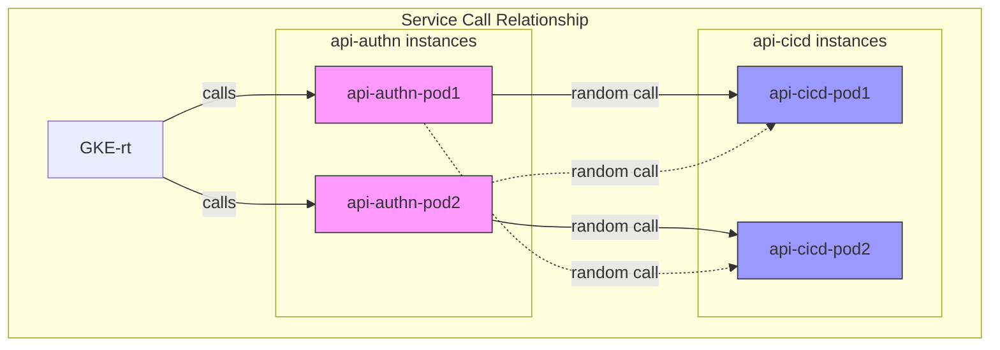
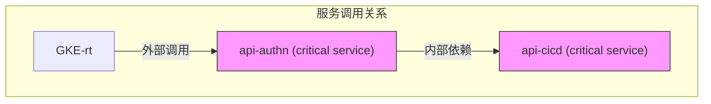
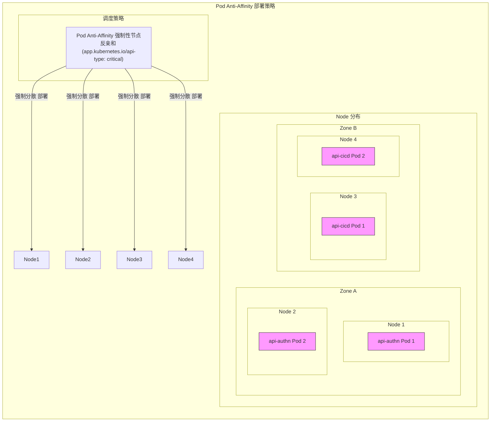
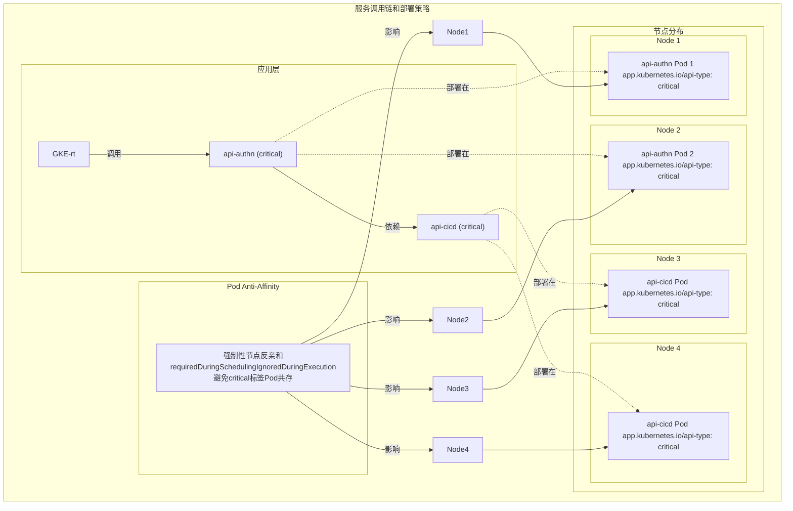

- [old api pod anti-affinity](#old-api-pod-anti-affinity)
- [New Logic](#new-logic)
- [Pod Anti-Affinity 配置说明](#pod-anti-affinity-配置说明)
  - [背景问题](#背景问题)
  - [解决方案](#解决方案)
  - [配置考虑](#配置考虑)
  - [预期效果](#预期效果)
- [Pod Anti-Affinity 可视化说明](#pod-anti-affinity-可视化说明)
- [deepseek verify PDB ?](#deepseek-verify-pdb-)
- [deepseek resolve](#deepseek-resolve)
- [PodDisruptionBudget](#poddisruptionbudget)
- [gemini](#gemini)
  - [1. 服务调用关系](#1-服务调用关系)
- [理解这个步骤](#理解这个步骤)

# old api pod anti-affinity 
需求是将两个特定的 Deployment (api-authn 和 api-cicd) 避免部署在同一个 Node 上，同时保留原有的 Node 互斥和 Zone 亲和性策略。  这可以通过结合 PodAntiAffinity 和适当的 Label 选择器来实现。

这里提供一个可行的解决方案，并解释其原理和需要注意的地方：
old logic 
```yaml
spec:
  affinity:
    podAntiAffinity:
      requiredDuringSchedulingIgnoredDuringExecution:
        - labelSelector:
            matchExpressions:
              - key: app
                operator: In
                values:
                  - nginx
          topologyKey: kubernetes.io/hostname
      preferredDuringSchedulingIgnoredDuringExecution:
        - weight: 1
          podAffinityTerm:
            labelSelector:
              matchExpressions:
                - key: app
                  operator: In
                  values:
                    - nginx
            topologyKey: topology.kubernetes.io/zone
  automountServiceAccountToken: false
```
# New Logic 
**解决方案:**

1. **为 `api-authn` 和 `api-cicd` Deployment 添加统一的 Label：**  这一步是关键，它允许我们创建一个通用的反亲和性规则。  例如，你可以添加一个标签 `app.kubernetes.io/component=api-group` 到两个 Deployment 的 Pod 模板中。

   * **api-authn Deployment (示例)：**
```yaml
apiVersion: apps/v1
kind: Deployment
metadata:
  name: api-authn
spec:
  selector:
    matchLabels:
      app: api-authn
      app.kubernetes.io/component: api-group  # 添加的 Label 这里不能添加,因为spec.selector字段不能修改,不能在deployment 更新时修改.具体来说来说，spec.selector字段定义了depployment的标签选择器，一旦创建后，这个字段就不可以修改了。
  template:
    metadata:
      labels:
        app: api-authn
        app.kubernetes.io/component: api-group  # 添加的 Label
    spec:
      # ... 其他配置 ...
      affinity:
        podAntiAffinity:
          requiredDuringSchedulingIgnoredDuringExecution:
            - labelSelector:
                matchExpressions:
                  - key: app.kubernetes.io/component
                    operator: In
                    values:
                      - api-group  # 使用统一的 Label
              topologyKey: kubernetes.io/hostname
          preferredDuringSchedulingIgnoredDuringExecution:
            - weight: 1
              podAffinityTerm:
                labelSelector:
                  matchExpressions:
                    - key: app
                      operator: In
                      values:
                        - nginx #保持原来的配置，如果确实需要
                topologyKey: topology.kubernetes.io/zone
      automountServiceAccountToken: false
```
# Pod Anti-Affinity 配置说明
## 背景问题
我们有一个关键的服务调用链：
```
GKE-rt -> api-authn -> api-cicd
```

当前面临两个主要风险：

1. **单节点故障风险**
   - 如果 api-authn 的多个 Pod 都部署在同一个节点上
   - 当 GKE 升级或节点故障时，这些 Pod 会同时被驱逐
   - 导致 api-authn 服务完全中断

2. **级联故障风险**
   - 由于 api-authn 和 api-cicd 存在调用依赖关系
   - 如果它们的 Pod 都部署在同一个节点上
   - 节点故障会导致整个调用链中断
   - 造成更大范围的服务影响

## 解决方案
通过配置 Pod Anti-Affinity 来确保关键服务的高可用：

1. **添加统一标签**
   - 为 api-authn 和 api-cicd 添加相同的标签
   - 使用 `app.kubernetes.io/api-type: critical` 标识关键服务

2. **配置强制性节点反亲和**
   - 使用 `requiredDuringSchedulingIgnoredDuringExecution`
   - 确保带有相同标签的 Pod 不会调度到同一节点
   - 保持原有的 Zone 分布策略

## 配置考虑
1. **资源要求**
   - 集群需要有足够的节点数量
   - 节点需要有足够的资源支持分散部署

2. **高可用保障**
   - 建议配置合适的 replicas 数量
   - 考虑使用 PodDisruptionBudget 控制主动驱逐
   - 确保节点反亲和性规则不会导致调度失败

## 预期效果
- 即使在节点故障或升级时，服务也能保持可用
- 避免关键服务的单点故障
- 提高整个调用链的稳定性和可靠性

# Pod Anti-Affinity 可视化说明


上面是我的一个API的方式,我想了解如果我不做亲和性配置或者反亲和配置,比如我的api-cicd-pod1 和 api-cicd-pod2 都部署在同一个节点上,那么假如gke 在升级master和node_pools的时候
api-cicd-pod1 和 api-cicd-pod2 就会调用失败?
# deepseek verify PDB ?
think
嗯，用户的问题是关于GKE中不配置亲和性或反亲和性时，在节点升级期间服务调用的失败可能性。首先，我需要理解他们的架构。根据提供的Mermaid图表，GKE服务调用两个api-authn Pod，每个Pod再随机调用api-cicd的Pod。用户担心如果api-cicd的两个Pod部署在同一节点上，当GKE升级master或node pools时，这两个Pod可能同时不可用，导致调用失败。

首先，我需要确认节点升级的具体过程。GKE在升级节点时，通常会逐个排空（drain）节点，确保Pod被迁移到其他可用节点。如果api-cicd的两个Pod都位于同一节点，当该节点被排空，两个Pod会被重新调度。但Kubernetes默认的调度策略是允许Pod分布在同一个节点，除非设置反亲和性。

接下来，用户的问题是关于这种情况下服务调用是否会失败。如果两个api-cicd Pod都在同一节点，而该节点升级，那么在该节点被排空期间，这两个Pod会被终止，并在其他节点上启动。这个过程需要时间，可能导致暂时的不可用。如果客户端（比如api-authn Pod）没有重试机制，请求可能会失败。此外，如果两个api-cicd Pod同时不可用，服务中断的可能性增加。

不过，Kubernetes的Service对象通常有端点监控，当Pod终止时，会从Service的端点列表中移除，避免将流量导向不可用的Pod。但排空节点时，可能有一个短暂的时间窗口，Pod尚未完全终止，但服务已经开始转移流量，导致部分请求失败。此外，如果两个Pod都在同一节点，同时被排空，那么在这段时间内，api-cicd服务可能没有可用的实例，直到新的Pod被调度并启动。

用户可能没有考虑到PodDisruptionBudget（PDB），它可以设置最小可用实例数，确保在维护期间至少有一定数量的Pod运行。如果没有设置PDB，升级时可能允许所有Pod同时被终止。

另外，api-authn的随机调用是否具备重试机制也很重要。如果客户端在调用失败时会重试其他实例，那么即使某个Pod不可用，请求可能被转发到其他Pod，减少失败率。但若两个api-cicd Pod都在同一节点，同时不可用，则重试也无法成功。

总结来说，问题核心在于节点升级导致Pod同时终止，而缺乏反亲和性增加了这种风险。解决方案建议包括配置反亲和性，分散Pod到不同节点；设置PDB确保最小可用实例；检查服务的就绪和存活探针；以及客户端重试机制。此外，使用HPA确保足够的副本数，分散在多个节点上，也能提高可用性。

用户可能想知道具体如何配置这些资源，或者是否有其他最佳实践。可能需要进一步解释反亲和性的配置方法，PDB的设置步骤，以及如何优化探针和重试逻辑。同时，用户可能对GKE的自动升级过程如何影响服务可用性有误解，需要澄清节点排空的过程和Kubernetes的默认行为。

# deepseek resolve 

你的理解基本正确，但需要更精确地分析场景。以下是详细解释：

1. **节点升级机制**：
- GKE 在升级节点时会逐个 **排空（drain）** 节点，默认行为是：
  - 标记节点不可调度
  - 驱逐节点上的 Pod（遵循优雅终止策略）
  - 等待 Pod 在其他节点重建（需集群有足够容量）

2. **关键风险点**：
若所有 `api-cicd` Pod 部署在同一节点时：
- **单点故障**：该节点被排空时，所有 `api-cicd` Pod 会同时终止
- **重建延迟**：K8s 需要时间调度新 Pod 到其他节点（受镜像拉取、启动时间影响）
- **服务中断窗口**：
  - 旧 Pod 已终止，新 Pod 未就绪时（即使有多个副本）
  - 若客户端无重试机制，请求会失败

3. **解决方案建议**：

```yaml
# 反亲和性配置示例（确保 Pod 分散在不同节点）
affinity:
  podAntiAffinity:
    requiredDuringSchedulingIgnoredDuringExecution:
    - labelSelector:
        matchLabels:
          app: api-cicd
      topologyKey: "kubernetes.io/hostname"

# PodDisruptionBudget 示例（保证最小可用实例）
apiVersion: policy/v1
kind: PodDisruptionBudget
metadata:
  name: api-cicd-pdb
spec:
  minAvailable: 1
  selector:
    matchLabels:
      app: api-cicd
```

4. **补充优化措施**：
- **HPA (Horizontal Pod Autoscaler)**：确保有足够副本分布在多个节点
- **就绪探针（Readiness Probe）**：精确控制流量切换时机
- **preStop Hook**：增加优雅终止等待时间
- **客户端重试策略**：建议采用指数退避重试（如 3 次重试）

5. **GKE 特殊机制**：
- **自动修复（Auto-Repair）**：节点异常时会自动触发排空流程
- **滚动升级策略**：可通过 `maxSurge`/`maxUnavailable` 控制节点替换节奏

实际生产环境中，建议同时配置以下参数：
```shell
# 让 Pod 分散在不同区域（提升跨 AZ 可用性）
kubectl label nodes <node-name> topology.kubernetes.io/zone=asia-east1-a

# 使用 topologySpreadConstraints 增强调度控制
topologySpreadConstraints:
- maxSkew: 1
  topologyKey: topology.kubernetes.io/zone
  whenUnsatisfiable: ScheduleAnyway
  labelSelector: { ... }
```

这些配置组合后，即使发生节点级故障，也能将服务中断时间控制在秒级（通常 <30s）。

# PodDisruptionBudget


# gemini 
你的问题涉及到 Kubernetes 集群升级和 Pod 的可用性，特别是在没有亲和性/反亲和性配置以及 `PodDisruptionBudget` (PDB) 的情况下。

**场景分析:**

*   **集群升级过程:** GKE 升级包括控制平面 (Master) 和节点池 (Node Pool) 的升级。节点池升级通常涉及到创建新的节点，并将旧节点上的 Pod 逐渐迁移到新节点上。这个过程可能会导致一些 Pod 暂时不可用。

*   **没有亲和性/反亲和性配置:** 你提到 `api-cicd-pod1` 和 `api-cicd-pod2` 都部署在同一个节点上。这意味着：
    *   **亲和性/反亲和性** 允许你控制 Pod 在节点上的分布。如果没有配置，Kubernetes 调度器会根据资源可用性和其他限制条件来放置 Pod，不能保证这些Pod运行在不同节点上。
    *   **如果两个 Pod 在同一个节点上，并且这个节点正在进行升级或维护，那么这两个 Pod 都会受到影响，同时变得不可用。**

*   **缺少 PodDisruptionBudget (PDB):**  PDB 的作用是限制在自愿中断期间同时被驱逐的 Pod 数量。 自愿中断包括：
    *   节点维护 (例如，节点升级)
    *   节点排水 (drain)
    *   删除部署或其他管理操作
    *   **没有 PDB，在升级或维护期间，Kubernetes 可能会同时驱逐 `api-cicd-pod1` 和 `api-cicd-pod2`，导致服务中断。** Kubernetes 在驱逐 Pod 时不会考虑服务的影响。

**结论：**

**如果 `api-cicd-pod1` 和 `api-cicd-pod2` 都部署在同一个节点上，且你没有配置 PDB，那么在 GKE 升级 master 和 node pool 的时候，**`api-cicd-pod1` 和 `api-cicd-pod2` **可能会同时调用失败，导致你的服务中断。**  这是因为：

1.  升级过程可能导致节点被重启或替换。
2.  由于两个 Pod 在同一个节点上，该节点上的所有 Pod 都会受到影响。
3.  如果没有 PDB，Kubernetes 可能会同时驱逐这两个 Pod，而不会等待它们恢复或迁移到其他节点。

**缓解措施和建议：**

1.  **反亲和性配置 (强烈推荐):**  使用反亲和性配置，强制 `api-cicd-pod1` 和 `api-cicd-pod2` 部署在不同的节点上。  这可以确保即使一个节点发生故障或正在升级，另一个 Pod 仍然可用。

    ```yaml
    apiVersion: apps/v1
    kind: Deployment
    metadata:
      name: api-cicd
    spec:
      replicas: 2
      selector:
        matchLabels:
          app: api-cicd
      template:
        metadata:
          labels:
            app: api-cicd
        spec:
          affinity:
            podAntiAffinity:
              requiredDuringSchedulingIgnoredDuringExecution:
              - labelSelector:
                  matchExpressions:
                  - key: app
                    operator: In
                    values:
                    - api-cicd
                topologyKey: kubernetes.io/hostname
          containers:
          - name: api-cicd-container
            image: your-api-cicd-image:latest
            # ... 其他配置
    ```

    这个配置会让 Kubernetes 确保同一 `api-cicd` Deployment 的 Pod 不会部署在同一个节点上。`topologyKey: kubernetes.io/hostname`  表示节点的主机名，确保具有相同主机名的 Pod 不会共存。

2.  **PodDisruptionBudget (强烈推荐):** 配置 PDB，限制在任何时候允许被驱逐的 `api-cicd` Pod 的数量。  这可以确保在升级过程中，始终至少有一个 `api-cicd` Pod 运行。

    ```yaml
    apiVersion: policy/v1
    kind: PodDisruptionBudget
    metadata:
      name: api-cicd-pdb
    spec:
      minAvailable: 1  # 至少保持 1 个 Pod 可用
      selector:
        matchLabels:
          app: api-cicd
    ```

    这个 PDB 确保在任何时候至少有一个标签为 `app: api-cicd` 的 Pod 处于可用状态。

3.  **滚动更新策略:**  确保你的 Deployment 使用滚动更新策略 (默认策略)。  这允许 Kubernetes 逐步更新 Pod，而不会一次性停止所有 Pod。

4.  **就绪探针 (Readiness Probe):**  确保你的 Pod 定义了就绪探针。  就绪探针告诉 Kubernetes 一个 Pod 何时可以开始接受流量。  这可以防止流量被路由到尚未完全启动的 Pod。

5. **流量路由策略:**  优化你的流量路由策略 (例如，使用 Service Mesh 或 Ingress Controller) 以处理临时中断。  这可以确保流量能够平滑地切换到可用的 Pod。

**总结:**

为了确保你的 API 在 GKE 升级期间保持高可用性，强烈建议同时配置反亲和性和 PDB。 反亲和性可以确保 Pod 分布在不同的节点上，而 PDB 可以限制在任何时候允许中断的 Pod 数量。 这些措施可以显著减少升级期间的服务中断。


---

---
- Pod Anti-Affinity 部署策略



## 1. 服务调用关系


* **api-cicd Deployment (示例)：**

```yaml
apiVersion: apps/v1
kind: Deployment
metadata:
  name: api-cicd
spec:
  selector:
    matchLabels:
      app: api-cicd
  template:
    metadata:
      labels:
        app: api-cicd
        app.kubernetes.io/component: api-group  # 添加的 Label
    spec:
      # ... 其他配置 ...
      affinity:
        podAntiAffinity:
          requiredDuringSchedulingIgnoredDuringExecution:
            - labelSelector:
                matchExpressions:
                  - key: app.kubernetes.io/component
                    operator: In
                    values:
                      - api-group  # 使用统一的 Label
              topologyKey: kubernetes.io/hostname
          preferredDuringSchedulingIgnoredDuringExecution:
            - weight: 1
              podAffinityTerm:
                labelSelector:
                  matchExpressions:
                    - key: app
                      operator: In
                      values:
                        - nginx #保持原来的配置，如果确实需要
                topologyKey: topology.kubernetes.io/zone
      automountServiceAccountToken: false
```

1. **配置 `podAntiAffinity`：**  在两个 Deployment 的 Pod 模板中，`podAntiAffinity` 部分需要修改。 关键在于使用上面新加的Label(`app.kubernetes.io/component=api-group`) 作为 `labelSelector`。

   * `requiredDuringSchedulingIgnoredDuringExecution`:  这部分强制执行互斥规则。  任何带有 `app.kubernetes.io/component=api-group` 标签的 Pod 都不会被调度到与已存在具有相同标签的 Pod 所在的 Node 上。

   * `preferredDuringSchedulingIgnoredDuringExecution`:  这部分是软亲和性，尝试将 Pod 分布到不同的 Zone。

**解释:**

* **统一 Label:**  `app.kubernetes.io/component=api-group`  将 `api-authn` 和 `api-cicd` Deployment 的 Pod 归为同一组。  这是 `podAntiAffinity` 能够识别并执行互斥的基础。

* **`podAntiAffinity`:** `requiredDuringSchedulingIgnoredDuringExecution`  确保了调度器在调度 Pod 时，会考虑所有带有 `app.kubernetes.io/component=api-group` 标签的 Pod，并避免将它们放在同一个 Node 上。

* **保持现有 Zone 亲和性:**  `preferredDuringSchedulingIgnoredDuringExecution`  部分保持不变，继续尝试将 Pod 分布到不同的 Zone。

**注意事项:**

* **资源需求:**  如果 Node 的资源有限，`requiredDuringSchedulingIgnoredDuringExecution` 可能会导致 Pod 无法被调度。  确保你的 Node 有足够的资源来满足所有 Pod 的需求。
* **Label 选择器:**  仔细选择 Label Key 和 Value。  确保它们只匹配你想互斥的 Deployment 的 Pod。  错误的 Label 选择器可能导致不必要的限制。
* **测试:**  在生产环境中部署之前，务必在测试环境中验证该配置是否按预期工作。
* **可维护性:**  使用有意义且一致的 Label 命名规范，以便于未来的维护和管理。 使用 `app.kubernetes.io/*` 前缀是符合 Kubernetes 推荐标准的，这有助于提高可发现性和避免命名冲突。
* **滚动更新:** 滚动更新 Deployment 时，新 Pods 仍然会受到 `podAntiAffinity` 的限制，所以不必担心更新期间Pod会被调度到同一个 Node。

**总结:**

通过为 `api-authn` 和 `api-cicd` Deployment 添加一个通用的 Label，并在它们的 Pod 模板中使用 `podAntiAffinity` 与该 Label 配合，可以有效地防止这两个 Deployment 的 Pod 运行在同一个 Node 上，同时保持原有的 Zone 亲和性策略。  请务必根据你的实际环境调整 Label 和资源需求。


# 理解这个步骤


```bash
那么我看起来其实我的模版没有改变 仅仅是为 api-authn 和 api-cicd Deployment 添加统一的 Label：也就是同样命名的Label 我确保这个Label在我的工程里面唯一 仅仅打在api-authn 和 api-cicd Deployment 然后在后面的requiredDuringSchedulingIgnoredDuringExecution:这里通过这个Labels 来做requiredDuringSchedulingIgnoredDuringExecution  
其实我环境里面其他的所有API因为名字都是唯一的  
所以我使用的是这种格式
```


如果你确保 `{api-name}-{api-version}` 这个 Label 的组合在你的集群中是唯一的，并且只被 `api-authn` 和 `api-cicd` Deployment 使用，那么使用你提供的配置应该可以实现你的需求，即防止它们部署在同一个 Node 上，并且倾向于部署在不同的 Zone。

不过，针对你的配置，我还是有一些建议和需要强调的地方：

1. **风险评估：唯一性保证:**  你依赖 `{api-name}-{api-version}` 的组合的唯一性。 这是一个风险点。
   *  **未来的 API 版本：** 如果你未来添加了新的 API，或者修改了现有 API 的版本，你必须非常小心，确保新的 API 版本没有意外地使用相同的 `{api-name}-{api-version}` 组合。否则，它们将会错误地与 `api-authn` 和 `api-cicd` 发生互斥。
   * **人为错误：**  人为错误是不可避免的。如果有人不小心将相同的 `{api-name}-{api-version}` 标签应用到其他的 Pod 上，那么它也会受到这个 `podAntiAffinity` 的影响，这可能不是你期望的。

2. **Label 的命名规范:** 尽管你说 `{api-name}-{api-version}` 在你的环境中是唯一的，但最好还是遵循 Kubernetes 的推荐实践，使用更明确和规范的 Label Key。  前面提到的 `app.kubernetes.io/component` 就是一个好例子，或者你可以自定义一个更具体的，例如 `your-domain.com/api-group`。

3. **`requiredDuringSchedulingIgnoredDuringExecution` 的行为:**
   *  **硬性约束:** 请记住，`requiredDuringSchedulingIgnoredDuringExecution` 是一个硬性约束。  如果 Kubernetes 无法满足这个约束（例如，你的 Node 资源不足，或者由于其他的 `podAntiAffinity` 规则导致无法调度），那么 Pod 将会一直处于 Pending 状态。
   * **调试难度：** 复杂的 `podAntiAffinity` 规则可能会使调度问题难以调试。  如果你发现 Pod 无法调度，你需要仔细检查所有的 `podAntiAffinity` 和 `podAffinity` 规则，以及 Node 的资源情况。

4. **建议的改进方案 (更安全):**

   为了提高安全性和可维护性，我强烈建议你采纳我之前提出的建议，即：

   * **添加统一的 Label：** 例如，`app.kubernetes.io/api-type: critical`。只将这个 Label 添加到 `api-authn` 和 `api-cicd` Deployment 中。

   * **使用这个统一的 Label 配置 `podAntiAffinity`:**

     ```yaml
     spec:
       affinity:
         podAntiAffinity:
           requiredDuringSchedulingIgnoredDuringExecution:
             - labelSelector:
                 matchExpressions:
                   - key: app.kubernetes.io/api-type
                     operator: In
                     values:
                       - critical
               topologyKey: kubernetes.io/hostname
           preferredDuringSchedulingIgnoredDuringExecution:
             - weight: 1
               podAffinityTerm:
                 labelSelector:
                   matchExpressions:
                     - key: app
                       operator: In
                       values:
                         - nginx #保持原来的配置，如果确实需要
                 topologyKey: topology.kubernetes.io/zone
     ```

   这种方式的优点是：

   * **更明确的意图：**  `app.kubernetes.io/api-type: critical` 清楚地表明了这些 API 是关键的，需要避免部署在同一个 Node 上。
   * **更安全：**  即使你未来添加了新的 API，只要你不给它们添加 `app.kubernetes.io/api-type: critical` 标签，它们就不会受到这个 `podAntiAffinity` 的影响。
   * **更易于维护：**  这种方式更易于理解和维护。如果你想修改这个规则，你只需要修改一个地方 (`critical`这个label)，而不是每个 Deployment 中的 `{api-name}-{api-version}` 列表。

**总结:**

虽然你当前的方法在理论上可行，但它存在一定的风险。 为了提高安全性和可维护性，强烈建议使用统一的 Label 和更明确的命名规范。  在生产环境中部署之前，请务必进行充分的测试。

