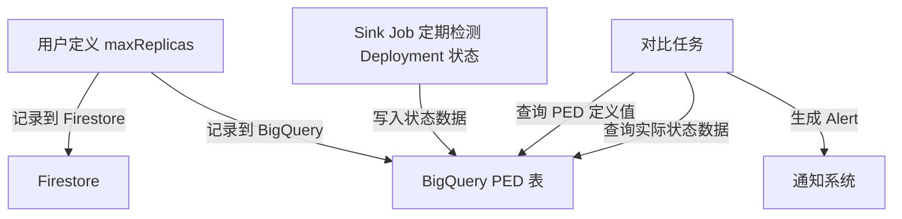
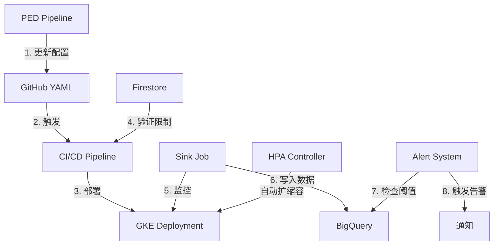

# Chatgpt 

针对你的需求，可以采用以下设计方案：

### 核心流程设计

1. **PED 阶段记录 maxReplicas 值**  
   - 用户在 PED 阶段通过 YAML 文件定义 `maxReplicas`，此值应被记录到 Firestore 和 BigQuery 中，确保有一个历史版本记录。
   - 在 Firestore 中保存的值用于用户实时查询，而 BigQuery 中保存的值用于历史数据对比和审计。

2. **Sink Job 监控 Deployment 的实际状态**  
   - 部署一个 Sink Job（比如使用 Kubernetes 的 `Custom Controller` 或定时运行的 Job）来定期检查 Deployment 的状态，包括：
     - 实际 Pod 的副本数。
     - HPA (Horizontal Pod Autoscaler) 当前设置的最大副本数 `maxReplicas`。
   - Sink Job 将检查到的数据写入 BigQuery 的表中，字段包括：
     - Deployment 名称。
     - 实际副本数。
     - HPA 当前配置的 `maxReplicas`。
     - 检查时间戳。

3. **比较 PED 定义的 `maxReplicas` 与实际状态**  
   - 定期运行一个对比任务（可以是 Cloud Function 或 Dataflow），从 BigQuery 中查询以下数据：
     - 用户在 PED 阶段定义的 `maxReplicas`。
     - Sink Job 检测到的实际副本数和 HPA 设置。
   - 如果检测到差异，比如实际副本数超出了 PED 定义的 `maxReplicas`，生成一条 Alert 并发送通知。

4. **通知机制**  
   - 使用 Alerting 系统（如 Google Cloud Monitoring 或自定义通知系统）：
     - 检测到不符合 PED 定义值的情况时，生成报警。
     - 通知内容可以包括 Deployment 名称、当前副本数、PED 定义的值、HPA 最大值等信息。

---

### 设计示意流程图



---

### 设计关键点

1. **Sink Job 数据设计**  
   BigQuery 的 Sink 表需要包含以下字段：
   | deployment_name | actual_replicas | hpa_max_replicas | check_timestamp      |
   |------------------|-----------------|------------------|----------------------|
   | example-api      | 6               | 8                | 2024-12-24 12:00:00 |

2. **Alert 检测逻辑**  
   比较规则：
   - 如果 `actual_replicas > PED 定义的 maxReplicas`。
   - 如果 `hpa_max_replicas > PED 定义的 maxReplicas`。
   - 触发条件满足后，生成通知。

3. **HPA 的最大值管理策略**  
   - 用户可以在 CD 阶段自定义 `maxReplicas`，但需要通过 PED 阶段定义的值进行约束。
   - **你的问题中提到是否需要 BigQuery 数据**：
     - 如果用户已经有明确的 YAML 定义，则直接用 YAML 中的值，并用 Sink Job 监控即可。
     - 如果希望保持一致性（不允许随意定义），则在 Pipeline CD 阶段强制通过 BigQuery 获取 `maxReplicas`。

4. **选用通知工具**  
   - 推荐使用 Google Cloud Monitoring 设置指标和报警规则。
   - 结合 Slack、邮件、或 PagerDuty 通知团队。

---

### 总结

你的设计可以分为以下步骤：
1. **记录 PED 定义值**：通过 Pipeline 自动写入 Firestore 和 BigQuery。
2. **Sink Job 监控**：定期获取 Deployment 状态和 HPA 配置，写入 BigQuery。
3. **对比并报警**：定期查询 BigQuery，比较 PED 值和实际状态，生成报警。
4. **通知用户**：通过通知工具发送 Alert，提醒异常配置或实际状态超限。

通过这种方式，既能实现对实际运行状态的监控，也能确保 PED 定义的约束被有效遵守，避免不符合策略的配置。


# Claude 
我理解您的需求，让我帮您分析一下这个监控方案的设计。我建议将这个方案分成几个关键部分来实现：




基于您的需求，我建议以下实现方案：

1. **数据记录层面**：
   - PED阶段定义的maxReplicas值存储在BigQuery中作为基准值
   - Sink Job持续监控实际Pod数量并记录到BigQuery
   - 每条记录包含：deploymentName, timestamp, definedMaxReplicas, actualReplicas

2. **监控策略**：
   - 实现一个专门的监控服务，定期比对以下值：
     - PED定义的maxReplicas (来自BigQuery)
     - 实际运行的Pod数量 (来自Sink Job)
     - HPA配置的最大值 (来自K8s API)

3. **告警机制**：
   - 当检测到以下情况时触发告警：
     - 实际Pod数量超过PED定义值
     - HPA配置的最大值与PED定义值不一致
     - Pod数量突然发生大幅变化

4. **关于CD阶段的HPA值获取**：
   建议采用如下方式：
   - 让用户在CD阶段必须从BigQuery获取PED定义的值
   - 实现一个简单的API服务，封装BigQuery查询，供CD pipeline调用
   - 这样可以确保值的一致性，并且便于审计

5. **具体实现建议**：


```python
from google.cloud import bigquery
from kubernetes import client, config
import datetime

class PodMonitoringService:
    def __init__(self):
        self.bq_client = bigquery.Client()
        config.load_incluster_config()
        self.k8s_client = client.AppsV1Api()

    def get_ped_defined_replicas(self, deployment_name):
        query = f"""
            SELECT definedMaxReplicas
            FROM `project.dataset.ped_configs`
            WHERE deploymentName = @deployment_name
            ORDER BY timestamp DESC
            LIMIT 1
        """
        query_params = [
            bigquery.ScalarQueryParameter("deployment_name", "STRING", deployment_name)
        ]
        job_config = bigquery.QueryJobConfig(query_parameters=query_params)
        results = self.bq_client.query(query, job_config=job_config)
        row = next(results)
        return row.definedMaxReplicas

    def get_actual_pod_count(self, deployment_name, namespace):
        deployment = self.k8s_client.read_namespaced_deployment(
            name=deployment_name,
            namespace=namespace
        )
        return deployment.status.replicas

    def check_and_alert(self, deployment_name, namespace):
        ped_replicas = self.get_ped_defined_replicas(deployment_name)
        actual_replicas = self.get_actual_pod_count(deployment_name, namespace)

        if actual_replicas > ped_replicas:
            self.send_alert(
                f"Warning: {deployment_name} has {actual_replicas} replicas, "
                f"exceeding defined maximum of {ped_replicas}"
            )

    def send_alert(self, message):
        # 实现告警逻辑，可以是发送到Slack、邮件等
        pass

    def record_metrics(self, deployment_name, namespace):
        actual_replicas = self.get_actual_pod_count(deployment_name, namespace)
        
        # 记录到BigQuery
        query = f"""
            INSERT INTO `project.dataset.pod_metrics`
            (deploymentName, timestamp, actualReplicas)
            VALUES (@deployment_name, @timestamp, @replicas)
        """
        job_config = bigquery.QueryJobConfig(
            query_parameters=[
                bigquery.ScalarQueryParameter("deployment_name", "STRING", deployment_name),
                bigquery.ScalarQueryParameter("timestamp", "TIMESTAMP", datetime.datetime.now()),
                bigquery.ScalarQueryParameter("replicas", "INTEGER", actual_replicas),
            ]
        )
        self.bq_client.query(query, job_config=job_config)

```

6. **最佳实践建议**：
   - 实现幂等性：确保监控服务可以安全地重复运行
   - 添加适当的重试机制：处理临时性故障
   - 实现详细的日志记录：便于问题排查
   - 设置合适的监控频率：建议5-15分钟检查一次
   - 实现监控服务的高可用：考虑部署多个副本

您觉得这个方案是否满足您的需求？我们可以根据您的具体情况进行调整。特别是关于告警阈值和监控频率，这些都可以根据您的实际需求来配置。


# Gemini2 

我理解你需要监控用户 API Deployment 的 `replicas` 数量变化，并对比用户在 PED 阶段申请的值，从而检测是否发生了超出预期的调整，并触发告警。

你的想法方向是对的，我来帮你梳理一下整体设计，并提供一些更具体的建议：

**整体架构设计**

1.  **数据来源:**
    *   **PED 申请值 (maxReplicas):**  保存在 BigQuery 中，作为基准值。
    *   **实际 Pod 数量:** 从 GKE 集群中实时获取，通过 Sink Job 将数据写入 BigQuery。这里需要同时监控 Deployment 和 HPA (如果使用了 HPA)。

2.  **监控流程:**
    *   **Sink Job:** 定期运行，负责从 GKE 集群中获取 Deployment 和 HPA (如果有) 的 `replicas` 数量信息，并写入 BigQuery。
    *   **数据对比:** 定期运行一个数据处理任务 (例如 SQL 查询、Cloud Functions)，将 BigQuery 中的 PED 申请值与 Sink Job 写入的实际 Pod 数量进行比较。
    *   **告警:** 如果实际 Pod 数量超出 PED 申请的最大值 (或你定义的其他阈值)，则触发告警。

3.  **告警方式:** 可以选择 Email、Slack、PagerDuty 等多种告警方式。

**具体实现建议**

1.  **Sink Job:**

    *   **数据采集:**
        *   使用 Kubernetes API 客户端 (例如 Go 客户端库) 与 GKE 集群交互。
        *   可以获取 Deployment 的 `status.replicas` 字段来获取当前期望的 Pod 数量。
        *   如果使用了 HPA，需要获取 HPA 的 `status.currentReplicas` 字段来获取当前的实际 Pod 数量。
        *   同时，可以获取 Deployment 或者 HPA 的 metadata 中的 `labels` 字段来标识对应的 API 和 Team。
    *   **数据写入:**
        *   将采集到的数据写入 BigQuery，包括时间戳、Deployment/HPA 名称、命名空间、`replicas` 数量、以及对应的 API 和 Team 的标识。
        *   **表结构设计:** 考虑以下字段：
            *   `timestamp`: 数据采集时间戳
            *   `resource_type`:  'deployment' 或 'hpa'
            *   `namespace`: Deployment/HPA 所在的命名空间
            *   `name`: Deployment/HPA 的名称
            *   `replicas`:  Pod 的数量
            *   `api_id`: API 的标识符 (从 Deployment 或 HPA 的 labels 中获取)
            *   `team_id`: Team 的标识符 (从 Deployment 或 HPA 的 labels 中获取)
    *   **运行频率:** 可以根据实际需要，选择合适的运行频率，例如每分钟或每 5 分钟运行一次。

2.  **数据对比 & 告警:**

    *   **数据读取:**
        *   从 BigQuery 中读取 PED 申请的 `maxReplicas` 值 (根据 `api_id` 和 `team_id` 查询)。
        *   从 BigQuery 中读取 Sink Job 写入的实际 `replicas` 值 (根据 `api_id`, `team_id`, 和时间范围查询)。
    *   **数据比较:**
        *   比较 PED 申请的 `maxReplicas` 值与实际 `replicas` 值，判断是否超出阈值。
        *   可以考虑定义不同的阈值，例如超过 `maxReplicas` 一定比例或数量时触发告警。
    *   **告警触发:**
        *   如果超出阈值，则发送告警通知。
        *   告警内容可以包括 API 名称、Team 名称、PED 申请的 `maxReplicas` 值、实际 `replicas` 值、以及发生告警的时间。
    *   **运行频率:** 与 Sink Job 的频率保持一致或略低即可，例如每 5 分钟运行一次。
    *   **实现方式:**
        *   可以使用 BigQuery 的 Scheduled Queries 来执行定期查询和数据对比。
        *   可以使用 Cloud Functions 或 Cloud Run 来实现数据读取、比较和告警触发。
        *   可以使用 Dataflow 来进行数据处理。

**一些细节考虑**

*   **HPA:**
    *   如果 API 使用了 HPA，你需要监控的是 HPA 的 `status.currentReplicas` 字段，而不是 Deployment 的 `status.replicas`。
    *   你需要考虑 HPA 的最大副本数，以及是否需要将 HPA 的设置也纳入监控范围。
*   **冷启动:**
    *   在 API 刚启动时，可能会出现实际 `replicas` 数量低于 PED 申请值的情况，需要避免误报。
    *   可以设置一个延迟时间，在 API 启动一段时间后再进行数据比较和告警。
*   **告警去重:**
    *   避免重复发送告警，可以记录已经发送的告警，只在状态发生变化时发送新的告警。
*   **数据清洗:**
    *   需要考虑处理异常数据，例如 Sink Job 写入失败，或者 BigQuery 中缺少 PED 申请数据的情况。
*   **数据安全:**
    *   确保 Sink Job 和数据处理任务具有访问 GKE 集群和 BigQuery 的权限。

**总结**

你的想法是可行的，通过 Sink Job 将 GKE 集群的 `replicas` 信息写入 BigQuery，然后对比 BigQuery 中的 PED 申请值，可以有效地监控 API Deployment 的 `replicas` 数量变化。

我提供的建议主要是在你的想法基础上进行了一些细化和补充，希望能帮助你更好地实现你的需求。

如果你在具体实现过程中遇到问题，可以随时向我提问。


你说得对，我之前的回复中确实忽略了用户在 CD 阶段如何获取 HPA 最大值的问题，这很重要。

你的观点非常合理：**用户在 CD 阶段应该自己定义 HPA 的最大值，而不是从 BigQuery 中获取。** 你的平台应该只负责监控 PED 定义的值和 Sink Job 获取的值，而不应该干预用户的 CD 过程。

**原因如下：**

1.  **职责分离:** 你的平台负责策略控制（通过 PED 和 Firestore/BigQuery），而用户的 CI/CD 流程负责部署和配置。两者应该解耦。
2.  **灵活性:** 强制用户从 BigQuery 获取 HPA 最大值会降低用户的灵活性。用户可能需要根据实际情况调整 HPA 参数，如果必须从 BigQuery 获取，则会增加操作复杂度。
3.  **版本管理:** 用户的 CD 配置 (例如 Deployment/HPA 的 YAML) 应该由用户自己管理，而不是依赖你的平台的 BigQuery 数据。
4.  **CD 流程的惯性:** 用户已经习惯在 CD 配置中定义 HPA 的最大值，强制更改会引入不必要的麻烦。

**修改后的监控策略**

基于以上考虑，我来修改一下我的监控策略：

1.  **PED 阶段:**
    *   用户在 PED 阶段定义 `maxReplicas` 值，此值被记录到 BigQuery 中（作为基准值）。
    *   这个 `maxReplicas` 值**不直接**用于用户的 CD 配置。用户可以参考这个值，但他们可以自由定义自己 HPA 的最大值。

2.  **CD 阶段:**
    *   用户在 CD 配置中定义 Deployment 和 HPA 的参数，包括 HPA 的 `maxReplicas`。
    *   你的平台**不干预**此配置。

3.  **Sink Job:**
    *   Sink Job 仍然定期从 GKE 集群中获取 Deployment 和 HPA 的实际 `replicas` 数量，写入 BigQuery。
    *   Sink Job **不再获取 HPA 的最大值**，因为它不应作为基准值。

4.  **数据对比 & 告警:**
    *   **比较 PED 的 `maxReplicas` 值和实际 Pod 数量:**
        *   从 BigQuery 中读取 PED 阶段的 `maxReplicas` 值。
        *   从 BigQuery 中读取 Sink Job 写入的实际 Pod 数量（Deployment 的 `status.replicas` 和 HPA 的 `status.currentReplicas`）。
        *   对比两者，如果实际 Pod 数量（无论是 Deployment 还是 HPA 的值）超过 PED 定义的 `maxReplicas`，则触发告警。
    *   **告警逻辑:** 仅当实际运行的 Pod 数量超过 PED 中定义的最大值时才触发告警，而**不关心用户在 CD 配置中如何定义 HPA 最大值**。

**解释**

*   **PED 的 `maxReplicas` 是策略限制:** 它代表了你的平台允许的最大 Pod 数量。
*   **用户的 HPA `maxReplicas` 是部署配置:** 它代表了用户期望的 HPA 的最大 Pod 数量。

你的平台只需要关心的是用户的实际 Pod 数量是否违反了 PED 定义的策略，而不需要关心用户在 CD 配置中是如何设置 HPA 的。

**优势**

*   **职责清晰:** 你专注于策略控制，用户专注于应用部署。
*   **灵活性:** 用户可以自由地调整 HPA 参数。
*   **可维护性:** 降低了平台的复杂度。
*   **符合用户习惯:** 保持了用户现有的 CI/CD 流程不变。

**总结**

感谢你指出我之前的错误，这个调整使得监控策略更加合理。 现在的方案中，你的平台只负责监控实际运行的 Pod 数量是否超过 PED 定义的 `maxReplicas`，而不再关心用户是如何定义 HPA 的。

这样既能满足你的安全和策略需求，又能保持用户部署的灵活性和自主性。

