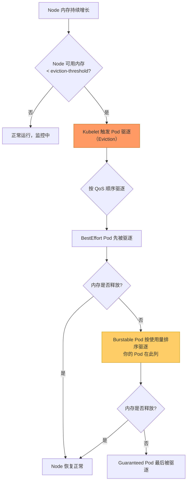
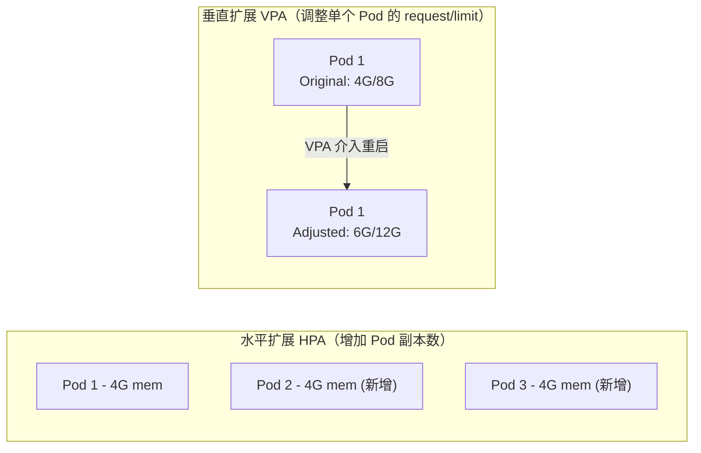
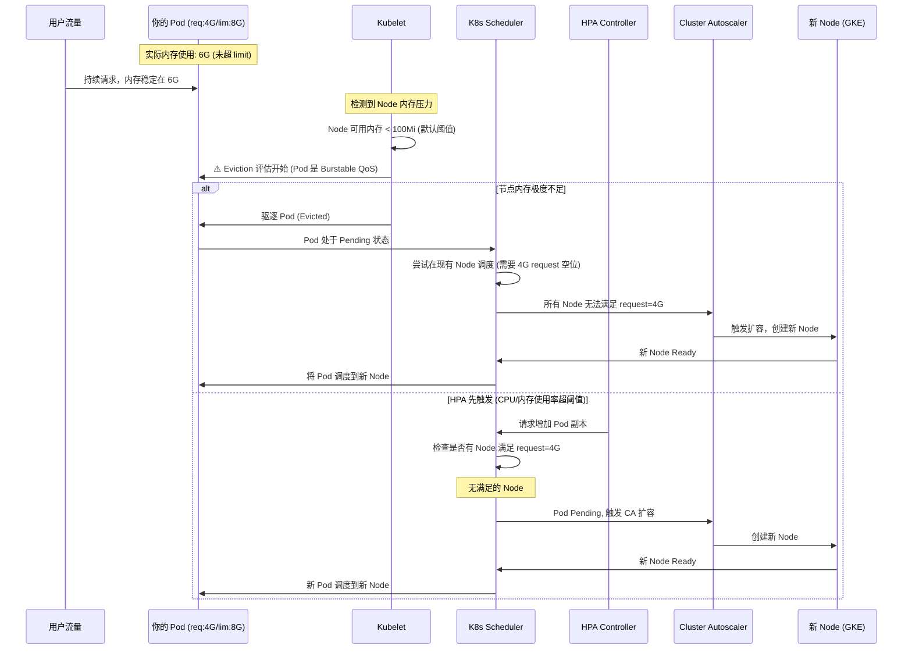
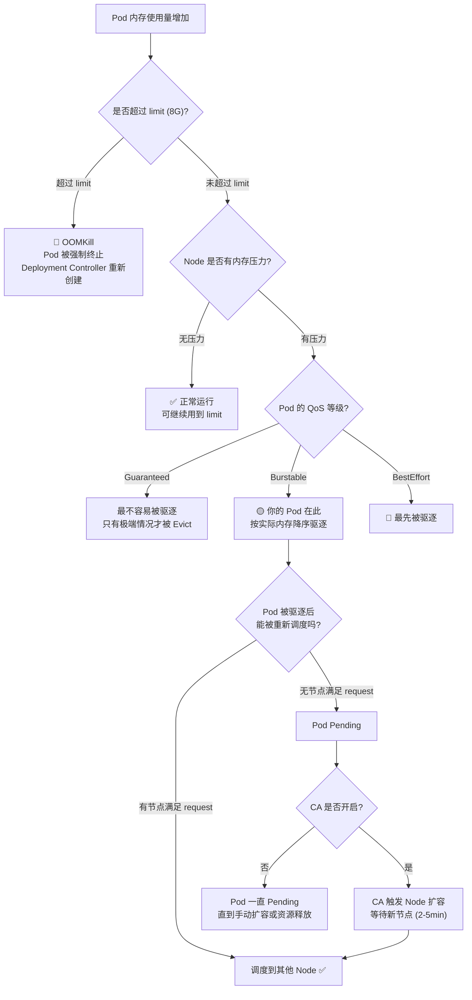
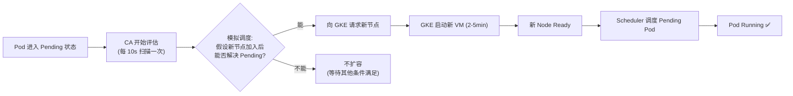
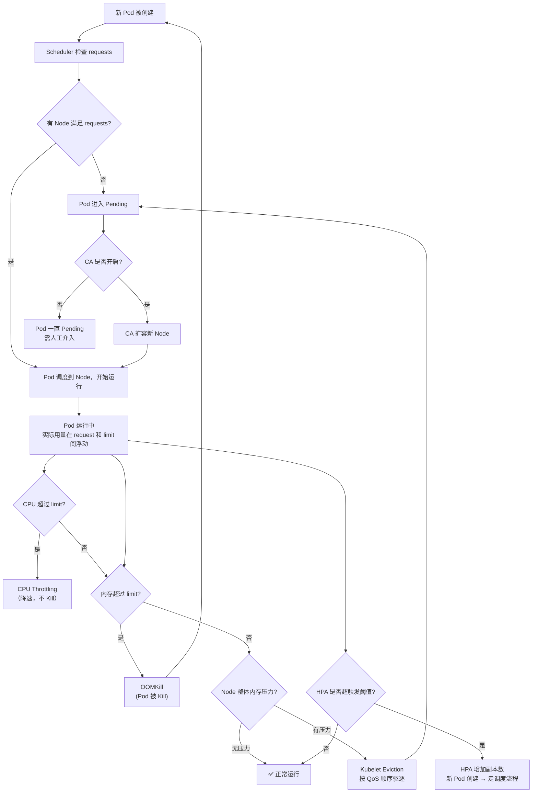

# Kubernetes 资源调度与自动扩缩容深度解析

> **核心问题**：`request: 4G / limit: 8G` 的 Pod 正在使用 6G 内存（未达 Limit），但它所在的 Node 已经没有资源了，会发生什么？横向扩展和纵向扩展分别在什么时候触发？

---

## 1. 理解资源的两个核心概念

```
┌──────────────────────────────────────────────────────────┐
│                  K8s 资源模型                             │
│                                                          │
│  requests          limits                                │
│  ─────────         ─────────                             │
│  调度的"门票"       运行的"天花板"                           │
│  Scheduler 看这里   Kubelet 限制这里                        │
│                                                          │
│  ├─── 4G request ──────────── 8G limit ────▶             │
│  ↑ 节点至少要有这么多   ↑ Pod 用到这里就会 OOMKill          │
│  "空位"才能落地        （内存），或被 throttle（CPU）         │
└──────────────────────────────────────────────────────────┘
```

| 属性 | requests | limits |
| :--- | :--- | :--- |
| **作用阶段** | 调度阶段（Scheduler 筛选节点） | 运行阶段（Kubelet/cgroup 限制） |
| **超出时行为（CPU）** | N/A | CPU throttling（限速，不 Kill） |
| **超出时行为（内存）** | N/A | OOMKill（Pod 被 Kill，然后重启） |
| **影响 QoS 等级** | 是 | 是 |

---

## 2. QoS 等级决定你的 Pod 有多"高贵"

QoS 等级是 K8s 在节点资源紧张时，决定**先驱逐谁**的标准：

| QoS 等级 | 条件 | 被驱逐优先级 | 你的场景（request 4G / limit 8G） |
| :--- | :--- | :---: | :--- |
| **Guaranteed** | requests == limits | 最后被驱逐 | ❌ 不满足（4G ≠ 8G） |
| **Burstable** | requests < limits，且任一有设置 | 中等 | ✅ **你的 Pod 是这个** |
| **BestEffort** | requests 和 limits 均未设置 | **最先** 被驱逐 | ❌ 不适用 |

> **注意**：你的 Pod 是 `Burstable`。当节点内存不足时，`BestEffort` 先被 Kill，然后才轮到你的 Pod。

---

## 3. 你的核心场景：Pod 用了 6G，节点没资源了

### 3.1 发生的原因分析

```
Pod 的 request = 4G，limit = 8G
Pod 实际使用 = 6G（在 limit 内，正常！）

Node 上的其他 Pod 也在扩张，
导致 Node 整体内存被压满 → Node 进入内存压力状态
```

这里有个重要认知：

> **Pod 用 6G 没有超过 limit（8G），所以这个 Pod 本身不会因为"超限"被 OOMKill。**
> 但是它可能因为"Node 级别内存压力（Memory Pressure）"而被驱逐。

### 3.2 Node 内存压力触发机制



**Kubelet 的默认 Eviction 阈值**（硬驱逐）：
- `memory.available < 100Mi` → 开始强制驱逐
- `nodefs.available < 10%` → 磁盘不足驱逐

---

## 4. 横向扩展 vs 纵向扩展：K8s 的扩缩策略

K8s 默认**不支持纵向自动扩展（Vertical Scaling of running Pod）**，必须通过特定组件实现。这是两个维度完全不同的扩缩：



| 维度 | **HPA 水平扩展** | **VPA 垂直扩展** | **CA 节点扩展** |
| :--- | :--- | :--- | :--- |
| **扩什么** | 增加 Pod 副本数 | 调整单个 Pod 的资源规格 | 增加 Node 节点数 |
| **触发信号** | Pod CPU/内存使用率超阈值 | Pod 实际需求超出 request 一段时间 | Pending Pod 无法被调度 |
| **对现有 Pod 影响** | 不重启，新建 Pod | **需要重启 Pod**（当前 K8s 限制） | 不影响 |
| **是否 K8s 原生默认启用** | ❌ 需手动配置 | ❌ 需安装 VPA 组件 | ❌ GKE 需启用 CA |
| **何时适合** | 无状态服务，流量弹性 | 资源规格难以估算的服务 | Pod 调度失败时 |

---

## 5. 完整的扩缩容时序图（你的场景）

### 5.1 从 Pod 运行正常 → Node 紧张 → 触发扩展的全流程



### 5.2 关键时序拆解

```
T+0s   Pod 使用 6G 内存（正常，limit=8G，未超）
T+Xs   Node 其他 Pod 也在涨，Node 整体内存耗尽
T+Xs   Kubelet 检测到 memory pressure
T+Xs   Kubelet 开始 Eviction：BestEffort → Burstable (你的 Pod)
T+Xs   你的 Pod 被驱逐，状态变为 Pending
T+10s  Scheduler 尝试调度 Pending Pod（需要找到有 4G 空余的 Node）
T+10s  所有 Node 都没有足够空间 → Pod 继续 Pending
T+15s  CA 检测到 Pending Pod（CA 扫描间隔约 10-15s）
T+15s  CA 决定扩容，向 GKE API 请求新节点
T+4min 新 Node 创建完成，状态变 Ready（GKE 通常 2-5 分钟）
T+4min Scheduler 将 Pending Pod 调度到新 Node
T+4min Pod 拉镜像、启动、通过 readinessProbe
T+5min Pod Running，业务恢复
```

> ⚠️ **关键认知**：你的 Pod 使用 6G 内存（未超 limit 8G）**不会被 OOMKill**，但会因为 **Node 级别的内存压力被 Kubelet Evict**。这两个是完全不同的机制！

---

## 6. 不同情况下 Pod 的命运（完整决策树）



---

## 7. 横向扩展（HPA）的工作机制

### 7.1 HPA 触发信号

HPA 的扩缩是基于**每个 Pod 相对于其 request 的资源使用率**，而不是绝对值：

```
HPA 计算公式:
desiredReplicas = ceil(currentReplicas × (currentMetricValue / desiredMetricValue))

示例:
- 当前 2 个 Pod，每个 Pod CPU request = 1 core
- 2 个 Pod CPU 总用量 = 1.6 core
- 平均使用率 = (1.6 / 2) / 1.0 × 100% = 80%
- HPA 目标 = 70%
- 期望副本数 = ceil(2 × (80% / 70%)) = ceil(2.28) = 3 个 Pod
```

### 7.2 HPA 最小配置（兼顾内存与 CPU）

```yaml
apiVersion: autoscaling/v2
kind: HorizontalPodAutoscaler
metadata:
  name: myapp-hpa
spec:
  scaleTargetRef:
    apiVersion: apps/v1
    kind: Deployment
    name: myapp
  minReplicas: 2        # 至少保持 2 个副本（提高可用性）
  maxReplicas: 10
  metrics:
  - type: Resource
    resource:
      name: cpu
      target:
        type: Utilization
        averageUtilization: 65    # Pod CPU 超过 request 的 65% 时扩
  - type: Resource
    resource:
      name: memory
      target:
        type: Utilization
        averageUtilization: 75    # Pod 内存超过 request 的 75% 时扩
  behavior:
    scaleUp:
      stabilizationWindowSeconds: 60    # 避免启动峰值误扩容
      policies:
      - type: Pods
        value: 2
        periodSeconds: 60             # 每分钟最多增加 2 个 Pod
    scaleDown:
      stabilizationWindowSeconds: 300   # 缩容前保持 5 分钟稳定期
```

> **⚠️ 关键提示**：HPA 的内存使用率是基于 **request** 的百分比，不是 limit。你的 Pod request=4G，如果实际用了 6G，使用率 = 6/4 = `150%`。如果你设 `averageUtilization: 75`，那 150% > 75%，HPA 早就会触发扩容了！

---

## 8. CA 节点扩容的触发条件与时序

GKE 的 Cluster Autoscaler 不是基于 CPU 使用率工作的，而是基于**Pod 调度状态**：



**CA 不扩容的常见原因**（容易踩坑）：

| 情况 | 原因 | 解决方法 |
| :--- | :--- | :--- |
| Pod 有 `nodeSelector` 但没有匹配节点 | CA 无法找到合适的 Pool 扩容 | 确认 Node Pool 满足 Pod 的亲和性要求 |
| Pod 有 `PodAntiAffinity` 强规则 | 新节点加入也满足不了 Anti-affinity | 放松 Anti-affinity 或增加更多 Node Pool |
| 已达到 Node Pool 的 `maxNodes` | CA 已达上限 | 提高 `--max-nodes` 或申请配额 |
| Pod 有 `safe-to-evict: false` 注解 | CA 认为节点无法被缩容，也就不会积极扩 | 仅对关键 Pod 使用此注解 |

---

## 9. 不启用 HPA / CA 时的默认情况

如果你**什么都没配置**，K8s 的默认行为是：

| 场景 | 默认行为 |
| :--- | :--- |
| Pod 使用量增加，超出 CPU request | Pod 可以借用节点空闲 CPU，但超过 limit 后被 throttle |
| Pod 内存增加，超出 limit | OOMKill（立即 Kill，Deployment Controller 重新创建） |
| Node 内存被压满 | Kubelet 按 QoS/使用量驱逐 Pod，被驱逐的 Pod 进入 Pending |
| Pod 进入 Pending，没有节点满足调度 | Pod **永久 Pending**，直到人工扩容或其他 Pod 释放资源 |
| 流量增大，单个 Pod 处理不过来 | **没有自动扩容**，响应延迟增加，直到熔断或超时 |

---

## 10. 针对你场景的最佳实践建议（request 4G / limit 8G）

### 10.1 QoS 选择建议

```
你的 Pod: request=4G, limit=8G → Burstable

建议评估:
- 如果你的服务是核心服务（如 Ingress Gateway，Payment API）
  → 考虑把 request 提高到 8G，使 request=limit，QoS 变 Guaranteed
  → 代价：节点需要有 8G 的空位，调度更难，但不会被 Evict

- 如果服务允许偶尔重启（如批处理，内部工具）
  → 保持 Burstable 即可，request=4G, limit=8G 是合理的
```

### 10.2 监控与告警配置（建议必备）

```bash
# 查看当前 Pod 资源实际使用
kubectl top pods -n <namespace> --sort-by=memory

# 查看某节点的资源分配情况
kubectl describe node <node-name> | grep -A 10 "Allocated resources"

# 查看集群 CA 状态（是否在扩容）
kubectl -n kube-system describe configmap cluster-autoscaler-status
```

### 10.3 建议配置三原则

```
原则 1：request 要设置成你"确定需要"的量，不要太低
         ↳ request 太低 → Pod 容易被别人抢占，也容易被 Evict

原则 2：limit 最多设置为 request 的 2 倍
         ↳ request:4G / limit:8G 是合理的
         ↳ request:1G / limit:16G 就很危险（16G 杠杆太高）

原则 3：高可用服务开启 HPA + PodDisruptionBudget
         ↳ HPA 保证弹性，PDB 保证升级/驱逐时始终有副本在线
```

---

## 11. 完整资源调度流程图（总览）



---

## 参考链接

- [K8s 资源 requests 与 limits 官方文档](https://kubernetes.io/docs/concepts/configuration/manage-resources-containers/)
- [K8s QoS 等级官方文档](https://kubernetes.io/docs/tasks/configure-pod-container/quality-service-pod/)
- [K8s HPA 官方文档](https://kubernetes.io/docs/tasks/run-application/horizontal-pod-autoscale/)
- [GKE Cluster Autoscaler](https://cloud.google.com/kubernetes-engine/docs/concepts/cluster-autoscaler)
- [K8s Pod Eviction 机制](https://kubernetes.io/docs/concepts/scheduling-eviction/node-pressure-eviction/)
