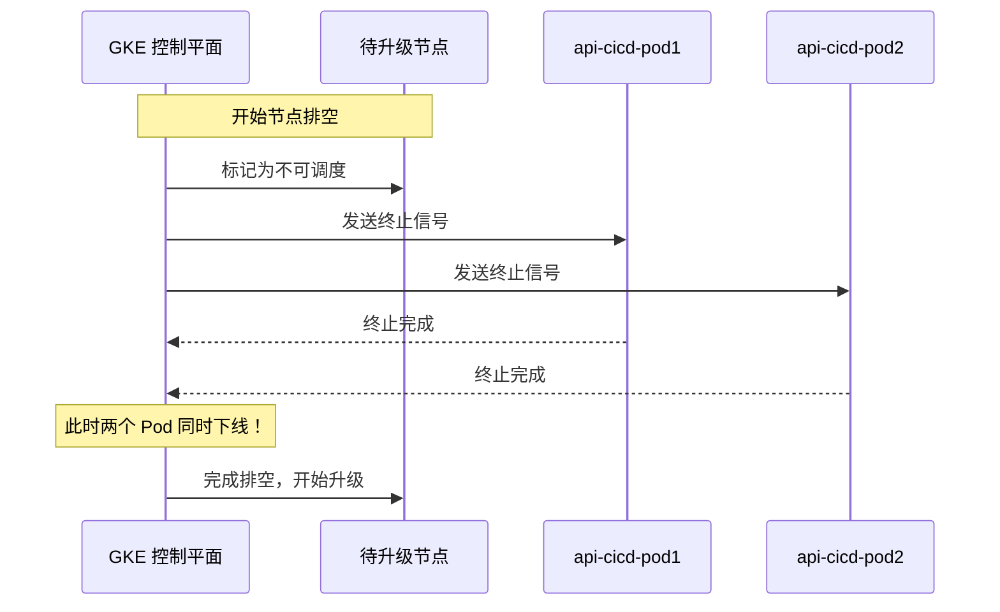
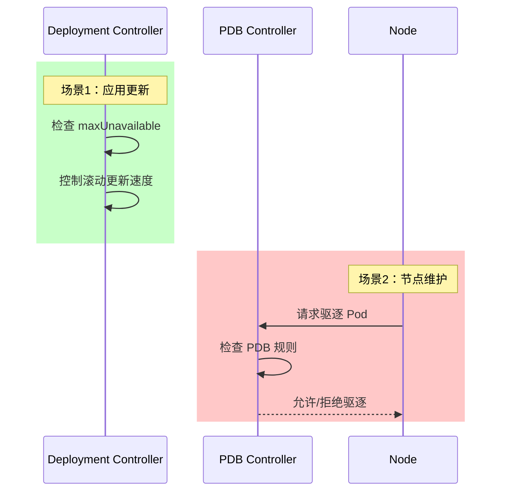
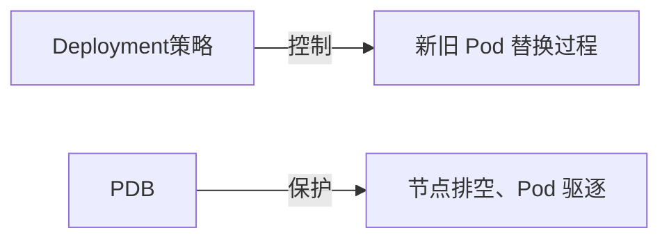

以下是针对GKE升级时高可用性设计的核心知识点及配置建议：

---

一、GKE升级的核心影响
Master节点升级  
   GKE的Master节点由Google自动管理，升级时控制平面（API Server、调度器等）会短暂不可用（通常秒级）。Google通过多副本和区域冗余保证高可用[1]。建议：
   - 选择维护窗口以减少影响
   - 启用Regional Cluster（多可用区部署）提升容灾能力

Cluster节点池（Node Pool）升级  
   节点池升级采用滚动更新策略，默认逐个节点排空（Drain）并替换。影响包括：
   - Pod驱逐导致短暂服务中断
   - 节点自动缩放可能触发资源波动  
   建议：分批次升级节点池，优先升级非关键业务池。

---

二、关键配置保障高可用
Deployment层面
   - `maxUnavailable`  
     控制滚动更新时允许不可用的Pod比例（如`maxUnavailable: 25%`），避免流量损失。
     ```yaml
     strategy:
       rollingUpdate:
         maxSurge: 2
         maxUnavailable: 1
       type: RollingUpdate
     ```
   - Pod反亲和性（Anti-Affinity）  
     分散Pod到不同节点，防止单节点故障：
     ```yaml
     affinity:
       podAntiAffinity:
         requiredDuringSchedulingIgnoredDuringExecution:
         - labelSelector:
             matchLabels:
               app: my-app
           topologyKey: "kubernetes.io/hostname"
     ```

集群层面
   - PodDisruptionBudget (PDB)  
     定义驱逐Pod时的最小可用实例数或最大不可用比例：
     ```yaml
     apiVersion: policy/v1
     kind: PodDisruptionBudget
     metadata:
       name: my-pdb
     spec:
       minAvailable: 1  # 或使用 maxUnavailable: 1
       selector:
         matchLabels:
           app: my-app
     ```
   - Graceful Node Shutdown  
     配置`terminationGracePeriodSeconds`（默认30秒）确保Pod优雅终止。

---

三、进阶实践建议
多可用区（Multi-Zone）部署  
  将节点池分布到多个可用区，结合`topologySpreadConstraints`实现跨区域容灾。
预检验证  
  使用`kubectl drain --dry-run`模拟节点排空，观察PDB约束是否生效。
监控与告警  
  监控升级期间的节点就绪状态、Pending Pods等指标，设置Prometheus/Cloud Monitoring告警。

---

通过以上策略，可在GKE升级时最大限度保障业务连续性。实际场景中需结合负载特征调整参数（如PDB阈值、滚动更新速度）。
# thinking 
用户现在想了解PodDisruptionBudget（PDB）的详细信息，并且提到他们的服务目前没有配置这个。之前对话中，用户已经接触到了PDB作为解决方案的一部分，现在需要更深入的解释。我需要先确认用户对PDB的了解程度，然后从基础开始解释。

首先，用户可能知道PDB是用来保证在节点维护时不至于所有Pod同时被终止，但具体机制可能不清楚。需要解释PDB的作用、为什么需要它，以及如何配置。用户提到他们的服务没有这个配置，所以可能需要强调不配置PDB的风险，比如在节点升级时服务中断的可能性增加。

接下来，用户可能想知道PDB如何与其他策略（如反亲和性、HPA）配合使用。需要结合之前的建议，说明PDB是整体高可用性策略的一部分。可能需要举例子，比如当节点被排空时，PDB确保至少有一定数量的Pod保持运行，避免所有副本同时被终止。

另外，用户可能对如何实际应用PDB到他们的服务中感兴趣，所以需要提供具体的配置示例，包括minAvailable和maxUnavailable的区别，以及如何根据服务需求选择合适的参数。还要注意提醒用户，PDB只影响自愿中断（如节点升级），而不是非自愿中断（如硬件故障）。

还要考虑用户可能混淆PDB和其他资源如HPA或反亲和性的作用，需要明确PDB的独特之处。比如，反亲和性确保Pod分布在不同的节点，而PDB确保在节点排空时保留足够的Pod数量，两者互补。

另外，用户可能关心在GKE环境中PDB的具体表现，比如GKE的节点升级流程如何与PDB交互。需要解释当节点被排空时，GKE会检查PDB，确保不超过允许的中断数量，否则排空操作会被阻塞，直到满足条件。

最后，要确保用户理解配置PDB的步骤和验证方法，比如如何检查PDB的状态，如何测试其有效性。可能还需要提醒用户在实际使用中监控PDB的状态，确保其按预期工作，避免配置错误导致的问题。

总结下来，回答需要涵盖PDB的定义、作用、配置示例、与其他策略的关系、在GKE中的行为以及最佳实践。确保用户能够理解并应用PDB到他们的服务中，提高可用性。


PodDisruptionBudget（PDB）是 Kubernetes 中一个非常重要的资源对象，专门用于**控制自愿中断（Voluntary Disruptions）期间的最小服务可用性**。以下是深度解析：

---

### 一、PDB 核心概念
#### 1. 作用场景
当发生以下**计划内维护操作**时触发：
- 节点升级/维护（GKE 自动节点升级）
- 人工执行 `kubectl drain <node>`
- 集群自动扩缩（Cluster Autoscaler 缩容节点）
- 手动删除 Pod（`kubectl delete pod`）

#### 2. 与非自愿中断的区别
| 类型               | 示例                          | PDB 是否生效 |
|--------------------|------------------------------|-------------|
| 自愿中断（Voluntary）   | 节点排空、Pod 删除            | ✅ 生效       |
| 非自愿中断（Involuntary）| 节点宕机、硬件故障            | ❌ 不生效     |

---

### 二、PDB 关键配置参数
#### 1. 两种工作模式
```yaml
# 模式1：保证最小可用数量（推荐）
spec:
  minAvailable: 2  # 至少保持 2 个 Pod 运行

# 模式2：允许最大不可用数量
spec:
  maxUnavailable: 1  # 最多允许 1 个 Pod 不可用
```

#### 2. 选择策略建议
- **有状态服务**（如数据库）：优先使用 `minAvailable`
- **无状态服务**（如 API）：可使用 `maxUnavailable`
- **黄金比例**：假设总副本数为 N
  - `minAvailable: N-1`（允许中断 1 个）
  - `maxUnavailable: 1`（效果等价）

---

### 三、在 GKE 中的具体行为
当节点被排空（drain）时：
1. GKE 会检查所有受影响的 Pod 是否关联了 PDB
2. 计算若驱逐该节点上的 Pod 后：
   - 是否会导致 PDB 规则被违反
3. **决策逻辑**：
   - 如果驱逐会导致 PDB 违规 → 暂停排空操作
   - 否则 → 继续驱逐 Pod

#### 典型错误场景（未配置 PDB）：


---

### 四、具体配置示例
#### 1. 基础配置
```yaml
apiVersion: policy/v1
kind: PodDisruptionBudget
metadata:
  name: api-cicd-pdb
spec:
  minAvailable: 1  # 至少保留 1 个 Pod 可用
  selector:
    matchLabels:
      app: api-cicd
```

#### 2. 高级配置（百分比形式）
```yaml
spec:
  maxUnavailable: 30%  # 最多允许 30% 的 Pod 不可用
```

#### 3. 与 Deployment 的关联
```yaml
apiVersion: apps/v1
kind: Deployment
metadata:
  name: api-cicd
spec:
  replicas: 3
  template:
    metadata:
      labels:
        app: api-cicd  # 需要与 PDB 的 selector 匹配
```

---

### 五、最佳实践
#### 1. 副本数要求
- **最低要求**：PDB 需要至少 2 个副本才能生效
  - 单副本服务无法通过 PDB 保护
- **推荐配置**：`replicas >= 3`，`minAvailable: 2`

#### 2. 与其他组件的协同
| 组件                | 协同作用                      |
|---------------------|------------------------------|
| HPA                 | 确保有足够副本应对中断        |
| PodAntiAffinity     | 防止所有副本集中在同一节点    |
| Readiness Probe     | 精确判断 Pod 是否真正可用     |

#### 3. 验证命令
```bash
# 查看 PDB 状态
kubectl get pdb api-cicd-pdb

# 模拟排空测试
kubectl drain <node-name> --ignore-daemonsets --delete-emptydir-data
```

---

### 六、常见问题解答
#### Q1：PDB 会导致节点无法升级吗？
- 如果 PDB 规则限制了排空（如 `minAvailable` 过高），可能导致节点升级被阻塞
- 解决方案：结合 HPA 动态扩展副本数

#### Q2：如何监控 PDB 状态？
```bash
kubectl describe pdb api-cicd-pdb
```
关注输出中的：
```
Allowed disruptions: 1  # 当前允许中断的数量
Current: 3              # 健康 Pod 数量
```

#### Q3：多可用区部署时的注意事项？
- 建议结合 `topologySpreadConstraints` 实现跨 AZ 分布
- PDB 的 `minAvailable` 应按 AZ 数量调整

---

### 七、生产环境推荐配置
```yaml
apiVersion: policy/v1
kind: PodDisruptionBudget
metadata:
  name: api-cicd-pdb
spec:
  minAvailable: 60%  # 根据业务容忍度调整
  selector:
    matchLabels:
      app: api-cicd
---
apiVersion: apps/v1
kind: Deployment
metadata:
  name: api-cicd
spec:
  replicas: 4
  strategy:
    rollingUpdate:
      maxSurge: 1
      maxUnavailable: 25%
  template:
    metadata:
      labels:
        app: api-cicd
    spec:
      affinity:
        podAntiAffinity:
          requiredDuringSchedulingIgnoredDuringExecution:
          - labelSelector:
              matchLabels:
                app: api-cicd
            topologyKey: "kubernetes.io/hostname"
```

建议立即为关键服务添加 PDB 配置，可显著降低 GKE 维护期间的服务中断风险。


不是的，`Deployment` 中的 `maxUnavailable` 和 PDB 是两个完全不同的概念，它们的作用场景也不同：

1. **Deployment 的 maxUnavailable**
   - 作用于**滚动更新**场景
   - 控制更新过程中最多允许多少个 Pod 不可用
   - 只在 Deployment 执行更新时生效（如修改镜像版本）
   - 是 Deployment 控制器自己管理的行为

2. **PodDisruptionBudget (PDB)**
   - 作用于**集群维护**场景
   - 控制节点维护（drain）时的 Pod 可用性
   - 在节点升级、维护、缩容等操作时生效
   - 是集群级别的保护机制

举个例子：


所以：
1. 即使配置了 Deployment 的 `maxUnavailable`，也**必须配置 PDB**
2. 两者是互补的保护机制：
   - `maxUnavailable` 保护应用更新过程
   - `PDB` 保护节点维护过程

建议：
- 保留 Deployment 中的 `maxUnavailable` 配置
- 同时添加 PDB 配置，两者配合使用
- 可以让 PDB 的 `minAvailable` 值与 Deployment 的 `maxUnavailable` 相呼应

# different pdb 
如果Deployment里面已经有maxUnavailable这种配置,那么是否说明已经有了PDB?

嗯，用户问如果Deployment里面已经配置了maxUnavailable，是否意味着已经有了PodDisruptionBudget（PDB）。这个问题需要仔细分析。首先，我得回想一下Deployment和PDB各自的作用。

Deployment中的maxUnavailable是在滚动更新时控制不可用Pod的数量，属于更新策略的一部分。比如，设置maxUnavailable为25%，在更新时最多允许25%的Pod不可用，确保服务在更新期间仍有足够的实例处理请求。而PDB的作用是在节点维护或驱逐时，确保一定数量的Pod保持可用，属于中断预算管理，针对的是非更新的场景，比如节点升级或手动排空。

用户可能混淆了这两个配置，认为maxUnavailable已经覆盖了PDB的功能，但其实它们处理的是不同阶段的问题。用户可能没有配置PDB，当节点升级时，所有Pod可能被同时终止，导致服务中断。需要明确两者的区别，并说明即使Deployment有maxUnavailable，PDB仍然是必要的，因为它们处理不同类型的干扰。

此外，用户可能对Kubernetes的各种控制器和资源对象不太熟悉，需要简明扼要地解释两者的不同应用场景。比如，Deployment的滚动更新策略在应用新版本时生效，而PDB在节点维护或自动扩缩时保护Pod不被同时终止。需要举例说明，比如在GKE升级节点时，如果没有PDB，节点上的所有Pod可能被同时驱逐，导致服务中断，而PDB可以确保至少保留一定数量的Pod运行。

还要注意用户之前的问题中提到他们的服务没有配置PDB，所以需要强调即使Deployment有maxUnavailable，PDB仍然是独立的配置，必须单独设置才能生效。同时，提供具体的配置示例和最佳实践，帮助用户正确实施。

最后，可能需要提醒用户结合使用其他策略，如Pod反亲和性、HPA和就绪探针，以全面保障服务的高可用性。确保用户理解每个组件的作用和如何协同工作，从而避免因配置不当导致的服务中断。

你的问题触及了 Kubernetes 中两个关键但容易混淆的概念：**Deployment 的滚动更新策略** 和 **PodDisruptionBudget（PDB）**。以下是彻底的技术分析：

---

### 一、核心结论
**❌ 错误认知**  
Deployment 中的 `maxUnavailable`（滚动更新策略）和 PDB 的 `maxUnavailable` **完全无关**，它们作用于不同的场景。  
**即使 Deployment 配置了 `maxUnavailable`，你仍然需要单独配置 PDB！**

---

### 二、根本区别
#### 1. 作用阶段不同
| 配置位置          | 作用场景                          | 示例场景                     |
|-------------------|----------------------------------|-----------------------------|
| Deployment 的 `maxUnavailable` | **应用滚动更新时**                | 发布新版本镜像、修改环境变量 |
| PDB 的 `maxUnavailable`         | **节点维护/排空时**               | GKE 节点升级、人工执行 `kubectl drain` |

#### 2. 控制对象不同


---

### 三、场景模拟对比
#### 场景 1：滚动更新（Deployment 的 `maxUnavailable` 生效）
```yaml
# Deployment 配置示例
apiVersion: apps/v1
kind: Deployment
spec:
  strategy:
    rollingUpdate:
      maxUnavailable: 1  # 允许最多 1 个 Pod 不可用
      maxSurge: 1        # 允许最多新建 1 个超额 Pod
  replicas: 3
```
当执行 `kubectl set image` 触发更新时：  
- 旧 Pod 被逐个终止
- 新 Pod 逐步创建
- **始终保持至少 2 个 Pod 可用**

#### 场景 2：节点排空（需要 PDB 保护）
假设所有 Pod 在同一个节点且未配置 PDB：  
```bash
kubectl drain node-1 --ignore-daemonsets
```
结果：  
- 节点上所有 Pod 被**立即驱逐**
- 服务**完全中断**，直到新 Pod 在其他节点启动

---

### 四、配置 PDB 的必要性证明
#### 实验配置
```yaml
# 无 PDB 的 Deployment
apiVersion: apps/v1
kind: Deployment
metadata:
  name: no-pdb-demo
spec:
  replicas: 3
  strategy:
    rollingUpdate:
      maxUnavailable: 1
```

#### 模拟节点排空操作
```bash
# 查看 Pod 分布
kubectl get pods -o wide
# 输出显示所有 Pod 在 node-1 上

# 执行排空
kubectl drain node-1 --ignore-daemonsets
```
**结果**：  
- 所有 3 个 Pod 被**同时终止**
- 服务中断时间 = 新 Pod 调度 + 启动时间（通常 10-30 秒）

#### 对比实验（添加 PDB）
```yaml
apiVersion: policy/v1
kind: PodDisruptionBudget
metadata:
  name: pdb-demo
spec:
  maxUnavailable: 1
  selector:
    matchLabels:
      app: no-pdb-demo
```
再次执行排空：  
- GKE 会**逐个驱逐 Pod**（遵守 PDB 规则）
- 始终保持至少 2 个 Pod 可用
- **零服务中断**

---

### 五、生产环境推荐配置
#### 组合配置模板
```yaml
# Deployment 配置（处理滚动更新）
apiVersion: apps/v1
kind: Deployment
metadata:
  name: high-availability
spec:
  replicas: 4
  strategy:
    type: RollingUpdate
    rollingUpdate:
      maxUnavailable: 25%  # 更新时最多允许 1 个不可用
      maxSurge: 1          # 允许临时超过副本数 1 个

---
# PDB 配置（处理节点维护）
apiVersion: policy/v1
kind: PodDisruptionBudget
metadata:
  name: ha-pdb
spec:
  minAvailable: 75%  # 保证至少 3 个 Pod 可用
  selector:
    matchLabels:
      app: high-availability

---
# 反亲和性配置（防止节点级单点故障）
spec:
  affinity:
    podAntiAffinity:
      requiredDuringSchedulingIgnoredDuringExecution:
      - labelSelector:
          matchLabels:
            app: high-availability
        topologyKey: "kubernetes.io/hostname"
```

---

### 六、高级调试技巧
#### 1. 模拟 PDB 保护效果
```bash
# 查看允许的最大并发中断数
kubectl get pdb <pdb-name> -o jsonpath='{.status.disruptionsAllowed}'

# 强制超量驱逐（绕过 PDB，生产环境慎用）
kubectl drain <node> --disable-eviction --force --ignore-daemonsets
```

#### 2. 监控指标
```promql
# Prometheus 监控 PDB 状态
kube_poddisruptionbudget_status_current_healthy{namespace="production"}
kube_poddisruptionbudget_status_desired_healthy{namespace="production"}
```

#### 3. GKE 特性结合
```bash
# 查看节点排空计划
gcloud container operations list \
  --filter="TYPE=UPGRADE_NODES" \
  --format="json(status, targetLink, statusMessage)"
```

---

### 七、最终建议
1. **强制基线**：所有生产环境 Deployment 必须同时配置：
   - Deployment 的 `rollingUpdate` 策略
   - 匹配的 PDB
   - Pod 反亲和性

2. **容量规划**：
   - 总副本数 = PDB 要求的最小可用数 + 预期最大中断容忍数
   - 例如：`minAvailable: 3` 需要至少 4 个副本

3. **混沌测试**：
```bash
# 使用 chaos-mesh 模拟节点故障
kubectl apply -f https://mirrors.chaos-mesh.org/v2.1.2/node-failure.yaml
```

你的说法是完全正确的！Deployment 的 `maxUnavailable` 和 PDB 的 `maxUnavailable` (或 `minAvailable`) 确实是完全独立且作用于不同场景的配置。 让我来详细核对和比较它们的效果：

**核对:**

*   **Deployment 的 `maxUnavailable`:**  这个参数控制**滚动更新期间**可以同时不可用的 Pod 的最大数量。  它只在 Deployment 更新 (例如，镜像更新、配置更改) 期间生效。

*   **PDB 的 `maxUnavailable` / `minAvailable`:**  这些参数控制**自愿中断期间**可以同时不可用的 Pod 的最大数量或必须始终可用的 Pod 的最小数量。自愿中断是指集群管理员或 Kubernetes 系统主动采取的操作，例如节点维护、节点排空 (drain) 或删除节点。

**总结:**

| 配置项                         | 作用场景           | 生效时间    | 控制目标                                                                     | 示例场景                                                                                     |
| ----------------------------- | ------------------- | ---------- | ---------------------------------------------------------------------------- | -------------------------------------------------------------------------------------------- |
| Deployment 的 `maxUnavailable` | 应用滚动更新       | Deployment 更新 | 滚动更新期间，允许同时不可用的 Pod 的最大数量。                               | 发布新版本镜像、修改环境变量。                                                               |
| PDB 的 `maxUnavailable` / `minAvailable` | 节点维护/排空 | 自愿中断发生时 | 必须始终可用的 Pod 的最小数量 (minAvailable) 或允许同时不可用的 Pod 的最大数量 (maxUnavailable)。 | GKE 节点升级、节点维护、节点排空 (kubectl drain)。                                                                    |

**比较：**

1.  **触发场景不同:**
    *   `Deployment.maxUnavailable`： 仅在执行 Deployment 更新操作 (如镜像更新) 时触发。
    *   `PDB`：在自愿中断事件 (如节点维护) 发生时触发。

2.  **作用对象不同:**
    *   `Deployment.maxUnavailable`： 作用于 Deployment 管理的 Pod 集合，控制滚动更新时的可用性。
    *   `PDB`：作用于所有匹配其 selector 的 Pod 集合，确保在自愿中断期间，满足最小可用性约束。

3.  **配置目的不同:**
    *   `Deployment.maxUnavailable`： 目的是在滚动更新期间平滑地更新应用，尽量减少用户感知到的服务中断。
    *   `PDB`：目的是在自愿中断事件期间，保护应用免受过度中断，保证服务的最小可用性。

**例子:**

*   **场景 1: Deployment 镜像更新**
    *   假设你有一个 Deployment 管理 3 个 Pod，`maxUnavailable` 设置为 1。 在滚动更新期间，Kubernetes 将确保最多只有一个 Pod 同时不可用。  Kubernetes会先创建一个新的pod,然后在删除老的pod.
*   **场景 2: 节点维护**
    *   假设你配置了一个 PDB，`minAvailable` 设置为 2。 如果一个节点需要维护，Kubernetes 将不会允许驱逐 Pod，如果驱逐会导致少于 2 个 Pod 处于可用状态.

**总结:**

你完全正确。 Deployment 的 `maxUnavailable` 控制滚动更新时的可用性，而 PDB 的 `maxUnavailable` / `minAvailable` 控制自愿中断期间的可用性。  即使你配置了 Deployment 的 `maxUnavailable`，仍然需要单独配置 PDB 来保护你的应用免受节点维护等事件的影响。 同时配置这两者才能提供全面的可用性保障。