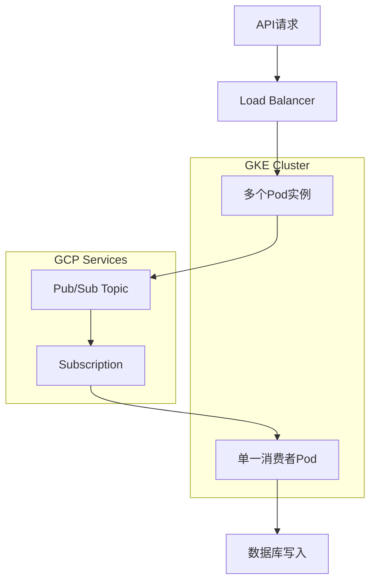
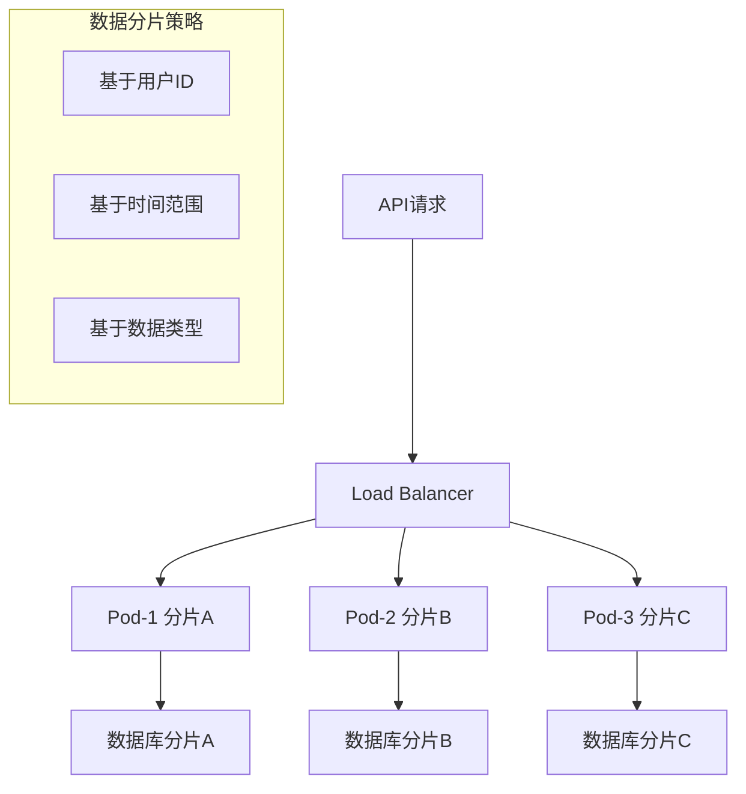
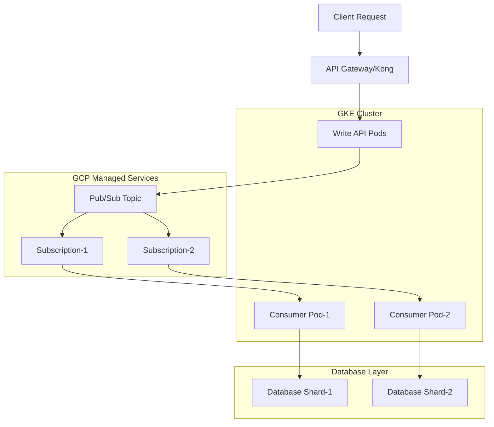
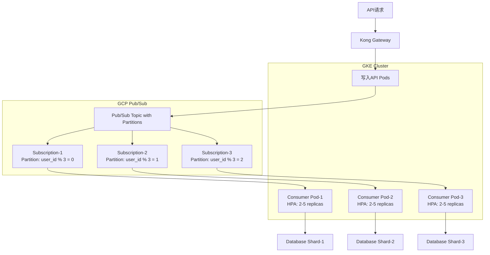
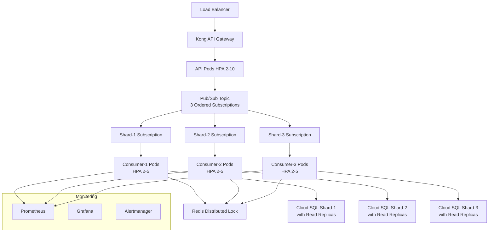
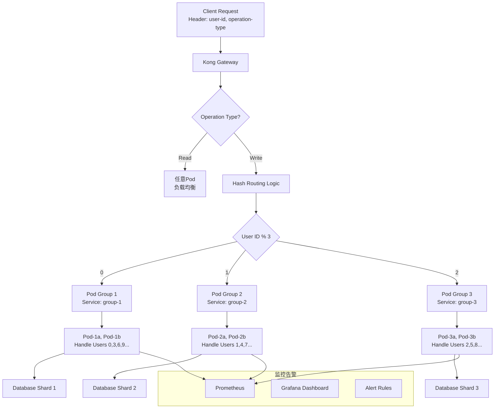
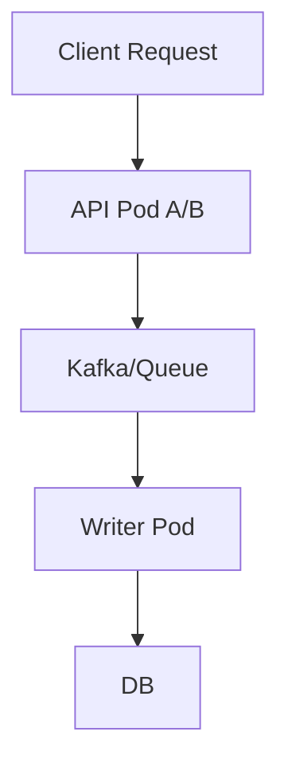
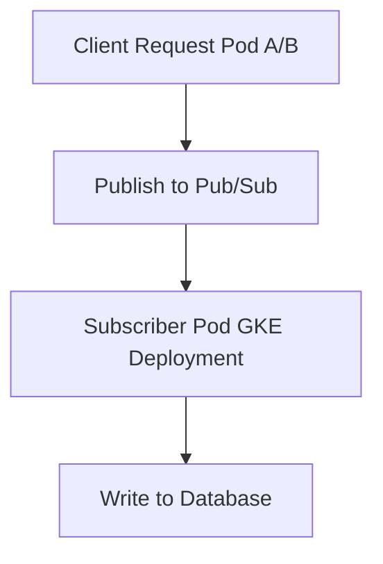
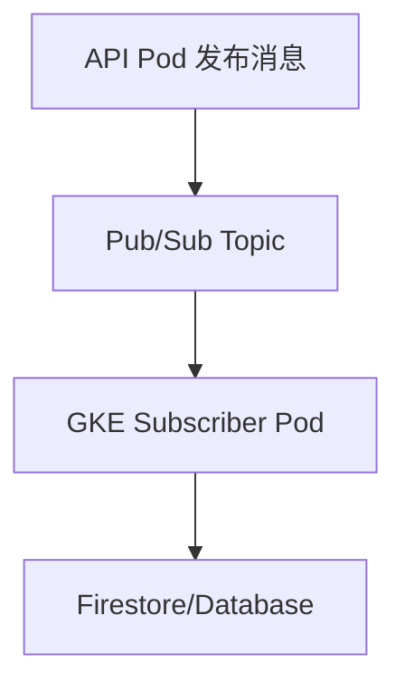

- [Claude4](#claude4)
  - [主要解决方案](#主要解决方案)
    - [1. 队列模式 (使用 Pub/Sub)](#1-队列模式-使用-pubsub)
    - [2. 主从模式 (Leader Election)](#2-主从模式-leader-election)
    - [3. 分片写入模式](#3-分片写入模式)
    - [4. 事务锁机制](#4-事务锁机制)
    - [5. 使用 StatefulSet + PVC](#5-使用-statefulset--pvc)
  - [推荐架构组合](#推荐架构组合)
    - [Pub/Sub + 消费者模式 (最推荐)](#pubsub--消费者模式-最推荐)
    - [实现示例](#实现示例)
  - [方案对比表](#方案对比表)
  - [改进的队列模式架构](#改进的队列模式架构)
    - [1. 多消费者 + 分区处理](#1-多消费者--分区处理)
    - [2. 基于消息属性的分区策略](#2-基于消息属性的分区策略)
    - [3. 消费者高可用配置](#3-消费者高可用配置)
    - [4. 改进的消费者逻辑](#4-改进的消费者逻辑)
    - [5. 分布式锁实现 (使用 Redis)](#5-分布式锁实现-使用-redis)
  - [完整的高可用架构](#完整的高可用架构)
  - [故障恢复机制](#故障恢复机制)
  - [1. 基于 Session Affinity (最简单)](#1-基于-session-affinity-最简单)
    - [Kubernetes Service 配置](#kubernetes-service-配置)
  - [2. 使用 Kong 实现精确流量控制](#2-使用-kong-实现精确流量控制)
    - [Kong 插件配置](#kong-插件配置)
    - [自定义 Kong 插件实现](#自定义-kong-插件实现)
  - [3. 使用 Istio Service Mesh](#3-使用-istio-service-mesh)
    - [DestinationRule 配置](#destinationrule-配置)
    - [VirtualService 配置](#virtualservice-配置)
  - [4. 应用层负载均衡控制](#4-应用层负载均衡控制)
    - [自定义负载均衡器](#自定义负载均衡器)
  - [5. 基于 Deployment Label 的精确控制](#5-基于-deployment-label-的精确控制)
    - [创建带标签的 Deployment](#创建带标签的-deployment)
    - [对应的多个 Service](#对应的多个-service)
  - [6. 完整的流量控制架构](#6-完整的流量控制架构)
  - [实现建议优先级](#实现建议优先级)
- [ChatGPT](#chatgpt)
- [Pod A 成功拿到 Redis 锁后才能执行写操作](#pod-a-成功拿到-redis-锁后才能执行写操作)
  - [**✅ 使用 Pub/Sub 的优势（特别适用于 GKE）**](#-使用-pubsub-的优势特别适用于-gke)
  - [**📌 推荐架构模式：Pub/Sub + Worker 写入 DB**](#-推荐架构模式pubsub--worker-写入-db)
    - [**说明：**](#说明)
  - [**🔧 实现建议**](#-实现建议)
    - [**1.** ](#1)
    - [**Producer 端（GKE API Pod）**](#producer-端gke-api-pod)
    - [**2.** ](#2)
    - [**Consumer 端（独立 GKE Worker 或 Cloud Run）**](#consumer-端独立-gke-worker-或-cloud-run)
  - [**🧱 可选增强组件**](#-可选增强组件)
  - [**✅ 总结：为什么 Pub/Sub + GKE 是一个非常好的选择？**](#-总结为什么-pubsub--gke-是一个非常好的选择)
  - [**🔧 前提**](#-前提)
  - [**1. Python 消费脚本（subscriber.py）**](#1-python-消费脚本subscriberpy)
  - [**2. Dockerfile**](#2-dockerfile)
  - [**3. GKE Deployment 示例（subscriber-deployment.yaml）**](#3-gke-deployment-示例subscriber-deploymentyaml)
  - [**4. 可选 HPA 配置（按 CPU 或自定义指标）**](#4-可选-hpa-配置按-cpu-或自定义指标)
  - [**5. Pub/Sub Subscription 创建（命令）**](#5-pubsub-subscription-创建命令)
  - [**✅ 总结**](#-总结)


# Claude4

对于多 Pod 同时写数据可能引起冲突的问题，有多种解决方案。以下是常见的几种架构模式：

## 主要解决方案

### 1. 队列模式 (使用 Pub/Sub)

```yaml
# deployment.yaml
apiVersion: apps/v1
kind: Deployment
metadata:
  name: data-writer
spec:
  replicas: 3
  selector:
    matchLabels:
      app: data-writer
  template:
    spec:
      containers:
        - name: writer
          image: your-app:latest
          env:
            - name: PUBSUB_SUBSCRIPTION
              value: "data-write-subscription"
```



### 2. 主从模式 (Leader Election)

```yaml
# leader-election-deployment.yaml
apiVersion: apps/v1
kind: Deployment
metadata:
  name: writer-with-leader
spec:
  replicas: 3
  template:
    spec:
      containers:
        - name: writer
          image: your-app:latest
          env:
            - name: LEADER_ELECTION_NAMESPACE
              value: "default"
            - name: LEADER_ELECTION_NAME
              value: "data-writer-leader"
```

```go
// 示例代码：Kubernetes Leader Election
import (
    "k8s.io/client-go/tools/leaderelection"
    "k8s.io/client-go/tools/leaderelection/resourcelock"
)

func startLeaderElection() {
    lock := &resourcelock.LeaseLock{
        LeaseMeta: metav1.ObjectMeta{
            Name:      "data-writer-leader",
            Namespace: "default",
        },
    }

    leaderelection.RunOrDie(ctx, leaderelection.LeaderElectionConfig{
        Lock:          lock,
        LeaseDuration: 15 * time.Second,
        RenewDeadline: 10 * time.Second,
        RetryPeriod:   2 * time.Second,
        Callbacks: leaderelection.LeaderCallbacks{
            OnStartedLeading: func(ctx context.Context) {
                // 开始处理写操作
                startWriteOperations()
            },
            OnStoppedLeading: func() {
                // 停止写操作
                stopWriteOperations()
            },
        },
    })
}
```

### 3. 分片写入模式



### 4. 事务锁机制

```sql
-- 数据库层面的锁机制
BEGIN TRANSACTION;

-- 获取行锁或表锁
SELECT * FROM data_table WHERE id = ? FOR UPDATE;

-- 执行写操作
UPDATE data_table SET value = ? WHERE id = ?;

COMMIT;
```

### 5. 使用 StatefulSet + PVC

```yaml
# statefulset.yaml
apiVersion: apps/v1
kind: StatefulSet
metadata:
  name: data-writer
spec:
  serviceName: "data-writer"
  replicas: 3
  template:
    spec:
      containers:
        - name: writer
          image: your-app:latest
          volumeMounts:
            - name: data-storage
              mountPath: /data
  volumeClaimTemplates:
    - metadata:
        name: data-storage
      spec:
        accessModes: ["ReadWriteOnce"]
        resources:
          requests:
            storage: 10Gi
```

## 推荐架构组合

### Pub/Sub + 消费者模式 (最推荐)



### 实现示例

```go
// Producer (API Pod)
func writeDataHandler(w http.ResponseWriter, r *http.Request) {
    data := extractDataFromRequest(r)

    // 发送到 Pub/Sub 而不是直接写数据库
    message := &pubsub.Message{
        Data: json.Marshal(data),
        Attributes: map[string]string{
            "operation": "insert",
            "timestamp": time.Now().Format(time.RFC3339),
        },
    }

    result := topic.Publish(ctx, message)
    if _, err := result.Get(ctx); err != nil {
        http.Error(w, "Failed to publish message", 500)
        return
    }

    w.WriteHeader(http.StatusAccepted)
    json.NewEncoder(w).Encode(map[string]string{"status": "queued"})
}

// Consumer (Background Worker Pod)
func startConsumer() {
    subscription.Receive(ctx, func(ctx context.Context, msg *pubsub.Message) {
        var data DataStruct
        if err := json.Unmarshal(msg.Data, &data); err != nil {
            msg.Nack()
            return
        }

        // 串行化写入数据库
        if err := writeToDatabase(data); err != nil {
            msg.Nack()
            return
        }

        msg.Ack()
    })
}
```

## 方案对比表

| 方案            | 高可用性 | 数据一致性 | 复杂度 | 性能  | 适用场景     |
| --------------- | -------- | ---------- | ------ | ----- | ------------ |
| Pub/Sub 队列    | ✅ 高    | ✅ 强      | 🟡 中  | ✅ 高 | 异步写入场景 |
| Leader Election | ✅ 高    | ✅ 强      | 🟡 中  | 🔴 低 | 简单写入场景 |
| 数据分片        | ✅ 高    | ✅ 强      | 🔴 高  | ✅ 高 | 大数据量场景 |
| 数据库锁        | 🟡 中    | ✅ 强      | 🟢 低  | 🔴 低 | 小并发场景   |
| StatefulSet     | 🟡 中    | ✅ 强      | 🟡 中  | 🟡 中 | 有状态应用   |

对于生产环境，**推荐使用 Pub/Sub + 消费者模式**，既保证了高可用性，又避免了数据冲突，同时保持了良好的性能和扩展性。

确实，单一消费者 Pod 仍然是单点问题！这是个很好的观察。让我重新设计更完善的方案：

## 改进的队列模式架构

### 1. 多消费者 + 分区处理



### 2. 基于消息属性的分区策略

```go
// Producer: 发送带分区键的消息
func publishMessage(data WriteRequest) error {
    // 基于业务逻辑确定分区键
    partitionKey := generatePartitionKey(data)

    message := &pubsub.Message{
        Data: json.Marshal(data),
        Attributes: map[string]string{
            "partition_key": partitionKey,
            "message_type": data.Type,
            "timestamp":    time.Now().Format(time.RFC3339),
        },
        OrderingKey: partitionKey, // 确保同一分区的消息有序
    }

    result := topic.Publish(ctx, message)
    return result.Get(ctx)
}

func generatePartitionKey(data WriteRequest) string {
    switch data.Type {
    case "user_data":
        return fmt.Sprintf("user_%d", data.UserID%3)
    case "order_data":
        return fmt.Sprintf("order_%s", data.OrderID[:2])
    default:
        return fmt.Sprintf("default_%d", time.Now().Unix()%3)
    }
}
```

### 3. 消费者高可用配置

```yaml
# consumer-deployment.yaml
apiVersion: apps/v1
kind: Deployment
metadata:
  name: data-consumer-shard-1
spec:
  replicas: 2 # 最少2个副本
  selector:
    matchLabels:
      app: data-consumer
      shard: "1"
  template:
    metadata:
      labels:
        app: data-consumer
        shard: "1"
    spec:
      containers:
        - name: consumer
          image: your-consumer:latest
          env:
            - name: SUBSCRIPTION_NAME
              value: "data-write-subscription-shard-1"
            - name: SHARD_ID
              value: "1"
            - name: MAX_CONCURRENT_HANDLERS
              value: "10"
          resources:
            requests:
              cpu: 100m
              memory: 128Mi
            limits:
              cpu: 500m
              memory: 512Mi
          livenessProbe:
            httpGet:
              path: /health
              port: 8080
            initialDelaySeconds: 30
            periodSeconds: 10
          readinessProbe:
            httpGet:
              path: /ready
              port: 8080
            initialDelaySeconds: 5
            periodSeconds: 5
---
apiVersion: autoscaling/v2
kind: HorizontalPodAutoscaler
metadata:
  name: consumer-shard-1-hpa
spec:
  scaleTargetRef:
    apiVersion: apps/v1
    kind: Deployment
    name: data-consumer-shard-1
  minReplicas: 2
  maxReplicas: 10
  metrics:
    - type: Resource
      resource:
        name: cpu
        target:
          type: Utilization
          averageUtilization: 70
    - type: Pods
      pods:
        metric:
          name: pubsub_subscription_num_undelivered_messages
        target:
          type: AverageValue
          averageValue: "100"
```

### 4. 改进的消费者逻辑

```go
// 支持多实例的消费者
func startConsumer(shardID string) {
    subscriptionName := fmt.Sprintf("data-write-subscription-shard-%s", shardID)

    // 配置并发接收
    subscription := client.Subscription(subscriptionName)
    subscription.ReceiveSettings.MaxConcurrentHandlers = 10
    subscription.ReceiveSettings.MaxOutstandingMessages = 100

    // 启动多个goroutine处理消息
    for i := 0; i < runtime.NumCPU(); i++ {
        go func(workerID int) {
            subscription.Receive(ctx, func(ctx context.Context, msg *pubsub.Message) {
                handleMessage(msg, shardID, workerID)
            })
        }(i)
    }
}

func handleMessage(msg *pubsub.Message, shardID string, workerID int) {
    // 添加分布式锁防止重复处理
    lockKey := fmt.Sprintf("msg_lock_%s", msg.ID)

    if !acquireDistributedLock(lockKey, 30*time.Second) {
        log.Printf("Message %s already being processed", msg.ID)
        msg.Ack() // 已被其他实例处理
        return
    }
    defer releaseDistributedLock(lockKey)

    // 幂等性检查
    if isMessageProcessed(msg.ID) {
        log.Printf("Message %s already processed", msg.ID)
        msg.Ack()
        return
    }

    // 处理消息
    var data WriteRequest
    if err := json.Unmarshal(msg.Data, &data); err != nil {
        log.Printf("Failed to unmarshal message: %v", err)
        msg.Nack()
        return
    }

    // 写入数据库
    if err := writeToDatabase(data, shardID); err != nil {
        log.Printf("Failed to write to database: %v", err)
        msg.Nack()
        return
    }

    // 标记消息已处理
    markMessageProcessed(msg.ID)
    msg.Ack()
}
```

### 5. 分布式锁实现 (使用 Redis)

```go
// 使用Redis实现分布式锁
func acquireDistributedLock(key string, expiration time.Duration) bool {
    lockValue := generateUniqueID()

    result := redisClient.SetNX(ctx, key, lockValue, expiration)
    if result.Err() != nil {
        return false
    }

    return result.Val()
}

func releaseDistributedLock(key string) {
    // 使用Lua脚本确保原子性
    script := `
        if redis.call("get", KEYS[1]) == ARGV[1] then
            return redis.call("del", KEYS[1])
        else
            return 0
        end
    `
    redisClient.Eval(ctx, script, []string{key}, lockValue)
}
```

## 完整的高可用架构



## 故障恢复机制

| 故障场景                 | 解决方案                     | 恢复时间 |
| ------------------------ | ---------------------------- | -------- |
| 单个 Consumer Pod 故障   | HPA 自动扩容 + 其他 Pod 接管 | < 30 秒  |
| 整个 Shard Consumer 故障 | 消息堆积 + 告警 + 手动介入   | < 5 分钟 |
| Pub/Sub 故障             | GCP 自动故障转移             | < 1 分钟 |
| 数据库 Shard 故障        | Read Replica 提升为 Master   | < 2 分钟 |
| Redis 锁服务故障         | 降级为无锁模式 + 幂等性保证  | 立即     |

这样设计就消除了单点故障，同时保证了数据一致性和高可用性。每个组件都有冗余，整个系统具备自愈能力。

可以！有多种方式在生产环境中控制流量只路由到特定 Pod。以下是几种实现方案：

## 1. 基于 Session Affinity (最简单)

### Kubernetes Service 配置

```yaml
# service-with-affinity.yaml
apiVersion: v1
kind: Service
metadata:
  name: data-writer-service
spec:
  selector:
    app: data-writer
  ports:
    - port: 80
      targetPort: 8080
  sessionAffinity: ClientIP # 基于客户端IP的会话亲和性
  sessionAffinityConfig:
    clientIP:
      timeoutSeconds: 3600 # 1小时内同一IP路由到同一Pod
```

## 2. 使用 Kong 实现精确流量控制

### Kong 插件配置

```yaml
# kong-consumer-groups.yaml
apiVersion: configuration.konghq.com/v1
kind: KongPlugin
metadata:
  name: upstream-routing
plugin: request-transformer
config:
  add:
    headers:
      - "X-Target-Pod:$(headers.user-id | hash % pod-count)"
---
apiVersion: configuration.konghq.com/v1
kind: KongIngress
metadata:
  name: pod-routing
upstream:
  algorithm: consistent-hashing
  hash_on: header
  hash_on_header: X-Target-Pod
```

### 自定义 Kong 插件实现

```lua
-- kong-pod-router.lua
local kong = kong
local ngx = ngx

local function route_to_specific_pod()
    local user_id = kong.request.get_header("user-id")
    local operation_type = kong.request.get_header("operation-type")

    if operation_type == "write" and user_id then
        -- 基于用户ID计算目标Pod
        local pod_index = tonumber(user_id) % 3 + 1
        kong.service.request.set_header("X-Target-Pod", "pod-" .. pod_index)
    end
end

return {
    PRIORITY = 1000,
    VERSION = "1.0.0",
    access = route_to_specific_pod
}
```

## 3. 使用 Istio Service Mesh

### DestinationRule 配置

```yaml
# istio-destination-rule.yaml
apiVersion: networking.istio.io/v1beta1
kind: DestinationRule
metadata:
  name: data-writer-dr
spec:
  host: data-writer-service
  subsets:
    - name: pod-1
      labels:
        pod-index: "1"
    - name: pod-2
      labels:
        pod-index: "2"
    - name: pod-3
      labels:
        pod-index: "3"
  trafficPolicy:
    consistentHash:
      httpHeaderName: "user-id"
```

### VirtualService 配置

```yaml
# istio-virtual-service.yaml
apiVersion: networking.istio.io/v1beta1
kind: VirtualService
metadata:
  name: data-writer-vs
spec:
  hosts:
    - data-writer-service
  http:
    - match:
        - headers:
            operation-type:
              exact: "write"
            user-id:
              regex: ".*[0369]$" # 用户ID末位为0,3,6,9
      route:
        - destination:
            host: data-writer-service
            subset: pod-1
    - match:
        - headers:
            operation-type:
              exact: "write"
            user-id:
              regex: ".*[147]$" # 用户ID末位为1,4,7
      route:
        - destination:
            host: data-writer-service
            subset: pod-2
    - match:
        - headers:
            operation-type:
              exact: "write"
            user-id:
              regex: ".*[258]$" # 用户ID末位为2,5,8
      route:
        - destination:
            host: data-writer-service
            subset: pod-3
    - route: # 默认路由
        - destination:
            host: data-writer-service
```

## 4. 应用层负载均衡控制

### 自定义负载均衡器

```go
// custom-lb-controller.go
package main

type PodRouter struct {
    podEndpoints map[string][]string
    hashRing     *consistent.Consistent
}

func (pr *PodRouter) RouteRequest(userID string, operationType string) string {
    if operationType == "write" {
        // 写操作路由到特定Pod
        return pr.getConsistentPod(userID)
    }
    // 读操作可以路由到任意Pod
    return pr.getRandomPod()
}

func (pr *PodRouter) getConsistentPod(key string) string {
    node, err := pr.hashRing.Get(key)
    if err != nil {
        return pr.getRandomPod()
    }
    return node
}

// HTTP代理实现
func proxyHandler(w http.ResponseWriter, r *http.Request) {
    userID := r.Header.Get("User-ID")
    operationType := r.Header.Get("Operation-Type")

    targetPod := router.RouteRequest(userID, operationType)

    // 创建反向代理
    target, _ := url.Parse(fmt.Sprintf("http://%s", targetPod))
    proxy := httputil.NewSingleHostReverseProxy(target)

    // 添加路由信息到Header
    r.Header.Set("X-Routed-To", targetPod)

    proxy.ServeHTTP(w, r)
}
```

## 5. 基于 Deployment Label 的精确控制

### 创建带标签的 Deployment

```yaml
# labeled-deployments.yaml
apiVersion: apps/v1
kind: Deployment
metadata:
  name: data-writer-pod-1
spec:
  replicas: 2
  selector:
    matchLabels:
      app: data-writer
      pod-group: "group-1"
  template:
    metadata:
      labels:
        app: data-writer
        pod-group: "group-1"
        pod-index: "1"
    spec:
      containers:
        - name: writer
          image: your-app:latest
          env:
            - name: POD_GROUP
              value: "group-1"
            - name: HANDLED_USER_RANGE
              value: "0-999"
---
apiVersion: apps/v1
kind: Deployment
metadata:
  name: data-writer-pod-2
spec:
  replicas: 2
  selector:
    matchLabels:
      app: data-writer
      pod-group: "group-2"
  template:
    metadata:
      labels:
        app: data-writer
        pod-group: "group-2"
        pod-index: "2"
    spec:
      containers:
        - name: writer
          image: your-app:latest
          env:
            - name: POD_GROUP
              value: "group-2"
            - name: HANDLED_USER_RANGE
              value: "1000-1999"
```

### 对应的多个 Service

```yaml
# group-specific-services.yaml
apiVersion: v1
kind: Service
metadata:
  name: data-writer-group-1
spec:
  selector:
    app: data-writer
    pod-group: "group-1"
  ports:
    - port: 80
      targetPort: 8080
---
apiVersion: v1
kind: Service
metadata:
  name: data-writer-group-2
spec:
  selector:
    app: data-writer
    pod-group: "group-2"
  ports:
    - port: 80
      targetPort: 8080
```

## 6. 完整的流量控制架构



## 实现建议优先级

| 方案               | 复杂度 | 可靠性 | 性能  | 维护成本 | 推荐场景          |
| ------------------ | ------ | ------ | ----- | -------- | ----------------- |
| Session Affinity   | 🟢 低  | 🟡 中  | 🟢 高 | 🟢 低    | 简单场景          |
| Kong 插件          | 🟡 中  | ✅ 高  | ✅ 高 | 🟡 中    | API 网关已用 Kong |
| Istio Service Mesh | 🔴 高  | ✅ 高  | ✅ 高 | 🔴 高    | 微服务架构        |
| 应用层 LB          | 🟡 中  | ✅ 高  | 🟡 中 | 🟡 中    | 自定义需求        |
| 多 Service 分组    | 🟢 低  | ✅ 高  | ✅ 高 | 🟢 低    | **推荐 PRD 环境** |

**对于生产环境，推荐使用"多 Service 分组"方案**，因为它简单可靠，易于监控和故障排除，同时保持了高可用性。

# ChatGPT

对于运行在 PRD 生产环境的 GKE ,比如我们默认 HPA 最少 2 个 Pod.但是有这样业务逻辑,比如我的 Pod 里面有一个写数据库的 API, 那么如果同时都运行的话.那么可能会引起写数据混乱?但是我这个仅仅是一个场景设想.其实核心就是多 Pod 同时写数据.带来的数据可能冲突的问题.对于这种场景.一般有什么对应的解决方案? 因为如果我只运行一个 Pod.那么 Pod 就没有高可用了

你提到的**多 Pod 高可用下写数据库引发数据冲突的问题**，是生产环境中常见的设计难题。核心挑战是：**如何在保持水平扩展（多副本、高可用）的同时，确保写操作的数据一致性和幂等性**。

⸻

**💡 场景问题归纳**

• **多副本 Pod 写数据库**：可能出现重复写入、写顺序错误、资源竞争等问题。

• **不能只跑一个 Pod**：否则就失去了容灾能力（比如 HPA、自动 failover）。

• **典型业务场景**：

• 创建订单（不能重复）

• 更新库存（不能出现竞态）

• 写入日志（要求时序、幂等）

⸻

**✅ 解决方案概览**

| 方案类别           | 具体方案                     | 适用场景                         |
| ------------------ | ---------------------------- | -------------------------------- |
| 数据库层控制       | 乐观锁、悲观锁               | 单表并发写较高、更新冲突可能性大 |
| 应用层控制         | 幂等性设计、全局锁、幂等 Key | REST API 接口、避免重复写入      |
| 分布式协调机制     | leader election / 分布式锁   | Kafka 消费、定时任务、序列生成等 |
| 数据一致性架构优化 | 使用消息队列、Saga/补偿机制  | 异步写操作、微服务事务           |
| Kubernetes 控制    | podAffinity、HPA tuning、PDB | 强制同一任务只由一个 Pod 执行    |

⸻

**🎯 典型设计方案说明**

**1. 幂等性设计（强烈推荐）**

**适用：** 多 Pod 对同一个写接口发请求，但希望写入唯一记录或避免重复。

**方式：**

• 为每个写请求设置 **唯一幂等 Key（idempotent key）**（如 UUID、订单号）

• 在数据库加唯一约束，写失败时返回重复错误

• 接口返回已写入记录（不重试）

-- 以订单创建为例

```sql
CREATE TABLE orders (
order_id VARCHAR PRIMARY KEY,
user_id VARCHAR,
product_id VARCHAR,
created_at TIMESTAMP DEFAULT now()
);
```

```java
// 接口伪代码
if (db.exists(order_id)) {
return db.get(order_id);
} else {
db.insert(order);
return order;
}

```

⸻

**2. 基于数据库的悲观锁/乐观锁**

**适用：** 并发写入相同数据记录时，要求严格一致性。

• **悲观锁**：SELECT ... FOR UPDATE，避免并发更新

• **乐观锁**：加 version 字段，更新时版本对比，不一致则失败重试

-- 乐观锁示例

```sql
UPDATE inventory
SET stock = stock - 1, version = version + 1
WHERE product_id = '123' AND version = 10;
```

⸻

**3. 引入分布式锁（如 Redis、etcd）**

**适用：** 任务必须串行执行（例如定时任务、唯一处理器）

• 多 Pod 同时运行，但某一类写任务通过 **锁协调只由一个 Pod 执行**

• 可使用 Redlock（Redis 分布式锁）、K8S leader election

# Pod A 成功拿到 Redis 锁后才能执行写操作

SETNX lock:write:job "pod-a" EX 10

⸻

**4. Leader Election + 任务隔离**

**适用：** 定时写任务、批量处理、导入数据等任务

• 在多 Pod 中选出“Leader”来执行敏感写入

• Kubernetes 中可用 ConfigMap 或第三方组件（如 [kube-leader-elector](https://github.com/kubernetes-client/python/blob/master/examples/leader_election.py)）
```yaml
affinity:
  podAntiAffinity:
    preferredDuringSchedulingIgnoredDuringExecution:
      - podAffinityTerm:
          labelSelector:
            matchLabels:
              app: db-writer
          topologyKey: "kubernetes.io/hostname"
```
⸻

**5. 通过异步队列实现串行写入**

**适用：** 高并发场景，例如订单、支付等

• 多 Pod 接收请求，写入 Kafka、Pub/Sub 等队列

• 独立的 Consumer Pod 按顺序消费写入数据库（可配合幂等性）



⸻

**✅ 最佳实践建议（生产）**

1. **优先使用幂等性设计**：设计接口时就考虑重复请求/重复写的去重逻辑

2. **敏感逻辑单独服务化**：比如写订单的服务隔离，避免公共逻辑影响

3. **任务写入通过队列串行化**：消息队列可解耦+高可用

4. **避免只靠单 Pod 执行**：失去了 Kubernetes 高可用能力

5. **监控冲突错误与锁竞争**：确保写入不会 silently fail

⸻

如你希望我根据你具体业务场景（比如 Java 或 Spring Boot）进一步细化设计，我可以帮你出具体模板或实现示例。是否需要？

是的，**在 GKE 中结合使用 Google Cloud Pub/Sub 是处理多 Pod 写数据库冲突、实现高并发安全写入的极佳解决方案之一**，特别适合以下场景：

---

## **✅ 使用 Pub/Sub 的优势（特别适用于 GKE）**

| **优势**                                | **说明**                                                 |
| --------------------------------------- | -------------------------------------------------------- |
| **天然解耦**                            | GKE 中多个 Pod 可以并发发布消息，不需要直接写数据库      |
| **高可用 + 高扩展**                     | Pub/Sub 是托管服务，支持水平扩展，不易成为瓶颈           |
| **幂等写入更易实现**                    | 使用 messageId 或业务自定义 deduplication key 做幂等去重 |
| **持久化保障**                          | 消息默认存储 7 天，避免瞬时系统异常丢数据                |
| **与 GKE/GCS/Cloud Functions 集成紧密** | 你可以用 Cloud Run / GKE 的后台订阅写逻辑                |

---

## **📌 推荐架构模式：Pub/Sub + Worker 写入 DB**



### **说明：**

- Client 请求由多个 GKE Pod 处理，发布写入任务到 Pub/Sub（避免直接写 DB）
- 独立的 Subscriber Deployment（可以有多个 Pod）消费消息，顺序或并发写入 DB
- 可在 Subscriber 中加入幂等性校验逻辑、重试机制、死信队列处理

---

## **🔧 实现建议**

### **1.** 

### **Producer 端（GKE API Pod）**

```
# 示例: 将订单写入 pub/sub
publisher = pubsub_v1.PublisherClient()
topic_path = publisher.topic_path('your-project-id', 'order-topic')
data = json.dumps(order_payload).encode("utf-8")
future = publisher.publish(topic_path, data, order_id="123456")
```

### **2.** 

### **Consumer 端（独立 GKE Worker 或 Cloud Run）**

```
# 示例: 接收订阅消息并写入数据库
def callback(message):
    payload = json.loads(message.data)
    order_id = payload["order_id"]
    # 幂等检查
    if not db.exists(order_id):
        db.insert(payload)
    message.ack()
```

你可以通过 GKE 的 Deployment 启多个 Pod 消费该 Topic，保持消费能力冗余。

---

## **🧱 可选增强组件**

| **功能** | **工具/建议**                            |
| -------- | ---------------------------------------- |
| 幂等去重 | 数据库主键、幂等 key、Redis 布隆过滤器   |
| 错误追踪 | Pub/Sub Dead Letter Topic（DLT）         |
| 消费监控 | Cloud Monitoring + Log-based Metric      |
| 自动弹性 | Worker Pod 配 HPA（根据 CPU/MQ backlog） |
| 限流     | 结合 Cloud Tasks 或 Token Bucket         |

---

## **✅ 总结：为什么 Pub/Sub + GKE 是一个非常好的选择？**

| **特性**             | **说明**                                        |
| -------------------- | ----------------------------------------------- |
| **平台内原生整合**   | 与 GKE、IAM、Cloud Logging、Monitoring 集成顺畅 |
| **解耦业务写入压力** | 接收请求的 Pod 只负责发送消息，不参与复杂写操作 |
| **容错能力强**       | 支持重试、死信队列，避免数据丢失                |
| **适配高并发架构**   | 可动态扩容 Subscriber Pod（支持 HPA）           |

---

如果你愿意，我可以帮你出一个 **Pub/Sub + GKE Subscriber Deployment 的 YAML 模板** 或 Python 示例程序，快速构建这个架构。是否需要？
好的，以下是一个**完整的 Google Cloud Pub/Sub + GKE 中使用 Deployment 消费消息并写入数据库的示例**，包含：

1. Pub/Sub Topic + Subscription 创建
2. Python 消费脚本
3. Dockerfile
4. GKE Deployment YAML（使用 Secret + ServiceAccount 认证）
5. 建议性 HPA 设置（可选）

---

## **🔧 前提**

- 已启用 Pub/Sub API
- 已创建 Topic（例如：order-topic）
- 已为 GKE 配置好访问权限（Workload Identity 或 GCP ServiceAccount）

---

## **1. Python 消费脚本（subscriber.py）**

```Python
import os
import json
from google.cloud import pubsub_v1
from google.cloud import firestore

# 设置 Google 应用凭证（容器内用 Workload Identity 不需要手动设置）
project_id = os.environ["GCP_PROJECT"]
subscription_id = os.environ["SUBSCRIPTION_ID"]
db = firestore.Client()

def callback(message: pubsub_v1.subscriber.message.Message):
    try:
        data = json.loads(message.data.decode("utf-8"))
        order_id = data["order_id"]

        # 幂等性判断
        doc_ref = db.collection("orders").document(order_id)
        if not doc_ref.get().exists:
            doc_ref.set(data)
            print(f"Inserted order {order_id}")
        else:
            print(f"Duplicate order {order_id} skipped.")

        message.ack()
    except Exception as e:
        print(f"Error: {e}")
        message.nack()

if __name__ == "__main__":
    subscriber = pubsub_v1.SubscriberClient()
    subscription_path = subscriber.subscription_path(project_id, subscription_id)
    streaming_pull_future = subscriber.subscribe(subscription_path, callback=callback)

    print("Listening for messages...")
    try:
        streaming_pull_future.result()
    except KeyboardInterrupt:
        streaming_pull_future.cancel()
```

---

## **2. Dockerfile**

```Dockerfile
FROM python:3.10-slim

WORKDIR /app

COPY subscriber.py .

RUN pip install --no-cache-dir google-cloud-pubsub google-cloud-firestore

CMD ["python", "subscriber.py"]
```

---

## **3. GKE Deployment 示例（subscriber-deployment.yaml）**

```
apiVersion: apps/v1
kind: Deployment
metadata:
  name: pubsub-subscriber
  labels:
    app: pubsub-subscriber
spec:
  replicas: 2
  selector:
    matchLabels:
      app: pubsub-subscriber
  template:
    metadata:
      labels:
        app: pubsub-subscriber
    spec:
      serviceAccountName: gke-pubsub-access-sa  # Workload Identity 绑定的 SA
      containers:
        - name: subscriber
          image: gcr.io/YOUR_PROJECT_ID/pubsub-subscriber:latest
          env:
            - name: GCP_PROJECT
              value: "YOUR_PROJECT_ID"
            - name: SUBSCRIPTION_ID
              value: "order-topic-sub"
          resources:
            limits:
              memory: "256Mi"
              cpu: "200m"
```

> ⚠️ 请替换 YOUR_PROJECT_ID 和订阅名称为你实际的值。

---

## **4. 可选 HPA 配置（按 CPU 或自定义指标）**

```
apiVersion: autoscaling/v2
kind: HorizontalPodAutoscaler
metadata:
  name: pubsub-subscriber-hpa
spec:
  scaleTargetRef:
    apiVersion: apps/v1
    kind: Deployment
    name: pubsub-subscriber
  minReplicas: 2
  maxReplicas: 10
  metrics:
    - type: Resource
      resource:
        name: cpu
        target:
          type: Utilization
          averageUtilization: 60
```

---

## **5. Pub/Sub Subscription 创建（命令）**

```
# 创建 Topic（如果还没创建）
gcloud pubsub topics create order-topic

# 创建 Subscription
gcloud pubsub subscriptions create order-topic-sub \
  --topic=order-topic \
  --ack-deadline=60
```

---

## **✅ 总结**

你现在拥有了一个完整的端到端流程：



- 业务逻辑无需直接写库，只发消息
- 写入逻辑集中处理，可控、幂等、易观察
- 支持 HPA，高可用与可扩展兼得

---

是否需要我帮你创建 Cloud Build CI/CD 配置（cloudbuild.yaml）或 Terraform 资源定义来自动化这套流程？
