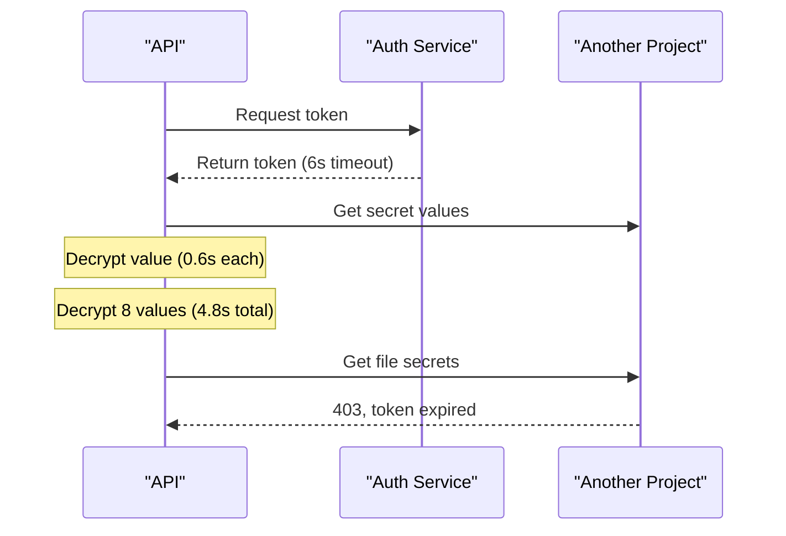
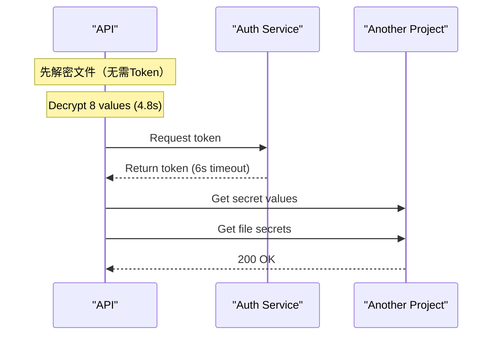
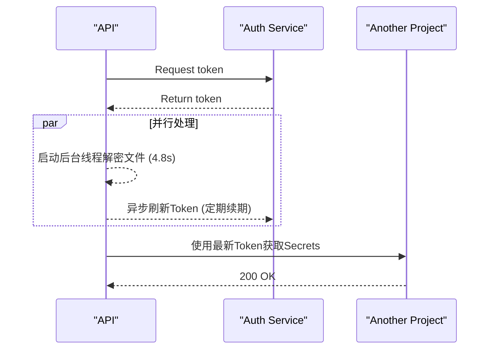

<font color="#548dd4">好的，理解您的问题。您的 Pod 启动时，由于解密文件和请求 API 的耗时，导致超过了配置的 6 秒超时时间，从而启动失败</font>。

- application logic 


根据你的流程图和问题描述，核心问题在于**Token 有效期短于整个流程耗时**（解密 + API 请求），导致后续请求因 Token 过期返回 `403`。以下是针对性优化方案：

---

### think 
好的，用户现在提供了一个流程图，显示了他的API在启动时与认证服务和其他项目的交互过程。从流程图中可以看出，API在获取token后，需要解密8个文件，总共耗时4.8秒，加上其他操作，总时间可能超过6秒，导致token过期，进而访问另一个项目时返回403错误。用户希望修复这个问题。

首先，我需要回顾之前的建议，看看哪些适用于当前的情况。之前提到过并行解密、预解密、使用Init Container、异步处理、优化解密算法等方法。现在用户的具体流程中，问题不仅是启动超时，还涉及到token的有效期问题。因为当API获取token后，解密和后续操作耗时过长，导致token过期，无法访问另一个项目。

用户的核心问题有两个：1. 启动时解密时间过长，导致总时间超过6秒；2. Token的有效期太短，在处理完成后已经过期。需要同时解决这两个方面。

可能的解决方案包括：

1. **并行解密**：将8个文件的解密并行执行，减少总耗时。比如用多线程或并行命令，这样原本4.8秒可能缩短到接近0.6秒，加上其他操作，总时间可能控制在6秒内。

2. **延长Token有效期**：如果Auth Service允许，延长token的有效期，使其足够覆盖整个流程时间。但可能涉及安全策略，不一定可行。

3. **异步获取Token和解密**：在启动时先获取token，然后在处理解密的同时，异步刷新token，确保在需要使用时token仍然有效。或者在解密完成后再获取token，避免提前获取导致过期。

4. **分阶段处理**：将解密和获取secret values分开，先解密必要的文件，再获取token，然后立即使用，减少token等待时间。

5. **优化解密过程**：检查是否有更高效的方法或工具来加速解密，例如使用硬件加速或更优化的算法。

6. **使用Init Container进行预解密**：在Pod启动前，使用Init Container预先解密文件，这样主容器启动时直接使用解密后的文件，节省时间。

7. **缓存或预加载Token**：在启动后立即获取token，并在token即将过期前自动刷新，确保后续请求使用有效的token。或者在需要访问另一个项目时再获取token，而不是在启动时提前获取。

需要结合用户的实际情况选择最合适的方案。例如，如果用户无法修改Auth Service的token有效期，可能需要调整流程顺序，先解密再获取token，或者异步刷新token。另外，并行解密应该是比较直接有效的方法，可以显著减少解密时间。

还需要考虑流程中的步骤顺序是否合理。例如，获取token后需要解密文件，然后才能获取secret values，但可能这些步骤可以重新排序，或者并行处理。例如，是否可以在获取token的同时开始解密文件，或者将解密文件提前到获取token之前，这样获取token后立即使用，减少等待时间。

此外，用户提到解密后的文件用于获取另一个项目的secret values，如果这些secret values是静态的，是否可以考虑提前预取并缓存，避免每次启动都重新获取，从而减少整个流程时间。

最后，检查是否有不必要的步骤或可以优化的环节，例如减少需要解密的文件数量，或者合并多个文件为一个，减少解密次数。

### **1. 调整流程顺序：先解密再获取 Token**
当前流程中，Token 在解密操作前获取，导致解密耗时消耗 Token 的有效期。优化逻辑：

- **关键点**：将耗时较长的解密操作放在获取 Token **之前**，确保 Token 从获取到使用的窗口期内不再被解密占用。
- **适用场景**：解密操作不需要依赖 Token（例如解密本地文件）。

---

### **2. 并行解密 + 异步 Token 刷新**
如果解密必须依赖 Token（例如需要从外部服务获取解密密钥）：

- **实现方式**：
  1. 使用多线程/协程（如 Python 的 `threading` 或 Go 的 `goroutine`）并行解密。
  2. 在后台异步刷新 Token（例如设置 Token 的刷新间隔为有效期的一半）。
- **工具示例**（Shell 并行解密）：
  ```bash
  # 使用 xargs 并行解密8个文件
  echo "file1 file2 ... file8" | xargs -n1 -P8 openssl dec -in {} -out {}.dec
  ```

---

### **3. 使用 Init Container 预解密**
将解密操作移至 Kubernetes **Init Container**，确保解密完成后再启动主容器并获取 Token：
```yaml
apiVersion: v1
kind: Pod
metadata:
  name: my-api
spec:
  initContainers:
  - name: decrypt-files
    image: openssl-image
    command: ["sh", "-c", "parallel openssl dec -in {} -out {}.dec ::: file1 file2 ... file8"]
  containers:
  - name: main-api
    image: my-api-image
    command: ["./start-api.sh"]
```
- **优势**：Init Container 的超时时间独立于主容器，且解密与 Token 逻辑完全解耦。
- **限制**：需确保 Init Container 能访问到加密文件（例如通过 Volume 挂载）。

---

### **4. 优化 Token 有效期或自动续期**
- **延长 Token 有效期**：与 Auth Service 团队协调，适当延长 Token 有效期（例如从 6s 改为 10s）。
- **自动续期 Token**：在 Token 临近过期时，自动调用 Auth Service 刷新 Token（需 Auth Service 支持 Refresh Token 机制）。

---

### **5. 缓存解密结果**
如果解密后的内容不常变化，可将结果缓存到临时卷（如 `emptyDir`）或外部存储（如 Redis），后续 Pod 启动直接读取缓存：
```yaml
spec:
  volumes:
  - name: decrypted-cache
    emptyDir: {}
  containers:
  - name: main-api
    volumeMounts:
    - mountPath: /cache
      name: decrypted-cache
    command: ["./start-api.sh", "--cache-dir=/cache"]
```

---

### **最终建议**
1. **优先调整流程顺序**（先解密再获取 Token），这是改动最小且最直接的方法。
2. 若解密必须依赖 Token，使用 **并行解密 + 异步 Token 刷新**。
3. 长期优化可引入 **Init Container 预解密** 或 **解密缓存**。

通过上述方案，可确保 Token 在有效期内完成所有操作，避免 `403` 错误。

**针对这个问题，以下是一些可能的优化方案：**

### 1. **优化解密过程**

- **并行处理：** 如果解密文件之间没有依赖关系，可以考虑使用多线程或多进程的方式并行处理，缩短总的解密时间。
- **缓存解密结果：** 如果解密结果在一段时间内是稳定的，可以考虑将解密结果缓存起来，避免重复解密。
- **优化 OpenSSL 命令：** 尝试调整 OpenSSL 命令的选项，例如使用更快的算法或减少不必要的输出，以提高解密速度。
- **使用更快的解密库：** 如果 OpenSSL 的性能无法满足要求，可以考虑使用其他更高性能的解密库。

### 2. **优化 API 请求**

- **异步请求：** 将 API 请求改为异步方式，避免等待 API 返回结果才继续执行后续操作。
- **批量请求：** 如果多个 API 请求之间没有依赖关系，可以将它们合并成一个批量请求，减少网络开销。
- **缓存 API 返回结果：** 如果 API 返回结果在一段时间内是稳定的，可以考虑将结果缓存起来，避免重复请求。
- **优化 API 接口：** 如果 API 接口的响应时间过长，可以尝试与 API 提供方协商，优化接口性能。

### 3. **调整超时时间**

- **增加超时时间：** 如果上述优化措施无法将总耗时缩短到 6 秒以内，可以考虑适当增加超时时间。
- **动态调整超时时间：** 根据实际情况，动态调整超时时间。例如，如果解密文件数量较少，可以设置较短的超时时间；如果解密文件数量较多，可以设置较长的超时时间。

### 4. **优化 Pod 启动流程**

- **延迟初始化：** 将耗时的操作延迟到 Pod 启动完成后再执行，例如在容器启动后，通过一个单独的进程或脚本进行解密和 API 请求。
- **分阶段启动：** 将 Pod 的启动分为多个阶段，每个阶段设置不同的超时时间。例如，先启动 Pod，然后在后台异步进行解密和 API 请求。

### 5. **其他考虑**

- **资源限制：** 检查 Pod 的资源限制是否合理，是否会影响解密和 API 请求的性能。
- **网络状况：** 检查网络状况是否稳定，是否存在网络延迟或丢包问题。
- **GKE 配置：** 检查 GKE 集群的配置是否合理，例如节点的配置、网络配置等。

**具体选择哪种优化方案，需要根据您的具体情况进行综合考虑。**

**此外，您还可以考虑以下几点：**

- **监控：** 监控 Pod 的启动过程，分析耗时瓶颈。
- **日志：** 查看 Pod 的日志，查找错误信息。
- **Profiling：** 对解密和 API 请求进行性能分析，找出优化点。

**如果您能提供更详细的信息，例如：**

- **解密文件的格式和大小**
- **API 接口的具体内容和调用频率**
- **GKE 集群的配置**
- **Pod 的资源限制**
- **当前的 Pod 启动流程**

我将能够为您提供更具体的优化建议。

## Shell 中并行处理 OpenSSL 命令的方法

在 Shell 中并行处理 OpenSSL 命令，可以显著提高解密等操作的效率。以下是一些常用的方法：

### 1. **利用 xargs 命令**

- **拆分任务：** 将需要解密的文件列表作为 xargs 的输入。
- **并行执行：** xargs 会将文件列表分成多个部分，并行地执行 OpenSSL 命令。

Bash

```
find . -name "*.enc" | xargs -P 4 -n 1 openssl enc -d -aes-256-cbc -in {} -out {}.dec
```

- **解释：**
    - `find . -name "*.enc"`：查找当前目录下所有扩展名为 .enc 的文件。
    - `xargs -P 4 -n 1`：
        - `-P 4`：同时最多执行 4 个命令。
        - `-n 1`：每次传递一个文件名给 openssl 命令。
    - `openssl enc -d -aes-256-cbc -in {} -out {}.dec`：解密命令，将输入文件解密并输出到同名 .dec 文件。

### 2. **使用 GNU Parallel**

- **强大并行工具：** GNU Parallel 专为并行处理而设计，功能更加强大。
- **灵活配置：** 可以设置并行度、错误处理、输出格式等。

Bash

```
find . -name "*.enc" | parallel -j 4 openssl enc -d -aes-256-cbc -in {} -out {}.dec
```

- **解释：**
    - `-j 4`：同时最多执行 4 个任务。

### 3. **编写脚本并利用 Shell 的并行特性**

- **复杂逻辑：** 当需要更复杂的并行处理逻辑时，可以编写脚本。
- **利用 Shell 内建功能：** 可以利用 Shell 的 for 循环、管道等特性实现并行。

Bash

```
#!/bin/bash

files=(*)
for f in "${files[@]}"; do
  openssl enc -d -aes-256-cbc -in "$f" -out "${f}.dec" &
done
wait
```

- **解释：**
    - `for f in "${files[@]}"; do ... done`：遍历所有文件。
    - `&`：将每个命令放到后台执行。
    - `wait`：等待所有后台任务完成。

### **注意事项**

- **资源限制：** 并行处理会占用更多的系统资源，如 CPU、内存。根据系统情况调整并行度。
- **依赖关系：** 如果解密文件之间有依赖关系，需要谨慎使用并行处理，避免出现错误。
- **错误处理：** 对于并行执行的命令，需要考虑如何处理错误。可以使用 `trap` 命令捕获信号，或者在脚本中加入错误处理逻辑。
- **输出管理：** 如果多个命令同时输出，可能导致输出混乱。可以使用 `tee` 命令将输出重定向到不同的文件，或者使用日志文件记录输出。

### **选择合适的方法**

- **简单任务：** xargs 足够。
- **复杂任务：** GNU Parallel 提供更多功能。
- **自定义逻辑：** 编写脚本。

### **其他工具**

- **GNU Make：** 可以用来定义并行任务。
- **Job schedulers：** 如 Slurm, PBS, LSF，适合大规模并行计算。

**选择合适的方法，可以显著提高 OpenSSL 命令的执行效率，从而提升工作效率。**

**想了解更多关于并行处理的知识，可以参考以下资源：**

- GNU Parallel 官方文档：[https://www.gnu.org/software/parallel/](https://www.gnu.org/software/parallel/)
- xargs 手册页：`man xargs`

**如果您有更具体的问题，欢迎继续提问。**
