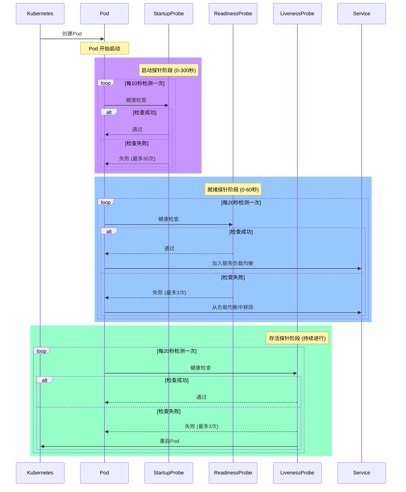
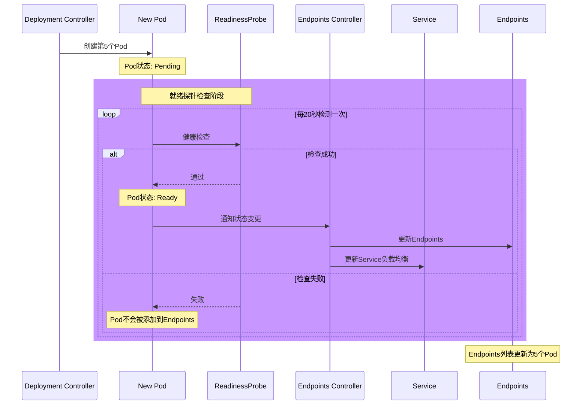

- [SeqDigram](#seqdigram)
- [reference](#reference)
- [My Template setting](#my-template-setting)
    - [概述三个探针的作用](#概述三个探针的作用)
    - [`startupProbe` 默认参数值](#startupprobe-默认参数值)
    - [探针类型及其默认行为](#探针类型及其默认行为)
    - [说明](#说明)
    - [示例：未配置参数的 `startupProbe`](#示例未配置参数的-startupprobe)
    - [注意事项](#注意事项)
    - [当前配置分析](#当前配置分析)
    - [优化建议](#优化建议)
    - [优化后的完整配置建议](#优化后的完整配置建议)
    - [补充说明](#补充说明)
- [summary](#summary)
- [endpoint](#endpoint)
- [pod start time](#pod-start-time)
- [endpoint Testing](#endpoint-testing)
- [我想核对endpoints 什么时候生效？](#我想核对endpoints-什么时候生效)

# SeqDigram 

# reference
- references:
- [liveness](./liveness.md)

# My Template setting 
```yaml
      readinessProbe:
        httpGet:
          scheme: HTTPS
          path: /health
          port: {{port}}
        periodSeconds: 20
        failureThreshold: 3
        timeoutSeconds: 3
      livenessProbe:
        httpGet:
          scheme: HTTPS
          path: /health
          port: {{port}}
        periodSeconds: 20
        failureThreshold: 3
        timeoutSeconds: 3
      startupProbe:
        httpGet:
          scheme: HTTPS
          path: /health
          port: {{port}}
        periodSeconds: 10
        failureThreshold: 30
```

让我帮你分析这三个探针的配置及其优化建议：

### 概述三个探针的作用

1. **readinessProbe（就绪探针）**
   - 用于判断容器是否准备好接收流量
   - 失败时会将 Pod 从服务的负载均衡中移除
   
2. **livenessProbe（存活探针）**
   - 用于判断容器是否正常运行
   - 失败时会重启容器

3. **startupProbe（启动探针）**
   - 用于判断容器是否已经完成启动
   - 在启动探针运行时，会暂停其他探针
   - 适用于需要较长启动时间的应用

在Kubernetes（K8S）中，如果您没有为 `startupProbe` 配置任何参数，Kubernetes会为每个参数分配默认值。以下是 `startupProbe` 的所有相关参数及其默认值的详细说明。这些默认值基于Kubernetes的官方文档和源码定义。

### `startupProbe` 默认参数值
`startupProbe` 的配置参数与 `livenessProbe` 和 `readinessProbe` 类似，主要包括以下几项：

| 参数名              | 默认值       | 描述                                                                 |
|---------------------|--------------|----------------------------------------------------------------------|
| `timeoutSeconds`    | 1 秒         | 探针等待响应的最长时间，超过此时间则认为检查失败。                   |
| `periodSeconds`     | 10 秒        | 探针检查的间隔时间，即多久执行一次探针。                            |
| `successThreshold`  | 1 次         | 探针成功多少次后认为容器状态正常（对于 `startupProbe` 通常为1）。    |
| `failureThreshold`  | 3 次         | 探针失败多少次后认为容器启动失败并执行重启策略。                    |
| `initialDelaySeconds` | 0 秒       | 容器启动后，首次执行探针前的延迟时间。                              |

### 探针类型及其默认行为
`startupProbe` 必须指定具体的探针类型（如 `httpGet`、`tcpSocket` 或 `exec`），否则无法生效。如果未配置具体的探针类型，Kubernetes不会执行任何探针操作。以下是每种探针类型的默认行为说明（如果未指定探针的具体参数）：

- **`httpGet`**: 如果未指定路径（`path`），默认路径为 `/`；如果未指定端口（`port`），需要确保容器定义了端口。
- **`tcpSocket`**: 需要指定端口（`port`），否则无法执行。
- **`exec`**: 需要指定具体的命令（`command`），否则无法执行。

### 说明
1. **默认值来源**：这些默认值是Kubernetes在解析PodSpec时硬编码的，具体可以在Kubernetes的API定义和源码中找到（如 `k8s.io/api/core/v1/types.go`）。
2. **未配置探针**：如果Pod定义中完全未配置 `startupProbe`，Kubernetes不会执行任何启动探针检查，容器会直接进入运行状态（假设没有其他依赖或限制）。
3. **与其他探针的关系**：`startupProbe` 在容器启动阶段生效，一旦成功，Kubernetes会停止 `startupProbe` 检查，并开始执行 `livenessProbe` 和 `readinessProbe`（如果配置了的话）。

### 示例：未配置参数的 `startupProbe`
以下是一个极简的 `startupProbe` 配置，仅指定了探针类型和目标：

```yaml
apiVersion: v1
kind: Pod
metadata:
  name: example-pod
spec:
  containers:
  - name: example-container
    image: nginx
    startupProbe:
      httpGet:
        path: /health
        port: 80
```

在此配置中，未显式指定的参数将使用上述默认值：
- `timeoutSeconds` = 1秒
- `periodSeconds` = 10秒
- `successThreshold` = 1次
- `failureThreshold` = 3次
- `initialDelaySeconds` = 0秒

### 注意事项
- **调整默认值**：如果您的应用启动时间较长，或者探针目标响应较慢，建议显式配置参数（如增加 `timeoutSeconds` 或 `failureThreshold`），以避免容器被误判为启动失败。
- **探针失败后果**：如果 `startupProbe` 达到 `failureThreshold` 次失败，Kubernetes会根据Pod的 `restartPolicy` 决定是否重启容器（默认情况下是重启）。

如果您有其他关于Kubernetes探针或其他相关的问题，欢迎继续提问！


### 当前配置分析

```yaml:/Users/lex/git/knowledge/k8s/liveness.md
readinessProbe:
  httpGet:
    scheme: HTTPS    # 使用HTTPS协议
    path: /health    # 健康检查路径
    port: {{port}}   # 检查端口
  periodSeconds: 20  # 每20秒检查一次
  failureThreshold: 3  # 允许3次失败
  timeoutSeconds: 3    # 超时时间3秒

livenessProbe:
  # 配置与readinessProbe相同
  ...

startupProbe:
  # 配置与其他探针类似，但间隔和失败阈值不同
  periodSeconds: 10    # 每10秒检查一次
  failureThreshold: 30 # 允许30次失败
```

### 优化建议

1. **readinessProbe 优化建议**：
   - `periodSeconds: 20` → `10`：建议缩短检查间隔，以更快发现问题
   - `timeoutSeconds: 3` 可以保持不变，这是一个比较合理的值
   - 建议添加 `initialDelaySeconds: 5`：给应用一个初始化时间
   - 建议添加 `successThreshold: 1`：明确成功阈值

2. **livenessProbe 优化建议**：
   - `periodSeconds: 20` → `30`：可以适当延长存活检查间隔，减少系统负担
   - 建议添加 `initialDelaySeconds: 30`：给予更长的初始化时间
   - `timeoutSeconds: 3` 可以保持不变
   - `failureThreshold: 3` 可以保持不变

3. **startupProbe 优化建议**：
   - 当前配置基本合理，但可以考虑：
   - `periodSeconds: 10` → `5`：缩短检查间隔，加快启动检测
   - `failureThreshold: 30` 可以保持不变（允许 30 * 5 = 150 秒的启动时间）

### 优化后的完整配置建议

```yaml:/Users/lex/git/knowledge/k8s/liveness.md
readinessProbe:
  httpGet:
    scheme: HTTPS
    path: /health
    port: {{port}}
  initialDelaySeconds: 5
  periodSeconds: 10
  failureThreshold: 3
  timeoutSeconds: 3
  successThreshold: 1

livenessProbe:
  httpGet:
    scheme: HTTPS
    path: /health
    port: {{port}}
  initialDelaySeconds: 30
  periodSeconds: 30
  failureThreshold: 3
  timeoutSeconds: 3
  successThreshold: 1

startupProbe:
  httpGet:
    scheme: HTTPS
    path: /health
    port: {{port}}
  periodSeconds: 5
  failureThreshold: 30
  timeoutSeconds: 3
  successThreshold: 1
```

### 补充说明

1. 这些优化建议基于一般场景，具体值需要根据你的应用特点调整：
   - 应用启动时间
   - 系统资源情况
   - 业务可用性要求
   - 网络环境状况

2. 建议在测试环境验证这些参数，观察：
   - 应用启动时间
   - 探针检查对系统性能的影响
   - 异常情况下的恢复时间

3. 监控建议：
   - 监控探针的失败率
   - 记录探针超时情况
   - 观察容器重启频率

# summary
- 那么我一个新的Pod如果要运行成功,且接受流量那么其实是要经历startupProbe. readiness Probe两个过程

| 探针类型 | 最短时间 | 最长时间 | 计算说明 |
|---------|----------|----------|----------|
| startupProbe | 0秒 | 300秒 | 最短：立即成功<br>最长：periodSeconds(10) * failureThreshold(30) = 300秒 |
| readinessProbe | 0秒 | 60秒 | 最短：立即成功<br>最长：periodSeconds(20) * failureThreshold(3) = 60秒 |
| **总计** | **0秒** | **360秒** | 最短：两个探针都立即成功<br>最长：startupProbe(300秒) + readinessProbe(60秒) |


# endpoint
让我用序列图来说明当 Deployment 从 4 个副本扩展到 5 个副本时，就绪探针与 Endpoints 更新的完整流程：



关键流程说明：

1. Deployment Controller 创建新的 Pod（第 5 个副本）
2. 新 Pod 启动后进行就绪探针检查
3. 就绪探针通过后：
   - Pod 状态变为 Ready
   - Endpoints Controller 检测到 Pod 状态变化
   - 更新 Endpoints 资源，添加新 Pod 的 IP 和端口
   - Service 的负载均衡器获取更新后的 Endpoints 列表

你可以通过以下命令观察这个过程：
```bash
# 查看 Endpoints 变化
kubectl get endpoints <service-name> -w

# 查看 Pod 就绪状态变化
kubectl get pods -w
```

# pod start time 


kubectl get deployment -n lex                                      admin@NASLEX
NAME                 READY   UP-TO-DATE   AVAILABLE   AGE
busybox-deployment   4/4     4            4           6d14h
nginx-deployment     4/4     4            4           6m13s

```bash
kubectl describe pod nginx-deployment-5f65f66f6d-st6tb -n lex      admin@NASLEX
Name:         nginx-deployment-5f65f66f6d-st6tb
Namespace:    lex
Priority:     0
Node:         qnap-k3s-q21ca01210/10.0.3.2
Start Time:   Sat, 15 Feb 2025 09:52:55 +0800
Labels:       app=nginx
              pod-template-hash=5f65f66f6d
Annotations:  <none>
Status:       Running
IP:           10.42.0.58
IPs:
  IP:           10.42.0.58
Controlled By:  ReplicaSet/nginx-deployment-5f65f66f6d
Containers:
  nginx:
    Container ID:   containerd://b18915ec93e63e5cf4c0d5964cffca89541ed28ed27b76fa19a4f10db40e7633
    Image:          nginx:latest
    Image ID:       docker.io/library/nginx@sha256:32e76d4f34f80e479964a0fbd4c5b4f6967b5322c8d004e9cf0cb81c93510766
    Port:           <none>
    Host Port:      <none>
    State:          Running
      Started:      Sat, 15 Feb 2025 09:52:57 +0800
    Ready:          True
    Restart Count:  0
    Limits:
      cpu:     200m
      memory:  128Mi
    Requests:
      cpu:        100m
      memory:     64Mi
    Liveness:     http-get http://:80/ delay=0s timeout=3s period=20s #success=1 #failure=3
    Readiness:    http-get http://:80/ delay=0s timeout=3s period=20s #success=1 #failure=3
    Startup:      http-get http://:80/ delay=0s timeout=1s period=10s #success=1 #failure=30
    Environment:  <none>
    Mounts:
      /var/run/secrets/kubernetes.io/serviceaccount from kube-api-access-pnhgb (ro)
Conditions:
  Type              Status
  Initialized       True 
  Ready             True 
  ContainersReady   True 
  PodScheduled      True 
Volumes:
  kube-api-access-pnhgb:
    Type:                    Projected (a volume that contains injected data from multiple sources)
    TokenExpirationSeconds:  3607
    ConfigMapName:           kube-root-ca.crt
    ConfigMapOptional:       <nil>
    DownwardAPI:             true
QoS Class:                   Burstable
Node-Selectors:              <none>
Tolerations:                 node.kubernetes.io/not-ready:NoExecute op=Exists for 300s
                             node.kubernetes.io/unreachable:NoExecute op=Exists for 300s
Events:
  Type    Reason     Age    From               Message
  ----    ------     ----   ----               -------
  Normal  Scheduled  3m31s  default-scheduler  Successfully assigned lex/nginx-deployment-5f65f66f6d-st6tb to qnap-k3s-q21ca01210
  Normal  Pulled     3m31s  kubelet            Container image "nginx:latest" already present on machine
  Normal  Created    3m31s  kubelet            Created container nginx
  Normal  Started    3m30s  kubelet            Started container nginx
```
- 脚本来分析 Pod 的启动时间线和探针状态：
使用方法：
```bash
chmod +x pod_status.sh
./pod_status.sh -n lex nginx-deployment
```

这个脚本会：

1. 显示每个 Pod 的详细时间线：
   - Pod 创建时间
   - 容器启动时间
   - 探针开始工作时间

2. 显示探针配置详情：
   - 启动探针配置
   - 就绪探针配置
   - 存活探针配置

3. 显示关键事件时间线：
   - Pod 调度时间
   - 容器创建时间
   - 容器启动时间
   - 镜像拉取时间

4. 分析服务可用性：
   - 从 Pod 创建到就绪的总耗时
   - 当前就绪状态

输出会使用颜色区分不同类型的信息，方便查看。需要确保系统安装了 `jq` 工具来解析 JSON 输出。


- adjust script
```bash
#!/bin/bash

# 设置颜色输出
GREEN='\033[0;32m'
BLUE='\033[0;34m'
YELLOW='\033[1;33m'
NC='\033[0m'

# 检查参数
if [ "$#" -lt 3 ]; then
    echo "Usage: $0 -n <namespace> <deployment-name>"
    exit 1
fi

# 解析参数
while getopts "n:" opt; do
    case $opt in
        n) NAMESPACE="$OPTARG";;
        *) echo "Invalid option: -$OPTARG" >&2; exit 1;;
    esac
done
shift $((OPTIND-1))
DEPLOYMENT=$1

echo -e "${BLUE}分析 Deployment: ${DEPLOYMENT} 在命名空间: ${NAMESPACE} 中的 Pod 状态${NC}\n"

# 获取所有相关的 pods
PODS=$(kubectl get pods -n ${NAMESPACE} -l app=${DEPLOYMENT} --no-headers -o custom-columns=":metadata.name")

for POD in ${PODS}; do
    echo -e "${YELLOW}Pod: ${POD}${NC}"
    
    # 获取 Pod 详细信息
    START_TIME=$(kubectl get pod ${POD} -n ${NAMESPACE} -o jsonpath='{.status.startTime}')
    CONTAINER_START=$(kubectl get pod ${POD} -n ${NAMESPACE} -o jsonpath='{.status.containerStatuses[0].state.running.startedAt}')
    
    # 获取探针配置
    STARTUP_PROBE=$(kubectl get pod ${POD} -n ${NAMESPACE} -o jsonpath='{.spec.containers[0].startupProbe}')
    READINESS_PROBE=$(kubectl get pod ${POD} -n ${NAMESPACE} -o jsonpath='{.spec.containers[0].readinessProbe}')
    LIVENESS_PROBE=$(kubectl get pod ${POD} -n ${NAMESPACE} -o jsonpath='{.spec.containers[0].livenessProbe}')
    
    # 获取 Pod 事件
    EVENTS=$(kubectl get events -n ${NAMESPACE} --field-selector involvedObject.name=${POD} --sort-by='.lastTimestamp' -o json)
    
    echo "时间线分析:"
    echo "━━━━━━━━━━━━━━━━━━━━━━━━━━━━━━━━━━━━━━━━"
    echo -e "${GREEN}1. Pod 创建时间:${NC} ${START_TIME}"
    echo -e "${GREEN}2. 容器启动时间:${NC} ${CONTAINER_START}"
    
    # 分析探针配置
    echo -e "\n探针配置:"
    echo "━━━━━━━━━━━━━━━━━━━━━━━━━━━━━━━━━━━━━━━━"
    if [ ! -z "$STARTUP_PROBE" ]; then
        echo -e "${GREEN}启动探针:${NC}"
        kubectl get pod ${POD} -n ${NAMESPACE} -o jsonpath='{.spec.containers[0].startupProbe}' | jq '.'
    fi
    
    if [ ! -z "$READINESS_PROBE" ]; then
        echo -e "${GREEN}就绪探针:${NC}"
        kubectl get pod ${POD} -n ${NAMESPACE} -o jsonpath='{.spec.containers[0].readinessProbe}' | jq '.'
    fi
    
    if [ ! -z "$LIVENESS_PROBE" ]; then
        echo -e "${GREEN}存活探针:${NC}"
        kubectl get pod ${POD} -n ${NAMESPACE} -o jsonpath='{.spec.containers[0].livenessProbe}' | jq '.'
    fi
    
    # 分析关键事件
    echo -e "\n关键事件时间线:"
    echo "━━━━━━━━━━━━━━━━━━━━━━━━━━━━━━━━━━━━━━━━"
    echo "$EVENTS" | jq -r '.items[] | select(.reason == "Scheduled" or .reason == "Started" or .reason == "Created" or .reason == "Pulled") | "\(.lastTimestamp) [\(.reason)] \(.message)"' | sort
    
    # 获取当前状态
    READY_STATUS=$(kubectl get pod ${POD} -n ${NAMESPACE} -o jsonpath='{.status.conditions[?(@.type=="Ready")]}')
    
    echo -e "\n当前状态:"
    echo "━━━━━━━━━━━━━━━━━━━━━━━━━━━━━━━━━━━━━━━━"
    echo "$READY_STATUS" | jq '.'
    
    echo -e "\n${BLUE}服务可用性分析:${NC}"
    READY_TIME=$(echo "$READY_STATUS" | jq -r '.lastTransitionTime')
    # 时间计算部分的修改
    if [ ! -z "$START_TIME" ] && [ ! -z "$READY_TIME" ]; then
        # 将 UTC 时间转换为时间戳
        START_SECONDS=$(date -d "$(echo $START_TIME | sed 's/Z$//')" +%s 2>/dev/null || date -j -f "%Y-%m-%dT%H:%M:%S" "$(echo $START_TIME | sed 's/Z$//')" +%s)
        READY_SECONDS=$(date -d "$(echo $READY_TIME | sed 's/Z$//')" +%s 2>/dev/null || date -j -f "%Y-%m-%dT%H:%M:%S" "$(echo $READY_TIME | sed 's/Z$//')" +%s)
        
        if [ ! -z "$START_SECONDS" ] && [ ! -z "$READY_SECONDS" ]; then
            TOTAL_SECONDS=$((READY_SECONDS - START_SECONDS))
            echo "从 Pod 创建到就绪总共耗时: ${TOTAL_SECONDS} 秒"
            
            # 添加更详细的时间信息
            echo "Pod 创建时间: $(date -d "@$START_SECONDS" '+%Y-%m-%d %H:%M:%S' 2>/dev/null || date -r $START_SECONDS '+%Y-%m-%d %H:%M:%S')"
            echo "Pod 就绪时间: $(date -d "@$READY_SECONDS" '+%Y-%m-%d %H:%M:%S' 2>/dev/null || date -r $READY_SECONDS '+%Y-%m-%d %H:%M:%S')"
        else
            echo "时间计算失败: 无法解析时间格式"
        fi
    else
        echo "时间计算失败: 缺少必要的时间信息"
    fi
    echo -e "\n${YELLOW}━━━━━━━━━━━━━━━━━━━━━━━━━━━━━━━━━━━━━━━━${NC}\n"
done
``` 

# endpoint Testing 
- deployment.yaml
```yaml
apiVersion: apps/v1
kind: Deployment
metadata:
  name: nginx-deployment
  labels:
    app: nginx-deployment
spec:
  replicas: 4
  strategy:
    type: RollingUpdate
    rollingUpdate:
      maxSurge: 1        # 更新过程中最多可以比原先设置多出的 Pod 数量
      maxUnavailable: 1  # 更新过程中最多允许多少个 Pod 处于无法提供服务的状态
  selector:
    matchLabels:
      app: nginx-deployment
  template:
    metadata:
      labels:
        app: nginx-deployment
    spec:
      containers:
      - name: nginx
        image: nginx:latest
        imagePullPolicy: Never    # 强制使用本地镜像
        resources:
          requests:
            memory: "64Mi"
            cpu: "100m"
          limits:
            memory: "128Mi"
            cpu: "200m"
        readinessProbe:
          httpGet:
            scheme: HTTP
            path: /
            port: 80  # 请替换为实际端口号
          periodSeconds: 20
          failureThreshold: 3
          timeoutSeconds: 3
        livenessProbe:
          httpGet:
            scheme: HTTP
            path: /
            port: 80  # 请替换为实际端口号
          periodSeconds: 20
          failureThreshold: 3
          timeoutSeconds: 3
        startupProbe:
          httpGet:
            scheme: HTTP
            path: /
            port: 80  # 请替换为实际端口号
          periodSeconds: 10
          failureThreshold: 30
```
- service.yaml
```yaml
apiVersion: v1
kind: Service
metadata:
  name: nginx-service
  labels:
    app: nginx-deployment
spec:
  type: NodePort       # 将 ClusterIP 改为 NodePort
  ports:
    - port: 80        # 集群内部访问端口
      targetPort: 80  # Pod 端口
      nodePort: 61001 # 节点端口(可选，不指定会随机分配30000-32767)
      protocol: TCP
      name: http
  selector:
    app: nginx-deployment
```
- verify status 
```bash
~/deploy # kubectl get svc -n lex                                             admin@NASLEX
NAME            TYPE       CLUSTER-IP      EXTERNAL-IP   PORT(S)        AGE
nginx-service   NodePort   10.43.110.221   <none>        80:61001/TCP   6m21s

~/deploy # kubectl get endpoints -n lex                                       admin@NASLEX
NAME            ENDPOINTS                                               AGE
nginx-service   10.42.0.61:80,10.42.0.62:80,10.42.0.63:80 + 1 more...   6m43s
------------------------------------------------------------
~/deploy # kubectl describe endpoints nginx-service  -n lex                   admin@NASLEX
Name:         nginx-service
Namespace:    lex
Labels:       app=nginx-deployment
Annotations:  endpoints.kubernetes.io/last-change-trigger-time: 2025-02-15T02:31:09Z
Subsets:
  Addresses:          10.42.0.61,10.42.0.62,10.42.0.63,10.42.0.64
  NotReadyAddresses:  <none>
  Ports:
    Name  Port  Protocol
    ----  ----  --------
    http  80    TCP

Events:  <none>

```

- 查看 Endpoints 变化
`kubectl get endpoints <service-name> -w`
```bash
kubectl get endpoints nginx-service -n lex -o json
kubectl get endpoints nginx-service -n lex -o json | jq '.subsets[].addresses'
kubectl get endpoints nginx-service -n lex -o jsonpath='{.subsets[*].addresses[*].ip}'
```
- 查看 Pod 就绪状态变化
kubectl get pods -w

- next to do 
  - wrk request from my Laptop
  - scale deployment number to 10 
    - `kubectl scale deployment nginx-deployment --replicas=10 -n lex`
  - check the endpoint status 


```bash
~/deploy # kubectl get endpoints nginx-service -n lex -w                                                      admin@NASLEX
NAME            ENDPOINTS                                               AGE
nginx-service   10.42.0.61:80,10.42.0.62:80,10.42.0.63:80 + 1 more...   16m
nginx-service   10.42.0.61:80,10.42.0.62:80,10.42.0.63:80 + 1 more...   17m
nginx-service   10.42.0.61:80,10.42.0.62:80,10.42.0.63:80 + 1 more...   17m
nginx-service   10.42.0.61:80,10.42.0.62:80,10.42.0.63:80 + 1 more...   17m
nginx-service   10.42.0.61:80,10.42.0.62:80,10.42.0.63:80 + 1 more...   17m
nginx-service   10.42.0.61:80,10.42.0.62:80,10.42.0.63:80 + 1 more...   17m
nginx-service   10.42.0.61:80,10.42.0.62:80,10.42.0.63:80 + 1 more...   17m
nginx-service   10.42.0.61:80,10.42.0.62:80,10.42.0.63:80 + 2 more...   17m
nginx-service   10.42.0.61:80,10.42.0.62:80,10.42.0.63:80 + 3 more...   17m
nginx-service   10.42.0.61:80,10.42.0.62:80,10.42.0.63:80 + 4 more...   17m
nginx-service   10.42.0.61:80,10.42.0.62:80,10.42.0.63:80 + 5 more...   17m
nginx-service   10.42.0.61:80,10.42.0.62:80,10.42.0.63:80 + 6 more...   17m
nginx-service   10.42.0.61:80,10.42.0.62:80,10.42.0.63:80 + 7 more...   17m


[~] # kubectl  describe endpoints nginx-service -n lex
Name:         nginx-service
Namespace:    lex
Labels:       app=nginx-deployment
Annotations:  <none>
Subsets:
  Addresses:          10.42.0.61,10.42.0.62,10.42.0.63,10.42.0.64,10.42.0.66
  NotReadyAddresses:  <none>
  Ports:
    Name  Port  Protocol
    ----  ----  --------
    http  80    TCP

Events:  <none>
```
- wrk
```bash
wrk -c 10 -d 300s http://192.168.31.88:61001
Running 5m test @ http://192.168.31.88:61001
  2 threads and 10 connections
  Thread Stats   Avg      Stdev     Max   +/- Stdev
    Latency    10.23ms   10.27ms 243.28ms   94.49%
    Req/Sec   565.95    129.95   808.00     79.84%
  337447 requests in 5.00m, 274.51MB read
  Socket errors: connect 0, read 8, write 0, timeout 0
Requests/sec:   1124.49
Transfer/sec:      0.91MB
```
是的，有几种方法可以更详细地观察 Endpoints 的变化过程和时间点：

1. 使用 `kubectl get events` 查看与 Endpoints 相关的事件：
```bash
kubectl get events -n lex --field-selector involvedObject.kind=Endpoints,involvedObject.name=nginx-service --sort-by='.lastTimestamp' -w
```

1. 使用 `kubectl get endpoints` 的 JSON 输出并关注 `lastTransitionTime`：
```bash
kubectl get endpoints nginx-service -n lex -o json | jq '.metadata.annotations."endpoints.kubernetes.io/last-change-trigger-time"'
```

1. 创建一个监控脚本，同时观察 Endpoints 和 Pod 的变化：
```bash:/Users/lex/git/knowledge/k8s/scripts/monitor_endpoints.sh
#!/bin/bash

NAMESPACE=$1
SERVICE_NAME=$2

echo "开始监控 Endpoints 变化..."
echo "时间戳 | Endpoints 数量 | Pod IPs"
echo "----------------------------------------"

while true; do
    TIMESTAMP=$(date '+%Y-%m-%d %H:%M:%S')
    ENDPOINTS=$(kubectl get endpoints $SERVICE_NAME -n $NAMESPACE -o jsonpath='{.subsets[*].addresses[*].ip}')
    COUNT=$(echo $ENDPOINTS | wc -w)
    
    # 获取最后修改时间
    LAST_CHANGE=$(kubectl get endpoints $SERVICE_NAME -n $NAMESPACE -o jsonpath='{.metadata.annotations.endpoints\.kubernetes\.io/last-change-trigger-time}')
    
    echo "$TIMESTAMP | $COUNT | $ENDPOINTS | Last Change: $LAST_CHANGE"
    sleep 1
done
```

使用方法：
```bash
chmod +x monitor_endpoints.sh
./monitor_endpoints.sh lex nginx-service
```

4. 使用 `kubectl get` 的自定义输出格式：
```bash
kubectl get endpoints nginx-service -n lex -o custom-columns="LAST_CHANGE:.metadata.annotations.endpoints\.kubernetes\.io/last-change-trigger-time,ENDPOINTS:.subsets[*].addresses[*].ip" -w
```

这些方法可以帮助你：
- 观察 Endpoints 的实时变化
- 记录具体的时间点
- 追踪 IP 地址的变化
- 监控 Endpoints 的更新过程

建议同时使用多个终端窗口，一个运行监控脚本，另一个执行扩缩容操作，这样可以更清晰地观察整个过程。

# 我想核对endpoints 什么时候生效？
1. Service 的 Endpoint 更新延迟: Kubernetes Service 需要一定时间来更新其 endpoint 列表，以反映 Pod 的就绪状态。虽然这个延迟通常很短，但在某些情况下也可能导致短暂的不一致。

在Kubernetes中，Service的Endpoint列表是动态管理的，并且确实需要一定的时间来更新。当Kubernetes的Pod状态发生变化时（如新Pod创建、Pod终止、Pod重启等），Service会根据这些Pod的状态自动更新其Endpoint列表。下面是详细的过程，以及如何优化以实现高可用性。

Kubernetes Service Endpoint更新过程
	1.	Pod变更：
	•	当一个Pod的状态发生变化（如启动、终止或崩溃重启），它会触发Kubernetes控制器的事件。
	•	控制器（如Kube-controller-manager）会监控这些变化，并通过Kubernetes API更新Pod的状态。
	2.	Endpoint更新：
	•	服务的Endpoint是通过Kubernetes控制器自动管理的。当一个Pod变为“就绪”状态时，它会被加入到该Service的Endpoint列表中。
	•	Endpoint更新有一定的延迟，通常在Pod状态变更后的几秒钟到几十秒之间。
	3.	服务发现：
	•	Kubernetes Service通过kube-proxy或其他负载均衡机制（如Cloud Provider负载均衡器）将流量路由到对应的Pod。
	•	kube-proxy会定期轮询Kubernetes API Server，获取当前的Endpoint列表。如果Service的Endpoint发生变化，kube-proxy会更新本地路由表。
	4.	延迟：
	•	服务Endpoint的更新会有一定的延迟，通常是在Pod健康检查通过后，Service才会将新Pod的IP添加到Endpoint列表中。
	•	这个过程会涉及API Server的调用、Endpoint Controller的处理、以及kube-proxy的同步。

高可用性优化
	1.	Pod和Service的健康检查：
	•	配置合理的readinessProbe和livenessProbe。这样，Pod只有在健康并准备好接收流量时，才会被加入到Service的Endpoint列表中，避免将流量路由到不健康的Pod。
	•	livenessProbe可以检测Pod是否需要重启，readinessProbe可以确保Pod已经准备好接收流量。
	2.	PodDisruptionBudget (PDB)：
	•	配置PDB，确保在Pod变动时，始终保持一定数量的Pod可用。这可以避免在Pod更新或重启时，Service的可用性下降。例如，确保至少有一个Pod始终在运行中。
示例配置：
```yaml
apiVersion: policy/v1
kind: PodDisruptionBudget
metadata:
  name: rt-pdb
spec:
  minAvailable: 1
  selector:
    matchLabels:
      app: gke-rt
```

	3.	提升Pod的扩展性：
	•	Horizontal Pod Autoscaling (HPA) 可以在负载较高时自动扩展Pod数目。确保Pod数量充足，以应对流量波动。
	•	可以使用Deployment的maxSurge和maxUnavailable策略来控制升级时的Pod替换策略，以减少Downtime。
	4.	负载均衡优化：
	•	确保Kubernetes Service的负载均衡机制（例如，kube-proxy或Cloud负载均衡器）能够高效地将流量分发到健康的Pod上。可以根据需要使用外部负载均衡器（如Google Cloud Load Balancer）来提高流量分发的稳定性。
	5.	Endpoint Controller的优化：
	•	Kubernetes默认会定期更新Service的Endpoint列表。虽然这个过程通常很快，但在一些大型集群中可能会有延迟。如果集群有较高的流量要求，考虑手动配置外部负载均衡器，以减少内部Kubernetes服务的负担。
	6.	分布式架构：
	•	将Pod分布到不同的Node上，并使用affinity策略确保Pod分散，避免集群中的某个节点宕机导致大规模的可用性问题。
	7.	优先考虑Rolling Updates：
	•	使用RollingUpdate策略来逐步替换Pod，而不是在整个Deployment中同时销毁所有Pod，这样可以确保在Pod更新过程中，服务始终保持高可用。
	•	调整maxSurge和maxUnavailable的值，使得在Pod替换过程中，仍有足够的Pod可用来处理流量。

受时间影响的优化点
	1.	避免过多的Pod启动时间：
	•	如果Pod的启动时间较长，可以通过调优容器的启动顺序、依赖性、资源请求等，减少启动时间。
	•	配置readinessProbe和livenessProbe时，确保检测到Pod健康的时间不宜过长，以免推迟Pod的加入。
	2.	服务的冷启动：
	•	在Pod启动时，如果服务需要初始化一些资源，可以考虑将初始化过程分成多个步骤，并在readinessProbe通过后，才开始接收流量。
	3.	提升Endpoint更新效率：
	•	尽量减少对API Server的频繁请求，避免因集群负载过高导致更新延迟。可以通过合理配置kube-proxy和Endpoint Controller，提高更新速度。

总结
	•	为确保高可用性，建议配置readinessProbe、PDB、Horizontal Pod Autoscaling和负载均衡优化。
	•	使用RollingUpdate时，要根据实际流量需求合理配置maxSurge和maxUnavailable，同时确保Pod的分布和健康检查配置良好。
	•	配置合适的健康检查和Pod数量，确保在升级过程中最小化Downtime。

这样，服务的Endpoint更新和Pod替换过程中，流量路由到健康Pod的几率会增加，减少了Downtime的发生。