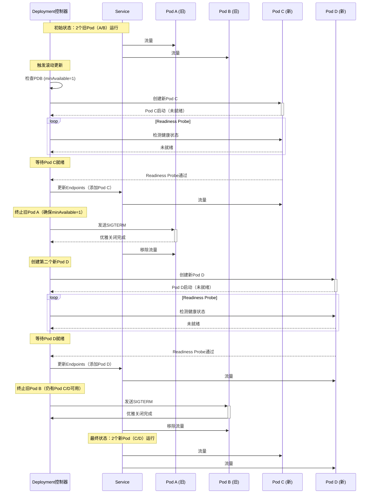
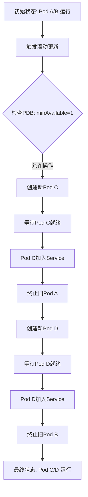

# Q 
PDB 确保滚动更新或节点维护时始终有足够数量的POD处理请求 那么这样看起来我的pod其实是可以接收请 如果不考虑处理特殊的post请求的话 其实我更担心的问题是我没有足够的Pod来提供服务 如果配置了PDB 那么看起来 始终最少有一个Pod是可用的 是这样么 比如我的SVC的endpoint 如果配置了PDB. 那我最少有一个pod 的是在提供服务的 node 升级的过程 会确保我最少这一个Pod状态正常能够提供服务
# Think
好的，我现在需要帮助用户理解Pod Disruption Budget（PDB）在Kubernetes中的作用，尤其是在节点升级或滚动更新时如何确保至少有一个Pod可用。用户之前的问题是关于POST请求可能被中断的情况，现在他们关心的是PDB是否能保证最少有一个Pod提供服务，特别是在节点升级期间。

首先，我要确认用户的理解是否正确。用户提到配置PDB后，始终最少有一个Pod可用，这样在节点升级时，至少有一个Pod状态正常。我需要验证这个观点是否正确，并解释PDB如何与其他机制协同工作。

接下来，我需要回顾之前的对话，确保回答的一致性和连贯性。之前已经讨论了优雅关闭、Readiness Probe、滚动更新策略等，现在重点在PDB。用户可能认为PDB单独就能解决问题，但实际上它需要与其他机制配合使用。

我需要明确PDB的作用范围：它管理的是自愿中断（如节点维护、滚动更新），而不是非自愿中断（如节点故障）。PDB通过设置minAvailable或maxUnavailable来限制同时中断的Pod数量，确保服务可用性。

然后，我需要解释在节点升级时，PDB如何与Kubernetes的调度器协作。例如，当节点需要排空（drain）时，Kubernetes会检查PDB，确保不会同时终止太多Pod。如果有PDB要求minAvailable: 1，那么排空过程中会逐个终止Pod，确保至少有一个Pod在运行。

同时，需要指出PDB的局限性。比如，如果只有一个Pod，配置minAvailable: 1会导致节点升级被阻塞，因为无法终止任何Pod。这时候需要权衡可用性和可维护性，可能需要调整副本数或PDB配置。

还要强调，即使PDB保证了Pod的数量，单个Pod的处理能力可能成为瓶颈，尤其是在处理长时间请求时。因此，结合优雅关闭和Readiness Probe是必要的，确保请求被正确处理，流量被正确迁移。

用户可能担心的是，在节点升级期间，如果只有一个Pod，是否会中断服务。需要说明，如果正确配置了PDB、优雅关闭和Readiness Probe，可以最小化中断。例如，当节点排空时，Kubernetes会先终止Pod，但PDB确保至少有一个Pod在运行，直到新的Pod准备就绪。

此外，需要提供配置示例，帮助用户理解如何实际应用PDB。例如，设置minAvailable为1，并确保有多个副本，这样在滚动更新时，新Pod启动后旧Pod才会被终止，保持服务可用。

最后，总结PDB的作用，强调它作为整体可靠性策略的一部分，需要与其他机制结合使用，才能有效防止请求中断，特别是在处理关键操作如POST请求时。
# A
你的理解基本正确，但需要结合 Kubernetes 的具体行为来更精确地解释。以下是关于 PDB 如何保障服务可用性的详细分析：

PDB 的核心逻辑

1. PDB 的作用
PDB 通过 minAvailable 或 maxUnavailable 字段，限制 Kubernetes 在自愿中断（如节点升级、滚动更新）时，同时终止的 Pod 数量。例如：
```yaml
apiVersion: policy/v1
kind: PodDisruptionBudget
metadata:
  name: api-pdb
spec:
  minAvailable: 1  # 保证至少 1 个 Pod 始终可用
  selector:
    matchLabels:
      app: api-service
``` 
2. 节点升级时的行为

· 当 GKE 触发节点升级时，Kubernetes 会尝试排空（Drain）节点上的 Pod。

· 排空过程会触发 Pod 的优雅关闭流程（发送 SIGTERM → 等待 terminationGracePeriodSeconds → 强制终止）。

· PDB 会介入排空过程：如果终止某个 Pod 会导致可用 Pod 数量低于 minAvailable，则排空操作会被阻塞，直到有新的 Pod 启动并就绪。

你的场景验证

假设你的服务有以下配置：

· Deployment: replicas: 2（2 个 Pod）

· PDB: minAvailable: 1

· Service: 通过标签选择器将流量路由到 Pod。

当节点升级时，Kubernetes 的行为如下：

1. 节点排空触发

· 节点上的 Pod 会被标记为需终止。

· Kubernetes 检查 PDB，发现当前有 2 个 Pod 可用，终止 1 个 Pod 后仍满足 minAvailable: 1，因此允许终止。

2. Pod 优雅关闭

· 被终止的 Pod 收到 SIGTERM，开始优雅关闭流程。

· 关键点：如果 Pod 实现了优雅关闭逻辑，它会：

1. 停止接受新请求（通过 Readiness Probe 失败）。

2. 完成正在处理的请求（如 POST 请求）。

3. 退出进程。

3. 流量切换

· Kubernetes Service 的 Endpoints 控制器会检测到 Pod 的 NotReady 状态，将其从负载均衡池中移除。

· 剩余 1 个 Pod 继续处理流量。

4. 新 Pod 调度

· Kubernetes 会在其他节点上启动新的 Pod 以维持 replicas: 2。

· 新 Pod 通过 Readiness Probe 后，重新加入 Service 的负载均衡池。

极端场景分析

场景 1：单 Pod 服务 + PDB minAvailable: 1

· 配置：replicas: 1 + minAvailable: 1

· 节点升级时：

· Kubernetes 尝试排空节点上的唯一 Pod。

· PDB 检测到终止该 Pod 会导致可用 Pod 数量为 0（违反 minAvailable: 1），排空操作会被拒绝。

· 结果：节点升级被阻塞，直到你手动调整 PDB 或扩容副本。

场景 2：多 Pod 跨节点分布

· 配置：replicas: 2 + minAvailable: 1，且 Pod 分布在不同的节点。

· 节点升级时：

· 如果两个 Pod 分布在两个不同节点，升级其中一个节点时，另一个节点上的 Pod 仍可用。

· PDB 允许终止一个 Pod，剩余 1 个 Pod 继续服务。

PDB 的局限性

1. 不处理非自愿中断
PDB 仅针对自愿中断（如节点排空、滚动更新）。如果 Pod 因节点故障（非自愿中断）被终止，PDB 不会生效。

2. 依赖副本数
PDB 的 minAvailable 必须小于等于副本数。例如：

· replicas: 1 + minAvailable: 1 → 节点升级会被完全阻塞。

· replicas: 2 + minAvailable: 1 → 允许同时终止 1 个 Pod。

3. 不保证请求完整性
PDB 确保的是 Pod 数量，但不保证单个 Pod 的请求处理完整性。需结合优雅关闭和 Readiness Probe 实现。

最佳实践

1. 最小副本数

· 对于关键服务，建议至少 replicas: 2 + minAvailable: 1。

· 避免单副本部署，否则 PDB 可能阻碍运维操作。

2. 跨节点分布
使用 Pod 反亲和性（Pod Anti-Affinity）确保 Pod 分布在多个节点：
```yaml
spec:
  affinity:
    podAntiAffinity:
      requiredDuringSchedulingIgnoredDuringExecution:
      - labelSelector:
          matchLabels:
            app: api-service
        topologyKey: kubernetes.io/hostname
``` 
3. 结合优雅关闭与 Readiness Probe

· 优雅关闭确保处理中的请求完成。

· Readiness Probe 在终止阶段标记 Pod 为不可用，加速流量切换。

总结

· PDB 的作用：确保在节点升级或滚动更新时，始终有足够的 Pod 处理请求。

· 你的场景：如果配置 replicas: 2 + minAvailable: 1，节点升级时会保留至少 1 个 Pod 可用，且流量会切换到健康 Pod。

· 注意事项：必须配合优雅关闭、Readiness Probe 和合理的副本数，才能实现完整的可靠性。

# Q2
因为我看到PDB会介入排空过程 排空操作会被阻塞 指导，有新的Pod 启动和就绪 理解启动和就绪 也就是说我最少有一个pod 是一个就绪状态 因为我现在遇到了一个问题，就是说没有配置PDB的情况下 2个pod 在不同的node 再滚动更新的过程中启动起来稍慢 那么会存在第一个人pod 关闭之后新的pod 还没能提供服务 他又开始删除第二个pod 只是想确认PDB能解决这个问题

# Think
好的，我现在需要帮助用户确认PDB是否能解决他们在滚动更新过程中遇到的问题。用户提到在没有配置PDB的情况下，两个Pod分布在不同的节点上，滚动更新时旧的Pod被关闭后，新的Pod启动较慢，导致服务中断。用户想知道PDB是否能防止这种情况，即确保至少有一个Pod在更新期间保持可用。

首先，我需要回顾之前关于PDB的讨论。PDB（Pod Disruption Budget）用于控制自愿中断，如滚动更新或节点维护，确保同时终止的Pod数量不超过设定值。用户的问题是滚动更新过程中新旧Pod交替时出现的服务中断，这可能是因为Kubernetes在删除旧Pod时没有等待新Pod完全就绪，导致可用Pod数量不足。

接下来，我需要分析用户的具体情况。用户有两个Pod分布在不同的节点，当进行滚动更新时，Kubernetes会逐个替换Pod。假设用户没有配置PDB，默认的滚动更新策略可能允许同时终止多个Pod，尤其是在新Pod启动较慢的情况下，可能导致两个旧Pod都被终止，而新Pod尚未就绪，从而服务中断。

用户的问题核心在于滚动更新过程中可用Pod数量不足。PDB的配置是否能够确保在删除旧Pod之前，新Pod已经就绪并接管流量？根据Kubernetes的滚动更新机制，默认情况下，Deployment会确保新Pod启动并进入就绪状态后，再终止旧Pod。但用户提到的情况可能是因为新Pod启动时间过长，超过了默认的等待时间，或者存在其他配置问题。

需要明确的是，PDB的作用是限制同时不可用的Pod数量，而滚动更新策略（如maxUnavailable和maxSurge）控制更新过程中的Pod替换节奏。如果用户的问题是由于同时终止了多个旧Pod而新Pod未能及时启动，那么正确配置滚动更新策略和PDB应该可以解决这个问题。

例如，设置maxUnavailable为0，意味着在更新过程中不允许任何Pod不可用。这样Kubernetes会先启动新Pod，等待其就绪后再终止旧Pod。结合PDB的minAvailable设置为1，可以确保在整个过程中至少有一个Pod始终可用。

此外，用户提到的在删除第二个Pod之前，新Pod是否已经就绪，这取决于Deployment的更新策略和就绪探针的配置。如果新Pod启动较慢，可能需要调整就绪探针的初始延迟时间，或者增加资源配额以避免启动延迟。

总结来说，用户的场景中，正确配置滚动更新策略和PDB可以确保在更新过程中始终有足够的Pod处理请求，避免服务中断。需要验证用户的配置，特别是maxUnavailable和minAvailable的设置，以及就绪探针的有效性，确保新Pod能够及时就绪，旧Pod在确认新Pod就绪后才被终止。

你的理解完全正确！PDB（Pod Disruption Budget）可以解决你描述的滚动更新过程中新旧 Pod 交替导致的可用性问题。以下是具体分析：

问题复现（未配置 PDB 时）

假设你的 Deployment 配置如下：

· replicas: 2（两个 Pod）

· 滚动更新策略：默认 maxSurge=25%, maxUnavailable=25%（实际可能允许同时终止 1 个 Pod）

· 未配置 PDB

滚动更新时可能发生以下问题：

1. Kubernetes 终止第一个旧 Pod。

2. 新 Pod 启动较慢，尚未通过 Readiness Probe。

3. Kubernetes 认为 maxUnavailable=1 允许继续操作，直接终止第二个旧 Pod。

4. 结果：两个旧 Pod 已终止，新 Pod 未就绪 → 服务中断。

PDB 如何解决此问题？

通过配置 PDB 的 minAvailable，可以强制 Kubernetes 等待新 Pod 就绪后再终止旧 Pod。例如：
```yaml
apiVersion: policy/v1
kind: PodDisruptionBudget
metadata:
  name: api-pdb
spec:
  minAvailable: 1  # 保证至少 1 个 Pod 始终可用
  selector:
    matchLabels:
      app: api-service
``` 
具体流程

1. 滚动更新触发
Kubernetes 开始创建新 Pod（根据 maxSurge 控制数量）。

2. 新 Pod 启动阶段

· 新 Pod 启动并等待通过 Readiness Probe。

· 旧 Pod 仍处于运行状态，继续处理流量。

3. 新 Pod 就绪后

· 新 Pod 通过 Readiness Probe，加入 Service 的 Endpoints。

· Kubernetes 开始终止旧 Pod，但受 PDB 限制：

· 终止第一个旧 Pod → 剩余 1 个旧 Pod + 1 个新 Pod → 满足 minAvailable=1。

· 终止第二个旧 Pod 前，必须确保有另一个新 Pod 就绪。

4. 最终状态

· 所有旧 Pod 被替换为新 Pod。

· 全程至少 1 个 Pod 可用。

关键配置组合

为确保滚动更新时不中断服务，需结合以下配置：

1. Deployment 滚动更新策略
```yaml
apiVersion: apps/v1
kind: Deployment
spec:
  strategy:
    type: RollingUpdate
    rollingUpdate:
      maxSurge: 1         # 允许临时创建 1 个新 Pod
      maxUnavailable: 0   # 不允许任何旧 Pod 不可用
``` 
· maxUnavailable: 0：Kubernetes 必须等待新 Pod 就绪后才能终止旧 Pod。

2. PDB 最低可用性保证
```yaml
apiVersion: policy/v1
kind: PodDisruptionBudget
spec:
  minAvailable: 1
``` 
· 双重保险：即使 maxUnavailable 配置错误，PDB 也会阻止过度终止。

3. Readiness Probe 配置

确保新 Pod 完全就绪后再接收流量：
```yaml
apiVersion: v1
kind: Pod
spec:
  containers:
  - name: api
    readinessProbe:
      httpGet:
        path: /health
        port: 8080
      initialDelaySeconds: 10   # 留足启动时间
      periodSeconds: 5
      failureThreshold: 3
``` 
验证场景（配置 PDB 后）

1. 初始状态

· 2 个旧 Pod（Pod A、Pod B）正常运行。

2. 触发滚动更新

· Kubernetes 创建 1 个新 Pod（Pod C，受 maxSurge=1 限制）。

· Pod C 启动，但尚未通过 Readiness Probe。

3. 等待 Pod C 就绪

· Pod C 通过 Readiness Probe，加入 Service 的负载均衡。

· Kubernetes 终止 1 个旧 Pod（例如 Pod A）。

4. 继续更新

· 创建第二个新 Pod（Pod D）。

· Pod D 就绪后，终止最后一个旧 Pod（Pod B）。

5. 最终状态

· 2 个新 Pod（Pod C、Pod D）运行。

· 全程至少 1 个 Pod 可用。

PDB 的限制与注意事项

1. 需合理设置 minAvailable

· 若 minAvailable 过高（如 minAvailable: 2 但 replicas: 2），滚动更新会被完全阻塞。

· 建议公式：minAvailable ≤ replicas - 1

2. 依赖 Readiness Probe 准确性
如果 Readiness Probe 未能真实反映服务可用性，可能导致流量切换到未就绪的 Pod。

3. 资源预留
确保集群有足够资源快速启动新 Pod，避免因资源不足导致新 Pod 启动延迟。

总结

· PDB 的作用：通过 minAvailable 或 maxUnavailable 限制滚动更新期间同时不可用的 Pod 数量。

· 你的场景：配置 minAvailable: 1 后，Kubernetes 会严格保证至少 1 个 Pod 可用，直到新 Pod 就绪。

· 最终效果：彻底避免因新 Pod 启动慢导致的旧 Pod 过早终止和服务中断。

好的，用户现在希望将之前讨论的滚动更新过程通过图表形式可视化，特别是使用Markdown的流程图或序列图。用户提到之前提到的Pod A、B、C、D的例子，想更直观地理解整个过程。

首先，我需要回顾之前的对话，确保准确理解用户的问题。用户之前的问题是，在未配置PDB的情况下，滚动更新时旧Pod被终止而新Pod尚未就绪，导致服务中断。配置PDB后，Kubernetes会确保至少有一个Pod可用，直到新Pod就绪。用户现在需要将这个过程可视化，以便更清晰地理解。

接下来，我需要确定使用哪种图表类型。用户提到了Markdown的流程图或序列图。考虑到Kubernetes中Pod的状态变化和交互，序列图可能更适合，因为它可以展示不同组件（如Deployment控制器、旧Pod、新Pod、Service）之间的时间顺序和交互。

然后，我需要明确流程中的关键步骤：

1. 初始状态：两个旧Pod（A和B）正常运行，Service将流量路由到它们。

2. 触发滚动更新，创建新Pod C。

3. Pod C启动，但尚未通过Readiness Probe，因此未被Service加入。

4. Pod C通过Readiness Probe后，Service将其加入，开始终止旧Pod A。

5. 创建第二个新Pod D，等待其就绪。

6. Pod D就绪后，终止旧Pod B。

7. 最终状态：两个新Pod C和 D运行，Service路由流量到它们。

需要确保在序列图中体现PDB的作用，即终止旧Pod时检查可用性，确保至少一个Pod始终可用。同时，Deployment的滚动更新策略（maxSurge和maxUnavailable）也需要在图中体现，说明如何控制新旧Pod的更替节奏。

可能需要注意的细节包括：

· 每个步骤的时间顺序，尤其是新Pod创建和旧Pod终止的时机。

· Readiness Probe的作用，确保新Pod就绪后才加入Service。

· PDB如何阻止过早终止旧Pod，避免服务中断。

还需要考虑用户的技术背景，使用他们熟悉的术语，并保持图表的简洁明了。可能需要添加注释或说明，解释每一步的关键点，特别是PDB和滚动更新策略的协同作用。

最后，生成序列图后，需要验证是否准确反映了配置PDB后的流程，确保没有遗漏关键步骤，比如新Pod的就绪检查和旧Pod的终止顺序。同时，检查图表是否符合Markdown的语法，确保正确渲染。

以下是基于你描述的滚动更新过程的 Mermaid 序列图，展示了配置 PDB 后 Kubernetes 如何保证至少一个 Pod 始终可用：



关键步骤说明

1. 初始状态

· Service 将流量路由到两个旧 Pod（A/B）。

2. 滚动更新触发

· Deployment 控制器检查 PDB（minAvailable=1），确保后续操作不会违反约束。

3. 新 Pod 创建与等待

· 先创建 Pod C，但直到其通过 Readiness Probe 后，才加入 Service 的 Endpoints。

4. 旧 Pod 安全终止

· 终止 Pod A 时，仍有 Pod B 和 C 可用，满足 minAvailable=1。

5. 第二个新 Pod 创建

· 创建 Pod D 并等待其就绪，确保终止最后一个旧 Pod B 时，已有两个新 Pod（C/D）就绪。

流程图版本（补充）

如果更关注状态流转，可以用流程图表示：



图表核心逻辑

1. PDB 的强制约束
所有操作（创建/删除 Pod）必须满足 minAvailable=1，否则操作会被阻塞。

2. 滚动更新的节奏控制

· 通过 maxSurge=1 和 maxUnavailable=0，确保新旧 Pod 交替时始终有可用实例。

· 新 Pod 就绪后才终止旧 Pod，避免服务中断。

3. Service 的流量切换

· 依赖 Readiness Probe 准确反映 Pod 状态。

· Endpoints 动态更新，确保流量只路由到健康 Pod。


