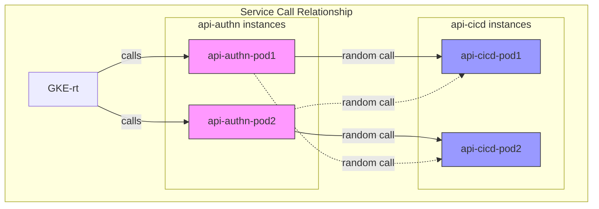

上面是我的一个API的方式,我想了解如果我不做亲和性配置或者反亲和配置,比如我的api-cicd-pod1 和 api-cicd-pod2 都部署在同一个节点上,那么假如gke 在升级master和node_pools的时候
api-cicd-pod1 和 api-cicd-pod2 就会调用失败?


是的，如果 api-cicd-pod1 和 api-cicd-pod2 都部署在同一个 GKE 节点（Node）上，而没有 Pod 亲和性（Affinity）或者反亲和性（Anti-affinity）策略，那么在 GKE 升级 node-pool 或 master 过程中，该节点重启或被驱逐（evicted）时，两个 api-cicd Pod 都会同时失效，从而导致调用失败。以下是详细的影响分析：

1. GKE 升级时的影响

GKE 的升级通常包括：
	•	Master 升级：
	•	Master 升级不会影响 node-pool，但可能短暂影响 API Server 的可用性。
	•	Node Pool 滚动升级：
	•	GKE 会 逐个节点 进行升级，每次升级一个节点（cordon + drain 机制），然后重新创建新节点。
	•	如果 api-cicd-pod1 和 api-cicd-pod2 都在同一节点，那么当该节点被 drain（排空）时：
	•	两个 api-cicd Pod 都会被驱逐
	•	此时 api-authn 可能无法调用 api-cicd，导致请求失败

2. 如何解决这个问题？

为了避免 api-cicd 所有实例都被调度到同一个节点，我们可以采用 Pod 反亲和性（Pod Anti-Affinity）策略 让 api-cicd-pod1 和 api-cicd-pod2 分散到不同的节点：

(1) 配置 Pod 反亲和性

在 api-cicd 的 Deployment 资源里，添加 podAntiAffinity 规则：
```yaml
apiVersion: apps/v1
kind: Deployment
metadata:
  name: api-cicd
spec:
  replicas: 2
  template:
    metadata:
      labels:
        app: api-cicd
    spec:
      affinity:
        podAntiAffinity:
          requiredDuringSchedulingIgnoredDuringExecution:
          - labelSelector:
              matchExpressions:
              - key: app
                operator: In
                values:
                - api-cicd
            topologyKey: "kubernetes.io/hostname"
```
🔹 解释
	•	requiredDuringSchedulingIgnoredDuringExecution：强制调度时必须遵守，确保 api-cicd Pod 分布到不同的节点上。
	•	topologyKey: "kubernetes.io/hostname"：确保 Pod 运行在不同的 物理节点 上，而不是同一个节点。

(2) 使用 PodDisruptionBudget (PDB) 保护 Pod

如果你希望确保 GKE 升级期间至少有一个 api-cicd 副本存活，可以设置 PodDisruptionBudget (PDB)：
```yaml
apiVersion: policy/v1
kind: PodDisruptionBudget
metadata:
  name: api-cicd-pdb
spec:
  minAvailable: 1
  selector:
    matchLabels:
      app: api-cicd
```
🔹 解释
	•	minAvailable: 1 确保至少有 一个 api-cicd Pod 运行，即使 GKE 在升级。

(3) 开启 Surge Upgrade 以支持 Pod 不中断升级

如果你使用 GKE Autopilot 或 GKE Standard，可以启用 Surge Upgrades：

gcloud container clusters update CLUSTER_NAME \
    --node-pool POOL_NAME \
    --max-surge-upgrade 1 \
    --max-unavailable-upgrade 0

🔹 解释
	•	--max-surge-upgrade 1：允许 先创建一个新节点再删除老节点，避免所有 api-cicd Pod 受影响。

3. 结论

| 策略 | 效果 |
|------|------|
| 不配置反亲和性 | 可能导致 api-cicd 所有 Pod 部署在同一节点，GKE 升级时所有 Pod 都会失效，API 发生调用失败 |
| 配置 podAntiAffinity | 让 api-cicd Pod 分散在不同节点，防止同一节点重启影响所有 Pod |
| 设置 PodDisruptionBudget (PDB) | 确保至少一个 api-cicd Pod 存活，避免 API 调用完全失败 |
| 启用 Surge Upgrade | 先创建新节点再删除老节点，减少升级期间的停机时间 |

✅ 推荐方案：
	1.	必须配置 podAntiAffinity，确保 api-cicd Pod 分散到不同的节点。
	2.	设置 PDB，保证 GKE 维护时最少有 1 个 Pod 存活。
	3.	如果是 GKE Standard，可开启 Surge Upgrade，避免一次性驱逐所有 Pod。

这样，即使 GKE 升级 node-pool，你的 API 仍然可以保持可用 🎯

# why PDB 
帮我看下下面2个升级.我如果配置PDB是不是为了解决Node Pools的升级时能高可用的?

GKE 升级时的影响
GKE 的升级通常包括：
•	Master 升级：
•	Master 升级不会影响 node-pool，但可能短暂影响 API Server 的可用性。
•	Node Pool 滚动升级：
•	GKE 会 逐个节点 进行升级，每次升级一个节点（cordon + drain 机制），然后重新创建新节点。
•	如果 api-cicd-pod1 和 api-cicd-pod2 都在同一节点，那么当该节点被 drain（排空）时：
•	两个 api-cicd Pod 都会被驱逐
•	此时 api-authn 可能无法调用 api-cicd，导致请求失败


你的理解完全正确！配置 PDB 的主要目的之一，就是为了在 GKE Node Pools 滚动升级期间，确保应用的高可用性。让我来详细分析一下你的描述：

**GKE 升级过程分析:**

1.  **Master 升级:**  如你所述，Master 升级通常不会直接影响 Node Pool 中的 Pod。但需要注意以下几点：
    *   **API Server 短暂不可用:**  在 Master 升级期间，API Server 可能会短暂不可用。  如果你的应用 (例如，`api-authn`) 在此期间需要与 API Server 交互，可能会受到影响 (例如，无法创建新的 Pod，无法查询资源状态等)。  但对已运行的 Pod 的直接影响较小。
    *   **流量转发不受影响:** 已经建立的连接和流量转发通常不会受到 Master 升级的影响。

2.  **Node Pool 滚动升级:**  这是影响应用可用性的主要因素。  GKE 滚动升级 Node Pool 的过程如下：
    *   **Cordon（封锁）:**  Kubernetes 将目标节点标记为不可调度 (cordon)。  这意味着新的 Pod 不会被调度到该节点上。
    *   **Drain（排空）:**  Kubernetes 会尝试安全地驱逐该节点上的所有 Pod (drain)。  驱逐过程会尊重 PDB 的设置 (如果已配置)。  `kubectl drain` 命令会尝试 graceful shutdown，会给应用一定的shutdown时间去处理。
    *   **重新创建:**  一旦节点上的所有 Pod 都被驱逐 (或达到超时时间)，GKE 会创建一个新的、已升级的节点，并将其加入集群。  然后，Kubernetes 调度器会将 Pod 调度到新的节点上。

**PDB 的作用：**

如你正确指出的，如果 `api-cicd-pod1` 和 `api-cicd-pod2` 都在同一节点上，并且该节点正在进行升级 (drain)，那么：

*   **没有 PDB:**  Kubernetes 可能会同时驱逐这两个 Pod，导致 `api-authn` 无法调用 `api-cicd`，服务中断。
*   **有 PDB:**  PDB 会阻止 Kubernetes 同时驱逐这两个 Pod。 如果你设置了 `minAvailable: 1`，Kubernetes 将会确保在任何时候，至少有一个 `api-cicd` Pod 处于可用状态。  Kubernetes 可能会等待一个 Pod 成功迁移到另一个节点后，再驱逐另一个 Pod，以保证满足 PDB 的约束。

**总结:**

*   **配置 PDB 可以有效解决 GKE Node Pools 升级期间，由于节点 drain 导致的 Pod 驱逐问题，从而提高应用的可用性。** PDB 确保在自愿中断事件 (如节点升级) 期间，始终满足最小可用性要求。

**补充说明：**

*   **Master 升级的可用性：** 虽然 Master 升级对 Pod 的直接影响较小，但为了应对 Master 升级期间 API Server 的短暂不可用，你可以考虑以下措施：
    *   **重试机制：** 在 `api-authn` 中实现重试机制，以便在 API Server 暂时不可用时，能够自动重试请求。
    *   **使用 Service Mesh：** Service Mesh (例如，Istio, Linkerd) 可以提供更强大的服务发现和流量管理功能，可以更好地应对 API Server 的中断。
*   **驱逐中断时间：** 确保应用程序可以优雅关闭和快速启动。 Kubernetes 在驱逐 Pod 之前会发送一个 `SIGTERM` 信号，然后等待一段时间 (默认是 30 秒) 后强制终止 Pod。 请确保你的应用程序能够在此时间内完成清理工作。
*   **反亲和性：** 如之前所述，最好结合使用 PDB 和反亲和性。反亲和性确保 Pod 分布在不同的节点上，PDB 确保在节点升级期间始终满足最小可用性。
*   **仔细评估升级策略:** 了解并评估 GKE 提供的不同升级策略（例如， surge upgrade）来选择最适合你应用程序需求的一种。
* **监控：** 实施适当的监控来检测升级期间的任何问题，以便及时采取行动。

总之， 配置PDB能显著提高 Node Pools 升级期间应用的可用性。同时，请结合其他最佳实践（如反亲和性、重试机制）来构建一个高可用性的 GKE 应用。