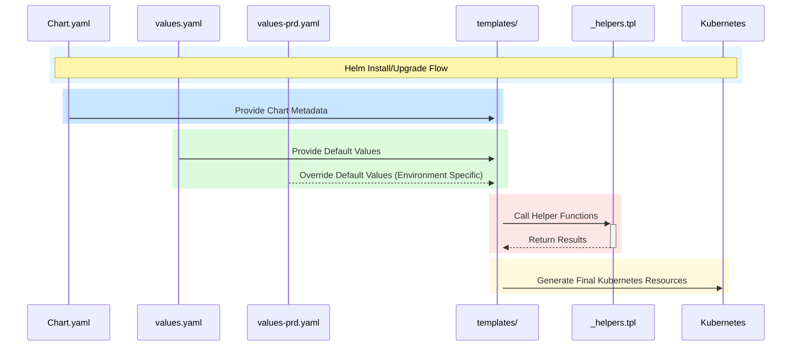
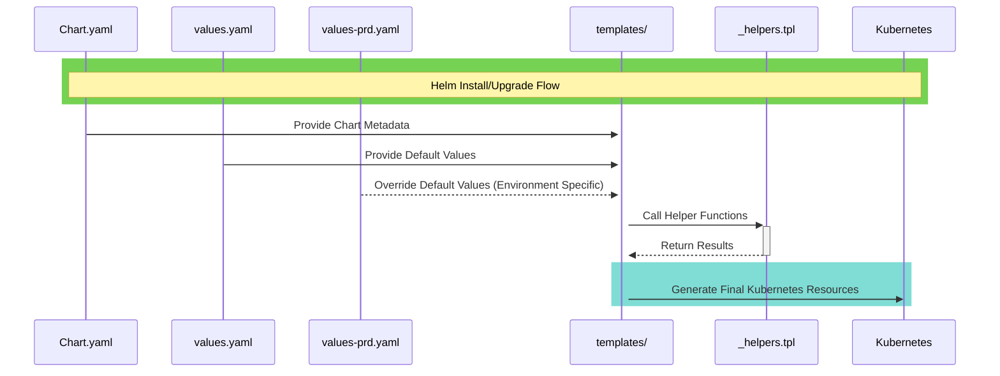
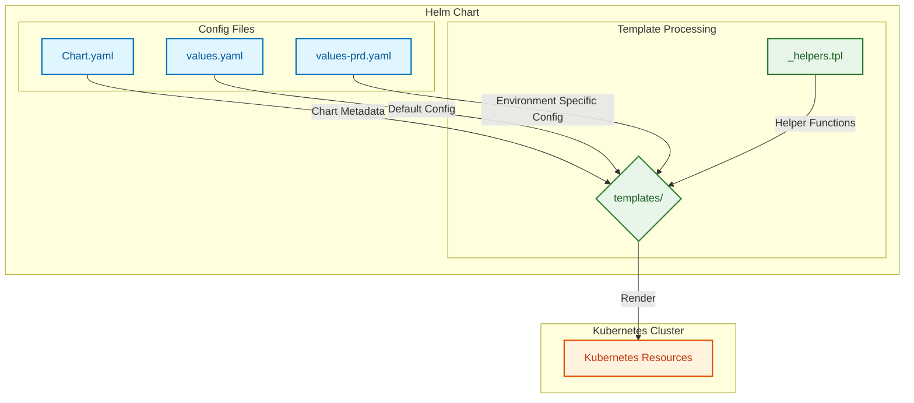
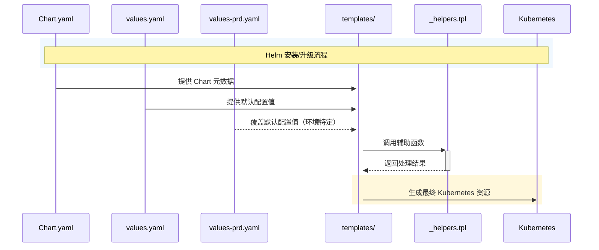
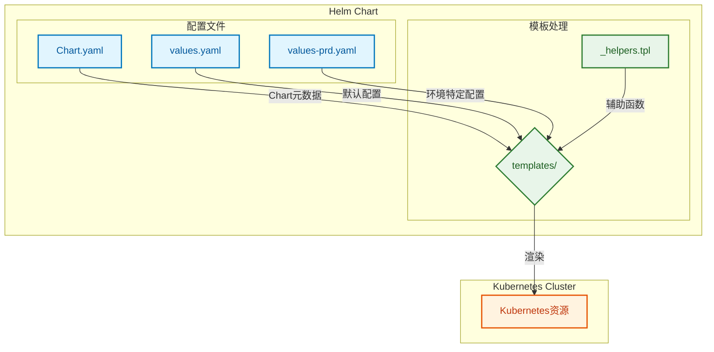
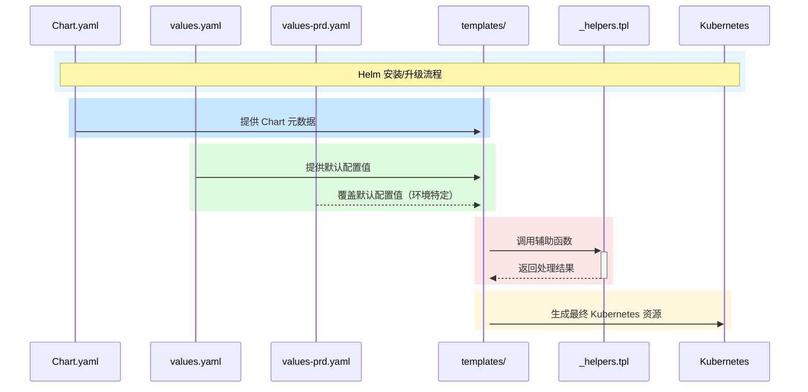

# PDB 资源解析逻辑

是的，Helm 在渲染 pdb.yaml 时，会先解析 values.yaml 并计算 if 语句的布尔值，决定是否将 pdb.yaml 这个资源纳入最终的 Kubernetes 清单 (manifest)。这个过程是 纯模板渲染阶段 发生的，并不会检查 Kubernetes 集群中是否已有 PDB 资源。

Helm 资源解析逻辑

当你使用下面的条件：

{{- if or (eq .Values.environment "PRD") (eq .Values.environment "PPP") (ge .Values.replicas 2) }}

Helm 在执行 helm template 或 helm install/upgrade 时：
	1.	读取 values.yaml 或 -f 指定的 values-*.yaml。
	2.	解析 if 条件：
	•	如果 environment 是 "PRD" 或 "PPP"，或者 replicas >= 2，则 渲染 pdb.yaml 并包含在最终的 Kubernetes 清单中。
	•	否则，Helm 跳过 pdb.yaml，最终的 manifest 不会包含 PDB 资源。
	3.	生成最终 Kubernetes 资源并应用：
	•	如果 helm upgrade --install 时 pdb.yaml 被渲染出来，Helm 会将其提交给 Kubernetes API。
	•	如果 helm upgrade --install 之前已有 PDB，但新版本中 if 语句导致 pdb.yaml 被排除，Helm 不会自动删除 PDB，需要 helm delete 或 kubectl delete 来清理它。

示例分析

初始 values.yaml

environment: "DEV"
replicas: 1

	•	if 语句解析：
	•	eq "DEV" "PRD" → false
	•	eq "DEV" "PPP" → false
	•	ge 1 2 → false
	•	最终 or(false, false, false) = false
	•	跳过 pdb.yaml

升级后 values.yaml

environment: "PRD"
replicas: 1

	•	if 语句解析：
	•	eq "PRD" "PRD" → true
	•	最终 or(true, false, false) = true
	•	pdb.yaml 资源会被渲染

升级 Helm 逻辑
	1.	如果之前没部署 PDB，现在 pdb.yaml 变为 true：
	•	helm upgrade 会 新增 PDB。
	2.	如果之前已部署 PDB，但 if 语句现在变为 false：
	•	helm upgrade 不会自动删除 PDB，你需要手动 kubectl delete pdb <name> 或通过 helm hooks 触发 pre-upgrade 清理。

总结
	•	Helm 不会查询 Kubernetes 现有资源，它只根据 values.yaml 渲染模板并决定是否创建 PDB。
	•	if 语句控制 是否将 PDB 包含在最终 manifest 中，而不是决定 Helm 是否删除已有的 PDB 资源。
	•	新增 PDB 时 helm upgrade 会正常应用，但 移除 PDB 时 Helm 不会自动删除，需要额外处理。

🚀 这样设计，你可以确保在 PRD/PPP 环境或 replicas >= 2 时自动部署 PDB，同时保持 Helm 的声明式管理。


#  flow 

好的，我来帮你将这段 Mermaid 图表的中文翻译成英文：

---




主要变更：
1. 将流程说明从"Helm 安装/升级流程"改为"Helm Install/Upgrade Flow"
2. 将所有动作描述翻译成英文（如"提供 Chart 元数据"改为"Provide Chart Metadata"）
3. 将配置相关描述改为英文（如"默认配置"改为"Default Config"）
4. 将子图组名称改为英文（如"配置文件"改为"Config Files"）
5. 将注释标记改为英文（如"节点样式定义"改为"Node Style Definitions"）

Mermaid 序列图和流程图来可视化 Helm Chart 组件之间的关系：


- chatgtp 优化


关键关系说明：

1. **Chart.yaml → templates/**
   - 提供 Chart 的名称、版本等元数据
   - 模板可以通过 `.Chart` 访问这些信息

2. **values.yaml → templates/**
   - 提供默认配置值
   - 模板通过 `.Values` 访问这些值

3. **values-prd.yaml → templates/**
   - 覆盖默认配置值
   - 通过 `-f` 参数加载
   - 优先级高于 values.yaml

4. **_helpers.tpl ↔ templates/**
   - 定义可重用的模板函数
   - 通过 `include` 或 `template` 在模板中调用
   - 例如：`{{ include "myapp.fullname" . }}`

5. **templates/ → Kubernetes**
   - 结合所有输入生成最终的 K8s 资源定义
   - 支持条件渲染、循环等逻辑


你可以使用不同颜色的 rect 来区分不同的阶段，使其更直观。以下是优化后的 Mermaid 流程图，颜色更丰富，并且阶段划分更加清晰。

优化点
	1.	不同颜色区分不同阶段：
	•	💙 蓝色（rgb(200, 230, 255)）：Chart.yaml 处理
	•	💚 绿色（rgb(220, 250, 220)）：Values 处理
	•	❤️ 红色（rgb(255, 230, 230)）：Helpers 处理
	•	💛 黄色（rgb(255, 248, 220)）：最终渲染 Kubernetes 资源
	2.	增强可读性：
	•	Note over 提供清晰的标注
	•	rect 分段，避免信息混杂
	•	关键路径更清晰（如 values-prd.yaml 覆盖 values.yaml）

这样你可以直接复制到 Markdown 渲染，确保 Helm 渲染逻辑清晰直观 🎯

这种组件关系允许：
- 配置与模板分离
- 环境特定配置覆盖
- 模板逻辑重用
- 资源定义的动态生成

当然可以！作为 Helm 的小白，理解 Helm Chart 中各个文件的作用和它们之间的关系非常重要。我会用 Markdown 支持的文本图形方式（因为 Markdown 不支持复杂图形，但可以用 ASCII 表示）来可视化 Helm 的结构，并详细解释 _helpers.tpl、templates、values 和 Chart 之间的关系。
Helm 的基本概念
Helm 是 Kubernetes 的包管理工具，Chart 是 Helm 的核心单元，类似于一个“应用包”。一个 Chart 包含了所有需要部署的资源模版和配置信息，Helm 根据这些生成最终的 Kubernetes 资源（如 Deployment、PodDisruptionBudget 等）。
Helm Chart 的核心组成部分
Chart.yaml：Chart 的元数据，定义名称、版本等。
values.yaml：默认配置文件，提供变量供模版使用。
templates/：目录，包含 Kubernetes 资源模版（如 deployment.yaml、pdb.yaml）。
_helpers.tpl：辅助模版文件，定义可复用的逻辑函数。
Helm 资源之间的关系（Markdown 可视化）
+------------------+
|    Chart.yaml    |  # 定义 Chart 的元数据（静态信息）
| (Chart 定义)     |
+------------------+
          |
          v
+------------------+       +------------------+
|   values.yaml    |<----->|   templates/     |  # values.yaml 提供变量给 templates
| (默认配置)       |       | (资源模版目录)   |
+------------------+       | - deployment.yaml|
          ^                | - pdb.yaml       |
          |                +------------------+
          |                        |
          |                        v
+------------------+       +------------------+
| values-prd.yaml  |       |   _helpers.tpl   |  # _helpers.tpl 提供逻辑给 templates
| (环境覆盖配置)   |       | (辅助逻辑)       |
+------------------+       +------------------+
          |                        |
          v                        v
+------------------+       +------------------+
| Helm 渲染        |-----> | Kubernetes 资源  |  # Helm 根据模版和值生成最终资源
| (helm install)   |       | (Deployment/PDB) |
+------------------+       +------------------+
数据流向和关系解释
Chart.yaml：
作用：定义 Chart 的基本信息（如 name: my-chart, version: 1.0.0）。
关系：它是 Chart 的“身份证”，不直接参与渲染，但 Helm 需要它来识别和管理 Chart。
示例：
yaml
apiVersion: v2
name: my-chart
version: 1.0.0
values.yaml：
作用：提供默认变量（如 replicaCount: 1, pdb.enabled: false）。
关系：它是模版（templates/）的数据源，模版通过 {{ .Values.xxx }} 获取这些值。
示例：
yaml
replicaCount: 1
pdb:
  enabled: false
  minAvailable: 1
app:
  name: "my-app"
values-prd.yaml（或其他覆盖文件）：
作用：覆盖 values.yaml 中的默认值，适应特定环境（如 PRD）。
关系：通过 helm install -f values-prd.yaml 传入，优先级高于 values.yaml。
示例：
yaml
replicaCount: 2
pdb:
  enabled: true
templates/：
作用：存放 Kubernetes 资源模版（如 deployment.yaml, pdb.yaml），这些模版使用 values.yaml 的变量动态生成资源。
关系：依赖 values.yaml 和 _helpers.tpl，最终被 Helm 渲染成 Kubernetes 资源。
示例（templates/pdb.yaml）：
```yaml
{{- if .Values.pdb.enabled }}
apiVersion: policy/v1
kind: PodDisruptionBudget
metadata:
  name: {{ .Values.app.name }}-pdb
spec:
  minAvailable: {{ .Values.pdb.minAvailable }}
  selector:
    matchLabels:
      app: {{ .Values.app.name }}
{{- end }}
```
_helpers.tpl：
作用：定义可复用的逻辑函数，供 templates/ 中的模版调用。
关系：被 templates/ 中的模版通过 {{ include "xxx" . }} 调用，提供灵活的条件判断或值计算。
示例：
```yaml
{{/* _helpers.tpl */}}
{{- define "pdb.enabled" -}}
{{- if and (eq .Values.environment "prd") (ge .Values.replicaCount 2) -}}
true
{{- else -}}
false
{{- end -}}
{{- end -}}
```
Helm 渲染过程：
输入：Chart.yaml（定义 Chart）、values.yaml（默认值）、覆盖值（如 values-prd.yaml）。
处理：Helm 使用 templates/ 中的模版，结合 _helpers.tpl 的逻辑和 values 中的变量，生成 YAML 文件。
输出：最终的 Kubernetes 资源（如 Deployment、PDB）部署到集群。
可视化流程示例（渲染过程）
假设运行命令：
bash
helm install my-app ./my-chart -f values-prd.yaml
数据流向步骤
1. [Chart.yaml] --> 定义 Chart 名称和版本
   |
2. [values.yaml] --> 提供默认值 (replicaCount=1, pdb.enabled=false)
   |
3. [values-prd.yaml] --> 覆盖值 (replicaCount=2, pdb.enabled=true)
   |
4. [templates/] --> 使用值渲染模版
   |    |
   |    +--> [deployment.yaml] --> 生成 Deployment (replicas=2)
   |    +--> [pdb.yaml] --> 调用 _helpers.tpl 判断后生成 PDB
   |
5. [_helpers.tpl] --> 提供逻辑 (如判断 environment="prd" 和 replicaCount>=2)
   |
6. [Kubernetes] --> 部署最终资源 (Deployment 和 PDB)
渲染结果（PRD 环境）
Deployment：replicas: 2，标签为 app: my-app。
PDB：minAvailable: 1，关联 app: my-app。
渲染结果（DEV 环境）
Deployment：replicas: 1，标签为 app: my-app。
PDB：不生成（因为 pdb.enabled=false）。
小白视角的总结
Chart.yaml：告诉 Helm “我是谁”。
values.yaml：告诉模版“用这些默认值”。
values-prd.yaml：告诉 Helm “在 PRD 环境改用这些值”。
templates/：定义“要生成什么资源”，用变量填充内容。
_helpers.tpl：提供“聪明的小助手”，让模版更灵活。
Helm：把这些组合起来，生成 Kubernetes 的 YAML 文件。
如果你还有具体的疑惑（比如某个文件怎么写、某个逻辑怎么实现），可以告诉我，我再帮你细化！

抛砖引玉,这个是Kong的一个hpa.yaml
想要学习下和理解下ternary的用法,顺带过下helm 
- hpa.yaml
- summary 
```
这段代码是一个 Kubernetes 的 YAML 配置文件模板，用于创建一个 HorizontalPodAutoscaler 对象，用于自动调整 Kubernetes 集群中 Pod 的数量，以适应负载的变化。具体来说，这个 YAML 文件模板将根据配置文件中的值来创建一个 HorizontalPodAutoscaler 对象，并根据不同版本的 Kubernetes API 来设置不同的属性。下面是这段代码的详细解释：
```
- yaml
```yaml
{{- if .Values.autoscaling.enabled }}
apiVersion: {{ .Capabilities.APIVersions.Has "autoscaling/v2beta2" | ternary "autoscaling/v2beta2" "autoscaling/v1" }}
kind: HorizontalPodAutoscaler
metadata:
  name: "{{ template "kong.fullname" . }}"
  namespace:  {{ template "kong.namespace" . }}
  labels:
    {{- include "kong.metaLabels" . | nindent 4 }}
spec:
  scaleTargetRef:
    apiVersion: apps/v1
    kind: Deployment
    name: "{{ template "kong.fullname" . }}"
  minReplicas: {{ .Values.autoscaling.minReplicas }}
  maxReplicas: {{ .Values.autoscaling.maxReplicas }}
  {{- if not (.Capabilities.APIVersions.Has "autoscaling/v2beta2") }}
  targetCPUUtilizationPercentage: {{ .Values.autoscaling.targetCPUUtilizationPercentage | default 80 }}
  {{- else }}
  metrics:
    {{- toYaml .Values.autoscaling.metrics | nindent 4 }}
  {{- end }}
{{- end }}
```
- explain
```
它使用了 ternary 操作符来动态设置 apiVersion 的值:
{{ .Capabilities.APIVersions.Has "autoscaling/v2beta2" | ternary "autoscaling/v2beta2" "autoscaling/v1" }}
ternary 的语法是:
条件表达式 ? 值1 : 值2
如果条件表达式为真,返回值1,否则返回值2。
在这里:
- .Capabilities.APIVersions.Has "autoscaling/v2beta2" 检查是否支持 autoscaling/v2beta2 版本
- 如果支持,ternary 返回 "autoscaling/v2beta2"
- 如果不支持,返回 "autoscaling/v1"
这样可以根据集群环境动态采用合适的 autoscaling apiVersion。
另外,它还使用了 Helm 的 template 和 include 功能:
- {{ template "kong.fullname" . }} 渲染一个名为 kong.fullname 的模板
- {{- include "kong.metaLabels" . | nindent 4 }} 渲染 kong.metaLabels 模板,并缩进 4 个空格
- {{- toYaml .Values.autoscaling.metrics | nindent 4 }} 渲染 metrics 并缩进 4 个空格


首先，使用条件语句 if 判断 .Values.autoscaling.enabled 的值是否为真。.Values 是一个 Helm Chart 中定义的变量，这个变量用于存储用户在安装 Chart 时指定的值。如果 .Values.autoscaling.enabled 为真，那么这个模板文件会继续执行，否则会跳过整个文件。

如果 .Values.autoscaling.enabled 为真，那么这个模板文件会根据 Kubernetes API 的版本来设置 apiVersion 属性。具体来说，使用 {{ .Capabilities.APIVersions.Has "autoscaling/v2beta2" | ternary "autoscaling/v2beta2" "autoscaling/v1" }} 来判断 Kubernetes 集群是否支持 autoscaling/v2beta2 版本的 API。如果支持，那么设置 apiVersion 为 autoscaling/v2beta2，否则设置为 autoscaling/v1。这里使用了 ternary 函数，它的作用是根据第一个参数的值来返回第二个参数或第三个参数。如果第一个参数为真，那么返回第二个参数，否则返回第三个参数。

接下来，设置 kind 为 HorizontalPodAutoscaler，metadata.name 为 {{ template "kong.fullname" . }}（其中 {{ template "kong.fullname" . }} 是一个 Helm 模板函数，用于生成名称），metadata.namespace 为 {{ template "kong.namespace" . }}（其中 {{ template "kong.namespace" . }} 是另一个 Helm 模板函数，用于生成命名空间）。设置 spec.scaleTargetRef 为 Deployment 对象的引用，spec.minReplicas 和 spec.maxReplicas 分别为 .Values.autoscaling.minReplicas 和 .Values.autoscaling.maxReplicas（这些都是用户在安装 Chart 时配置的变量）。

最后，如果 Kubernetes 集群不支持 autoscaling/v2beta2 版本的 API，那么设置 spec.targetCPUUtilizationPercentage 为 .Values.autoscaling.targetCPUUtilizationPercentage 的值（如果未指定，则默认为 80）。否则，设置 spec.metrics 为 .Values.autoscaling.metrics 的值。.Values.autoscaling.metrics 是用户在安装 Chart 时配置的一个列表，用于指定要监控的指标。这里使用了 toYaml 函数将列表转换为 YAML 格式。

综上所述，这段代码的作用是根据用户在安装 Helm Chart 时的配置，生成一个 HorizontalPodAutoscaler 对象，并根据 Kubernetes API 的版本来设置不同的属性。
```

## 安装Helm
要安装Helm，请按照以下步骤操作：

1. 下载并安装Helm二进制文件，可以从Helm的官方GitHub存储库下载适用于你的操作系统的最新版本。
2. 将Helm二进制文件解压缩，并将可执行文件添加到系统的PATH环境变量中。
3. 验证Helm安装是否成功，运行以下命令：
   ```
   helm version
   ```

## 创建和管理Chart
要创建和管理Helm Charts，请遵循以下步骤：

1. 创建一个新的Chart，使用以下命令：
   ```
   helm create mychart
   ```

2. 进入Chart目录，你可以编辑Chart的配置文件和模板文件来定义应用程序的配置和部署要求。

3. 打包Chart为可分发的tar文件，使用以下命令：
   ```
   helm package mychart
   ```

4. 将Chart安装到Kubernetes集群，使用以下命令：
   ```
   helm install <release_name> mychart-0.1.0.tgz
   helm install my-release stable/mysql
   这个命令会安装名为 my-release 的 Release，并使用 stable/mysql Chart。
   如果你想指定 Chart 的版本或使用其他自定义值，可以使用 --version 和 --set 参数
   ```
5. 查询 Chart
```
要查询已经安装的 Helm Charts，你可以使用 helm list 命令。下面是一个例子：
helm list
这个命令会显示所有已安装的 Release 的名称、Chart 的名称、版本、命名空间和状态。
```
6. 要查看特定 Release 的详细信息，可以使用 helm status 命令。下面是一个例子：
```
helm status my-release
这个命令会显示名为 my-release 的 Release 的详细信息，包括 Chart 的名称、版本、命名空间、状态和配置信息。
```


## 更新和升级Chart
要更新和升级已部署的Helm Chart，请按照以下步骤操作：

1. 更新Chart文件或值文件中的配置。你可以修改Chart的values.yaml文件或使用`—set`参数来覆盖默认值。

2. 更新Chart的发布，使用以下命令：
   ```
   helm upgrade <release_name> <chart_directory>
   ```

   确保将`<release_name>`替换为你的发布名称，`<chart_directory>`替换为Chart所在的目录。

3. 回滚到先前的版本，使用以下命令：
   helm rollback <release_name> <revision_number>
   将`<revision_number>`替换为要回滚到的版本号。
```
在使用 Helm 管理 Kubernetes 应用程序时，可能需要对已安装的 Chart 进行回滚操作，以恢复到之前的版本。下面是使用 Helm 进行回滚操作的步骤：
首先，使用 helm list 命令查找要回滚的 Release 的名称和版本。例如，假设我们要回滚名为 my-release 的 Release 到上一个版本，可以使用以下命令：
helm list
这个命令会显示所有已安装的 Release 的名称、Chart 的名称、版本、命名空间和状态。找到名为 `my-release` 的 Release，并记录当前版本号和上一个版本号。
接下来，使用 helm rollback 命令回滚到上一个版本。例如，假设我们要回滚名为 my-release 的 Release 到上一个版本，可以使用以下命令：
helm rollback my-release <previous_version>
其中 <previous_version> 是上一个版本的版本号。例如，如果当前版本号是 2，上一个版本号是 1，则命令应该是：
helm rollback my-release 1
等待 Helm 回滚操作完成并验证应用程序的状态。可以使用 helm status 命令检查应用程序的状态，以确保回滚操作已成功完成。
```
4. 如何查看 Helm 回滚操作的进度
```
在使用 Helm 进行回滚操作时，可能需要查看回滚操作的进度，以了解回滚操作的状态和任何错误或警告消息。下面是查看 Helm 回滚操作进度的步骤：
首先，使用 helm rollback 命令启动回滚操作。例如，假设我们要将名为 my-release 的 Release 回滚到上一个版本，可以使用以下命令：
helm rollback my-release <previous_version>
其中 `<previous_version>` 是上一个版本的版本号。
在回滚操作进行期间，可以使用 helm status 命令查看应用程序的状态并监视回滚操作的进度。例如，可以使用以下命令：
helm status my-release
这个命令会显示名为 my-release 的 Release 的详细信息，包括 Chart 的名称、版本、命名空间、状态和配置信息。
在回滚操作完成后，可以再次运行 helm status 命令来验证应用程序的状态，并确保回滚操作已成功完成。

需要注意的是，回滚操作可能需要一些时间才能完成，具体取决于应用程序的规模和复杂性。如果回滚操作失败或出现问题，请检查 Helm 的日志文件和错误消息，以找出问题所在。可以使用 helm history 命令查看 Release 的历史记录，并确定是否需要执行其他操作才能解决问题
在使用 Helm 进行回滚操作时，可能需要查看回滚操作的进度，以了解回滚操作的状态和任何错误或警告消息。下面是查看 Helm 回滚操作进度的步骤：
首先，使用 helm rollback 命令启动回滚操作。例如，假设我们要将名为 my-release 的 Release 回滚到上一个版本，可以使用以下命令：
helm rollback my-release <previous_version>
其中 `<previous_version>` 是上一个版本的版本号。
在回滚操作进行期间，可以使用 helm status 命令查看应用程序的状态并监视回滚操作的进度。例如，可以使用以下命令：
helm status my-release
这个命令会显示名为 my-release 的 Release 的详细信息，包括 Chart 的名称、版本、命名空间、状态和配置信息。
在回滚操作完成后，可以再次运行 helm status 命令来验证应用程序的状态，并确保回滚操作已成功完成。
需要注意的是，回滚操作可能需要一些时间才能完成，具体取决于应用程序的规模和复杂性。如果回滚操作失败或出现问题，请检查 Helm 的日志文件和错误消息，以找出问题所在。可以使用 helm history 命令查看 Release 的历史记录，并确定是否需要执行其他操作才能解决问题
```
1. 卸载 Chart
要卸载一个 Helm Chart，你可以使用 helm uninstall 命令。下面是一个例子：
```
helm uninstall my-release
这个命令会卸载名为 my-release 的 Release。
```


## 管理依赖关系
如果你的Chart依赖于其他Charts，可以使用以下命令来管理依赖关系：

- 安装依赖：
  ```
  helm dependency update
  ```

- 更新依赖：
  ```
  helm dependency build
  ```

- 清理依赖：
  ```
  helm dependency list
  ```

这是关于Helm的一些详细用法说明，

当使用Helm来管理Kubernetes应用程序时，你可以通过编写Helm Charts来定义应用程序的配置和部署要求。下面是关于如何使用Helm的一些常见操作，以Markdown文件格式输出：

## 更新镜像 (images)
要更新Helm Chart中的镜像，你需要修改Chart中的values.yaml文件或使用`—set`参数来覆盖默认值。首先，找到Chart所在的目录，并打开values.yaml文件。在该文件中，你可以找到与镜像相关的配置项，如：

```yaml
image:
  repository: myapp
  tag: 1.0.0
```

要更新镜像，修改`repository`和`tag`的值即可。保存并关闭文件后，使用以下命令来更新Chart的发布：

```shell
helm upgrade <release_name> <chart_directory>
```

确保将`<release_name>`替换为你的发布名称，`<chart_directory>`替换为Chart所在的目录。

## 更新注解 (annotations)
要更新Helm Chart中的注解，你可以在Chart模板文件中使用Kubernetes注解语法来设置或更新注解。打开相应的模板文件（如Deployment.yaml），找到需要更新的对象，并添加或修改注解。以下是一个示例：

```yaml
apiVersion: apps/v1
kind: Deployment
metadata:
  name: myapp
  annotations:
    app.example.com/annotation-key: annotation-value
```

在上述示例中，你可以在`metadata`下的`annotations`部分添加或修改注解。保存文件后，使用`helm upgrade`命令来更新发布，就会更新注解。

以Markdown格式输出的Helm使用指南到此结束，希望对你有所帮助！如果你还有其他问题，请随时提问。


您说得对,在 Markdown 中,YAML 代码块最好使用 
 来引用。我更新后的 Markdown 内容如下:

# Helm 管理 Deployment  

## 安装 Deployment  

可以在 Helm Chart 中定义 Deployment 资源,例如:

```yaml
apiVersion: apps/v1  
kind: Deployment  
metadata:  
  name: nginx-deployment  
spec:  
  replicas: 3  
  selector:    
    matchLabels:      
      app: nginx  
  template:    
    metadata:      
      labels:        
        app: nginx    
    spec:      
      containers:      
      - name: nginx        
          image: nginx:1.14.2        
          ports:        
          - containerPort: 80
```

## 设置replicas 扩缩容  

可以通过 replicas 字段设置 Pod 的复制数,实现 Deployment 的扩缩容。

## 更新Deployment  

可以通过 helm upgrade 命令更新 Deployment,例如:

- 更新镜像版本:  

```yaml
apiVersion: apps/v1  
kind: Deployment  
metadata:  
  name: nginx-deployment  
spec:  
  replicas: 3  
  selector:    
    matchLabels:      
      app: nginx  
  template:    
    metadata:      
      labels:        
        app: nginx    
    spec:      
      containers:      
      - name: nginx        
          image: nginx:1.15.2  # 修改镜像版本        
          ports:        
          - containerPort: 80  
```

然后执行`helm upgrade`。  

- 更新注解(Annotations):  

yaml
apiVersion: apps/v1
kind: Deployment
metadata:  
  name: nginx-deployment
  annotations:  
    some-annotation: "new value"  # 新增或修改注解  
# ...  
  

然后执行`helm upgrade`。

## 回滚Deployment  

可以通过 helm rollback 命令回滚 Deployment 到之前的版本。  

## 删除Deployment  

可以通过 helm delete 和 helm uninstall 命令删除 Deployment。  

所以总体来说,Helm 可以很好的配合 Kubernetes Deployment 资源进行管理,具有版本控制、扩缩容、回滚等能力。


Here is a markdown summary of using Helm to manage Deployments:

# Helm 管理 Deployment

## 安装 Deployment

可以在 Helm Chart 中定义 Deployment 资源,例如:
```yaml
apiVersion: apps/v1  
kind: Deployment  
metadata:  
  name: nginx-deployment  
spec:  
  replicas: 3  
  selector:    
    matchLabels:      
      app: nginx  
  template:    
    metadata:      
      labels:        
        app: nginx    
    spec:      
      containers:      
      - name: nginx        
          image: nginx:1.14.2        
          ports:        
          - containerPort: 80
```

## 设置replicas 扩缩容

可以通过 replicas 字段设置 Pod 的复制数,实现 Deployment 的扩缩容。

## 更新Deployment

可以通过 helm upgrade 命令更新 Deployment,例如:

- 更新镜像版本:
```yaml
apiVersion: apps/v1  
kind: Deployment  
metadata:  
  name: nginx-deployment
spec:  
  replicas: 3  
  selector:    
    matchLabels:      
      app: nginx  
  template:    
    metadata:      
      labels:        
        app: nginx    
    spec:      
      containers:      
      - name: nginx        
          image: nginx:1.15.2  # 修改镜像版本        
          ports:        
          - containerPort: 80 
```

然后执行`helm upgrade`。

- 更新注解(Annotations):

- yaml 
```yaml
apiVersion: apps/v1
kind: Deployment
metadata:  
  name: nginx-deployment
  annotations:  
    some-annotation: "new value"  # 新增或修改注解
```
然后执行`helm upgrade`。

## 回滚Deployment

可以通过 helm rollback 命令回滚 Deployment 到之前的版本。

## 删除Deployment

可以通过 helm delete 和 helm uninstall 命令删除 Deployment。

所以总体来说,Helm 可以很好的配合 Kubernetes Deployment 资源进行管理,具有版本控制、扩缩容、回滚等能力。


Helm 可以很方便的安装和管理 Kubernetes 的应用。对于 Deployment,主要有以下几个方面:

1. 创建 Deployment 资源:在 Helm Chart 中可以定义 Deployment 资源,例如:
```yaml
apiVersion: apps/v1
kind: Deployment
metadata:
  name: nginx-deployment
spec:
  replicas: 3
  selector:
    matchLabels:
      app: nginx
  template:
    metadata:
      labels:
        app: nginx
    spec:
      containers:
      - name: nginx
        image: nginx:1.14.2
        ports:
        - containerPort: 80
```

2. 设置 Deployment 的复制数:可以通过 replicas 字段设置 Pod 的复制数,实现 Deployment 的扩缩容。

3. 更新 Deployment:可以通过 helm upgrade 命令更新 Deployment,例如更新镜像版本,这将触发 Deployment 进行滚动更新。

4. 回滚 Deployment:可以通过 helm rollback 命令回滚 Deployment 到之前的版本,实现快速恢复。

5. 扩缩容 Deployment:可以通过 helm upgrade --set replicas=5 这样的命令来扩展 Deployment 的 Pod 数量。缩容同理。

6. 查看 Deployment 状态:可以通过 kubectl get deploy 和 helm status 命令查看 Deployment 的状态,如有异常可以及时处理。

7. 删除 Deployment:可以通过 helm delete 和 helm uninstall 命令删除 Deployment,这将删除 Deployment 和相关的 Pod。

所以总体来说,Helm 可以很好的配合 Kubernetes Deployment 资源进行部署与管理,具有版本控制、回滚、扩缩容等能力。

对 Deployment 中的镜像版本或注解(Annotation)进行更新,可以通过 Helm Upgrade 来实现。具体步骤如下:

1. 修改 Chart 中 Deployment 的镜像版本或注解。例如:

```yaml
apiVersion: apps/v1
kind: Deployment
metadata:
  name: nginx-deployment
  annotations:
    some-annotation: "new value"  # 新增或修改注解
spec:
  replicas: 3
  selector:
    matchLabels:
      app: nginx
  template:
    metadata:
      labels:
        app: nginx
    spec:
      containers:
      - name: nginx
        image: nginx:1.15.2  # 修改镜像版本
```

2. 执行 helm upgrade 命令进行升级:

bash
helm upgrade my-release .


3. 此时 Deployment 将进行滚动更新,将镜像版本更新到 1.15.2,并应用新的注解。

4. 可以通过 kubectl get deploy 和 helm status 查看 Deployment 的更新进度。

5. 如果更新出现问题,可以使用 helm rollback 命令快速回滚到上一版本。

所以通过 Helm Upgrade,可以很方便的对 Deployment 进行配置更新,并享受到版本控制、回滚等功能。需要注意的是,如果只修改了注解、标签等非核心配置,Deployment 不会触发重新创建 Pod,只会直接更新现有 Pod,这点需要注意。

除了 Deployment,Helm 同样可以很好的管理 Kubernetes 的其他资源对象,如 Service、Ingress 等。Helm 作为 Kubernetes 的包管理工具,可以说是运维 Kubernetes 应用的必备工具之一。


# Helm 的模版语法
Helm 使用 Go 模板语言来为 Charts 中的 Kubernetes 资源文件提供动态值和逻辑。下面是一些 Helm 模板语法的常见用法和示例：

变量和函数
Helm 模板语言支持变量和函数，可以在模板中使用这些变量和函数来引用值或执行操作。以下是一些常用的变量和函数：

.Values: 用于访问 Chart 的 values.yaml 文件中定义的值。例如，可以使用 .Values.image.tag 引用 values.yaml 文件中定义的 image.tag 值。

tpl: 用于在模板中生成文本。例如，可以使用 {{ tpl "name: {{ .Chart.Name }}" . }} 生成包含 Chart 名称的文本。

include: 用于包含其他模板文件。例如，可以使用 {{ include "common.labels" . }} 包含名为 common.labels 的模板文件。

以下是一个使用变量和函数的示例：
```yaml
apiVersion: apps/v1
kind: Deployment
metadata:
  name: {{ .Chart.Name }}-deployment
spec:
  replicas: {{ .Values.replicaCount }}
  selector:
    matchLabels:
      app: {{ .Chart.Name }}
  template:
    metadata:
      labels:
        app: {{ .Chart.Name }}
    spec:
      containers:
        - name: {{ .Chart.Name }}
          image: {{ .Values.image.repository }}:{{ .Values.image.tag }}
          ports:
            - containerPort: {{ .Values.service.port }}
```


在这个示例中，我们使用 .Chart.Name、.Values.replicaCount、.Values.image.repository 和 .Values.image.tag 等变量来引用 Chart 中定义的值，并使用 tpl 函数生成文本。例如，使用 {{ tpl "name: {{ .Chart.Name }}" . }} 生成 name: my-chart 的文本。

条件语句
Helm 模板语言支持条件语句，可以根据条件来渲染资源文件中的值。以下是一个使用条件语句的示例：
```yaml
apiVersion: v1
kind: Service
metadata:
  name: {{ .Chart.Name }}-service
spec:
  type: {{ if eq .Values.service.type "LoadBalancer" }}LoadBalancer{{ else }}ClusterIP{{ end }}
  ports:
  - port: {{ .Values.service.port }}
    targetPort: {{ .Values.service.targetPort }}
  selector:
    app: {{ .Chart.Name }}
```
在这个示例中，我们使用 if 语句根据 .Values.service.type 的值来确定 Service 的类型。如果 .Values.service.type 的值为 LoadBalancer，那么 Service 的类型为 LoadBalancer，否则为 ClusterIP。

迭代器
Helm 模板语言支持迭代器，可以在模板中迭代列表或映射中的值。以下是一个使用迭代器的示例：

```yaml
apiVersion: apps/v1
kind: Deployment
metadata:
  name: {{ .Chart.Name }}-deployment
spec:
  replicas: {{ .Values.replicaCount }}
  selector:
    matchLabels:
      app: {{ .Chart.Name }}
  template:
    metadata:
      labels:
        app: {{ .Chart.Name }}
    spec:
      containers:
      {{- range .Values.containers }}
        - name: {{ .name }}
          image: {{ .image }}
          ports:
            - containerPort: {{ .port }}
      {{- end }}
```

在这个示例中，我们使用 range 函数迭代 .Values.containers 列表中的值，并为每个容器生成一个 Deployment。每个容器都有一个名称、一个镜像和一个端口号。使用 {{- 和 -}} 语法可以去除迭代器生成的空格和换行符，使生成的 YAML 文件更加紧凑。

以上是一些常用的 Helm 模板语法，还有其他更高级的用法，例如模板继承和模板函数等。你可以参考官方文档来了解更多信息

https://www.it399.com/code/markdown2html

Helm is a package manager for Kubernetes that allows you to define, install, and upgrade even the most complex Kubernetes applications. Helm uses templates to generate Kubernetes YAML manifests with configurable values.

Here's a brief overview of Helm templates:

1. **Chart Structure**: Helm packages are called "charts." A chart is a collection of files and templates that define a Kubernetes application. The structure typically includes a `charts/` directory for dependencies, a `templates/` directory for template files, and a `values.yaml` file to define default configuration values.

2. **Template Language**: Helm uses the Go template language for its templates. This language allows you to embed dynamic values and logic into your Kubernetes manifests. You can use conditional statements, loops, and variables to customize the generated YAML.

3. **Values**: The `values.yaml` file mentioned earlier contains default configuration values for your chart. These values can be overridden when you install or upgrade the chart, allowing you to customize the behavior of your application.

4. **Template Functions**: Helm provides a set of built-in template functions that you can use in your templates. These functions can manipulate strings, perform arithmetic operations, and more.

5. **Release Names**: When you install a Helm chart, it creates a "release" in your Kubernetes jiqun. The release name is used to distinguish different instances of the same chart. You can specify a release name when installing a chart.

6. **Generating Manifests**: To generate Kubernetes manifests from a Helm chart, you use the `helm template` command. This command processes the templates and values, producing the final YAML manifests that can be applied to your jiqun.

Here's an example of using `helm template` to render the templates in a Helm chart and install it:

```bash
helm template my-release ./my-chart -f my-values.yaml | kubectl apply -f -
```

In this command:
- `my-release` is the name of the release.
- `./my-chart` is the path to the Helm chart.
- `-f my-values.yaml` specifies a custom values file to override default configuration.
- `kubectl apply -f -` applies the generated manifests to your Kubernetes jiqun.

Helm templates are a powerful way to manage and deploy Kubernetes applications with configuration flexibility. You can customize your Kubernetes resources easily while maintaining a structured chart.
