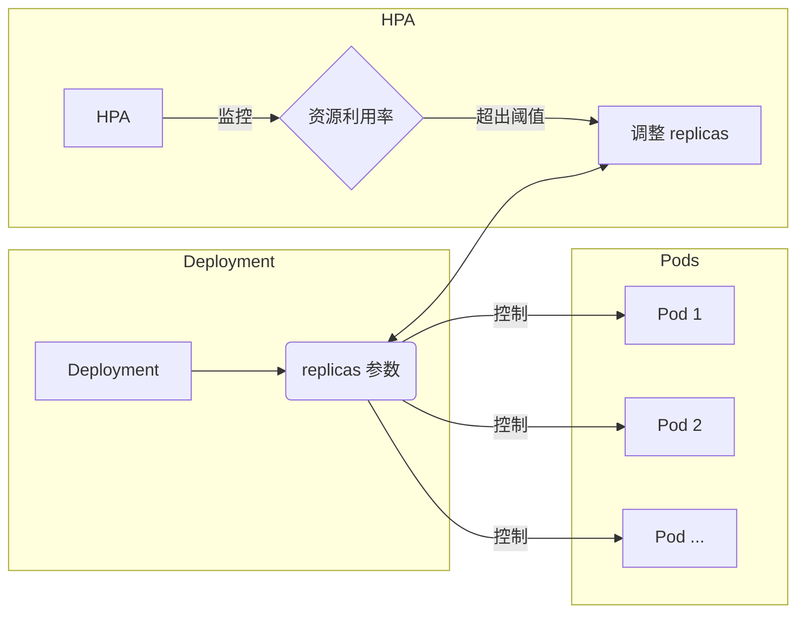
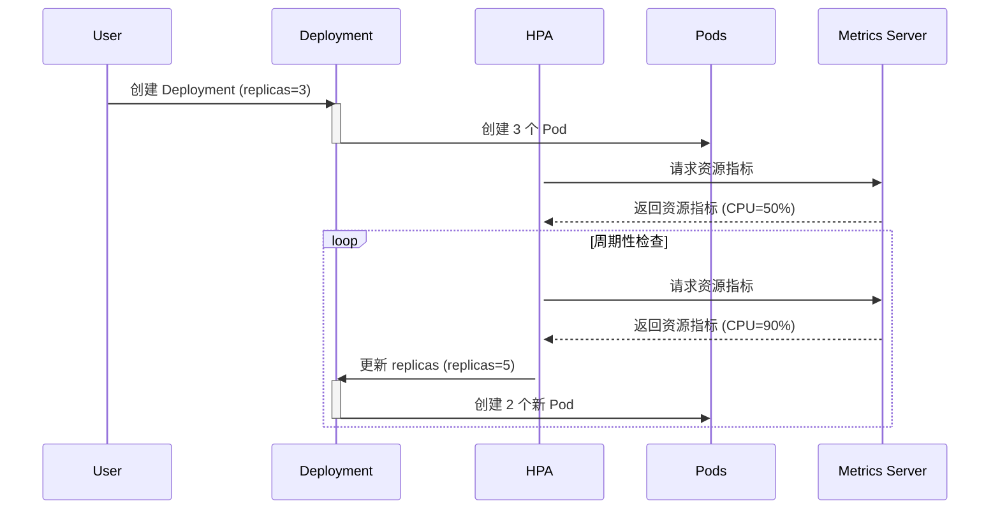
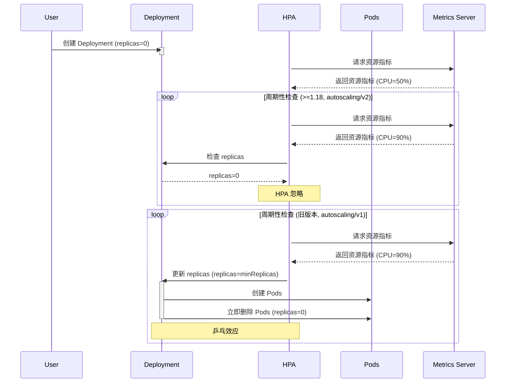
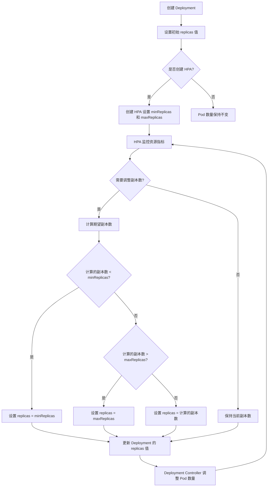
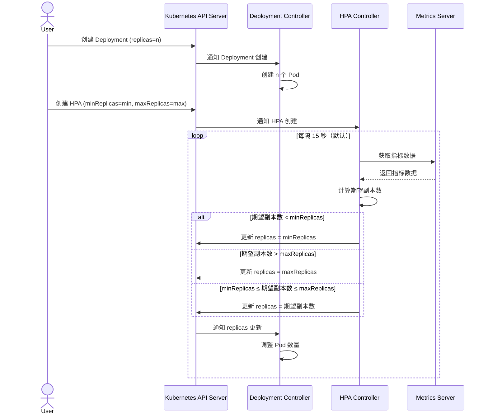
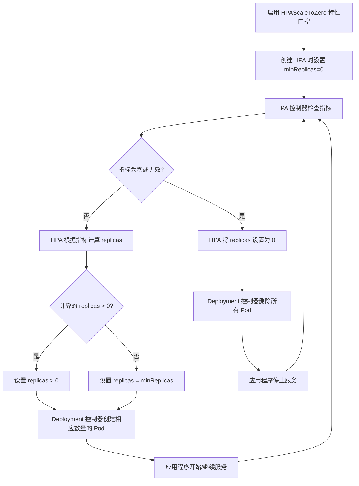

# Gemini 

好的，我来详细解释 Kubernetes 中 Horizontal Pod Autoscaler (HPA)、Deployment 以及 `replicas` 参数之间的关系，并用图示和示例说明。

**1. 定义**

*   **Deployment:**
    *   Deployment 是 Kubernetes 中用于声明式地管理 Pod 和 ReplicaSet 的对象。
    *   它确保指定数量的 Pod 副本（由 `replicas` 参数定义）始终运行。
    *   Deployment 提供了滚动更新、回滚、扩缩容等功能。

*   **`replicas` 参数:**
    *   `replicas` 是 Deployment 对象中的一个字段，用于指定期望的 Pod 副本数量。
    *   Deployment 控制器会持续监控实际运行的 Pod 数量，并与 `replicas` 值进行比较，如果数量不一致，则会创建或删除 Pod 以达到期望状态。

*   **Horizontal Pod Autoscaler (HPA):**
    *   HPA 是 Kubernetes 中用于根据观察到的 CPU 利用率或其他自定义指标自动调整 Deployment、ReplicaSet 或 StatefulSet 中 Pod 数量的对象。
    *   HPA 会周期性地检查目标资源（如 Deployment）的指标，并根据预定义的阈值自动调整 `replicas` 参数的值。
    *   HPA 的目标是保持资源利用率接近用户定义的目标水平。

**2. 三者关系**

HPA、Deployment 和 `replicas` 参数之间的关系可以概括为：

*   Deployment 通过 `replicas` 参数定义期望的 Pod 副本数量。
*   HPA 监控 Deployment 的资源使用情况（如 CPU 利用率）。
*   当资源使用情况超过或低于预定义的阈值时，HPA 会自动调整 Deployment 的 `replicas` 参数，从而增加或减少 Pod 的数量。

**流程图 (Mermaid Flowchart)**



**流程解释:**

1.  Deployment 通过 `replicas` 参数定义了期望的 Pod 数量。
2.  HPA 持续监控 Deployment 的资源利用率（如 CPU、内存等）。
3.  如果资源利用率超过了 HPA 中定义的阈值（如 CPU 利用率超过 80%），HPA 会自动增加 Deployment 的 `replicas` 参数的值。
4.  Deployment 控制器检测到 `replicas` 参数的变化，会创建新的 Pod。
5.  如果资源利用率低于阈值，HPA 会减少 `replicas` 参数的值，Deployment 控制器会删除多余的 Pod。

**时序图 (Mermaid Sequence Diagram)**


**关于 `replicas` 不在 HPA 的 `min` 和 `max` 之间**
如果直接设定`replicas` 参数的值不在 HPA 的 `minReplicas` 和 `maxReplicas` 范围内，会有以下两种情况：

1.  **`replicas` 小于 `minReplicas`:**
    *   HPA 会立即将 `replicas` 的值增加到 `minReplicas`。
    *   HPA 会继续根据资源使用情况调整 `replicas`，但不会低于 `minReplicas`。

2.  **`replicas` 大于 `maxReplicas`:**
    *   HPA 会立即将 `replicas` 的值减少到 `maxReplicas`。
    *   HPA 会继续根据资源使用情况调整 `replicas`，但不会超过 `maxReplicas`。

**总结**

*   HPA 通过动态调整 Deployment 的 `replicas` 参数来实现 Pod 的自动水平伸缩。
*   `minReplicas` 和 `maxReplicas` 定义了 HPA 可以调整的 `replicas` 的范围。
*    如果 Deployment 中设置了 `replicas`，并且 HPA 也被配置，那么优先以 HPA 为准，它会根据资源使用情况自动调整 `replicas` 的值。

希望以上解释和图示能够帮助您理解 Kubernetes 中 HPA、Deployment 和 `replicas` 参数之间的关系。如果有任何疑问，请随时提出。


您提出了一个非常好的点，我之前的描述确实忽略了 `replicas` 设置为 0 的特殊情况。感谢您的指正！

**`replicas` 设置为 0 的情况**

当 Deployment 的 `replicas` 设置为 0 时，表示不希望运行任何 Pod 副本。此时，HPA 的行为会略有不同，具体取决于 Kubernetes 版本和 HPA 的配置：

**1. Kubernetes 较新版本 (>= 1.18) 且 HPA 使用 `autoscaling/v2` API:**

*   在这种情况下，HPA 会忽略 `replicas` 为 0 的 Deployment。
*   HPA 不会尝试调整 Pod 数量，也不会触发任何错误。
*   这意味着，即使资源使用率很高，HPA 也不会自动创建 Pod。
*   如果您希望 HPA 能够从 0 个副本开始自动扩容，您需要确保 Deployment 的 `replicas` 至少为 1，或者使用其他机制（例如，事件驱动的自动扩缩器，如 KEDA）。

**2. Kubernetes 较旧版本 或 HPA 使用 `autoscaling/v1` API:**

*   在这些版本中，HPA 可能会尝试将 `replicas` 从 0 调整到 `minReplicas`。
*   但是，由于 Deployment 的 `replicas` 被显式设置为 0，Deployment 控制器会立即将 Pod 数量减少回 0。
*   这可能会导致 HPA 和 Deployment 控制器之间出现“乒乓效应”，即 HPA 尝试扩容，而 Deployment 立即缩容。
*   为了避免这种情况，建议在使用 HPA 时，不要将 Deployment 的 `replicas` 设置为 0。

**总结 `replicas` 为 0 的情况：**

*   **最佳实践：** 如果您打算使用 HPA，通常不建议将 Deployment 的 `replicas` 设置为 0。至少设置为 1，然后让 HPA 根据需要进行缩放。
*   **较新版本 (>= 1.18, autoscaling/v2):** HPA 会忽略 `replicas` 为 0 的 Deployment。
*   **较旧版本 或 autoscaling/v1:** 可能会出现 HPA 和 Deployment 控制器之间的“乒乓效应”。

**更新后的 Mermaid 流程图 (考虑 `replicas` 为 0)**

```mermaid
graph LR
    subgraph Deployment
        A[Deployment] --> B(replicas 参数)
    end
    subgraph HPA
        C[HPA] -- 监控 --> D{资源利用率}
        D -- 超出阈值 --> E[调整 replicas]
    end
    B <--> E
    subgraph Pods
        F[Pod 1]
        G[Pod 2]
        H[Pod ...]
    end
    B -- 控制 --> F
    B -- 控制 --> G
    B -- 控制 --> H

    B -- replicas=0 --> I{replicas=0?}
    I -- Yes --> J[HPA 忽略 (>=1.18, v2)]
    I -- Yes --> K[乒乓效应 (旧版本, v1)]
    I -- No --> E
```

**更新后的时序图 (考虑 `replicas` 为 0)**



再次感谢您指出我之前的疏漏！现在，描述和图示更加完整和准确了。


# Claude

我来详细解释 Kubernetes 中 HPA、Deployment 和 replicas 参数之间的关系，并创建一个流程图来可视化这些关系。

## HPA、Deployment 和 replicas 的定义

**Deployment**：
- Kubernetes 中用于管理应用程序部署的资源对象
- 定义了应用程序的期望状态，包括使用哪个容器镜像、运行多少个副本等
- 通过 `replicas` 参数指定期望运行的 Pod 副本数量

**replicas**：
- Deployment 的一个参数，指定期望运行的 Pod 副本数量
- 手动设置的静态值，如果不使用 HPA，这个值会保持不变

**HPA (Horizontal Pod Autoscaler)**：
- 自动水平伸缩器，根据 CPU 使用率、内存使用率或自定义指标动态调整 Pod 副本数
- 定义了 `minReplicas` 和 `maxReplicas` 两个边界值，副本数量会在这个范围内浮动
- 通过监控特定指标来决定何时增加或减少副本数

## 它们之间的关系​​​​​​​​​​​​​​​​

## 时序图 - 更详细的交互​​​​​​​​​​​​​​​​

## 特殊情况分析

### 当 Deployment 的 replicas 不在 HPA 的 min 和 max 之间

如果您手动设置 Deployment 的 replicas 值，并且该值不在 HPA 定义的 minReplicas 和 maxReplicas 范围内，以下是会发生的情况：

1. **如果 replicas < minReplicas**：
   - HPA 控制器下一次检查时，会将 Pod 数量增加到 minReplicas
   - 这种情况下，您手动设置的较低 replicas 值只会临时存在，直到下一个 HPA 控制循环

2. **如果 replicas > maxReplicas**：
   - HPA 控制器下一次检查时，会将 Pod 数量减少到 maxReplicas
   - 这种情况下，您手动设置的较高 replicas 值只会临时存在，直到下一个 HPA 控制循环

总结：**HPA 会覆盖手动设置的 replicas 值**，确保实际运行的 Pod 数量始终在 minReplicas 和 maxReplicas 范围内。

### replicas 为 0 的情况

在 Kubernetes 中，当 Deployment 的 replicas 设置为 0 时：

1. **Deployment 行为**：
   - 所有 Pod 将被删除
   - 应用程序实际上处于"关闭"状态，不会处理任何请求

2. **与 HPA 交互**：
   - 如果 HPA 的 minReplicas > 0，则 HPA 控制器会在下一次检查周期将 Pod 数量增加到至少 minReplicas
   - 如果您希望临时"关闭"应用程序但保留 HPA，可以考虑将 HPA 的 minReplicas 也设置为 0

3. **注意事项**：
   - 大多数 HPA 实现默认不允许 minReplicas 为 0
   - 从 Kubernetes v1.23 开始，增加了对将 minReplicas 设置为 0 的支持（需要启用 HPAScaleToZero 特性门控）
   - 当 HPA 将 replicas 设置为 0 时，它会考虑指标是否为零或无效​​​​​​​​​​​​​​​​

## 总结

1. **基本工作原理**:
   - Deployment 控制器负责维护指定数量的 Pod 副本
   - HPA 控制器通过监控指标动态调整 Deployment 的 replicas 值
   - 实际运行的 Pod 数量始终在 HPA 的 minReplicas 和 maxReplicas 范围内

2. **手动设置与自动调整的关系**:
   - 手动设置的 replicas 值（如果不在 HPA 范围内）会被 HPA 覆盖
   - HPA 的调整会覆盖手动配置，确保 Pod 数量在设定范围内

3. **replicas 为 0 的特殊情况**:
   - 需要特殊的配置才能支持 HPA 将应用缩放至零
   - 从 Kubernetes v1.23 开始支持通过特性门控启用这一功能
   - 对于需要快速关闭但保留配置的应用场景非常有用

希望这些解释和图表能帮助您更好地理解 Kubernetes 中 HPA、Deployment 和 replicas 之间的关系。如果您有任何疑问或需要更详细的解释，请随时告诉我。​​​​​​​​​​​​​​​​