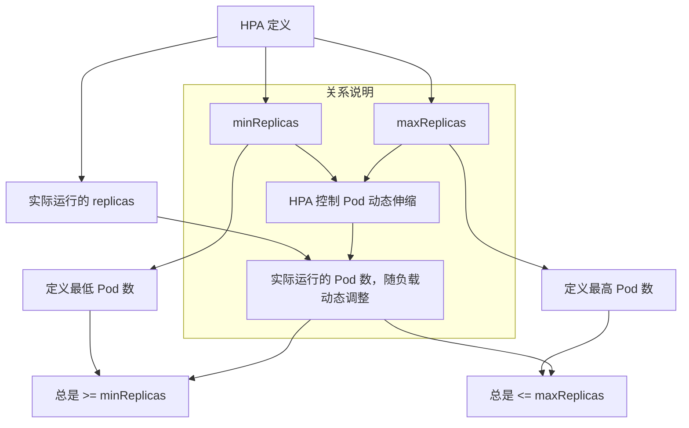
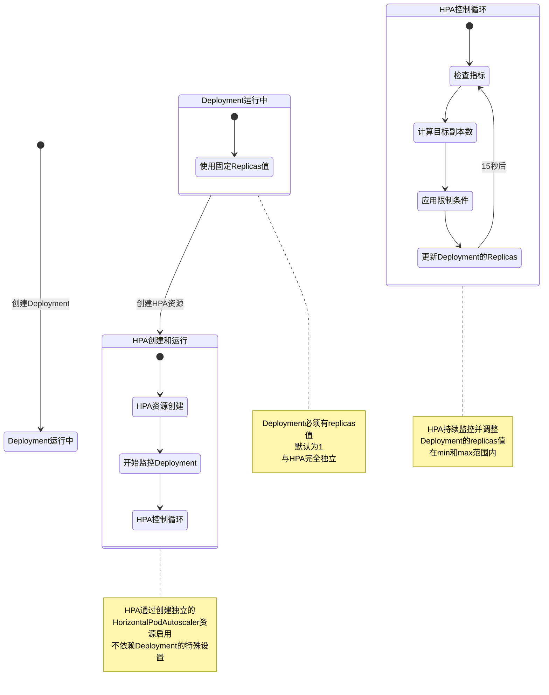
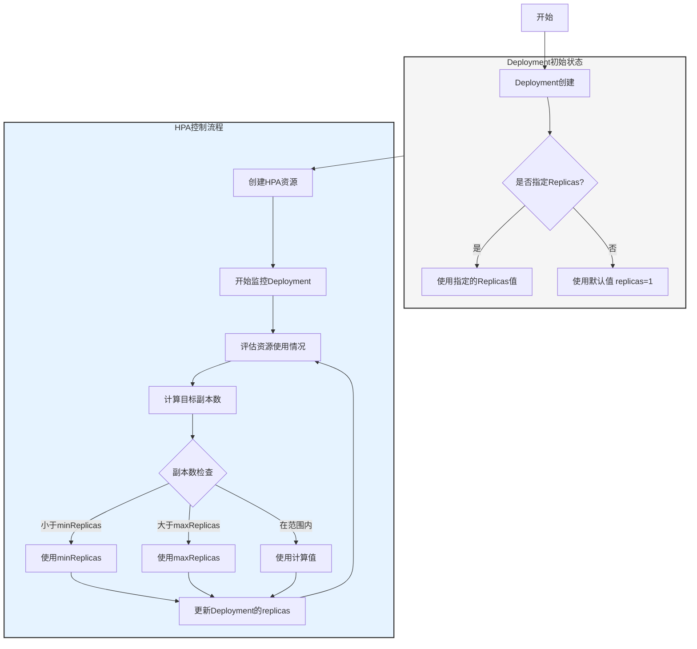
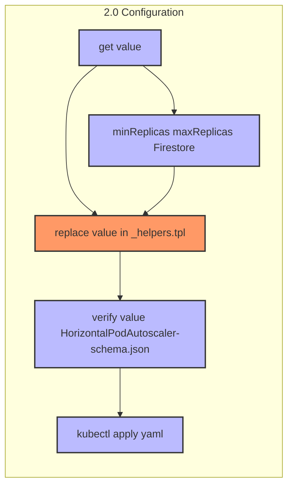
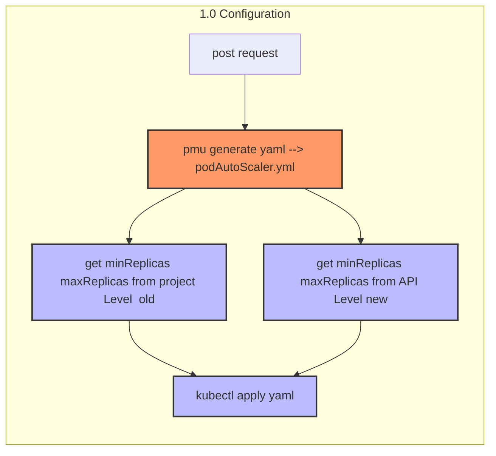
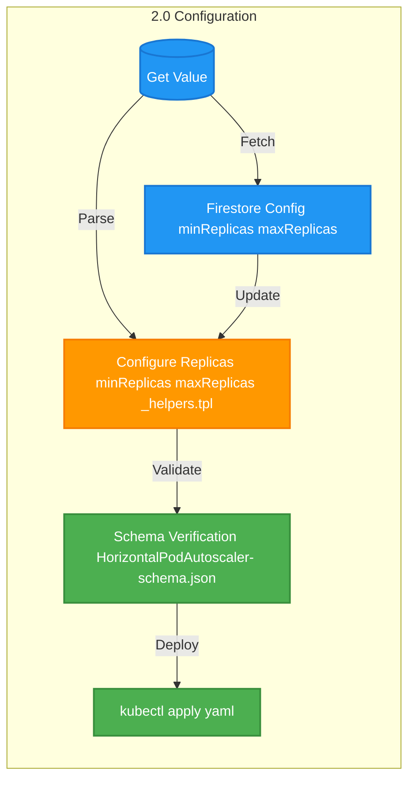
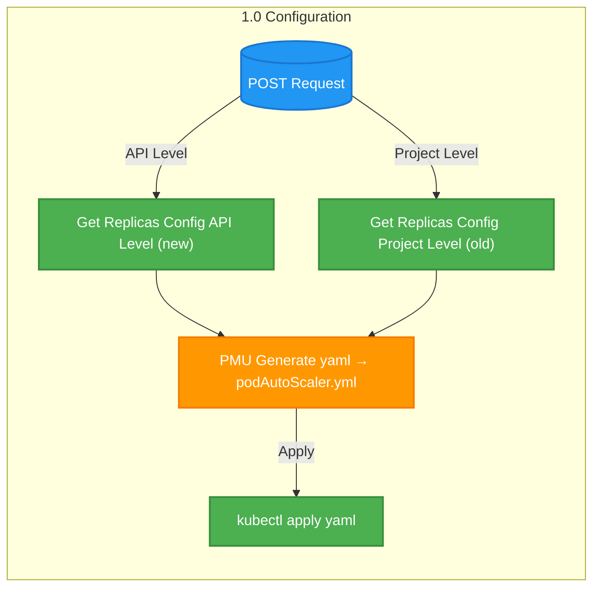

在 Kubernetes 中，Horizontal Pod Autoscaler (HPA) 和 Deployment 的 replicas 参数之间存在一定的关系。下面详细解释三者的定义和关系：

1. 关键参数定义
	•	HPA 的 minReplicas 和 maxReplicas：
	•	minReplicas：HPA 允许的最小 Pod 副本数量。当负载很低时，Pod 数量不会低于这个值。
	•	maxReplicas：HPA 允许的最大 Pod 副本数量。当负载很高时，Pod 数量不会超过这个值。
	•	Deployment 的 replicas：
	•	Deployment 的 replicas 参数用于定义初始的 Pod 副本数量。
	•	当启用了 HPA 时，HPA 会动态调整 Deployment 的 replicas 参数，而你手动设置的值可能会被覆盖。

2. 三者的关系
	1.	初始化阶段：
	•	当你创建 Deployment 时，如果同时启用了 HPA：
	•	HPA 会忽略 Deployment 的初始 replicas 值，并将其调整到 minReplicas 或其他动态计算值。
	•	如果未启用 HPA，Deployment 的 replicas 参数直接决定 Pod 副本数量。
	2.	HPA 生效后：
	•	HPA 会根据配置的指标（如 CPU、内存等）和目标值动态调整 Deployment 的 replicas。
	•	调整范围限制在 minReplicas 和 maxReplicas 之间。
	3.	运行时动态行为：
	•	当负载增加：
	•	如果当前副本数小于 maxReplicas，HPA 会增加 Deployment 的 replicas 值。
	•	当负载降低：
	•	如果当前副本数大于 minReplicas，HPA 会减少 Deployment 的 replicas 值。
	•	边界约束：
	•	Deployment 的 Pod 副本数不会低于 minReplicas，也不会超过 maxReplicas。
	4.	手动更新行为：
	•	如果你手动调整 Deployment 的 replicas 参数，而 HPA 已启用，HPA 会在下一个周期（通常 15 秒左右）将其覆盖为基于负载计算出的值。
	•	如果要禁用 HPA 干预，你需要先停止 HPA。


关于HPA的检查周期：

默认的检查间隔是15秒，但这个值可以通过--horizontal-pod-autoscaler-sync-period参数调整
扩容时反应较快，而缩容有默认5分钟的冷却时间，以防止副本数量频繁波动


关于初始化阶段：

HPA不会立即忽略Deployment的初始replicas值
只有在第一次度量指标并计算后，才会根据需要调整副本数


1. 关系示例

假设以下配置：
	•	HPA 配置：minReplicas=2, maxReplicas=10
	•	Deployment 初始配置：replicas=5
	•	当前负载：
	•	低负载： HPA 会将 Pod 副本数降至 minReplicas=2。
	•	中等负载： HPA 会维持一个适合当前负载的 replicas（如 6）。
	•	高负载： HPA 会将 Pod 副本数增加到 maxReplicas=10。

YAML 示例

# Deployment
```yaml
apiVersion: apps/v1
kind: Deployment
metadata:
  name: my-deployment
spec:
  replicas: 5
  selector:
    matchLabels:
      app: my-app
  template:
    metadata:
      labels:
        app: my-app
    spec:
      containers:
      - name: my-container
        image: my-image
        resources:
          requests:
            cpu: "100m"
            memory: "128Mi"
          limits:
            cpu: "500m"
            memory: "512Mi"
```
# HPA
```yaml
apiVersion: autoscaling/v2
kind: HorizontalPodAutoscaler
metadata:
  name: my-hpa
spec:
  scaleTargetRef:
    apiVersion: apps/v1
    kind: Deployment
    name: my-deployment
  minReplicas: 2
  maxReplicas: 10
  metrics:
  - type: Resource
    resource:
      name: cpu
      target:
        type: Utilization
        averageUtilization: 50
```
	•	初始 replicas 为 5，但 HPA 会根据 CPU 使用率动态调整副本数。
	•	如果 CPU 使用率高于 50%，Pod 数会增加；低于 50%，Pod 数会减少，但不会低于 2 或高于 10。

4. 平台按 HPA 最大值收费的考虑
	•	收费逻辑：
平台按 HPA 的 maxReplicas 收费时，说明收费基于可能的最大资源使用情况，而不是实际使用的 Pod 数量。
	•	优化建议：
	1.	确保 maxReplicas 的设置符合业务实际需要，避免过高的配置浪费成本。
	2.	在可能的情况下，通过监控和优化指标（如 CPU、内存）降低 minReplicas 和 maxReplicas 的需求。


以下是 minReplicas、maxReplicas 和 replicas 之间关系的可视化，说明它们在 Kubernetes HPA 中的作用及交互。

解释：
	1.	minReplicas:
	•	表示 HPA 的最低 Pod 数量，即使负载低于阈值，也至少会保留这么多 Pod。
	•	实际运行的 Pod 数 始终 >= minReplicas。
	2.	maxReplicas:
	•	表示 HPA 的最高 Pod 数量，即使负载非常高，也不会超过该值。
	•	实际运行的 Pod 数 始终 <= maxReplicas。
	3.	replicas:
	•	动态调整的实际 Pod 数，基于资源使用（如 CPU、内存）和 HPA 策略计算。
	•	始终满足关系：minReplicas <= replicas <= maxReplicas。


# About HPA and minReplicas and maxReplicas

1. Deployment的replicas值和是否启用HPA是完全独立的两件事:
   - Deployment必须要有replicas值(如果不指定默认为1)
   - HPA的启用与否完全取决于是否创建了HorizontalPodAutoscaler资源

2. 正确的启用流程是:
   - 首先部署Deployment(必须有replicas值,或使用默认值1)
   - 然后创建HPA资源并指向这个Deployment
   - HPA会立即开始工作,不需要Deployment中有任何特殊设置


Deployment必须要有replicas值(如果不指定默认为1).也就是说如果我有创建了HorizontalPodAutoscaler资源,我的Deployment还是按照HPA的定义的资源情况来调度
```bash
是的，Deployment 必须有一个 replicas 值，即使你在 YAML 文件中未显式指定，Kubernetes 默认会将其设置为 1。这是 Deployment 的默认行为。以下是一些详细说明：

1. 为什么 Deployment 必须有 replicas 值？
	•	核心原因：replicas 定义了一个 Deployment 所需的 Pod 副本数量，是 Deployment 控制器用来保证所需状态的关键字段。
	•	如果没有 replicas，Deployment 就无法决定需要创建多少个 Pod。
	•	Kubernetes 控制器会基于 replicas 值持续监控和调整 Pod 的数量，确保 Deployment 的状态与预期一致。

2. 默认值
	•	当你不指定 replicas 时：
	•	Kubernetes 会将其默认为 1。
	•	这意味着即使 YAML 文件中省略了 replicas 字段，最终也会有一个 Pod 被创建。

示例：未显式指定 replicas 的 Deployment

apiVersion: apps/v1
kind: Deployment
metadata:
  name: example-deployment
spec:
  selector:
    matchLabels:
      app: example
  template:
    metadata:
      labels:
        app: example
    spec:
      containers:
      - name: nginx
        image: nginx:1.21

	•	结果：Kubernetes 会为 replicas 设置默认值为 1，运行时等价于：

replicas: 1

3. Deployment 和 HPA 的关系
	•	即使你为 Deployment 配置了 HorizontalPodAutoscaler (HPA)，replicas 的默认值仍然适用：
	•	HPA 会根据负载动态调整 replicas 的值，但初始时会从 Deployment 的 replicas 开始。
	•	例如，如果 replicas=1，HPA 会从 1 开始根据负载自动扩展 Pod 数。

4. 验证默认行为

运行一个未定义 replicas 的 Deployment，然后检查其生成的实际资源：

kubectl apply -f deployment.yaml
kubectl get deployment example-deployment -o yaml

你会在输出中看到：

spec:
  replicas: 1

总结
	•	replicas 是 Deployment 的必备字段，即使你不指定，Kubernetes 也会默认设置为 1。
	•	在实际部署中，如果你的服务需要高可用，建议显式指定一个适合的 replicas 值（如 3 或更多），避免因默认值过低影响服务能力。
```

让我修正之前的流程图以更准确地表达这个关系:




关键点说明:
1. Deployment和HPA是两个独立的资源:
   - Deployment可以独立存在和运行
   - HPA是一个可选的,独立的控制器

2. HPA启用流程:
   ```yaml
   # 1. 首先有一个正常的Deployment
   apiVersion: apps/v1
   kind: Deployment
   metadata:
     name: example-deployment
   spec:
     replicas: 1  # 可以是任何有效值
     ...

   # 2. 然后创建HPA资源
   apiVersion: autoscaling/v2
   kind: HorizontalPodAutoscaler
   metadata:
     name: example-hpa
   spec:
     scaleTargetRef:
       apiVersion: apps/v1
       kind: Deployment
       name: example-deployment
     minReplicas: 1
     maxReplicas: 10
     ...
   ```

3. 工作原理:
   - HPA创建后会立即开始监控目标Deployment
   - 不需要Deployment做任何特殊配置
   - HPA会根据规则动态调整Deployment的replicas值

所以,只要正确创建了HPA资源并指向了目标Deployment,HPA就会开始工作,与Deployment的初始replicas值无关。这个值只是作为HPA接管前的初始状态。


对,完全正确。让我详细说明这个行为:
- flow

具体来说:

1. Deployment的replicas值在HPA存在时的作用:
   ```yaml
   apiVersion: apps/v1
   kind: Deployment
   spec:
     replicas: 3  # 这个值会被HPA覆盖
   ```
   - 此值仅作为初始值或HPA不存在时的固定值
   - 一旦HPA生效,这个值就会被动态调整

2. HPA的控制优先级:
   ```yaml
   apiVersion: autoscaling/v2
   kind: HorizontalPodAutoscaler
   spec:
     minReplicas: 2    # 最小保证2个副本
     maxReplicas: 10   # 最大允许10个副本
     metrics:
     - type: Resource
       resource:
         name: cpu
         target:
           type: Utilization
           averageUtilization: 50
   ```
   - 即使Deployment设置replicas: 1
   - 如果HPA的minReplicas是2
   - 最终运行的Pod数量将是2个(符合HPA的最小值要求)

3. 实际运行中的表现:
   - HPA会根据资源使用情况动态调整副本数
   - 调整范围永远在minReplicas和maxReplicas之间
   - Deployment原始的replicas设置会被忽略
   - 调整发生在周期性检查中(默认15秒一次)

所以你的理解是正确的 - 一旦HPA生效,Pod的副本数完全由HPA根据资源使用情况来决定,而不是由Deployment的replicas值决定。Deployment的replicas值只是提供了一个初始状态。


# 收费原则
从平台的角度来说，合理的收费模式应该综合考虑 资源利用率、平台维护成本 和 用户体验，以确保既能覆盖运营成本，又能给用户提供透明、可控的计费逻辑。以下是分析这几个数值的优劣：

1. 可选收费模型

(1) 按照 maxReplicas 收费
	•	优点：
	•	提供了最保守的计费模型，确保平台能覆盖潜在的最大资源使用成本。
	•	对用户来说，maxReplicas 是一个明确的参数，便于他们控制自己的资源预算。
	•	不受实际负载波动影响，平台收益有保障。
	•	缺点：
	•	对用户来说可能会显得“不公平”，因为在低负载场景下，实际的 Pod 数可能远小于 maxReplicas。
	•	用户可能会倾向于配置较低的 maxReplicas，从而影响高峰时的服务弹性能力，导致平台资源无法充分利用。

(2) 按照实际运行的 replicas 收费
	•	优点：
	•	用户仅为实际使用的资源付费，显得更加公平，用户体验更好。
	•	鼓励用户合理优化负载和 HPA 配置，提升平台整体资源利用效率。
	•	有利于吸引更多用户，因为按需付费对中小规模的客户友好。
	•	缺点：
	•	收入受负载波动影响较大，特别是某些业务负载可能只有短时间达到高峰，可能导致平台运营成本无法完全覆盖。
	•	平台需要高精度的实时监控系统记录实际使用的 replicas，这可能增加技术成本。

(3) 按照 minReplicas 收费
	•	优点：
	•	对用户来说是最低的保障成本，显得成本预测清晰。
	•	平台收益更为稳定，因为 minReplicas 是静态参数，不受负载波动影响。
	•	鼓励用户在低负载场景下保持合理的 HPA 配置，避免资源浪费。
	•	缺点：
	•	在实际负载高于 minReplicas 的情况下，用户会占用更多资源而无需支付额外费用，可能导致平台资源被滥用。
	•	平台在高负载场景下无法通过实际资源使用收费，可能会导致亏损。

(4) 按照 minReplicas + 动态使用范围 收费
	•	这是一个折中的计费方式：
	•	按 minReplicas 收取基础费用，保证平台的基础成本覆盖。
	•	同时根据实际运行的 replicas（但限制在 minReplicas 和 maxReplicas 范围内）动态增加收费，体现资源弹性使用成本。
	•	优点：
	•	平衡用户体验和平台收益，用户只为实际使用的弹性资源付费。
	•	避免用户设置过低的 minReplicas 配置，而忽视实际弹性需求。
	•	收益模型稳定，且能够动态反映高峰期资源使用。
	•	缺点：
	•	实现逻辑复杂，需要准确跟踪实际 Pod 数随时间的变化，并设计清晰的计费规则。
	•	用户可能需要更多时间理解计费细则。

2. 推荐收费模型

根据不同的业务优先级和目标：
	•	如果以 平台稳定收益 为优先：建议按 maxReplicas 收费。
	•	收费逻辑简单，适合以最大资源使用为成本参考的业务模式。
	•	如果以 公平性和用户体验 为优先：建议采用 minReplicas + 动态范围 的模式。
	•	例如：每月基础费用按照 minReplicas 计费，弹性资源按照实际使用的额外 replicas 数量（或者动态范围的峰值）计算。
	•	如果目标是 吸引更多用户（特别是初创团队）：建议按照 实际运行的 replicas 收费。
	•	平台需要有充足资源池来应对潜在的高负载波动。

3. 收费示例

假设一个用户的配置为：
	•	HPA: minReplicas=2, maxReplicas=10
	•	实际使用：
	•	高负载时：运行 8 个 Pod
	•	低负载时：运行 3 个 Pod
	•	平均负载：每天实际运行的平均 Pod 数为 4。

(1) 按 maxReplicas 收费
	•	收费基准：按 maxReplicas=10 计算。
	•	优点： 平台收费固定，收入可预测。
	•	缺点： 用户负载低时，成本较高，用户可能不满意。

(2) 按实际运行 replicas 收费
	•	收费基准：按每天平均运行 4 个 Pod 收费。
	•	优点： 用户满意度高，适合中小规模客户。
	•	缺点： 平台收益受用户负载波动影响较大。

(3) 按 minReplicas + 动态范围 收费
	•	收费基准：
	•	基础费用：按 minReplicas=2 计算。
	•	弹性费用：每天平均使用超过 minReplicas 的 Pod 数为 4 - 2 = 2。
	•	总计费用 = minReplicas 收费 + 弹性部分收费。

4. 建议实现收费的透明性

无论选择哪种模型，确保以下几点：
	•	计费逻辑清晰，用户能够预估费用。
	•	提供历史使用数据或报表，用户可以核查费用明细。
	•	在用户界面中显示当前的实际 Pod 数、minReplicas 和 maxReplicas 配置，以便用户动态调整。

这样既提升用户满意度，又能防止误解和纠纷。


# set flow 

- 1.0 Configuration



%% 2.0 Configuration Flow

%% 1.0 Configuration Flow

