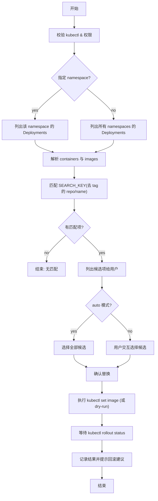

# **问题分析**

你想要一个尽可能周全的 shell 脚本，用来把**已有 Kubernetes Deployment 的 image**替换成你输入的目标 image（通常只是版本不同）。脚本需要能：

- 根据输入的 -i <image> 在指定 namespace（或全部 namespace）中查找有哪些 deployment 使用了相同或相似的 image（或 container）。
- 列出候选 deployment + container（便于你确认）。
- 支持交互式选择要替换的 deployment，也支持“全部替换”模式。
- 提供 dry-run、回滚/等待 rollout 等操作，以降低风险。
- 做好权限与环境检查、输出清晰的日志与错误信息。

下面给出 **一个可直接复制使用的 Bash 脚本**（已考虑常见边界与安全性），并包含使用示例、流程图与关键注意事项。所有内容均为标准 Markdown，可直接保存为 .md。

---

# **解决方案（脚本 + 使用说明）**

### **特性**

- 支持 -i|--image（必填）、-n|--namespace（可选，默认 all）、-a|--auto（自动对所有匹配 deployment 执行替换）、-d|--dry-run、-c|--container（指定 container 名称）、-y（非交互强制确认）。
- 在替换前列出匹配项并给交互式选择（或自动执行）。
- 使用 kubectl set image ... --record 并跟踪 kubectl rollout status（可选）。
- 支持 --dry-run=client 以先模拟操作。
- 会检查 kubectl 是否可用并检查是否有权限列取 deployments（简单检查）。

---

### **脚本：**

### **k8s-img-replace.sh**

```bash
#!/usr/bin/env bash
# k8s-img-replace.sh
# Replace images in K8s deployments based on provided image (version change common case)
# Usage:
#   ./k8s-img-replace.sh -i myrepo/myapp:1.2.3 [-n my-namespace] [-a] [-d] [-c containerName] [-y]
#
# Flags:
#   -i|--image       (required) new image (including repo and tag) e.g. registry.io/org/app:1.2.3
#   -n|--namespace   namespace to search; "all" or omitted => all namespaces
#   -a|--auto        replace automatically for all matched deployments (non-interactive)
#   -d|--dry-run     don't actually change (kubectl set image --dry-run=client)
#   -c|--container   target container name inside deployments (optional)
#   -y               auto-confirm (skip interactive prompts)
#   -h|--help        show help
set -euo pipefail

# ---- Helpers ----
die() { echo "ERROR: $*" >&2; exit 1; }
log() { echo "[`date -u +'%Y-%m-%dT%H:%M:%SZ'`] $*"; }

# ---- Parse args ----
IMAGE=""
NAMESPACE="all"
AUTO=false
DRYRUN=false
TARGET_CONTAINER=""
ASSUME_YES=false

while [[ $# -gt 0 ]]; do
  case "$1" in
    -i|--image) IMAGE="$2"; shift 2;;
    -n|--namespace) NAMESPACE="$2"; shift 2;;
    -a|--auto) AUTO=true; shift;;
    -d|--dry-run) DRYRUN=true; shift;;
    -c|--container) TARGET_CONTAINER="$2"; shift 2;;
    -y) ASSUME_YES=true; shift;;
    -h|--help) cat <<'EOF'
Usage: k8s-img-replace.sh -i <image> [-n <namespace>] [-a] [-d] [-c <container>] [-y]
  -i|--image       new image (with tag) e.g. registry.io/org/app:1.2.3  (required)
  -n|--namespace   namespace to search; default all
  -a|--auto        auto-apply to all matched deployments
  -d|--dry-run     simulate only (kubectl --dry-run=client)
  -c|--container   restrict to this container name inside the deployment
  -y               auto-confirm (non-interactive)
EOF
      exit 0;;
    *) die "Unknown arg: $1";;
  esac
done

[[ -n "$IMAGE" ]] || die "image is required. See -h."

# ---- Preconditions ----
command -v kubectl >/dev/null 2>&1 || die "kubectl not found in PATH."

# quick permissions check: can list deployments?
if ! kubectl get deploy -A --no-headers >/dev/null 2>&1; then
  die "kubectl cannot list deployments. Check KUBECONFIG / permissions."
fi

# compute search key (image without tag) and tag
# image might be like: repo/path/name:tag or repo:5000/name:tag or name:tag
IMAGE_NO_TAG="${IMAGE%%:*}"   # if there is colon for port, this could be wrong - handle ports
# Better approach: split last ':' AFTER last '/' -> tag part
last_slash_index=$(awk -v a="$IMAGE" 'BEGIN{print index(a,"/")}')
# simpler robust: extract tag as after last ':' only if that ':' appears after last '/'.
# Use parameter expansion:
if [[ "$IMAGE" == *:* && "${IMAGE##*/}" == *:* ]]; then
  TAG="${IMAGE##*:}"
  REPO="${IMAGE%:*}"
else
  TAG=""
  REPO="$IMAGE"
fi
SEARCH_KEY="$REPO"   # match repository+name (no tag)

log "Target image: $IMAGE"
log "Search key (no tag): $SEARCH_KEY"
[[ -n "$TARGET_CONTAINER" ]] && log "Filtering on container name: $TARGET_CONTAINER"
[[ "$NAMESPACE" == "all" ]] && NS_ARG="-A" || NS_ARG="-n ${NAMESPACE}"

# kubectl jsonpath to get namespace|deployment|container=img;... lines
JSONPATH='{range .items[*]}{.metadata.namespace}{"|"}{.metadata.name}{"|"}{range .spec.template.spec.containers[*]}{.name}{"="}{.image}{";"}{end}{"\n"}{end}'
mapfile -t LINES < <(kubectl get deploy ${NS_ARG} -o jsonpath="$JSONPATH" 2>/dev/null || true)

if [[ ${#LINES[@]} -eq 0 ]]; then
  die "No deployments found in ${NAMESPACE}."
fi

# Build candidate list by matching SEARCH_KEY substring in image
declare -a CAND_NS CAND_DEP CAND_CONTAINER CAND_IMAGE
idx=0
for ln in "${LINES[@]}"; do
  # line format: namespace|deploy|ctr1=img1;ctr2=img2;
  ns="${ln%%|*}"
  rest="${ln#*|}"
  dep="${rest%%|*}"
  containers_str="${rest#*|}"   # e.g. "ctr1=img1;ctr2=img2;"
  # split on ';'
  IFS=';' read -ra pairs <<< "$containers_str"
  for p in "${pairs[@]}"; do
    [[ -z "$p" ]] && continue
    ctr="${p%%=*}"
    img="${p#*=}"
    # match by full repo/name (without tag) substring match
    # get img repo part (no tag)
    if [[ "$img" == *:* && "${img##*/}" == *:* ]]; then
      img_repo="${img%:*}"
    else
      img_repo="$img"
    fi
    if [[ "$img_repo" == *"$SEARCH_KEY"* ]]; then
      # honor TARGET_CONTAINER filter
      if [[ -n "$TARGET_CONTAINER" && "$ctr" != "$TARGET_CONTAINER" ]]; then
        continue
      fi
      CAND_NS+=("$ns")
      CAND_DEP+=("$dep")
      CAND_CONTAINER+=("$ctr")
      CAND_IMAGE+=("$img")
      idx=$((idx+1))
    fi
  done
done

if [[ ${#CAND_NS[@]} -eq 0 ]]; then
  log "No matching deployments/containers found for search key: $SEARCH_KEY"
  exit 0
fi

# Print candidate list
echo
log "Found ${#CAND_NS[@]} candidate(s):"
printf "%3s  %-30s %-30s %-20s %-40s\n" "No." "NAMESPACE" "DEPLOYMENT" "CONTAINER" "CURRENT IMAGE"
for i in "${!CAND_NS[@]}"; do
  printf "%3d)  %-30s %-30s %-20s %-40s\n" $((i+1)) "${CAND_NS[i]}" "${CAND_DEP[i]}" "${CAND_CONTAINER[i]}" "${CAND_IMAGE[i]}"
done
echo

# If dry-run, show what we'd do and exit or continue with --dry-run when applying.
if $DRYRUN; then
  log "DRY RUN enabled. No changes will be applied. You can re-run without -d to actually apply."
fi

# Determine which indices to operate on
declare -a SELECT_IDX
if $AUTO; then
  for i in "${!CAND_NS[@]}"; do SELECT_IDX+=("$i"); done
else
  # interactive selection
  if $ASSUME_YES; then
    for i in "${!CAND_NS[@]}"; do SELECT_IDX+=("$i"); done
  else
    echo "Select deployments to replace (comma-separated numbers), or 'all' to select all:"
    read -r selection
    if [[ "$selection" == "all" ]]; then
      for i in "${!CAND_NS[@]}"; do SELECT_IDX+=("$i"); done
    else
      # split comma/space
      IFS=', ' read -ra picks <<< "$selection"
      for p in "${picks[@]}"; do
        if [[ "$p" =~ ^[0-9]+$ ]] && (( p>=1 && p<=${#CAND_NS[@]} )); then
          SELECT_IDX+=("$((p-1))")
        else
          log "Ignoring invalid selection: $p"
        fi
      done
    fi
  fi
fi

if [[ ${#SELECT_IDX[@]} -eq 0 ]]; then
  log "No deployments selected. Exiting."
  exit 0
fi

# Confirm
echo
log "Will replace the following:"
for si in "${SELECT_IDX[@]}"; do
  echo " - ${CAND_NS[si]}/${CAND_DEP[si]} container=${CAND_CONTAINER[si]}  ${CAND_IMAGE[si]} -> ${IMAGE}"
done
echo
if ! $ASSUME_YES; then
  read -p "Proceed? [y/N]: " ans
  case "$ans" in
    y|Y) ;;
    *) log "Aborted by user."; exit 0;;
  esac
fi

# Apply changes
APPLY_DRYRUN_FLAG=""
if $DRYRUN; then
  APPLY_DRYRUN_FLAG="--dry-run=client"
fi

for si in "${SELECT_IDX[@]}"; do
  ns="${CAND_NS[si]}"
  dep="${CAND_DEP[si]}"
  ctr="${CAND_CONTAINER[si]}"

  log "Applying set image on ${ns}/${dep} container=${ctr} -> ${IMAGE}"
  # kubectl set image deployment/<dep> <container>=<image> -n <ns> --record
  cmd=(kubectl set image deployment/"$dep" "$ctr"="$IMAGE" -n "$ns" --record)
  if [[ -n "$APPLY_DRYRUN_FLAG" ]]; then
    cmd+=("$APPLY_DRYRUN_FLAG")
  fi

  if "${cmd[@]}"; then
    log "kubectl set image executed for ${ns}/${dep}."
    if ! $DRYRUN; then
      # wait rollout
      log "Waiting for rollout status for ${dep}..."
      if ! kubectl rollout status deployment/"$dep" -n "$ns" --timeout=120s; then
        log "rollout status failed or timed out for ${ns}/${dep}. Consider 'kubectl rollout undo' if necessary."
      else
        log "rollout successful for ${ns}/${dep}."
      fi
    fi
  else
    log "kubectl set image failed for ${ns}/${dep}."
  fi
done

log "All done."
```

---

# **使用示例**

1. 交互式查找并替换（默认搜索所有 namespace）：

```
./k8s-img-replace.sh -i registry.io/myorg/myapp:2.0.0
```

脚本会列出所有候选，等待你选择要替换的 deployment（或输入 all），再确认后执行。

2. 指定 namespace、自动替换所有匹配项并等待 rollout：

```
./k8s-img-replace.sh -i registry.io/myorg/myapp:2.0.0 -n my-namespace -a
```

3. 先做 dry-run 模拟（不会改变集群）：

```
./k8s-img-replace.sh -i registry.io/myorg/myapp:2.0.0 -n my-namespace -a -d
```

4. 指定 container 名称（只匹配该 container）：

```
./k8s-img-replace.sh -i registry.io/myorg/myapp:2.0.0 -c my-app-container
```

5. 非交互并强制执行（脚本自己确认）：

```
./k8s-img-replace.sh -i registry.io/myorg/myapp:2.0.0 -a -y
```

---

# **流程图（Mermaid）**



---

# **注意事项 & 最佳实践**

- **权限**：确保执行者有 update 权限（或至少 patch）对部署以及 get/list 的权限。脚本会简单检测 kubectl get deploy -A 能否运行，但不能保证具体的 patch 权限——必要时用 kubectl auth can-i update deployment -n <ns>.
- **镜像匹配策略**：脚本通过匹配 image 的“repo/name（去 tag）”做 substring 匹配，能覆盖典型的 myrepo/name:tag 情形。如果你有复杂命名（带 custom ports 或 registry path），请先用 ./k8s-img-replace.sh -i <image> -d 做 dry-run 观察匹配结果再执行。
- **多 container deployment**：脚本列出每个 container，并允许指定 -c 精确替换单个 container。若 deployment 有多个 container 且你想同时替换多 container，需要额外改造（循环调用 kubectl set image 即可）。
- **回滚**：若 rollout 出现问题，可手动 kubectl rollout undo deployment/<dep> -n <ns>。脚本在 rollout 超时会提示你考虑回滚。
- **CI/CD 集成**：生产环境建议通过 CI/CD（例如用 kubectl set image 或直接更新 manifest 并 kubectl apply）并结合 Canary 或 Blue/Green 策略。脚本适合临时替换或手动运维流程。
- **验证替换**：替换后建议检查 Pod logs、Liveness/Readiness 状态、应用层健康检查以及监控告警。

---

# **常见扩展（可选）**

- 支持 YAML patch（kubectl patch deployment ... --type=json -p '[{"op":"replace",...}]'）以在单次命令里更新多个 containers。
- 增加并行处理（并发执行 kubectl set image 并行化）。
- 增加 Slack/邮件通知替换结果。
- 支持从文件提供多个 image 列表，逐条替换（批量变更）。
- 记录变更到 GitOps（如生成 PR，或写入变更日志到 BigQuery/DB）。

---

# **小结**

我给出了一个完整、可直接使用的脚本 k8s-img-replace.sh，同时提供了操作示例、流程图与注意事项。脚本兼顾了交互性与自动化场景（-a），并提供 dry-run 保护与 rollout 等安全检查。如果你希望我把脚本改为**支持批量文件输入**、**并行替换**或**输出为 CSV 报表**，或者把它改写成 kubectl plugin 形式（kubectl img-replace），告诉我你优先的扩展方向，我会直接给出实现。
