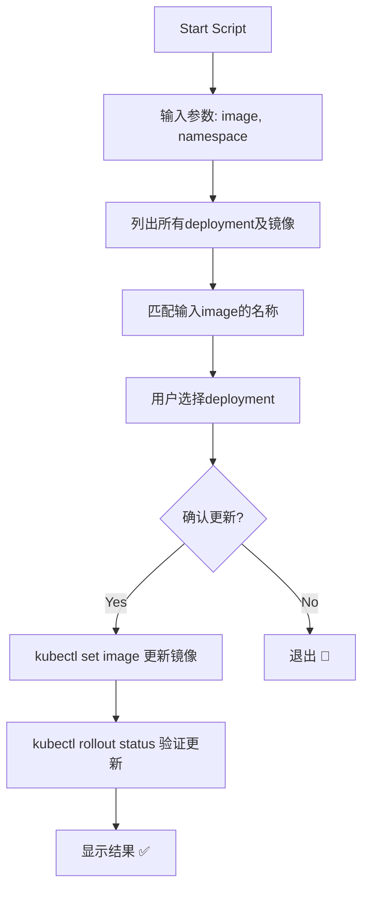

# Shell Scripts Collection

Generated on: 2025-10-31 18:15:25
Directory: /Users/lex/git/knowledge/k8s/images

## `k8s-image-replace.sh`

```bash
#!/usr/bin/env bash
# k8s-image-replace.sh
# 用于替换 Kubernetes deployment 中的镜像
# 使用方法: ./k8s-image-replace.sh -i <image-name:version> [-n namespace]

set -euo pipefail

# 颜色输出
RED='\033[0;31m'
GREEN='\033[0;32m'
YELLOW='\033[1;33m'
BLUE='\033[0;34m'
NC='\033[0m' # No Color

# 日志函数
log() { echo -e "${BLUE}[INFO]${NC} $*"; }
warn() { echo -e "${YELLOW}[WARN]${NC} $*"; }
error() { echo -e "${RED}[ERROR]${NC} $*" >&2; }
success() { echo -e "${GREEN}[SUCCESS]${NC} $*"; }

# 显示帮助
show_help() {
    cat << EOF
用法: $0 -i <image> [-n namespace] [-h]

参数:
  -i, --image      目标镜像 (必需) 例如: myapp:v1.2.3
  -n, --namespace  指定命名空间 (可选，默认搜索所有命名空间)
  -h, --help       显示帮助信息

示例:
  $0 -i myapp:v1.2.3
  $0 -i registry.io/myorg/myapp:v2.0.0 -n production
EOF
}

# 解析参数
IMAGE=""
NAMESPACE=""

while [[ $# -gt 0 ]]; do
    case $1 in
        -i|--image)
            IMAGE="$2"
            shift 2
            ;;
        -n|--namespace)
            NAMESPACE="$2"
            shift 2
            ;;
        -h|--help)
            show_help
            exit 0
            ;;
        *)
            error "未知参数: $1"
            show_help
            exit 1
            ;;
    esac
done

# 检查必需参数
if [[ -z "$IMAGE" ]]; then
    error "镜像参数是必需的"
    show_help
    exit 1
fi

# 检查 kubectl 是否可用
if ! command -v kubectl &> /dev/null; then
    error "kubectl 未找到，请确保已安装并在 PATH 中"
    exit 1
fi

# 检查 kubectl 连接
if ! kubectl cluster-info &> /dev/null; then
    error "无法连接到 Kubernetes 集群"
    exit 1
fi

# 提取镜像名称（不包含标签）
IMAGE_NAME="${IMAGE%:*}"
IMAGE_TAG="${IMAGE##*:}"

log "目标镜像: $IMAGE"
log "镜像名称: $IMAGE_NAME"
log "镜像标签: $IMAGE_TAG"

# 构建 kubectl 命令参数
if [[ -n "$NAMESPACE" ]]; then
    NS_ARG="-n $NAMESPACE"
    log "搜索命名空间: $NAMESPACE"
else
    NS_ARG="-A"
    log "搜索所有命名空间"
fi

echo
log "正在搜索匹配的 deployments..."

# 获取所有 deployments 及其镜像信息
DEPLOYMENTS=$(kubectl get deployments $NS_ARG -o jsonpath='{range .items[*]}{.metadata.namespace}{"|"}{.metadata.name}{"|"}{range .spec.template.spec.containers[*]}{.name}{"="}{.image}{";"}{end}{"\n"}{end}' 2>/dev/null)

if [[ -z "$DEPLOYMENTS" ]]; then
    warn "未找到任何 deployments"
    exit 0
fi

# 查找匹配的 deployments
declare -a MATCHED_NS
declare -a MATCHED_DEPLOY
declare -a MATCHED_CONTAINER
declare -a MATCHED_IMAGE

while IFS= read -r line; do
    if [[ -z "$line" ]]; then continue; fi
    
    # 解析行: namespace|deployment|container1=image1;container2=image2;
    ns="${line%%|*}"
    rest="${line#*|}"
    deploy="${rest%%|*}"
    containers="${rest#*|}"
    
    # 解析容器和镜像
    IFS=';' read -ra container_pairs <<< "$containers"
    for pair in "${container_pairs[@]}"; do
        if [[ -z "$pair" ]]; then continue; fi
        
        container="${pair%%=*}"
        image="${pair#*=}"
        current_image_name="${image%:*}"
        
        # 检查镜像名称是否匹配（支持部分匹配）
        if [[ "$current_image_name" == *"$IMAGE_NAME"* ]] || [[ "$IMAGE_NAME" == *"$current_image_name"* ]]; then
            MATCHED_NS+=("$ns")
            MATCHED_DEPLOY+=("$deploy")
            MATCHED_CONTAINER+=("$container")
            MATCHED_IMAGE+=("$image")
        fi
    done
done <<< "$DEPLOYMENTS"

# 显示匹配结果
if [[ ${#MATCHED_NS[@]} -eq 0 ]]; then
    warn "未找到匹配的 deployments"
    exit 0
fi

echo
success "找到 ${#MATCHED_NS[@]} 个匹配的 deployment(s):"
echo
printf "%-4s %-20s %-30s %-20s %-40s\n" "序号" "命名空间" "Deployment" "容器" "当前镜像"
printf "%-4s %-20s %-30s %-20s %-40s\n" "----" "--------" "----------" "----" "--------"

for i in "${!MATCHED_NS[@]}"; do
    printf "%-4d %-20s %-30s %-20s %-40s\n" $((i+1)) "${MATCHED_NS[i]}" "${MATCHED_DEPLOY[i]}" "${MATCHED_CONTAINER[i]}" "${MATCHED_IMAGE[i]}"
done

echo
echo "请选择要更新的 deployment:"
echo "  输入序号 (例如: 1,3,5 或 1-3)"
echo "  输入 'all' 选择全部"
echo "  输入 'q' 退出"
echo

read -p "请选择: " selection

case "$selection" in
    q|Q)
        log "用户取消操作"
        exit 0
        ;;
    all|ALL)
        SELECTED_INDICES=($(seq 0 $((${#MATCHED_NS[@]} - 1))))
        ;;
    *)
        # 解析用户输入的序号
        SELECTED_INDICES=()
        IFS=',' read -ra selections <<< "$selection"
        for sel in "${selections[@]}"; do
            # 处理范围 (例如 1-3)
            if [[ "$sel" == *-* ]]; then
                start="${sel%-*}"
                end="${sel#*-}"
                for ((j=start; j<=end; j++)); do
                    if [[ $j -ge 1 && $j -le ${#MATCHED_NS[@]} ]]; then
                        SELECTED_INDICES+=($((j-1)))
                    fi
                done
            else
                # 单个数字
                if [[ "$sel" =~ ^[0-9]+$ ]] && [[ $sel -ge 1 && $sel -le ${#MATCHED_NS[@]} ]]; then
                    SELECTED_INDICES+=($((sel-1)))
                fi
            fi
        done
        ;;
esac

if [[ ${#SELECTED_INDICES[@]} -eq 0 ]]; then
    warn "未选择任何 deployment"
    exit 0
fi

# 显示将要执行的操作
echo
log "将要执行以下更新操作:"
for idx in "${SELECTED_INDICES[@]}"; do
    echo "  ${MATCHED_NS[idx]}/${MATCHED_DEPLOY[idx]} (${MATCHED_CONTAINER[idx]}): ${MATCHED_IMAGE[idx]} -> $IMAGE"
done

echo
read -p "确认执行? (y/N): " confirm
if [[ ! "$confirm" =~ ^[Yy]$ ]]; then
    log "用户取消操作"
    exit 0
fi

# 执行更新
echo
log "开始执行镜像更新..."

for idx in "${SELECTED_INDICES[@]}"; do
    ns="${MATCHED_NS[idx]}"
    deploy="${MATCHED_DEPLOY[idx]}"
    container="${MATCHED_CONTAINER[idx]}"
    
    log "更新 $ns/$deploy 中的容器 $container..."
    
    if kubectl set image deployment/"$deploy" "$container"="$IMAGE" -n "$ns" --record; then
        success "✓ $ns/$deploy 更新成功"
        
        # 等待 rollout 完成
        log "等待 $ns/$deploy rollout 完成..."
        if kubectl rollout status deployment/"$deploy" -n "$ns" --timeout=300s; then
            success "✓ $ns/$deploy rollout 完成"
        else
            error "✗ $ns/$deploy rollout 超时或失败"
            warn "如需回滚，请执行: kubectl rollout undo deployment/$deploy -n $ns"
        fi
    else
        error "✗ $ns/$deploy 更新失败"
    fi
    echo
done

success "镜像更新操作完成!"
```

# claude
```bash
#!/bin/bash

# 颜色定义
RED='\033[0;31m'
GREEN='\033[0;32m'
YELLOW='\033[1;33m'
NC='\033[0m' # No Color

# 打印带颜色的消息
print_info() {
    echo -e "${GREEN}[INFO]${NC} $1"
}

print_warn() {
    echo -e "${YELLOW}[WARN]${NC} $1"
}

print_error() {
    echo -e "${RED}[ERROR]${NC} $1"
}

# 使用说明
usage() {
    cat << EOF
使用方法:
    $0 -i <image:tag> -n <namespace> [-d <deployment>] [-c <container>]

参数说明:
    -i  源镜像名称（必需）格式: image:tag 或 registry/image:tag
    -n  目标 namespace（必需）
    -d  目标 deployment 名称（可选，不指定则交互选择）
    -c  容器名称（可选，用于多容器 pod）
    -h  显示帮助信息

示例:
    $0 -i myapp:v1.2.3 -n production
    $0 -i gcr.io/project/myapp:v1.2.3 -n production -d myapp-deployment
    $0 -i myapp:v1.2.3 -n production -d myapp-deployment -c app-container
EOF
    exit 1
}

# 检查 kubectl 是否可用
check_kubectl() {
    if ! command -v kubectl &> /dev/null; then
        print_error "kubectl 命令未找到，请先安装 kubectl"
        exit 1
    fi
    
    if ! kubectl cluster-info &> /dev/null; then
        print_error "无法连接到 Kubernetes 集群"
        exit 1
    fi
}

# 提取镜像基础名称（不含 tag）
extract_image_base() {
    local image=$1
    # 移除 tag 部分（: 或 @ 之后的内容）
    echo "$image" | sed -E 's/(:|\@).*//'
}

# 列出指定 namespace 下所有 deployment 及其 images
list_deployments_with_images() {
    local namespace=$1
    
    print_info "获取 namespace [$namespace] 下的所有 deployments..."
    
    # 检查 namespace 是否存在
    if ! kubectl get namespace "$namespace" &> /dev/null; then
        print_error "Namespace [$namespace] 不存在"
        exit 1
    fi
    
    # 获取所有 deployment
    local deployments=$(kubectl get deployments -n "$namespace" -o jsonpath='{.items[*].metadata.name}')
    
    if [ -z "$deployments" ]; then
        print_error "Namespace [$namespace] 下没有找到 deployment"
        exit 1
    fi
    
    echo ""
    print_info "当前 Deployments 及其 Images:"
    echo "----------------------------------------"
    
    local count=1
    for deploy in $deployments; do
        echo -e "\n${GREEN}[$count]${NC} Deployment: ${YELLOW}$deploy${NC}"
        
        # 获取该 deployment 的所有容器和镜像
        local containers=$(kubectl get deployment "$deploy" -n "$namespace" -o json | \
            jq -r '.spec.template.spec.containers[] | "\(.name)|\(.image)"')
        
        while IFS='|' read -r container image; do
            echo "    └─ Container: $container"
            echo "       Image: $image"
        done <<< "$containers"
        
        ((count++))
    done
    
    echo -e "\n----------------------------------------"
}

# 查找匹配的 deployments
find_matching_deployments() {
    local namespace=$1
    local image_base=$2
    
    local matching_deploys=()
    local deployments=$(kubectl get deployments -n "$namespace" -o jsonpath='{.items[*].metadata.name}')
    
    for deploy in $deployments; do
        local images=$(kubectl get deployment "$deploy" -n "$namespace" -o jsonpath='{.spec.template.spec.containers[*].image}')
        
        for img in $images; do
            local current_base=$(extract_image_base "$img")
            if [[ "$current_base" == *"$image_base"* ]] || [[ "$image_base" == *"$current_base"* ]]; then
                matching_deploys+=("$deploy")
                break
            fi
        done
    done
    
    echo "${matching_deploys[@]}"
}

# 交互选择 deployment
select_deployment() {
    local namespace=$1
    local image_base=$2
    
    echo ""
    print_info "查找可能匹配的 deployments..."
    
    local matching=$(find_matching_deployments "$namespace" "$image_base")
    
    if [ -n "$matching" ]; then
        print_warn "找到可能匹配的 deployments: $matching"
    fi
    
    echo ""
    read -p "请输入目标 Deployment 名称: " deploy_name
    
    # 验证 deployment 是否存在
    if ! kubectl get deployment "$deploy_name" -n "$namespace" &> /dev/null; then
        print_error "Deployment [$deploy_name] 在 namespace [$namespace] 中不存在"
        exit 1
    fi
    
    echo "$deploy_name"
}

# 选择容器（多容器场景）
select_container() {
    local namespace=$1
    local deployment=$2
    local suggested_image=$3
    
    # 获取所有容器
    local containers=$(kubectl get deployment "$deployment" -n "$namespace" -o json | \
        jq -r '.spec.template.spec.containers[].name')
    
    local container_count=$(echo "$containers" | wc -l)
    
    if [ "$container_count" -eq 1 ]; then
        echo "$containers"
        return
    fi
    
    echo ""
    print_warn "该 Deployment 包含多个容器:"
    
    local count=1
    for container in $containers; do
        local current_image=$(kubectl get deployment "$deployment" -n "$namespace" -o json | \
            jq -r ".spec.template.spec.containers[] | select(.name==\"$container\") | .image")
        echo "  [$count] $container (当前: $current_image)"
        ((count++))
    done
    
    echo ""
    read -p "请输入要更新的容器名称: " container_name
    
    # 验证容器是否存在
    if ! echo "$containers" | grep -q "^${container_name}$"; then
        print_error "容器 [$container_name] 不存在"
        exit 1
    fi
    
    echo "$container_name"
}

# 更新 deployment image
update_deployment_image() {
    local namespace=$1
    local deployment=$2
    local container=$3
    local new_image=$4
    
    print_info "准备更新配置:"
    echo "  Namespace:  $namespace"
    echo "  Deployment: $deployment"
    echo "  Container:  $container"
    echo "  New Image:  $new_image"
    echo ""
    
    # 获取当前镜像
    local current_image=$(kubectl get deployment "$deployment" -n "$namespace" -o json | \
        jq -r ".spec.template.spec.containers[] | select(.name==\"$container\") | .image")
    
    print_info "当前镜像: $current_image"
    
    # 二次确认
    read -p "确认执行更新? (yes/no): " confirm
    
    if [ "$confirm" != "yes" ] && [ "$confirm" != "y" ]; then
        print_warn "操作已取消"
        exit 0
    fi
    
    # 执行更新
    print_info "正在更新 deployment..."
    
    if kubectl set image deployment/"$deployment" \
        "$container=$new_image" \
        -n "$namespace" \
        --record; then
        
        print_info "镜像更新命令已执行"
        
        # 等待 rollout
        echo ""
        print_info "监控 rollout 状态..."
        kubectl rollout status deployment/"$deployment" -n "$namespace" --timeout=5m
        
        if [ $? -eq 0 ]; then
            print_info "✓ Deployment 更新成功！"
            
            # 显示新的 pod 状态
            echo ""
            print_info "新 Pod 状态:"
            kubectl get pods -n "$namespace" -l "app=$deployment" --show-labels
        else
            print_error "Rollout 超时或失败"
            print_warn "可以使用以下命令回滚:"
            echo "  kubectl rollout undo deployment/$deployment -n $namespace"
        fi
    else
        print_error "镜像更新失败"
        exit 1
    fi
}

# 主函数
main() {
    local new_image=""
    local namespace=""
    local deployment=""
    local container=""
    
    # 参数解析
    while getopts "i:n:d:c:h" opt; do
        case $opt in
            i) new_image="$OPTARG" ;;
            n) namespace="$OPTARG" ;;
            d) deployment="$OPTARG" ;;
            c) container="$OPTARG" ;;
            h) usage ;;
            *) usage ;;
        esac
    done
    
    # 检查必需参数
    if [ -z "$new_image" ] || [ -z "$namespace" ]; then
        print_error "缺少必需参数"
        usage
    fi
    
    # 检查环境
    check_kubectl
    
    # 显示当前所有 deployments
    list_deployments_with_images "$namespace"
    
    # 提取镜像基础名称用于匹配
    local image_base=$(extract_image_base "$new_image")
    
    # 如果未指定 deployment，交互选择
    if [ -z "$deployment" ]; then
        deployment=$(select_deployment "$namespace" "$image_base")
    else
        # 验证指定的 deployment 是否存在
        if ! kubectl get deployment "$deployment" -n "$namespace" &> /dev/null; then
            print_error "指定的 Deployment [$deployment] 不存在"
            exit 1
        fi
    fi
    
    # 如果未指定 container，自动选择或交互选择
    if [ -z "$container" ]; then
        container=$(select_container "$namespace" "$deployment" "$new_image")
    fi
    
    # 执行更新
    update_deployment_image "$namespace" "$deployment" "$container" "$new_image"
}

# 执行主函数
main "$@"
```

# chatgtp 

好的 👍 下面是我为你整理并增强后的 **完整 Shell 脚本 (update-image.sh)**，它支持以下功能：

- ✅ 输入镜像信息（-i 参数）
    
- ✅ 自动列出所有 Deployment 的镜像（支持多命名空间）
    
- ✅ 根据输入镜像名（不含 tag）模糊匹配目标 Deployment
    
- ✅ 交互式确认后更新 Deployment 的镜像版本
    
- ✅ 自动验证 kubectl 命令和权限
    

---

```bash
#!/bin/bash
# ---------------------------------------------
# Kubernetes Deployment Image Updater
# Author: GPT-5
# ---------------------------------------------

set -euo pipefail

# Usage
usage() {
  echo "Usage: $0 -i <image:tag> [-n <namespace>]"
  echo "Example: $0 -i gcr.io/my-app:v2.3.1"
  exit 1
}

# Parse arguments
NAMESPACE=""
while getopts ":i:n:" opt; do
  case ${opt} in
    i ) INPUT_IMAGE=$OPTARG ;;
    n ) NAMESPACE=$OPTARG ;;
    * ) usage ;;
  esac
done

# Check required argument
if [[ -z "${INPUT_IMAGE:-}" ]]; then
  usage
fi

# Validate kubectl command
if ! command -v kubectl >/dev/null 2>&1; then
  echo "❌ Error: kubectl not found in PATH"
  exit 1
fi

echo "🔍 Checking Kubernetes context..."
kubectl cluster-info >/dev/null || { echo "❌ Cannot connect to cluster"; exit 1; }

# Parse image name and tag
IMAGE_NAME=$(echo "$INPUT_IMAGE" | cut -d':' -f1)
IMAGE_TAG=$(echo "$INPUT_IMAGE" | cut -d':' -f2)

if [[ -z "$IMAGE_TAG" ]]; then
  echo "⚠️  No tag specified, defaulting to 'latest'"
  IMAGE_TAG="latest"
fi

echo "🧩 Image name: $IMAGE_NAME"
echo "🧩 Image tag : $IMAGE_TAG"
echo ""

# Determine namespace scope
if [[ -n "$NAMESPACE" ]]; then
  NS_OPT="-n $NAMESPACE"
  echo "📂 Namespace: $NAMESPACE"
else
  NS_OPT="--all-namespaces"
  echo "📂 Namespace: ALL"
fi
echo ""

# List all current images
echo "📋 Current Deployments and their Images:"
kubectl get deploy $NS_OPT -o jsonpath='{range .items[*]}{.metadata.namespace}{"|"}{.metadata.name}{"|"}{range .spec.template.spec.containers[*]}{.image}{" "}{end}{"\n"}{end}' | column -t -s '|'

echo ""
echo "🔎 Searching for deployments containing image name '$IMAGE_NAME'..."
MATCHED_DEPLOYMENTS=$(kubectl get deploy $NS_OPT -o jsonpath='{range .items[*]}{.metadata.namespace}{"|"}{.metadata.name}{"|"}{range .spec.template.spec.containers[*]}{.image}{" "}{end}{"\n"}{end}' | grep "$IMAGE_NAME" || true)

if [[ -z "$MATCHED_DEPLOYMENTS" ]]; then
  echo "❌ No deployments found containing '$IMAGE_NAME'"
  exit 1
fi

echo ""
echo "✅ Found the following deployments:"
echo "$MATCHED_DEPLOYMENTS" | column -t -s '|'
echo ""

# Interactive selection
read -p "👉 Enter the namespace of the deployment you want to update: " TARGET_NS
read -p "👉 Enter the deployment name: " TARGET_DEPLOY

if [[ -z "$TARGET_NS" || -z "$TARGET_DEPLOY" ]]; then
  echo "❌ Namespace or deployment name cannot be empty."
  exit 1
fi

# Confirm update
read -p "⚠️  Confirm updating '$TARGET_DEPLOY' in '$TARGET_NS' to image '$INPUT_IMAGE'? (y/n): " CONFIRM
if [[ "$CONFIRM" != "y" ]]; then
  echo "🚫 Aborted."
  exit 0
fi

# Update image
echo "🔄 Updating deployment..."
kubectl set image deployment/"$TARGET_DEPLOY" "*=$INPUT_IMAGE" -n "$TARGET_NS" --record

echo ""
echo "⏳ Verifying rollout status..."
kubectl rollout status deployment/"$TARGET_DEPLOY" -n "$TARGET_NS"

echo ""
echo "✅ Update completed successfully!"
kubectl get deploy "$TARGET_DEPLOY" -n "$TARGET_NS" -o wide
```

---

### **🧠 使用说明**

```
# 替换指定命名空间中的镜像
./update-image.sh -i gcr.io/my-app:v2.3.1 -n prod

# 替换所有命名空间中匹配到的镜像（需手动确认）
./update-image.sh -i gcr.io/my-app:v2.3.1
```

---

### **⚙️ 工作流程图**



---

是否希望我帮你增加一个“dry-run”模式？这样可以在执行前只打印将更新哪些 deployment，而不真正执行修改。