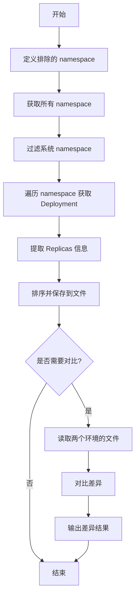

# K8S Deployment Replicas 对比方案

## 问题分析

需要实现以下功能：

1. 获取 K8S 集群中所有 Deployment 的 Replicas 值
2. 排除系统 namespace（如 kube-system, kube-public 等）
3. 对结果进行排序
4. 对比两个环境的差异并输出

## 解决方案

### 方案流程图



### 实现脚本

#### 1. 获取单个环境的 Replicas 信息

```bash
#!/bin/bash

# get_replicas.sh - 获取指定集群的 Deployment Replicas 信息

# 配置部分
OUTPUT_FILE="${1:-replicas_output.txt}"
CONTEXT="${2:-$(kubectl config current-context)}"

# 定义需要排除的系统 namespace
EXCLUDED_NAMESPACES=(
    "kube-system"
    "kube-public"
    "kube-node-lease"
    "default"
)

echo "=== 开始获取 Deployment Replicas 信息 ==="
echo "Context: $CONTEXT"
echo "输出文件: $OUTPUT_FILE"
echo ""

# 清空或创建输出文件
> "$OUTPUT_FILE"

# 构建排除 namespace 的 grep 参数
EXCLUDE_PATTERN=$(IFS='|'; echo "${EXCLUDED_NAMESPACES[*]}")

# 获取所有非系统 namespace
NAMESPACES=$(kubectl --context="$CONTEXT" get namespaces -o jsonpath='{.items[*].metadata.name}' | \
    tr ' ' '\n' | \
    grep -Ev "^($EXCLUDE_PATTERN)$")

echo "正在扫描的 namespace:"
echo "$NAMESPACES"
echo ""

# 遍历每个 namespace 获取 deployment 信息
for ns in $NAMESPACES; do
    # 获取该 namespace 下的所有 deployment
    DEPLOYMENTS=$(kubectl --context="$CONTEXT" get deployments -n "$ns" -o json 2>/dev/null)
    
    if [ $? -eq 0 ] && [ "$(echo "$DEPLOYMENTS" | jq '.items | length')" -gt 0 ]; then
        # 使用 jq 提取信息并格式化
        echo "$DEPLOYMENTS" | jq -r '.items[] | 
            "\(.metadata.namespace)|\(.metadata.name)|\(.spec.replicas)"' >> "$OUTPUT_FILE"
    fi
done

# 排序输出文件（按 namespace, deployment name 排序）
sort -t'|' -k1,1 -k2,2 "$OUTPUT_FILE" -o "$OUTPUT_FILE"

# 显示统计信息
TOTAL_DEPLOYMENTS=$(wc -l < "$OUTPUT_FILE")
echo "✓ 完成! 共找到 $TOTAL_DEPLOYMENTS 个 Deployment"
echo "✓ 结果已保存到: $OUTPUT_FILE"
echo ""

# 显示前 10 条记录作为预览
echo "=== 前 10 条记录预览 ==="
echo "NAMESPACE|DEPLOYMENT|REPLICAS"
echo "---------|----------|--------"
head -10 "$OUTPUT_FILE" | column -t -s'|'
```

#### 2. 对比两个环境的差异

```bash
#!/bin/bash

# compare_replicas.sh - 对比两个环境的 Deployment Replicas 差异

# 参数检查
if [ $# -lt 2 ]; then
    echo "用法: $0 <环境1文件> <环境2文件> [输出文件]"
    echo "示例: $0 prod_replicas.txt staging_replicas.txt diff_result.txt"
    exit 1
fi

ENV1_FILE="$1"
ENV2_FILE="$2"
OUTPUT_FILE="${3:-replicas_diff_$(date +%Y%m%d_%H%M%S).txt}"

# 检查文件是否存在
if [ ! -f "$ENV1_FILE" ]; then
    echo "错误: 文件 $ENV1_FILE 不存在"
    exit 1
fi

if [ ! -f "$ENV2_FILE" ]; then
    echo "错误: 文件 $ENV2_FILE 不存在"
    exit 1
fi

echo "=== 开始对比 Deployment Replicas ==="
echo "环境1文件: $ENV1_FILE"
echo "环境2文件: $ENV2_FILE"
echo ""

# 创建临时关联数组文件
TEMP_DIR=$(mktemp -d)
ENV1_MAP="$TEMP_DIR/env1.map"
ENV2_MAP="$TEMP_DIR/env2.map"

# 转换为键值对格式（namespace|deployment -> replicas）
awk -F'|' '{print $1"|"$2"|"$3}' "$ENV1_FILE" | sort > "$ENV1_MAP"
awk -F'|' '{print $1"|"$2"|"$3}' "$ENV2_FILE" | sort > "$ENV2_MAP"

# 初始化输出文件
cat > "$OUTPUT_FILE" << EOF
# Deployment Replicas 对比报告
# 生成时间: $(date '+%Y-%m-%d %H:%M:%S')
# 环境1: $ENV1_FILE
# 环境2: $ENV2_FILE

===============================================
差异类型说明:
- DIFFERENT: Replicas 值不同
- ONLY_IN_ENV1: 仅存在于环境1
- ONLY_IN_ENV2: 仅存在于环境2
===============================================

EOF

# 统计变量
DIFF_COUNT=0
ONLY_ENV1=0
ONLY_ENV2=0
SAME_COUNT=0

# 临时文件存储差异
DIFF_TEMP="$TEMP_DIR/differences.txt"
> "$DIFF_TEMP"

echo "正在对比..."

# 使用 join 命令对比两个文件
# 1. 找出两边都存在但值不同的
comm -12 <(cut -d'|' -f1,2 "$ENV1_MAP" | sort) <(cut -d'|' -f1,2 "$ENV2_MAP" | sort) | \
while IFS='|' read -r namespace deployment; do
    REPLICAS1=$(grep "^${namespace}|${deployment}|" "$ENV1_MAP" | cut -d'|' -f3)
    REPLICAS2=$(grep "^${namespace}|${deployment}|" "$ENV2_MAP" | cut -d'|' -f3)
    
    if [ "$REPLICAS1" != "$REPLICAS2" ]; then
        echo "DIFFERENT|$namespace|$deployment|$REPLICAS1|$REPLICAS2" >> "$DIFF_TEMP"
        ((DIFF_COUNT++))
    else
        ((SAME_COUNT++))
    fi
done

# 2. 仅存在于环境1的
comm -23 <(cut -d'|' -f1,2 "$ENV1_MAP" | sort) <(cut -d'|' -f1,2 "$ENV2_MAP" | sort) | \
while IFS='|' read -r namespace deployment; do
    REPLICAS1=$(grep "^${namespace}|${deployment}|" "$ENV1_MAP" | cut -d'|' -f3)
    echo "ONLY_IN_ENV1|$namespace|$deployment|$REPLICAS1|-" >> "$DIFF_TEMP"
    ((ONLY_ENV1++))
done

# 3. 仅存在于环境2的
comm -13 <(cut -d'|' -f1,2 "$ENV1_MAP" | sort) <(cut -d'|' -f1,2 "$ENV2_MAP" | sort) | \
while IFS='|' read -r namespace deployment; do
    REPLICAS2=$(grep "^${namespace}|${deployment}|" "$ENV2_MAP" | cut -d'|' -f3)
    echo "ONLY_IN_ENV2|$namespace|$deployment|-|$REPLICAS2" >> "$DIFF_TEMP"
    ((ONLY_ENV2++))
done

# 格式化输出到结果文件
{
    echo ""
    echo "## 统计摘要"
    echo "- 相同的 Deployment: $SAME_COUNT"
    echo "- Replicas 值不同: $DIFF_COUNT"
    echo "- 仅在环境1存在: $ONLY_ENV1"
    echo "- 仅在环境2存在: $ONLY_ENV2"
    echo ""
    
    if [ -s "$DIFF_TEMP" ]; then
        echo "## 详细差异列表"
        echo ""
        echo "TYPE|NAMESPACE|DEPLOYMENT|ENV1_REPLICAS|ENV2_REPLICAS"
        echo "----|---------|----------|-------------|-------------"
        sort "$DIFF_TEMP" | column -t -s'|'
    else
        echo "✓ 两个环境完全一致，无差异!"
    fi
} >> "$OUTPUT_FILE"

# 清理临时文件
rm -rf "$TEMP_DIR"

# 输出结果
echo ""
echo "=== 对比完成 ==="
echo "相同: $SAME_COUNT | 不同: $DIFF_COUNT | 仅环境1: $ONLY_ENV1 | 仅环境2: $ONLY_ENV2"
echo ""
echo "详细报告已保存到: $OUTPUT_FILE"
echo ""

# 如果有差异，显示内容
if [ $((DIFF_COUNT + ONLY_ENV1 + ONLY_ENV2)) -gt 0 ]; then
    echo "=== 差异预览 ==="
    cat "$OUTPUT_FILE"
fi
```

#### 3. 一键对比脚本（完整流程）

```bash
#!/bin/bash

# full_compare.sh - 完整的两环境对比流程

set -e

# 配置
ENV1_NAME="${1:-prod}"
ENV2_NAME="${2:-staging}"
ENV1_CONTEXT="${3}"
ENV2_CONTEXT="${4}"

TIMESTAMP=$(date +%Y%m%d_%H%M%S)
ENV1_FILE="${ENV1_NAME}_replicas_${TIMESTAMP}.txt"
ENV2_FILE="${ENV2_NAME}_replicas_${TIMESTAMP}.txt"
DIFF_FILE="diff_${ENV1_NAME}_vs_${ENV2_NAME}_${TIMESTAMP}.txt"

echo "=========================================="
echo "  K8S Deployment Replicas 对比工具"
echo "=========================================="
echo ""

# 步骤1: 获取环境1数据
echo ">>> 步骤 1/3: 获取 $ENV1_NAME 环境数据"
if [ -n "$ENV1_CONTEXT" ]; then
    ./get_replicas.sh "$ENV1_FILE" "$ENV1_CONTEXT"
else
    ./get_replicas.sh "$ENV1_FILE"
fi
echo ""

# 步骤2: 获取环境2数据
echo ">>> 步骤 2/3: 获取 $ENV2_NAME 环境数据"
if [ -n "$ENV2_CONTEXT" ]; then
    ./get_replicas.sh "$ENV2_FILE" "$ENV2_CONTEXT"
else
    echo "请切换到 $ENV2_NAME 环境的 context，然后按回车继续..."
    read -r
    ./get_replicas.sh "$ENV2_FILE"
fi
echo ""

# 步骤3: 对比差异
echo ">>> 步骤 3/3: 对比两环境差异"
./compare_replicas.sh "$ENV1_FILE" "$ENV2_FILE" "$DIFF_FILE"
echo ""

echo "=========================================="
echo "  对比流程完成!"
echo "=========================================="
echo "生成的文件:"
echo "  - $ENV1_FILE"
echo "  - $ENV2_FILE"
echo "  - $DIFF_FILE"
```

## 使用方法

### 基本使用

```bash
# 1. 赋予执行权限
chmod +x get_replicas.sh compare_replicas.sh full_compare.sh

# 2. 方式一：分步执行
# 获取环境1数据
kubectl config use-context prod-cluster
./get_replicas.sh prod_replicas.txt

# 获取环境2数据
kubectl config use-context staging-cluster
./get_replicas.sh staging_replicas.txt

# 对比差异
./compare_replicas.sh prod_replicas.txt staging_replicas.txt

# 3. 方式二：一键执行
./full_compare.sh prod staging prod-cluster staging-cluster
```

### 自定义排除的 namespace

编辑 `get_replicas.sh` 中的 `EXCLUDED_NAMESPACES` 数组：

```bash
EXCLUDED_NAMESPACES=(
    "kube-system"
    "kube-public"
    "kube-node-lease"
    "default"
    "istio-system"      # 添加自定义排除
    "monitoring"         # 添加自定义排除
)
```

## 输出示例

### Replicas 信息文件格式

```
api-service|frontend-api|3
api-service|backend-api|5
payment-service|payment-processor|2
user-service|user-management|4
```

### 对比结果文件格式

```
# Deployment Replicas 对比报告
# 生成时间: 2025-10-31 10:30:00
# 环境1: prod_replicas.txt
# 环境2: staging_replicas.txt

===============================================
差异类型说明:
- DIFFERENT: Replicas 值不同
- ONLY_IN_ENV1: 仅存在于环境1
- ONLY_IN_ENV2: 仅存在于环境2
===============================================

## 统计摘要
- 相同的 Deployment: 45
- Replicas 值不同: 5
- 仅在环境1存在: 2
- 仅在环境2存在: 1

## 详细差异列表

TYPE           NAMESPACE        DEPLOYMENT          ENV1_REPLICAS  ENV2_REPLICAS
----           ---------        ----------          -------------  -------------
DIFFERENT      api-service      frontend-api        3              2
DIFFERENT      payment-service  payment-processor   5              3
ONLY_IN_ENV1   legacy-service   old-api            2              -
ONLY_IN_ENV2   test-service     new-feature        -              1
```

## 注意事项

### 权限要求

- 确保有读取所有 namespace 的权限
- 建议使用 `cluster-admin` 或具有 `get deployments` 权限的 ServiceAccount

### 性能优化

```bash
# 如果集群较大，可以并行处理
# 在 get_replicas.sh 中修改循环部分
for ns in $NAMESPACES; do
    (
        kubectl get deployments -n "$ns" -o json 2>/dev/null | \
        jq -r '.items[] | "\(.metadata.namespace)|\(.metadata.name)|\(.spec.replicas)"'
    ) &
done
wait
```

### 故障排查

1. **kubectl 命令失败**

```bash
# 检查当前 context
kubectl config current-context

# 检查连接
kubectl cluster-info

# 检查权限
kubectl auth can-i get deployments --all-namespaces
```

2. **jq 未安装**

```bash
# Ubuntu/Debian
sudo apt-get install jq

# CentOS/RHEL
sudo yum install jq

# macOS
brew install jq
```

3. **输出文件为空**

```bash
# 检查是否排除了所有 namespace
echo "$NAMESPACES"

# 检查是否有 deployment
kubectl get deployments --all-namespaces
```

## 扩展功能

### 添加 JSON 格式输出

```bash
# 在 get_replicas.sh 中添加
kubectl get deployments --all-namespaces -o json | \
    jq '[.items[] | 
        select(.metadata.namespace | IN($excluded[]) | not) | 
        {
            namespace: .metadata.namespace,
            name: .metadata.name,
            replicas: .spec.replicas
        }
    ]' --argjson excluded '["kube-system","kube-public"]' \
    > replicas.json
```

### 添加告警功能

```bash
# 在 compare_replicas.sh 末尾添加
if [ $DIFF_COUNT -gt 0 ]; then
    # 发送告警到 Slack/Email
    echo "发现 $DIFF_COUNT 个差异，请检查!" | \
        mail -s "K8S Replicas 差异告警" admin@example.com
fi
```

---

**最佳实践建议：**

1. 定期（如每日）运行对比检查
2. 将脚本集成到 CI/CD 流程中
3. 结合版本控制跟踪 replicas 变更历史
4. 配置告警通知机制及时发现配置漂移