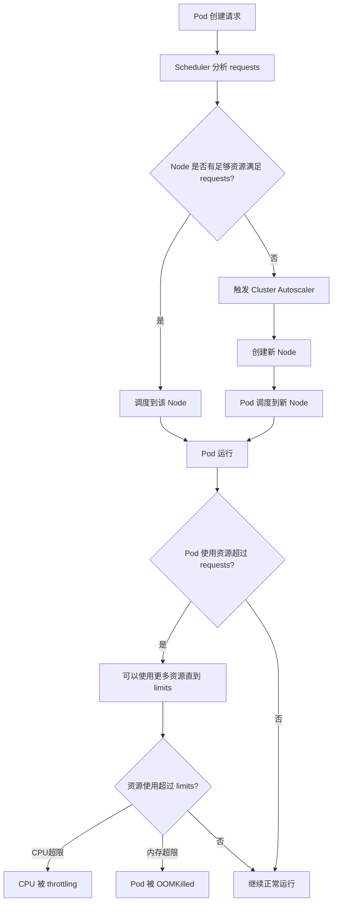
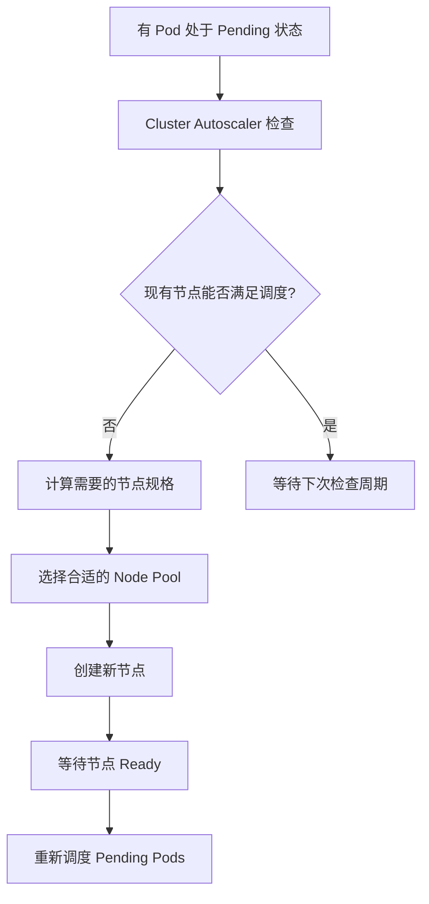
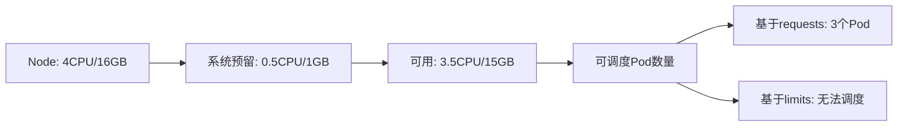
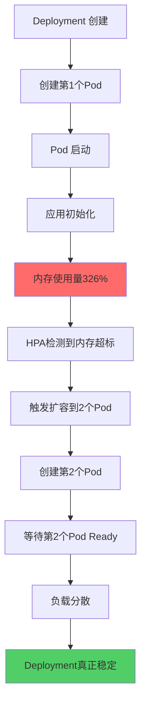
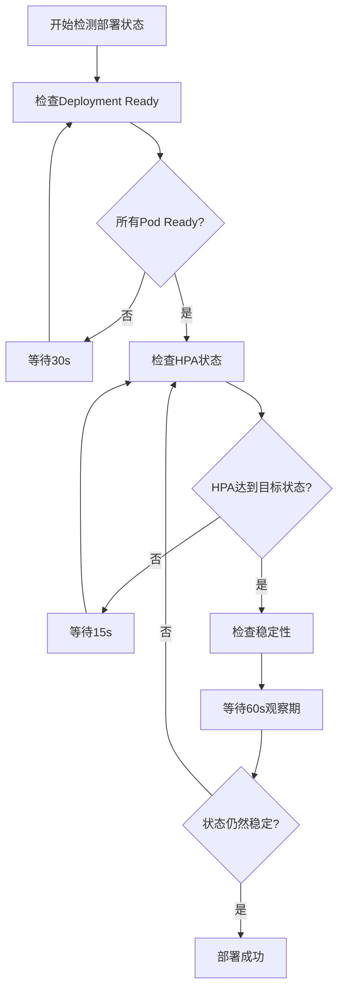

# GKE Pod 资源调度机制详解

## 资源调度优先级

GKE 的调度机制是基于 **requests** 而不是 limits 进行的。调度器只关心是否有足够的资源满足 requests 要求。

```yaml
resources:
  limits:
    cpu: 4
    memory: 16Gi
  requests:
    cpu: 1
    memory: 1Gi
```

## 调度流程



## 详细调度机制

### 1. 调度阶段 (Scheduling Phase)

|步骤  |说明                    |基于什么计算    |
|----|----------------------|----------|
|节点筛选|找出能满足 Pod requests 的节点|requests 值|
|节点评分|对可用节点进行评分排序           |剩余资源、亲和性等 |
|绑定  |将 Pod 绑定到最优节点         |最终评分结果    |

### 2. 资源分配逻辑

```bash
# Node 可分配资源检查
Node总资源 - 系统预留 - 已分配requests >= Pod的requests
```

**示例计算：**

- Node: 8 CPU, 32Gi Memory
- 系统预留: 0.5 CPU, 2Gi Memory
- 已分配: 3 CPU, 8Gi Memory
- 可用: 4.5 CPU, 22Gi Memory
- 你的Pod requests: 1 CPU, 1Gi Memory → **可以调度**

### 3. Autoscaler 触发机制



## 运行时资源管理

### CPU 资源管理

```bash
# CPU requests = 1 core
# CPU limits = 4 cores

# 实际运行时：
# - 保证获得 1 core 的 CPU 时间
# - 可以突发使用到 4 cores（如果节点有空闲）
# - 超过 4 cores 会被 throttling
```

### Memory 资源管理

```bash
# Memory requests = 1Gi  
# Memory limits = 16Gi

# 实际运行时：
# - 保证获得 1Gi 内存
# - 可以使用到 16Gi（如果节点有空闲）
# - 超过 16Gi 会被 OOMKilled
```

## QoS 类别影响

|QoS Class |条件               |你的配置 |调度优先级|
|----------|-----------------|-----|-----|
|Guaranteed|requests = limits|否    |最高   |
|Burstable |requests < limits|**是**|中等   |
|BestEffort|无 requests/limits|否    |最低   |

## Autoscaler 配置建议

### Node Pool 配置

```yaml
apiVersion: v1
kind: ConfigMap
metadata:
  name: cluster-autoscaler-nodepool-config
data:
  config.yaml: |
    nodePoolConfigs:
    - name: "general-pool"
      minSize: 1
      maxSize: 10
      machineType: "e2-standard-4"  # 4 CPU, 16GB
      # 对于你的 Pod，一个节点大约可以调度 3-4 个
```

### 扩缩容参数

```bash
# 关键参数
--scale-down-delay-after-add=10m
--scale-down-unneeded-time=10m
--max-node-provision-time=15m
--scan-interval=10s
```

## 实际影响分析

对于你的 Pod 配置：



**关键点：**

1. **调度决策**：只看 requests (1 CPU, 1Gi)
2. **节点利用率**：按 requests 计算，一个 4CPU/16GB 节点可调度 3-4 个 Pod
3. **运行时**：Pod 可以突发使用到 limits，但可能触发资源竞争
4. **自动扩展**：当无法满足新 Pod 的 requests 时触发

## 最佳实践建议

```yaml
# 建议的资源配置
resources:
  requests:
    cpu: "1"           # 保守估计实际需求
    memory: "2Gi"      # 给内存多一些缓冲
  limits:
    cpu: "2"           # 不要设置过大的 CPU limits
    memory: "4Gi"      # 内存 limits 相对保守
```

这样既能保证调度效率，又能避免资源浪费和 OOM 风险。​​​​​​​​​​​​​​​​


# HPA 导致的部署延迟问题分析

## 当前问题分析



## 延迟时间分解

|阶段       |预估耗时       |影响因素                                   |
|---------|-----------|---------------------------------------|
|Pod1 启动  |30-60s     |镜像拉取、容器启动                              |
|应用初始化    |10-30s     |应用启动逻辑                                 |
|HPA 检测周期 |15-30s     |`horizontal-pod-autoscaler-sync-period`|
|Pod2 创建调度|15-30s     |调度器延迟 + 镜像拉取                           |
|负载重新平衡   |5-15s      |连接建立、流量分配                              |
|**总延迟**  |**75-165s**|**正常情况下2-3分钟**                         |

## 解决方案对比

### 方案1：调整 Resource Requests (推荐)

```yaml
resources:
  requests:
    cpu: 1
    memory: 4Gi    # 提高到初始化真实需求
  limits:
    cpu: 4
    memory: 16Gi
```

**优点：**

- 启动后不会立即触发HPA
- 部署稳定时间缩短到30-60s
- 节点资源规划更准确

### 方案2：设置 Initial Delay

```yaml
apiVersion: autoscaling/v2
kind: HorizontalPodAutoscaler metadata:
  name: app-hpa
spec:
  behavior:
    scaleUp:
      stabilizationWindowSeconds: 300  # 5分钟稳定期
      policies:
      - type: Percent
        value: 100
        periodSeconds: 60
```

### 方案3：使用 Startup/Readiness Probe 分离

```yaml
spec:
  containers:
  - name: app
    startupProbe:           # 启动探针
      httpGet:
        path: /health
        port: 8080
      failureThreshold: 30
      periodSeconds: 10     # 最多等待5分钟
    readinessProbe:         # 就绪探针  
      httpGet:
        path: /ready
        port: 8080
      initialDelaySeconds: 5
      periodSeconds: 5
    livenessProbe:          # 存活探针
      httpGet:
        path: /health  
        port: 8080
      initialDelaySeconds: 60
```

### 方案4：InitContainer 预热

```yaml
spec:
  initContainers:
  - name: warmup
    image: your-app:latest
    command: ["/bin/sh", "-c"]
    args:
    - |
      # 预热逻辑：缓存加载、连接池初始化等
      /app/warmup.sh
      echo "Warmup completed"
  containers:
  - name: app
    # 主应用容器
```

## 部署状态检测优化

### 传统检测逻辑问题

```bash
# 传统方式 - 只检查副本数
kubectl get deployment app -o jsonpath='{.status.readyReplicas}'
# 问题：HPA还在扩容中，状态会一直变化
```

### 优化的检测策略



### 智能检测脚本

```bash
#!/bin/bash
check_deployment_stable() {
    local deployment=$1
    local namespace=$2
    local max_wait=600  # 10分钟超时
    local wait_time=0
    local stable_count=0
    local required_stable=4  # 需要连续4次检查稳定
    
    while [ $wait_time -lt $max_wait ]; do
        # 检查Deployment状态
        ready_replicas=$(kubectl get deployment $deployment -n $namespace \
            -o jsonpath='{.status.readyReplicas}' 2>/dev/null || echo "0")
        desired_replicas=$(kubectl get deployment $deployment -n $namespace \
            -o jsonpath='{.spec.replicas}')
        
        # 检查HPA状态
        current_replicas=$(kubectl get hpa $deployment-hpa -n $namespace \
            -o jsonpath='{.status.currentReplicas}' 2>/dev/null || echo "0")
        desired_hpa_replicas=$(kubectl get hpa $deployment-hpa -n $namespace \
            -o jsonpath='{.status.desiredReplicas}' 2>/dev/null || echo "0")
        
        echo "Ready: $ready_replicas/$desired_replicas, HPA: $current_replicas/$desired_hpa_replicas"
        
        # 检查是否稳定
        if [ "$ready_replicas" = "$desired_replicas" ] && \
           [ "$current_replicas" = "$desired_hpa_replicas" ] && \
           [ "$ready_replicas" -gt "0" ]; then
            stable_count=$((stable_count + 1))
            echo "Stable check $stable_count/$required_stable"
            
            if [ $stable_count -ge $required_stable ]; then
                echo "Deployment is stable!"
                return 0
            fi
        else
            stable_count=0
        fi
        
        sleep 15
        wait_time=$((wait_time + 15))
    done
    
    echo "Deployment did not stabilize within $max_wait seconds"
    return 1
}
```

## 推荐的最佳实践

### 1. 内存请求优化

```yaml
# 基于实际使用量调整
resources:
  requests:
    cpu: 1
    memory: 3.5Gi    # 326% * 1Gi ≈ 3.3Gi + 缓冲
  limits:
    cpu: 4
    memory: 16Gi
```

### 2. HPA 配置优化

```yaml
apiVersion: autoscaling/v2
kind: HorizontalPodAutoscaler
metadata:
  name: app-hpa
spec:
  scaleTargetRef:
    apiVersion: apps/v1
    kind: Deployment
    name: app
  minReplicas: 1
  maxReplicas: 2
  metrics:
  - type: Resource
    resource:
      name: memory
      target:
        type: Utilization
        averageUtilization: 80    # 提高阈值
  behavior:
    scaleUp:
      stabilizationWindowSeconds: 180   # 3分钟稳定期
      policies:
      - type: Percent
        value: 100
        periodSeconds: 60
    scaleDown:
      stabilizationWindowSeconds: 300   # 5分钟稳定期
```

### 3. 部署流水线集成

```yaml
# GitLab CI 示例
deploy:
  script:
    - kubectl apply -f deployment.yaml
    - ./wait-for-stable.sh app-name default 600
    - echo "Deployment completed successfully"
```

这样可以将部署稳定时间从2-3分钟缩短到1分钟以内，同时确保状态检测的准确性。​​​​​​​​​​​​​​​​


# ChatGPT 
你提出的问题非常关键，涵盖了以下几点：

  

1. HPA 扩缩容逻辑对 Pod 数量变化的影响
2. 初始内存过高导致 HPA 立即扩容
3. Deployment 状态就绪时间延长，影响自动化平台或后台任务判断是否“成功上线”
4. 最佳实践：如何设置 resources.request 与 HPA 以避免上线延迟

  

  

  

  

  

🧠 一、HPA 扩缩容行为的触发逻辑

  

  

你现在的状态：

  

- HPA 设置：minReplicas: 1, maxReplicas: 2
- Pod requests.memory: 1Gi，limits.memory: 16Gi
- 当前 HPA 指标：Memory: 326% / 100%

  

  

  

✅ 解释：

  

  

- 由于使用的是 Memory 使用率型 HPA（326% > 100%），系统认为负载已经超标，立即触发扩容；
- 这在只有 1 个 Pod 的初始化阶段尤为敏感；
- 扩容到 2 个 Pod 之后，假设均摊资源，则可降为 163%；
- 但如果启动峰值高，2 个 Pod 也可能都高，进一步触发 >2 的 scale up（如果 maxReplicas 更大）。

  

  

  

  

  

📌 二、Deployment 状态正常变慢的根本原因

  

  

Deployment 被认为“Ready”的前提：

  

所有 Pod 都处于 Ready 状态（通过 readinessProbe）且副本数满足 spec.replicas

  

所以你遇到的问题流程如下：

1. 创建 Deployment → 默认 1 个 Pod 启动

2. 内存瞬时占用 > requests × 3（326%）→ 触发 HPA 扩容

3. 第二个 Pod 创建 → 也需拉镜像、启动、健康检查

4. Deployment 需等两个 Pod 都 Ready → 才认为状态是 Available

⏱️ 因此，从创建 Deployment 到 kubectl rollout status 为 success 的时间被拉长。

  

  

  

  

✅ 三、最佳实践建议

  

  

  

🎯 目标

  

  

让 Deployment 尽快 Ready，避免 HPA 在初始化时误判触发扩容。

  

  

  

  

✅ 建议方案 1：合理设置 

requests

 值

  

|   |   |
|---|---|
|设置目标|建议做法|
|避免初始化扩容|根据实际启动内存，提升 requests.memory|
|防止过度限制|避免将 requests.memory 设置得过低|

🧠 经验法则：

  

- 启动高峰 ≠ 平稳运行；
- 例如 Java 应用可通过 -Xms 参数调低初始堆内存；
- 若启动会占用 1.5Gi，建议设置 requests.memory: 1.5Gi

  

  

  

  

  

✅ 建议方案 2：合理配置 HPA metrics

  

  

你目前的指标非常敏感：

targetMemoryUtilizationPercentage: 100

建议改为 150~200%，可以容忍初始化期间高负载。

  

  

  

  

✅ 建议方案 3：使用 

initialDelaySeconds

 或 

readinessProbe

 滞后检测

  

readinessProbe:

  httpGet:

    path: /health

    port: 8080

  initialDelaySeconds: 20

  periodSeconds: 5

这可以防止 readiness 过早设置为 true，提前被 HPA采样。

  

  

  

  

✅ 建议方案 4：后台检测程序考虑 “最小就绪副本数” 逻辑

  

  

你提到有后台程序判断 Deployment 状态，建议：

kubectl get deployment my-deploy -o=jsonpath='{.status.readyReplicas}'

与 spec.replicas 做对比。但注意：

  

- 如果你设置了 HPA，不要认为 spec.replicas = 1 就是目标值；
- 正确做法是：观察 minReplicas 到 maxReplicas 之间是否稳定。

  

  

  

  

  

🧾 总结表格

  

|   |   |
|---|---|
|问题|说明|
|HPA 扩容触发点|使用率 > targetMemoryUtilizationPercentage|
|Deployment 状态变慢的原因|扩容增加 Pod，需等待新 Pod Ready|
|建议 1：提升 requests.memory|提高初始化资源预留，减少误判扩容|
|建议 2：调高 Memory 触发阈值|避免短期内就因瞬时负载触发 scale up|
|建议 3：延迟 readiness 探测|避免 Pod 启动未完成就进入采样范围|
|建议 4：调整后台判断逻辑|考虑 HPA 的动态副本数，不仅盯 replicas: 1|

  

  

  

  

🧭 Mermaid 流程图（展示初始化触发扩容路径）

  

flowchart TD

    A[创建 Deployment，1 个 Pod 启动] --> B[Pod 内存使用超过 requests]

    B --> C[HPA 检测到 Memory 使用率过高]

    C --> D[触发扩容至 2 个副本]

    D --> E[第二个 Pod 启动中，需要镜像拉取/探针通过]

    E --> F[等待两个 Pod Ready]

    F --> G[Deployment 状态才变为 Ready]

  

  

  

如你有具体的容器启动时 memory usage 或 Java 配置参数，也可以提供，我帮你评估具体该设置多少 requests.memory 更合理。


