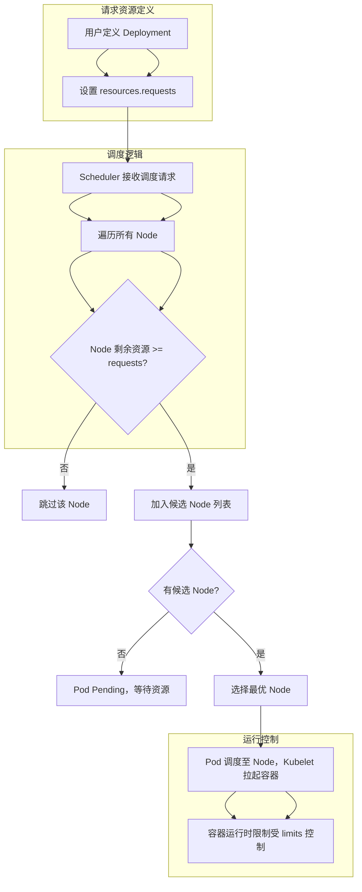
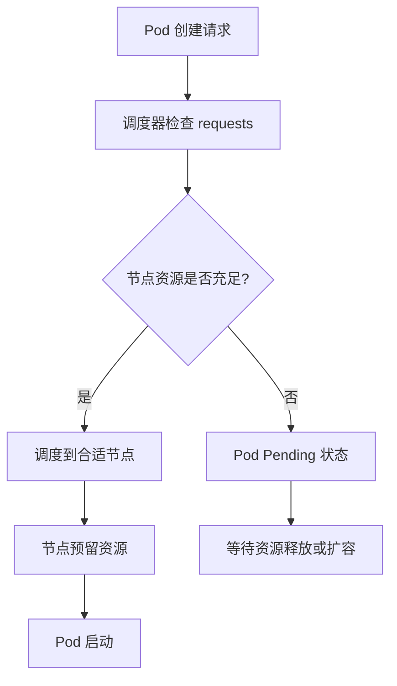
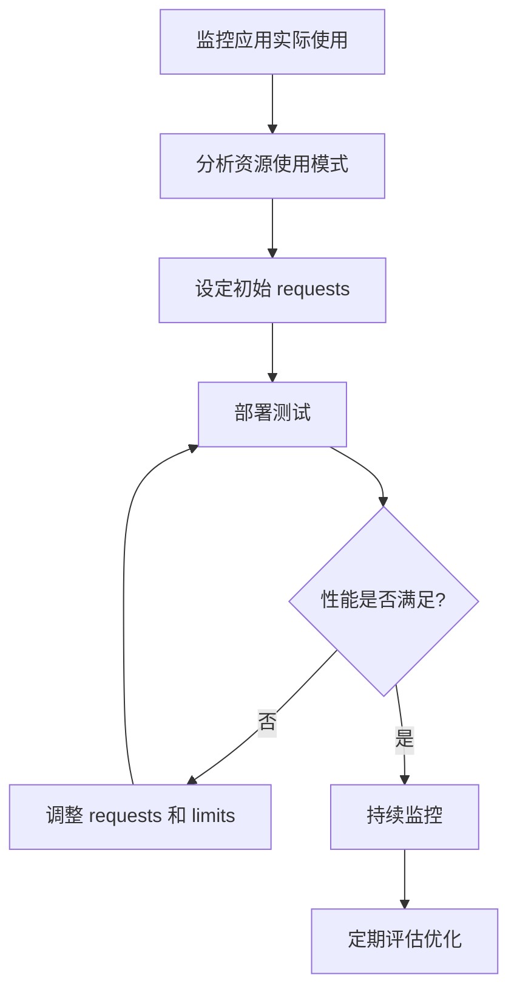

你的问题非常关键，在 Kubernetes 中合理设置 resources.requests 和 resources.limits 直接关系到 Pod 的 **调度成功率**、**稳定性** 和 **集群资源利用率**。

---

## **🧠 基本概念回顾**

|**项目**|**说明**|
|---|---|
|resources.requests|Pod **调度阶段** 所使用的资源请求，K8s scheduler 会根据它决定是否有资源来运行此 Pod。|
|resources.limits|Pod **运行时** 允许使用的最大资源量，超出后会触发限制（如 CPU 限速、内存 OOM）。|

---

## **🎯 你的场景：最低需要 4 CPU / 16Gi 内存的应用**

  

这类情况属于资源密集型的服务（例如大型 Java 服务、数据处理类服务等），我们可以分几种情况来考虑：

  

### **①** 

### **requests**

###  **设置过低（如 1 CPU / 2Gi）**

- **调度影响：** Pod 可被调度到较小节点，但一旦启动后可能资源不够，性能不稳定，可能频繁被 OOM Kill 或限速。
    
- **调度浪费：** 容易打乱整个集群的调度逻辑，影响其他服务。
    
- **适用场景：** 只在极短时间内占用大量资源的 Job，不建议用于长期运行的 Service。
    

  

### **②** 

### **requests**

###  **=** 

### **limits**

### **（即资源“保留”和“限制”相等）**

- **调度逻辑更准确：** Scheduler 明确知道 Pod 需要多少资源。
    
- **资源隔离强：** 可防止资源争抢。
    
- **推荐用于：** 核心服务、高可用组件、对性能敏感的微服务。
    

  

### **③** 

### **requests**

###  **<** 

### **limits**

### **（如 request: 2CPU / 8Gi，limit: 4CPU / 16Gi）**

- **资源利用率更高**：在节点有富余资源时可“突发使用”，更弹性。
    
- **调度要求降低**：更容易被调度。
    
- **但注意：** 超出 request 的资源不是 Guaranteed，只能是 BestEffort 或 Burstable QoS 类别。
    

---

## **✅ 最佳实践**

|**应用类型**|**requests 设定**|**limits 设定**|**说明**|
|---|---|---|---|
|**性能关键型服务**（如网关、DB代理）|与实际运行需求一致，如 4 CPU / 16Gi|与 requests 相同|保证稳定性，使用 QoS = Guaranteed|
|**中等负载服务**（如 API 服务）|稳态资源需求，如 2 CPU / 4Gi|峰值资源需求，如 4 CPU / 8Gi|兼顾调度与性能|
|**非关键 Job / 批处理任务**|较低（如 0.5 CPU / 1Gi）|上限如 2 CPU / 4Gi|允许突发，降低调度门槛|

---

## **🚦调度器行为与建议**

- Scheduler **只看 requests** 来判断当前节点是否有足够资源容纳 Pod。
    
- 如果你设定了 **requests 太大**，Pod 会因为找不到足够资源的节点而卡在 Pending。
    
- 你可以通过 **Pod Affinity / Taints / NodeSelector** 等配合使用，为资源充足的节点提供高优先级部署。
    

---

## **👇 示例 YAML 建议（对你提到的 4CPU / 16Gi 需求）**

```
resources:
  requests:
    cpu: "4"
    memory: "16Gi"
  limits:
    cpu: "4"
    memory: "16Gi"
```

或（如果你愿意弹性一些）：

```
resources:
  requests:
    cpu: "2"
    memory: "8Gi"
  limits:
    cpu: "4"
    memory: "16Gi"
```

---

## **🧾 总结建议**

|**建议项**|**说明**|
|---|---|
|requests 影响调度|scheduler 只考虑 requests，设置过小可能导致运行不稳定，设置过大则难调度。|
|limits 影响运行行为|设置 limits 可以防止单个 Pod 过度使用资源。|
|尽可能让 requests ≈ 实际最低需求|对关键服务建议 requests ≈ limits，QoS 变为 Guaranteed，避免 OOM 和限速问题。|
|考虑 Node 配置|如果你有固定的大节点（如 8CPU / 32Gi），可以大胆设置 requests 较高值。|

---

如需进一步排查你所在集群的资源可用性（如调度失败原因），可以使用如下命令：

```
kubectl describe pod <pod-name>  # 查看调度失败详情
kubectl get nodes -o json | jq '.items[].status.allocatable'  # 查看各节点可调度资源
```

需要我帮你画一个资源调度相关流程图吗？可以更形象地理解调度逻辑。
以下是一个基于你关注点的 **Kubernetes Pod 调度与资源请求流程图**，使用 Mermaid 表示：



---

## **🧠 图示说明**

- **resources.requests**：用于调度阶段判断是否有足够资源。
    
- **resources.limits**：用于运行阶段控制资源使用上限。
    
- **Pod 调度失败（Pending）** 常因为集群资源碎片不足以满足 request。
    
- **合理配置 requests** 非常关键，太小会导致运行时问题，太大调度困难。
    

---

如你需要更详细的调度失败排查、节点资源评估、或者 QoS 类别讲解，我可以继续扩展图和解释。需要的话告诉我。


# Claude
在 Kubernetes 中，`requests` 和 `limits` 对 Pod 的调度和运行有着重要影响。让我详细解释这些概念及最佳实践。

## Requests vs Limits 的作用

### Requests（请求资源）

- **调度依据**：Kubernetes 调度器使用 `requests` 来决定将 Pod 调度到哪个节点
- **资源预留**：节点会为 Pod 预留相应的资源
- **QoS 分类**：影响 Pod 的服务质量等级

### Limits（限制资源）

- **运行时限制**：Pod 运行时不能超过这个上限
- **资源隔离**：防止单个 Pod 消耗过多资源影响其他应用

## 调度影响分析



## 资源设置策略

### CPU 资源设置

```yaml
resources:
  requests:
    cpu: "500m"      # 启动时需要 0.5 CPU 核心
    memory: "1Gi"    # 启动时需要 1GB 内存
  limits:
    cpu: "2000m"     # 最大可使用 2 CPU 核心
    memory: "4Gi"    # 最大可使用 4GB 内存
```

### 针对你的场景（最终需求 4C/16G）

|场景类型|CPU Request|Memory Request|CPU Limit|Memory Limit|说明|
|---|---|---|---|---|---|
|保守型|2000m|8Gi|4000m|16Gi|预留较多资源，确保性能|
|平衡型|1000m|4Gi|4000m|16Gi|启动预留适中，允许突发|
|激进型|500m|2Gi|4000m|16Gi|最小预留，依赖弹性扩展|

## 最佳实践方案

### 1. 基于应用特性设置

```yaml
# CPU 密集型应用
resources:
  requests:
    cpu: "1000m"     # 预留 1 核心
    memory: "2Gi"    # 适中内存
  limits:
    cpu: "4000m"     # 允许使用 4 核心
    memory: "16Gi"   # 充足内存上限

# 内存密集型应用
resources:
  requests:
    cpu: "500m"      # 较少 CPU 预留
    memory: "8Gi"    # 预留较多内存
  limits:
    cpu: "2000m"     # 适中 CPU 上限
    memory: "16Gi"   # 大内存上限
```

### 2. 渐进式调优流程



### 3. 监控指标配置

```yaml
# 使用 HPA 基于 CPU/Memory 使用率扩缩容
apiVersion: autoscaling/v2
kind: HorizontalPodAutoscaler
metadata:
  name: app-hpa
spec:
  scaleTargetRef:
    apiVersion: apps/v1
    kind: Deployment
    name: your-app
  minReplicas: 2
  maxReplicas: 10
  metrics:
  - type: Resource
    resource:
      name: cpu
      target:
        type: Utilization
        averageUtilization: 70    # 基于 requests 的 70%
  - type: Resource
    resource:
      name: memory
      target:
        type: Utilization
        averageUtilization: 80    # 基于 requests 的 80%
```

## 推荐配置策略

### 启动阶段优化

- **Requests 设置为应用稳定运行的最小值**
- **通常设置为 limits 的 50-70%**
- **考虑应用启动时的资源峰值**

### 具体建议（针对 4C/16G 需求）

```yaml
# 推荐配置
resources:
  requests:
    cpu: "1500m"     # 1.5 核心，保证调度成功
    memory: "6Gi"    # 6GB，平衡预留和效率
  limits:
    cpu: "4000m"     # 4 核心，满足峰值需求
    memory: "16Gi"   # 16GB，满足内存需求
```

### 节点资源利用率考虑

|节点规格|推荐 Request 比例|说明|
|---|---|---|
|8C/32G|CPU: 70%, Memory: 80%|标准配置|
|16C/64G|CPU: 80%, Memory: 85%|高效利用|
|32C/128G|CPU: 85%, Memory: 90%|大规模部署|

通过合理设置 `requests`，你可以确保 Pod 能够成功调度，同时最大化集群资源利用率。关键是基于实际监控数据进行持续优化。