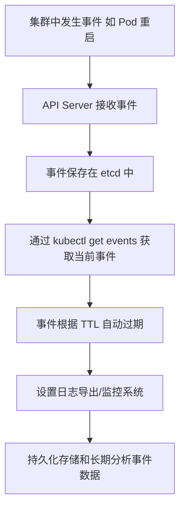

# Kubernetes 事件
深入了解 Kubernetes 事件以及在 GKE 中监控 Pod 重启的有效方法
1. 引言：理解 Kubernetes 事件以实现集群可观测性和故障排除
Kubernetes 事件为深入了解集群内部状态和活动提供了至关重要的信息，它们充当了与 Pod、节点和容器等资源相关的重大事件的日志 。这些事件对于监控应用程序和集群的健康状况、响应故障以及执行诊断至关重要 。事件捕获生命周期变化、配置更新和调度活动 。
虽然 Kubernetes 日志跟踪应用程序和系统的行为，但事件提供了一种独特的、结构化的方式来理解集群控制平面内的状态转换和重大事件。
2. 深入分析 kubectl get event
kubectl get events 命令是显示 Kubernetes 集群中事件的主要工具 。运行不带任何参数的 kubectl get events 将列出当前命名空间中最近发生的事件 。要列出所有命名空间中的事件，可以使用 --all-namespaces 或 -A 标志 。
标准的输出包括诸如 LAST SEEN（自上次记录事件以来经过的时间）、TYPE（事件的类型，例如 Normal、Warning、Error）、REASON（对事件的简要描述）、OBJECT（与事件相关的资源）和 MESSAGE（事件的详细描述）等字段 。使用 -o wide 标志会添加 SUBOBJECT（与事件关联的 Kubernetes 对象的特定部分）、SOURCE（触发事件的源）、FIRST SEEN（首次观察到事件的时间戳）、COUNT（自首次观察到事件以来事件发生的次数）和 NAME（Kubernetes 对象的名称）等附加信息 。
kubectl get event 提供了强大的过滤选项，以帮助用户缩小他们感兴趣的事件范围：
    * --namespace 或 -n 标志允许用户将事件过滤到特定的命名空间 。
    * --field-selector 标志使用户能够基于特定的事件字段进行过滤，支持 =、== 和 != 等运算符 。例如，--field-selector type=Warning 将仅显示类型为 Warning 的事件，而 --field-selector involvedObject.kind=pod,involvedObject.name=myPod 将仅显示与名为 myPod 的 Pod 相关的事件，--field-selector involvedObject.kind!=Node 将排除 Kubernetes 节点相关的事件 。事件支持的字段包括 involvedObject.kind、involvedObject.namespace、involvedObject.name、involvedObject.uid、involvedObject.apiVersion、involvedObject.resourceVersion、involvedObject.fieldPath、reason、reportingComponent、source 和 type 。
    * --for 标志用于过滤与特定资源（例如，pod/mypod 或 deployment/mydeploy）相关的事件 。
    * --types 标志允许用户按类型过滤事件，例如仅显示 Normal 和 Warning 类型的事件 。
   除了过滤之外，kubectl get event 还支持对输出进行排序，可以使用 --sort-by=.metadata.creationTimestamp 按创建时间戳或使用 --sort-by=.lastTimestamp 按上次看到的时间戳进行排序 。用户还可以使用 -o custom-columns=<custom_column_name>:<expression> 自定义输出列 。为了进行程序化处理，输出可以格式化为 YAML (-o yaml) 或 JSON (-o json) 。
   尽管 kubectl get event 对于查看集群的实时或近实时状态非常有用，但对于历史分析存在局限性。默认情况下，Kubernetes 事件的生存时间 (TTL) 仅为一小时 。这意味着 kubectl get events 仅显示在此时间窗口内发生的最近事件。
   用户在检索事件信息时遇到的不一致性可能源于这一小时的默认保留策略。如果 Pod 重启发生在超过一小时之前，那么使用标准的 kubectl get events 命令将无法看到该事件。此外，事件的聚合意味着虽然用户可以看到在 TTL 内发生的重启总数，但会丢失每个单独重启事件的精确时间线。因此，kubectl get events 虽然提供了对当前状态的快速概览，但不足以分析长期趋势或了解更长时间段内重启的频率和上下文。历史分析需要持久化存储解决方案。
1. Kubernetes 事件：生命周期和保留
Kubernetes 事件由调度器、kubelet 和控制器等各种组件响应状态变化、配置更改和调度活动而生成 。这些事件临时存储在 etcd 中，etcd 是 Kubernetes 的分布式键值存储 。
事件的默认生存时间 (TTL) 为一小时，由 kube-apiserver 的 --event-ttl 标志控制 。在此时间段之后，事件将自动删除，以防止 etcd 过载 。
事件的可用性主要受这一小时 TTL 的影响。超过此时限发生的事件将无法通过标准的 kubectl 命令查看。虽然可以配置 TTL ，但显着增加 TTL 可能会影响 etcd 的性能 。Kubernetes 还会聚合类似的事件，更新 lastSeen 时间戳和 count，而不是存储每个单独的事件发生 。
1. Google Kubernetes Engine (GKE) 上的 Kubernetes 事件
与标准的 Kubernetes 类似，GKE 很可能遵循默认的一小时事件保留策略。用户可以在 GKE 的官方文档中找到对此的明确验证。
GKE 默认收集 Kubernetes 事件并将它们发送到 Google Cloud Logging（以前称为 Stackdriver）。这通常通过 kube-system 命名空间中的 event-exporter 部署来完成 。
GKE 本身在一小时后删除集群事件 。但是，导出到 Cloud Logging 的事件存储在具有可配置保留策略的持久性数据存储中 。
可以在 Cloud Logging 中通过过滤 Events 日志或使用与 Kubernetes 资源相关的特定查询来找到事件 。Cloud Logging 提供的保留期比集群内事件的默认一小时要长 。
虽然 GKE 中集群内事件的 TTL 为标准的一小时，但自动导出到 Cloud Logging 提供了一种更可靠的方式来跟踪具有更长保留期的 Pod 重启。然而，GKE 中的 event-exporter 以尽力而为的方式运行，这意味着不能保证所有事件都会被捕获并导出到 Cloud Logging，尤其是在资源争用或升级期间 。
1. 在 Kubernetes 和 GKE 中监控 Pod 重启的可靠方法
可以使用 kubectl describe pod <pod-name> 命令查看特定 Pod 的详细信息，包括最近发生的事件以及“容器状态”下的“重启计数”。这对于检查 Pod 的即时历史记录非常有用。
Kubernetes 通过 Metrics Server 和 Prometheus 公开指标，这些指标可以跟踪容器重启的总次数 。在 GKE 中，这些指标可在 Cloud Monitoring 中找到 。指标名称通常为 kubernetes.io/container/restart_count 。
GKE Cloud Monitoring 提供仪表板、警报功能以及基于 Kubernetes 数据（包括容器重启计数）创建自定义指标的功能 。用户可以设置警报，以便在 Pod 在特定时间段内重启次数过多时触发通知 。
kubectl get pods 命令显示 STATUS 和 RESTARTS 列，可以指示 Pod 是否正在重启（例如，CrashLoopBackOff 状态）。Pod 的状况（可以使用 kubectl get pod <pod-name> -o yaml | grep conditions 查看）例如 Ready 也可以提供有价值的见解。
仅仅依赖 kubectl get events 不足以全面监控 Pod 重启。将其与 kubectl describe pod、Cloud Monitoring 中的 Kubernetes 指标以及 Pod 状态分析相结合，可以提供更可靠的方法。GKE Cloud Monitoring 由于其持久化存储、警报功能以及与 Kubernetes 指标的集成，是可靠跟踪 Pod 重启的推荐方法。
1. 诊断 Pod 重启背后的原因
Pod 在其生命周期中经历各种阶段：Pending、Running、Succeeded、Failed 和 Unknown 。当 Pod 进入 Failed 状态或未变为 Ready 状态时，通常会发生重启。
CrashLoopBackOff 是一种常见状态，表明 Pod 中的容器正在反复崩溃和重启 。常见原因包括资源限制（内存、CPU）、镜像相关问题（拉取错误、镜像不正确）、配置错误（拼写错误、不正确的资源请求/限制、缺少依赖项）、外部服务问题（网络问题、数据库不可用）、未捕获的应用程序异常以及配置错误的活性探测 。其他原因包括 ImagePullBackOff（无法拉取容器镜像）、Evicted（节点资源压力）、FailedMount/FailedAttachVolume（存储问题）、FailedScheduling（没有合适的节点）、NodeNotReady 和 HostPortConflict 。
检查 Pod 的事件（kubectl get events --field-selector involvedObject.name=<pod-name>）和容器日志（kubectl logs <pod-name> -c <container-name> 或 kubectl logs --previous <pod-name> -c <container-name>）对于诊断重启原因至关重要 。kubectl describe pod 命令的输出还包括最近的事件和容器状态的详细信息，包括退出代码 。
事件输出中的 REASON 字段是理解 Pod 为何重启的一个很好的起点（例如，CrashLoopBackOff、OOMKilled）。活性和就绪探测在 Pod 重启中起着重要作用。这些探测中的故障可能导致根据 Pod 的 restartPolicy 杀死并重启容器 。检查探测定义及其成功/失败对于故障排除至关重要。
1. Kubernetes 事件的持久化存储解决方案
Event Router 是一种工具，用于监视 Kubernetes 事件并将它们转发到用户指定的接收器（例如，Elasticsearch、Kafka、Cloud Logging），以进行长期存储和分析 。它需要在集群中手动部署 。
除了 Event Router 之外，还可以使用其他事件导出工具，例如 kubernetes-event-exporter、Kubewatch 和 Sloop 来导出和监视 Kubernetes 事件 。
这些工具可以与流行的日志记录和监控系统（如 Elasticsearch、Grafana Loki、Datadog 等）集成，从而提供用于事件分析和警报的集中式平台 。
对于需要超出 Cloud Logging 保留期的 Pod 重启历史分析的用户，需要部署 Event Router 或类似的事件导出工具。事件导出工具的选择取决于具体需求，例如所需的存储和分析后端，以及设置和维护的简易性。不同的工具提供不同的功能和集成 。根据用户的现有基础架构和需求评估这些工具至关重要。
1. 利用 GKE Cloud Logging 和审计日志进行 Pod 重启分析
GKE 导出的 Kubernetes 事件可以在 Cloud Logging 的 Logs Explorer 中查看，方法是过滤 Events 日志名称或使用 Kubernetes 资源过滤器（例如，集群名称、命名空间、Pod 名称）。
Cloud Logging 的查询语言允许基于类型（Warning、Error）、原因（CrashLoopBackOff、ImagePullBackOff）、相关对象和消息内容过滤事件 。可以在 GKE 文档和社区论坛中找到 Pod 重启的查询示例 。
Kubernetes 审计日志记录对 Kubernetes API 服务器的所有请求，提供活动的按时间顺序记录 。它们捕获诸如谁发起了操作、何时以及对哪个资源等详细信息 。
虽然事件专门针对发生的事件，但审计日志跟踪导致这些事件的 API 交互。通过分析审计日志，用户可以看到谁或什么发起了导致 Pod 重启的操作（例如，部署更新、扩容操作）。GKE 审计日志可在 Cloud Logging 中找到 。
Cloud Logging 是在 GKE 中分析 Kubernetes 事件和审计日志的主要场所，为 Pod 重启故障排除提供了统一的视图。审计日志通过显示 Pod 状态更改背后的“谁”和“为什么”，补充了事件的“什么”和“何时”，从而提供了宝贵的上下文信息。这对于理解 Pod 重启的更广泛背景至关重要。
1. 监控 GKE 上 Pod 重启的最佳实践和建议
 * 结合不同的监控方法：使用 kubectl get events 进行实时检查，使用 kubectl describe pod 查看即时历史记录，使用 Cloud Monitoring 查看长期趋势和警报，并考虑使用持久化事件存储进行深入的历史分析。
 * 在 Cloud Monitoring 中为 Pod 重启设置有效的警报（基于 restart_count 指标或特定的事件模式，如 CrashLoopBackOff），以便主动接收问题通知。
 * 如果需要将事件数据保留超过 Cloud Logging 的保留策略以进行合规性或深入的历史分析，请配置持久化事件存储（使用 Event Router 或其他工具）。
 * 定期查看日志（Cloud Logging 中的应用程序日志和 Kubernetes 组件日志）和 Cloud Monitoring 中的指标，以识别模式和 Pod 重启的潜在根本原因。
 * 密切关注活性和就绪探测的配置，因为配置错误可能导致不必要的 Pod 重启。
 * 监控 Cloud Monitoring 中 Pod 和节点级别的资源利用率（CPU、内存），因为资源耗尽是 Pod 重启的常见原因。
 * 考虑在 GKE 中启用 Kubernetes 审计日志，以更深入地了解导致 Pod 状态更改的 API 交互。
2.  结论：确保在 GKE 上可靠地监控和分析 Pod 重启
监控 Pod 重启对于确保 Kubernetes 集群的稳定性和应用程序的可用性至关重要。虽然 kubectl get event 命令提供了一种快速查看集群中最近事件的方式，但其一小时的默认保留策略限制了其在长期分析和故障排除方面的有效性。
为了可靠地监控 GKE 上的 Pod 重启，建议结合使用多种方法。kubectl describe pod 可以提供 Pod 的即时历史记录，包括重启计数和最近的事件。Kubernetes 指标（可在 GKE Cloud Monitoring 中找到）允许用户跟踪容器重启的总次数并设置警报。分析 Pod 状态和状况也可以提供有价值的见解。
对于需要超出默认保留期的历史分析，应考虑使用 Event Router 或 kubernetes-event-exporter 等持久化事件存储解决方案。这些工具可以将 Kubernetes 事件转发到 Cloud Logging 或 Elasticsearch 等后端进行长期存储和分析。
GKE Cloud Logging 是分析 Kubernetes 事件和审计日志的主要平台。通过使用 Cloud Logging 的查询语言，用户可以过滤和分析与 Pod 重启相关的特定事件。此外，启用 Kubernetes 审计日志可以提供有关导致 Pod 状态更改的 API 交互的宝贵上下文信息。
通过遵循这些最佳实践并利用 GKE 提供的工具，用户可以建立一个强大的 Pod 重启监控和分析策略，从而提高集群的稳定性并确保应用程序的高可用性。
关键表格
表格 1：kubectl get event 输出字段

| 字段名称   | 描述                                                             |
| ---------- | ---------------------------------------------------------------- |
| LAST SEEN  | 自上次记录事件以来经过的时间                                     |
| TYPE       | 事件的类型（Normal、Warning、Error）                             |
| REASON     | 对事件的简要描述                                                 |
| OBJECT     | 与事件相关的 Kubernetes 对象                                     |
| MESSAGE    | 事件的详细描述                                                   |
| SUBOBJECT  | 与事件关联的 Kubernetes 对象的特定部分（例如，容器名称、卷名称） |
| SOURCE     | 触发事件的组件（例如，kubelet、default-scheduler）               |
| FIRST SEEN | 首次观察到事件的时间戳                                           |
| COUNT      | 自首次观察到事件以来事件发生的次数                               |
| NAME       | Kubernetes 对象的名称（例如，Pod 名称、节点名称）                |


表格 2：常见的 Kubernetes Pod 重启原因及其潜在原因

| 重启原因                         | 潜在原因                                                                                                                                                                                                          |
| -------------------------------- | ----------------------------------------------------------------------------------------------------------------------------------------------------------------------------------------------------------------- |
| CrashLoopBackOff                 | 应用程序错误导致进程崩溃、无法连接到第三方服务或依赖项、尝试分配不可用的资源（例如，已使用的端口、过多的内存）、活性探测失败、资源限制不足（内存、CPU）、镜像拉取错误、配置错误、缺少依赖项、未捕获的应用程序异常 |
| ImagePullBackOff                 | 无法从镜像仓库拉取容器镜像、镜像名称或标签不正确、镜像仓库凭据无效、网络连接问题                                                                                                                                  |
| OOMKilled                        | 容器使用的内存超过其配置的限制、节点内存不足                                                                                                                                                                      |
| Evicted                          | 节点资源压力（例如，内存、磁盘空间、PID）、节点维护                                                                                                                                                               |
| FailedMount / FailedAttachVolume | 无法挂载或附加持久卷、卷已在使用中、存储配置错误                                                                                                                                                                  |
| FailedScheduling                 | 没有满足 Pod 资源需求或节点选择器/亲和性要求的可用节点、节点污点                                                                                                                                                  |
| NodeNotReady                     | 底层节点出现问题、Kubelet 未运行、网络问题                                                                                                                                                                        |
| HostPortConflict                 | 多个 Pod 尝试使用同一节点上的同一端口                                                                                                                                                                             |

表格 3：Kubernetes 事件持久化存储解决方案

| 工具名称                  | 描述和主要功能                                                                           | 集成选项                                                            |
| ------------------------- | ---------------------------------------------------------------------------------------- | ------------------------------------------------------------------- |
| Event Router              | 监视 Kubernetes 事件并将它们转发到各种接收器，以实现长期存储和分析。支持多种接收器类型。 | Elasticsearch、Kafka、Google Cloud Logging、Splunk、Syslog、Webhook |
| kubernetes-event-exporter | 将 Kubernetes 事件导出到各种输出，用于可观测性和警报。易于部署和配置。                   | Prometheus、Dynatrace、Elasticsearch、InfluxDB、Webhook             |
| Kubewatch                 | Kubernetes 事件监视工具，跟踪 Kubernetes 资源的所有更改。支持各种通知方式。              | Slack、Hipchat、Webhook、Flock、SMTP                                |
| Sloop                     | 监视 Kubernetes，记录事件和资源状态更改的历史记录，并提供可视化以帮助调试过去的事件。    | 本地存储，提供 Web UI 进行可视化                                    |


Kubernetes Event 监听:

Kubernetes Deployment 的 replicas 修改会触发 Kubernetes Events。
你可以部署一个程序（例如自定义 operator 或 sidecar 容器）监听这些事件。
该程序需要知道哪些 namespace/Deployment 是需要监控的。这可以通过配置或标签实现。
当检测到 replicas 数量的修改事件时，记录事件发生的时间和新的 replicas 值


# Chatgtp 
在 Kubernetes（包括 GKE）中，事件（Event）是一种短暂对象，用于记录集群中发生的操作或错误。下面是一些关键点和可行的方案来帮助你更好地捕获和分析 pod 重启等事件信息：

### 1. 事件的保留时间和垃圾回收

- **短暂性设计**  
  事件对象默认具有较短的生命周期，通常会在创建后几分钟到一小时内过期。Kubernetes 从 v1.19 起引入了事件 TTL（默认 1 小时左右），这意味着一段时间后，事件就会被垃圾回收，不再通过 `kubectl get events` 命令显示。

- **GKE 特性**  
  GKE 在后台管理集群时也遵循 Kubernetes 的事件过期策略，所以你可能会发现关心的 pod 重启等事件在一段时间后就看不到了。

### 2. 获取 Pod 重启和其他关键信息的办法

- **kubectl describe pod**  
  通过 `kubectl describe pod <pod-name>` 命令，你可以直接查看 Pod 的状态，其中包括重启次数（Restart Count）和容器的状态详情。这样可以帮助你了解重启发生的频率和原因。

- **kubectl get events 配合筛选**  
  使用如下命令，可以按照时间排序，尽可能捕获最新的事件信息：
  ```bash
  kubectl get events --all-namespaces --sort-by=.metadata.creationTimestamp
  ```
  但需要注意，时间较长的事件仍然可能被清理。

- **监控和日志收集方案**  
  为了长期存储和分析事件，建议：
  - **集成 Cloud Logging**：GKE 支持将事件日志发送到 Google Cloud Logging（Stackdriver），这样可以在日志平台上保存更长时间，便于后续查询和分析。
  - **事件导出器（Event Exporter）**：可以部署类似 [kube-eventer](https://github.com/opsgenie/kube-eventer) 的工具，将事件持久化到外部存储系统（如 Elasticsearch、InfluxDB 等）。
  - **Prometheus 监控**：利用 kube-state-metrics 收集集群状态信息，通过 Prometheus 进行监控和报警设置，实时监控 pod 的状态变化。

### 3. 建议的工作流程

下面的流程图描述了如何捕获并分析事件信息，同时保证长期存储与监控的步骤：



### 4. 实际操作示例

- **查看当前所有事件**  
  ```bash
  kubectl get events --all-namespaces --sort-by=.metadata.creationTimestamp
  ```

- **查看指定 Pod 的详细状态**  
  ```bash
  kubectl describe pod <pod-name>
  ```

- **示例：配置 Cloud Logging**  
  在 GKE 中，你可以参考官方文档配置 Cloud Logging 来捕获 Kubernetes 事件，这样即使事件在 API Server 中过期，你也能在 Cloud Logging 中查询到历史数据。

### 总结

- **事件短暂性**：默认保留时间较短（约 1 小时），这可能导致你在进行分析时无法获取全部信息。  
- **建议**：结合 `kubectl describe pod` 命令、日志收集工具以及事件导出方案，确保你能长期保存和分析关键事件数据（如 Pod 重启信息）。

通过上述方法，你可以更有效地捕获和分析 Kubernetes 集群中的事件，从而对 Pod 重启等问题进行详细排查和分析。

# deepseek 
在 Kubernetes（特别是 GKE）中，`kubectl get events` 是用于查看集群事件的重要命令，但事件默认的保留时间和机制可能导致你无法获取历史信息。以下是详细解释和针对 Pod 重启事件分析的可行方案：

---

### 一、Kubernetes 事件的特性
1. **事件保留时间**：
   - Kubernetes 默认将事件存储在 etcd 中，但 **默认仅保留 1 小时**（可通过 `--event-ttl` 参数调整，但在 GKE 托管集群中此参数由 Google 管理，用户无法直接修改）。
   - GKE 不会长期存储事件，旧事件会被自动清理。

2. **事件内容**：
   - 事件记录了资源状态变化（如 Pod 调度失败、镜像拉取错误、健康检查失败等）。
   - Pod 重启会生成 `Started`、`Killing`、`BackOff` 等类型的事件。

---

### 二、直接获取 Pod 重启事件的方法

#### 方法 1：实时监控事件
```bash
# 实时监控所有命名空间的事件
kubectl get events --all-namespaces --watch

# 过滤特定 Pod 的事件（按对象名称）
kubectl get events --field-selector involvedObject.name=<POD_NAME>

# 过滤 Pod 重启相关事件（按原因）
kubectl get events --field-selector reason="BackOff",reason="Started"
```

#### 方法 2：查看 Pod 的详细状态
```bash
# 查看 Pod 的详细状态（包括最近事件）
kubectl describe pod <POD_NAME>
```
输出中会包含 `Events` 部分，显示该 Pod 的生命周期事件。

---

### 三、长期存储和分析事件的方案（GKE 专属）

#### 方案 1：使用 **Cloud Logging (旧称 Stackdriver)**
- **原理**：GKE 默认会将集群事件发送到 Cloud Logging。
- **操作步骤**：
  1. 在 GCP 控制台进入 **Cloud Logging**。
  2. 使用以下查询过滤事件：
     ```sql
     resource.type="k8s_clusters"
     jsonPayload.kind="Event"
     jsonPayload.involvedObject.name="<POD_NAME>"
     ```
  3. 可设置日志保存周期（默认 30 天，可延长至更长）。
- **优点**：无需额外配置，自动集成。

#### 方案 2：部署 **Event Exporter**
将事件导出到 BigQuery、Pub/Sub 或 Elasticsearch 长期存储：
```yaml
# 示例：部署 Event Exporter 到 GKE
apiVersion: apps/v1
kind: Deployment
metadata:
  name: event-exporter
spec:
  template:
    spec:
      containers:
      - name: event-exporter
        image: ghcr.io/resmo/kubernetes-event-exporter:latest
        env:
        - name: CONFIG
          value: |
            logLevel: info
            route:
              routes:
                - match:
                    - receiver: "console"
            receivers:
              - name: "console"
                stdout: {}
```
- **配置输出**：修改 `CONFIG` 将事件发送到 Cloud Logging 或其他存储。

---

### 四、高级调试技巧

#### 1. 分析 Pod 重启原因
```bash
# 查看 Pod 的重启次数
kubectl get pod <POD_NAME> -o jsonpath='{.status.containerStatuses[0].restartCount}'

# 查看容器退出前的日志
kubectl logs <POD_NAME> --previous
```

#### 2. Prometheus + AlertManager
- 通过监控 `kube_pod_container_status_restarts_total` 指标设置告警：
  ```yaml
  # 示例告警规则
  - alert: PodRestartFrequently
    expr: increase(kube_pod_container_status_restarts_total[5m]) > 3
    for: 1m
    labels:
      severity: warning
    annotations:
      summary: "Pod {{ $labels.pod }} 频繁重启"
  ```

---

### 五、总结建议
1. **实时调试**：使用 `kubectl get events --watch` 和 `kubectl describe pod` 快速定位问题。
2. **长期分析**：通过 **Cloud Logging** 或 **Event Exporter** 存储事件日志。
3. **预防措施**：配置 Prometheus 告警监控 Pod 重启频率。

通过上述方法，你可以有效捕获和分析 GKE 中 Pod 重启等关键事件。

通过 Kubernetes Event 监听实现 `replicas` 数量修改检测，可以构建一个高效的实时监控系统。这种方法利用 Kubernetes 内部事件流，能够及时捕获和处理 Deployment 副本数修改事件。


# Q 
我的用户如果是重新Deployment这个API,但其实不仅仅是一个Event的Replicas的调整了.这种监控看起来就有局限性?


# A 
你说得对，如果用户重新 `Deploy` API（例如，通过修改 Deployment 的其他配置，然后触发重建），那么仅仅监听 `replicas` 字段的修改事件确实存在局限性。因为在这种情况下，可能会触发多个事件，而不仅仅是 `replicas` 变化事件。

**问题分析**

1.  **多种事件:**  重新 `Deploy` 一个 API 可能会触发以下事件：
    *   `MODIFIED` 事件 (当 Deployment 配置修改时)
    *   `DELETED` 事件 (当旧的 Pod 被删除时)
    *   `ADDED` 事件 (当新的 Pod 被创建时)
    *   `MODIFIED` 事件 (当 Pod 的状态发生变化时)
    *   **不仅仅是 `replicas` 的变化:**  用户可能还会修改其他配置，如 `image`, `resources`, `environment variables`, `volumes` 等。

2.  **监听粒度:**  如果只关注 `replicas` 的修改，可能会忽略其他重要的配置变化。

3.  **监控目标:**  你的监控目标可能不仅仅是 `replicas`，而是任何可能影响 API 运行的配置变化。

**更全面的监控策略**

为了解决这个问题，我们需要采用更全面的监控策略：

1.  **监听 Deployment 的所有修改事件:**
    *   不只关注 `replicas`，而是关注 Deployment 的所有 `MODIFIED` 事件。
    *   从 `MODIFIED` 事件的 `object` 中获取整个 Deployment 的配置。
    *   比较前后两个版本 Deployment 的配置，找出所有发生变化的字段。

2.  **检查配置项:**
    *   当检测到配置变化时，你需要检查哪些配置项发生了变化。
    *   你可以定义一个需要监控的配置列表。 例如： `replicas`, `image`, `resources.limits`, `resources.requests`, `environment`, `volumes` 等。
    *   针对不同的配置项，执行不同的逻辑。例如：`replicas` 变化，更新Prometheus指标，`image` 变化，通知用户。
    *   你需要对比新旧两个 Deployment 配置，找出所有差异。

3.  **数据存储:**
     *   除了存储 `desired_replicas`，还要存储其他你关心的配置信息， 例如新的 `image`， 新的`resource` 等等。
     *   这样可以更全面的分析用户的行为，也方便后续的审计。
     *   可以在 BigQuery 每日任务中，存储Deployment的配置信息和事件的时间戳

4. **区分事件类型:**

    *  将事件类型加入到Prometheus指标，可以区分不同的事件，然后针对性的设置告警
    * `deployment_events_total{type="MODIFIED", namespace="...", deployment="...",field="replicas"}`
    * `deployment_events_total{type="MODIFIED", namespace="...", deployment="...",field="image"}`
    * `deployment_events_total{type="DELETED", namespace="...", deployment="..."}`
     
5.  **结合 Kubernetes API 获取 Deployment 状态**
    *  如果需要获取Pod最新的运行状态，可以结合 Kubernetes API 实时查询 Deployment 的运行状态， 例如， `available_replicas`,  `updated_replicas` 等。
    *  将这些信息同步到 Prometheus指标。

**代码示例 (修改后的 Python Event Listener)**

```python
from kubernetes import client, config, watch
from prometheus_client import Gauge, start_http_server, Counter
import time
import jsonpatch
import json


config.load_inclusters_config()
v1 = client.AppsV1Api()

# Prometheus Metrics
deployment_events_total = Counter('deployment_events_total', 'Deployment events', ['type', 'namespace', 'deployment', 'field'])
deployment_replicas_desired = Gauge('deployment_replicas_desired', 'Desired replicas of deployment', ['namespace','deployment'])
deployment_replicas_actual = Gauge('deployment_replicas_actual', 'Actual replicas of deployment', ['namespace','deployment'])
deployment_replicas_max = Gauge('deployment_replicas_max', 'Maximum replicas of deployment', ['namespace','deployment'])

start_http_server(8000)


def get_max_replicas_from_firestore(namespace, deployment_name):
    # 实际的从 Firestore/BigQuery 获取最大replicas的逻辑
    return 8


def watch_deployments():
    w = watch.Watch()
    for event in w.stream(v1.list_deployment_for_all_namespaces):
        deployment = event['object']
        namespace = deployment.metadata.namespace
        deployment_name = deployment.metadata.name
        event_type = event['type']


        if event_type == 'MODIFIED':
            # 获取 Deployment 的当前版本
            old_deployment = v1.read_namespaced_deployment(name=deployment_name, namespace=namespace)
            
            #获取Deployment更新之后的版本
            new_deployment = event['object']
            
            # 获取 Deployment配置变化
            old_deployment_json = json.loads(json.dumps(old_deployment.to_dict()))
            new_deployment_json = json.loads(json.dumps(new_deployment.to_dict()))
            patch = jsonpatch.JsonPatch.from_diff(old_deployment_json, new_deployment_json)

            for change in patch:
               path = change.get("path", "unknown").split("/")
               field = path[1]
               deployment_events_total.labels(type=event_type, namespace=namespace, deployment=deployment_name,field=field).inc()
               print(f"Deployment {namespace}/{deployment_name} modified, field {field}")

            # 处理 replicas 的变化
            desired_replicas = new_deployment.spec.replicas
            if desired_replicas:
                max_replicas = get_max_replicas_from_firestore(namespace, deployment_name)
                deployment_replicas_desired.labels(namespace=namespace, deployment=deployment_name).set(desired_replicas)
                deployment_replicas_max.labels(namespace=namespace, deployment=deployment_name).set(max_replicas)
                
                actual_replicas = new_deployment.status.available_replicas
                deployment_replicas_actual.labels(namespace=namespace, deployment=deployment_name).set(actual_replicas if actual_replicas is not None else 0)

        elif event_type == 'DELETED':
             deployment_events_total.labels(type=event_type, namespace=namespace, deployment=deployment_name,field="deployment").inc()
             print(f"Deployment {namespace}/{deployment_name} deleted")
        
        elif event_type == 'ADDED':
            deployment_events_total.labels(type=event_type, namespace=namespace, deployment=deployment_name,field="deployment").inc()
            print(f"Deployment {namespace}/{deployment_name} added")


if __name__ == '__main__':
    watch_deployments()
```

**改进说明:**

1.  **完整配置比较：** 使用 `jsonpatch` 库来比较 Deployment 配置的差异。
2. **事件计数器:** 使用 `Counter` 来记录不同类型的事件.
3. **更灵活的监控：**  你可以根据你的需求，修改 `watch_deployments()` 函数，以支持更多的监控逻辑。

**总结**

*   监听 Deployment 的所有修改事件可以更全面地监控用户的配置变化。
*   比较前后两个版本的配置可以找出哪些字段发生了变化。
*   你可以将变化的字段作为Prometheus指标的标签，方便你进行更细粒度的监控和告警。
*  记录各种类型的事件，便于你后续的分析和审计。

通过这种方式，你可以更全面地监控用户对 API 的修改，并及时发现可能影响 API 运行的问题。希望这个解释能够解决你的疑虑！


好的，我们来详细阐述一下 Kubernetes Event 监听部分，以及如何实现它。

**Kubernetes Events 的概念**

Kubernetes Events 是 Kubernetes 集群中发生的各种事件的记录。它们提供了关于集群状态变化的可见性，例如 Pod 的创建、删除、更新、错误等等。对于 Deployment 而言，其 `replicas` 字段的修改也会产生一个事件。

**为什么使用 Kubernetes Events？**

*   **实时性:** Kubernetes Events 是近实时产生的，你可以立即感知到集群状态的变化。
*   **细粒度:** 你可以监听特定类型的事件，例如 Deployment 的 `replicas` 修改事件。
*   **可观测性:** Kubernetes Events 为你的集群操作提供了重要的可观测性数据。

**如何监听 Kubernetes Events？**

主要有两种方式：

1.  **使用 Kubernetes API 客户端库**
    *   你可以使用 Kubernetes 官方提供的 API 客户端库（如 Python, Go, Java 等）来连接到 Kubernetes API Server。
    *   客户端库提供了 `watch` 功能，允许你监听特定类型的事件，并以流式方式接收更新。

2.  **使用 Kubernetes Event 导出器**
    *   有些工具（如 `kube-eventer`）专门用来收集 Kubernetes Events，并将它们导出到各种后端系统（如 Prometheus, Elasticsearch 等）。
    *   你可以使用这些工具来简化 Event 监听过程。

**使用 Kubernetes API 客户端库监听事件的步骤**

1.  **设置 Kubernetes 客户端**

    *   在你的程序中引入 Kubernetes API 客户端库。
    *   使用 `config.load_inclusters_config()` 或 `config.load_kube_config()` 方法加载 Kubernetes 集群的配置。

    ```python
    from kubernetes import client, config

    # 如果在集群内部运行
    config.load_inclusters_config()

    # 如果在集群外部运行，使用 kubeconfig 文件
    # config.load_kube_config(config_file="~/.kube/config")

    v1 = client.AppsV1Api()
    ```

2.  **创建 Watch 对象**

    *   使用 `watch.Watch()` 创建一个 Watch 对象。
    *   你可以使用该对象来监听特定类型的 Kubernetes 资源。

    ```python
    from kubernetes import watch
    w = watch.Watch()
    ```

3.  **监听 Deployment 事件**

    *   使用 Watch 对象的 `stream` 方法，配合 `v1.list_deployment_for_all_namespaces` 方法，监听所有 namespace 中的 Deployment 事件。
    *   你还可以使用 `list_namespaced_deployment` 方法监听特定 namespace 中的 Deployment 事件。

    ```python
    for event in w.stream(v1.list_deployment_for_all_namespaces):
    ```

4.  **处理事件**

    *   在循环中，每个事件都将作为一个字典返回，包含 `type`（事件类型）和 `object` (事件对象，这里是 Deployment 对象)。
    *   你可以根据 `type` 字段判断事件类型（例如 `ADDED`, `MODIFIED`, `DELETED`），然后从 `object` 对象中获取 Deployment 的信息。
    *   对于 `MODIFIED` 事件，可以从 Deployment 对象中获取新的 `replicas` 值。

    ```python
    if event['type'] == 'MODIFIED':
        deployment = event['object']
        namespace = deployment.metadata.namespace
        deployment_name = deployment.metadata.name
        desired_replicas = deployment.spec.replicas
        # ... 获取其他信息并进行处理 ...
    ```

5.  **配置过滤和标签选择器**
    *   如果你只想监听特定的 namespace 或 Deployment，你可以使用 `list_namespaced_deployment` 方法，并设置 `namespace` 参数。
    *   如果你想监听特定标签的 Deployment，可以使用 `label_selector` 参数。
    *   使用标签选择器可以减少需要处理的事件数量，从而减少资源的消耗。
    ```python
    # 监听特定namespace的deployment
    #  for event in w.stream(v1.list_namespaced_deployment, namespace="my-namespace")
    # 监听特定label的deployment
    # for event in w.stream(v1.list_deployment_for_all_namespaces, label_selector="app=my-app")
    ```

6.  **获取最大值**

    *   当收到 Deployment 的修改事件时，需要从 Firestore/BigQuery 中获取该 Deployment 允许的最大 `replicas` 值。
    *   这个值的获取逻辑可以封装在一个函数中。

**代码示例 (Python)**

```python
from kubernetes import client, config, watch
from prometheus_client import Gauge, start_http_server
import time

# 在集群内部运行
config.load_inclusters_config()

# 如果在集群外部运行，使用 kubeconfig 文件
# config.load_kube_config(config_file="~/.kube/config")


v1 = client.AppsV1Api()

# Prometheus metrics 定义
deployment_replicas_desired = Gauge('deployment_replicas_desired', 'Desired replicas of deployment', ['namespace','deployment'])
deployment_replicas_actual = Gauge('deployment_replicas_actual', 'Actual replicas of deployment', ['namespace','deployment'])
deployment_replicas_max = Gauge('deployment_replicas_max', 'Maximum replicas of deployment', ['namespace','deployment'])

start_http_server(8000)

def get_max_replicas_from_firestore(namespace, deployment_name):
    # 实际的从 Firestore/BigQuery 获取最大replicas的逻辑
    # 你可以使用 Firestore/BigQuery 的客户端库
    # 这里是模拟数据，请替换成你的实际逻辑
    return 8

def watch_deployments():
    w = watch.Watch()
    for event in w.stream(v1.list_deployment_for_all_namespaces):
        deployment = event['object']
        namespace = deployment.metadata.namespace
        deployment_name = deployment.metadata.name

        if event['type'] == 'MODIFIED':
            desired_replicas = deployment.spec.replicas
            max_replicas = get_max_replicas_from_firestore(namespace, deployment_name)
            deployment_replicas_desired.labels(namespace=namespace, deployment=deployment_name).set(desired_replicas)
            deployment_replicas_max.labels(namespace=namespace, deployment=deployment_name).set(max_replicas)

            deployment = v1.read_namespaced_deployment(name=deployment_name, namespace=namespace)
            actual_replicas = deployment.status.available_replicas
            deployment_replicas_actual.labels(namespace=namespace, deployment=deployment_name).set(actual_replicas if actual_replicas is not None else 0)
            
            print(f"Deployment {namespace}/{deployment_name} replicas updated: desired={desired_replicas}, actual={actual_replicas}, max={max_replicas}")

if __name__ == '__main__':
    watch_deployments()
```

**部署 Event Listener**

*   你可以将 Event Listener 打包成 Docker 镜像。
*   在 Kubernetes 中，可以使用 Deployment 或者 DaemonSet 来部署 Event Listener。
*   为了确保 Event Listener 可以访问 Kubernetes API，需要使用 Service Account 并赋予必要的权限。

**总结**

*   Kubernetes Events 提供了一种实时监控集群状态变化的方式。
*   使用 Kubernetes API 客户端库，你可以方便地监听并处理 Event。
*   通过过滤和标签选择器，可以减少不必要的事件处理。
*   你需要将从 Event 中获取的 `replicas` 值存储到 Prometheus 指标，以便后续的告警和监控。

希望这个更详细的解释能够帮助你更好地理解 Kubernetes Event 监听。 如果你还有其他问题，请随时提出。


以下是具体实现步骤和代码示例：

---

### **设计思路**
1. **监听 Kubernetes Events**
   - 使用 Kubernetes API 监听特定 namespace 下 Deployment 的 `replicas` 修改事件。
   - 过滤与目标 Deployment 相关的事件。
   
2. **事件处理**
   - 记录修改事件的时间、旧值和新值。
   - 可选择性地将这些事件存储到数据库（如 BigQuery）或触发通知。

3. **程序部署**
   - 以独立 Deployment 或 Sidecar 容器运行监听程序。
   - 支持通过标签或配置文件指定需要监控的 Deployments。

---

### **实现步骤**

#### 1. 使用 Kubernetes Python Client
使用 Kubernetes 官方 Python 客户端来监听事件。

```python
from kubernetes import client, config, watch

# 加载 Kubernetes 配置
config.load_kube_config()

# 监听特定 Namespace 下的事件
def watch_deployment_events(target_namespace, monitored_deployments):
    v1 = client.AppsV1Api()
    w = watch.Watch()
    
    print(f"Start watching deployments in namespace: {target_namespace}")
    for event in w.stream(v1.list_namespaced_deployment, namespace=target_namespace):
        deployment = event['object']
        event_type = event['type']
        metadata = deployment.metadata
        spec = deployment.spec
        
        # 检查是否是目标 Deployment
        if metadata.name in monitored_deployments:
            old_replicas = deployment.status.replicas or 0
            new_replicas = spec.replicas
            
            # 处理 replicas 修改事件
            if old_replicas != new_replicas:
                print(f"Event Type: {event_type}")
                print(f"Deployment: {metadata.name}")
                print(f"Old Replicas: {old_replicas}, New Replicas: {new_replicas}")
                print(f"Timestamp: {metadata.creation_timestamp}")
                
                # TODO: 存储到数据库或触发通知
                handle_event(metadata.name, old_replicas, new_replicas, event_type)

def handle_event(deployment_name, old_replicas, new_replicas, event_type):
    # 示例：简单打印，可扩展为写入 BigQuery 或触发通知
    print(f"[ALERT] Deployment {deployment_name} replicas changed from {old_replicas} to {new_replicas}. Event: {event_type}")

# 运行监听程序
if __name__ == "__main__":
    TARGET_NAMESPACE = "default"
    MONITORED_DEPLOYMENTS = ["example-deployment", "user-api"]
    watch_deployment_events(TARGET_NAMESPACE, MONITORED_DEPLOYMENTS)
```

---

#### 2. 配置监控目标
通过以下方式指定需要监控的 Deployment：
- **标签**：为 Deployment 添加特定标签，例如 `monitored=true`，并在程序中过滤。
- **配置文件**：将监控的 Deployment 名称存储在配置文件中，程序读取后加载。

---

#### 3. 事件存储与报警
您可以将事件数据存储在数据库中（例如 BigQuery），或者直接触发报警。

##### 示例：存储到 BigQuery
```python
from google.cloud import bigquery

def store_event_in_bigquery(deployment_name, old_replicas, new_replicas, event_type, timestamp):
    bq_client = bigquery.Client()
    table_id = "your_project_id.dataset.deployment_events"
    rows_to_insert = [
        {
            "deployment_name": deployment_name,
            "old_replicas": old_replicas,
            "new_replicas": new_replicas,
            "event_type": event_type,
            "timestamp": timestamp,
        }
    ]
    bq_client.insert_rows_json(table_id, rows_to_insert)
```

##### 示例：触发报警
使用 Google Cloud Pub/Sub 或其他通知系统发送报警。

---

### **程序部署**
1. **创建 Docker 镜像**
   将上述 Python 脚本打包成 Docker 镜像。

   ```dockerfile
   FROM python:3.9-slim
   RUN pip install kubernetes google-cloud-bigquery
   COPY watcher.py /app/watcher.py
   CMD ["python", "/app/watcher.py"]
   ```

2. **部署到 Kubernetes**
   创建一个 Deployment，在目标 Cluster 中运行该程序：

   ```yaml
   apiVersion: apps/v1
   kind: Deployment
   metadata:
     name: replicas-watcher
     labels:
       app: replicas-watcher
   spec:
     replicas: 1
     selector:
       matchLabels:
         app: replicas-watcher
     template:
       metadata:
         labels:
           app: replicas-watcher
       spec:
         containers:
         - name: replicas-watcher
           image: your-docker-repo/replicas-watcher:latest
           env:
           - name: TARGET_NAMESPACE
             value: "default"
           - name: MONITORED_DEPLOYMENTS
             value: "example-deployment,user-api"
   ```

---

### **优点**
1. **实时性**：通过 Kubernetes Events 实现实时监听，无需等待定时任务。
2. **灵活性**：可以动态配置需要监控的 Deployment。
3. **扩展性**：可将监听到的事件与计费逻辑、报警系统集成。

---

如果需要更复杂的功能，可以考虑使用 Kubernetes Operator 框架（如 [Operator SDK](https://sdk.operatorframework.io/) 或 [kubebuilder](https://book.kubebuilder.io/)）。
