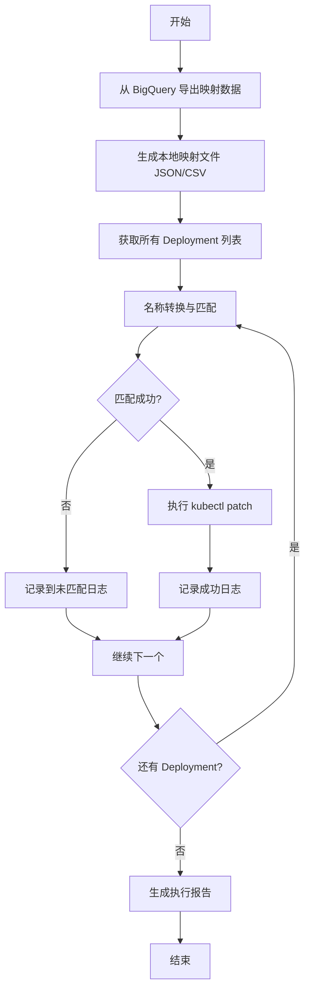
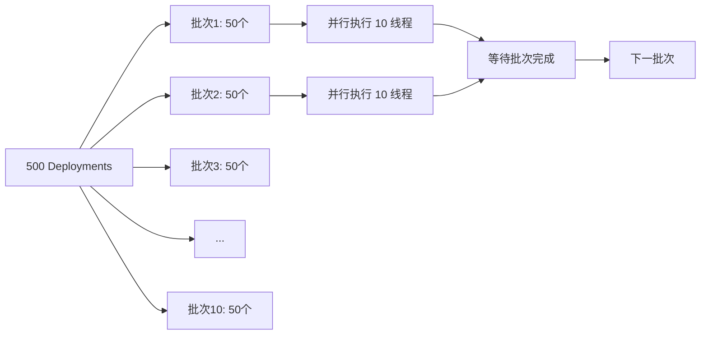
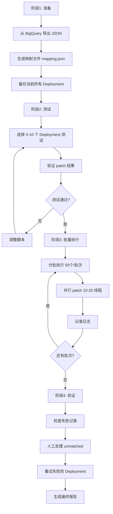
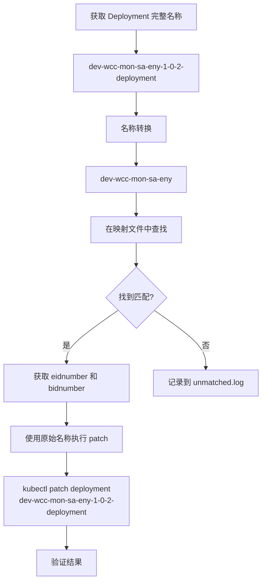
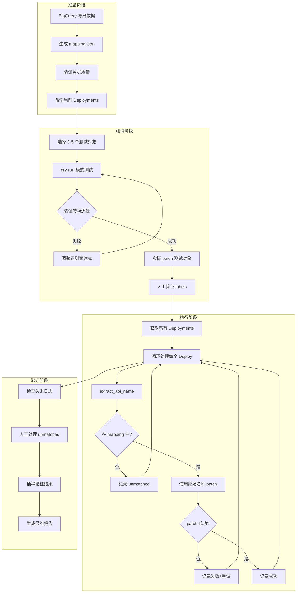

# 方案规划分析

## 1. 问题分析

### 核心需求

- 为所有 Deployment 批量添加 metadata labels (`eidnumber`, `bidnumber`)
- 需要处理名称映射关系：`dev-wcc-mon-sa-eny-1-0-2-deployment` → `dev-wcc-mon-sa-eny`
- 数据源在 BigQuery，约 600-700 条记录
- 需要跨多个 namespace 操作，约 500-600 个 Deployment

### 关键挑战

1. **名称转换规则**：Deployment 名称需要去除版本号和 `-deployment` 后缀
2. **查询效率**：避免频繁查询 BigQuery
3. **操作效率**：批量 patch 500+ Deployment
4. **错误处理**：匹配失败、patch 失败的情况

---

## 2. 推荐方案

### 方案架构



---

## 3. 详细实施步骤

### 步骤 1: 数据准备阶段

**选项 A - 导出为 JSON 文件（推荐）**

```sql
-- BigQuery 查询语句
SELECT 
    api_name,
    eidnumber,
    bidnumber
FROM `gcp-project.aibang_api_data.v4_data`
WHERE api_name IS NOT NULL 
  AND eidnumber IS NOT NULL
ORDER BY api_name;
```

**优点**：

- 一次性查询，避免重复网络请求
- 本地文件查找速度快（毫秒级）
- 可复用，多次执行脚本无需重新查询
- 便于人工审查数据正确性

**导出格式建议**：

```json
{
  "dev-wcc-mon-sa-eny": {
    "eidnumber": "E12345",
    "bidnumber": "B67890"
  },
  "another-api-name": {
    "eidnumber": "E11111",
    "bidnumber": "B22222"
  }
}
```

### 步骤 2: 名称转换规则

**转换逻辑**：

```
输入: dev-wcc-mon-sa-eny-1-0-2-deployment
处理:
  1. 去除 -deployment 后缀
  2. 去除版本号部分 (最后的 -X-X-X 格式)
输出: dev-wcc-mon-sa-eny
```

**正则表达式方案**：

```bash
# 方案 1: 去除最后的版本号和 -deployment
echo "dev-wcc-mon-sa-eny-1-0-2-deployment" | sed 's/-[0-9]\+-[0-9]\+-[0-9]\+-deployment$//'

# 方案 2: 更宽松的匹配（处理不同版本格式）
echo "dev-wcc-mon-sa-eny-1-0-2-deployment" | sed 's/-[0-9].*-deployment$//'
```

### 步骤 3: 执行策略

#### 策略对比

|策略|优点|缺点|适用场景|
|---|---|---|---|
|**串行执行**|简单稳定，日志清晰|速度慢（500个约需5-10分钟）|生产环境，首次执行|
|**并行执行**|速度快（3-5倍提升）|日志混乱，需控制并发数|测试环境，时间紧迫|
|**分批执行**|平衡速度和稳定性|实现稍复杂|推荐方案|

#### 推荐策略：分批并行执行



**参数建议**：

- 批次大小：50 个 Deployment
- 并发数：10-20 个线程
- 失败重试：3 次
- 预计总耗时：3-5 分钟

---

## 4. 错误处理与日志

### 需要处理的场景

|场景|处理方式|
|---|---|
|**名称无法匹配**|记录到 `unmatched.log`，人工审查|
|**kubectl patch 失败**|记录到 `failed.log`，重试 3 次|
|**labels 已存在**|检查值是否一致，不一致则更新|
|**Deployment 不存在**|记录到 `not-found.log`|

### 日志结构

```bash
logs/
├── success.log          # 成功记录
├── failed.log           # 失败记录（需要重试）
├── unmatched.log        # 无法匹配的 Deployment
├── skipped.log          # 已存在且值相同（跳过）
└── summary.txt          # 执行摘要报告
```

---

## 5. 执行前检查清单

### 数据验证

- [ ] BigQuery 数据中是否存在重复的 `api_name`
- [ ] `eidnumber` 和 `bidnumber` 是否有空值
- [ ] 导出的 JSON 文件格式是否正确

### 权限验证

```bash
# 检查是否有 patch deployment 权限
kubectl auth can-i patch deployments --all-namespaces

# 检查是否能访问所有 namespace
kubectl get namespaces
```

### 环境验证

```bash
# 测试单个 Deployment patch
kubectl get deployment <test-deploy> -n <test-ns> -o yaml | grep -A 5 labels

# 验证 kubectl 版本
kubectl version --client
```

---

## 6. 回滚方案

### 备份策略

```bash
# 执行前导出所有 Deployment 的当前状态
kubectl get deployments --all-namespaces -o yaml > backup_deployments_$(date +%Y%m%d_%H%M%S).yaml
```

### 回滚方法

```bash
# 方式 1: 删除添加的 labels
kubectl patch deployment <DEPLOY_NAME> \
  -n <NAMESPACE> \
  --type=json \
  -p '[{"op": "remove", "path": "/metadata/labels/eidnumber"}, {"op": "remove", "path": "/metadata/labels/bidnumber"}]'

# 方式 2: 从备份恢复
kubectl apply -f backup_deployments_<timestamp>.yaml
```

---

## 7. 性能优化建议

### 优化点对比

|优化项|提升效果|实现复杂度|
|---|---|---|
|使用本地映射文件|⭐⭐⭐⭐⭐|低|
|并行执行|⭐⭐⭐⭐|中|
|kubectl 客户端连接复用|⭐⭐⭐|低|
|过滤已有正确 labels|⭐⭐⭐|中|
|使用 kubectl patch --dry-run 预检|⭐⭐|低|

---

## 8. 推荐工具选型

### 脚本语言选择

|语言|优点|缺点|推荐度|
|---|---|---|---|
|**Bash**|简单直接，无依赖|错误处理复杂，并行控制困难|⭐⭐⭐|
|**Python**|强大的错误处理，丰富的库|需要安装依赖|⭐⭐⭐⭐⭐|
|**Go**|性能最佳，天然并发|编译部署稍复杂|⭐⭐⭐⭐|

**推荐：Python + subprocess + concurrent.futures**

---

## 9. 最终推荐方案

### 执行流程



### 时间估算

|阶段|预计耗时|
|---|---|
|BigQuery 导出 + 准备|5-10 分钟|
|小规模测试|10 分钟|
|批量执行（500 个）|3-5 分钟|
|验证与修正|10-15 分钟|
|**总计**|**30-40 分钟**|

---

## 10. 注意事项

### ⚠️ 关键风险点

1. **名称转换规则**
    
    - 确认所有 Deployment 都遵循 `<api-name>-<version>-deployment` 格式
    - 是否存在特殊格式（如 `api-name-v2-deployment`）
2. **数据完整性**
    
    - BigQuery 中是否所有 API 都有对应的 `eidnumber` 和 `bidnumber`
    - 是否存在同一个 `api_name` 对应多条记录的情况
3. **权限问题**
    
    - 确保有所有 namespace 的 patch 权限
    - 某些 namespace 可能有 ResourceQuota 限制
4. **版本号格式**
    
    - 确认版本号格式：`1-0-2` 还是 `1.0.2` 还是 `v1-0-2`
    - 是否有不带版本号的 Deployment

---

## 下一步

请确认以下信息，我将为您编写完整的脚本：

1. **版本号格式示例**：提供 3-5 个真实的 Deployment 名称
2. **BigQuery 字段确认**：`bidnumber` 字段是否存在？如果不存在，是否需要填充默认值？
3. **执行环境**：
    - 是否有 Python 3.6+ 环境？
    - 是否可以安装 `google-cloud-bigquery` 库？
    - 还是倾向于纯 Bash 脚本？
4. **测试范围**：是否可以提供一个测试 namespace 先执行验证？

确认后我将提供：

- 完整的 Python 或 Bash 脚本
- BigQuery 导出命令
- 分步执行指南
- 错误排查手册

# 方案澄清与优化

## 1. 流程确认

### 核心逻辑梳理



### 数据流示例

|步骤|名称/值|说明|
|---|---|---|
|**1. 原始 Deployment**|`dev-wcc-mon-sa-eny-1-0-2-deployment`|kubectl 获取的完整名称|
|**2. 转换后查询键**|`dev-wcc-mon-sa-eny`|用于在 mapping.json 中查找|
|**3. 查询到的值**|`{"eidnumber": "E12345", "bidnumber": "B67890"}`|从映射文件获取|
|**4. kubectl patch 目标**|`dev-wcc-mon-sa-eny-1-0-2-deployment`|使用原始完整名称|

---

## 2. 映射文件结构优化

### 推荐格式 - 双向映射

```json
{
  "dev-wcc-mon-sa-eny": {
    "eidnumber": "E12345",
    "bidnumber": "B67890",
    "deployments": [
      "dev-wcc-mon-sa-eny-1-0-2-deployment",
      "dev-wcc-mon-sa-eny-2-0-0-deployment"
    ]
  },
  "another-api": {
    "eidnumber": "E11111",
    "bidnumber": "B22222",
    "deployments": [
      "another-api-1-0-0-deployment"
    ]
  }
}
```

**优点**：

- 可以验证 Deployment 名称是否符合预期
- 方便后续审计和排查
- 可以处理同一 API 多个版本同时存在的情况

---

## 3. 核心处理流程伪代码

```python
# 伪代码示例
def process_deployment(deployment_full_name, namespace, mapping_data):
    """
    处理单个 Deployment
    
    Args:
        deployment_full_name: 完整名称，如 dev-wcc-mon-sa-eny-1-0-2-deployment
        namespace: K8s namespace
        mapping_data: 映射数据字典
    """
    
    # 步骤 1: 名称转换 - 提取 API 名称
    api_name = extract_api_name(deployment_full_name)
    # 结果: "dev-wcc-mon-sa-eny"
    
    # 步骤 2: 查找映射数据
    if api_name not in mapping_data:
        log_unmatched(deployment_full_name, api_name)
        return False
    
    labels = mapping_data[api_name]
    eidnumber = labels['eidnumber']
    bidnumber = labels['bidnumber']
    
    # 步骤 3: 使用原始完整名称执行 patch
    kubectl_patch(
        deployment_name=deployment_full_name,  # 使用原始名称！
        namespace=namespace,
        labels={
            'eidnumber': eidnumber,
            'bidnumber': bidnumber
        }
    )
    
    return True

def extract_api_name(full_name):
    """
    从完整名称提取 API 名称
    
    输入: dev-wcc-mon-sa-eny-1-0-2-deployment
    输出: dev-wcc-mon-sa-eny
    """
    # 方法 1: 正则替换
    import re
    return re.sub(r'-\d+-\d+-\d+-deployment$', '', full_name)
    
    # 方法 2: 字符串处理
    # 去除 -deployment
    name = full_name.replace('-deployment', '')
    # 去除版本号 (最后三个 -数字 部分)
    parts = name.split('-')
    # 从后往前找，去掉连续的数字部分
    while parts and parts[-1].isdigit():
        parts.pop()
    return '-'.join(parts)
```

---

## 4. 完整执行流程示例

### 单个 Deployment 处理过程

```bash
# 场景示例
原始 Deployment: dev-wcc-mon-sa-eny-1-0-2-deployment
Namespace: production

# 步骤 1: 名称转换
转换后: dev-wcc-mon-sa-eny

# 步骤 2: 查找映射
在 mapping.json 中查找 "dev-wcc-mon-sa-eny"
找到: {"eidnumber": "E12345", "bidnumber": "B67890"}

# 步骤 3: 构建 patch 命令（使用原始名称）
kubectl patch deployment dev-wcc-mon-sa-eny-1-0-2-deployment \
  -n production \
  --type=merge \
  -p '{"metadata":{"labels":{"eidnumber":"E12345","bidnumber":"B67890"}}}'

# 步骤 4: 验证结果
kubectl get deployment dev-wcc-mon-sa-eny-1-0-2-deployment \
  -n production \
  -o jsonpath='{.metadata.labels}' | jq
```

---

## 5. 数据结构设计

### 方案对比

|方案|存储格式|查询方式|优点|缺点|
|---|---|---|---|---|
|**方案 A<br/>简单映射**|`{"api-name": {"eid": "...", "bid": "..."}}`|直接字典查找|简单高效|无法验证 Deployment 完整名称|
|**方案 B<br/>双向映射**|包含 deployments 数组|两阶段查找|可验证，可审计|稍复杂，需维护|
|**方案 C<br/>反向映射**|`{"full-deploy-name": {"eid": "...", "bid": "..."}}`|直接查找|无需转换|需要提前获取所有 Deployment|

### 推荐方案 A（简单映射）

```json
{
  "dev-wcc-mon-sa-eny": {
    "eidnumber": "E12345",
    "bidnumber": "B67890"
  }
}
```

**理由**：

- 查询效率最高（O(1)）
- 实现最简单
- 600-700 条数据量下性能差异可忽略
- BigQuery 导出最直接

---

## 6. 名称转换规则测试

### 测试用例

|输入|期望输出|正则表达式结果|
|---|---|---|
|`dev-wcc-mon-sa-eny-1-0-2-deployment`|`dev-wcc-mon-sa-eny`|✅|
|`api-service-2-1-0-deployment`|`api-service`|✅|
|`my-api-10-5-3-deployment`|`my-api`|✅|
|`test-api-v1-0-0-deployment`|`test-api-v1-0-0-deployment` ⚠️|❌ 需要调整|

### 正则表达式优化

```bash
# 基础版本（处理标准格式）
sed 's/-[0-9]\+-[0-9]\+-[0-9]\+-deployment$//'

# 增强版本（处理更多情况）
# 匹配: 连字符 + 1-3位数字 + 连字符 + 1-3位数字 + 连字符 + 1-3位数字 + -deployment
sed 's/-[0-9]\{1,3\}-[0-9]\{1,3\}-[0-9]\{1,3\}-deployment$//'

# Python 版本（更灵活）
import re
pattern = r'-\d+-\d+-\d+-deployment$'
api_name = re.sub(pattern, '', deployment_name)
```

### ⚠️ 需要确认的边界情况

请检查您的环境中是否存在以下特殊格式：

1. **版本号带字母**：`api-name-v1-0-2-deployment`
2. **四段版本号**：`api-name-1-0-2-1-deployment`
3. **两段版本号**：`api-name-1-0-deployment`
4. **不带版本号**：`api-name-deployment`
5. **后缀变化**：`api-name-1-0-2-deploy` 或 `api-name-1-0-2-svc`

---

## 7. BigQuery 导出优化建议

### 推荐 SQL 查询

```sql
SELECT 
    api_name,
    eidnumber,
    bidnumber,
    -- 可选：增加验证字段
    api_name_with_major_version,
    COUNT(*) OVER (PARTITION BY api_name) as duplicate_check
FROM `gcp-project.aibang_api_data.v4_data`
WHERE api_name IS NOT NULL 
  AND eidnumber IS NOT NULL
  AND bidnumber IS NOT NULL
ORDER BY api_name;
```

### 导出为 JSON 格式（推荐）

```bash
# 使用 bq 命令行工具导出
bq query --format=json --use_legacy_sql=false \
  'SELECT api_name, eidnumber, bidnumber 
   FROM `gcp-project.aibang_api_data.v4_data` 
   WHERE api_name IS NOT NULL' \
  > raw_data.json

# 然后转换为键值对格式
# 使用 jq 工具
jq -r 'map({(.api_name): {eidnumber, bidnumber}}) | add' raw_data.json > mapping.json
```

### 导出为 CSV 格式（备选）

```bash
bq extract --destination_format=CSV \
  'gcp-project:aibang_api_data.v4_data' \
  gs://your-bucket/mapping.csv
```

---

## 8. 数据验证检查清单

### 执行前必须验证

```bash
# 1. 检查 BigQuery 数据质量
SELECT 
    COUNT(*) as total_records,
    COUNT(DISTINCT api_name) as unique_apis,
    COUNT(*) - COUNT(DISTINCT api_name) as duplicates,
    SUM(CASE WHEN eidnumber IS NULL THEN 1 ELSE 0 END) as missing_eid,
    SUM(CASE WHEN bidnumber IS NULL THEN 1 ELSE 0 END) as missing_bid
FROM `gcp-project.aibang_api_data.v4_data`;

# 2. 检查是否有重复的 api_name
SELECT api_name, COUNT(*) as cnt
FROM `gcp-project.aibang_api_data.v4_data`
GROUP BY api_name
HAVING COUNT(*) > 1;

# 3. 检查特殊字符
SELECT api_name
FROM `gcp-project.aibang_api_data.v4_data`
WHERE api_name LIKE '%/%' 
   OR api_name LIKE '% %'
   OR api_name LIKE '%\%%';
```

---

## 9. 关键代码片段

### Python 版本核心函数

```python
import re
import json
import subprocess

def extract_api_name(deployment_name):
    """
    提取 API 名称
    输入: dev-wcc-mon-sa-eny-1-0-2-deployment
    输出: dev-wcc-mon-sa-eny
    """
    # 去除版本号和 -deployment 后缀
    pattern = r'-\d+-\d+-\d+-deployment$'
    api_name = re.sub(pattern, '', deployment_name)
    return api_name

def load_mapping(json_file):
    """加载映射文件"""
    with open(json_file, 'r') as f:
        return json.load(f)

def patch_deployment(deploy_name, namespace, eidnumber, bidnumber, dry_run=False):
    """
    执行 kubectl patch
    保持使用原始完整的 deployment 名称
    """
    patch_json = json.dumps({
        "metadata": {
            "labels": {
                "eidnumber": eidnumber,
                "bidnumber": bidnumber
            }
        }
    })
    
    cmd = [
        'kubectl', 'patch', 'deployment', deploy_name,
        '-n', namespace,
        '--type=merge',
        '-p', patch_json
    ]
    
    if dry_run:
        cmd.append('--dry-run=client')
    
    try:
        result = subprocess.run(cmd, capture_output=True, text=True, check=True)
        return True, result.stdout
    except subprocess.CalledProcessError as e:
        return False, e.stderr

# 使用示例
mapping = load_mapping('mapping.json')
deploy_full_name = "dev-wcc-mon-sa-eny-1-0-2-deployment"
namespace = "production"

# 提取 API 名称用于查询
api_name = extract_api_name(deploy_full_name)  # "dev-wcc-mon-sa-eny"

# 查找映射
if api_name in mapping:
    labels = mapping[api_name]
    # 使用原始完整名称执行 patch
    success, output = patch_deployment(
        deploy_name=deploy_full_name,  # 原始名称
        namespace=namespace,
        eidnumber=labels['eidnumber'],
        bidnumber=labels['bidnumber'],
        dry_run=True  # 先测试
    )
    print(f"{'成功' if success else '失败'}: {output}")
```

---

## 10. 完整工作流程



---

## 11. 下一步行动

### 现在需要您确认的信息

1. **版本号格式示例**（提供 5-10 个真实 Deployment 名称）
    
    ```
    示例：
    - xxx-api-1-0-2-deployment
    - xxx-service-2-1-0-deployment
    - ...
    ```
    
2. **BigQuery 字段确认**
    
    - `bidnumber` 字段是否确实存在？
    - 数据表完整路径确认：`gcp-project.aibang_api_data.v4_data`
3. **执行环境**
    
    - [ ] 使用 Python 脚本（推荐）
    - [ ] 使用 Bash 脚本
    - [ ] 可以安装 Python 依赖包吗？
4. **权限验证**
    
    ```bash
    # 请执行并反馈结果
    kubectl auth can-i patch deployments --all-namespaces
    ```
    
5. **测试对象**
    
    - 是否可以提供 1-2 个 namespace 和对应的 deployment 名称用于测试？

### 确认后我将提供

- ✅ 完整的可执行脚本（Python 或 Bash）
- ✅ BigQuery 数据导出命令
- ✅ 映射文件生成脚本
- ✅ 分步执行指南
- ✅ 错误处理和回滚方案
- ✅ 验证和测试用例

请提供上述信息，我将立即为您编写完整的生产级脚本。