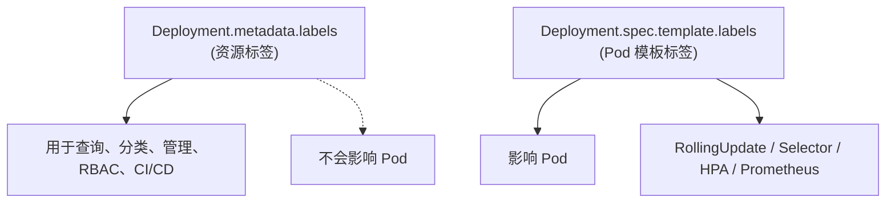

当然可以，下面给你 **同时新增多个 label（不会触发 Pod 重启）** 的 patch 指令。

---

# ✅ **一次性增加多个 metadata.labels（安全，不触发滚动更新）**

语法：

```bash
kubectl patch deployment <DEPLOY_NAME> \
  -n <NAMESPACE> \
  --type=merge \
  -p '{"metadata":{"labels":{"key1":"value1","key2":"value2"}}}'
```

---

# 🔧 **示例：新增 2 个 label（team=platform，env=prod）**

```bash
kubectl patch deployment my-api \
  -n prod \
  --type=merge \
  -p '{"metadata":{"labels":{"team":"platform","env":"prod"}}}'
```

---

# 📌 关键提醒

- 这只会更新 **Deployment.metadata.labels**
    
- **不会触发 Pod 重启**
    
- 因为 Pod Template（`spec.template.*`）完全未被修改
    

---

如果你告诉我你实际的 key/value，我可以帮你组装成最终可执行的命令。


下面按照你的专业背景（GKE/K8S/网络）给你一个**纯技术视角**的深度解释，帮助你彻底理解：

# 1. **问题分析**

你想知道 **Deployment.metadata.labels**（不是 Pod Template 的 label）在 Kubernetes 中的真实用途与最佳使用场景。

它不会触发 Pod 重启，那么它存在的价值在哪里？

---

# 2. **核心结论**

**metadata.labels 的作用：用于标识、组织、查询、选择、权限控制，不用于影响 Pod 行为。**

它是 **“资源级标签”**，而不是 “Pod 模板标签”。

---

# 3. **metadata.labels 的主要使用场景（最权威总结）**

## ✅ **1. 使用 label Selector 查询资源（kubectl 管理必备）**

例如：

```bash
kubectl get deploy -l team=platform
kubectl get deploy -l app=my-api
```

给 Deployment 打 label 后：

- 方便批量查询
    
- 方便给多个资源打分组
    

**这是最常用场景。**

---

## ✅ **2. RBAC / IAM / Policy 管理（K8S 平台级别管理）**

比如你平台需要：

### 🔹 限制某个团队只能管理自己带有 team=abc 的 Deployment

可配合：

- RBAC `ResourceNameSelector`
    
- Kyverno、OPA Gatekeeper
    
- Namespace Quota
    

**metadata.labels 就成为“资源归属标识”。**

---

## ✅ **3. CI/CD、GitOps 系统分类资源**

例如 ArgoCD、Flux、Jenkins、GitLab CI 会根据 Deployment 的 label 做：

- 版本追踪
    
- 应用分类
    
- 自动部署过滤
    

示例：

```yaml
metadata:
  labels:
    gitops.sync: enabled
```

---

## ✅ **4. 监控系统（Prometheus/Grafana）中的资源维度标识**

注意：这里指的是 **Deployment 的监控维度**，不是 Pod 的监控维度。

例如 kube_state_metrics 会输出：

```
kube_deployment_labels{deployment="my-api",team="platform"}
```

Grafana Dashboard 可依据 metadata.labels 分组展示 Deployment 层的状态。

---

## ✅ **5. 审计、合规、资产标识**

公司 SRE/平台组常需要：

- 标记 owner
    
- 标记业务线
    
- 标记环境类型（prod/stage）
    
- 标记责任人
    
- 标记 SLA 分级
    

示例：

```yaml
metadata:
  labels:
    owner: payment-team
    service-level: gold
    compliance: pci
```

---

## 🚫 metadata.labels **不能干什么？**

|功能|是否由 metadata.labels 负责？|
|---|---|
|Service selector → 匹配 Pod|❌ **不行**（要用 spec.template.labels）|
|HPA selector → 匹配 Pod|❌ 不行|
|Prometheus 抓 Pod 指标|❌ 不行|
|Sidecar 注入规则（Istio）|❌ 不行|
|触发 Pod 滚动更新|❌ 不行|

metadata.labels 作用对象是 **Deployment 这个资源本身**，不是 Pod。

---

# 4. **对比图：metadata.labels vs template.labels**



---

# 5. **最佳实践总结（专家级回答）**

|label 放哪里？|用途|是否重启 Pod|
|---|---|---|
|**metadata.labels**|Deployment 分组、查询、RBAC、CI/CD、审计|❌|
|**spec.template.labels**|Pod 行为、Service/HPA 匹配、流量接入、监控|✔️|

---

# 6. **一句话总结给你（便于记忆）**

> **metadata.labels 是“资源管理标签”，spec.template.labels 是“Pod 运行标签”。**

---

如果你愿意，我还可以帮你整理成：

- **完整 Markdown 文档**（适合你的 CAEP/GKE 项目文档）
    
- **图示版资源标签体系（包含最佳实践）**