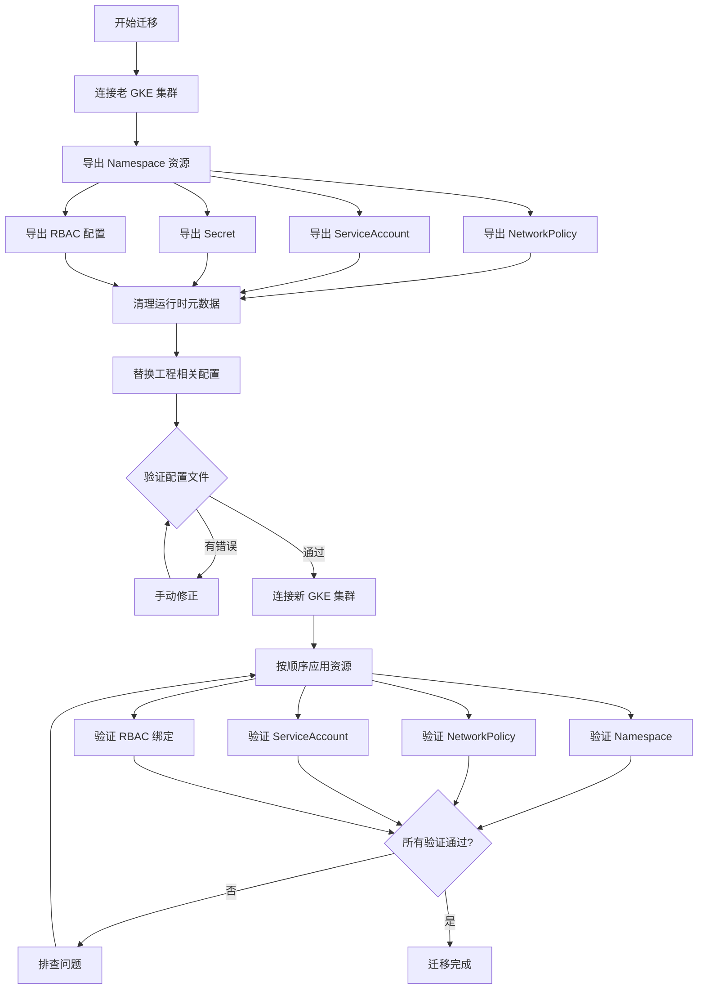

# Summary

我有这样一个需求 ，因为在我的老的 GKE环境里边 ，我们有一个创建 namespace的脚本。这个脚本的入参数比较多。因为我现在不太确认我想使用具体哪一个参数来创建我的 Namespace在新的工程里面。但是呢 ，我能登录到老工程里面去获取对应所有的资源那么我如何评估使用这个脚本在我的新工程里面创建对应的 Namespace. 因为我们在创建 namespace资源的时候会初始化一些配置。比如说默认网络会 deny all 。然后只允许对应的网络或者对应的流量进来。当然了网络上面不是有问题 ，主要是一些 secret的 sa和一些调用或者是必须要求绑定一些对应的SA. 如果我想在我新的工程里面参考老的工程做一个快速的创建 ，那么有什么好的办法比如说我直接导出配置 ，然后只改对应的一些工程对应关系

# Claude
# GKE Namespace 迁移方案

## 问题分析

您需要将老 GKE 工程中的 namespace 配置迁移到新工程,主要关注:

- 网络策略 (NetworkPolicy)
- Secret 资源
- ServiceAccount (SA) 及其绑定关系
- 其他初始化配置

核心目标:**导出老工程配置 → 修改工程相关参数 → 应用到新工程**

---

## 解决方案

### 方案一:批量导出现有资源(推荐)

#### 1. 导出完整 Namespace 配置

```bash
# 设置老工程上下文
export OLD_PROJECT="old-project-id"
export OLD_CLUSTER="old-cluster-name"
export OLD_ZONE="asia-east1-a"
export NAMESPACE="target-namespace"

# 切换到老工程
gcloud config set project ${OLD_PROJECT}
gcloud container clusters get-credentials ${OLD_CLUSTER} --zone ${OLD_ZONE}

# 创建导出目录
mkdir -p namespace-export/${NAMESPACE}
cd namespace-export/${NAMESPACE}
```

#### 2. 导出关键资源

```bash
# 导出 Namespace 定义
kubectl get namespace ${NAMESPACE} -o yaml > 01-namespace.yaml

# 导出 NetworkPolicy
kubectl get networkpolicy -n ${NAMESPACE} -o yaml > 02-networkpolicies.yaml

# 导出 ServiceAccount
kubectl get sa -n ${NAMESPACE} -o yaml > 03-serviceaccounts.yaml

# 导出 Secret (排除自动生成的 token)
kubectl get secret -n ${NAMESPACE} \
  --field-selector type!=kubernetes.io/service-account-token \
  -o yaml > 04-secrets.yaml

# 导出 RoleBinding
kubectl get rolebinding -n ${NAMESPACE} -o yaml > 05-rolebindings.yaml

# 导出 Role
kubectl get role -n ${NAMESPACE} -o yaml > 06-roles.yaml

# 导出 ResourceQuota (如果有)
kubectl get resourcequota -n ${NAMESPACE} -o yaml > 07-resourcequota.yaml

# 导出 LimitRange (如果有)
kubectl get limitrange -n ${NAMESPACE} -o yaml > 08-limitrange.yaml

# 导出 ConfigMap (根据需要)
kubectl get configmap -n ${NAMESPACE} -o yaml > 09-configmaps.yaml
```

#### 3. 清理和修改配置

```bash
#!/bin/bash
# clean-exports.sh - 清理导出文件中的运行时数据

for file in *.yaml; do
  echo "Processing ${file}..."
  
  # 使用 yq 清理元数据 (需要安装 yq)
  yq eval 'del(.items[].metadata.uid,
               .items[].metadata.resourceVersion,
               .items[].metadata.selfLink,
               .items[].metadata.creationTimestamp,
               .items[].metadata.generation,
               .items[].metadata.managedFields,
               .items[].status,
               .metadata.uid,
               .metadata.resourceVersion,
               .metadata.selfLink,
               .metadata.creationTimestamp,
               .metadata.generation,
               .metadata.managedFields,
               .status)' -i ${file}
done

# 替换工程相关的配置
export NEW_PROJECT="new-project-id"
export OLD_PROJECT="old-project-id"

# 批量替换工程 ID
find . -name "*.yaml" -type f -exec sed -i \
  "s/${OLD_PROJECT}/${NEW_PROJECT}/g" {} \;

# 替换 GCP Service Account 邮箱
find . -name "*.yaml" -type f -exec sed -i \
  "s/@${OLD_PROJECT}.iam.gserviceaccount.com/@${NEW_PROJECT}.iam.gserviceaccount.com/g" {} \;

echo "清理完成!"
```

#### 4. 应用到新工程

```bash
# 切换到新工程
export NEW_PROJECT="new-project-id"
export NEW_CLUSTER="new-cluster-name"
export NEW_ZONE="asia-east1-a"

gcloud config set project ${NEW_PROJECT}
gcloud container clusters get-credentials ${NEW_CLUSTER} --zone ${NEW_ZONE}

# 按顺序应用配置
kubectl apply -f 01-namespace.yaml
kubectl apply -f 02-networkpolicies.yaml
kubectl apply -f 03-serviceaccounts.yaml
kubectl apply -f 04-secrets.yaml
kubectl apply -f 05-rolebindings.yaml
kubectl apply -f 06-roles.yaml
kubectl apply -f 07-resourcequota.yaml
kubectl apply -f 08-limitrange.yaml
kubectl apply -f 09-configmaps.yaml
```

---

### 方案二:使用脚本参数对比工具

#### 创建参数提取脚本

```bash
#!/bin/bash
# extract-namespace-config.sh - 从现有 namespace 提取配置参数

NAMESPACE=$1

if [ -z "${NAMESPACE}" ]; then
  echo "Usage: $0 <namespace>"
  exit 1
fi

echo "=== Namespace: ${NAMESPACE} ==="
echo ""

# 提取 NetworkPolicy 配置
echo "## NetworkPolicy 配置"
kubectl get networkpolicy -n ${NAMESPACE} -o json | jq -r '
  .items[] | {
    name: .metadata.name,
    podSelector: .spec.podSelector,
    policyTypes: .spec.policyTypes,
    ingress: .spec.ingress,
    egress: .spec.egress
  }'
echo ""

# 提取 ServiceAccount 列表
echo "## ServiceAccount 列表"
kubectl get sa -n ${NAMESPACE} --no-headers | awk '{print $1}'
echo ""

# 提取 Secret 列表(排除 token)
echo "## Secret 列表 (非 token)"
kubectl get secret -n ${NAMESPACE} \
  --field-selector type!=kubernetes.io/service-account-token \
  --no-headers | awk '{print $1, $2}'
echo ""

# 提取 RoleBinding 关系
echo "## RoleBinding 关系"
kubectl get rolebinding -n ${NAMESPACE} -o json | jq -r '
  .items[] | {
    name: .metadata.name,
    role: .roleRef.name,
    subjects: [.subjects[]? | {kind: .kind, name: .name}]
  }'
echo ""

# 提取 Workload Identity 绑定
echo "## Workload Identity 绑定"
kubectl get sa -n ${NAMESPACE} -o json | jq -r '
  .items[] | 
  select(.metadata.annotations["iam.gke.io/gcp-service-account"] != null) |
  {
    k8s_sa: .metadata.name,
    gcp_sa: .metadata.annotations["iam.gke.io/gcp-service-account"]
  }'
```

---

## 迁移流程图



---

## 完整迁移脚本

```bash
#!/bin/bash
# migrate-namespace.sh - 完整的 Namespace 迁移脚本

set -e

# ============= 配置参数 =============
OLD_PROJECT="${OLD_PROJECT:-old-project-id}"
OLD_CLUSTER="${OLD_CLUSTER:-old-cluster}"
OLD_ZONE="${OLD_ZONE:-asia-east1-a}"

NEW_PROJECT="${NEW_PROJECT:-new-project-id}"
NEW_CLUSTER="${NEW_CLUSTER:-new-cluster}"
NEW_ZONE="${NEW_ZONE:-asia-east1-a}"

NAMESPACE="${1}"
EXPORT_DIR="namespace-export-$(date +%Y%m%d-%H%M%S)"

if [ -z "${NAMESPACE}" ]; then
  echo "Usage: $0 <namespace>"
  exit 1
fi

# ============= 函数定义 =============
log() {
  echo "[$(date '+%Y-%m-%d %H:%M:%S')] $*"
}

check_command() {
  if ! command -v $1 &> /dev/null; then
    log "错误: 未找到命令 $1, 请先安装"
    exit 1
  fi
}

# ============= 前置检查 =============
log "检查必需的命令..."
check_command kubectl
check_command gcloud
check_command yq
check_command jq

# ============= 步骤 1: 导出老工程配置 =============
log "连接到老工程 ${OLD_PROJECT}..."
gcloud config set project ${OLD_PROJECT}
gcloud container clusters get-credentials ${OLD_CLUSTER} --zone ${OLD_ZONE}

log "创建导出目录 ${EXPORT_DIR}/${NAMESPACE}..."
mkdir -p ${EXPORT_DIR}/${NAMESPACE}
cd ${EXPORT_DIR}/${NAMESPACE}

log "导出 Namespace 资源..."
kubectl get namespace ${NAMESPACE} -o yaml > 01-namespace.yaml 2>/dev/null || true
kubectl get networkpolicy -n ${NAMESPACE} -o yaml > 02-networkpolicies.yaml 2>/dev/null || true
kubectl get sa -n ${NAMESPACE} -o yaml > 03-serviceaccounts.yaml 2>/dev/null || true
kubectl get secret -n ${NAMESPACE} --field-selector type!=kubernetes.io/service-account-token -o yaml > 04-secrets.yaml 2>/dev/null || true
kubectl get rolebinding -n ${NAMESPACE} -o yaml > 05-rolebindings.yaml 2>/dev/null || true
kubectl get role -n ${NAMESPACE} -o yaml > 06-roles.yaml 2>/dev/null || true
kubectl get resourcequota -n ${NAMESPACE} -o yaml > 07-resourcequota.yaml 2>/dev/null || true
kubectl get limitrange -n ${NAMESPACE} -o yaml > 08-limitrange.yaml 2>/dev/null || true

# ============= 步骤 2: 清理配置 =============
log "清理运行时元数据..."
for file in *.yaml; do
  if [ -f "${file}" ]; then
    yq eval 'del(.items[].metadata.uid,
                 .items[].metadata.resourceVersion,
                 .items[].metadata.selfLink,
                 .items[].metadata.creationTimestamp,
                 .items[].metadata.generation,
                 .items[].metadata.managedFields,
                 .items[].status,
                 .metadata.uid,
                 .metadata.resourceVersion,
                 .metadata.selfLink,
                 .metadata.creationTimestamp,
                 .metadata.generation,
                 .metadata.managedFields,
                 .status)' -i ${file}
  fi
done

log "替换工程相关配置..."
find . -name "*.yaml" -type f -exec sed -i "s/${OLD_PROJECT}/${NEW_PROJECT}/g" {} \;
find . -name "*.yaml" -type f -exec sed -i "s/@${OLD_PROJECT}.iam.gserviceaccount.com/@${NEW_PROJECT}.iam.gserviceaccount.com/g" {} \;

# ============= 步骤 3: 应用到新工程 =============
log "连接到新工程 ${NEW_PROJECT}..."
gcloud config set project ${NEW_PROJECT}
gcloud container clusters get-credentials ${NEW_CLUSTER} --zone ${NEW_ZONE}

log "应用配置到新集群..."
for file in *.yaml; do
  if [ -f "${file}" ] && [ -s "${file}" ]; then
    log "应用 ${file}..."
    kubectl apply -f ${file} || log "警告: ${file} 应用失败"
  fi
done

# ============= 步骤 4: 验证 =============
log "验证迁移结果..."
echo ""
echo "=== Namespace ==="
kubectl get namespace ${NAMESPACE}
echo ""
echo "=== NetworkPolicy ==="
kubectl get networkpolicy -n ${NAMESPACE}
echo ""
echo "=== ServiceAccount ==="
kubectl get sa -n ${NAMESPACE}
echo ""
echo "=== Secret ==="
kubectl get secret -n ${NAMESPACE}
echo ""
echo "=== RoleBinding ==="
kubectl get rolebinding -n ${NAMESPACE}

log "迁移完成! 导出文件位于: $(pwd)"
```

---

## 使用步骤

### 1. 准备环境

```bash
# 安装必需工具
# yq - YAML 处理工具
wget https://github.com/mikefarah/yq/releases/latest/download/yq_linux_amd64 -O /usr/local/bin/yq
chmod +x /usr/local/bin/yq

# jq - JSON 处理工具
sudo apt-get install jq  # Debian/Ubuntu
# 或
sudo yum install jq      # RHEL/CentOS
```

### 2. 设置环境变量

```bash
export OLD_PROJECT="your-old-project-id"
export OLD_CLUSTER="your-old-cluster"
export OLD_ZONE="asia-east1-a"

export NEW_PROJECT="your-new-project-id"
export NEW_CLUSTER="your-new-cluster"
export NEW_ZONE="asia-east1-a"
```

### 3. 执行迁移

```bash
# 方式一: 使用完整脚本
chmod +x migrate-namespace.sh
./migrate-namespace.sh your-namespace

# 方式二: 手动分步执行
# 参考上面的 "方案一" 步骤
```

### 4. 验证关键配置

```bash
# 验证 NetworkPolicy
kubectl describe networkpolicy -n ${NAMESPACE}

# 验证 ServiceAccount 的 Workload Identity 绑定
kubectl get sa -n ${NAMESPACE} -o yaml | grep -A 2 "iam.gke.io"

# 测试网络策略
kubectl run test-pod -n ${NAMESPACE} --image=busybox --rm -it -- sh
```

---

## 注意事项

### 🔒 Secret 处理

- **敏感数据**: Secret 中的 base64 数据会被导出,注意安全
- **Workload Identity**: 如使用 Workload Identity,需确保新工程中 GCP SA 已创建并授权
- **ImagePullSecrets**: 镜像拉取凭证需确认新工程的 registry 访问权限

```bash
# 列出所有使用 Workload Identity 的 SA
kubectl get sa -n ${NAMESPACE} -o json | jq -r '
  .items[] | 
  select(.metadata.annotations["iam.gke.io/gcp-service-account"] != null) |
  "\(.metadata.name) -> \(.metadata.annotations["iam.gke.io/gcp-service-account"])"
'

# 在新工程中创建对应的 IAM 绑定
gcloud iam service-accounts add-iam-policy-binding \
  GCP_SA_EMAIL@${NEW_PROJECT}.iam.gserviceaccount.com \
  --role roles/iam.workloadIdentityUser \
  --member "serviceAccount:${NEW_PROJECT}.svc.id.goog[${NAMESPACE}/K8S_SA_NAME]"
```

### 🌐 NetworkPolicy 注意事项

|配置项|检查内容|
|---|---|
|**podSelector**|确认新工程中 Pod 标签一致|
|**namespaceSelector**|确认引用的 namespace 在新工程中存在|
|**ipBlock.cidr**|确认 CIDR 范围在新集群中有效|
|**ports**|确认端口配置与新工程应用一致|

### 📋 RBAC 配置检查

```bash
# 检查 ClusterRole 依赖(如果 RoleBinding 引用了 ClusterRole)
kubectl get rolebinding -n ${NAMESPACE} -o json | \
  jq -r '.items[] | select(.roleRef.kind == "ClusterRole") | .roleRef.name' | \
  sort -u

# 需要手动在新集群中确认这些 ClusterRole 存在
```

### ⚠️ 常见问题

**问题 1**: `Error: Secret "xxx" already exists`

```bash
# 解决方案: 删除重复的 secret 或使用 --dry-run 检查
kubectl delete secret xxx -n ${NAMESPACE}
# 或强制替换
kubectl apply -f 04-secrets.yaml --force
```

**问题 2**: ServiceAccount 无法访问 GCP 资源

```bash
# 检查 Workload Identity 绑定
gcloud iam service-accounts get-iam-policy \
  GCP_SA@${NEW_PROJECT}.iam.gserviceaccount.com

# 重新创建绑定
kubectl annotate sa K8S_SA_NAME -n ${NAMESPACE} \
  iam.gke.io/gcp-service-account=GCP_SA@${NEW_PROJECT}.iam.gserviceaccount.com
```

**问题 3**: NetworkPolicy 导致 Pod 无法通信

```bash
# 临时禁用 NetworkPolicy 进行测试
kubectl delete networkpolicy --all -n ${NAMESPACE}

# 逐个应用并测试
kubectl apply -f 02-networkpolicies.yaml
kubectl exec -n ${NAMESPACE} test-pod -- wget -O- http://target-service
```

---

## 最佳实践建议

### ✅ 迁移前

1. **文档化当前配置**: 使用 `extract-namespace-config.sh` 生成配置清单
2. **备份导出文件**: 保存到 Git 仓库或安全存储
3. **验证新工程资源**: 确认依赖的 GCP SA、VPC、Subnet 等已创建

### ✅ 迁移中

1. **分批应用**: 先应用基础资源 (Namespace, SA),再应用策略资源
2. **逐步验证**: 每应用一类资源就验证一次
3. **保留老工程访问**: 迁移完成前不要删除老工程配置

### ✅ 迁移后

1. **功能测试**: 部署测试应用验证网络和权限
2. **监控告警**: 检查新 namespace 的日志和 metrics
3. **文档更新**: 更新 runbook 和操作文档

---

## 参考模板

### Namespace 初始化模板

```yaml
# namespace-template.yaml
apiVersion: v1
kind: Namespace
metadata:
  name: NAMESPACE_NAME
  labels:
    environment: production
    team: platform
---
apiVersion: v1
kind: ServiceAccount
metadata:
  name: default-sa
  namespace: NAMESPACE_NAME
  annotations:
    iam.gke.io/gcp-service-account: APP_SA@PROJECT_ID.iam.gserviceaccount.com
---
apiVersion: networking.k8s.io/v1
kind: NetworkPolicy
metadata:
  name: deny-all-ingress
  namespace: NAMESPACE_NAME
spec:
  podSelector: {}
  policyTypes:
  - Ingress
---
apiVersion: networking.k8s.io/v1
kind: NetworkPolicy
metadata:
  name: allow-same-namespace
  namespace: NAMESPACE_NAME
spec:
  podSelector: {}
  policyTypes:
  - Ingress
  ingress:
  - from:
    - podSelector: {}
```

使用此方案,您可以快速、安全地将老工程的 namespace 配置迁移到新工程,只需修改工程相关的参数即可! 🚀


# ChatGPT  


其实是一个典型的 **GKE 多环境迁移与 Namespace 初始化自动化** 场景。你要解决的是——如何从旧项目中**提取 Namespace 的结构性配置**（包括网络策略、ServiceAccount、Secret、ResourceQuota 等），并**快速在新项目中重建对应的 Namespace 环境**。

  

我们可以拆解成三步来处理：**提取 → 转换 → 应用**。下面详细说明。

---

## **🧩 一、问题分析**

  

你的现有脚本：

- 接收多个参数创建 Namespace；
    
- 在创建时会初始化：
    
    - NetworkPolicy（默认 deny all）
        
    - ServiceAccount（含绑定的权限）
        
    - Secret（与 SA 或外部系统交互）
        
    - 可能还有 ResourceQuota / LimitRange 等。
        
    

  

问题是：

- 你现在不确定脚本参数的完整性；
    
- 但你能访问旧工程，能查看现有 namespace 的实际配置；
    
- 想在新工程里复现同样的配置，只改项目相关字段（如 projectID、namespace、service account reference）。
    

---

## **🚀 二、推荐解决方案**

  

最可靠的方式是 **从现有 cluster 导出 namespace 相关资源 YAML，然后在新工程中 apply。**

  

### **方案概览**

```
graph TD
    A[旧 GKE 工程] -->|kubectl get -o yaml| B[导出资源配置]
    B --> C[清理环境特定字段]
    C --> D[修改工程和命名空间映射]
    D --> E[新 GKE 工程 apply 配置]
```

---

## **🧰 三、具体操作步骤**

  

### **Step 1️⃣：列出旧工程中的 namespace 资源**

  

假设旧的命名空间叫 team-a：

```
kubectl get all -n team-a
```

然后导出你关心的配置：

```
# 导出网络策略
kubectl get networkpolicy -n team-a -o yaml > networkpolicy-team-a.yaml

# 导出 ServiceAccount
kubectl get sa -n team-a -o yaml > sa-team-a.yaml

# 导出 Secret（如不含敏感信息或可重建）
kubectl get secret -n team-a -o yaml > secret-team-a.yaml

# 导出 ResourceQuota、LimitRange
kubectl get resourcequota,limitrange -n team-a -o yaml > quota-team-a.yaml
```

> ⚠️ 建议不要直接导出 Pods、Deployments 等应用级资源，这里仅导出“Namespace 初始化配置”。

---

### **Step 2️⃣：清理与模板化**

  

导出的 YAML 文件会包含一些环境特定字段（如 uid, resourceVersion, creationTimestamp），需要删除：

```
yq eval 'del(.metadata.uid, .metadata.resourceVersion, .metadata.creationTimestamp, .metadata.selfLink, .metadata.managedFields)' -i *.yaml
```

你也可以进一步将其中的命名空间参数模板化：

```
yq eval '(.metadata.namespace) = "{{ .Values.namespace }}"' -i *.yaml
```

或者简单用 sed 批量替换：

```
sed -i 's/namespace: team-a/namespace: {{NEW_NAMESPACE}}/g' *.yaml
```

---

### **Step 3️⃣：在新工程中重建命名空间结构**

  

先创建 namespace：

```
kubectl create namespace new-team-a
```

再逐步应用各配置：

```
kubectl apply -f sa-team-a.yaml -n new-team-a
kubectl apply -f secret-team-a.yaml -n new-team-a
kubectl apply -f networkpolicy-team-a.yaml -n new-team-a
kubectl apply -f quota-team-a.yaml -n new-team-a
```

---

## **🧩 四、可选优化：自动化模板方案**

  

你可以将这整个过程做成一个通用脚本：

```
#!/bin/bash
set -e

OLD_NS=$1
NEW_NS=$2

echo "Exporting from namespace: $OLD_NS"

mkdir -p export/$OLD_NS
cd export/$OLD_NS

kubectl get networkpolicy,sa,secret,resourcequota,limitrange -n $OLD_NS -o yaml > all.yaml

yq eval 'del(.items[].metadata.uid, .items[].metadata.resourceVersion, .items[].metadata.creationTimestamp, .items[].metadata.managedFields)' -i all.yaml
yq eval "(.items[].metadata.namespace) = \"$NEW_NS\"" -i all.yaml

echo "Applying to new namespace: $NEW_NS"
kubectl create namespace $NEW_NS || true
kubectl apply -f all.yaml -n $NEW_NS
```

保存为 migrate-ns.sh，使用示例：

```
bash migrate-ns.sh team-a new-team-a
```

---

## **⚙️ 五、注意事项与最佳实践**

|**项目**|**注意事项**|
|---|---|
|Secret|如果包含敏感字段（如 token），建议重新生成或同步，而不是直接复制。|
|SA 绑定|若绑定 GCP IAM 角色（Workload Identity），需在新项目中重新配置 iam.gke.io/gcp-service-account annotation。|
|NetworkPolicy|注意命名空间名变化后 selector 的匹配是否仍正确。|
|ResourceQuota|根据新项目资源情况调整 CPU/Memory 限额。|
|脚本可重用性|建议抽象成模板（Helm / Kustomize），未来新增 namespace 直接复用。|

---

## **✅ 总结**

|**目标**|**推荐方法**|
|---|---|
|快速评估脚本参数是否正确|导出旧 namespace 实际资源并比较|
|快速在新项目复现配置|kubectl get ... -o yaml → 清理 → 修改 → apply|
|长期优化方向|使用 **Helm / Kustomize 模板化 namespace 初始化逻辑**|

---

是否希望我帮你基于这个流程生成一个 **可直接执行的自动化迁移脚本（支持多 namespace 批量迁移）**？

我可以帮你加上参数解析和日志记录，让你一键完成从旧项目到新项目的 namespace 同步。