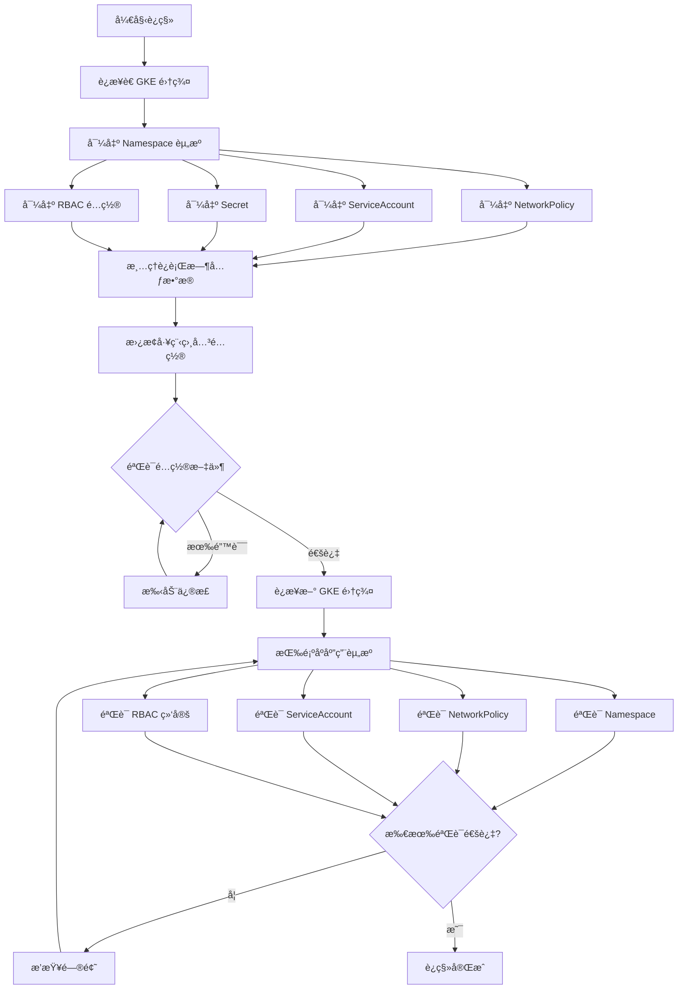

# Summary

我有这样一个需求 ，因为在我的è€çš„ GKEç¯å¢ƒé‡Œè¾¹ ，我们有一个创建 namespace的脚本。这个脚本的入å‚数比较多。因为我ç°åœ¨ä¸å¤ªç¡®è®¤æˆ‘想使用具体哪一个å‚æ•°æ¥åˆ›å»ºæˆ‘çš„ Namespace在新的工程里é¢ã€‚但是呢 ，我能登录到è€å·¥ç¨‹é‡Œé¢å»è·å–对应所有的资æºé‚£ä¹ˆæˆ‘如何评估使用这个脚本在我的新工程里é¢åˆ›å»ºå¯¹åº”çš„ Namespace. 因为我们在创建 namespace资æºçš„时候会åˆå§‹åŒ–一些é…置。比如说默认网络会 deny all 。然ååªå…许对应的网络或者对应的æµé‡è¿›æ¥ã€‚当然了网络上é¢ä¸æ˜¯æœ‰é—®é¢˜ ，主è¦æ˜¯ä¸€äº› secretçš„ sa和一些调用或者是必须è¦æ±‚绑定一些对应的SA. 如æœæˆ‘想在我新的工程里é¢å‚考è€çš„工程åšä¸€ä¸ªå¿«é€Ÿçš„创建 ，那么有什么好的åŠæ³•æ¯”如说我直æ¥å¯¼å‡ºé…ç½® ，然ååªæ”¹å¯¹åº”的一些工程对应关系

# Claude
# GKE Namespace è¿ç§»æ–¹æ¡ˆ

## 问题分æ

您需è¦å°†è€ GKE 工程中的 namespace é…ç½®è¿ç§»åˆ°æ–°å·¥ç¨‹,主è¦å…³æ³¨:

- 网络策略 (NetworkPolicy)
- Secret 资æº
- ServiceAccount (SA) åŠå…¶ç»‘定关系
- 其他åˆå§‹åŒ–é…ç½®

核心目标:**导出è€å·¥ç¨‹é…ç½® → 修改工程相关å‚æ•° → 应用到新工程**

---

## 解决方案

### 方案一:批é‡å¯¼å‡ºç°æœ‰èµ„æº(æ¨è)

#### 1. 导出完整 Namespace é…ç½®

```bash
# 设置è€å·¥ç¨‹ä¸Šä¸‹æ–‡
export OLD_PROJECT="old-project-id"
export OLD_CLUSTER="old-cluster-name"
export OLD_ZONE="asia-east1-a"
export NAMESPACE="target-namespace"

# 切æ¢åˆ°è€å·¥ç¨‹
gcloud config set project ${OLD_PROJECT}
gcloud container clusters get-credentials ${OLD_CLUSTER} --zone ${OLD_ZONE}

# 创建导出目录
mkdir -p namespace-export/${NAMESPACE}
cd namespace-export/${NAMESPACE}
```

#### 2. 导出关键资æº

```bash
# 导出 Namespace 定义
kubectl get namespace ${NAMESPACE} -o yaml > 01-namespace.yaml

# 导出 NetworkPolicy
kubectl get networkpolicy -n ${NAMESPACE} -o yaml > 02-networkpolicies.yaml

# 导出 ServiceAccount
kubectl get sa -n ${NAMESPACE} -o yaml > 03-serviceaccounts.yaml

# 导出 Secret (æ’除自动生æˆçš„ token)
kubectl get secret -n ${NAMESPACE} \
  --field-selector type!=kubernetes.io/service-account-token \
  -o yaml > 04-secrets.yaml

# 导出 RoleBinding
kubectl get rolebinding -n ${NAMESPACE} -o yaml > 05-rolebindings.yaml

# 导出 Role
kubectl get role -n ${NAMESPACE} -o yaml > 06-roles.yaml

# 导出 ResourceQuota (如æœæœ‰)
kubectl get resourcequota -n ${NAMESPACE} -o yaml > 07-resourcequota.yaml

# 导出 LimitRange (如æœæœ‰)
kubectl get limitrange -n ${NAMESPACE} -o yaml > 08-limitrange.yaml

# 导出 ConfigMap (æ ¹æ®éœ€è¦)
kubectl get configmap -n ${NAMESPACE} -o yaml > 09-configmaps.yaml
```

#### 3. 清ç†å’Œä¿®æ”¹é…ç½®

```bash
#!/bin/bash
# clean-exports.sh - 清ç†å¯¼å‡ºæ–‡ä»¶ä¸­çš„è¿è¡Œæ—¶æ•°æ®

for file in *.yaml; do
  echo "Processing ${file}..."
  
  # 使用 yq 清ç†å…ƒæ•°æ® (需è¦å®‰è£… yq)
  yq eval 'del(.items[].metadata.uid,
               .items[].metadata.resourceVersion,
               .items[].metadata.selfLink,
               .items[].metadata.creationTimestamp,
               .items[].metadata.generation,
               .items[].metadata.managedFields,
               .items[].status,
               .metadata.uid,
               .metadata.resourceVersion,
               .metadata.selfLink,
               .metadata.creationTimestamp,
               .metadata.generation,
               .metadata.managedFields,
               .status)' -i ${file}
done

# 替æ¢å·¥ç¨‹ç›¸å…³çš„é…ç½®
export NEW_PROJECT="new-project-id"
export OLD_PROJECT="old-project-id"

# 批é‡æ›¿æ¢å·¥ç¨‹ ID
find . -name "*.yaml" -type f -exec sed -i \
  "s/${OLD_PROJECT}/${NEW_PROJECT}/g" {} \;

# æ›¿æ¢ GCP Service Account 邮箱
find . -name "*.yaml" -type f -exec sed -i \
  "s/@${OLD_PROJECT}.iam.gserviceaccount.com/@${NEW_PROJECT}.iam.gserviceaccount.com/g" {} \;

echo "清ç†å®Œæˆ!"
```

#### 4. 应用到新工程

```bash
# 切æ¢åˆ°æ–°å·¥ç¨‹
export NEW_PROJECT="new-project-id"
export NEW_CLUSTER="new-cluster-name"
export NEW_ZONE="asia-east1-a"

gcloud config set project ${NEW_PROJECT}
gcloud container clusters get-credentials ${NEW_CLUSTER} --zone ${NEW_ZONE}

# 按顺åºåº”用é…ç½®
kubectl apply -f 01-namespace.yaml
kubectl apply -f 02-networkpolicies.yaml
kubectl apply -f 03-serviceaccounts.yaml
kubectl apply -f 04-secrets.yaml
kubectl apply -f 05-rolebindings.yaml
kubectl apply -f 06-roles.yaml
kubectl apply -f 07-resourcequota.yaml
kubectl apply -f 08-limitrange.yaml
kubectl apply -f 09-configmaps.yaml
```

---

### 方案二:使用脚本å‚数对比工具

#### 创建å‚æ•°æå–脚本

```bash
#!/bin/bash
# extract-namespace-config.sh - ä»ç°æœ‰ namespace æå–é…ç½®å‚æ•°

NAMESPACE=$1

if [ -z "${NAMESPACE}" ]; then
  echo "Usage: $0 <namespace>"
  exit 1
fi

echo "=== Namespace: ${NAMESPACE} ==="
echo ""

# æå– NetworkPolicy é…ç½®
echo "## NetworkPolicy é…ç½®"
kubectl get networkpolicy -n ${NAMESPACE} -o json | jq -r '
  .items[] | {
    name: .metadata.name,
    podSelector: .spec.podSelector,
    policyTypes: .spec.policyTypes,
    ingress: .spec.ingress,
    egress: .spec.egress
  }'
echo ""

# æå– ServiceAccount 列表
echo "## ServiceAccount 列表"
kubectl get sa -n ${NAMESPACE} --no-headers | awk '{print $1}'
echo ""

# æå– Secret 列表(æ’除 token)
echo "## Secret 列表 (é token)"
kubectl get secret -n ${NAMESPACE} \
  --field-selector type!=kubernetes.io/service-account-token \
  --no-headers | awk '{print $1, $2}'
echo ""

# æå– RoleBinding 关系
echo "## RoleBinding 关系"
kubectl get rolebinding -n ${NAMESPACE} -o json | jq -r '
  .items[] | {
    name: .metadata.name,
    role: .roleRef.name,
    subjects: [.subjects[]? | {kind: .kind, name: .name}]
  }'
echo ""

# æå– Workload Identity 绑定
echo "## Workload Identity 绑定"
kubectl get sa -n ${NAMESPACE} -o json | jq -r '
  .items[] | 
  select(.metadata.annotations["iam.gke.io/gcp-service-account"] != null) |
  {
    k8s_sa: .metadata.name,
    gcp_sa: .metadata.annotations["iam.gke.io/gcp-service-account"]
  }'
```

---

## è¿ç§»æµç¨‹å›¾



---

## 完整è¿ç§»è„šæœ¬

```bash
#!/bin/bash
# migrate-namespace.sh - 完整的 Namespace è¿ç§»è„šæœ¬

set -e

# ============= é…ç½®å‚æ•° =============
OLD_PROJECT="${OLD_PROJECT:-old-project-id}"
OLD_CLUSTER="${OLD_CLUSTER:-old-cluster}"
OLD_ZONE="${OLD_ZONE:-asia-east1-a}"

NEW_PROJECT="${NEW_PROJECT:-new-project-id}"
NEW_CLUSTER="${NEW_CLUSTER:-new-cluster}"
NEW_ZONE="${NEW_ZONE:-asia-east1-a}"

NAMESPACE="${1}"
EXPORT_DIR="namespace-export-$(date +%Y%m%d-%H%M%S)"

if [ -z "${NAMESPACE}" ]; then
  echo "Usage: $0 <namespace>"
  exit 1
fi

# ============= 函数定义 =============
log() {
  echo "[$(date '+%Y-%m-%d %H:%M:%S')] $*"
}

check_command() {
  if ! command -v $1 &> /dev/null; then
    log "错误: 未找到命令 $1, 请先安装"
    exit 1
  fi
}

# ============= å‰ç½®æ£€æŸ¥ =============
log "检查必需的命令..."
check_command kubectl
check_command gcloud
check_command yq
check_command jq

# ============= 步骤 1: 导出è€å·¥ç¨‹é…ç½® =============
log "è¿æ¥åˆ°è€å·¥ç¨‹ ${OLD_PROJECT}..."
gcloud config set project ${OLD_PROJECT}
gcloud container clusters get-credentials ${OLD_CLUSTER} --zone ${OLD_ZONE}

log "创建导出目录 ${EXPORT_DIR}/${NAMESPACE}..."
mkdir -p ${EXPORT_DIR}/${NAMESPACE}
cd ${EXPORT_DIR}/${NAMESPACE}

log "导出 Namespace 资æº..."
kubectl get namespace ${NAMESPACE} -o yaml > 01-namespace.yaml 2>/dev/null || true
kubectl get networkpolicy -n ${NAMESPACE} -o yaml > 02-networkpolicies.yaml 2>/dev/null || true
kubectl get sa -n ${NAMESPACE} -o yaml > 03-serviceaccounts.yaml 2>/dev/null || true
kubectl get secret -n ${NAMESPACE} --field-selector type!=kubernetes.io/service-account-token -o yaml > 04-secrets.yaml 2>/dev/null || true
kubectl get rolebinding -n ${NAMESPACE} -o yaml > 05-rolebindings.yaml 2>/dev/null || true
kubectl get role -n ${NAMESPACE} -o yaml > 06-roles.yaml 2>/dev/null || true
kubectl get resourcequota -n ${NAMESPACE} -o yaml > 07-resourcequota.yaml 2>/dev/null || true
kubectl get limitrange -n ${NAMESPACE} -o yaml > 08-limitrange.yaml 2>/dev/null || true

# ============= 步骤 2: 清ç†é…ç½® =============
log "清ç†è¿è¡Œæ—¶å…ƒæ•°æ®..."
for file in *.yaml; do
  if [ -f "${file}" ]; then
    yq eval 'del(.items[].metadata.uid,
                 .items[].metadata.resourceVersion,
                 .items[].metadata.selfLink,
                 .items[].metadata.creationTimestamp,
                 .items[].metadata.generation,
                 .items[].metadata.managedFields,
                 .items[].status,
                 .metadata.uid,
                 .metadata.resourceVersion,
                 .metadata.selfLink,
                 .metadata.creationTimestamp,
                 .metadata.generation,
                 .metadata.managedFields,
                 .status)' -i ${file}
  fi
done

log "替æ¢å·¥ç¨‹ç›¸å…³é…ç½®..."
find . -name "*.yaml" -type f -exec sed -i "s/${OLD_PROJECT}/${NEW_PROJECT}/g" {} \;
find . -name "*.yaml" -type f -exec sed -i "s/@${OLD_PROJECT}.iam.gserviceaccount.com/@${NEW_PROJECT}.iam.gserviceaccount.com/g" {} \;

# ============= 步骤 3: 应用到新工程 =============
log "è¿æ¥åˆ°æ–°å·¥ç¨‹ ${NEW_PROJECT}..."
gcloud config set project ${NEW_PROJECT}
gcloud container clusters get-credentials ${NEW_CLUSTER} --zone ${NEW_ZONE}

log "应用é…置到新集群..."
for file in *.yaml; do
  if [ -f "${file}" ] && [ -s "${file}" ]; then
    log "应用 ${file}..."
    kubectl apply -f ${file} || log "警告: ${file} 应用失败"
  fi
done

# ============= 步骤 4: éªŒè¯ =============
log "验è¯è¿ç§»ç»“æœ..."
echo ""
echo "=== Namespace ==="
kubectl get namespace ${NAMESPACE}
echo ""
echo "=== NetworkPolicy ==="
kubectl get networkpolicy -n ${NAMESPACE}
echo ""
echo "=== ServiceAccount ==="
kubectl get sa -n ${NAMESPACE}
echo ""
echo "=== Secret ==="
kubectl get secret -n ${NAMESPACE}
echo ""
echo "=== RoleBinding ==="
kubectl get rolebinding -n ${NAMESPACE}

log "è¿ç§»å®Œæˆ! 导出文件ä½äº: $(pwd)"
```

---

## 使用步骤

### 1. 准备ç¯å¢ƒ

```bash
# 安装必需工具
# yq - YAML 处ç†å·¥å…·
wget https://github.com/mikefarah/yq/releases/latest/download/yq_linux_amd64 -O /usr/local/bin/yq
chmod +x /usr/local/bin/yq

# jq - JSON 处ç†å·¥å…·
sudo apt-get install jq  # Debian/Ubuntu
# 或
sudo yum install jq      # RHEL/CentOS
```

### 2. 设置ç¯å¢ƒå˜é‡

```bash
export OLD_PROJECT="your-old-project-id"
export OLD_CLUSTER="your-old-cluster"
export OLD_ZONE="asia-east1-a"

export NEW_PROJECT="your-new-project-id"
export NEW_CLUSTER="your-new-cluster"
export NEW_ZONE="asia-east1-a"
```

### 3. 执行è¿ç§»

```bash
# æ–¹å¼ä¸€: 使用完整脚本
chmod +x migrate-namespace.sh
./migrate-namespace.sh your-namespace

# æ–¹å¼äºŒ: 手动分步执行
# å‚考上é¢çš„ "方案一" 步骤
```

### 4. 验è¯å…³é”®é…ç½®

```bash
# éªŒè¯ NetworkPolicy
kubectl describe networkpolicy -n ${NAMESPACE}

# éªŒè¯ ServiceAccount çš„ Workload Identity 绑定
kubectl get sa -n ${NAMESPACE} -o yaml | grep -A 2 "iam.gke.io"

# 测试网络策略
kubectl run test-pod -n ${NAMESPACE} --image=busybox --rm -it -- sh
```

---

## 注æ„事项

### 🔒 Secret 处ç†

- **æ•æ„Ÿæ•°æ®**: Secret 中的 base64 æ•°æ®ä¼šè¢«å¯¼å‡º,注æ„安全
- **Workload Identity**: 如使用 Workload Identity,需确ä¿æ–°å·¥ç¨‹ä¸­ GCP SA 已创建并æˆæƒ
- **ImagePullSecrets**: é•œåƒæ‹‰å–凭è¯éœ€ç¡®è®¤æ–°å·¥ç¨‹çš„ registry 访问æƒé™

```bash
# 列出所有使用 Workload Identity 的 SA
kubectl get sa -n ${NAMESPACE} -o json | jq -r '
  .items[] | 
  select(.metadata.annotations["iam.gke.io/gcp-service-account"] != null) |
  "\(.metadata.name) -> \(.metadata.annotations["iam.gke.io/gcp-service-account"])"
'

# 在新工程中创建对应的 IAM 绑定
gcloud iam service-accounts add-iam-policy-binding \
  GCP_SA_EMAIL@${NEW_PROJECT}.iam.gserviceaccount.com \
  --role roles/iam.workloadIdentityUser \
  --member "serviceAccount:${NEW_PROJECT}.svc.id.goog[${NAMESPACE}/K8S_SA_NAME]"
```

### 🌠NetworkPolicy 注æ„事项

|é…置项|检查内容|
|---|---|
|**podSelector**|确认新工程中 Pod 标签一致|
|**namespaceSelector**|确认引用的 namespace 在新工程中存在|
|**ipBlock.cidr**|确认 CIDR 范围在新集群中有效|
|**ports**|确认端å£é…ç½®ä¸æ–°å·¥ç¨‹åº”用一致|

### 📋 RBAC é…置检查

```bash
# 检查 ClusterRole ä¾èµ–(å¦‚æœ RoleBinding 引用了 ClusterRole)
kubectl get rolebinding -n ${NAMESPACE} -o json | \
  jq -r '.items[] | select(.roleRef.kind == "ClusterRole") | .roleRef.name' | \
  sort -u

# 需è¦æ‰‹åŠ¨åœ¨æ–°é›†ç¾¤ä¸­ç¡®è®¤è¿™äº› ClusterRole 存在
```

### âš ï¸ å¸¸è§é—®é¢˜

**问题 1**: `Error: Secret "xxx" already exists`

```bash
# 解决方案: 删除é‡å¤çš„ secret 或使用 --dry-run 检查
kubectl delete secret xxx -n ${NAMESPACE}
# 或强制替æ¢
kubectl apply -f 04-secrets.yaml --force
```

**问题 2**: ServiceAccount 无法访问 GCP 资æº

```bash
# 检查 Workload Identity 绑定
gcloud iam service-accounts get-iam-policy \
  GCP_SA@${NEW_PROJECT}.iam.gserviceaccount.com

# é‡æ–°åˆ›å»ºç»‘定
kubectl annotate sa K8S_SA_NAME -n ${NAMESPACE} \
  iam.gke.io/gcp-service-account=GCP_SA@${NEW_PROJECT}.iam.gserviceaccount.com
```

**问题 3**: NetworkPolicy 导致 Pod 无法通信

```bash
# 临时ç¦ç”¨ NetworkPolicy 进行测试
kubectl delete networkpolicy --all -n ${NAMESPACE}

# é€ä¸ªåº”用并测试
kubectl apply -f 02-networkpolicies.yaml
kubectl exec -n ${NAMESPACE} test-pod -- wget -O- http://target-service
```

---

## 最佳å®è·µå»ºè®®

### ✅ è¿ç§»å‰

1. **文档化当å‰é…ç½®**: 使用 `extract-namespace-config.sh` 生æˆé…置清å•
2. **备份导出文件**: ä¿å­˜åˆ° Git 仓库或安全存储
3. **验è¯æ–°å·¥ç¨‹èµ„æº**: 确认ä¾èµ–çš„ GCP SAã€VPCã€Subnet 等已创建

### ✅ è¿ç§»ä¸­

1. **分批应用**: å…ˆåº”ç”¨åŸºç¡€èµ„æº (Namespace, SA),å†åº”用策略资æº
2. **é€æ­¥éªŒè¯**: æ¯åº”用一类资æºå°±éªŒè¯ä¸€æ¬¡
3. **ä¿ç•™è€å·¥ç¨‹è®¿é—®**: è¿ç§»å®Œæˆå‰ä¸è¦åˆ é™¤è€å·¥ç¨‹é…ç½®

### ✅ è¿ç§»å

1. **功能测试**: 部署测试应用验è¯ç½‘络和æƒé™
2. **监æ§å‘Šè­¦**: 检查新 namespace 的日志和 metrics
3. **文档更新**: æ›´æ–° runbook å’Œæ“作文档

---

## å‚考模æ¿

### Namespace åˆå§‹åŒ–模æ¿

```yaml
# namespace-template.yaml
apiVersion: v1
kind: Namespace
metadata:
  name: NAMESPACE_NAME
  labels:
    environment: production
    team: platform
---
apiVersion: v1
kind: ServiceAccount
metadata:
  name: default-sa
  namespace: NAMESPACE_NAME
  annotations:
    iam.gke.io/gcp-service-account: APP_SA@PROJECT_ID.iam.gserviceaccount.com
---
apiVersion: networking.k8s.io/v1
kind: NetworkPolicy
metadata:
  name: deny-all-ingress
  namespace: NAMESPACE_NAME
spec:
  podSelector: {}
  policyTypes:
  - Ingress
---
apiVersion: networking.k8s.io/v1
kind: NetworkPolicy
metadata:
  name: allow-same-namespace
  namespace: NAMESPACE_NAME
spec:
  podSelector: {}
  policyTypes:
  - Ingress
  ingress:
  - from:
    - podSelector: {}
```

使用此方案,您å¯ä»¥å¿«é€Ÿã€å®‰å…¨åœ°å°†è€å·¥ç¨‹çš„ namespace é…ç½®è¿ç§»åˆ°æ–°å·¥ç¨‹,åªéœ€ä¿®æ”¹å·¥ç¨‹ç›¸å…³çš„å‚æ•°å³å¯! 🚀


# ChatGPT  


å…¶å®æ˜¯ä¸€ä¸ªå…¸å‹çš„ **GKE 多ç¯å¢ƒè¿ç§»ä¸ Namespace åˆå§‹åŒ–自动化** 场景。你è¦è§£å†³çš„是——如何ä»æ—§é¡¹ç›®ä¸­**æå– Namespace 的结æ„性é…ç½®**（包括网络策略ã€ServiceAccountã€Secretã€ResourceQuota 等），并**快速在新项目中é‡å»ºå¯¹åº”çš„ Namespace ç¯å¢ƒ**。

  

我们å¯ä»¥æ‹†è§£æˆä¸‰æ­¥æ¥å¤„ç†ï¼š**æå– â†’ è½¬æ¢ â†’ 应用**。下é¢è¯¦ç»†è¯´æ˜ã€‚

---

## **🧩 一ã€é—®é¢˜åˆ†æ**

  

ä½ çš„ç°æœ‰è„šæœ¬ï¼š

- æ¥æ”¶å¤šä¸ªå‚数创建 Namespaceï¼›
    
- 在创建时会åˆå§‹åŒ–：
    
    - NetworkPolicy（默认 deny all）
        
    - ServiceAccount（å«ç»‘定的æƒé™ï¼‰
        
    - Secretï¼ˆä¸ SA 或外部系统交互）
        
    - å¯èƒ½è¿˜æœ‰ ResourceQuota / LimitRange 等。
        
    

  

问题是：

- ä½ ç°åœ¨ä¸ç¡®å®šè„šæœ¬å‚数的完整性；
    
- 但你能访问旧工程，能查看ç°æœ‰ namespace çš„å®é™…é…置；
    
- 想在新工程里å¤ç°åŒæ ·çš„é…置，åªæ”¹é¡¹ç›®ç›¸å…³å­—段（如 projectIDã€namespaceã€service account reference）。
    

---

## **🚀 二ã€æ¨è解决方案**

  

最å¯é çš„æ–¹å¼æ˜¯ **ä»ç°æœ‰ cluster 导出 namespace ç›¸å…³èµ„æº YAML，然å在新工程中 apply。**

  

### **方案概览**

```
graph TD
    A[æ—§ GKE 工程] -->|kubectl get -o yaml| B[导出资æºé…ç½®]
    B --> C[清ç†ç¯å¢ƒç‰¹å®šå­—段]
    C --> D[修改工程和命å空间映射]
    D --> E[æ–° GKE 工程 apply é…ç½®]
```

---

## **🧰 三ã€å…·ä½“æ“作步骤**

  

### **Step 1ï¸âƒ£ï¼šåˆ—出旧工程中的 namespace 资æº**

  

å‡è®¾æ—§çš„命åç©ºé—´å« team-a：

```
kubectl get all -n team-a
```

然å导出你关心的é…置：

```
# 导出网络策略
kubectl get networkpolicy -n team-a -o yaml > networkpolicy-team-a.yaml

# 导出 ServiceAccount
kubectl get sa -n team-a -o yaml > sa-team-a.yaml

# 导出 Secret（如ä¸å«æ•æ„Ÿä¿¡æ¯æˆ–å¯é‡å»ºï¼‰
kubectl get secret -n team-a -o yaml > secret-team-a.yaml

# 导出 ResourceQuotaã€LimitRange
kubectl get resourcequota,limitrange -n team-a -o yaml > quota-team-a.yaml
```

> âš ï¸ å»ºè®®ä¸è¦ç›´æ¥å¯¼å‡º Podsã€Deployments 等应用级资æºï¼Œè¿™é‡Œä»…导出“Namespace åˆå§‹åŒ–é…ç½®â€ã€‚

---

### **Step 2ï¸âƒ£ï¼šæ¸…ç†ä¸æ¨¡æ¿åŒ–**

  

导出的 YAML 文件会包å«ä¸€äº›ç¯å¢ƒç‰¹å®šå­—段（如 uid, resourceVersion, creationTimestamp），需è¦åˆ é™¤ï¼š

```
yq eval 'del(.metadata.uid, .metadata.resourceVersion, .metadata.creationTimestamp, .metadata.selfLink, .metadata.managedFields)' -i *.yaml
```

你也å¯ä»¥è¿›ä¸€æ­¥å°†å…¶ä¸­çš„命å空间å‚数模æ¿åŒ–：

```
yq eval '(.metadata.namespace) = "{{ .Values.namespace }}"' -i *.yaml
```

或者简å•ç”¨ sed 批é‡æ›¿æ¢ï¼š

```
sed -i 's/namespace: team-a/namespace: {{NEW_NAMESPACE}}/g' *.yaml
```

---

### **Step 3ï¸âƒ£ï¼šåœ¨æ–°å·¥ç¨‹ä¸­é‡å»ºå‘½å空间结æ„**

  

先创建 namespace：

```
kubectl create namespace new-team-a
```

å†é€æ­¥åº”用å„é…置：

```
kubectl apply -f sa-team-a.yaml -n new-team-a
kubectl apply -f secret-team-a.yaml -n new-team-a
kubectl apply -f networkpolicy-team-a.yaml -n new-team-a
kubectl apply -f quota-team-a.yaml -n new-team-a
```

---

## **🧩 å››ã€å¯é€‰ä¼˜åŒ–：自动化模æ¿æ–¹æ¡ˆ**

  

ä½ å¯ä»¥å°†è¿™æ•´ä¸ªè¿‡ç¨‹åšæˆä¸€ä¸ªé€šç”¨è„šæœ¬ï¼š

```
#!/bin/bash
set -e

OLD_NS=$1
NEW_NS=$2

echo "Exporting from namespace: $OLD_NS"

mkdir -p export/$OLD_NS
cd export/$OLD_NS

kubectl get networkpolicy,sa,secret,resourcequota,limitrange -n $OLD_NS -o yaml > all.yaml

yq eval 'del(.items[].metadata.uid, .items[].metadata.resourceVersion, .items[].metadata.creationTimestamp, .items[].metadata.managedFields)' -i all.yaml
yq eval "(.items[].metadata.namespace) = \"$NEW_NS\"" -i all.yaml

echo "Applying to new namespace: $NEW_NS"
kubectl create namespace $NEW_NS || true
kubectl apply -f all.yaml -n $NEW_NS
```

ä¿å­˜ä¸º migrate-ns.sh，使用示例：

```
bash migrate-ns.sh team-a new-team-a
```

---

## **âš™ï¸ äº”ã€æ³¨æ„事项ä¸æœ€ä½³å®è·µ**

|**项目**|**注æ„事项**|
|---|---|
|Secret|如æœåŒ…å«æ•æ„Ÿå­—段（如 token），建议é‡æ–°ç”Ÿæˆæˆ–åŒæ­¥ï¼Œè€Œä¸æ˜¯ç›´æ¥å¤åˆ¶ã€‚|
|SA 绑定|若绑定 GCP IAM 角色（Workload Identity），需在新项目中é‡æ–°é…ç½® iam.gke.io/gcp-service-account annotation。|
|NetworkPolicy|注æ„命å空间åå˜åŒ–å selector 的匹é…是å¦ä»æ­£ç¡®ã€‚|
|ResourceQuota|æ ¹æ®æ–°é¡¹ç›®èµ„æºæƒ…况调整 CPU/Memory é™é¢ã€‚|
|脚本å¯é‡ç”¨æ€§|建议抽象æˆæ¨¡æ¿ï¼ˆHelm / Kustomize），未æ¥æ–°å¢ namespace ç›´æ¥å¤ç”¨ã€‚|

---

## **✅ 总结**

|**目标**|**æ¨è方法**|
|---|---|
|快速评估脚本å‚数是å¦æ­£ç¡®|导出旧 namespace å®é™…资æºå¹¶æ¯”较|
|快速在新项目å¤ç°é…ç½®|kubectl get ... -o yaml → æ¸…ç† â†’ 修改 → apply|
|长期优化方å‘|使用 **Helm / Kustomize 模æ¿åŒ– namespace åˆå§‹åŒ–逻辑**|

---

是å¦å¸Œæœ›æˆ‘帮你基äºè¿™ä¸ªæµç¨‹ç”Ÿæˆä¸€ä¸ª **å¯ç›´æ¥æ‰§è¡Œçš„自动化è¿ç§»è„šæœ¬ï¼ˆæ”¯æŒå¤š namespace 批é‡è¿ç§»ï¼‰**？

我å¯ä»¥å¸®ä½ åŠ ä¸Šå‚数解æ和日志记录，让你一键完æˆä»æ—§é¡¹ç›®åˆ°æ–°é¡¹ç›®çš„ namespace åŒæ­¥ã€‚