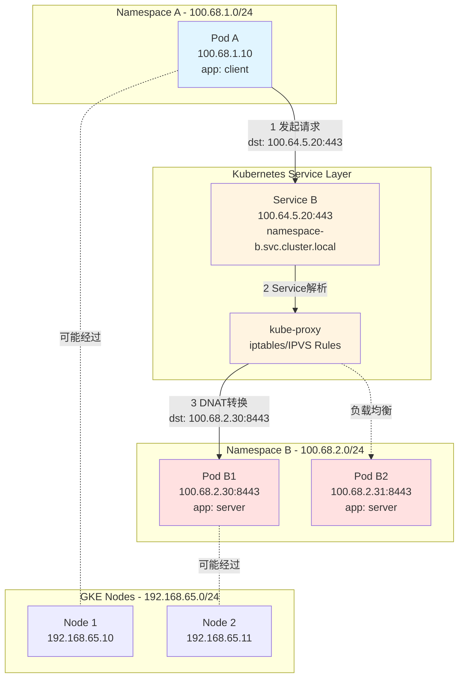
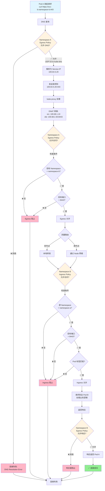
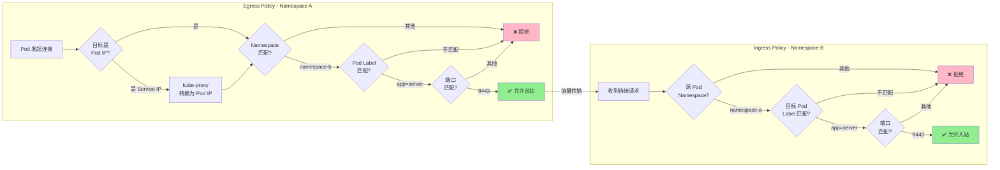
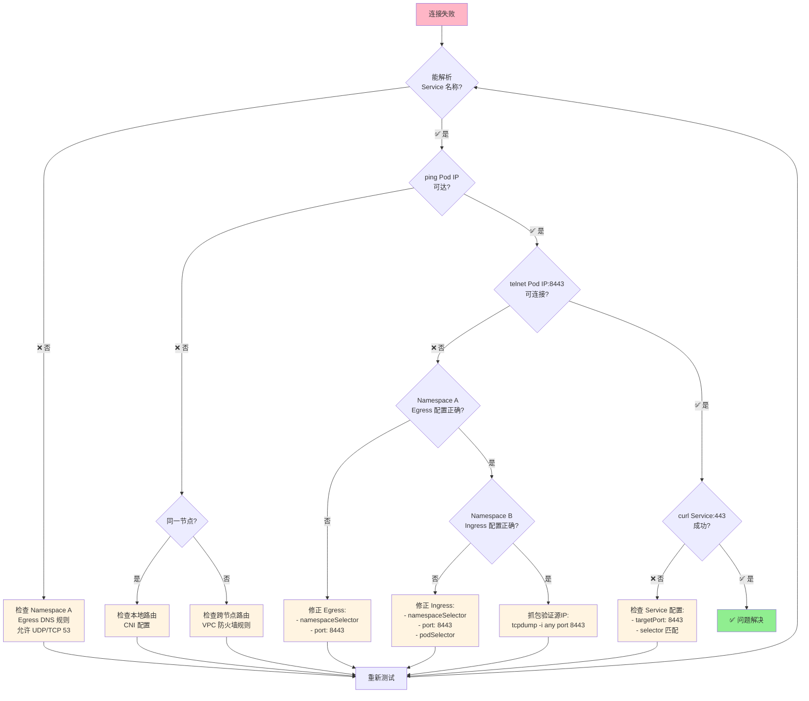
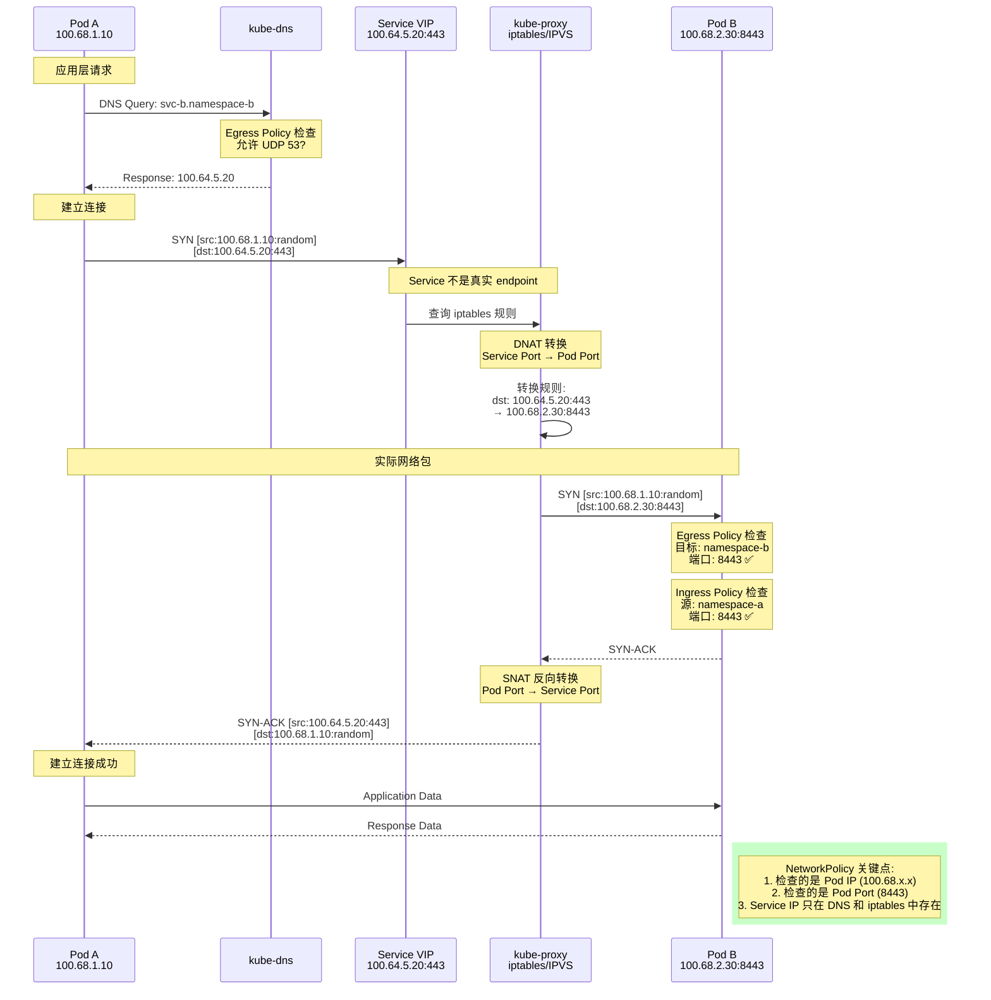
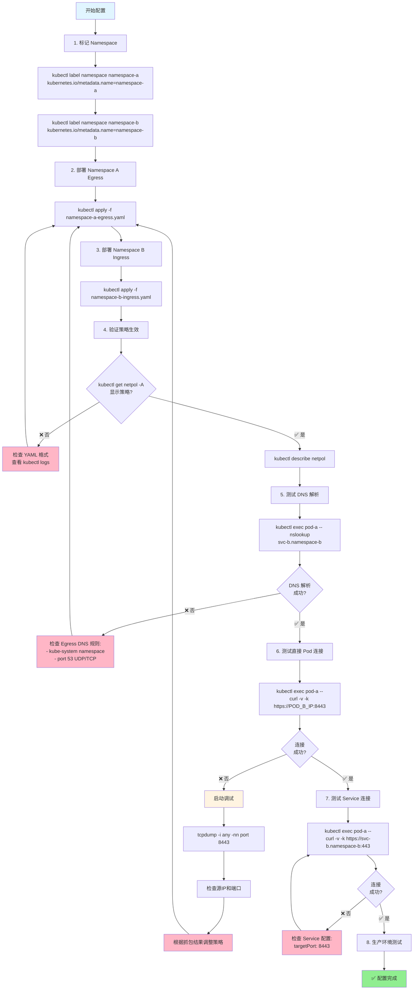

# GKE 跨 Namespace 网络访问完整流程图
our model ==> Routes-based

## 完整的网络流量和策略验证流程

### 1. 整体架构和流量路径



### 2. NetworkPolicy 匹配和验证流程



### 3. 不同 GKE 网络模式下的流量差异

```mermaid
graph TD
    subgraph "VPC-Native 模式 [推荐]"
        VPC1[Pod A<br/>100.68.1.10] -->|直接路由<br/>保持源IP| VPC2[Pod B<br/>100.68.2.30]
        VPC2 -->|看到的源IP:<br/>100.68.1.10| VPC3[✅ NetworkPolicy<br/>匹配 Namespace A]
    end
    
    subgraph "Routes-Based 模式"
        RB1[Pod A<br/>100.68.1.10] -->|经过 Node 1<br/>192.168.65.10| RB2[可能 SNAT]
        RB2 -->|源IP可能变为:<br/>192.168.65.10| RB3[Pod B<br/>100.68.2.30]
        RB3 -->|看到的源IP:<br/>192.168.65.10| RB4[⚠️ NetworkPolicy<br/>可能不匹配]
    end
    
    subgraph "GKE Dataplane V2 [eBPF]"
        DP1[Pod A<br/>100.68.1.10] -->|eBPF 处理<br/>完全保持源IP| DP2[Pod B<br/>100.68.2.30]
        DP2 -->|看到的源IP:<br/>100.68.1.10| DP3[✅ NetworkPolicy<br/>完美匹配]
    end
    
    style VPC3 fill:#90EE90
    style RB4 fill:#FFB6C6
    style DP3 fill:#90EE90
```



### 4. NetworkPolicy 规则匹配详细流程



### 5. 故障排查决策树



### 6. 端口映射和流量转换流程



### 7. 配置应用和验证完整流程



## 关键检查点对照表

|检查项|位置|检查内容|期望值|
|---|---|---|---|
|**DNS 解析**|Namespace A Egress|允许访问 kube-system:53|✅ UDP/TCP 53 开放|
|**目标地址**|Namespace A Egress|namespaceSelector|✅ namespace-b|
|**目标端口**|Namespace A Egress|port|⚠️ **8443** (Pod 端口)|
|**源地址**|Namespace B Ingress|namespaceSelector|✅ namespace-a|
|**目标端口**|Namespace B Ingress|port|⚠️ **8443** (Pod 端口)|
|**Pod 标签**|Namespace B Ingress|podSelector|✅ app: server|
|**Service 配置**|Service YAML|targetPort|⚠️ **8443** (指向 Pod)|
|**Service 配置**|Service YAML|port|✅ 443 (外部访问)|

## 快速验证命令集

```bash
# 1. 验证网络模式
gcloud container clusters describe YOUR_CLUSTER \
  --zone YOUR_ZONE \
  --format="value(ipAllocationPolicy.useIpAliases)"
# 输出: true = VPC-native (推荐)

# 2. 验证 IP 范围
kubectl get nodes -o jsonpath='{.items[*].spec.podCIDR}' | tr ' ' '\n'
kubectl get svc -A -o wide | grep ClusterIP

# 3. 验证 NetworkPolicy
kubectl get networkpolicies -A
kubectl describe networkpolicy -n namespace-a
kubectl describe networkpolicy -n namespace-b

# 4. 实时抓包验证
kubectl exec -it POD_B -n namespace-b -- \
  tcpdump -i any -nn 'port 8443' -A

# 5. 完整连接测试
kubectl exec -it POD_A -n namespace-a -- sh -c '
  echo "=== DNS 测试 ==="
  nslookup svc-b.namespace-b.svc.cluster.local
  
  echo "=== 直接 Pod IP 测试 ==="
  curl -v -k --connect-timeout 5 https://POD_B_IP:8443
  
  echo "=== Service 测试 ==="
  curl -v -k --connect-timeout 5 https://svc-b.namespace-b.svc.cluster.local:443
'
```

通过以上流程图和表格，您可以清晰地理解整个网络访问的每一个环节，以及 NetworkPolicy 在哪个阶段生效。关键要记住：**NetworkPolicy 看到的永远是 Pod IP 和 Pod Port，而不是 Service IP 和 Service Port**。