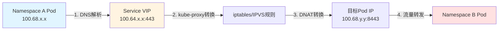

```table-of-contents
```
我有这样一个场景，我在GKE里面 两个不同的namespace 里面部署了API 比如 namespace   A 和 namespace B  我两个都有对应的规则是默认deny all  我现在想要让A里面的pad能够访问 B的 svc 地址 那么我应该配置怎样的网络规则？ 请注意我的Pod的IP址和svc 的IP还有GKE  node 的IP Range 都有各自对应的范围  Pod 100.68 Svc 100.64 GKE node 192.168.65 帮我探索这些对应的规则应该如何创 比如说A egress  B ingress  我的SVC端口是443  我的pod 端口是8443 另外 ，我看到有这样一个说法 GKE Node 是另外的网段（192.168.65.x），但对 NetworkPolicy 不构成影响 但是我在实际的使用中发现不仅仅是这样的 如果寻址的过程中是不是要经过对应的跳点？ 所以gke node 之间也应该打开对应的8443端口? 或者说在哪种模式下需要打开。

# Claude
# GKE 跨 Namespace Pod 访问 Service 的网络策略配置

## 问题分析

您的场景涉及：

- **Namespace A** 的 Pod 需要访问 **Namespace B** 的 Service
- 两个 Namespace 都有默认 deny-all 策略
- IP 地址段：
    - Pod CIDR: `100.68.0.0/16`
    - Service CIDR: `100.64.0.0/16`
    - Node CIDR: `192.168.65.0/24`
- Service 端口：`443`
- Pod 端口：`8443`

关键问题：**Service 访问的流量路径和 NetworkPolicy 的正确配置**

## 流量路径分析



## 关键概念解释

### Service 访问的实际流量特征

当 Pod 访问 Service 时，流量经历以下转换：

1. **源 Pod** 发起请求到 Service IP (`100.64.x.x:443`)
2. **kube-proxy** 规则将目标地址 DNAT 为后端 Pod IP (`100.68.y.y:8443`)
3. **NetworkPolicy** 看到的是：
    - **源地址**：Namespace A 的 Pod IP (`100.68.x.x`)
    - **目标地址**：Namespace B 的 Pod IP (`100.68.y.y`)
    - **目标端口**：Pod 端口 `8443`（不是 Service 端口 443）

### GKE Node IP 的影响

**关于 Node IP 与 NetworkPolicy 的关系：**

|GKE 网络模式|Node IP 是否影响|原因|
|---|---|---|
|**VPC-native (推荐)**|❌ 不影响|Pod 直接使用 VPC 路由，流量不经过 Node IP|
|**Routes-based**|⚠️ 部分影响|跨节点流量可能显示 Node IP 作为源地址|
|**GKE Dataplane V2**|❌ 不影响|使用 eBPF，完全保留原始 Pod IP|

**您遇到的情况可能是：**

- 使用 **Routes-based** 模式
- 或者配置了 **NodePort** 类型的 Service
- 或者存在 **SNAT** 规则

## 正确的 NetworkPolicy 配置

### Namespace A - Egress 策略

允许访问 Namespace B 的 Pod（注意是 Pod IP，不是 Service IP）：

```yaml
apiVersion: networking.k8s.io/v1
kind: NetworkPolicy
metadata:
  name: allow-to-namespace-b
  namespace: namespace-a
spec:
  podSelector: {}  # 应用到 namespace-a 的所有 Pod
  policyTypes:
  - Egress
  egress:
  # 规则1: 允许访问 Namespace B 的 Pod
  - to:
    - namespaceSelector:
        matchLabels:
          kubernetes.io/metadata.name: namespace-b
    - podSelector:
        matchLabels:
          app: your-app-b  # Namespace B 中目标 Pod 的标签
    ports:
    - protocol: TCP
      port: 8443  # 注意：这里是 Pod 端口，不是 Service 端口
  
  # 规则2: 允许 DNS 解析（必需）
  - to:
    - namespaceSelector:
        matchLabels:
          kubernetes.io/metadata.name: kube-system
    - podSelector:
        matchLabels:
          k8s-app: kube-dns
    ports:
    - protocol: UDP
      port: 53
    - protocol: TCP
      port: 53
```

### Namespace B - Ingress 策略

允许来自 Namespace A 的访问：

```yaml
apiVersion: networking.k8s.io/v1
kind: NetworkPolicy
metadata:
  name: allow-from-namespace-a
  namespace: namespace-b
spec:
  podSelector:
    matchLabels:
      app: your-app-b  # Namespace B 中的目标 Pod
  policyTypes:
  - Ingress
  ingress:
  - from:
    - namespaceSelector:
        matchLabels:
          kubernetes.io/metadata.name: namespace-a
    - podSelector:
        matchLabels:
          app: your-app-a  # Namespace A 中的源 Pod（可选，更精确）
    ports:
    - protocol: TCP
      port: 8443  # Pod 监听的端口
```

## 关于 Node IP 和端口的特殊情况

### 场景 1：VPC-native 模式（推荐，无需额外配置）

```bash
# 检查是否为 VPC-native
gcloud container clusters describe CLUSTER_NAME \
  --zone ZONE \
  --format="get(ipAllocationPolicy)"
```

如果输出显示 `useIpAliases: true`，则**不需要**考虑 Node IP。

### 场景 2：Routes-based 或跨节点 SNAT

如果流量经过 Node IP（可通过抓包验证），需要额外配置：

```yaml
apiVersion: networking.k8s.io/v1
kind: NetworkPolicy
metadata:
  name: allow-from-nodes
  namespace: namespace-b
spec:
  podSelector:
    matchLabels:
      app: your-app-b
  policyTypes:
  - Ingress
  ingress:
  # 允许来自 Node CIDR 的流量
  - from:
    - ipBlock:
        cidr: 192.168.65.0/24  # GKE Node IP 范围
    ports:
    - protocol: TCP
      port: 8443
```

### 场景 3：NodePort Service

如果使用 NodePort 类型的 Service：

```yaml
# Namespace A Egress - 需要允许访问 Node IP
apiVersion: networking.k8s.io/v1
kind: NetworkPolicy
metadata:
  name: allow-to-nodeport
  namespace: namespace-a
spec:
  podSelector: {}
  policyTypes:
  - Egress
  egress:
  - to:
    - ipBlock:
        cidr: 192.168.65.0/24
    ports:
    - protocol: TCP
      port: 30000-32767  # NodePort 范围
```

## 验证和故障排查

### 1. 检查 Namespace 标签

```bash
# 确保 Namespace 有正确的标签
kubectl label namespace namespace-a kubernetes.io/metadata.name=namespace-a --overwrite
kubectl label namespace namespace-b kubernetes.io/metadata.name=namespace-b --overwrite
```

### 2. 验证 NetworkPolicy 生效

```bash
# 查看策略
kubectl get networkpolicies -A

# 描述策略详情
kubectl describe networkpolicy allow-to-namespace-b -n namespace-a
kubectl describe networkpolicy allow-from-namespace-a -n namespace-b
```

### 3. 测试连接

```bash
# 从 Namespace A 的 Pod 测试
kubectl exec -it POD_NAME -n namespace-a -- \
  curl -k https://SERVICE_NAME.namespace-b.svc.cluster.local:443

# 或直接测试 Pod IP
kubectl exec -it POD_NAME -n namespace-a -- \
  curl -k https://POD_IP:8443
```

### 4. 抓包分析流量路径

```bash
# 在目标 Pod 上抓包查看源 IP
kubectl exec -it POD_NAME -n namespace-b -- \
  tcpdump -i any -nn port 8443

# 预期看到的源 IP 应该是：
# - VPC-native: 100.68.x.x (Pod IP)
# - Routes-based: 可能是 192.168.65.x (Node IP)
```

## 完整配置示例（推荐方案）

### 完整的 Namespace A 配置

```yaml
apiVersion: networking.k8s.io/v1
kind: NetworkPolicy
metadata:
  name: namespace-a-policy
  namespace: namespace-a
spec:
  podSelector: {}
  policyTypes:
  - Ingress
  - Egress
  
  # 默认 deny all
  ingress: []
  
  egress:
  # 允许访问 Namespace B
  - to:
    - namespaceSelector:
        matchLabels:
          kubernetes.io/metadata.name: namespace-b
    ports:
    - protocol: TCP
      port: 8443
  
  # 允许 DNS
  - to:
    - namespaceSelector:
        matchLabels:
          kubernetes.io/metadata.name: kube-system
    ports:
    - protocol: UDP
      port: 53
    - protocol: TCP
      port: 53
  
  # 允许访问 Kubernetes API（可选）
  - to:
    - ipBlock:
        cidr: 0.0.0.0/0
        except:
        - 169.254.169.254/32  # 排除 metadata server
    ports:
    - protocol: TCP
      port: 443
    - protocol: TCP
      port: 6443
```

### 完整的 Namespace B 配置

```yaml
apiVersion: networking.k8s.io/v1
kind: NetworkPolicy
metadata:
  name: namespace-b-policy
  namespace: namespace-b
spec:
  podSelector:
    matchLabels:
      app: your-app-b
  policyTypes:
  - Ingress
  - Egress
  
  ingress:
  # 允许来自 Namespace A
  - from:
    - namespaceSelector:
        matchLabels:
          kubernetes.io/metadata.name: namespace-a
    ports:
    - protocol: TCP
      port: 8443
  
  egress:
  # 允许 DNS
  - to:
    - namespaceSelector:
        matchLabels:
          kubernetes.io/metadata.name: kube-system
    ports:
    - protocol: UDP
      port: 53
    - protocol: TCP
      port: 53
```

## 注意事项

1. **端口映射**：
    
    - Service 端口 (443) ≠ Pod 端口 (8443)
    - NetworkPolicy 必须配置 **Pod 端口** (8443)
2. **DNS 解析**：
    
    - 必须允许 Egress 到 kube-system 的 DNS
    - 否则无法解析 Service 名称
3. **GKE 模式检查**：
    
    - 优先使用 VPC-native 模式
    - 避免不必要的 Node IP 复杂性
4. **测试策略**：
    
    - 先配置 Egress，再配置 Ingress
    - 逐步放开权限，使用抓包验证
5. **标签选择器**：
    
    - `namespaceSelector` 和 `podSelector` 是 **AND** 关系
    - 如果只写 `namespaceSelector`，则匹配该 Namespace 的所有 Pod

通过以上配置，您应该能够实现 Namespace A 到 Namespace B 的安全访问。如果仍有问题，建议使用 `tcpdump` 抓包验证实际的流量路径和源 IP。

## Claude Flow


# ChatGPT 
下面给你一个**清晰、可直接使用、符合你现在 GKE 场景（多 Namespace / 默认 deny all / Pod 与 SVC 不同网段）**的完整方案。

---

# **🧩 场景说明**

  

你在 **Namespace A** 与 **Namespace B** 都启用了 NetworkPolicy，并且**默认 deny all**。

  

你希望：

- **A 中的 Pod（100.68.x.x）能够访问 B 的 Service（100.64.x.x:443）**
    
- A 的 Pod 自身监听端口可能是 8443（但对访问 B 来说不重要）
    
- GKE Node 是另外的网段（192.168.65.x），但对 NetworkPolicy 不构成影响
    

---

# **✅ 问题核心分析**

  

在 Kubernetes 网络模型中：

  

➡ **Pod → Service** 的流量，本质上还是 **Pod → Pod（后端 Endpoint）**

➡ 所以 NetworkPolicy 需要允许 **A 的 Pod Egress** 和 **B 的 Pod Ingress**

  

因此你要做两件事：

1. **在 Namespace A：允许到 Namespace B 的 egress：443**
    
2. **在 Namespace B：允许来自 Namespace A 的 ingress：目标 Pod 端口（通常是容器端口，例如 8443，如果你的 SVC 后端 Pod 暴露的是 8443）**
    

  

你无需允许访问 Service IP（100.64.x.x）范围，NetworkPolicy 不匹配 ServiceIP，只匹配 **Pod 的 IP**（endpoint）。

---

# **✅ 最佳实践做法：用 namespaceSelector + podSelector**

  

使用 Namespace label 最干净、可维护。

  

先给 namespace 加 label：

```
# 检查权限，确保能修改 namespace
kubectl label ns A access=ns-a
kubectl label ns B access=ns-b
```

---

# **✅ NetworkPolicy 配置**

  

## **🟦 1. Namespace A：允许 Pod 访问 Namespace B 的 443 端口（目标 svc）**

  

文件：allow-a-to-b-egress.yaml

```
apiVersion: networking.k8s.io/v1
kind: NetworkPolicy
metadata:
  name: allow-a-to-b-egress
  namespace: A
spec:
  podSelector: {}  # A namespace 中所有 Pod
  policyTypes:
    - Egress
  egress:
    - to:
        - namespaceSelector:
            matchLabels:
              access: ns-b
      ports:
        - protocol: TCP
          port: 443  # 访问 B 的 Service 暴露的端口
```

---

## **🟩 2. Namespace B：允许来自 Namespace A 的流量进入 Pod 的 8443**

  

文件：allow-b-ingress-from-a.yaml

```
apiVersion: networking.k8s.io/v1
kind: NetworkPolicy
metadata:
  name: allow-b-ingress-from-a
  namespace: B
spec:
  podSelector: {}  # B namespace 的所有 Pod（或选特定 label）
  policyTypes:
    - Ingress
  ingress:
    - from:
        - namespaceSelector:
            matchLabels:
              access: ns-a
      ports:
        - protocol: TCP
          port: 8443  # B 的 Pod 实际监听端口
```

---

# **🔥 完整流量路径说明（非常关键）**

  

你的调用链：

```
A/Pod (100.68.x)  →  B/Service (100.64.x)  →  B/Pod (100.68.x)
```

NetworkPolicy 实际生效点：

|**流量方向**|**匹配对象**|**你需要的规则**|
|---|---|---|
|egress|A/Pod → B/Pod|在 namespace A 开 443|
|ingress|B/Pod ← A/Pod|在 namespace B 开 8443|

Service IP 不参与 NP 匹配。

---

# **📘 流程图（Mermaid）**

```
graph TD
    A1[Namespace A Pod<br>100.68.x.x] -->|TCP 443| SVC1[Namespace B Service<br>100.64.x.x]
    SVC1 -->|Endpoint→ Pod:8443| B1[Namespace B Pod<br>100.68.x.x]

    subgraph A[Namespace A]
      A1
    end

    subgraph B[Namespace B]
      SVC1
      B1
    end
```

---

# **⚠️ 注意事项（非常重要）**

  

### **✔ NetworkPolicy 只匹配 Pod，不匹配 Service IP**

  

你不能用 100.64.x.x（Service ClusterIP）在 policy 中。

  

### **✔ 你必须确保 B 后端 pod 的 port 与 SVC targetPort 一致**

  

例如：

```
ports:
  - name: https
    port: 443
    targetPort: 8443
```

NP 中应该允许 **8443**，不是 443。

  

### **✔ 如果你只想特定 A 中的 Pod 可以访问**

  

修改：

```
podSelector:
  matchLabels:
    app: my-api
```

### **✔ 不需要配置 Node 地址范围（192.168.65.x）**

  

NetworkPolicy 并不限制 Node → Pod NAT 流量。

---

# **✅ 总结（最简答案）**

  

你需要两个 NetworkPolicy：

1. **A 的 Egress：允许到 B 的 namespaceSelector + port 443**
    
2. **B 的 Ingress：允许来自 A 的 namespaceSelector + port 8443**
    

  

即可完成跨 namespace 且默认 deny-all 的访问控制。

---

如果你愿意，我可以帮你：

- 自动生成 Helm Chart 版本
    
- 或根据你真实服务的 label 做更精确匹配
    
- 或画出 eBPF / Cilium 的实际 datapath
    

  

要继续吗？

下面我来**针对你提出的“Node 网段是否需要开端口”这个关键点做更深入的解释**，并结合你在 GKE 中的实际情况提供一个**可直接用于判断的模式图**，帮助你完全理解在什么模式下需要开 Node → Node 的端口。

---

# **#️⃣ 问题核心：**

# **Pod → Pod 的流量是否经过 Node → Node？**

  

答案是：

  

> **取决于你使用的 GKE CNI，是 VPC-native（默认）还是 Calico CNI（Custom）、以及是否启用了 Dataplane V2。**

>   

> **不同模式下，对 Node 之间是否需要开端口的影响完全不同。**

  

下面帮你分类讲清楚。

---

# **✅ 你的访问流程本质上是：**

```
Namespace A / Pod(100.68.x.x)
    → Service(100.64.x.x)
        → Endpoint → Namespace B / Pod(100.68.x.x)
```

在 Kubernetes 中，**Pod IP 是 VPC 可路由的（如果使用 VPC-native）**

因此，真正的流量路径通常是：

```
PodA (nodeA)
    → nodeA cni/router
        → VPC 路由
            → nodeB cni/router
                → PodB
```

所以你才会发现：

  

> **Node 网段 192.168.65 是否开放端口，会影响 Pod → Pod 的通信。**

  

非常正确，这只发生在某些模式。

---

# **#️⃣ 正确理解：哪些 GKE 模式需要打开 Node → Node 端口？**

|**GKE 模式**|**Pod → Pod 流量是否经过 Node → Node**|**是否需要 Node firewall rule 或 Node 端口**|**解释**|
|---|---|---|---|
|**Dataplane V2（GKE 默认）**|✔ 会经过 Node 网桥，但由 eBPF 处理|❌ 不需要开 Node 端口|Pod NAT & NodePort 不再依赖 iptables|
|**VPC-native (IP alias) + Dataplane V1**|✔ 会经过 Node → Node 路由|🔥 有时需要开 Node → Node 端口（你遇到的情况）|Pod traffic 经 node 的路由表转发|
|**Calico policy（非官方 CNI）**|✔ 一定经过 Node → Node|✔ 必须开 Node 间端口|因为 Calico enforcement 在 node 层|
|**非 VPC-native (legacy CNI)**|✔|✔|已很少使用|

你的情况（各种子网）：

- Pod：100.68.x.x
    
- Service：100.64.x.x
    
- Node：192.168.65.x
    

  

这高度符合：

  

> **你在使用 VPC-native + Dataplane V1（非 eBPF）。**

>   

> 这种模式下：**Pod → Pod 依赖 Node → Node 的路由与端口开放，因此节点之间的端口 8443 需要允许通过。**

---

# **#️⃣ 那么什么时候你需要开 Node → Node 端口？**

  

下面是明确判断方法：

---

## **✅** 

## **需要打开 Node → Node 端口的情况**

  

**只要你是 Dataplane V1 → Pod 流量由 Node iptables/ip-forward 处理**

就必须允许 Node 之间的端口访问，例如：

```
Node(192.168.65.x) → Node(192.168.65.y):8443
```

也就是说：

  

### **🎯 如果你的 GKE 没开启 Dataplane V2（eBPF）**

  

➡️ **你必须开 Node → Node：8443**

---

## **❌** 

## **不需要打开 Node → Node 端口的情况**

  

### **🎯 如果启用了 Dataplane V2（基于 eBPF）**

  

特点：

- 不依赖 Node iptables
    
- Pod → Pod routing 在 eBPF hook 层完成
    
- 不需要 Node 上开放目标端口
    

  

> Dataplane V2 完全不需要打开 Node → Node 端口，即使 Pod → Pod 走不同节点。

---

# **#️⃣ 你如何确认当前 GKE 是否用 Dataplane V1 or V2？**

  

运行：

```
gcloud container clusters describe <cluster-name> \
  --region <region> | grep dataplane
```

结果示例：

  

### **如果看到：**

```
dataplaneVersion: ADVANCED_DATAPLANE
```

➡ **你是 Dataplane V2（eBPF） → 不需要 Node → Node policy**

  

### **如果没有 dataplaneVersion 或为空**

  

➡ **你是 Dataplane V1 → 必须开 Node → Node policy**

---

# **#️⃣ 图解：你的流量路径**

```
graph TD
    A[Pod A 100.68.x.x<br>Namespace A]
        -->|TCP 443| NA[Node A 192.168.65.x]

    NA -->|VPC 路由| NB[Node B 192.168.65.y]

    NB -->|forward to 8443| B[Pod B 100.68.x.x<br>Namespace B]

    subgraph NodeLayer[Node Routing Layer]
      NA
      NB
    end
```

---

# **#️⃣ 总结一句话（你的场景结论）**

  

> **你遇到的情况是正常的，因为你当前用的是 Dataplane V1（非 eBPF），Pod → Pod 流量依赖 Node → Node，因此 Node 间需要允许对应端口（例如 8443）通信。**

---

# **#️⃣ 如果你想避免 Node → Node 端口问题**

  

我建议：

  

### **✔ 迁移到 Dataplane V2（Advanced Dataplane）**

  

只需修改 Cluster：

```
gcloud container clusters update <cluster-name> \
  --dataplane-v2
```

之后：

- NetworkPolicy 在 eBPF 层执行
    
- 不依赖 Node iptables
    
- 不再需要 Node → Node firewall rules
    
- 性能更高，延迟更低
    

---

如果你愿意，我还可以帮你：

  

🔧 绘制你的 GKE 实际网络拓扑（Pod / Service / Node / VPC）

🔧 给你一个最完整的 NetworkPolicy + Firewall Rules 的组合最佳实践

🔧 帮你判断是否适合迁到 Dataplane V2

  

只需要告诉我：

**你的 GKE 版本、CNI、Dataplane 状态。**


