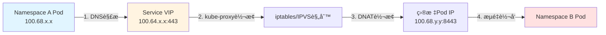

```table-of-contents
```
我有这样一个场景，我在GKEé‡Œé¢ ä¸¤ä¸ªä¸åŒçš„namespace 里é¢éƒ¨ç½²äº†API 比如 namespace   A å’Œ namespace B  我两个都有对应的规则是默认deny all  我ç°åœ¨æƒ³è¦è®©A里é¢çš„pad能够访问 Bçš„ svc åœ°å€ é‚£ä¹ˆæˆ‘åº”è¯¥é…ç½®æ€æ ·çš„网络规则？ 请注æ„我的Podçš„IPå€å’Œsvc çš„IP还有GKE  node çš„IP Range 都有å„自对应的范围  Pod 100.68 Svc 100.64 GKE node 192.168.65 帮我æ¢ç´¢è¿™äº›å¯¹åº”的规则应该如何创 比如说A egress  B ingress  我的SVC端å£æ˜¯443  我的pod 端å£æ˜¯8443 å¦å¤– ，我看到有这样一个说法 GKE Node 是å¦å¤–的网段（192.168.65.x），但对 NetworkPolicy ä¸æ„æˆå½±å“ 但是我在å®é™…的使用中å‘ç°ä¸ä»…仅是这样的 如æœå¯»å€çš„过程中是ä¸æ˜¯è¦ç»è¿‡å¯¹åº”的跳点？ 所以gke node 之间也应该打开对应的8443端å£? 或者说在哪ç§æ¨¡å¼ä¸‹éœ€è¦æ‰“开。

# Claude
# GKE è·¨ Namespace Pod 访问 Service 的网络策略é…ç½®

## 问题分æ

您的场景涉åŠï¼š

- **Namespace A** çš„ Pod 需è¦è®¿é—® **Namespace B** çš„ Service
- 两个 Namespace 都有默认 deny-all 策略
- IP 地å€æ®µï¼š
    - Pod CIDR: `100.68.0.0/16`
    - Service CIDR: `100.64.0.0/16`
    - Node CIDR: `192.168.65.0/24`
- Service 端å£ï¼š`443`
- Pod 端å£ï¼š`8443`

关键问题：**Service 访问的æµé‡è·¯å¾„å’Œ NetworkPolicy 的正确é…ç½®**

## æµé‡è·¯å¾„分æ



## 关键概念解释

### Service 访问的å®é™…æµé‡ç‰¹å¾

当 Pod 访问 Service 时，æµé‡ç»å†ä»¥ä¸‹è½¬æ¢ï¼š

1. **æº Pod** å‘起请求到 Service IP (`100.64.x.x:443`)
2. **kube-proxy** è§„åˆ™å°†ç›®æ ‡åœ°å€ DNAT 为å端 Pod IP (`100.68.y.y:8443`)
3. **NetworkPolicy** 看到的是：
    - **æºåœ°å€**：Namespace A çš„ Pod IP (`100.68.x.x`)
    - **目标地å€**：Namespace B çš„ Pod IP (`100.68.y.y`)
    - **目标端å£**：Pod ç«¯å£ `8443`（ä¸æ˜¯ Service ç«¯å£ 443）

### GKE Node IP çš„å½±å“

**å…³äº Node IP ä¸ NetworkPolicy 的关系：**

|GKE 网络模å¼|Node IP 是å¦å½±å“|åŸå› |
|---|---|---|
|**VPC-native (æ¨è)**|⌠ä¸å½±å“|Pod ç›´æ¥ä½¿ç”¨ VPC 路由，æµé‡ä¸ç»è¿‡ Node IP|
|**Routes-based**|âš ï¸ éƒ¨åˆ†å½±å“|跨节点æµé‡å¯èƒ½æ˜¾ç¤º Node IP 作为æºåœ°å€|
|**GKE Dataplane V2**|⌠ä¸å½±å“|使用 eBPF，完全ä¿ç•™åŸå§‹ Pod IP|

**您é‡åˆ°çš„情况å¯èƒ½æ˜¯ï¼š**

- 使用 **Routes-based** 模å¼
- 或者é…置了 **NodePort** ç±»å‹çš„ Service
- 或者存在 **SNAT** 规则

## 正确的 NetworkPolicy é…ç½®

### Namespace A - Egress ç­–ç•¥

å…许访问 Namespace B çš„ Pod（注æ„是 Pod IP，ä¸æ˜¯ Service IP）：

```yaml
apiVersion: networking.k8s.io/v1
kind: NetworkPolicy
metadata:
  name: allow-to-namespace-b
  namespace: namespace-a
spec:
  podSelector: {}  # 应用到 namespace-a 的所有 Pod
  policyTypes:
  - Egress
  egress:
  # 规则1: å…许访问 Namespace B çš„ Pod
  - to:
    - namespaceSelector:
        matchLabels:
          kubernetes.io/metadata.name: namespace-b
    - podSelector:
        matchLabels:
          app: your-app-b  # Namespace B 中目标 Pod 的标签
    ports:
    - protocol: TCP
      port: 8443  # 注æ„：这里是 Pod 端å£ï¼Œä¸æ˜¯ Service 端å£
  
  # 规则2: å…许 DNS 解æ（必需）
  - to:
    - namespaceSelector:
        matchLabels:
          kubernetes.io/metadata.name: kube-system
    - podSelector:
        matchLabels:
          k8s-app: kube-dns
    ports:
    - protocol: UDP
      port: 53
    - protocol: TCP
      port: 53
```

### Namespace B - Ingress ç­–ç•¥

å…许æ¥è‡ª Namespace A 的访问：

```yaml
apiVersion: networking.k8s.io/v1
kind: NetworkPolicy
metadata:
  name: allow-from-namespace-a
  namespace: namespace-b
spec:
  podSelector:
    matchLabels:
      app: your-app-b  # Namespace B 中的目标 Pod
  policyTypes:
  - Ingress
  ingress:
  - from:
    - namespaceSelector:
        matchLabels:
          kubernetes.io/metadata.name: namespace-a
    - podSelector:
        matchLabels:
          app: your-app-a  # Namespace A ä¸­çš„æº Pod（å¯é€‰ï¼Œæ›´ç²¾ç¡®ï¼‰
    ports:
    - protocol: TCP
      port: 8443  # Pod 监å¬çš„端å£
```

## å…³äº Node IP 和端å£çš„特殊情况

### 场景 1：VPC-native 模å¼ï¼ˆæ¨è，无需é¢å¤–é…置）

```bash
# 检查是å¦ä¸º VPC-native
gcloud container clusters describe CLUSTER_NAME \
  --zone ZONE \
  --format="get(ipAllocationPolicy)"
```

如æœè¾“出显示 `useIpAliases: true`，则**ä¸éœ€è¦**考虑 Node IP。

### 场景 2：Routes-based 或跨节点 SNAT

如æœæµé‡ç»è¿‡ Node IP（å¯é€šè¿‡æŠ“包验è¯ï¼‰ï¼Œéœ€è¦é¢å¤–é…置：

```yaml
apiVersion: networking.k8s.io/v1
kind: NetworkPolicy
metadata:
  name: allow-from-nodes
  namespace: namespace-b
spec:
  podSelector:
    matchLabels:
      app: your-app-b
  policyTypes:
  - Ingress
  ingress:
  # å…许æ¥è‡ª Node CIDR çš„æµé‡
  - from:
    - ipBlock:
        cidr: 192.168.65.0/24  # GKE Node IP 范围
    ports:
    - protocol: TCP
      port: 8443
```

### 场景 3：NodePort Service

如æœä½¿ç”¨ NodePort ç±»å‹çš„ Service：

```yaml
# Namespace A Egress - 需è¦å…许访问 Node IP
apiVersion: networking.k8s.io/v1
kind: NetworkPolicy
metadata:
  name: allow-to-nodeport
  namespace: namespace-a
spec:
  podSelector: {}
  policyTypes:
  - Egress
  egress:
  - to:
    - ipBlock:
        cidr: 192.168.65.0/24
    ports:
    - protocol: TCP
      port: 30000-32767  # NodePort 范围
```

## 验è¯å’Œæ•…éšœæ’查

### 1. 检查 Namespace 标签

```bash
# ç¡®ä¿ Namespace 有正确的标签
kubectl label namespace namespace-a kubernetes.io/metadata.name=namespace-a --overwrite
kubectl label namespace namespace-b kubernetes.io/metadata.name=namespace-b --overwrite
```

### 2. éªŒè¯ NetworkPolicy 生效

```bash
# 查看策略
kubectl get networkpolicies -A

# æ述策略详情
kubectl describe networkpolicy allow-to-namespace-b -n namespace-a
kubectl describe networkpolicy allow-from-namespace-a -n namespace-b
```

### 3. 测试è¿æ¥

```bash
# ä» Namespace A çš„ Pod 测试
kubectl exec -it POD_NAME -n namespace-a -- \
  curl -k https://SERVICE_NAME.namespace-b.svc.cluster.local:443

# 或直æ¥æµ‹è¯• Pod IP
kubectl exec -it POD_NAME -n namespace-a -- \
  curl -k https://POD_IP:8443
```

### 4. 抓包分ææµé‡è·¯å¾„

```bash
# 在目标 Pod ä¸ŠæŠ“åŒ…æŸ¥çœ‹æº IP
kubectl exec -it POD_NAME -n namespace-b -- \
  tcpdump -i any -nn port 8443

# é¢„æœŸçœ‹åˆ°çš„æº IP 应该是：
# - VPC-native: 100.68.x.x (Pod IP)
# - Routes-based: å¯èƒ½æ˜¯ 192.168.65.x (Node IP)
```

## 完整é…置示例（æ¨è方案）

### 完整的 Namespace A é…ç½®

```yaml
apiVersion: networking.k8s.io/v1
kind: NetworkPolicy
metadata:
  name: namespace-a-policy
  namespace: namespace-a
spec:
  podSelector: {}
  policyTypes:
  - Ingress
  - Egress
  
  # 默认 deny all
  ingress: []
  
  egress:
  # å…许访问 Namespace B
  - to:
    - namespaceSelector:
        matchLabels:
          kubernetes.io/metadata.name: namespace-b
    ports:
    - protocol: TCP
      port: 8443
  
  # å…许 DNS
  - to:
    - namespaceSelector:
        matchLabels:
          kubernetes.io/metadata.name: kube-system
    ports:
    - protocol: UDP
      port: 53
    - protocol: TCP
      port: 53
  
  # å…许访问 Kubernetes API（å¯é€‰ï¼‰
  - to:
    - ipBlock:
        cidr: 0.0.0.0/0
        except:
        - 169.254.169.254/32  # æ’除 metadata server
    ports:
    - protocol: TCP
      port: 443
    - protocol: TCP
      port: 6443
```

### 完整的 Namespace B é…ç½®

```yaml
apiVersion: networking.k8s.io/v1
kind: NetworkPolicy
metadata:
  name: namespace-b-policy
  namespace: namespace-b
spec:
  podSelector:
    matchLabels:
      app: your-app-b
  policyTypes:
  - Ingress
  - Egress
  
  ingress:
  # å…许æ¥è‡ª Namespace A
  - from:
    - namespaceSelector:
        matchLabels:
          kubernetes.io/metadata.name: namespace-a
    ports:
    - protocol: TCP
      port: 8443
  
  egress:
  # å…许 DNS
  - to:
    - namespaceSelector:
        matchLabels:
          kubernetes.io/metadata.name: kube-system
    ports:
    - protocol: UDP
      port: 53
    - protocol: TCP
      port: 53
```

## 注æ„事项

1. **端å£æ˜ å°„**：
    
    - Service ç«¯å£ (443) ≠ Pod ç«¯å£ (8443)
    - NetworkPolicy å¿…é¡»é…ç½® **Pod 端å£** (8443)
2. **DNS 解æ**：
    
    - å¿…é¡»å…许 Egress 到 kube-system çš„ DNS
    - å¦åˆ™æ— æ³•è§£æ Service å称
3. **GKE 模å¼æ£€æŸ¥**：
    
    - 优先使用 VPC-native 模å¼
    - é¿å…ä¸å¿…è¦çš„ Node IP å¤æ‚性
4. **测试策略**：
    
    - å…ˆé…ç½® Egress，å†é…ç½® Ingress
    - é€æ­¥æ”¾å¼€æƒé™ï¼Œä½¿ç”¨æŠ“包验è¯
5. **标签选择器**：
    
    - `namespaceSelector` 和 `podSelector` 是 **AND** 关系
    - 如æœåªå†™ `namespaceSelector`，则匹é…该 Namespace 的所有 Pod

通过以上é…置，您应该能够å®ç° Namespace A 到 Namespace B 的安全访问。如æœä»æœ‰é—®é¢˜ï¼Œå»ºè®®ä½¿ç”¨ `tcpdump` 抓包验è¯å®é™…çš„æµé‡è·¯å¾„å’Œæº IP。

## Claude Flow


# ChatGPT 
下é¢ç»™ä½ ä¸€ä¸ª**清晰ã€å¯ç›´æ¥ä½¿ç”¨ã€ç¬¦åˆä½ ç°åœ¨ GKE 场景（多 Namespace / 默认 deny all / Pod ä¸ SVC ä¸åŒç½‘段）**的完整方案。

---

# **🧩 场景说æ˜**

  

你在 **Namespace A** ä¸ **Namespace B** 都å¯ç”¨äº† NetworkPolicy，并且**默认 deny all**。

  

你希望：

- **A 中的 Pod（100.68.x.x）能够访问 B 的 Service（100.64.x.x:443）**
    
- A çš„ Pod 自身监å¬ç«¯å£å¯èƒ½æ˜¯ 8443（但对访问 B æ¥è¯´ä¸é‡è¦ï¼‰
    
- GKE Node 是å¦å¤–的网段（192.168.65.x），但对 NetworkPolicy ä¸æ„æˆå½±å“
    

---

# **✅ 问题核心分æ**

  

在 Kubernetes 网络模å‹ä¸­ï¼š

  

â¡ **Pod → Service** çš„æµé‡ï¼Œæœ¬è´¨ä¸Šè¿˜æ˜¯ **Pod → Pod（å端 Endpoint）**

⡠所以 NetworkPolicy 需è¦å…许 **A çš„ Pod Egress** å’Œ **B çš„ Pod Ingress**

  

因此你è¦åšä¸¤ä»¶äº‹ï¼š

1. **在 Namespace A：å…许到 Namespace B çš„ egress：443**
    
2. **在 Namespace B：å…许æ¥è‡ª Namespace A çš„ ingress：目标 Pod 端å£ï¼ˆé€šå¸¸æ˜¯å®¹å™¨ç«¯å£ï¼Œä¾‹å¦‚ 8443，如æœä½ çš„ SVC å端 Pod 暴露的是 8443）**
    

  

你无需å…许访问 Service IP（100.64.x.x）范围，NetworkPolicy ä¸åŒ¹é… ServiceIP，åªåŒ¹é… **Pod çš„ IP**（endpoint）。

---

# **✅ 最佳å®è·µåšæ³•ï¼šç”¨ namespaceSelector + podSelector**

  

使用 Namespace label 最干净ã€å¯ç»´æŠ¤ã€‚

  

先给 namespace 加 label：

```
# 检查æƒé™ï¼Œç¡®ä¿èƒ½ä¿®æ”¹ namespace
kubectl label ns A access=ns-a
kubectl label ns B access=ns-b
```

---

# **✅ NetworkPolicy é…ç½®**

  

## **🟦 1. Namespace A：å…许 Pod 访问 Namespace B çš„ 443 端å£ï¼ˆç›®æ ‡ svc）**

  

文件：allow-a-to-b-egress.yaml

```
apiVersion: networking.k8s.io/v1
kind: NetworkPolicy
metadata:
  name: allow-a-to-b-egress
  namespace: A
spec:
  podSelector: {}  # A namespace 中所有 Pod
  policyTypes:
    - Egress
  egress:
    - to:
        - namespaceSelector:
            matchLabels:
              access: ns-b
      ports:
        - protocol: TCP
          port: 443  # 访问 B çš„ Service 暴露的端å£
```

---

## **🟩 2. Namespace B：å…许æ¥è‡ª Namespace A çš„æµé‡è¿›å…¥ Pod çš„ 8443**

  

文件：allow-b-ingress-from-a.yaml

```
apiVersion: networking.k8s.io/v1
kind: NetworkPolicy
metadata:
  name: allow-b-ingress-from-a
  namespace: B
spec:
  podSelector: {}  # B namespace 的所有 Pod（或选特定 label）
  policyTypes:
    - Ingress
  ingress:
    - from:
        - namespaceSelector:
            matchLabels:
              access: ns-a
      ports:
        - protocol: TCP
          port: 8443  # B çš„ Pod å®é™…监å¬ç«¯å£
```

---

# **🔥 完整æµé‡è·¯å¾„说æ˜ï¼ˆé常关键）**

  

你的调用链：

```
A/Pod (100.68.x)  →  B/Service (100.64.x)  →  B/Pod (100.68.x)
```

NetworkPolicy å®é™…生效点：

|**æµé‡æ–¹å‘**|**匹é…对象**|**你需è¦çš„规则**|
|---|---|---|
|egress|A/Pod → B/Pod|在 namespace A 开 443|
|ingress|B/Pod ↠A/Pod|在 namespace B 开 8443|

Service IP ä¸å‚ä¸ NP 匹é…。

---

# **📘 æµç¨‹å›¾ï¼ˆMermaid）**

```
graph TD
    A1[Namespace A Pod<br>100.68.x.x] -->|TCP 443| SVC1[Namespace B Service<br>100.64.x.x]
    SVC1 -->|Endpoint→ Pod:8443| B1[Namespace B Pod<br>100.68.x.x]

    subgraph A[Namespace A]
      A1
    end

    subgraph B[Namespace B]
      SVC1
      B1
    end
```

---

# **âš ï¸ æ³¨æ„事项（é常é‡è¦ï¼‰**

  

### **✔ NetworkPolicy åªåŒ¹é… Pod，ä¸åŒ¹é… Service IP**

  

ä½ ä¸èƒ½ç”¨ 100.64.x.x（Service ClusterIP）在 policy 中。

  

### **✔ ä½ å¿…é¡»ç¡®ä¿ B å端 pod çš„ port ä¸ SVC targetPort 一致**

  

例如：

```
ports:
  - name: https
    port: 443
    targetPort: 8443
```

NP 中应该å…许 **8443**，ä¸æ˜¯ 443。

  

### **✔ 如æœä½ åªæƒ³ç‰¹å®š A 中的 Pod å¯ä»¥è®¿é—®**

  

修改：

```
podSelector:
  matchLabels:
    app: my-api
```

### **✔ ä¸éœ€è¦é…ç½® Node 地å€èŒƒå›´ï¼ˆ192.168.65.x）**

  

NetworkPolicy 并ä¸é™åˆ¶ Node → Pod NAT æµé‡ã€‚

---

# **✅ 总结（最简答案）**

  

你需è¦ä¸¤ä¸ª NetworkPolicy：

1. **A çš„ Egress：å…许到 B çš„ namespaceSelector + port 443**
    
2. **B çš„ Ingress：å…许æ¥è‡ª A çš„ namespaceSelector + port 8443**
    

  

å³å¯å®Œæˆè·¨ namespace 且默认 deny-all 的访问æ§åˆ¶ã€‚

---

如æœä½ æ„¿æ„，我å¯ä»¥å¸®ä½ ï¼š

- è‡ªåŠ¨ç”Ÿæˆ Helm Chart 版本
    
- 或根æ®ä½ çœŸå®æœåŠ¡çš„ label åšæ›´ç²¾ç¡®åŒ¹é…
    
- 或画出 eBPF / Cilium çš„å®é™… datapath
    

  

è¦ç»§ç»­å—？

下é¢æˆ‘æ¥**针对你æ出的“Node 网段是å¦éœ€è¦å¼€ç«¯å£â€è¿™ä¸ªå…³é”®ç‚¹åšæ›´æ·±å…¥çš„解释**，并结åˆä½ åœ¨ GKE 中的å®é™…情况æ供一个**å¯ç›´æ¥ç”¨äºåˆ¤æ–­çš„模å¼å›¾**，帮助你完全ç†è§£åœ¨ä»€ä¹ˆæ¨¡å¼ä¸‹éœ€è¦å¼€ Node → Node 的端å£ã€‚

---

# **#ï¸âƒ£ 问题核心：**

# **Pod → Pod çš„æµé‡æ˜¯å¦ç»è¿‡ Node → Node？**

  

答案是：

  

> **å–决äºä½ ä½¿ç”¨çš„ GKE CNI，是 VPC-native（默认）还是 Calico CNI（Custom）ã€ä»¥åŠæ˜¯å¦å¯ç”¨äº† Dataplane V2。**

>   

> **ä¸åŒæ¨¡å¼ä¸‹ï¼Œå¯¹ Node 之间是å¦éœ€è¦å¼€ç«¯å£çš„å½±å“完全ä¸åŒã€‚**

  

下é¢å¸®ä½ åˆ†ç±»è®²æ¸…楚。

---

# **✅ 你的访问æµç¨‹æœ¬è´¨ä¸Šæ˜¯ï¼š**

```
Namespace A / Pod(100.68.x.x)
    → Service(100.64.x.x)
        → Endpoint → Namespace B / Pod(100.68.x.x)
```

在 Kubernetes 中，**Pod IP 是 VPC å¯è·¯ç”±çš„（如æœä½¿ç”¨ VPC-native）**

因此，真正的æµé‡è·¯å¾„通常是：

```
PodA (nodeA)
    → nodeA cni/router
        → VPC 路由
            → nodeB cni/router
                → PodB
```

所以你æ‰ä¼šå‘ç°ï¼š

  

> **Node 网段 192.168.65 是å¦å¼€æ”¾ç«¯å£ï¼Œä¼šå½±å“ Pod → Pod 的通信。**

  

é常正确，这åªå‘生在æŸäº›æ¨¡å¼ã€‚

---

# **#ï¸âƒ£ 正确ç†è§£ï¼šå“ªäº› GKE 模å¼éœ€è¦æ‰“å¼€ Node → Node 端å£ï¼Ÿ**

|**GKE 模å¼**|**Pod → Pod æµé‡æ˜¯å¦ç»è¿‡ Node → Node**|**是å¦éœ€è¦ Node firewall rule 或 Node 端å£**|**解释**|
|---|---|---|---|
|**Dataplane V2（GKE 默认）**|✔ 会ç»è¿‡ Node 网桥，但由 eBPF 处ç†|⌠ä¸éœ€è¦å¼€ Node 端å£|Pod NAT & NodePort ä¸å†ä¾èµ– iptables|
|**VPC-native (IP alias) + Dataplane V1**|✔ 会ç»è¿‡ Node → Node 路由|🔥 有时需è¦å¼€ Node → Node 端å£ï¼ˆä½ é‡åˆ°çš„情况）|Pod traffic ç» node 的路由表转å‘|
|**Calico policy（é官方 CNI）**|✔ 一定ç»è¿‡ Node → Node|✔ 必须开 Node 间端å£|因为 Calico enforcement 在 node 层|
|**é VPC-native (legacy CNI)**|✔|✔|已很少使用|

你的情况（å„ç§å­ç½‘）：

- Pod：100.68.x.x
    
- Service：100.64.x.x
    
- Node：192.168.65.x
    

  

这高度符åˆï¼š

  

> **你在使用 VPC-native + Dataplane V1（é eBPF）。**

>   

> è¿™ç§æ¨¡å¼ä¸‹ï¼š**Pod → Pod ä¾èµ– Node → Node 的路由ä¸ç«¯å£å¼€æ”¾ï¼Œå› æ­¤èŠ‚ç‚¹ä¹‹é—´çš„ç«¯å£ 8443 需è¦å…许通过。**

---

# **#ï¸âƒ£ 那么什么时候你需è¦å¼€ Node → Node 端å£ï¼Ÿ**

  

下é¢æ˜¯æ˜ç¡®åˆ¤æ–­æ–¹æ³•ï¼š

---

## **✅** 

## **需è¦æ‰“å¼€ Node → Node 端å£çš„情况**

  

**åªè¦ä½ æ˜¯ Dataplane V1 → Pod æµé‡ç”± Node iptables/ip-forward 处ç†**

就必须å…许 Node 之间的端å£è®¿é—®ï¼Œä¾‹å¦‚：

```
Node(192.168.65.x) → Node(192.168.65.y):8443
```

也就是说：

  

### **🯠如æœä½ çš„ GKE æ²¡å¼€å¯ Dataplane V2（eBPF）**

  

â¡ï¸ **你必须开 Node → Node：8443**

---

## **âŒ** 

## **ä¸éœ€è¦æ‰“å¼€ Node → Node 端å£çš„情况**

  

### **🯠如æœå¯ç”¨äº† Dataplane V2ï¼ˆåŸºäº eBPF）**

  

特点：

- ä¸ä¾èµ– Node iptables
    
- Pod → Pod routing 在 eBPF hook 层完æˆ
    
- ä¸éœ€è¦ Node 上开放目标端å£
    

  

> Dataplane V2 完全ä¸éœ€è¦æ‰“å¼€ Node → Node 端å£ï¼Œå³ä½¿ Pod → Pod èµ°ä¸åŒèŠ‚点。

---

# **#ï¸âƒ£ ä½ å¦‚ä½•ç¡®è®¤å½“å‰ GKE 是å¦ç”¨ Dataplane V1 or V2？**

  

è¿è¡Œï¼š

```
gcloud container clusters describe <cluster-name> \
  --region <region> | grep dataplane
```

结æœç¤ºä¾‹ï¼š

  

### **如æœçœ‹åˆ°ï¼š**

```
dataplaneVersion: ADVANCED_DATAPLANE
```

â¡ **你是 Dataplane V2（eBPF） → ä¸éœ€è¦ Node → Node policy**

  

### **如æœæ²¡æœ‰ dataplaneVersion 或为空**

  

⡠**你是 Dataplane V1 → 必须开 Node → Node policy**

---

# **#ï¸âƒ£ 图解：你的æµé‡è·¯å¾„**

```
graph TD
    A[Pod A 100.68.x.x<br>Namespace A]
        -->|TCP 443| NA[Node A 192.168.65.x]

    NA -->|VPC 路由| NB[Node B 192.168.65.y]

    NB -->|forward to 8443| B[Pod B 100.68.x.x<br>Namespace B]

    subgraph NodeLayer[Node Routing Layer]
      NA
      NB
    end
```

---

# **#ï¸âƒ£ 总结一å¥è¯ï¼ˆä½ çš„场景结论）**

  

> **ä½ é‡åˆ°çš„情况是正常的，因为你当å‰ç”¨çš„是 Dataplane V1（é eBPF），Pod → Pod æµé‡ä¾èµ– Node → Node，因此 Node 间需è¦å…许对应端å£ï¼ˆä¾‹å¦‚ 8443）通信。**

---

# **#ï¸âƒ£ 如æœä½ æƒ³é¿å… Node → Node 端å£é—®é¢˜**

  

我建议：

  

### **✔ è¿ç§»åˆ° Dataplane V2（Advanced Dataplane）**

  

åªéœ€ä¿®æ”¹ Cluster：

```
gcloud container clusters update <cluster-name> \
  --dataplane-v2
```

之å：

- NetworkPolicy 在 eBPF 层执行
    
- ä¸ä¾èµ– Node iptables
    
- ä¸å†éœ€è¦ Node → Node firewall rules
    
- 性能更高，延迟更ä½
    

---

如æœä½ æ„¿æ„，我还å¯ä»¥å¸®ä½ ï¼š

  

🔧 绘制你的 GKE å®é™…网络拓扑（Pod / Service / Node / VPC）

🔧 给你一个最完整的 NetworkPolicy + Firewall Rules 的组åˆæœ€ä½³å®è·µ

🔧 帮你判断是å¦é€‚åˆè¿åˆ° Dataplane V2

  

åªéœ€è¦å‘Šè¯‰æˆ‘：

**ä½ çš„ GKE 版本ã€CNIã€Dataplane 状æ€ã€‚**


