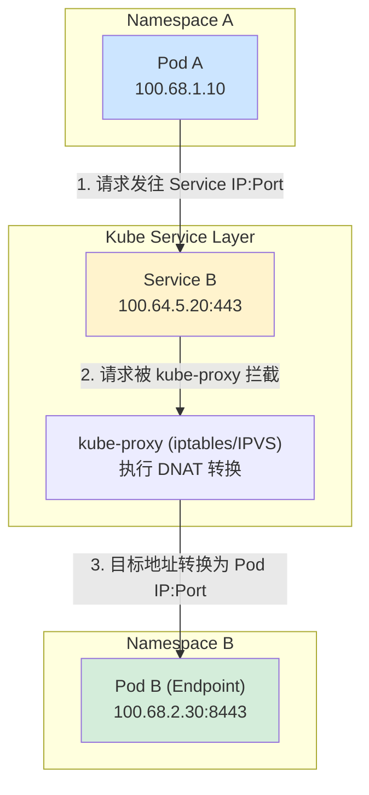
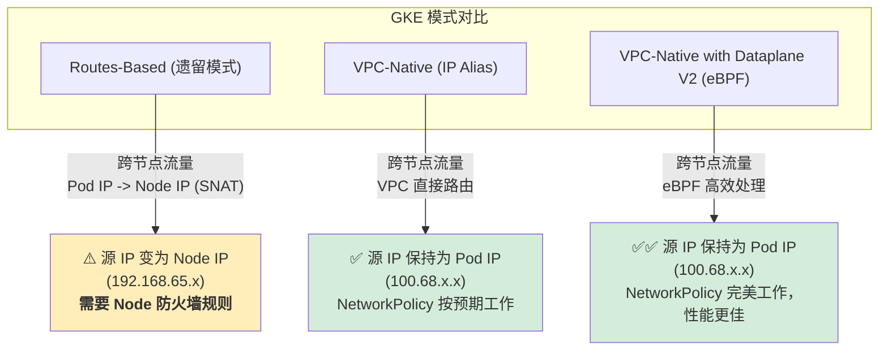

# GKE 跨 Namespace 通信：NetworkPolicy 与 Node IP 解惑

本文将深入探讨在 GKE 环境中，如何正确配置 `NetworkPolicy` 实现跨 Namespace 通-信，并解答一个常见疑问：为什么有时候需要为 GKE Node IP 放通端口。

## 场景回顾

- **环境**: GKE 集群
- **Namespace**: `namespace-a` 和 `namespace-b`，均设置了默认 `deny-all` 策略。
- **目标**: `namespace-a` 中的 Pod 需要访问 `namespace-b` 中的一个 Service。
- **网络配置**:
  - Pod CIDR: `100.68.0.0/16`
  - Service CIDR: `100.64.0.0/16`
  - Node CIDR: `192.168.65.0/24`
- **端口**:
  - Service 端口: `443`
  - Pod 目标端口: `8443`

## 核心概念：NetworkPolicy 匹配的是 Pod，不是 Service

在 Kubernetes 中，当 Pod A 访问 Service B 时，网络流量的实际路径并非直接到达 Service 的虚拟 IP。`kube-proxy` 会拦截这个请求，并通过 DNAT 将其目标地址转换为 Service 背后一个健康 Endpoint (即 Pod B) 的实际 IP 和端口。



因此，`NetworkPolicy` 在评估流量时，看到的是转换后的 **Pod 到 Pod** 的真实流量。

- **Egress (出口) 策略** 在 `namespace-a` 检查的是到 `100.68.2.30:8443` 的流量。
- **Ingress (入口) 策略** 在 `namespace-b` 检查的是来自 `100.68.1.10`、目标为 `8443` 端口的流量。

## 解决方案：正确的 NetworkPolicy 配置

基于以上原理，以下是实现通信所需要的网络策略。

### 1. 为 Namespace 添加标签

为了让策略更具可读性和可维护性，我们首先为 Namespace 添加标签。

```bash
kubectl label namespace namespace-a kubernetes.io/metadata.name=namespace-a
kubectl label namespace namespace-b kubernetes.io/metadata.name=namespace-b
```

### 2. Namespace A: Egress (出口) 策略

此策略允许 `namespace-a` 中的所有 Pod 访问 `namespace-b` 中 Pod 的 `8443` 端口，并允许 DNS 查询。

```yaml
# k8s/allow-a-egress.yaml
apiVersion: networking.k8s.io/v1
kind: NetworkPolicy
metadata:
  name: allow-egress-to-b-and-dns
  namespace: namespace-a
spec:
  podSelector: {} # 应用到 namespace-a 的所有 Pod
  policyTypes:
  - Egress
  egress:
  # 规则1: 允许访问 Namespace B 的 Pod (注意是 Pod 端口 8443)
  - to:
    - namespaceSelector:
        matchLabels:
          kubernetes.io/metadata.name: namespace-b
    ports:
    - protocol: TCP
      port: 8443
      
  # 规则2: 允许 DNS 解析 (非常重要)
  - to:
    - namespaceSelector:
        matchLabels:
          kubernetes.io/metadata.name: kube-system
      podSelector:
        matchLabels:
          k8s-app: kube-dns
    ports:
    - protocol: UDP
      port: 53
    - protocol: TCP
      port: 53
```

### 3. Namespace B: Ingress (入口) 策略

此策略允许 `namespace-b` 中带有 `app: server` 标签的 Pod 接收来自 `namespace-a` 的流量。

```yaml
# k8s/allow-b-ingress.yaml
apiVersion: networking.k8s.io/v1
kind: NetworkPolicy
metadata:
  name: allow-ingress-from-a
  namespace: namespace-b
spec:
  podSelector:
    matchLabels:
      app: server # 仅应用到目标 Pod
  policyTypes:
  - Ingress
  ingress:
  - from:
    - namespaceSelector:
        matchLabels:
          kubernetes.io/metadata.name: namespace-a
    ports:
    - protocol: TCP
      port: 8443 # Pod 自身监听的端口
```

---

## 深度解析：GKE Node IP 为何会影响 Pod 间通信？

你的观察是正确的。在某些模式下，跨节点的 Pod 通信流量的源 IP 地址可能会变成其所在节点的 IP 地址，这个过程称为 SNAT (Source Network Address Translation)。

这完全取决于你的 GKE 集群使用的网络模式。



| GKE 网络模式 | 流量路径与 SNAT | 源 IP 地址 | `NetworkPolicy` Ingress 规则 | 
| :--- | :--- | :--- | :--- |
| **Routes-Based** | 跨节点流量由 Node 路由，**会发生 SNAT**。 | 变成 **Node IP** (`192.168.65.x`) | 必须使用 `ipBlock` 允许 Node CIDR。`namespaceSelector` 会失效。 |
| **VPC-Native** | Pod IP 是 VPC 内的别名 IP，可直接路由，**不发生 SNAT**。 | 保持为 **Pod IP** (`100.68.x.x`) | 使用 `namespaceSelector` 或 `podSelector` 即可。 |
| **Dataplane V2** | 基于 eBPF，绕过 `iptables`，**不发生 SNAT**。 | 保持为 **Pod IP** (`100.68.x.x`) | 使用 `namespaceSelector` 或 `podSelector`，性能最好。 |

**结论：**
你的观察是正确的。当你遇到这种情况时，很可能是因为你的集群处于 **Routes-based** 模式。在这种模式下，当 `namespace-a` 的 Pod 和 `namespace-b` 的 Pod 不在同一个 Node 上时，流量的源 IP 会被 SNAT 成 Node 的 IP。因此 `namespace-b` 的 Ingress 策略如果只配置了 `namespaceSelector` 是无法匹配流量的，因为它看到的是一个来自 `192.168.65.x` 的请求。

### 如何应对 Routes-Based 模式？

如果确认无法切换到 VPC-Native 模式，你需要在 `namespace-b` 的 Ingress 策略中额外添加一条规则，允许来自 Node IP 段的流量。

```yaml
# k8s/allow-b-ingress-for-routes-based.yaml
# ... (省略 metadata)
spec:
  # ...
  ingress:
  # 规则1: 允许来自 namespace-a 的同节点流量
  - from:
    - namespaceSelector:
        matchLabels:
          kubernetes.io/metadata.name: namespace-a
    ports:
    - protocol: TCP
      port: 8443
  # 规则2: 允许来自其他 Node 的跨节点流量
  - from:
    - ipBlock:
        cidr: 192.168.65.0/24 # 你的 GKE Node CIDR
    ports:
    - protocol: TCP
      port: 8443
```

## 验证与排查

### 1. 检查 GKE 网络模式

执行以下命令确认你的集群是否为 `VPC-native`。

```bash
# 将 YOUR_CLUSTER_NAME 和 YOUR_ZONE 替换为你的集群信息
gcloud container clusters describe YOUR_CLUSTER_NAME \
  --zone YOUR_ZONE \
  --format="value(ipAllocationPolicy.useIpAliases)"
```
- **输出 `true`**: 你是 `VPC-native` 模式。`NetworkPolicy` 应按预期工作，无需担心 Node IP。
- **输出 `false` 或空**: 你是 `Routes-based` 模式。请为跨节点通信做好准备。

### 2. 抓包确认源 IP (最终手段)

如果你想确认流量的真实源 IP，可以在目标 Pod (`namespace-b` 中的 Pod) 上抓包。

```bash
# 在 namespace-b 的一个 Pod 上执行
kubectl exec -it <pod-name-in-b> -n namespace-b -- tcpdump -i any -nn 'port 8443'
```

然后从 `namespace-a` 的 Pod 发起请求。观察 `tcpdump` 的输出，查看 `IP` 字段后面的源地址，确认它是 Pod IP (`100.68.x.x`) 还是 Node IP (`192.168.65.x`)。

## 总结

1.  **`NetworkPolicy` 处理的是 Pod 真实流量**，因此规则中的端口应为 Pod 监听的端口 (`8443`)，而不是 Service 的端口 (`443`)。
2.  **必须为发起方配置 Egress 策略**，允许其访问 DNS (`kube-system`) 和目标 Pod。
3.  **GKE Node IP 是否影响通信，完全取决于网络模式**。`Routes-based` 模式下跨节点会发生 SNAT，导致 `namespaceSelector` 失效，此时需要用 `ipBlock` 补充规则。`VPC-native` (推荐) 则没有此问题。
4.  强烈建议在新集群中使用 **VPC-Native** 模式并开启 **Dataplane V2**，可以极大简化网络管理和策略配置。
