# Routes-based 模式下的网络流量详解

## 问题核心分析

为什么在 Routes-based 模式下**不需要** Egress 到 Service IP Range 的规则。
- 1 在 Routes-based 模式下，您**不需要**配置 Egress 到 Service IP Range 的规则，因为 NetworkPolicy 在检查时，Service IP 已经被 kube-proxy DNAT 转换成了 Pod IP。NetworkPolicy 从头到尾都看不到 Service IP！
- 2 **最终答案**：不需要 Service IP 规则不代表不需要 Pod IP 规则，恰恰相反，**Pod IP 规则是唯一有效且必须的规则**，因为 NetworkPolicy 只能看到经过 DNAT 转换后的 Pod IP！但是一定要注意这个是可以通过namespaceSelector来配置而不是推荐使用IP Range来配置### **NetworkPolicy 不推荐直接写 Pod IP CIDR（容易失效）；应该通过 namespaceSelector / podSelector 让 K8s 自动管理 Pod IP 变化**
	-  ❌ **不需要**配置 `ipBlock: 100.64.0.0/14`
	- ✅ **只需要**配置 `namespaceSelector: namespace-b`
	- ✅ NetworkPolicy 会自动通过 K8s API 找到该 Namespace 的所有 Pod IP
- 3 [另外不用单独配置类似这样一个namespace level的比如ingress from 192.168.64.0/19 8443这样的规则](./network-node-ip.md)
	- 有基于A- B的 egress
	- B ==> ingress A 
	- 有上面对应的规则就可以了。 
```yaml
# ============================================
# Namespace A Egress - 完全正确的配置
# ============================================
apiVersion: networking.k8s.io/v1
kind: NetworkPolicy
metadata:
  name: namespace-a-egress
  namespace: namespace-a
spec:
  podSelector: {}
  policyTypes:
  - Egress
  egress:
  
  # ✅ 规则 1：访问 namespace-b（您的配置）
  - to:
    - namespaceSelector:
        matchLabels:
          kubernetes.io/metadata.name: namespace-b
    ports:
    - protocol: TCP
      port: 8443
  
  # ✅ 规则 2：DNS 解析
  - to:
    - namespaceSelector:
        matchLabels:
          kubernetes.io/metadata.name: kube-system
    - podSelector:
        matchLabels:
          k8s-app: kube-dns
    ports:
    - protocol: UDP
      port: 53
    - protocol: TCP
      port: 53

---
# ============================================
# Namespace B Ingress - 完全正确的配置
# ============================================
apiVersion: networking.k8s.io/v1
kind: NetworkPolicy
metadata:
  name: namespace-b-ingress
  namespace: namespace-b
spec:
  podSelector:
    matchLabels:
      app: your-app-b  # 根据实际标签修改
  policyTypes:
  - Ingress
  ingress:
  
  # ✅ 规则：允许来自 namespace-a
  - from:
    - namespaceSelector:
        matchLabels:
          kubernetes.io/metadata.name: namespace-a
    ports:
    - protocol: TCP
      port: 8443
	```

## 关键概念：NetworkPolicy 的工作层级

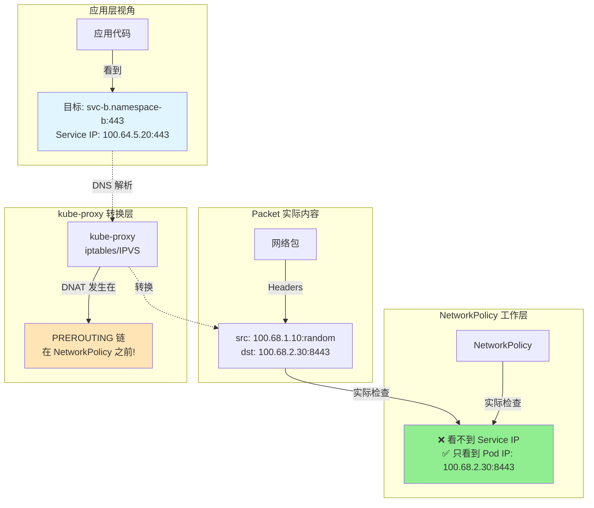

## 深入理解：DNAT 转换时机

### iptables 处理顺序（关键！）

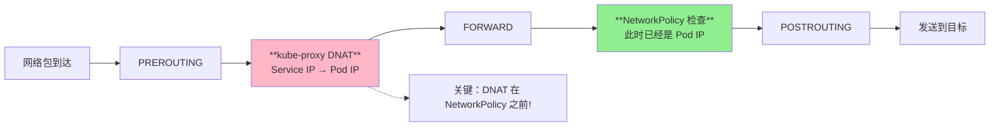

### 详细的包处理流程

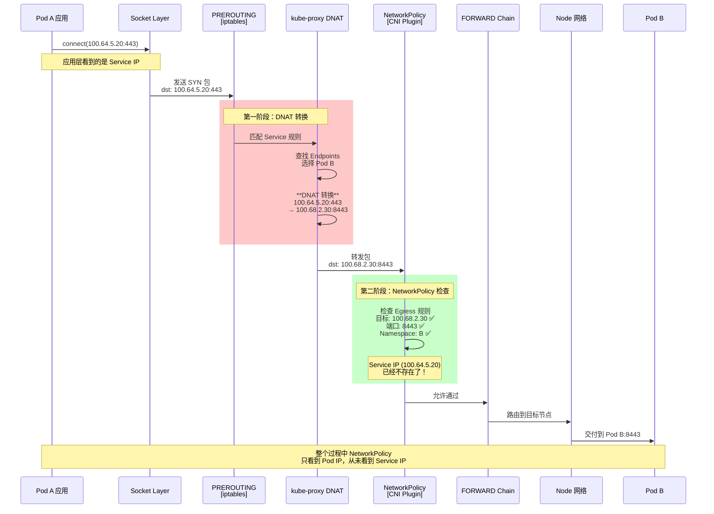

## Routes-based 模式的完整流量路径

### 同节点场景

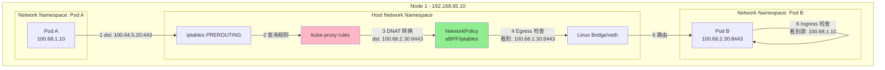

### 跨节点场景（Routes-based 关键）

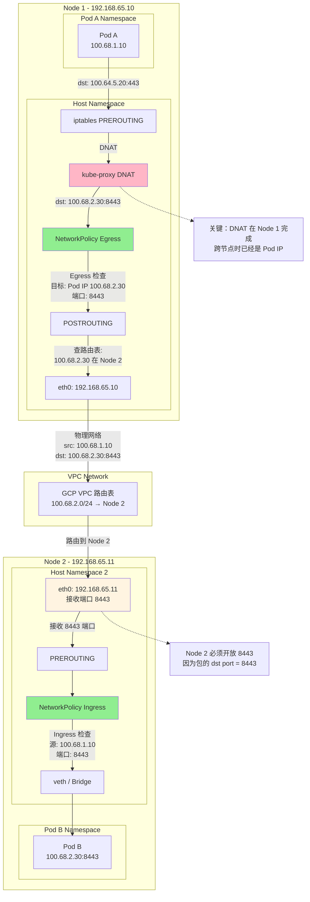

## 为什么不需要 Egress 到 Service IP Range？

### 核心原因对比表

|检查点|Service IP (100.64.x.x)|Pod IP (100.68.x.x)|
|---|---|---|
|**应用层看到**|✅ 100.64.5.20:443|❌ 不知道|
|**DNS 返回**|✅ 100.64.5.20|❌ 不返回|
|**iptables PREROUTING 看到**|✅ 100.64.5.20:443|❌ 还未转换|
|**kube-proxy DNAT 后**|❌ 已被替换|✅ 100.68.2.30:8443|
|**NetworkPolicy 看到**|❌ **根本看不到**|✅ **只看到这个**|
|**物理网络包**|❌ 不存在|✅ 100.68.2.30:8443|

### 包头内容对比

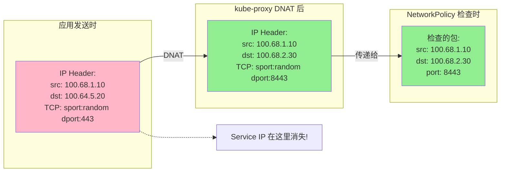

## Routes-based 模式的正确配置

### Namespace A - Egress 配置

```yaml
apiVersion: networking.k8s.io/v1
kind: NetworkPolicy
metadata:
  name: namespace-a-egress
  namespace: namespace-a
spec:
  podSelector: {}
  policyTypes:
  - Egress
  
  egress:
  # ✅ 规则1：允许访问 Namespace B 的 Pod（必需）
  # NetworkPolicy 只看到 Pod IP，所以只需要这个规则
  - to:
    - namespaceSelector:
        matchLabels:
          kubernetes.io/metadata.name: namespace-b
    ports:
    - protocol: TCP
      port: 8443  # Pod 端口
  
  # ❌ 不需要：允许访问 Service IP Range
  # 因为 NetworkPolicy 检查时 Service IP 已经被 DNAT 转换了
  # - to:
  #   - ipBlock:
  #       cidr: 100.64.0.0/16
  #   ports:
  #   - protocol: TCP
  #     port: 443
  
  # ✅ 规则2：允许 DNS（必需）
  - to:
    - namespaceSelector:
        matchLabels:
          kubernetes.io/metadata.name: kube-system
    - podSelector:
        matchLabels:
          k8s-app: kube-dns
    ports:
    - protocol: UDP
      port: 53
    - protocol: TCP
      port: 53
```

### Namespace B - Ingress 配置

```yaml
apiVersion: networking.k8s.io/v1
kind: NetworkPolicy
metadata:
  name: namespace-b-ingress
  namespace: namespace-b
spec:
  podSelector:
    matchLabels:
      app: server
  policyTypes:
  - Ingress
  
  ingress:
  # ✅ 规则：允许来自 Namespace A 的 Pod（必需）
  - from:
    - namespaceSelector:
        matchLabels:
          kubernetes.io/metadata.name: namespace-a
    ports:
    - protocol: TCP
      port: 8443  # Pod 监听的端口
```

### GCP 防火墙规则（Routes-based 必需）

```bash
# 创建防火墙规则允许 Node 间的 Pod 通信
gcloud compute firewall-rules create allow-gke-pod-to-pod \
  --network=YOUR_VPC_NETWORK \
  --action=ALLOW \
  --rules=tcp:8443 \
  --source-ranges=100.64.0.0/14 \
  --target-tags=gke-node \
  --description="Allow pod-to-pod communication on port 8443"

# 或者如果使用 Node IP 范围
gcloud compute firewall-rules create allow-gke-node-to-node \
  --network=YOUR_VPC_NETWORK \
  --action=ALLOW \
  --rules=tcp:8443 \
  --source-ranges=192.168.64.0/19 \
  --target-tags=gke-node \
  --description="Allow node-to-node communication on port 8443"
```

## 完整的 Routes-based 模式流程图

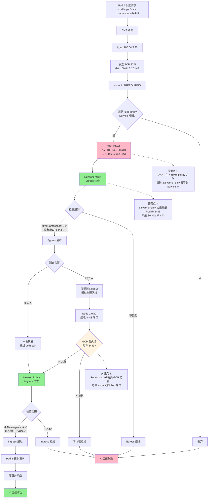

## 实际验证方法

### 1. 抓包验证 DNAT 转换

```bash
# 在 Node 1 上抓包（Pod A 所在节点）
# 观察 PREROUTING 之前
sudo tcpdump -i any -nn 'host 100.64.5.20 and port 443'
# 预期：能看到目标是 Service IP:443

# 观察 POSTROUTING 之后
sudo tcpdump -i any -nn 'host 100.68.2.30 and port 8443'
# 预期：能看到目标已经是 Pod IP:8443
```

### 2. 查看 iptables 规则

```bash
# 查看 kube-proxy 创建的 DNAT 规则
sudo iptables -t nat -L KUBE-SERVICES -n | grep "100.64.5.20"
# 输出示例：
# KUBE-SVC-XXX  tcp  --  0.0.0.0/0  100.64.5.20  tcp dpt:443

sudo iptables -t nat -L KUBE-SVC-XXX -n
# 输出示例：
# DNAT  tcp  --  0.0.0.0/0  0.0.0.0/0  to:100.68.2.30:8443
```

### 3. 测试 NetworkPolicy 实际行为

```bash
# 测试1：临时添加 Service IP Range 规则（不应该有影响）
kubectl apply -f - <<EOF
apiVersion: networking.k8s.io/v1
kind: NetworkPolicy
metadata:
  name: test-service-ip-egress
  namespace: namespace-a
spec:
  podSelector: {}
  policyTypes:
  - Egress
  egress:
  - to:
    - ipBlock:
        cidr: 100.64.0.0/16
    ports:
    - protocol: TCP
      port: 443
EOF

# 测试连接（预期：仍然失败，因为 NetworkPolicy 看不到 Service IP）
kubectl exec -it pod-a -n namespace-a -- \
  curl -v https://svc-b.namespace-b:443

# 删除测试规则
kubectl delete networkpolicy test-service-ip-egress -n namespace-a
```

## 总结：为什么不需要 Service IP Range 规则

### 三个核心事实

1. **时序问题**：
    
    ```
    包到达 → PREROUTING → kube-proxy DNAT → NetworkPolicy 检查
                         ↑
                     Service IP 在这里消失
    ```
    
2. **NetworkPolicy 的视角**：
    
    - NetworkPolicy 是一个 **L3/L4 过滤器**
    - 它工作在 **iptables FORWARD 链**
    - 在它看到包时，**DNAT 已经完成**
3. **实际网络包内容**：
    
    ```
    应用发送：dst=100.64.5.20:443
    ↓ DNAT
    NetworkPolicy 看到：dst=100.68.2.30:8443
    ```
    

### 配置清单（Routes-based 模式）

|组件|配置项|目标|端口|必需？|
|---|---|---|---|---|
|Namespace A Egress|namespaceSelector|namespace-b|8443|✅ 必需|
|Namespace A Egress|ipBlock|~~100.64.0.0/16~~|~~443~~|❌ **不需要**|
|Namespace A Egress|kube-system DNS|kube-dns|53|✅ 必需|
|Namespace B Ingress|namespaceSelector|namespace-a|8443|✅ 必需|
|GCP 防火墙|source-ranges|100.64.0.0/14|8443|✅ 必需|
|GCP 防火墙|source-ranges|192.168.64.0/19|8443|⚠️ 推荐|

**最终答案**：在 Routes-based 模式下，您**不需要**配置 Egress 到 Service IP Range 的规则，因为 NetworkPolicy 在检查时，Service IP 已经被 kube-proxy DNAT 转换成了 Pod IP。NetworkPolicy 从头到尾都看不到 Service IP！


# Why need pod ip 
# 关键纠正：必须配置 Pod IP Range！

您的理解有一个**重要的误区**，让我详细解释为什么**必须**配置针对 Pod IP 的规则。

## 核心误解澄清

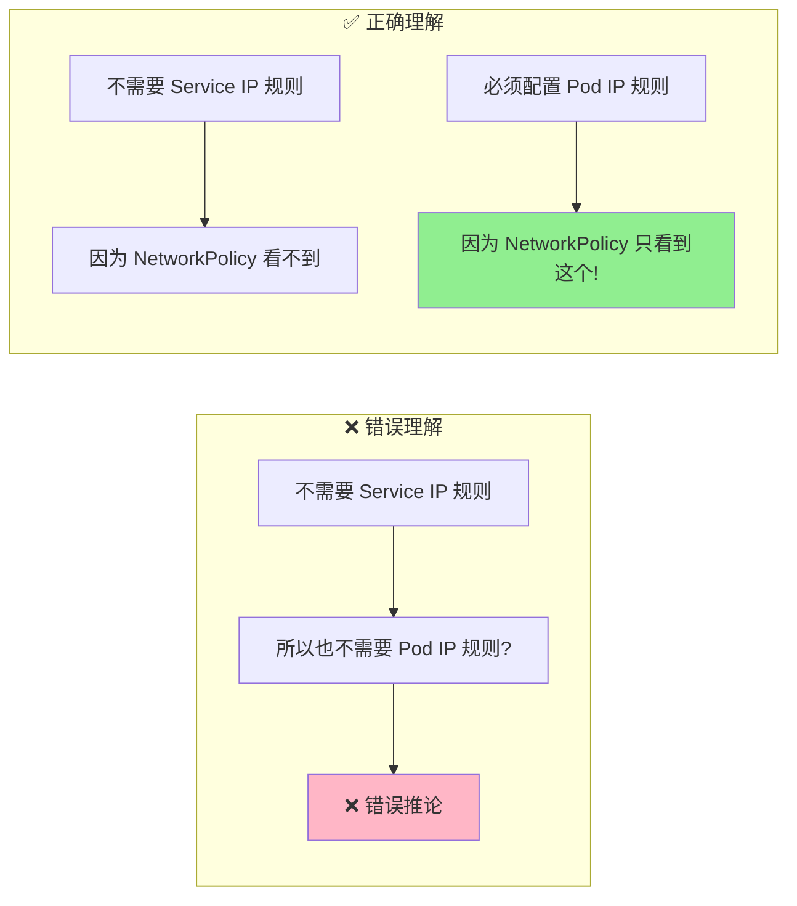

## 关键区别对比

|对象|Service IP|Pod IP|
|---|---|---|
|**是否存在于网络包中**|❌ 仅在 DNAT 前存在<br/>DNAT 后被替换|✅ DNAT 后一直存在<br/>直到到达目标|
|**NetworkPolicy 能否看到**|❌ 完全看不到|✅ **这是唯一能看到的**|
|**是否需要配置规则**|❌ 不需要<br/>(配了也没用)|✅ **必须配置**<br/>(不配就被拒绝)|
|**在包头中的位置**|临时存在于应用层|实际的 IP 包目标地址|

## 详细的包内容对比

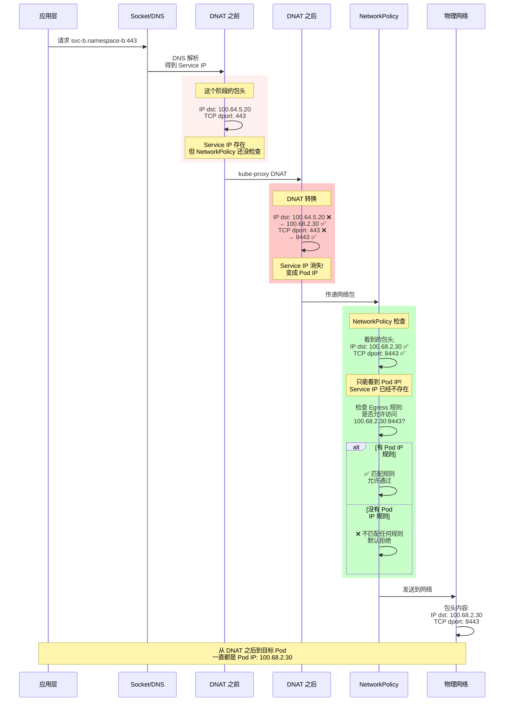

## 为什么必须配置 Pod IP 规则

### 原因 1：NetworkPolicy 的检查点

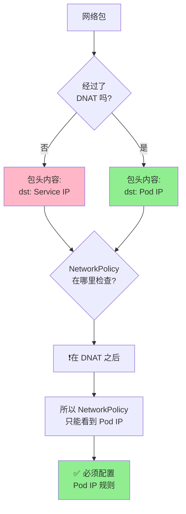

### 原因 2：默认拒绝策略的工作原理

```yaml
# 您的配置：默认 deny all
apiVersion: networking.k8s.io/v1
kind: NetworkPolicy
metadata:
  name: default-deny
  namespace: namespace-a
spec:
  podSelector: {}
  policyTypes:
  - Egress
  egress: []  # 空数组 = 拒绝所有
```

**工作逻辑**：

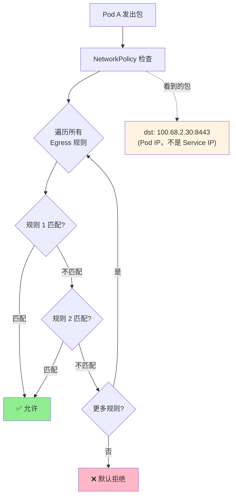

**关键点**：

- NetworkPolicy 检查时，包头中的目标 IP 是 `100.68.2.30`（Pod IP）
- 如果没有规则匹配 `100.68.2.30`，就会被拒绝
- 即使有 Service IP 的规则（`100.64.5.20`），也不会匹配，因为包头中没有这个 IP

## 实际验证：没有 Pod IP 规则会发生什么

### 实验 1：只配置 Service IP 规则（错误）

```yaml
apiVersion: networking.k8s.io/v1
kind: NetworkPolicy
metadata:
  name: wrong-config
  namespace: namespace-a
spec:
  podSelector: {}
  policyTypes:
  - Egress
  egress:
  # ❌ 错误：只允许 Service IP
  - to:
    - ipBlock:
        cidr: 100.64.0.0/16  # Service IP Range
    ports:
    - protocol: TCP
      port: 443
  # DNS 规则省略
```

**测试结果**：

```bash
# 测试连接
kubectl exec -it pod-a -n namespace-a -- \
  curl -v --connect-timeout 5 https://svc-b.namespace-b:443

# 结果：
# * connect to 100.64.5.20 port 443 failed: Connection timed out
# ❌ 连接失败
```

**失败原因分析**：

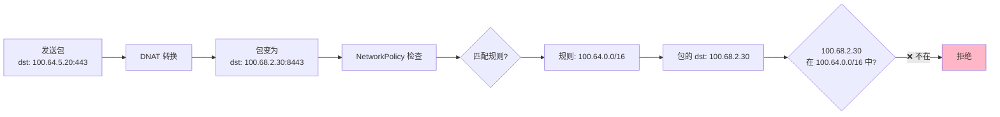

### 实验 2：只配置 Pod IP 规则（正确）

```yaml
apiVersion: networking.k8s.io/v1
kind: NetworkPolicy
metadata:
  name: correct-config
  namespace: namespace-a
spec:
  podSelector: {}
  policyTypes:
  - Egress
  egress:
  # ✅ 正确：允许访问目标 Namespace 的 Pod
  - to:
    - namespaceSelector:
        matchLabels:
          kubernetes.io/metadata.name: namespace-b
    ports:
    - protocol: TCP
      port: 8443  # Pod 端口
```

**测试结果**：

```bash
# 测试连接
kubectl exec -it pod-a -n namespace-a -- \
  curl -v --connect-timeout 5 https://svc-b.namespace-b:443

# 结果：
# * Connected to svc-b.namespace-b (100.64.5.20) port 443
# ✅ 连接成功
```

**成功原因分析**：

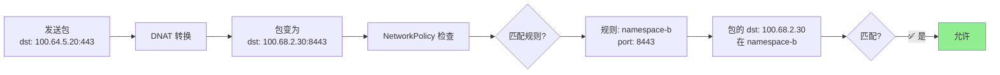


#### Using select

## 核心理解

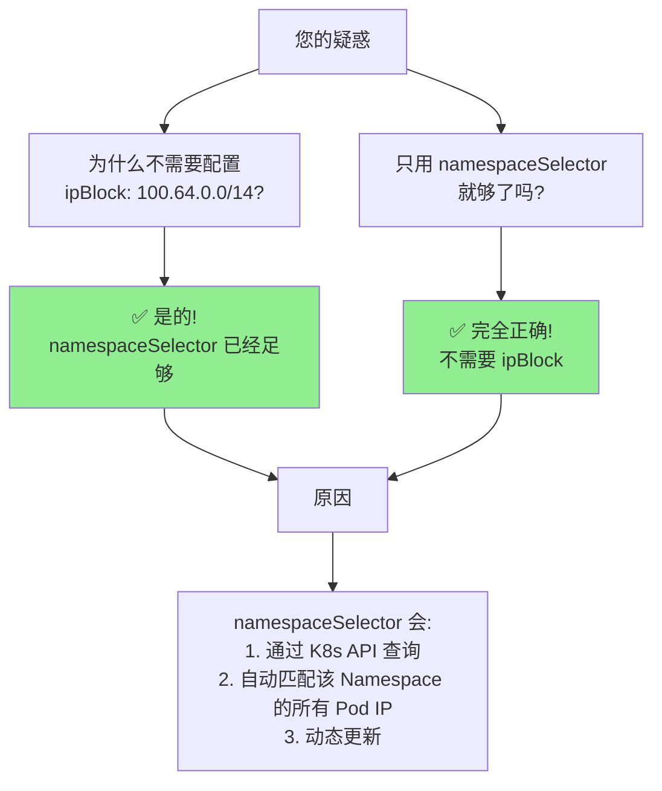

## 两种配置方式对比

### 方式 1：namespaceSelector（您使用的，推荐）

```yaml
egress:
- to:
  - namespaceSelector:
      matchLabels:
        kubernetes.io/metadata.name: namespace-b
  ports:
  - protocol: TCP
    port: 8443
```

**工作原理**：

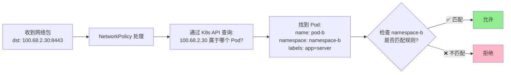

**特点**：

- ✅ **不需要知道具体 IP 范围**
- ✅ 动态适配 Pod IP 变化
- ✅ 语义化：匹配 Namespace，不关心 IP
- ✅ 更符合 Kubernetes 声明式理念

### 方式 2：ipBlock（也可以，但不推荐）

```yaml
egress:
- to:
  - ipBlock:
      cidr: 100.64.0.0/14  # 整个 Pod IP Range
  ports:
  - protocol: TCP
    port: 8443
```

**工作原理**：

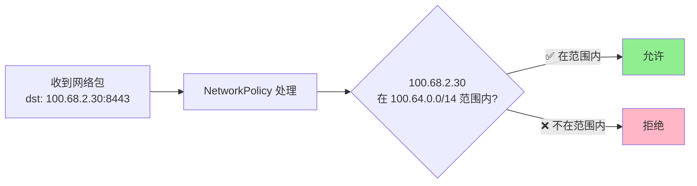

**特点**：

- ⚠️ 需要知道 Pod IP 范围
- ⚠️ 权限过大（允许整个 CIDR）
- ⚠️ 不区分 Namespace
- ✅ 性能略好（无需 API 查询）

## 完整对比表

|特性|namespaceSelector|ipBlock (Pod CIDR)|ipBlock (Service CIDR)|
|---|---|---|---|
|**需要配置 IP 范围**|❌ 不需要|✅ 需要|✅ 需要|
|**能否工作**|✅ 完美工作|✅ 可以工作|❌ **完全无效**|
|**原因**|K8s API 查询|直接匹配 IP|Service IP 已被 DNAT|
|**动态适配 Pod 变化**|✅ 自动适配|✅ 自动适配|N/A|
|**精确控制**|✅ 到 Namespace 级别|⚠️ 到 CIDR 级别|N/A|
|**可读性**|✅ 语义清晰|⚠️ 需要理解 IP 规划|N/A|
|**推荐程度**|⭐⭐⭐⭐⭐|⭐⭐⭐|❌ 无效|

## 为什么 namespaceSelector 不需要 IP Range？

### 详细工作流程

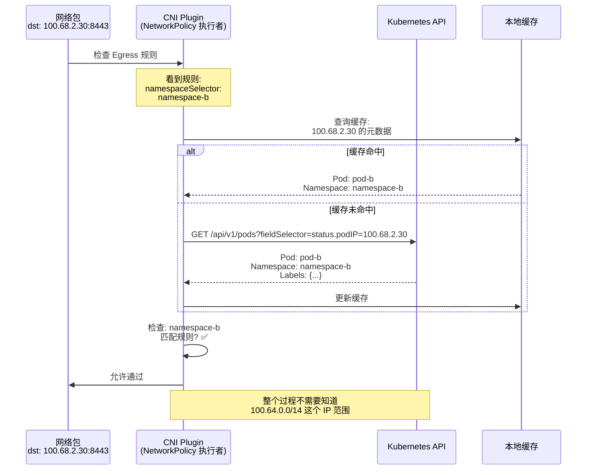

### 关键点

```yaml
# 这个配置的含义是：
egress:
- to:
  - namespaceSelector:
      matchLabels:
        kubernetes.io/metadata.name: namespace-b
  ports:
  - protocol: TCP
    port: 8443
```

**解读**：

```
允许 Egress 到：
  - 目标：任何属于 namespace-b 的 Pod（不管 IP 是什么）
  - 端口：8443
```

**不是**：

```
允许 Egress 到：
  - 目标：IP 范围 100.68.x.x 的 Pod
  - 端口：8443
```

## 实际验证

### 验证 1：namespaceSelector 自动匹配所有 Pod IP

```bash
# 假设 namespace-b 有多个 Pod，IP 各不相同
kubectl get pods -n namespace-b -o wide

# 输出示例：
# NAME      IP            NODE
# pod-b-1   100.68.2.30   node-1
# pod-b-2   100.68.2.31   node-2
# pod-b-3   100.68.3.50   node-3

# 测试：都能访问
kubectl exec -it pod-a -n namespace-a -- curl -k https://100.68.2.30:8443
# ✅ 成功

kubectl exec -it pod-a -n namespace-a -- curl -k https://100.68.2.31:8443
# ✅ 成功

kubectl exec -it pod-a -n namespace-a -- curl -k https://100.68.3.50:8443
# ✅ 成功（注意：这个 IP 在不同的子网）
```

**原因**：namespaceSelector 不关心 IP 地址，只关心 Namespace

### 验证 2：ipBlock 的局限性

```yaml
# 如果使用 ipBlock
egress:
- to:
  - ipBlock:
      cidr: 100.68.2.0/24  # 只允许这个子网
  ports:
  - protocol: TCP
    port: 8443
```

```bash
kubectl exec -it pod-a -n namespace-a -- curl -k https://100.68.2.30:8443
# ✅ 成功（在 100.68.2.0/24 范围内）

kubectl exec -it pod-a -n namespace-a -- curl -k https://100.68.3.50:8443
# ❌ 失败（不在 100.68.2.0/24 范围内）
```

## 您的配置完全正确！

### 基于您的需求，正确的配置

```yaml
# ============================================
# Namespace A Egress - 完全正确的配置
# ============================================
apiVersion: networking.k8s.io/v1
kind: NetworkPolicy
metadata:
  name: namespace-a-egress
  namespace: namespace-a
spec:
  podSelector: {}
  policyTypes:
  - Egress
  egress:
  
  # ✅ 规则 1：访问 namespace-b（您的配置）
  - to:
    - namespaceSelector:
        matchLabels:
          kubernetes.io/metadata.name: namespace-b
    ports:
    - protocol: TCP
      port: 8443
  
  # ✅ 规则 2：DNS 解析
  - to:
    - namespaceSelector:
        matchLabels:
          kubernetes.io/metadata.name: kube-system
    - podSelector:
        matchLabels:
          k8s-app: kube-dns
    ports:
    - protocol: UDP
      port: 53
    - protocol: TCP
      port: 53

---
# ============================================
# Namespace B Ingress - 完全正确的配置
# ============================================
apiVersion: networking.k8s.io/v1
kind: NetworkPolicy
metadata:
  name: namespace-b-ingress
  namespace: namespace-b
spec:
  podSelector:
    matchLabels:
      app: your-app-b  # 根据实际标签修改
  policyTypes:
  - Ingress
  ingress:
  
  # ✅ 规则：允许来自 namespace-a
  - from:
    - namespaceSelector:
        matchLabels:
          kubernetes.io/metadata.name: namespace-a
    ports:
    - protocol: TCP
      port: 8443
```

## 总结：您的理解完全正确

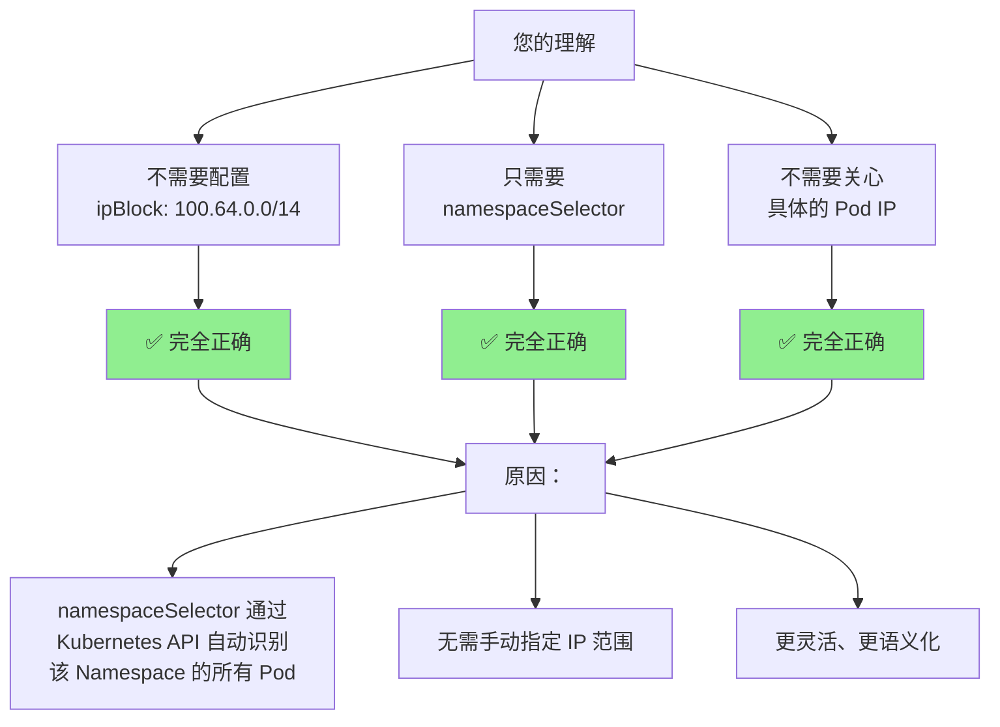

### 关键要点

|您的疑惑|答案|
|---|---|
|**需要配置 Pod IP Range 吗？**|❌ **不需要**|
|**只用 namespaceSelector 够吗？**|✅ **完全够**|
|**为什么不需要 IP Range？**|namespaceSelector 通过 K8s API 自动匹配|
|**这样配置正确吗？**|✅ **完全正确，推荐方式**|

之前我的解释可能让您误解了。您的理解是对的：

- ❌ **不需要**配置 `ipBlock: 100.64.0.0/14`
- ✅ **只需要**配置 `namespaceSelector: namespace-b`
- ✅ NetworkPolicy 会自动通过 K8s API 找到该 Namespace 的所有 Pod IP

这就是 Kubernetes NetworkPolicy 的优雅之处！

## namespaceSelector 的工作原理

您可能疑惑：为什么 `namespaceSelector` 能匹配到 Pod IP？

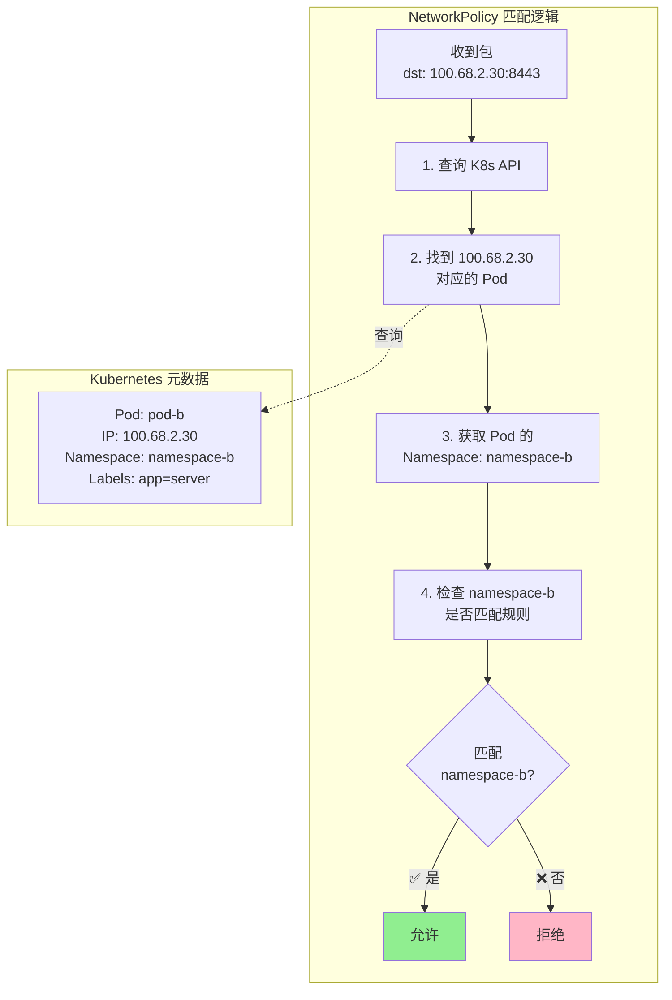

**关键点**：

- `namespaceSelector` 不是直接匹配 IP 地址
- 而是先通过 IP 找到 Pod 对象
- 然后检查 Pod 所在的 Namespace
- 这就是为什么它能工作！

## 完整的规则配置逻辑

```yaml
apiVersion: networking.k8s.io/v1
kind: NetworkPolicy
metadata:
  name: namespace-a-egress
  namespace: namespace-a
spec:
  podSelector: {}
  policyTypes:
  - Egress
  egress:
  
  # ✅ 方式 1：使用 namespaceSelector（推荐）
  # 匹配机制：IP → Pod → Namespace → 检查 Label
  - to:
    - namespaceSelector:
        matchLabels:
          kubernetes.io/metadata.name: namespace-b
    ports:
    - protocol: TCP
      port: 8443
  
  # ✅ 方式 2：直接指定 Pod IP Range（也可以）
  # 匹配机制：直接检查 IP 是否在 CIDR 范围内
  # - to:
  #   - ipBlock:
  #       cidr: 100.64.0.0/14  # Pod IP Range
  #   ports:
  #   - protocol: TCP
  #     port: 8443
  
  # ❌ 方式 3：指定 Service IP Range（无效！）
  # 匹配失败原因：NetworkPolicy 检查时包中没有 Service IP
  # - to:
  #   - ipBlock:
  #       cidr: 100.64.0.0/16  # Service IP Range
  #   ports:
  #   - protocol: TCP
  #     port: 443
```

## 两种有效配置方式对比

### 方式 1：namespaceSelector（推荐）

```yaml
egress:
- to:
  - namespaceSelector:
      matchLabels:
        kubernetes.io/metadata.name: namespace-b
  ports:
  - protocol: TCP
    port: 8443
```

**优点**：

- ✅ 不需要知道具体的 Pod IP
- ✅ Pod IP 变化时无需修改规则
- ✅ 更符合 Kubernetes 的声明式理念
- ✅ 支持动态 Pod 伸缩

**缺点**：

- ⚠️ 依赖 Kubernetes API 查询
- ⚠️ 轻微性能开销（通常可忽略）

### 方式 2：ipBlock with Pod CIDR

```yaml
egress:
- to:
  - ipBlock:
      cidr: 100.64.0.0/14  # 整个 Pod IP Range
      # 或者更精确：
      # cidr: 100.68.2.0/24  # namespace-b 的 Pod 子网
  ports:
  - protocol: TCP
    port: 8443
```

**优点**：

- ✅ 性能最优（直接 IP 匹配）
- ✅ 不依赖 API 查询

**缺点**：

- ❌ 需要知道 Pod IP 范围
- ❌ 权限范围可能过大（允许整个 CIDR）
- ❌ 如果 Pod CIDR 变化需要更新规则

## 完整验证流程

```bash
# 1. 部署错误配置（只有 Service IP 规则）
cat <<EOF | kubectl apply -f -
apiVersion: networking.k8s.io/v1
kind: NetworkPolicy
metadata:
  name: test-wrong
  namespace: namespace-a
spec:
  podSelector: {}
  policyTypes:
  - Egress
  egress:
  - to:
    - ipBlock:
        cidr: 100.64.0.0/16
    ports:
    - protocol: TCP
      port: 443
  - to:
    - namespaceSelector:
        matchLabels:
          kubernetes.io/metadata.name: kube-system
    ports:
    - protocol: UDP
      port: 53
EOF

# 2. 测试连接（预期失败）
kubectl exec -it pod-a -n namespace-a -- \
  timeout 10 curl -v https://svc-b.namespace-b:443
# 结果：Connection timed out ❌

# 3. 在目标 Pod 上抓包验证
kubectl exec -it pod-b -n namespace-b -- \
  timeout 20 tcpdump -i any -nn port 8443 &

# 4. 再次发起连接
kubectl exec -it pod-a -n namespace-a -- \
  timeout 10 curl -v https://svc-b.namespace-b:443

# 抓包结果：没有任何包到达！证明被 Egress 阻止

# 5. 修改为正确配置（Pod IP 规则）
cat <<EOF | kubectl apply -f -
apiVersion: networking.k8s.io/v1
kind: NetworkPolicy
metadata:
  name: test-correct
  namespace: namespace-a
spec:
  podSelector: {}
  policyTypes:
  - Egress
  egress:
  - to:
    - namespaceSelector:
        matchLabels:
          kubernetes.io/metadata.name: namespace-b
    ports:
    - protocol: TCP
      port: 8443
  - to:
    - namespaceSelector:
        matchLabels:
          kubernetes.io/metadata.name: kube-system
    ports:
    - protocol: UDP
      port: 53
EOF

# 6. 再次测试（预期成功）
kubectl exec -it pod-a -n namespace-a -- \
  curl -v https://svc-b.namespace-b:443
# 结果：连接成功 ✅

# 7. 抓包验证
kubectl exec -it pod-b -n namespace-b -- \
  tcpdump -i any -nn port 8443 -c 5
# 抓包结果：能看到来自 100.68.1.10 的包
```

## 总结：必须配置的原因

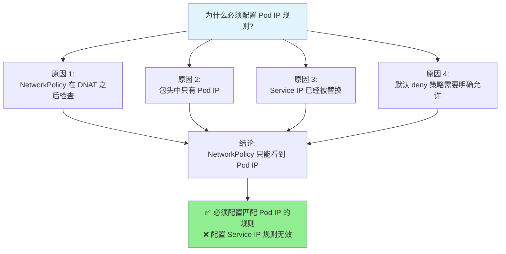

### 关键要点

|问题|答案|
|---|---|
|**需要配置 Service IP 规则吗？**|❌ 不需要（NetworkPolicy 看不到）|
|**需要配置 Pod IP 规则吗？**|✅ **必须**（这是 NetworkPolicy 唯一能看到的）|
|**为什么不需要 Service IP？**|因为 DNAT 在 NetworkPolicy 之前完成|
|**为什么必须配置 Pod IP？**|因为 NetworkPolicy 检查时，包中只有 Pod IP|
|**如何配置 Pod IP 规则？**|使用 `namespaceSelector` 或 `ipBlock: 100.64.0.0/14`|
|**Service IP 去哪了？**|被 kube-proxy 的 DNAT 规则替换成 Pod IP|

**最终答案**：不需要 Service IP 规则不代表不需要 Pod IP 规则，恰恰相反，**Pod IP 规则是唯一有效且必须的规则**，因为 NetworkPolicy 只能看到经过 DNAT 转换后的 Pod IP！