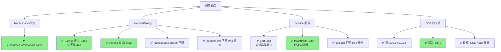

# GKE Routes-based 模式完整网络策略配置

基于您的需求，我为您生成完整的 NetworkPolicy 配置文件。

## 环境信息确认

- **GKE 模式**: Routes-based
- **Namespace A**: 源 Namespace（客户端）
- **Namespace B**: 目标 Namespace（服务端）
- **Pod IP Range**: 100.64.0.0/14
- **Service IP Range**: 100.68.0.0/17
- **Node IP Range**: 192.168.64.0/19
- **Service 端口**: 443
- **Pod 端口**: 8443

## 配置文件结构

```
network-policies/
├── 00-namespace-labels.yaml      # Namespace 标签配置
├── 01-namespace-a-policy.yaml    # Namespace A 完整策略
├── 02-namespace-b-policy.yaml    # Namespace B 完整策略
└── 03-gcp-firewall-rules.sh      # GCP 防火墙规则（Routes-based 必需）
```

## 1. Namespace 标签配置

**文件**: `00-namespace-labels.yaml`

```yaml
# ============================================
# Namespace 标签配置
# 用途：NetworkPolicy 通过标签识别 Namespace
# ============================================
apiVersion: v1
kind: Namespace
metadata:
  name: namespace-a
  labels:
    kubernetes.io/metadata.name: namespace-a
    app.kubernetes.io/name: namespace-a
---
apiVersion: v1
kind: Namespace
metadata:
  name: namespace-b
  labels:
    kubernetes.io/metadata.name: namespace-b
    app.kubernetes.io/name: namespace-b
```

**应用方式**：

```bash
# 如果 Namespace 已存在，只添加标签
kubectl label namespace namespace-a kubernetes.io/metadata.name=namespace-a --overwrite
kubectl label namespace namespace-b kubernetes.io/metadata.name=namespace-b --overwrite

# 或者应用完整配置
kubectl apply -f 00-namespace-labels.yaml
```

## 2. Namespace A 完整策略

**文件**: `01-namespace-a-policy.yaml`

```yaml
# ============================================
# Namespace A - 完整网络策略
# 功能：
# 1. 默认拒绝所有入站和出站流量
# 2. 允许访问 Namespace B 的 Pod (8443)
# 3. 允许 DNS 解析
# 4. 允许访问 Kubernetes API
# ============================================
apiVersion: networking.k8s.io/v1
kind: NetworkPolicy
metadata:
  name: namespace-a-default-deny-all
  namespace: namespace-a
  labels:
    app: network-policy
    environment: production
spec:
  # 应用到 namespace-a 的所有 Pod
  podSelector: {}
  policyTypes:
  - Ingress
  - Egress
  
  # 默认拒绝所有入站流量
  ingress: []
  
  # 默认拒绝所有出站流量（后续规则会明确允许）
  egress: []

---
apiVersion: networking.k8s.io/v1
kind: NetworkPolicy
metadata:
  name: namespace-a-allow-dns
  namespace: namespace-a
  labels:
    app: network-policy
    rule-type: dns
spec:
  podSelector: {}
  policyTypes:
  - Egress
  
  egress:
  # ============================================
  # 规则 1: 允许 DNS 解析（必需）
  # 用途：解析 Service 名称为 IP
  # ============================================
  - to:
    - namespaceSelector:
        matchLabels:
          kubernetes.io/metadata.name: kube-system
    - podSelector:
        matchLabels:
          k8s-app: kube-dns
    ports:
    - protocol: UDP
      port: 53
    - protocol: TCP
      port: 53

---
apiVersion: networking.k8s.io/v1
kind: NetworkPolicy
metadata:
  name: namespace-a-allow-to-namespace-b
  namespace: namespace-a
  labels:
    app: network-policy
    rule-type: cross-namespace
spec:
  podSelector: {}
  policyTypes:
  - Egress
  
  egress:
  # ============================================
  # 规则 2: 允许访问 Namespace B 的 Pod
  # 关键配置：
  # - 目标：namespace-b 的所有 Pod
  # - 端口：8443 (Pod 端口，不是 Service 端口 443)
  # - 原因：NetworkPolicy 检查时已经过 DNAT 转换
  # ============================================
  - to:
    - namespaceSelector:
        matchLabels:
          kubernetes.io/metadata.name: namespace-b
    ports:
    - protocol: TCP
      port: 8443
      
  # ============================================
  # 可选：更精确的 Pod 选择器
  # 如果只想允许访问特定标签的 Pod，取消下面的注释
  # ============================================
  # - to:
  #   - namespaceSelector:
  #       matchLabels:
  #         kubernetes.io/metadata.name: namespace-b
  #     podSelector:
  #       matchLabels:
  #         app: your-app-b  # 替换为实际的 Pod 标签
  #   ports:
  #   - protocol: TCP
  #     port: 8443

---
apiVersion: networking.k8s.io/v1
kind: NetworkPolicy
metadata:
  name: namespace-a-allow-k8s-api
  namespace: namespace-a
  labels:
    app: network-policy
    rule-type: kubernetes-api
spec:
  podSelector: {}
  policyTypes:
  - Egress
  
  egress:
  # ============================================
  # 规则 3: 允许访问 Kubernetes API Server（可选）
  # 用途：Pod 需要与 K8s API 交互时启用
  # ============================================
  - to:
    - namespaceSelector:
        matchLabels:
          kubernetes.io/metadata.name: default
    ports:
    - protocol: TCP
      port: 443
    - protocol: TCP
      port: 6443
  
  # 或者允许访问特定的 API Server IP
  # - to:
  #   - ipBlock:
  #       cidr: 0.0.0.0/0
  #       except:
  #       - 169.254.169.254/32  # 排除 GCP metadata server
  #   ports:
  #   - protocol: TCP
  #     port: 443
  #   - protocol: TCP
  #     port: 6443
```

## 3. Namespace B 完整策略

**文件**: `02-namespace-b-policy.yaml`

```yaml
# ============================================
# Namespace B - 完整网络策略
# 功能：
# 1. 默认拒绝所有入站和出站流量
# 2. 允许来自 Namespace A 的访问 (8443)
# 3. 允许 DNS 解析
# 4. 允许健康检查（可选）
# ============================================
apiVersion: networking.k8s.io/v1
kind: NetworkPolicy
metadata:
  name: namespace-b-default-deny-all
  namespace: namespace-b
  labels:
    app: network-policy
    environment: production
spec:
  # 应用到 namespace-b 的所有 Pod
  podSelector: {}
  policyTypes:
  - Ingress
  - Egress
  
  # 默认拒绝所有入站流量
  ingress: []
  
  # 默认拒绝所有出站流量
  egress: []

---
apiVersion: networking.k8s.io/v1
kind: NetworkPolicy
metadata:
  name: namespace-b-allow-from-namespace-a
  namespace: namespace-b
  labels:
    app: network-policy
    rule-type: cross-namespace
spec:
  # 应用到带有特定标签的 Pod
  # 如果要应用到所有 Pod，使用 podSelector: {}
  podSelector:
    matchLabels:
      app: your-app-b  # ⚠️ 替换为实际的 Pod 标签
  policyTypes:
  - Ingress
  
  ingress:
  # ============================================
  # 规则 1: 允许来自 Namespace A 的访问
  # 关键配置：
  # - 源：namespace-a 的所有 Pod
  # - 端口：8443 (Pod 监听端口)
  # - NetworkPolicy 看到的源 IP 是 Pod IP (100.68.x.x)
  # ============================================
  - from:
    - namespaceSelector:
        matchLabels:
          kubernetes.io/metadata.name: namespace-a
    ports:
    - protocol: TCP
      port: 8443
  
  # ============================================
  # 可选：更精确的源 Pod 选择
  # 如果只允许特定标签的 Pod 访问，取消下面的注释
  # ============================================
  # - from:
  #   - namespaceSelector:
  #       matchLabels:
  #         kubernetes.io/metadata.name: namespace-a
  #     podSelector:
  #       matchLabels:
  #         app: your-app-a  # 源 Pod 标签
  #   ports:
  #   - protocol: TCP
  #     port: 8443

---
apiVersion: networking.k8s.io/v1
kind: NetworkPolicy
metadata:
  name: namespace-b-allow-dns
  namespace: namespace-b
  labels:
    app: network-policy
    rule-type: dns
spec:
  podSelector:
    matchLabels:
      app: your-app-b  # ⚠️ 替换为实际的 Pod 标签
  policyTypes:
  - Egress
  
  egress:
  # ============================================
  # 规则 2: 允许 DNS 解析
  # 用途：Pod 可能需要解析外部域名
  # ============================================
  - to:
    - namespaceSelector:
        matchLabels:
          kubernetes.io/metadata.name: kube-system
    - podSelector:
        matchLabels:
          k8s-app: kube-dns
    ports:
    - protocol: UDP
      port: 53
    - protocol: TCP
      port: 53

---
apiVersion: networking.k8s.io/v1
kind: NetworkPolicy
metadata:
  name: namespace-b-allow-health-checks
  namespace: namespace-b
  labels:
    app: network-policy
    rule-type: health-check
spec:
  podSelector:
    matchLabels:
      app: your-app-b  # ⚠️ 替换为实际的 Pod 标签
  policyTypes:
  - Ingress
  
  ingress:
  # ============================================
  # 规则 3: 允许 Kubernetes 健康检查（可选）
  # 用途：kubelet 健康检查和就绪探针
  # 注意：健康检查来自 Node IP
  # ============================================
  - from:
    - ipBlock:
        cidr: 192.168.64.0/19  # GKE Node IP Range
    ports:
    - protocol: TCP
      port: 8443
    # 如果有独立的健康检查端口，添加：
    # - protocol: TCP
    #   port: 8080
```

## 4. Routes-based 模式 GCP 防火墙规则

**文件**: `03-gcp-firewall-rules.sh`

```bash
#!/bin/bash
# ============================================
# GCP 防火墙规则配置脚本
# 用途：Routes-based 模式下允许跨节点 Pod 通信
# 原因：跨节点流量经过 Node 网络层，需要防火墙允许
# ============================================

set -e

# ============================================
# 配置变量 - 请根据实际环境修改
# ============================================
PROJECT_ID="your-gcp-project-id"           # GCP 项目 ID
VPC_NETWORK="your-vpc-network"             # VPC 网络名称
GKE_CLUSTER_NAME="your-gke-cluster"        # GKE 集群名称
GKE_NODE_TAG="gke-${GKE_CLUSTER_NAME}"     # GKE Node 标签（自动生成）

POD_IP_RANGE="100.64.0.0/14"               # Pod IP 范围
NODE_IP_RANGE="192.168.64.0/19"            # Node IP 范围
SERVICE_PORT=8443                          # Pod 服务端口

# ============================================
# 函数：创建防火墙规则
# ============================================
create_firewall_rule() {
    local rule_name=$1
    local description=$2
    local source_range=$3
    local target_tag=$4
    local port=$5
    
    echo "创建防火墙规则: ${rule_name}"
    
    gcloud compute firewall-rules create "${rule_name}" \
        --project="${PROJECT_ID}" \
        --network="${VPC_NETWORK}" \
        --action=ALLOW \
        --rules=tcp:${port} \
        --source-ranges="${source_range}" \
        --target-tags="${target_tag}" \
        --description="${description}" \
        --priority=1000 \
        2>/dev/null || echo "规则 ${rule_name} 已存在，跳过创建"
}

# ============================================
# 规则 1: 允许 Pod IP 之间的通信（推荐）
# 用途：允许跨节点的 Pod 到 Pod 通信
# 说明：这是最精确的规则，只开放 Pod 网络
# ============================================
create_firewall_rule \
    "gke-${GKE_CLUSTER_NAME}-allow-pod-to-pod-8443" \
    "Allow cross-node pod communication on port 8443 for namespace A to B" \
    "${POD_IP_RANGE}" \
    "${GKE_NODE_TAG}" \
    "${SERVICE_PORT}"

# ============================================
# 规则 2: 允许 Node IP 之间的通信（备选）
# 用途：如果 Pod 流量经过 SNAT 显示为 Node IP
# 说明：权限范围更大，根据实际需要启用
# ============================================
# create_firewall_rule \
#     "gke-${GKE_CLUSTER_NAME}-allow-node-to-node-8443" \
#     "Allow node-to-node communication on port 8443" \
#     "${NODE_IP_RANGE}" \
#     "${GKE_NODE_TAG}" \
#     "${SERVICE_PORT}"

# ============================================
# 规则 3: 允许健康检查（如果需要）
# 用途：Kubernetes 健康检查和就绪探针
# ============================================
# create_firewall_rule \
#     "gke-${GKE_CLUSTER_NAME}-allow-health-check-8443" \
#     "Allow health check from nodes" \
#     "${NODE_IP_RANGE}" \
#     "${GKE_NODE_TAG}" \
#     "${SERVICE_PORT}"

echo ""
echo "============================================"
echo "防火墙规则创建完成"
echo "============================================"
echo ""
echo "验证规则："
gcloud compute firewall-rules list \
    --project="${PROJECT_ID}" \
    --filter="name~gke-${GKE_CLUSTER_NAME}.*8443" \
    --format="table(name,sourceRanges,allowed[].ports,targetTags)"

echo ""
echo "如需删除规则，执行："
echo "gcloud compute firewall-rules delete gke-${GKE_CLUSTER_NAME}-allow-pod-to-pod-8443 --project=${PROJECT_ID}"
```

**使用方式**：

```bash
# 1. 修改脚本中的配置变量
vim 03-gcp-firewall-rules.sh

# 2. 添加执行权限
chmod +x 03-gcp-firewall-rules.sh

# 3. 执行脚本
./03-gcp-firewall-rules.sh
```

## 5. Service 配置示例

**文件**: `service-example.yaml`

```yaml
# ============================================
# Namespace B Service 配置示例
# 关键配置：targetPort 必须是 Pod 端口 8443
# ============================================
apiVersion: v1
kind: Service
metadata:
  name: svc-b
  namespace: namespace-b
  labels:
    app: your-app-b
spec:
  type: ClusterIP
  selector:
    app: your-app-b  # ⚠️ 必须匹配 Pod 标签
  ports:
  - name: https
    protocol: TCP
    port: 443           # Service 对外端口
    targetPort: 8443    # ⚠️ Pod 实际监听端口（关键！）
  sessionAffinity: ClientIP
  sessionAffinityConfig:
    clientIP:
      timeoutSeconds: 3600
```

## 完整部署流程

```bash
# ============================================
# 步骤 1: 标记 Namespace
# ============================================
kubectl apply -f 00-namespace-labels.yaml

# 或手动标记
kubectl label namespace namespace-a kubernetes.io/metadata.name=namespace-a --overwrite
kubectl label namespace namespace-b kubernetes.io/metadata.name=namespace-b --overwrite

# 验证标签
kubectl get namespace namespace-a namespace-b --show-labels

# ============================================
# 步骤 2: 部署 Namespace A 策略
# ============================================
kubectl apply -f 01-namespace-a-policy.yaml

# 验证策略
kubectl get networkpolicies -n namespace-a
kubectl describe networkpolicy -n namespace-a

# ============================================
# 步骤 3: 部署 Namespace B 策略
# ============================================
# ⚠️ 注意：修改 podSelector 中的 app 标签
# 替换 your-app-b 为实际的 Pod 标签
kubectl apply -f 02-namespace-b-policy.yaml

# 验证策略
kubectl get networkpolicies -n namespace-b
kubectl describe networkpolicy -n namespace-b

# ============================================
# 步骤 4: 配置 GCP 防火墙规则
# ============================================
# 修改脚本中的配置变量后执行
chmod +x 03-gcp-firewall-rules.sh
./03-gcp-firewall-rules.sh

# ============================================
# 步骤 5: 验证配置
# ============================================

# 5.1 测试 DNS 解析
kubectl exec -it POD_A_NAME -n namespace-a -- \
  nslookup svc-b.namespace-b.svc.cluster.local

# 预期输出：
# Name:      svc-b.namespace-b.svc.cluster.local
# Address 1: 100.64.x.x

# 5.2 测试直接 Pod 连接
POD_B_IP=$(kubectl get pod POD_B_NAME -n namespace-b -o jsonpath='{.status.podIP}')
kubectl exec -it POD_A_NAME -n namespace-a -- \
  curl -v -k --connect-timeout 10 https://${POD_B_IP}:8443

# 预期：连接成功

# 5.3 测试 Service 连接
kubectl exec -it POD_A_NAME -n namespace-a -- \
  curl -v -k --connect-timeout 10 https://svc-b.namespace-b.svc.cluster.local:443

# 预期：连接成功

# 5.4 抓包验证流量
kubectl exec -it POD_B_NAME -n namespace-b -- \
  tcpdump -i any -nn port 8443 -c 10

# 同时在另一个终端发起连接
kubectl exec -it POD_A_NAME -n namespace-a -- \
  curl -k https://svc-b.namespace-b:443

# 预期在抓包中看到：
# 源 IP: 100.68.x.x (Pod A 的 IP)
# 目标端口: 8443
```

## 故障排查检查清单

```bash
# ============================================
# 检查清单 1: Namespace 标签
# ============================================
kubectl get namespace namespace-a -o yaml | grep kubernetes.io/metadata.name
kubectl get namespace namespace-b -o yaml | grep kubernetes.io/metadata.name

# 预期输出：
# kubernetes.io/metadata.name: namespace-a
# kubernetes.io/metadata.name: namespace-b

# ============================================
# 检查清单 2: NetworkPolicy 配置
# ============================================
# 检查 Namespace A Egress
kubectl get networkpolicy -n namespace-a -o yaml | grep -A 20 egress

# 检查 Namespace B Ingress
kubectl get networkpolicy -n namespace-b -o yaml | grep -A 20 ingress

# ============================================
# 检查清单 3: Service 配置
# ============================================
kubectl get svc svc-b -n namespace-b -o yaml | grep -E "port:|targetPort:"

# 预期输出：
# port: 443
# targetPort: 8443

# ============================================
# 检查清单 4: Pod 标签匹配
# ============================================
# 检查 Service selector
kubectl get svc svc-b -n namespace-b -o jsonpath='{.spec.selector}'

# 检查 Pod labels
kubectl get pod -n namespace-b --show-labels

# 两者必须匹配

# ============================================
# 检查清单 5: GCP 防火墙规则
# ============================================
gcloud compute firewall-rules list \
  --filter="name~allow.*8443" \
  --format="table(name,sourceRanges,allowed,targetTags)"

# ============================================
# 检查清单 6: 连接测试详细日志
# ============================================
kubectl exec -it POD_A_NAME -n namespace-a -- \
  sh -c 'apk add --no-cache curl tcpdump 2>/dev/null || true; \
  echo "=== DNS 测试 ==="; \
  nslookup svc-b.namespace-b; \
  echo ""; \
  echo "=== Service 连接测试 ==="; \
  curl -v -k --connect-timeout 10 https://svc-b.namespace-b:443 2>&1 | head -20'
```

## 配置要点总结



以上就是完整的配置文件和部署流程。请根据您的实际环境修改以下内容：

1. **Pod 标签**：将 `your-app-a` 和 `your-app-b` 替换为实际标签
2. **GCP 配置**：修改 `03-gcp-firewall-rules.sh` 中的项目 ID、VPC 网络等
3. **IP 范围**：如果您的 IP 范围与示例不同，请相应调整