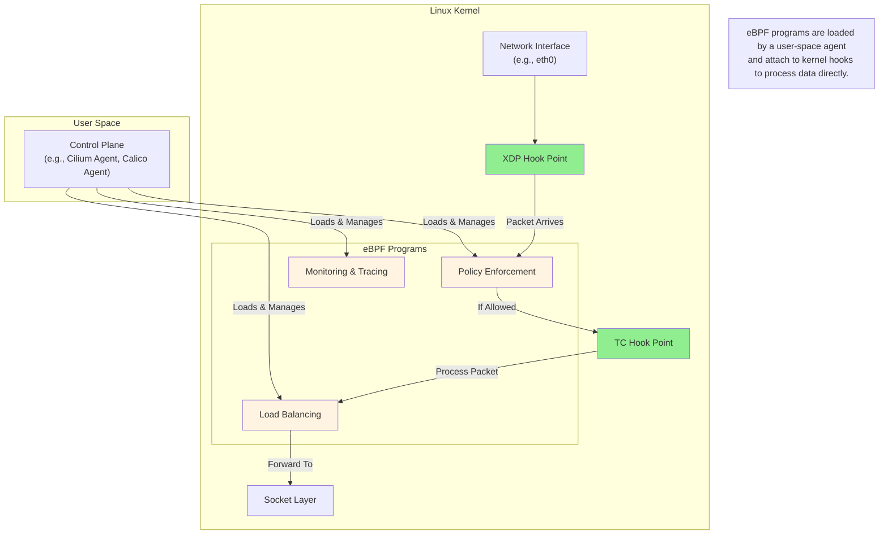
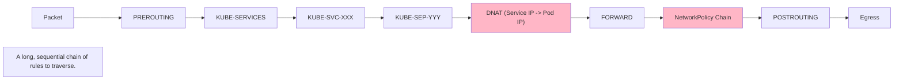
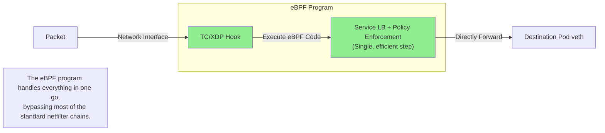

# Kubernetes Networking Game-Changer: An Introduction to eBPF

## 1. Problem Analysis: The Limits of Traditional Networking

For years, Kubernetes networking has primarily relied on `iptables` (or IPVS) managed by `kube-proxy`. While functional, this approach has inherent limitations, especially at scale. Your previous explorations of `Routes-based` networking perfectly highlight the complexity of `iptables`: long, complex chains, DNAT translations, and performance degradation as the number of services and rules grows.

**Key Pain Points of `iptables`:**

- **Performance:** `iptables` rules are sequential. Every packet must traverse a long chain, leading to increased latency, especially with thousands of rules.
- **Scalability:** The performance hit becomes a significant bottleneck in large clusters.
- **Complexity:** Debugging `iptables` is notoriously difficult. Tracing a single packet's journey through `PREROUTING`, `FORWARD`, `POSTROUTING`, and various custom chains is a complex task.
- **Source IP Obfuscation:** SNAT (Source Network Address Translation) is often required, which can hide the original source IP of a packet, making security policies and logging more difficult.

## 2. Solution: eBPF - A New Paradigm

**eBPF (extended Berkeley Packet Filter)** is a revolutionary Linux kernel technology that allows you to run sandboxed programs directly within the kernel. Think of it as giving the kernel "JavaScript-like" programmability without changing kernel source code or loading kernel modules.

For networking, this means we can attach custom logic to various hook points in the kernel's network stack, processing packets with incredible speed and efficiency.

## 3. eBPF vs. iptables: The Core Difference

The fundamental difference lies in *how* they process packets. `iptables` is a chain-based system, while eBPF is event-driven and attached directly to hooks.

### `iptables` Flow (What you've analyzed before)

### eBPF Flow (The modern approach)

## 4. How eBPF Replaces `kube-proxy`

With an eBPF-powered CNI (like Cilium or Calico with eBPF), you can run your cluster entirely without `kube-proxy`. The eBPF programs loaded onto each node handle Service-to-Pod translation directly.

- An agent on each node watches the Kubernetes API for Services and Endpoints.
- It compiles this information into an eBPF "map" (a highly efficient key-value store in the kernel).
- When a packet arrives destined for a Service IP, the eBPF program at the TC (Traffic Control) hook looks up the Service IP in the eBPF map.
- It instantly finds a healthy backend Pod IP, performs the DNAT, and forwards the packet.

This is significantly faster than traversing `iptables` chains.

## 5. Benefits of eBPF in Kubernetes

| Feature | `iptables`-based CNI | eBPF-based CNI (e.g., Cilium) |
| :--- | :--- | :--- |
| **Service Load Balancing** | Relies on `kube-proxy` and `iptables` chains. | Handled by eBPF programs. Faster, `kube-proxy`-free. |
| **NetworkPolicy** | Implemented via long `iptables` chains. | Enforced via eBPF programs. More efficient and scalable. |
| **Source IP Preservation** | Often requires SNAT, losing the original source IP. | Typically preserves the source IP, simplifying security. |
| **Observability** | Limited. Requires sidecars or complex tooling. | Deep, built-in visibility (e.g., Hubble) into L3/L4 and L7 protocols (HTTP, gRPC, Kafka). |
| **Performance** | Degrades as the number of services/pods grows. | Scales linearly with consistent, high performance. |
| **Security** | Basic L3/L4 filtering. | Advanced L7-aware policies, identity-based security, API-aware filtering. |

## 6. Practical Example: GKE Dataplane V2

GKE's Dataplane V2 is a prime example of eBPF in action. It uses **Cilium** under the hood.

When you enable Dataplane V2:

1.  **No `kube-proxy`**: The `kube-proxy` DaemonSet is not deployed. All Service load balancing is handled by eBPF.
2.  **No `iptables` for networking**: Pod-to-Pod networking and NetworkPolicy enforcement bypass `iptables`, significantly improving performance.
3.  **Source IP Preservation**: SNAT is often avoided, making Ingress policies in NetworkPolicy more reliable and logging more accurate.
4.  **Policy Enforcement**: Your `NetworkPolicy` YAMLs are compiled into efficient eBPF programs, not `iptables` rules. The logic remains the same (e.g., `namespaceSelector`), but the implementation is far superior.

Because eBPF in Dataplane V2 preserves the source Pod IP even in cross-node scenarios, you **do not need** to open ports on the Node firewall for Pod-to-Pod communication. The logic you explored in `network-node-ip.md` simplifies, as the `ipBlock` for Node IPs becomes unnecessary for `NetworkPolicy` in all standard cases.

## 7. Summary

eBPF is not just an incremental improvement; it's a fundamental shift in how kernel-level networking is done. By moving logic from complex, chained rules in `iptables` to highly efficient, programmable hooks, eBPF provides Kubernetes with the performance, scalability, and security required for modern, large-scale microservices.
