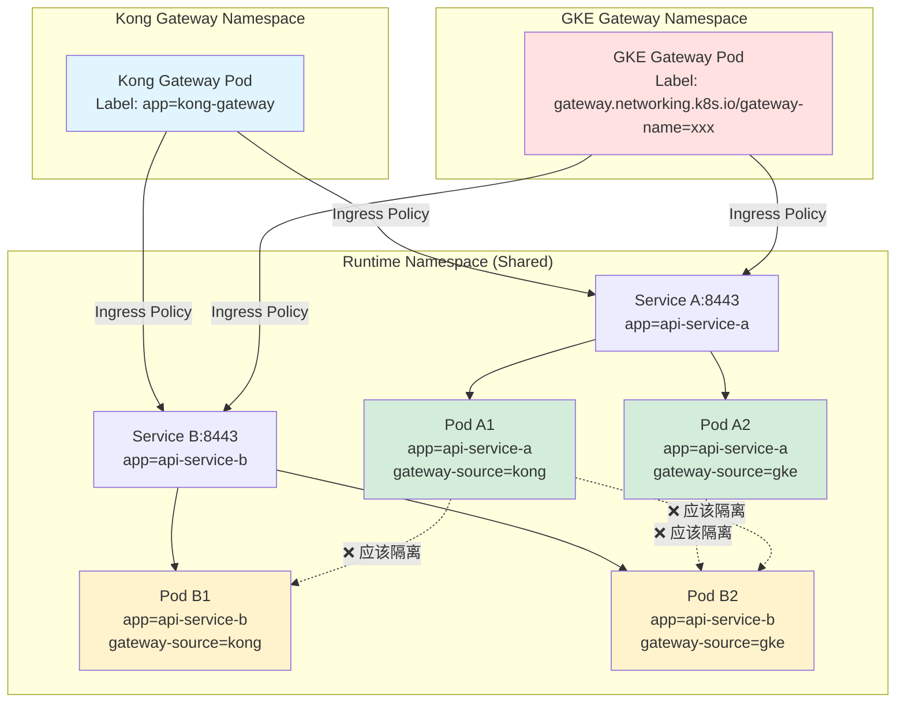
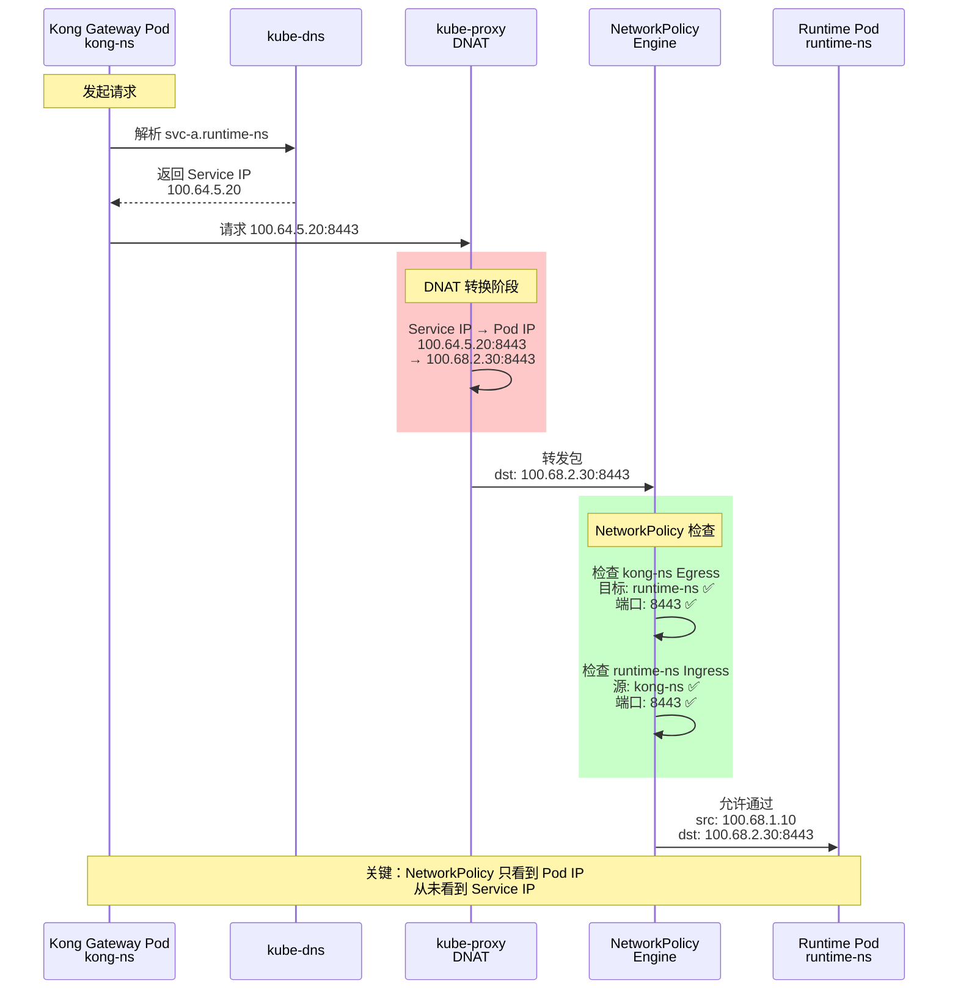
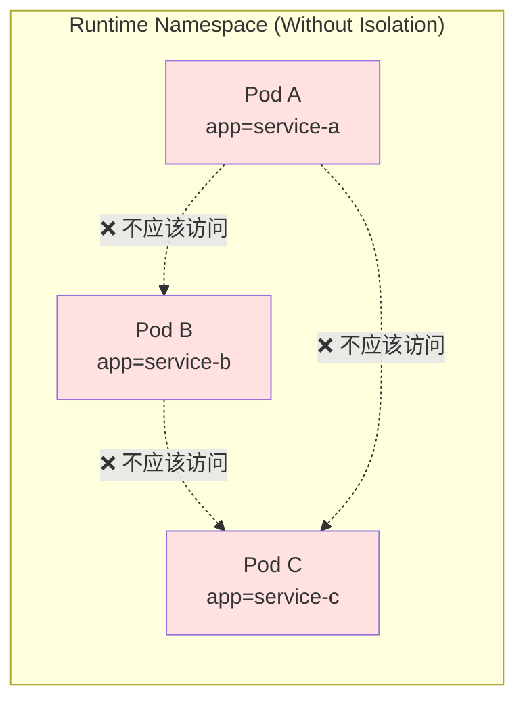
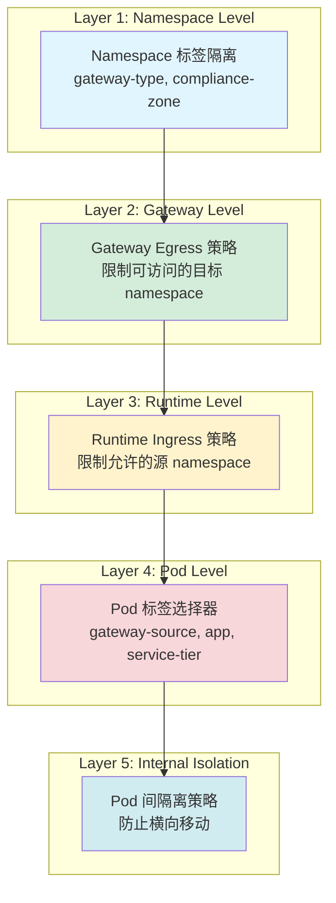
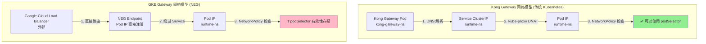
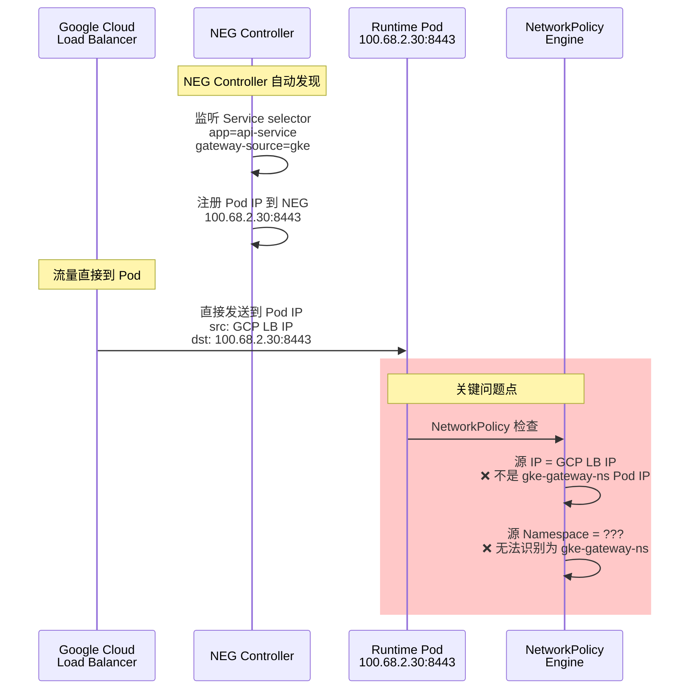

- [Gateway-Namespace 跨 Namespace 网络策略配置分析](#gateway-namespace-跨-namespace-网络策略配置分析)
  - [场景概述](#场景概述)
    - [核心挑战](#核心挑战)
  - [架构流量图](#架构流量图)
    - [完整流量路径](#完整流量路径)
    - [Routes-based 模式下的实际网络包流转](#routes-based-模式下的实际网络包流转)
  - [标签策略设计](#标签策略设计)
    - [推荐标签方案](#推荐标签方案)
      - [1. Namespace 标签](#1-namespace-标签)
      - [2. Deployment 标签策略](#2-deployment-标签策略)
      - [3. Runtime Pod 标签策略（关键）](#3-runtime-pod-标签策略关键)
    - [标签设计原则](#标签设计原则)
  - [NetworkPolicy 配置方案](#networkpolicy-配置方案)
    - [方案 1: 基础隔离方案（最小权限）](#方案-1-基础隔离方案最小权限)
      - [Kong Gateway Namespace - Egress](#kong-gateway-namespace---egress)
      - [GKE Gateway Namespace - Egress](#gke-gateway-namespace---egress)
      - [Runtime Namespace - Ingress（分离策略）](#runtime-namespace---ingress分离策略)
    - [方案 2: 灵活共享方案](#方案-2-灵活共享方案)
    - [方案 3: 分层安全方案（推荐）](#方案-3-分层安全方案推荐)
  - [Runtime Namespace 内部 Pod 隔离策略](#runtime-namespace-内部-pod-隔离策略)
    - [问题分析](#问题分析)
    - [隔离策略配置](#隔离策略配置)
      - [策略 1: 完全隔离（最严格）](#策略-1-完全隔离最严格)
      - [策略 2: 按应用隔离](#策略-2-按应用隔离)
      - [策略 3: 按服务层级隔离](#策略-3-按服务层级隔离)
  - [安全性考量和最佳实践](#安全性考量和最佳实践)
    - [1. 最小权限原则](#1-最小权限原则)
    - [2. 分层防御策略](#2-分层防御策略)
    - [3. 审计和监控](#3-审计和监控)
      - [推荐的标签用于审计](#推荐的标签用于审计)
      - [NetworkPolicy 审计日志](#networkpolicy-审计日志)
    - [4. 合规性控制](#4-合规性控制)
      - [PCI-DSS 合规示例](#pci-dss-合规示例)
  - [Routes-based 模式特殊考虑](#routes-based-模式特殊考虑)
    - [GCP 防火墙规则（必需）](#gcp-防火墙规则必需)
    - [关键点说明](#关键点说明)
  - [完整配置示例](#完整配置示例)
    - [场景：Kong 和 GKE Gateway 共享 Runtime Namespace](#场景kong-和-gke-gateway-共享-runtime-namespace)
      - [步骤 1: 标记 Namespace](#步骤-1-标记-namespace)
      - [步骤 2: 部署 Deployment 并打标签](#步骤-2-部署-deployment-并打标签)
      - [步骤 3: 创建 Service](#步骤-3-创建-service)
      - [步骤 4: 应用 NetworkPolicy](#步骤-4-应用-networkpolicy)
      - [步骤 5: 配置 GCP 防火墙](#步骤-5-配置-gcp-防火墙)
  - [验证和测试](#验证和测试)
    - [测试清单](#测试清单)
    - [故障排查](#故障排查)
  - [总结和建议](#总结和建议)
    - [推荐配置方案](#推荐配置方案)
    - [关键要点](#关键要点)
    - [合规性检查清单](#合规性检查清单)
  - [⚠️ 重要补充：GKE Gateway NEG 网络模型分析](#️-重要补充gke-gateway-neg-网络模型分析)
    - [问题核心分析](#问题核心分析)
      - [GKE Gateway 与 Kong Gateway 的网络模型差异](#gke-gateway-与-kong-gateway-的网络模型差异)
    - [GKE Gateway NEG 工作原理](#gke-gateway-neg-工作原理)
      - [1. NEG (Network Endpoint Groups) 机制](#1-neg-network-endpoint-groups-机制)
      - [2. NEG 流量路径（关键差异）](#2-neg-流量路径关键差异)
    - [问题 1: GKE Gateway Egress 策略的有效性](#问题-1-gke-gateway-egress-策略的有效性)
      - [原配置（可能无效）](#原配置可能无效)
      - [为什么可能无效？](#为什么可能无效)
    - [问题 2: Runtime Namespace Ingress 策略的有效性](#问题-2-runtime-namespace-ingress-策略的有效性)
      - [原配置（需要修正）](#原配置需要修正)
      - [为什么需要修正？](#为什么需要修正)
    - [修正方案](#修正方案)
      - [方案 A: 基于 IP 范围（Routes-based 模式）](#方案-a-基于-ip-范围routes-based-模式)
      - [方案 B: VPC-native 模式（推荐）](#方案-b-vpc-native-模式推荐)
      - [方案 C: 混合策略（Kong + GKE Gateway）](#方案-c-混合策略kong--gke-gateway)
    - [标签策略的重新评估](#标签策略的重新评估)
      - [`gateway-source` 标签的实际作用](#gateway-source-标签的实际作用)
    - [对比总结表](#对比总结表)
    - [推荐的最终配置](#推荐的最终配置)
      - [1. Kong Gateway 配置（保持不变）](#1-kong-gateway-配置保持不变)
      - [2. GKE Gateway 配置（修正后）](#2-gke-gateway-配置修正后)
    - [验证步骤](#验证步骤)
    - [关键结论](#关键结论)
    - [建议的后续行动](#建议的后续行动)

# Gateway-Namespace 跨 Namespace 网络策略配置分析

## 场景概述

在 GKE Routes-based 模式下，存在两种 Gateway 形式同时访问共享的 Runtime Namespace：

```
Kong Gateway Namespace  ──→  Runtime-Namespace  ──→  Pod
GKE Gateway Namespace   ──→  Runtime-Namespace  ──→  Pod
```

### 核心挑战

- **共享 Runtime Namespace**：同一个 namespace 接收来自不同 gateway 的流量
- **默认 Deny All 策略**：所有 namespace 间流量默认拒绝
- **Routes-based 模式限制**：GKE Gateway API 只能基于 Namespace 级别控制，不支持 podSelector
- **Pod 间隔离需求**：runtime-namespace 内部 Pod 之间需要安全隔离
- **合规性要求**：满足安全审计和合规控制标准

## 架构流量图

### 完整流量路径
- 因为对于我的 Runtime-namespace来说netpol是namespace level的，而只要service 服务起来 ，他没法默认去拒绝不允许谁来连接我。
- 我们正在要做的是Pod之间的隔离



### Routes-based 模式下的实际网络包流转



## 标签策略设计

### 推荐标签方案

为了实现细粒度控制和合规性，建议采用以下标签策略：

#### 1. Namespace 标签

```yaml
# Kong Gateway Namespace
apiVersion: v1
kind: Namespace
metadata:
  name: kong-gateway-ns
  labels:
    kubernetes.io/metadata.name: kong-gateway-ns
    gateway-type: kong
    environment: production
    compliance-zone: gateway

---
# GKE Gateway Namespace
apiVersion: v1
kind: Namespace
metadata:
  name: gke-gateway-ns
  labels:
    kubernetes.io/metadata.name: gke-gateway-ns
    gateway-type: gke
    environment: production
    compliance-zone: gateway

---
# Runtime Namespace
apiVersion: v1
kind: Namespace
metadata:
  name: runtime-ns
  labels:
    kubernetes.io/metadata.name: runtime-ns
    environment: production
    compliance-zone: runtime
```

#### 2. Deployment 标签策略

```yaml
# Kong Gateway Deployment
apiVersion: apps/v1
kind: Deployment
metadata:
  name: kong-gateway
  namespace: kong-gateway-ns
spec:
  template:
    metadata:
      labels:
        app: kong-gateway
        component: gateway
        gateway-type: kong
        version: v1.0.0
    spec:
      containers:
      - name: kong
        # ...

---
# GKE Gateway (由 Gateway API 自动创建)
# 标签由 GKE Gateway Controller 自动添加
# 通常包含：
#   gateway.networking.k8s.io/gateway-name: <gateway-name>
#   app.kubernetes.io/name: gke-l7-gxlb
```

#### 3. Runtime Pod 标签策略（关键）

```yaml
# 方案 A: 按 Gateway 来源区分（推荐）
apiVersion: apps/v1
kind: Deployment
metadata:
  name: api-service-a-kong
  namespace: runtime-ns
spec:
  template:
    metadata:
      labels:
        app: api-service-a
        gateway-source: kong          # 标识流量来源
        service-tier: backend
        compliance-level: standard
    spec:
      containers:
      - name: app
        ports:
        - containerPort: 8443
          name: https

---
# 方案 B: 按服务功能区分
apiVersion: apps/v1
kind: Deployment
metadata:
  name: api-service-b-gke
  namespace: runtime-ns
spec:
  template:
    metadata:
      labels:
        app: api-service-b
        gateway-source: gke           # 标识流量来源
        service-tier: frontend
        compliance-level: high
    spec:
      containers:
      - name: app
        ports:
        - containerPort: 8443
          name: https
```

### 标签设计原则

| 标签类型 | 标签键 | 用途 | 示例值 |
|---------|--------|------|--------|
| **应用标识** | `app` | 标识应用名称 | `api-service-a`, `api-service-b` |
| **流量来源** | `gateway-source` | 区分流量来源 Gateway | `kong`, `gke`, `both` |
| **服务层级** | `service-tier` | 服务分层 | `frontend`, `backend`, `database` |
| **合规等级** | `compliance-level` | 安全合规级别 | `high`, `standard`, `low` |
| **组件类型** | `component` | 组件类型 | `gateway`, `api`, `cache` |
| **版本标识** | `version` | 应用版本 | `v1.0.0`, `v2.1.3` |

## NetworkPolicy 配置方案

### 方案 1: 基础隔离方案（最小权限）

适用于严格安全要求，每个 Gateway 只能访问指定的服务。

#### Kong Gateway Namespace - Egress

```yaml
apiVersion: networking.k8s.io/v1
kind: NetworkPolicy
metadata:
  name: kong-gateway-egress
  namespace: kong-gateway-ns
spec:
  podSelector:
    matchLabels:
      app: kong-gateway
  policyTypes:
  - Egress
  egress:
  # 允许访问 Runtime Namespace 的特定服务
  - to:
    - namespaceSelector:
        matchLabels:
          kubernetes.io/metadata.name: runtime-ns
      podSelector:
        matchLabels:
          gateway-source: kong  # 只访问标记为 kong 的 Pod
    ports:
    - protocol: TCP
      port: 8443
  
  # 允许 DNS 解析
  - to:
    - namespaceSelector:
        matchLabels:
          kubernetes.io/metadata.name: kube-system
    - podSelector:
        matchLabels:
          k8s-app: kube-dns
    ports:
    - protocol: UDP
      port: 53
    - protocol: TCP
      port: 53
```

#### GKE Gateway Namespace - Egress

```yaml
apiVersion: networking.k8s.io/v1
kind: NetworkPolicy
metadata:
  name: gke-gateway-egress
  namespace: gke-gateway-ns
spec:
  podSelector: {}  # 应用到所有 GKE Gateway Pod
  policyTypes:
  - Egress
  egress:
  # 允许访问 Runtime Namespace 的特定服务
  - to:
    - namespaceSelector:
        matchLabels:
          kubernetes.io/metadata.name: runtime-ns
      podSelector:
        matchLabels:
          gateway-source: gke  # 只访问标记为 gke 的 Pod .这里是无效的 后面有单独探索
    ports:
    - protocol: TCP
      port: 8443
  
  # 允许 DNS 解析
  - to:
    - namespaceSelector:
        matchLabels:
          kubernetes.io/metadata.name: kube-system
    - podSelector:
        matchLabels:
          k8s-app: kube-dns
    ports:
    - protocol: UDP
      port: 53
    - protocol: TCP
      port: 53
```

#### Runtime Namespace - Ingress（分离策略）

```yaml
# 策略 1: 允许来自 Kong Gateway 的流量
apiVersion: networking.k8s.io/v1
kind: NetworkPolicy
metadata:
  name: allow-from-kong-gateway
  namespace: runtime-ns
spec:
  podSelector:
    matchLabels:
      gateway-source: kong  # 只应用到标记为 kong 的 Pod
  policyTypes:
  - Ingress
  ingress:
  - from:
    - namespaceSelector:
        matchLabels:
          kubernetes.io/metadata.name: kong-gateway-ns
    ports:
    - protocol: TCP
      port: 8443

---
# 策略 2: 允许来自 GKE Gateway 的流量
apiVersion: networking.k8s.io/v1
kind: NetworkPolicy
metadata:
  name: allow-from-gke-gateway
  namespace: runtime-ns
spec:
  podSelector:
    matchLabels:
      gateway-source: gke  # 只应用到标记为 gke 的 Pod
  policyTypes:
  - Ingress
  ingress:
  - from:
    - namespaceSelector:
        matchLabels:
          kubernetes.io/metadata.name: gke-gateway-ns
    ports:
    - protocol: TCP
      port: 8443

---
# 策略 3: Runtime Namespace 内部 Pod 隔离
apiVersion: networking.k8s.io/v1
kind: NetworkPolicy
metadata:
  name: deny-pod-to-pod-within-runtime
  namespace: runtime-ns
spec:
  podSelector: {}  # 应用到所有 Pod
  policyTypes:
  - Ingress
  - Egress
  ingress: []  # 默认拒绝所有入站（除非其他策略明确允许）
  egress:
  # 只允许 DNS 和必要的出站流量
  - to:
    - namespaceSelector:
        matchLabels:
          kubernetes.io/metadata.name: kube-system
    - podSelector:
        matchLabels:
          k8s-app: kube-dns
    ports:
    - protocol: UDP
      port: 53
    - protocol: TCP
      port: 53
```

### 方案 2: 灵活共享方案

适用于两个 Gateway 可以访问相同服务的场景。

```yaml
# Runtime Namespace - 统一 Ingress 策略
apiVersion: networking.k8s.io/v1
kind: NetworkPolicy
metadata:
  name: allow-from-all-gateways
  namespace: runtime-ns
spec:
  podSelector:
    matchLabels:
      service-tier: backend  # 应用到所有后端服务
  policyTypes:
  - Ingress
  ingress:
  # 允许来自 Kong Gateway
  - from:
    - namespaceSelector:
        matchLabels:
          gateway-type: kong
    ports:
    - protocol: TCP
      port: 8443
  
  # 允许来自 GKE Gateway
  - from:
    - namespaceSelector:
        matchLabels:
          gateway-type: gke
    ports:
    - protocol: TCP
      port: 8443
```

### 方案 3: 分层安全方案（推荐）

结合服务分层和合规等级的细粒度控制。

```yaml
# 高合规等级服务 - 只允许 GKE Gateway
apiVersion: networking.k8s.io/v1
kind: NetworkPolicy
metadata:
  name: high-compliance-ingress
  namespace: runtime-ns
spec:
  podSelector:
    matchLabels:
      compliance-level: high
  policyTypes:
  - Ingress
  ingress:
  - from:
    - namespaceSelector:
        matchLabels:
          kubernetes.io/metadata.name: gke-gateway-ns
    ports:
    - protocol: TCP
      port: 8443

---
# 标准合规等级服务 - 允许两个 Gateway
apiVersion: networking.k8s.io/v1
kind: NetworkPolicy
metadata:
  name: standard-compliance-ingress
  namespace: runtime-ns
spec:
  podSelector:
    matchLabels:
      compliance-level: standard
  policyTypes:
  - Ingress
  ingress:
  - from:
    - namespaceSelector:
        matchLabels:
          gateway-type: kong
    ports:
    - protocol: TCP
      port: 8443
  - from:
    - namespaceSelector:
        matchLabels:
          gateway-type: gke
    ports:
    - protocol: TCP
      port: 8443
```

## Runtime Namespace 内部 Pod 隔离策略

### 问题分析

在共享 Runtime Namespace 中，默认情况下同一 namespace 内的 Pod 可以相互访问，这可能带来安全风险：



### 隔离策略配置

#### 策略 1: 完全隔离（最严格）

```yaml
# 默认拒绝所有 Pod 间通信
apiVersion: networking.k8s.io/v1
kind: NetworkPolicy
metadata:
  name: default-deny-all-pod-to-pod
  namespace: runtime-ns
spec:
  podSelector: {}
  policyTypes:
  - Ingress
  - Egress
  # 空的 ingress 和 egress 规则 = 拒绝所有
```

#### 策略 2: 按应用隔离

```yaml
# 只允许同一应用的 Pod 之间通信
apiVersion: networking.k8s.io/v1
kind: NetworkPolicy
metadata:
  name: allow-same-app-communication
  namespace: runtime-ns
spec:
  podSelector:
    matchLabels:
      app: api-service-a  # 应用到 service-a
  policyTypes:
  - Ingress
  - Egress
  ingress:
  # 允许来自相同应用的 Pod
  - from:
    - podSelector:
        matchLabels:
          app: api-service-a
    ports:
    - protocol: TCP
      port: 8443
  
  egress:
  # 允许访问相同应用的 Pod
  - to:
    - podSelector:
        matchLabels:
          app: api-service-a
    ports:
    - protocol: TCP
      port: 8443
  
  # 允许 DNS
  - to:
    - namespaceSelector:
        matchLabels:
          kubernetes.io/metadata.name: kube-system
    - podSelector:
        matchLabels:
          k8s-app: kube-dns
    ports:
    - protocol: UDP
      port: 53
```

#### 策略 3: 按服务层级隔离

```yaml
# Frontend 可以访问 Backend，但 Backend 不能访问 Frontend
apiVersion: networking.k8s.io/v1
kind: NetworkPolicy
metadata:
  name: backend-ingress-from-frontend
  namespace: runtime-ns
spec:
  podSelector:
    matchLabels:
      service-tier: backend
  policyTypes:
  - Ingress
  ingress:
  # 允许来自 Frontend
  - from:
    - podSelector:
        matchLabels:
          service-tier: frontend
    ports:
    - protocol: TCP
      port: 8443
  
  # 允许来自 Gateway
  - from:
    - namespaceSelector:
        matchLabels:
          compliance-zone: gateway
    ports:
    - protocol: TCP
      port: 8443
```

## 安全性考量和最佳实践

### 1. 最小权限原则

```yaml
# ✅ 好的实践：精确指定源和目标
apiVersion: networking.k8s.io/v1
kind: NetworkPolicy
metadata:
  name: precise-policy
  namespace: runtime-ns
spec:
  podSelector:
    matchLabels:
      app: api-service
      gateway-source: kong
  policyTypes:
  - Ingress
  ingress:
  - from:
    - namespaceSelector:
        matchLabels:
          kubernetes.io/metadata.name: kong-gateway-ns
      podSelector:
        matchLabels:
          app: kong-gateway
    ports:
    - protocol: TCP
      port: 8443

---
# ❌ 不推荐：过于宽松
apiVersion: networking.k8s.io/v1
kind: NetworkPolicy
metadata:
  name: loose-policy
  namespace: runtime-ns
spec:
  podSelector: {}  # 应用到所有 Pod
  policyTypes:
  - Ingress
  ingress:
  - from:
    - namespaceSelector: {}  # 允许所有 namespace
    ports:
    - protocol: TCP
      port: 8443
```

### 2. 分层防御策略



### 3. 审计和监控

#### 推荐的标签用于审计

```yaml
metadata:
  labels:
    # 审计标签
    audit-required: "true"
    data-classification: "confidential"  # public, internal, confidential, restricted
    pci-compliant: "true"
    
    # 监控标签
    monitoring-tier: "critical"  # critical, high, medium, low
    alert-channel: "security-team"
```

#### NetworkPolicy 审计日志

```yaml
# 使用 Calico 或 Cilium 启用审计日志
apiVersion: networking.k8s.io/v1
kind: NetworkPolicy
metadata:
  name: audited-policy
  namespace: runtime-ns
  annotations:
    # Calico 注解
    projectcalico.org/metadata: '{"audit": "true"}'
spec:
  # ... policy rules
```

### 4. 合规性控制

#### PCI-DSS 合规示例

```yaml
# 高安全等级服务的网络策略
apiVersion: networking.k8s.io/v1
kind: NetworkPolicy
metadata:
  name: pci-compliant-service
  namespace: runtime-ns
  labels:
    compliance-standard: pci-dss
    compliance-version: v3.2.1
spec:
  podSelector:
    matchLabels:
      pci-compliant: "true"
      data-classification: restricted
  policyTypes:
  - Ingress
  - Egress
  ingress:
  # 只允许来自经过认证的 Gateway
  - from:
    - namespaceSelector:
        matchLabels:
          kubernetes.io/metadata.name: gke-gateway-ns
          pci-compliant: "true"
    ports:
    - protocol: TCP
      port: 8443
  
  egress:
  # 严格限制出站流量
  - to:
    - namespaceSelector:
        matchLabels:
          kubernetes.io/metadata.name: kube-system
    - podSelector:
        matchLabels:
          k8s-app: kube-dns
    ports:
    - protocol: UDP
      port: 53
  
  # 只允许访问经过认证的数据库
  - to:
    - namespaceSelector:
        matchLabels:
          kubernetes.io/metadata.name: database-ns
      podSelector:
        matchLabels:
          pci-compliant: "true"
    ports:
    - protocol: TCP
      port: 5432
```

## Routes-based 模式特殊考虑

### GCP 防火墙规则（必需）

在 Routes-based 模式下，跨节点流量需要 GCP 防火墙规则支持：

```bash
#!/bin/bash
# 创建防火墙规则允许 Gateway 到 Runtime 的流量

PROJECT_ID="your-project-id"
VPC_NETWORK="your-vpc"
GKE_CLUSTER="your-cluster"

# 获取 Pod CIDR 范围
POD_CIDR="100.64.0.0/14"
NODE_CIDR="192.168.64.0/19"

# 规则 1: 允许 Pod 到 Pod 通信（8443 端口）
gcloud compute firewall-rules create allow-gateway-to-runtime-8443 \
  --project="${PROJECT_ID}" \
  --network="${VPC_NETWORK}" \
  --action=ALLOW \
  --rules=tcp:8443 \
  --source-ranges="${POD_CIDR}" \
  --target-tags="gke-${GKE_CLUSTER}" \
  --description="Allow gateway pods to access runtime pods on port 8443" \
  --priority=1000

# 规则 2: 允许健康检查（如果需要）
gcloud compute firewall-rules create allow-health-check-8443 \
  --project="${PROJECT_ID}" \
  --network="${VPC_NETWORK}" \
  --action=ALLOW \
  --rules=tcp:8443 \
  --source-ranges="${NODE_CIDR}" \
  --target-tags="gke-${GKE_CLUSTER}" \
  --description="Allow kubelet health checks on port 8443" \
  --priority=1000
```

### 关键点说明

| 配置项 | 值 | 说明 |
|--------|-----|------|
| **NetworkPolicy 端口** | 8443 | Pod 实际监听端口（targetPort） |
| **Service 端口** | 443 或 8443 | 对外暴露端口 |
| **GCP 防火墙端口** | 8443 | 必须与 Pod 端口一致 |
| **源 IP 范围** | Pod CIDR | NetworkPolicy 看到的是 Pod IP |

## 完整配置示例

### 场景：Kong 和 GKE Gateway 共享 Runtime Namespace

#### 步骤 1: 标记 Namespace

```bash
# Kong Gateway Namespace
kubectl label namespace kong-gateway-ns \
  kubernetes.io/metadata.name=kong-gateway-ns \
  gateway-type=kong \
  compliance-zone=gateway

# GKE Gateway Namespace
kubectl label namespace gke-gateway-ns \
  kubernetes.io/metadata.name=gke-gateway-ns \
  gateway-type=gke \
  compliance-zone=gateway

# Runtime Namespace
kubectl label namespace runtime-ns \
  kubernetes.io/metadata.name=runtime-ns \
  compliance-zone=runtime
```

#### 步骤 2: 部署 Deployment 并打标签

```yaml
# Kong 专用服务
apiVersion: apps/v1
kind: Deployment
metadata:
  name: api-service-kong
  namespace: runtime-ns
spec:
  replicas: 2
  selector:
    matchLabels:
      app: api-service
      gateway-source: kong
  template:
    metadata:
      labels:
        app: api-service
        gateway-source: kong
        service-tier: backend
        compliance-level: standard
        version: v1.0.0
    spec:
      containers:
      - name: app
        image: your-app:v1.0.0
        ports:
        - containerPort: 8443
          name: https
          protocol: TCP
        env:
        - name: GATEWAY_SOURCE
          value: "kong"

---
# GKE Gateway 专用服务
apiVersion: apps/v1
kind: Deployment
metadata:
  name: api-service-gke
  namespace: runtime-ns
spec:
  replicas: 2
  selector:
    matchLabels:
      app: api-service
      gateway-source: gke
  template:
    metadata:
      labels:
        app: api-service
        gateway-source: gke
        service-tier: backend
        compliance-level: high
        version: v1.0.0
    spec:
      containers:
      - name: app
        image: your-app:v1.0.0
        ports:
        - containerPort: 8443
          name: https
          protocol: TCP
        env:
        - name: GATEWAY_SOURCE
          value: "gke"
```

#### 步骤 3: 创建 Service

```yaml
# Kong 专用 Service
apiVersion: v1
kind: Service
metadata:
  name: api-service-kong
  namespace: runtime-ns
  labels:
    app: api-service
    gateway-source: kong
spec:
  type: ClusterIP
  selector:
    app: api-service
    gateway-source: kong
  ports:
  - name: https
    protocol: TCP
    port: 8443
    targetPort: 8443

---
# GKE Gateway 专用 Service
apiVersion: v1
kind: Service
metadata:
  name: api-service-gke
  namespace: runtime-ns
  labels:
    app: api-service
    gateway-source: gke
spec:
  type: ClusterIP
  selector:
    app: api-service
    gateway-source: gke
  ports:
  - name: https
    protocol: TCP
    port: 8443
    targetPort: 8443
```

#### 步骤 4: 应用 NetworkPolicy

```bash
# 应用所有网络策略
kubectl apply -f kong-gateway-egress.yaml
kubectl apply -f gke-gateway-egress.yaml
kubectl apply -f runtime-ingress-policies.yaml
kubectl apply -f runtime-pod-isolation.yaml
```

#### 步骤 5: 配置 GCP 防火墙

```bash
./create-firewall-rules.sh
```

## 验证和测试

### 测试清单

```bash
# 1. 验证 Namespace 标签
kubectl get namespace kong-gateway-ns gke-gateway-ns runtime-ns --show-labels

# 2. 验证 NetworkPolicy
kubectl get networkpolicies -A
kubectl describe networkpolicy -n kong-gateway-ns
kubectl describe networkpolicy -n gke-gateway-ns
kubectl describe networkpolicy -n runtime-ns

# 3. 验证 Pod 标签
kubectl get pods -n runtime-ns --show-labels

# 4. 测试 Kong Gateway 到 Runtime 连接
KONG_POD=$(kubectl get pod -n kong-gateway-ns -l app=kong-gateway -o jsonpath='{.items[0].metadata.name}')
kubectl exec -n kong-gateway-ns ${KONG_POD} -- \
  curl -k -v --connect-timeout 5 https://api-service-kong.runtime-ns:8443/health

# 5. 测试 GKE Gateway 到 Runtime 连接
GKE_POD=$(kubectl get pod -n gke-gateway-ns -o jsonpath='{.items[0].metadata.name}')
kubectl exec -n gke-gateway-ns ${GKE_POD} -- \
  curl -k -v --connect-timeout 5 https://api-service-gke.runtime-ns:8443/health

# 6. 验证 Pod 间隔离（应该失败）
RUNTIME_POD_A=$(kubectl get pod -n runtime-ns -l app=api-service,gateway-source=kong -o jsonpath='{.items[0].metadata.name}')
RUNTIME_POD_B_IP=$(kubectl get pod -n runtime-ns -l app=api-service,gateway-source=gke -o jsonpath='{.items[0].status.podIP}')

kubectl exec -n runtime-ns ${RUNTIME_POD_A} -- \
  curl -k -v --connect-timeout 5 https://${RUNTIME_POD_B_IP}:8443/health
# 预期：连接超时或被拒绝

# 7. 验证 GCP 防火墙规则
gcloud compute firewall-rules list --filter="name~allow.*8443" \
  --format="table(name,sourceRanges,allowed,targetTags)"
```

### 故障排查

```bash
# 检查 NetworkPolicy 是否生效
kubectl get networkpolicies -A -o yaml | grep -A 10 "podSelector"

# 查看 Pod 的网络策略应用情况（Calico）
kubectl exec -n kube-system <calico-node-pod> -- \
  calicoctl get networkpolicy --output yaml

# 抓包验证流量
RUNTIME_POD=$(kubectl get pod -n runtime-ns -l gateway-source=kong -o jsonpath='{.items[0].metadata.name}')
kubectl exec -n runtime-ns ${RUNTIME_POD} -- \
  tcpdump -i any -nn port 8443 -c 20

# 检查 iptables 规则（在 Node 上）
# 需要 SSH 到 Node
sudo iptables -t filter -L -n -v | grep 8443
```

## 总结和建议

### 推荐配置方案

| 场景 | 推荐方案 | 理由 |
|------|----------|------|
| **严格隔离** | 方案 1 + 完全隔离 | 最高安全性，适合金融、医疗等行业 |
| **灵活共享** | 方案 2 + 按应用隔离 | 平衡安全性和灵活性 |
| **分层管理** | 方案 3 + 按服务层级隔离 | 适合大型平台，便于管理 |

### 关键要点

1. **标签是核心**：合理的标签策略是实现细粒度控制的基础
   - `gateway-source`: 区分流量来源
   - `app`: 应用标识
   - `service-tier`: 服务分层
   - `compliance-level`: 合规等级

2. **NetworkPolicy 只看 Pod IP**：
   - 配置端口使用 Pod 端口（8443），不是 Service 端口
   - 使用 `namespaceSelector` 而不是 IP 范围

3. **Routes-based 模式需要 GCP 防火墙**：
   - 必须配置允许 Pod CIDR 到 Node 的 8443 端口
   - 健康检查需要允许 Node CIDR

4. **Pod 间隔离很重要**：
   - 默认拒绝同 namespace 内 Pod 间通信
   - 只允许必要的通信路径

5. **分层防御**：
   - Namespace 级别隔离
   - Gateway 级别控制
   - Pod 级别选择
   - 内部隔离策略

### 合规性检查清单

- [ ] 所有 Namespace 都有明确的标签
- [ ] 所有 Deployment 都有 `gateway-source` 标签
- [ ] 实施了默认拒绝策略
- [ ] NetworkPolicy 使用最小权限原则
- [ ] 配置了 Pod 间隔离策略
- [ ] GCP 防火墙规则已配置
- [ ] 启用了审计日志
- [ ] 定期审查和更新策略
- [ ] 文档化所有网络策略
- [ ] 建立了监控和告警机制

---

## ⚠️ 重要补充：GKE Gateway NEG 网络模型分析

> **用户提出的关键问题**：
> 1. GKE Gateway Namespace Egress 中 `podSelector: gateway-source: gke` 配置有用吗？
> 2. GKE Gateway 使用 NEG (Network Endpoint Groups) 网络，这部分需要重新评估
> 3. Runtime Namespace Ingress 中 `podSelector: gateway-source: gke` 的有效性需要验证

### 问题核心分析

#### GKE Gateway 与 Kong Gateway 的网络模型差异



### GKE Gateway NEG 工作原理

#### 1. NEG (Network Endpoint Groups) 机制

```yaml
# GKE Gateway 通过 HTTPRoute 引用 Service
apiVersion: gateway.networking.k8s.io/v1beta1
kind: HTTPRoute
metadata:
  name: api-route
  namespace: runtime-ns
spec:
  parentRefs:
  - name: external-gateway
    namespace: gke-gateway-ns
  rules:
  - backendRefs:
    - name: api-service-gke  # 引用 Service
      port: 8443

---
# Service 需要 NEG 注解
apiVersion: v1
kind: Service
metadata:
  name: api-service-gke
  namespace: runtime-ns
  annotations:
    cloud.google.com/neg: '{"exposed_ports": {"8443":{}}}'
spec:
  selector:
    app: api-service
    gateway-source: gke  # Service selector 选择 Pod
  ports:
  - port: 8443
    targetPort: 8443
```

#### 2. NEG 流量路径（关键差异）



### 问题 1: GKE Gateway Egress 策略的有效性

#### 原配置（可能无效）

```yaml
# ❌ 这个配置可能没有实际作用
apiVersion: networking.k8s.io/v1
kind: NetworkPolicy
metadata:
  name: gke-gateway-egress
  namespace: gke-gateway-ns
spec:
  podSelector: {}
  policyTypes:
  - Egress
  egress:
  - to:
    - namespaceSelector:
        matchLabels:
          kubernetes.io/metadata.name: runtime-ns
      podSelector:
        matchLabels:
          gateway-source: gke  # ❌ 问题：GKE Gateway 不经过这个 namespace 的 Pod
    ports:
    - protocol: TCP
      port: 8443
```

#### 为什么可能无效？

| 方面 | Kong Gateway | GKE Gateway |
|------|--------------|-------------|
| **流量起点** | Kong Pod (在 kong-gateway-ns) | Google Cloud Load Balancer (外部) |
| **是否经过 Gateway Namespace** | ✅ 是 | ❌ 否（直接到 runtime-ns） |
| **Egress Policy 检查点** | Kong Pod 出站时 | ❌ 无检查点（流量不从 gke-gateway-ns 发出） |
| **podSelector 有效性** | ✅ 有效 | ❌ 无效（没有 Pod 发起流量） |

### 问题 2: Runtime Namespace Ingress 策略的有效性

#### 原配置（需要修正）

```yaml
# ⚠️ 这个配置可能不会按预期工作
apiVersion: networking.k8s.io/v1
kind: NetworkPolicy
metadata:
  name: allow-from-gke-gateway
  namespace: runtime-ns
spec:
  podSelector:
    matchLabels:
      gateway-source: gke  # ✅ 这个有效（选择目标 Pod）
  policyTypes:
  - Ingress
  ingress:
  - from:
    - namespaceSelector:
        matchLabels:
          kubernetes.io/metadata.name: gke-gateway-ns  # ❌ 问题：流量不来自这个 namespace
    ports:
    - protocol: TCP
      port: 8443
```

#### 为什么需要修正？

**流量源 IP 分析**：

```bash
# Kong Gateway 流量
源 IP: 100.68.1.10 (kong-gateway-ns 的 Pod IP)
源 Namespace: kong-gateway-ns ✅ 可以通过 namespaceSelector 匹配

# GKE Gateway 流量
源 IP: 35.x.x.x (Google Cloud Load Balancer IP) 或 GKE Node IP
源 Namespace: ❌ 无法识别为 gke-gateway-ns
```

### 修正方案

#### 方案 A: 基于 IP 范围（Routes-based 模式）

```yaml
# 修正后的 Runtime Namespace Ingress 策略
apiVersion: networking.k8s.io/v1
kind: NetworkPolicy
metadata:
  name: allow-from-gke-gateway-corrected
  namespace: runtime-ns
spec:
  podSelector:
    matchLabels:
      gateway-source: gke
  policyTypes:
  - Ingress
  ingress:
  # 方案 A1: 允许来自 GCP Load Balancer IP 范围
  - from:
    - ipBlock:
        cidr: 35.191.0.0/16  # GCP HTTP(S) Load Balancer IP 范围
    - ipBlock:
        cidr: 130.211.0.0/22  # GCP HTTP(S) Load Balancer IP 范围
    ports:
    - protocol: TCP
      port: 8443
  
  # 方案 A2: 或者允许来自 Node IP 范围（如果 externalTrafficPolicy: Cluster）
  - from:
    - ipBlock:
        cidr: 192.168.64.0/19  # GKE Node IP 范围
    ports:
    - protocol: TCP
      port: 8443
```

> **⚠️ 重要限制**：
> - GKE Gateway API **只支持 VPC-native 集群**，不支持 Routes-based 模式
> - 如果您的环境确实是 Routes-based，可能无法使用 GKE Gateway API
> - 需要确认您的集群模式：`gcloud container clusters describe CLUSTER_NAME --format="value(ipAllocationPolicy.useIpAliases)"`

#### 方案 B: VPC-native 模式（推荐）

如果您的集群是 VPC-native（GKE Gateway API 要求），配置会更简单：

```yaml
# VPC-native 模式下的配置
apiVersion: networking.k8s.io/v1
kind: NetworkPolicy
metadata:
  name: allow-from-gke-gateway-vpc-native
  namespace: runtime-ns
spec:
  podSelector:
    matchLabels:
      gateway-source: gke
  policyTypes:
  - Ingress
  ingress:
  # 允许来自 GCP Load Balancer 健康检查和流量
  - from:
    - ipBlock:
        cidr: 35.191.0.0/16
    - ipBlock:
        cidr: 130.211.0.0/22
    ports:
    - protocol: TCP
      port: 8443
  
  # 如果启用了 externalTrafficPolicy: Local，还需要允许 Pod CIDR
  - from:
    - ipBlock:
        cidr: 10.0.0.0/8  # 根据实际 Pod CIDR 调整
    ports:
    - protocol: TCP
      port: 8443
```

#### 方案 C: 混合策略（Kong + GKE Gateway）

```yaml
# 统一的 Runtime Namespace Ingress 策略
apiVersion: networking.k8s.io/v1
kind: NetworkPolicy
metadata:
  name: allow-from-all-gateways-corrected
  namespace: runtime-ns
spec:
  podSelector:
    matchLabels:
      service-tier: backend
  policyTypes:
  - Ingress
  ingress:
  # 规则 1: 允许来自 Kong Gateway（Namespace-based）
  - from:
    - namespaceSelector:
        matchLabels:
          kubernetes.io/metadata.name: kong-gateway-ns
    ports:
    - protocol: TCP
      port: 8443
  
  # 规则 2: 允许来自 GKE Gateway（IP-based）
  - from:
    - ipBlock:
        cidr: 35.191.0.0/16  # GCP LB
    - ipBlock:
        cidr: 130.211.0.0/22  # GCP LB
    - ipBlock:
        cidr: 192.168.64.0/19  # Node IP（如果需要）
    ports:
    - protocol: TCP
      port: 8443
```

### 标签策略的重新评估

#### `gateway-source` 标签的实际作用

```yaml
# ✅ 有效用途 1: Service Selector
apiVersion: v1
kind: Service
metadata:
  name: api-service-gke
  namespace: runtime-ns
  annotations:
    cloud.google.com/neg: '{"exposed_ports": {"8443":{}}}'
spec:
  selector:
    app: api-service
    gateway-source: gke  # ✅ 有效：NEG Controller 使用这个选择 Pod
  ports:
  - port: 8443
    targetPort: 8443

---
# ✅ 有效用途 2: NetworkPolicy podSelector（目标 Pod）
apiVersion: networking.k8s.io/v1
kind: NetworkPolicy
metadata:
  name: allow-gke-traffic
  namespace: runtime-ns
spec:
  podSelector:
    matchLabels:
      gateway-source: gke  # ✅ 有效：选择接收流量的 Pod
  policyTypes:
  - Ingress
  ingress:
  - from:
    - ipBlock:
        cidr: 35.191.0.0/16  # ⚠️ 必须使用 IP，不能用 namespaceSelector
    ports:
    - protocol: TCP
      port: 8443

---
# ❌ 无效用途: GKE Gateway Egress podSelector（源 Pod）
apiVersion: networking.k8s.io/v1
kind: NetworkPolicy
metadata:
  name: gke-gateway-egress
  namespace: gke-gateway-ns
spec:
  podSelector: {}
  policyTypes:
  - Egress
  egress:
  - to:
    - namespaceSelector:
        matchLabels:
          kubernetes.io/metadata.name: runtime-ns
      podSelector:
        matchLabels:
          gateway-source: gke  # ❌ 无效：流量不从 gke-gateway-ns 发出
    ports:
    - protocol: TCP
      port: 8443
```

### 对比总结表

| 配置项 | Kong Gateway | GKE Gateway (NEG) |
|--------|--------------|-------------------|
| **Gateway Namespace Egress** | ✅ 需要配置<br/>`namespaceSelector` + `podSelector` | ❌ 不需要/无效<br/>流量不从 gateway namespace 发出 |
| **Runtime Namespace Ingress - 源识别** | ✅ `namespaceSelector: kong-gateway-ns` | ❌ 不能用 `namespaceSelector`<br/>✅ 必须用 `ipBlock` (GCP LB IP) |
| **Runtime Namespace Ingress - 目标选择** | ✅ `podSelector: gateway-source=kong` | ✅ `podSelector: gateway-source=gke` |
| **`gateway-source` 标签用途** | 1. NetworkPolicy podSelector<br/>2. Service selector | 1. NetworkPolicy podSelector<br/>2. Service selector<br/>3. NEG endpoint 选择 |
| **流量源 IP** | Kong Pod IP (100.68.x.x) | GCP LB IP (35.x.x.x, 130.x.x.x) |
| **NetworkPolicy 检查点** | Kong Pod → Runtime Pod | GCP LB → Runtime Pod |

### 推荐的最终配置

#### 1. Kong Gateway 配置（保持不变）

```yaml
# Kong Gateway Egress
apiVersion: networking.k8s.io/v1
kind: NetworkPolicy
metadata:
  name: kong-gateway-egress
  namespace: kong-gateway-ns
spec:
  podSelector:
    matchLabels:
      app: kong-gateway
  policyTypes:
  - Egress
  egress:
  - to:
    - namespaceSelector:
        matchLabels:
          kubernetes.io/metadata.name: runtime-ns
      podSelector:
        matchLabels:
          gateway-source: kong
    ports:
    - protocol: TCP
      port: 8443
  - to:
    - namespaceSelector:
        matchLabels:
          kubernetes.io/metadata.name: kube-system
    - podSelector:
        matchLabels:
          k8s-app: kube-dns
    ports:
    - protocol: UDP
      port: 53
    - protocol: TCP
      port: 53

---
# Runtime Namespace Ingress for Kong
apiVersion: networking.k8s.io/v1
kind: NetworkPolicy
metadata:
  name: allow-from-kong-gateway
  namespace: runtime-ns
spec:
  podSelector:
    matchLabels:
      gateway-source: kong
  policyTypes:
  - Ingress
  ingress:
  - from:
    - namespaceSelector:
        matchLabels:
          kubernetes.io/metadata.name: kong-gateway-ns
    ports:
    - protocol: TCP
      port: 8443
```

#### 2. GKE Gateway 配置（修正后）

```yaml
# ❌ 删除或注释掉这个配置（无实际作用）
# apiVersion: networking.k8s.io/v1
# kind: NetworkPolicy
# metadata:
#   name: gke-gateway-egress
#   namespace: gke-gateway-ns
# spec:
#   podSelector: {}
#   policyTypes:
#   - Egress
#   egress:
#   - to:
#     - namespaceSelector:
#         matchLabels:
#           kubernetes.io/metadata.name: runtime-ns
#       podSelector:
#         matchLabels:
#           gateway-source: gke
#     ports:
#     - protocol: TCP
#       port: 8443

---
# ✅ 修正后的 Runtime Namespace Ingress for GKE Gateway
apiVersion: networking.k8s.io/v1
kind: NetworkPolicy
metadata:
  name: allow-from-gke-gateway
  namespace: runtime-ns
spec:
  podSelector:
    matchLabels:
      gateway-source: gke
  policyTypes:
  - Ingress
  ingress:
  # 允许来自 GCP Load Balancer
  - from:
    - ipBlock:
        cidr: 35.191.0.0/16  # GCP HTTP(S) LB 范围 1
    - ipBlock:
        cidr: 130.211.0.0/22  # GCP HTTP(S) LB 范围 2
    ports:
    - protocol: TCP
      port: 8443
  
  # 如果需要支持健康检查和内部流量
  - from:
    - ipBlock:
        cidr: 192.168.64.0/19  # Node IP 范围（根据实际调整）
    ports:
    - protocol: TCP
      port: 8443
```

### 验证步骤

```bash
# 1. 确认集群模式
gcloud container clusters describe YOUR_CLUSTER \
  --zone YOUR_ZONE \
  --format="value(ipAllocationPolicy.useIpAliases)"
# 输出 true = VPC-native（支持 GKE Gateway）
# 输出 false 或空 = Routes-based（不支持 GKE Gateway API）

# 2. 查看 NEG 状态
kubectl get svc -n runtime-ns api-service-gke -o yaml | grep -A 5 "cloud.google.com/neg"

# 3. 查看 NEG endpoints
gcloud compute network-endpoint-groups list --filter="name~gke"

# 4. 测试 GKE Gateway 流量
# 从外部访问 GKE Gateway
curl -v https://YOUR_GKE_GATEWAY_IP/api

# 5. 在 Runtime Pod 中抓包查看源 IP
RUNTIME_POD=$(kubectl get pod -n runtime-ns -l gateway-source=gke -o jsonpath='{.items[0].metadata.name}')
kubectl exec -n runtime-ns ${RUNTIME_POD} -- tcpdump -i any -nn port 8443 -c 10

# 预期看到源 IP 是 GCP LB IP (35.x.x.x 或 130.x.x.x)
# 而不是 gke-gateway-ns 的 Pod IP
```

### 关键结论

1. **GKE Gateway Egress 策略无实际作用**
   - GKE Gateway 使用 NEG，流量直接从 GCP Load Balancer 到 Runtime Pod
   - 不经过 gke-gateway-ns 的任何 Pod
   - 该 namespace 的 Egress 策略不会被触发

2. **Runtime Namespace Ingress 必须使用 IP-based 规则**
   - 不能使用 `namespaceSelector: gke-gateway-ns`
   - 必须使用 `ipBlock` 指定 GCP Load Balancer IP 范围
   - 源 IP 是 GCP LB IP，不是 Kubernetes Pod IP

3. **`gateway-source` 标签仍然有用**
   - ✅ 用于 Service selector（NEG endpoint 选择）
   - ✅ 用于 NetworkPolicy podSelector（目标 Pod 选择）
   - ❌ 不能用于 GKE Gateway 的源识别（因为源不是 Pod）

4. **Routes-based 模式限制**
   - GKE Gateway API **要求 VPC-native 集群**
   - 如果您的环境是 Routes-based，需要迁移到 VPC-native 或使用其他 Gateway 方案

### 建议的后续行动

1. **确认集群模式**：验证是否为 VPC-native
2. **修正 NetworkPolicy**：删除无效的 GKE Gateway Egress，修正 Ingress 为 IP-based
3. **更新文档**：明确标注 Kong Gateway 和 GKE Gateway 的配置差异
4. **测试验证**：使用抓包验证实际流量源 IP
5. **考虑迁移**：如果是 Routes-based，评估迁移到 VPC-native 的可行性
