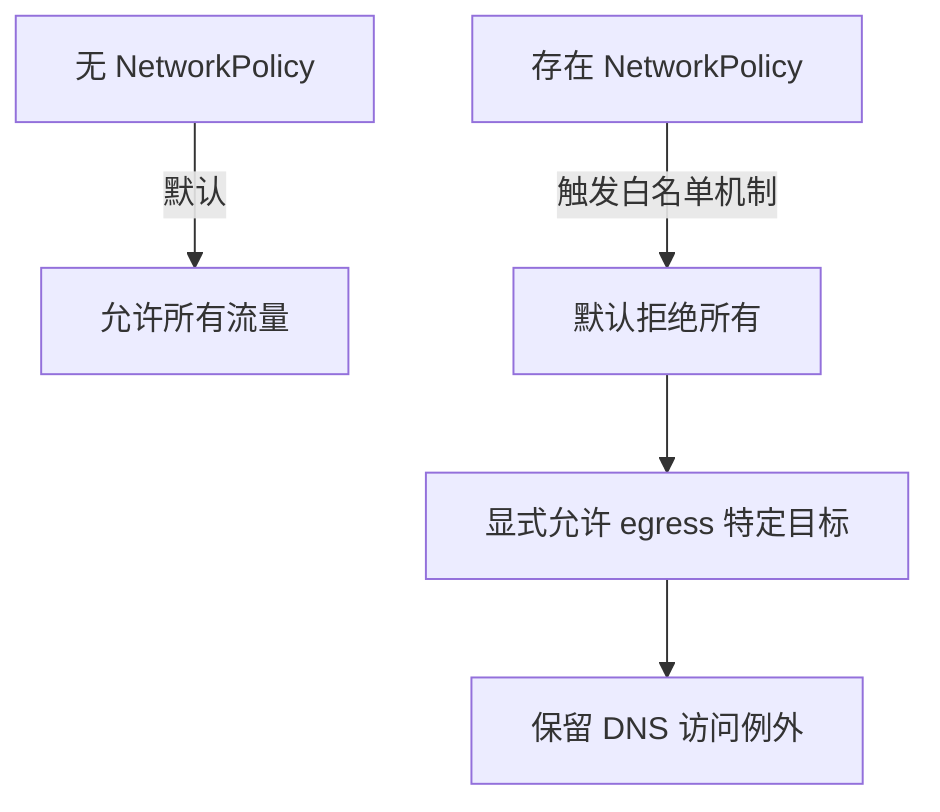

非常好的问题 👍，你说的情况确实是 NetworkPolicy 的常见“陷阱”之一，尤其是在 GKE（或任何 Kubernetes 实现）中。

我们来一步步拆解原因：

🧩 一、问题分析

在 Kubernetes 中，NetworkPolicy 的设计是默认允许一切流量，但是——一旦你定义了任何一条 NetworkPolicy（无论是 ingress 还是 egress），Kubernetes 会认为：

“我现在开始对这个 Pod 的网络访问进行限制性控制。”

也就是说：

- 没有 NetworkPolicy → 默认 allow all。
- 存在 NetworkPolicy → 默认 deny all（除非显式允许）。

这意味着当你只定义了一条 Egress policy 时，实际上你触发了 “默认拒绝” 行为。

⚙️ 二、行为机制解析

以你举的例子为例：
```yaml
apiVersion: networking.k8s.io/v1

kind: NetworkPolicy

metadata:

name: egress-to-special-ns

namespace: ns-a

spec:

podSelector:

matchLabels:

role: client

policyTypes:

- Egress

egress:

- to:

- namespaceSelector:

matchLabels:

name: special-ns
```


🔍 实际效果

1. 这条规则只定义了 Egress 类型；
2. podSelector 匹配了 role=client 的 Pod；
3. 允许这些 Pod 仅能对 special-ns 命名空间的 Pod 进行 Egress。

那么结果是：

- ✅ 能访问 special-ns。
- 🚫 无法访问其他任何 namespace（包括 kube-dns）。
- 🚫 无法访问外部网络（如 8.8.8.8）。
- 🚫 无法解析 DNS，因为 kube-dns 位于 kube-system namespace。

🧠 三、根本原因

NetworkPolicy 是“白名单机制”

只要你声明了 Egress 规则，默认就禁止其他所有目标的出站流量，除非显式放行。

换句话说，NetworkPolicy 的匹配逻辑如下：

|                                                    |                            |
| -------------------------------------------------- | -------------------------- |
| 条件                                               | 结果                       |
| 没有匹配任何 policy                                | 全部允许                   |
| 匹配了 ingress/egress policy，但未定义任何允许规则 | 全部拒绝                   |
| 定义了部分 egress/ingress                          | 只允许匹配的规则，其他拒绝 |

✅ 四、正确写法（保留 DNS 访问）

如果你希望保留 DNS（kube-dns）功能，可以在你的 egress policy 中显式加入一条允许规则：
```yaml
apiVersion: networking.k8s.io/v1

kind: NetworkPolicy

metadata:

name: egress-to-special-ns-and-dns

namespace: ns-a

spec:

podSelector:

matchLabels:

role: client

policyTypes:

- Egress

egress:

```

# 允许访问特定 namespace

- to:

- namespaceSelector:

matchLabels:

name: special-ns

# 允许访问 kube-dns

- to:

- namespaceSelector:

matchLabels:

kubernetes.io/metadata.name: kube-system

podSelector:

matchLabels:

k8s-app: kube-dns

ports:

- protocol: UDP

port: 53

- protocol: TCP

port: 53

💡 这样你就能既限制业务访问范围，又保留 DNS 解析。

📊 五、建议的验证流程

# 检查当前 namespace 的 NetworkPolicy

kubectl get netpol -n ns-a

# 验证 DNS 是否可解析

kubectl exec -n ns-a <pod-name> -- nslookup kubernetes.default

# 验证目标 namespace 的访问

kubectl exec -n ns-a <pod-name> -- curl -I http://<service>.<special-ns>.svc.cluster.local

⚠️ 六、注意事项与最佳实践

|                |                                                              |
| -------------- | ------------------------------------------------------------ |
| 项目           | 建议                                                         |
| DNS 访问       | 永远显式放行 kube-dns                                        |
| 跨命名空间访问 | 使用 namespaceSelector 而非硬编码命名空间                    |
| 外部访问       | 若需外网访问，需增加 ipBlock 规则                            |
| 排查工具       | 建议用 kubectl describe netpol 或 calicoctl（若使用 Calico） |

📈 七、Mermaid 流程示意

是否希望我帮你写一份可以同时允许内部访问、外部访问（如公网）、DNS 解析的完整可复用 NetworkPolicy 模板？

这样你可以直接在多个 namespace 里复用。
