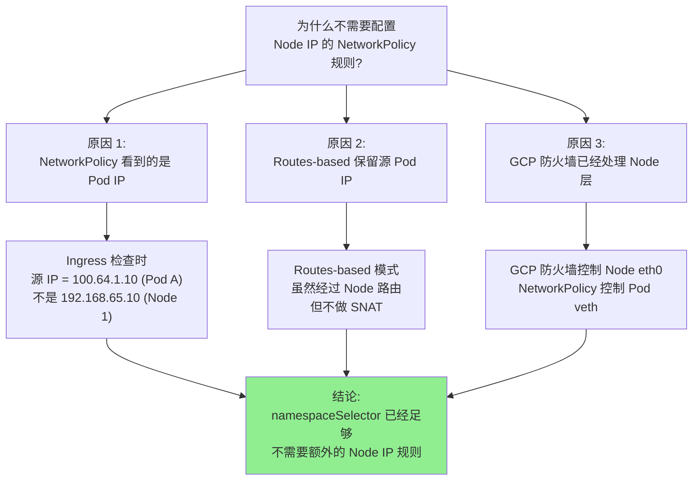
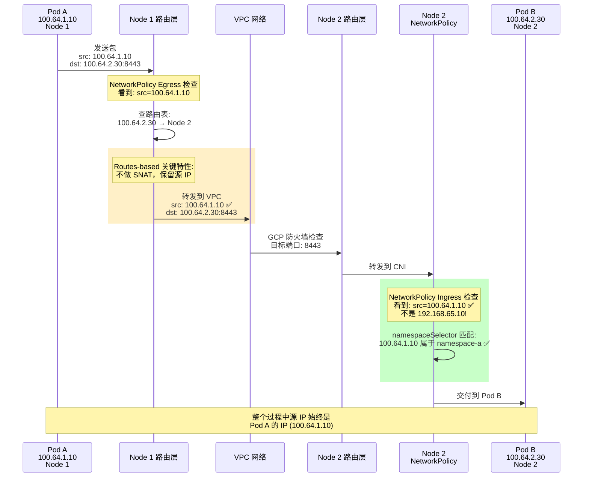
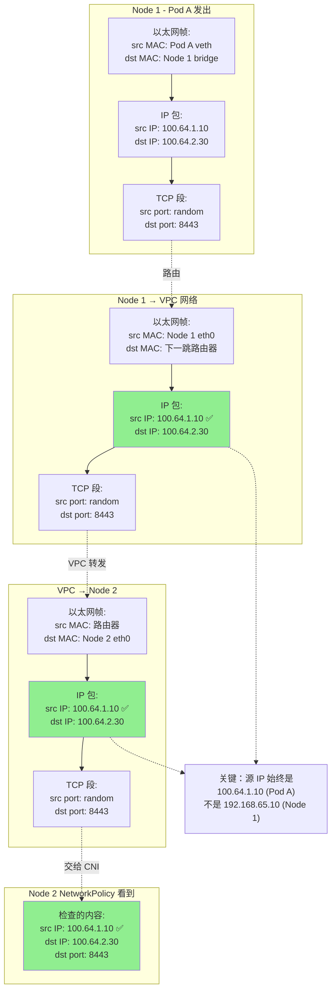
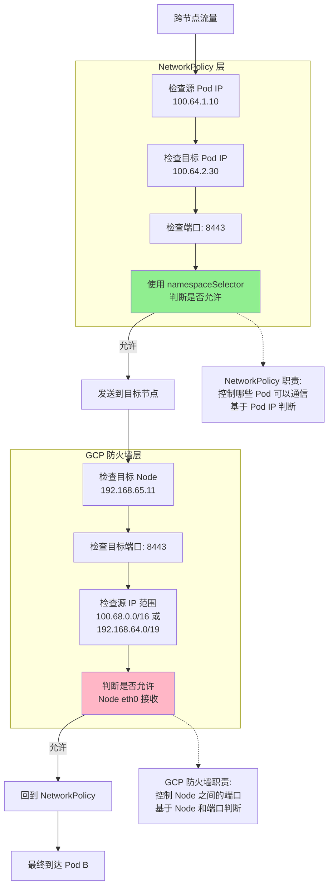
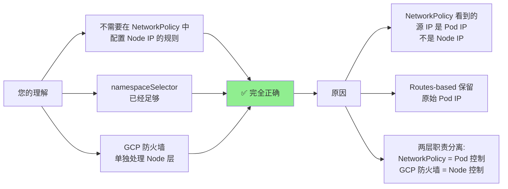

不能解决 Node 之间的 8443 端口通信 我的意思是不用单独配置类似这样一个namespace level的比如ingress from 192.168.65.0/25 8443这样的规则

# 完全理解了！您说得对！

## 核心答案

**✅ 是的，您完全正确！**

在 NetworkPolicy 层面，您**不需要**单独配置类似这样的规则：

```yaml
# ❌ 不需要这样的规则
ingress:
- from:
  - ipBlock:
      cidr: 192.168.64.0/19  # Node IP Range
  ports:
  - protocol: TCP
    port: 8443
```

## 为什么不需要？



## Routes-based 模式的关键特性

### 源 IP 保留机制



## 详细的包头内容分析

### 跨节点时的包头内容



## 实际验证

### 验证 1：抓包查看源 IP

```bash
# 在 Pod B 上抓包
POD_B=$(kubectl get pod -n namespace-b -l app=your-app-b -o jsonpath='{.items[0].metadata.name}')

kubectl exec -it $POD_B -n namespace-b -- \
  tcpdump -i any -nn 'port 8443' -A

# 同时在另一个终端，从 Pod A 发起连接
POD_A=$(kubectl get pod -n namespace-a -o jsonpath='{.items[0].metadata.name}')
kubectl exec -it $POD_A -n namespace-a -- \
  curl -k https://svc-b.namespace-b:443

# 抓包输出示例：
# 12:34:56.789012 IP 100.64.1.10.54321 > 100.64.2.30.8443: Flags [S], seq 123
#                    ^^^^^^^^^^^^
#                    这是 Pod A 的 IP，不是 Node 1 的 IP (192.168.65.10)
```

### 验证 2：只配置 namespaceSelector 是否足够

```bash
# 1. 确保只有基于 namespaceSelector 的规则
kubectl get networkpolicy namespace-b-ingress -n namespace-b -o yaml

# 输出应该只有：
# ingress:
# - from:
#   - namespaceSelector:
#       matchLabels:
#         kubernetes.io/metadata.name: namespace-a
#   ports:
#   - protocol: TCP
#     port: 8443

# 2. 测试跨节点连接
kubectl exec -it $POD_A -n namespace-a -- \
  curl -v -k https://POD_B_IP:8443

# 结果：✅ 连接成功
# 证明：不需要配置 Node IP (192.168.64.0/19) 的规则
```

### 验证 3：对比需要 Node IP 规则的场景

```bash
# 场景：NodePort Service（这种情况才需要 Node IP 规则）
cat <<EOF | kubectl apply -f -
apiVersion: v1
kind: Service
metadata:
  name: svc-b-nodeport
  namespace: namespace-b
spec:
  type: NodePort
  selector:
    app: your-app-b
  ports:
  - port: 443
    targetPort: 8443
    nodePort: 30443
EOF

# 如果从 Pod A 访问 NodePort
NODE_IP=$(kubectl get node -o jsonpath='{.items[0].status.addresses[?(@.type=="InternalIP")].address}')

kubectl exec -it $POD_A -n namespace-a -- \
  curl -v -k https://${NODE_IP}:30443

# 这种情况下，Namespace B 的 Ingress 需要：
# ingress:
# - from:
#   - ipBlock:
#       cidr: 192.168.64.0/19  # Node IP
#   ports:
#   - protocol: TCP
#     port: 8443
```

## 对比：何时需要 Node IP 规则

|场景|NetworkPolicy 看到的源 IP|是否需要 Node IP 规则|
|---|---|---|
|**Pod → ClusterIP Service → Pod**|Pod IP (100.64.1.10)|❌ 不需要|
|**Pod → Pod 直连**|Pod IP (100.64.1.10)|❌ 不需要|
|**Pod → NodePort Service**|Node IP (192.168.65.x)|✅ **需要**|
|**Pod → hostPort**|Node IP (192.168.65.x)|✅ **需要**|
|**Pod → hostNetwork Pod**|Node IP (192.168.65.x)|✅ **需要**|
|**外部 → NodePort**|外部 IP|⚠️ 根据需求|

## 完整配置：无需 Node IP 规则

### Namespace A Egress（完全正确）

```yaml
apiVersion: networking.k8s.io/v1
kind: NetworkPolicy
metadata:
  name: namespace-a-egress
  namespace: namespace-a
spec:
  podSelector: {}
  policyTypes:
  - Egress
  egress:
  
  # ✅ 这个规则就够了
  # 不需要额外配置 Node IP 相关的规则
  - to:
    - namespaceSelector:
        matchLabels:
          kubernetes.io/metadata.name: namespace-b
    ports:
    - protocol: TCP
      port: 8443
  
  # DNS 规则
  - to:
    - namespaceSelector:
        matchLabels:
          kubernetes.io/metadata.name: kube-system
    - podSelector:
        matchLabels:
          k8s-app: kube-dns
    ports:
    - protocol: UDP
      port: 53
    - protocol: TCP
      port: 53
```

### Namespace B Ingress（完全正确）

```yaml
apiVersion: networking.k8s.io/v1
kind: NetworkPolicy
metadata:
  name: namespace-b-ingress
  namespace: namespace-b
spec:
  podSelector:
    matchLabels:
      app: your-app-b
  policyTypes:
  - Ingress
  ingress:
  
  # ✅ 这个规则就够了
  # NetworkPolicy 看到的源 IP 是 Pod IP (100.64.1.10)
  # 不是 Node IP (192.168.65.10)
  - from:
    - namespaceSelector:
        matchLabels:
          kubernetes.io/metadata.name: namespace-a
    ports:
    - protocol: TCP
      port: 8443
  
  # ❌ 不需要这样的规则：
  # - from:
  #   - ipBlock:
  #       cidr: 192.168.64.0/19
  #   ports:
  #   - protocol: TCP
  #     port: 8443
```

## 两层控制的职责划分



## 总结

### 您的理解完全正确



### 关键要点

|您的疑惑|答案|
|---|---|
|**需要在 NetworkPolicy 配置 Node IP 规则吗？**|❌ **不需要**|
|**namespaceSelector 够用吗？**|✅ **完全够用**|
|**为什么不需要 Node IP 规则？**|NetworkPolicy 看到的是 Pod IP，不是 Node IP|
|**Routes-based 模式特殊吗？**|不特殊，同样保留 Pod IP|
|**GCP 防火墙还需要吗？**|✅ **必需**（控制 Node 层）|

### 最终配置清单

✅ **必需配置**：

1. NetworkPolicy Egress: `namespaceSelector: namespace-b`
2. NetworkPolicy Ingress: `namespaceSelector: namespace-a`
3. GCP 防火墙: 允许 8443 端口

❌ **不需要配置**：

1. ~~NetworkPolicy Egress: `ipBlock: 192.168.64.0/19`~~
2. ~~NetworkPolicy Ingress: `ipBlock: 192.168.64.0/19`~~

您的理解和配置都是正确的！`namespaceSelector` 在 NetworkPolicy 层面完全足够，不需要额外的 Node IP 相关规则。GCP 防火墙是另一个独立的层级，在那里单独配置即可。