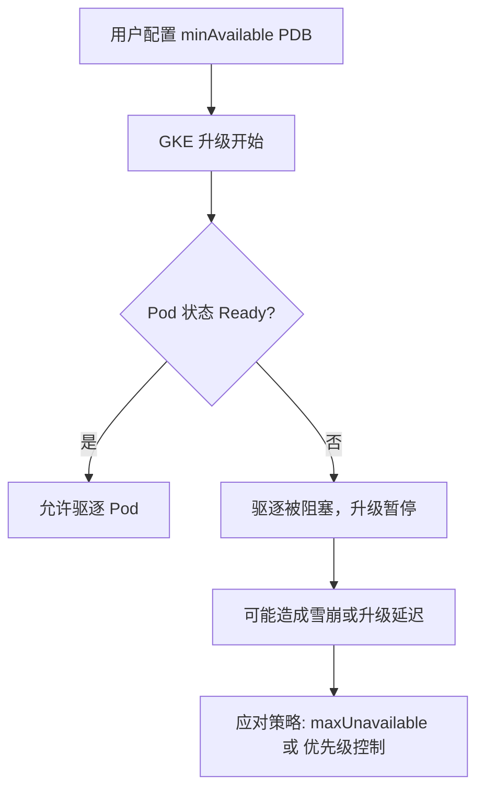

你的问题涉及到 Google Kubernetes Engine (GKE) 中 Pod Disruption Budget (PDB) 的行为，特别是在 Pod 处于非 Running 状态且结合 Horizontal Pod Autoscaler (HPA) 和集群升级的情况下。以下是详细分析和解答：

  

1. PDB 的工作机制和 minAvailable 的判断

Pod Disruption Budget (PDB) 的主要作用是限制在自愿性中断（voluntary disruptions，如节点升级、节点 drain 等）期间，应用可用 Pod 的数量低于某个阈值。minAvailable: 1 表示在任何自愿性中断期间，至少需要有一个 Pod 处于可用状态（通常意味着 Pod 处于 Running 状态且通过了就绪探针检查，即 Ready 条件为 True）。

PDB 对 Pod 状态的判断

- PDB 在评估 minAvailable 时，会检查由 PDB 的 selector 匹配的 Pod 的健康状态（healthy state）。具体来说：

- 只有 Running 且 Ready 的 Pod 才被视为“可用”（healthy）。
- 如果 Pod 处于非 Running 状态（例如 Pending、CrashLoopBackOff、Terminating 等），或者 Running 但未通过就绪探针（Ready=False），这些 Pod 不会被计入 PDB 的可用 Pod 数量。

- 在你的场景中，如果两个 Pod 都不正常（非 Running 或非 Ready），PDB 会认为当前可用 Pod 数量为 0，这低于 minAvailable: 1 的要求。

PDB 在非健康 Pod 下的行为

- 当可用 Pod 数量低于 minAvailable 时，Kubernetes 的 Eviction API（用于节点 drain 或升级时的 Pod 驱逐）会阻止进一步的 Pod 驱逐，以避免违反 PDB 的约束。
- 然而，PDB 不会主动修复 Pod 的非健康状态（如重启 Pod 或调整资源），因为 PDB 只负责限制自愿性中断，而非管理 Pod 的生命周期或健康状态。

  

2. 非 Running Pod 对 GKE 升级的影响

在 GKE 集群升级过程中，节点会逐一被 cordon（禁止调度新 Pod）并 drain（驱逐现有 Pod）。GKE 升级通常会尊重 PDB，但 PDB 的行为会直接受到 Pod 健康状态的影响。

你的场景分析

- 前提：

- Deployment 的 HPA 配置了 minReplicas: 2，因此至少有 2 个 Pod。
- PDB 配置了 minAvailable: 1，要求至少 1 个 Pod 可用。
- 两个 Pod 当前都处于非 Running 状态（例如 CrashLoopBackOff 或 Pending）。

- PDB 判断：

- 由于两个 Pod 都不健康，PDB 认为当前可用 Pod 数量为 0，低于 minAvailable: 1。
- 在这种情况下，Kubernetes 的 Eviction API 会阻止任何 Pod 被驱逐，因为驱逐任何 Pod 都会进一步违反 PDB（可用 Pod 数量已经为 0）。

- GKE 升级行为：

- GKE 在升级节点时，会尝试 drain 节点上的 Pod。如果某个节点的 Pod 受 PDB 保护，且 PDB 判断驱逐会导致可用 Pod 数量低于 minAvailable，则 drain 操作会被阻塞。
- 在你的场景中，由于没有健康的 Pod（可用 Pod 数量为 0），GKE 的 drain 操作很可能会卡住，因为无法安全驱逐任何 Pod 来满足 PDB 的要求。
- GKE 通常会在尝试 drain 失败后等待一段时间（默认最长为 1 小时）。如果 1 小时后仍无法满足 PDB 要求，GKE 可能会强制继续升级，忽略 PDB 约束（这取决于 GKE 的具体实现，可能导致 Pod 被强制终止）。

非 Running Pod 的影响

- 非 Running 的 Pod 本身不会被 PDB 视为可用，因此它们不会直接满足 PDB 的 minAvailable 要求。
- 如果这些非 Running Pod 是因为资源不足、配置错误或其他问题导致的，HPA 和 Deployment 控制器会尝试重新调度或重启这些 Pod，但这可能需要时间，且可能无法在升级期间及时恢复。
- 如果 Pod 无法恢复到 Running 和 Ready 状态，PDB 会持续阻止节点 drain，导致升级过程延迟或失败。

  

3. HPA 的作用

HPA（Horizontal Pod Autoscaler）根据负载动态调整 Pod 副本数，但它与 PDB 的交互需要特别注意：

- HPA 最小副本数：

- 你设置了 minReplicas: 2，意味着 HPA 会确保至少有 2 个 Pod 存在。
- 即使 Pod 处于非 Running 状态，HPA 不会直接干预 Pod 的健康状态，而是依赖 Deployment 控制器来尝试恢复这些 Pod。

- HPA 与 PDB 的冲突：

- 如果 HPA 尝试缩减副本数（例如由于低负载），但缩减会导致可用 Pod 数量低于 PDB 的 minAvailable，Kubernetes 会阻止 HPA 的缩减操作。
- 在你的场景中，由于 Pod 都不健康，HPA 无法通过增加副本数来满足 PDB（因为新 Pod 可能也会因同样的问题进入非 Running 状态）。

  

4. GKE 升级是否会受到影响？

综合以上分析，你的 GKE 升级很可能会受到以下影响：

1. 升级卡住：

- 由于两个 Pod 都不健康，PDB 判断可用 Pod 数量为 0，低于 minAvailable: 1。
- GKE 在尝试 drain 节点时会发现无法驱逐任何 Pod（因为驱逐会违反 PDB），导致 drain 操作被阻塞。
- 升级过程可能会在某个节点上卡住，直到有至少 1 个 Pod 恢复到 Running 和 Ready 状态，或者 GKE 强制继续升级（通常在 1 小时后）。

3. 强制升级的风险：

- 如果 GKE 在等待 1 小时后强制执行 drain（忽略 PDB），可能会导致 Pod 被强制终止。这可能进一步加剧应用的不可用性，特别是如果 Pod 的非 Running 状态是由于配置错误或其他难以恢复的问题导致的。

5. Pod 非健康状态的根本问题：

- 非 Running 的 Pod 是问题的核心。如果这些 Pod 无法恢复（例如由于镜像问题、资源限制、或依赖服务不可用），即使没有升级，应用本身也已经不可用。
- 在这种情况下，PDB 的保护机制可能会显得“多余”，因为它无法解决 Pod 的健康问题，只能延迟升级。

  

5. 建议和解决方案

为了确保 GKE 升级顺利进行，并最大程度减少 PDB 和非 Running Pod 的影响，建议采取以下措施：

1. 检查和修复 Pod 非健康状态：

- 首先调查两个 Pod 为什么处于非 Running 状态。常见原因包括：

- 镜像拉取失败（检查 kubectl describe pod）。
- 资源不足（检查节点资源使用情况和 Pod 的 requests/limits）。
- 就绪探针失败（检查探针配置）。
- 依赖服务不可用（例如数据库或外部 API）。

- 修复这些问题以恢复至少 1 个 Pod 到 Running 和 Ready 状态，这样 PDB 的 minAvailable: 1 就可以被满足。

3. 调整 PDB 配置：

- 如果应用允许短暂的不可用，可以考虑将 minAvailable: 1 改为 maxUnavailable: 1，这样 PDB 会更灵活，允许在某些情况下减少可用 Pod 数量。
- 避免设置过于严格的 PDB（例如 minAvailable 等于副本数），否则可能导致升级完全无法进行。

5. 增加副本数或冗余：

- 如果可能，将 HPA 的 minReplicas 增加到 3 或更高，并确保 Pod 分布在多个节点（通过 podAntiAffinity 或多可用区部署）。这可以提高容错能力，降低所有 Pod 同时非健康的可能性。
- 确保集群有足够的节点和资源来调度新 Pod。

7. 优化 GKE 升级策略：

- 使用 GKE 的 surge upgrade 功能（节点池的“激增升级”），在升级时创建新的节点并迁移 Pod 后再删除旧节点。这可以减少 Pod 驱逐对 PDB 的影响。
- 在升级前手动检查 PDB 状态（kubectl describe pdb），确保有足够的健康 Pod。

9. 监控和告警：

- 配置监控工具（例如 Prometheus 或 Google Cloud Monitoring）以实时跟踪 Pod 状态和 PDB 状态。
- 设置告警，当 Pod 长时间处于非 Running 状态或 PDB 阻止 drain 时通知管理员。

11. 测试升级流程：

- 在非生产环境中模拟相同的 PDB、HPA 和 Pod 非健康场景，测试 GKE 升级的行为。这可以帮助你了解 GKE 在特定情况下是否会强制忽略 PDB。

  

6. 总结

- PDB 是否判断最小资源可用数量：是的，PDB 会严格检查 minAvailable 要求的可用 Pod 数量，但只考虑 Running 且 Ready 的 Pod。非 Running 的 Pod 不计入可用数量，因此在你的场景中，PDB 会认为可用 Pod 为 0，从而阻止 Pod 驱逐。
- 非 Running Pod 的影响：两个非 Running Pod 导致 PDB 无法满足 minAvailable: 1，这会阻塞 GKE 的节点 drain 操作，可能导致升级卡住或延迟。
- GKE 升级的影响：升级可能会因 PDB 阻塞而暂停，最坏情况下 GKE 可能在 1 小时后强制继续，终止 Pod，导致应用不可用。
- 建议：优先修复 Pod 非健康状态，调整 PDB 和 HPA 配置，使用 surge upgrade，并增加冗余以提高容错能力。

如果你有进一步的日志（例如 kubectl describe pdb 或 kubectl describe pod 的输出）或具体场景细节，可以提供给我，我可以帮助更精确地分析问题！

# ChatGPT 
这是一个非常实用的问题，尤其是在你关注 GKE 高可用升级过程时。

场景概况

- PDB（PodDisruptionBudget）配置为 minAvailable: 1
- HPA（HorizontalPodAutoscaler）设置最小 Pod 数为 2
- 当前 2 个 Pod 都处于非 Running 状态
- 此时 GKE 正在进行升级

回答核心

PDB 是否会判断非 Running 的 Pod？

是的，PDB 判断的是 “ready” 状态的 Pod 数量，而不是 Pod 是否存在或处于 Running 状态。也就是说：

PDB 是基于 Ready 状态的 Pod 数量进行评估，而非 Running 或 Pod 数量本身。

解释细节

在你的场景中：
- 你定义了 minAvailable: 1，表示 “在任何中断发生前，必须至少有 1 个 Ready 状态的 Pod”
- 如果当前 2 个 Pod 都处于非 Ready 状态（例如 CrashLoopBackOff、Terminating、Pending 等），那么：  
- PDB 认为当前 “Available” 的 Pod 数为 0
- GKE 控制面（Node Upgrader）在执行计划性升级时会查询 PDB 来确认能否驱逐 Node 上的 Pod
- 由于 Available 数为 0，小于 minAvailable: 1，升级中会阻止驱逐该节点，升级被“阻塞”

# About Block upgrade 
这是一个非常实际且深入的问题，围绕 GKE 升级过程中结合 PodDisruptionBudget (PDB) 的使用场景，尤其当 Pod 状态异常（如 CrashLoopBackOff、Readiness Probe 失败等） 的时候，如何理解 PDB 对系统的影响，并权衡是否启用，确实需要更深入的思考。我们可以从以下几个维度进行探索：

⸻

一、PDB 的基本行为回顾

PodDisruptionBudget 的目的是 限制「自愿性中断」(voluntary disruption) 的发生，比如升级、手动驱逐、节点维护等情况。核心指标：
	•	minAvailable: 保证中断过程中 至少有多少个 Pod 是 Ready 状态的
	•	maxUnavailable: 最多允许多少个不可用

注意：PDB 不会保护 Pod 本身在异常状态下的情况，它仅关注「Ready」状态。

⸻

二、你的问题场景分析

情景：
	1.	你所有的 Deployment 都配置了 PDB(minAvailable: 1)；
	2.	某些 Deployment 下的所有 Pod 状态都是异常（NotReady / Crash）；
	3.	GKE 执行升级，涉及节点重建、Pod 驱逐；
	4.	此时 PDB 会“阻止”节点上的 Pod 被驱逐，因为它判断当前 available 数为 0，驱逐将导致 minAvailable 不能满足。

结果：
	•	升级会卡住（node drain 被阻塞）；
	•	异常 Pod 阻止集群升级，导致雪崩效应。

⸻

三、探索与对策建议

1. 区分关键 vs 非关键服务

不是所有服务都必须配置 PDB，建议只给 关键服务（需要高可用） 配置 minAvailable，其余服务配置可选项（或使用 maxUnavailable 更宽松策略）。

# 对非关键服务使用更宽容策略
spec:
  maxUnavailable: 1

2. 结合 priorityClass 与 PDB 实现分层保护
	•	高优先级服务配合 minAvailable 确保不中断；
	•	中低优先级服务使用 maxUnavailable 或不配置 PDB，防止升级阻塞；
	•	可使用以下方式定义优先级类：

apiVersion: scheduling.k8s.io/v1
kind: PriorityClass
metadata:
  name: critical-api-priority
value: 1000000
globalDefault: false
description: "Priority for critical API services"

3. PDB + Readiness 状态联动的风险提示
	•	若 Deployment 中所有 Pod 都不处于 Ready 状态，PDB 将认为没有 Pod 可用，从而禁止驱逐；
	•	这在实际操作中是一个 “软死锁”问题，GKE node drain 阻塞、无法升级。

解决建议：使用 K8S 原生的 NodePool 升级策略 + PDB + Pod 状态监控结合 来自动规避死锁

⸻

四、可实施的具体措施

措施	说明
使用 maxUnavailable	比 minAvailable 更宽容，避免全员挂掉时阻塞升级
部署级别的 ReadinessGate 监控	防止 Pod 永久处于 NotReady 却又不能被驱逐
配合 startupProbe 减少 PDB 与 Pod 启动卡顿之间的矛盾	
使用 GKE 提供的 Surge Upgrade + 自动升级策略	可缓解节点 drain 与 PDB 冲突
写一个 PDB Watcher Controller（可选）	当检测 Deployment 中所有 Pod 状态异常，可临时 patch PDB 减少影响

⸻

五、Mermaid 流程图辅助理解

⸻

六、建议策略总结

场景	建议配置
关键服务，部署稳定	minAvailable: N（N ≥ 1）
服务偶发挂掉、追求容错	maxUnavailable: 1 或不配置
全部 Pod 异常不应阻止升级	控制器动态调整 PDB / 结合优先级降低影响
扩展：GKE Autopilot 用户	PDB 更需谨慎，因为 Pod 驱逐权更集中在 GKE 层面

⸻

需要的话我可以补一段用 Python/K8S Client 做的 PDB 检测 + Patch Demo Controller 的代码模板。如果你们是企业级平台，也可以纳入 CI/CD 检查流程中。需要吗？

我来回答你的问题，针对你在GKE中为Deployment配置了PodDisruptionBudget（PDB）的情况，并探讨当所有Pod状态异常时如何处理。我们会从分析问题开始，逐步探讨是否开启PDB的利弊，以及提供解决方案和更深入的探索。

背景理解
你为Deployment配置了如下PDB资源：
apiVersion: policy/v1
kind: PodDisruptionBudget
metadata:
  name: api-pdb
spec:
  minAvailable: 1  # 保证至少 1 个 Pod 始终可用
  selector:
    matchLabels:
      app: api-service
这表示在任何自愿中断（voluntary disruptions，例如GKE集群升级或节点维护）期间，至少要保证1个Pod保持可用。这是Kubernetes提供的一种机制，用于确保服务在维护操作中的高可用性。
但你提到了一种特殊情况：如果在GKE升级过程中，某个Deployment下的所有Pod都处于异常状态（例如CrashLoopBackOff或其他失败状态），这会对PDB的配置和集群行为产生影响。我们需要分析这种情况，并给出应对策略。

场景分析
1. Pod全部异常意味着什么？
	•	当Deployment下的所有Pod都异常时，通常是应用程序本身出了问题，比如代码bug、配置错误或资源不足。
	•	在这种情况下，即使PDB要求minAvailable: 1，也无法满足，因为没有一个Pod是健康的。PDB的作用是限制自愿中断期间不可用的Pod数量，但它无法解决Pod本身的健康问题。
2. GKE升级中的行为
	•	GKE升级通常采用滚动升级的方式，逐个升级节点。升级时，节点上的Pod会被驱逐并重新调度到其他节点。
	•	PDB会介入，确保驱逐Pod时至少有1个Pod保持可用。如果所有Pod都异常，PDB无法找到可用的Pod来满足minAvailable: 1，这可能导致升级过程被阻塞。
3. 问题的核心
	•	如果所有Pod都不可用，服务已经处于中断状态，PDB的保护机制实际上失去了意义。
	•	更严重的是，PDB可能会阻止GKE完成升级，因为驱逐操作无法满足PDB的要求，从而影响整个集群的维护。

是否开启PDB配置？
开启PDB的优点
	•	高可用性保障：在正常情况下，PDB能有效防止自愿中断导致服务完全不可用，特别适合像api-service这样的关键组件。
	•	服务连续性：对于依赖Pod运行的服务，PDB是Kubernetes提供的重要保障工具。
开启PDB的潜在问题
	•	升级阻塞：如果所有Pod异常，PDB可能导致GKE升级无法继续，因为无法满足minAvailable的要求。
	•	管理复杂性：在异常情况下，可能需要手动干预（例如临时移除PDB），增加了运维负担。

解决方案
针对这种情况，我建议以下解决方案，帮助你在Pod异常和集群维护之间找到平衡：
1. 监控和告警
	•	实施：为Pod配置实时监控（例如通过Prometheus或Google Cloud Monitoring），跟踪Pod状态。
	•	目标：当Pod进入异常状态（如CrashLoopBackOff）时，立即触发告警，通知运维人员介入。
	•	效果：快速发现问题，避免异常状态持续影响升级。
2. 健康检查优化
	•	实施：为Pod配置合理的livenessProbe和readinessProbe，确保Kubernetes能准确判断Pod健康状态。
	•	目标：让Kubernetes自动重启不健康的Pod，或标记其为不可用，触发恢复机制。
	•	效果：减少Pod长期处于异常状态的可能性。
3. 故障恢复策略
	•	重启策略：确保Deployment的Pod重启策略（restartPolicy）设置为Always，让Kubernetes自动尝试恢复。
	•	HPA：考虑使用Horizontal Pod Autoscaler（HPA），根据负载动态调整Pod数量，增强容错能力。
4. 灵活的PDB配置
	•	差异化策略：为关键服务（如api-service）保留minAvailable: 1，而对非关键服务放宽限制（如maxUnavailable: 1）。
	•	临时调整：在Pod全部异常时，临时将minAvailable设为0，允许升级继续（需谨慎操作，避免服务进一步中断）。
5. GKE升级优化
	•	并发控制：在GKE中配置升级策略，限制同时升级的节点数量（例如通过maxSurge和maxUnavailable）。
	•	测试环境：在生产升级前，使用测试集群验证PDB和升级的兼容性。
6. 异常情况下的应急处理
	•	步骤：
	1	发现所有Pod异常后，优先排查和修复应用程序问题（日志分析、资源检查等）。
	2	如果需要立即完成升级，可临时移除或调整PDB（例如kubectl edit pdb api-pdb）。
	3	修复后恢复PDB配置。
	•	注意：临时移除PDB可能导致服务完全不可用，需评估影响。

深度探索
如果你想更深入地优化这种场景，可以考虑以下方向：
1. Kubernetes驱逐和调度机制
	•	研究：深入了解Kubernetes在PDB约束下的Pod驱逐逻辑（参考kubectl describe pdb和事件日志）。
	•	优化：调整Pod的调度策略，确保异常Pod不会集中在同一节点。
2. Pod优先级和抢占
	•	实施：使用Pod Priority and Preemption，为关键Pod（如api-service）设置更高优先级。
	•	效果：在资源紧张时，优先保留关键Pod，减少异常影响。
3. PodAntiAffinity
	•	配置：为Pod设置反亲和性规则（podAntiAffinity），确保Pod分布在不同节点。
	•	效果：提高容错性，避免单节点故障导致所有Pod异常。
4. 与Google Cloud支持协作
	•	建议：如果异常情况频繁发生，联系Google Cloud支持团队，获取GKE升级和PDB的最佳实践建议。

总结建议
在你的场景中，PDB是一个保障服务高可用性的重要工具，但当所有Pod异常时，它可能成为集群维护的阻碍。因此，我建议：
	1	保留PDB配置：在正常情况下，它能有效保护服务。
	2	加强监控和健康检查：确保Pod异常能被及时发现和修复。
	3	灵活应对：在升级遇到阻塞时，临时调整PDB，优先恢复服务。
	4	优化架构：通过优先级、反亲和性和HPA等特性，提升整体健壮性。
如果GKE升级过程中确实遇到所有Pod异常，首要任务是快速恢复至少一个Pod的正常状态，同时根据业务需求决定是否临时放宽PDB限制。希望这些建议对你有帮助！如果有进一步问题，欢迎继续讨论。

