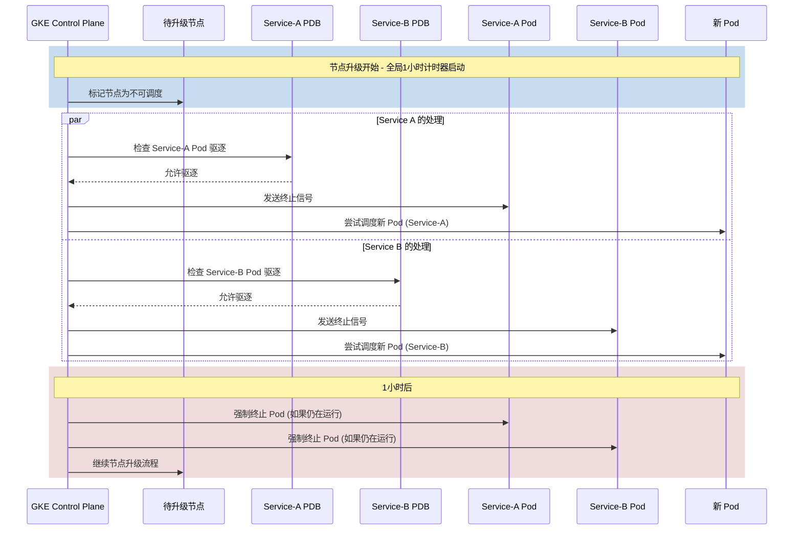
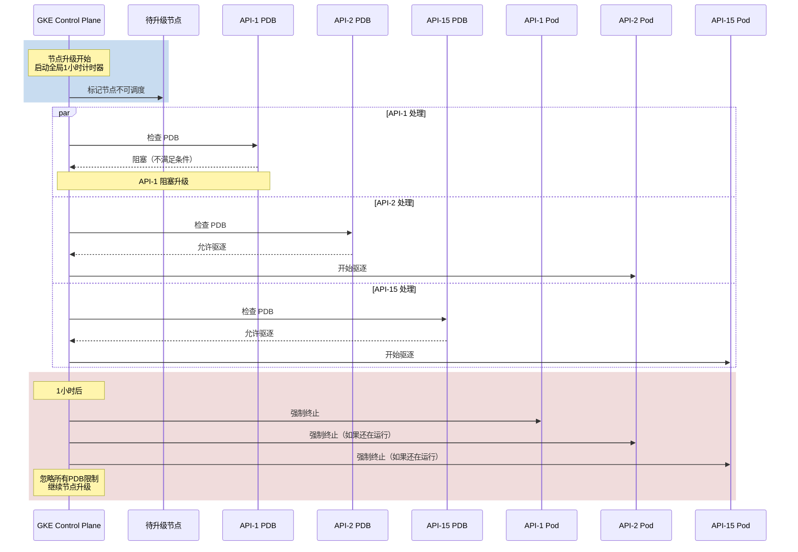

我想确保在GKE中，GKE Node升级的时候，我的Deployment，也就是我对应的服务高可用。
我已经采用了如下方法
1 配置了反亲和,确保我的每一个Deployment replicas至少有2个Pod,且2个Pod必须落在不同的Node
2 配置了基于Deployment的strategy
比如
```yaml
strategy:
   rollingUpdate:
       maxsurge: 2
       maxUnavailable: 1
    type: RollingUpdate
```
3 目前没有配置PDB
我现在遇到这样一个问题
假如我运行中的这个Deployment有2个Pod，我们称为old 1 和old 2 
我现在看到old 1收到Stopping container的信号之后，我的集群开始创建一个new pod 1.各种原因这个new Pod 1比如 5分钟才准备就绪，可以接收流量
但是在这期间old 2也接收到了stopping container的信号，开始终止。同时触发创建一个new pod 2 
这样就遇到了一个问题。2个旧的Pod 都终止了的情况下，新的Pod还没有创建出来
就是说没有配置PDB的情况下 2个pod 在不同的node 再滚动更新的过程中启动起来稍慢 那么会存在第一个人pod 关闭之后新的pod 还没能提供服务 他又开始删除第二个pod 只是想确认PDB能解决这个问题

那么我想确认的知道PDB能否解决我的问题。
比如我配置如下
```yaml
apiVersion: policy/v1
kind: PodDisruptionBudget
metadata:
  name: api-pdb
spec:
  minAvailable: 1  # 保证至少 1 个 Pod 始终可用
  selector:
    matchLabels:
      app: api-service
```
我看到一些资料
https://cloud.google.com/kubernetes-engine/docs/how-to/upgrading-a-cluster?hl=zh-cn
注意：在自动或手动升级节点期间，PodDisruptionBudget (PDB) 和 Pod 终止宽限期最长为 1 小时。如果在节点上运行的 Pod 在 1 小时后无法被调度到新节点上，GKE 会无论如何启动升级。即使您将 PDB 配置为始终提供所有副本（通过将 maxUnavailable字段设置为 0 或 0%，或者将 minAvailable 字段设置为 100% 或副本数量），此行为也会适用。在所有这些情况下，GKE 都会在一小时后删除 Pod，以便进行节点删除。如果工作负载需要更灵活且能够安全终止，我们建议使用蓝绿升级，这样可以提供额外过渡时间设置，从而将 PDB 检查延长超过默认的 1 小时。如需详细了解在节点终止期间一般会发生什么情况，请参阅有关 Pod 的主题。

PDB终止宽限期最长为一小时？怎么理解这个宽限期？是针对一个Pod还是所有的pod。如果我环境配置了很多PDB资源？
我想了解宽限期的范围，计时机制，超时行为，多个PDB的处理，超时后的处理


让我详细解释 GKE 中 PDB 终止宽限期的具体机制。​​​​​​​​​​​​​​​​

基于 GKE 文档，以下是详细解释：

1. **宽限期的范围**：
   - 这是一个节点级别的全局计时器
   - 当 GKE 开始升级节点时启动
   - 适用于节点上的所有 Pod，无论它们属于哪个 PDB
   - 1小时是硬性限制，不可修改

2. **计时机制**：
   ```yaml
   # 示例：即使配置了严格的 PDB 也会受 1 小时限制
   apiVersion: policy/v1
   kind: PodDisruptionBudget
   metadata:
     name: critical-service-pdb
   spec:
     minAvailable: 100%  # 即使要求 100% 可用
     # 1小时后仍会被强制终止
   ```
   - 计时从节点开始升级时开始
   - 这是一个统一的计时器，不是每个 Pod 或每个 PDB 独立计时
   - 1小时计时对该节点上的所有操作都有效

3. **超时行为**：
   - 1小时后，GKE 会：
     - 忽略所有 PDB 的限制
     - 强制终止剩余的 Pod
     - 继续节点升级流程
   - 这个行为不受 PDB 配置的影响

4. **多个 PDB 的处理**：
   - 所有 PDB 共享同一个 1 小时限制
   - GKE 会并行处理多个 PDB 的 Pod
   - 不同 PDB 的 Pod 都在这 1 小时内需要完成迁移

5. **超时后的处理**：
   - 强制删除所有剩余 Pod
   - 不考虑 PDB 的可用性要求
   - 可能导致服务中断

6. **关键建议**：
   - 对于关键服务：
     ```yaml
     # 部署配置示例
     apiVersion: apps/v1
     kind: Deployment
     spec:
       template:
         spec:
           terminationGracePeriodSeconds: 60  # 合理设置终止宽限期
           readinessProbe:
             initialDelaySeconds: 10
             periodSeconds: 5
           # 确保能快速启动和就绪
     ```
   - 使用蓝绿升级策略处理需要更长时间的工作负载
   - 优化 Pod 启动时间和健康检查配置
   - 实现优雅的终止处理机制

7. **处理建议**：
   - 监控 Pod 启动时间
   - 实现有效的健康检查
   - 优化应用初始化过程
   - 考虑使用蓝绿部署进行升级

这个机制的关键点是：
1. 这是 GKE 特有的限制
2. 是节点级别的全局计时器
3. 影响节点上的所有 Pod 和 PDB
4. 1小时后会强制执行，不考虑 PDB 设置

如果你有需要较长启动时间的服务，建议考虑：
1. 使用蓝绿部署策略
2. 优化应用启动时间
3. 实现更可靠的健康检查机制

需要讨论具体某个服务的优化策略吗？​​​​​​​​​​​​​​​​


那么看起来这个1小时是针对的我所有配置了PDB的资源，假如我配置了15个PDB限制。比如因为某个API的PDB设置配置，遇到了阻塞，那么Block升级的时间也是在1个小时之内的？

是的，你理解得对。让我详细解释这种情况。​​​​​​​​​​​​​​​​


在 GKE 中，对于多个 PDB 的处理有以下几个关键点：

1. **统一的时间窗口**：
   - 所有 15 个 PDB 共享同一个 1 小时的时间窗口
   - 计时器在节点开始升级时就启动
   - 不会因为某个 PDB 阻塞而重置或延长时间

2. **并行处理机制**：
   ```yaml
   # 示例：即使某个 API 配置了严格的 PDB
   apiVersion: policy/v1
   kind: PodDisruptionBudget
   metadata:
     name: critical-api-pdb
   spec:
     minAvailable: 100%  # 严格的可用性要求
   ```
   - GKE 会并行处理所有 PDB
   - 一个 PDB 的阻塞不会单独获得额外时间
   - 所有 Pod 必须在这 1 小时内完成迁移

3. **阻塞影响**：
   - 如果有一个 API 的 PDB 阻塞升级：
     - 不会为其他 PDB 单独计时
     - 不会影响 1 小时的总限制
     - 其他 PDB 的处理会继续进行

4. **超时处理**：
   - 1 小时后，无论：
     - 有多少个 PDB 配置
     - 是否有 PDB 仍在阻塞
     - PDB 的具体配置如何
   - GKE 都会：
     - 强制终止所有剩余 Pod
     - 忽略所有 PDB 的限制
     - 继续节点升级流程

5. **建议的处理策略**：
   - 对于多个 PDB 的场景：
     1. 优先处理关键服务的迁移
     2. 确保所有服务能在 1 小时内完成迁移
     3. 实现快速的健康检查机制
     4. 对于特殊需求使用蓝绿部署

6. **最佳实践**：
   ```yaml
   # 部署配置示例
   apiVersion: apps/v1
   kind: Deployment
   spec:
     template:
       spec:
         # 快速的终止期
         terminationGracePeriodSeconds: 30
         # 快速的健康检查
         readinessProbe:
           initialDelaySeconds: 5
           periodSeconds: 3
           timeoutSeconds: 1
   ```

7. **风险缓解**：
   - 监控所有服务的启动时间
   - 实现快速的初始化过程
   - 配置合适的健康检查参数
   - 为关键服务准备蓝绿部署方案

这意味着你需要：
1. 评估所有 15 个服务的启动时间
2. 确保每个服务都能在合理时间内完成迁移
3. 优化那些启动较慢的服务
4. 考虑关键服务的替代升级策略

需要一起看看如何优化这些服务的启动时间，或者讨论哪些服务适合使用蓝绿部署吗？​​​​​​​​​​​​​​​​
# ChatGPT 
PodDisruptionBudget (PDB) 在 GKE 升级过程中的作用，尤其是在节点升级时，能帮助确保您的 Pod 在升级过程中保持高可用性。关于您提到的宽限期（grace period），它是指在进行节点升级时，GKE 会等待一定时间，以便在 Pod 被终止前，确保其可以安全地调度到其他节点。

PDB 宽限期理解
	1.	宽限期的范围：
宽限期是针对每个 Pod 来看的。当 GKE 升级节点时，它会检查节点上运行的每个 Pod。如果某些 Pod 因 PDB 规则无法被调度到其他节点，GKE 会在最大宽限期内尝试等待这些 Pod 能够成功调度。这个宽限期默认是 1 小时，并且是针对单个 Pod 来计算的。
	2.	计时机制：
	•	宽限期计时从 GKE 尝试终止 Pod 并准备迁移时开始。GKE 会尝试在 1 小时内将该 Pod 调度到新的节点。如果在这个时间内 Pod 无法被调度，它将被强制删除，以便继续进行节点的升级过程。
	•	这个宽限期是 针对每个 Pod 独立计算的，不是针对整个 Deployment 的。
	3.	超时行为：
如果 Pod 在 1 小时内未能成功调度（例如因为资源不足或其他原因），GKE 将会强制删除该 Pod 并继续节点升级，即使 PDB 设置了保证可用性（如 minAvailable: 1）。
	4.	多个 PDB 的处理：
如果您为多个 Deployment 或多个 Pod 配置了 PDB，每个 Pod 都会独立评估它自己的宽限期。如果您的集群中配置了多个 PDB，并且它们适用不同的 Pod，GKE 会分别根据这些 PDB 规则进行处理，确保每个 Pod 根据其 PDB 规则和宽限期进行调度。
	5.	PDB 超时后的处理：
	•	如果 Pod 在超时后仍未能调度到新的节点，GKE 会强制删除该 Pod，继续进行节点升级。
	•	如果您希望确保 Pod 在更长时间内保持可用，可以考虑延长超时时间，或者通过蓝绿部署（Blue-Green Deployment）或其他更灵活的升级策略来避免这种情况。

您的情况与 PDB 配置

在您描述的场景中，您确实面临了在滚动更新期间，Pod 没有足够的时间启动和接收流量的问题。配置 PDB 可以帮助确保至少一个 Pod 始终可用，从而避免在升级期间服务中断。

不过，值得注意的是，PDB 无法完全解决超时问题，如果 Pod 无法及时调度到新节点，PDB 也会在 1 小时后被强制终止。为了避免这种情况，您可以：
	•	增加 Pod 的启动时间和稳定性（如增加启动探针和准备探针的容忍时间）
	•	使用蓝绿部署（Blue-Green Deployment）进行升级，确保在升级过程中有足够的 Pod 可用

配置 PDB 确实能确保有至少一个 Pod 保持可用，但要注意 GKE 升级过程中可能的 1 小时宽限期限制，并结合您的实际需求调整升级策略。

# Gemini 
是的，PDB (Pod Disruption Budget) **可以解决您描述的问题**，确保在 GKE 节点升级期间您的 Deployment 服务高可用。

您遇到的问题核心在于：在没有 PDB 的情况下，滚动更新或节点升级可能会过于激进地终止旧的 Pod，导致在新 Pod 完全就绪之前，可用 Pod 的数量不足，从而影响服务可用性。

**PDB 的作用：**

PDB 的主要作用是 **限制在自愿中断 (Voluntary Disruption)** 期间，属于特定应用 (通过 `selector` 匹配) 的 Pod 的数量下降到低于某个阈值。自愿中断包括：

* **节点维护 (例如节点升级)**
* **Deployment 的滚动更新**
* **用户主动删除 Pod (例如通过 `kubectl delete pod`)**

**PDB 如何解决您的问题：**

当您配置了 PDB 并设置了 `minAvailable: 1`，这意味着 PDB 会告诉 Kubernetes (和 GKE)：**在任何时候，属于 `app: api-service` 这个 Deployment 的 Pod，至少要保证有 1 个是可用的**。

在 GKE 节点升级期间，当 GKE 尝试驱逐 (evict) 运行在待升级节点上的 Pod 时，PDB 会介入：

1. **GKE 节点升级开始驱逐 Pod:** GKE 会尝试安全地驱逐节点上的 Pod，以便进行节点升级。
2. **PDB 检查:** 在驱逐 Pod 之前，GKE 会检查是否有 PDB 约束应用于这些 Pod。
3. **PDB 约束生效:**  对于您的 Deployment 的 Pod，由于您配置了 PDB，GKE 会检查如果驱逐某个 Pod 是否会违反 PDB 的 `minAvailable: 1` 约束。
4. **阻止驱逐 (如果违反 PDB):** 如果驱逐某个 Pod 会导致可用 Pod 数量低于 1，GKE **不会立即驱逐** 这个 Pod。它会等待，直到有新的 Pod 准备就绪并成为可用状态，才能继续驱逐旧的 Pod。
5. **滚动更新的保障:**  PDB 确保了在滚动更新过程中，即使新的 Pod 启动较慢，旧的 Pod 也不会被过早地全部终止，从而保证至少有 `minAvailable` 个 Pod 处于可用状态。

**关于 GKE 文档中提到的 "PDB 终止宽限期最长为 1 小时" 的理解：**

这个 "1 小时" **不是 Pod 的终止宽限期 (terminationGracePeriodSeconds)**，而是指 **GKE 在节点升级过程中，为了尊重 PDB 约束，最长会等待的时间**。

**更准确的理解是 "PDB 节点升级等待超时时间" 或 "PDB 节点驱逐等待超时时间" 。**

**详细解释：**

* **宽限期的范围：** 这个 1 小时 的宽限期是 **针对整个节点升级过程** 的，而不是针对单个 Pod 或单个 PDB。当 GKE 开始升级一个节点时，它会尝试驱逐该节点上的 Pod。如果驱逐 Pod 会违反任何 PDB 约束，GKE 会等待。
* **计时机制：** 计时是从 GKE 开始尝试驱逐节点上的第一个 Pod 开始计算的。
* **超时行为：** 如果在 1 小时内，GKE 仍然无法安全驱逐 Pod (例如，因为新的 Pod 启动太慢，一直无法满足 PDB 的 `minAvailable` 约束)，**GKE 将会强制继续进行节点升级，即使这意味着暂时违反 PDB 约束**。
* **多个 PDB 的处理：** 如果您的环境中配置了多个 PDB 资源，并且有多个 PDB 应用于同一个 Pod (这种情况比较少见，但理论上可能)，GKE 会 **同时考虑所有相关的 PDB 约束**。只要违反 **任何一个** PDB 约束，GKE 就会等待。
* **超时后的处理：**  一旦 1 小时超时，GKE 会 **强制驱逐 Pod 并继续节点升级**。这意味着在超时后，PDB 的保护作用会暂时失效，可能会出现短时间的服务可用性下降，即使您配置了 PDB 保证始终提供所有副本 (例如 `maxUnavailable: 0`)，GKE 仍然会在 1 小时后强制驱逐 Pod。

**总结和建议：**

* **PDB 是解决您问题的关键：**  配置 PDB 是确保 Deployment 在 GKE 节点升级期间高可用性的重要手段。
* **`minAvailable` 的设置：**  `minAvailable: 1` (或者根据您的实际需求设置更高的值) 是一个合理的起点，可以保证至少有一个 Pod 可用。您需要根据您的服务特性和容忍度来调整 `minAvailable` 的值。
* **结合其他策略：**  您已经配置的反亲和和 RollingUpdate 策略也是非常好的实践，它们与 PDB 共同作用，提升服务的整体高可用性。
* **Pod 的就绪速度：**  虽然 PDB 可以避免过早终止旧 Pod，但最终服务的可用性仍然取决于新 Pod 的就绪速度。请确保您的 Pod 配置了合适的 **就绪探针 (readinessProbe)** 和 **启动探针 (startupProbe)** (如果启动时间较长)，以便 Kubernetes 能更快地判断 Pod 是否可以接收流量。优化容器镜像大小和启动过程也可以缩短 Pod 的就绪时间。
* **了解 1 小时超时限制：**  虽然 GKE 会尽力尊重 PDB，但 1 小时的超时限制意味着在极端情况下 (例如新 Pod 持续无法就绪)，GKE 可能会为了完成节点升级而暂时违反 PDB 约束。  在正常情况下，1 小时的等待时间通常足够让新的 Pod 准备就绪，PDB 能够有效地保护您的服务。
* **蓝绿/金丝雀部署 (Blue/Green/Canary Deployments):**  文档中提到的蓝绿升级是一种更高级的升级策略，可以提供更精细的控制和更长的过渡时间，从而进一步降低升级过程中的风险。如果您的服务对可用性要求极高，可以考虑研究蓝绿升级等更高级的部署策略。

**结论：**

PDB 可以有效地解决您描述的问题，确保在 GKE 节点升级期间您的 Deployment 服务高可用。 您配置 PDB 是正确的方向，并且可以显著提升服务的稳定性。 了解 1 小时超时限制以及 PDB 的工作机制，可以帮助您更好地规划和管理 GKE 集群的升级和维护。


# Deepseek
嗯，用户的问题是关于在GKE中进行节点升级时如何确保Deployment的高可用性。他们已经配置了反亲和性以及滚动更新策略，但发现在滚动更新过程中，旧的Pod被终止后，新的Pod还没准备好，导致服务中断。他们想知道配置PDB是否能解决这个问题，并且对GKE文档中提到的PDB终止宽限期有疑问。

首先，我需要确认PDB的作用。PDB主要是用来防止自愿中断（如节点升级、维护）时同时终止过多的Pod，确保服务可用性。用户配置了minAvailable: 1，这应该能保证至少有一个Pod在升级过程中可用。但用户遇到的情况是，两个旧Pod同时被终止，新的Pod还没启动，这可能是因为滚动更新策略或节点升级时的行为导致的。

接下来，用户提到的GKE文档指出，PDB和终止宽限期最多一小时。这里的宽限期可能指的是GKE在尝试驱逐Pod时，会等待PDB允许的条件满足，但最多等待一小时，超时后即使PDB不允许，也会强制终止Pod。需要明确宽限期的具体机制，比如是针对每个Pod还是整个升级过程，多个PDB如何处理，超时后的行为等。

用户的问题有几个关键点需要解答：

1. PDB是否能防止在滚动更新或节点升级时同时终止所有旧Pod，导致服务中断？

2. 终止宽限期的一小时是如何计算的？是针对每个Pod还是整个节点升级？

3. 多个PDB存在时，如何处理宽限期？

4. 超时后GKE会如何操作？

首先，针对第一个问题，PDB确实可以在节点升级时控制Pod的驱逐速率。例如，配置minAvailable:1，GKE在驱逐Pod时会确保至少有一个Pod在运行。但需要注意，滚动更新本身的策略（maxUnavailable）和PDB是协同工作的。如果滚动更新允许maxUnavailable:1，而PDB要求minAvailable:1，那么在节点升级时，可能每次只驱逐一个Pod，等待新Pod就绪后再处理下一个。但用户的情况中，两个旧Pod可能同时被终止，这可能是因为节点升级时同时排空多个节点，或者滚动更新策略与PDB没有正确配合。

然后，关于宽限期的问题。GKE文档提到的1小时可能是指整个节点升级过程中，对于该节点上的Pod，GKE最多等待1小时来完成驱逐。如果Pod无法被调度到其他节点（例如资源不足、亲和性规则限制等），即使PDB不允许，GKE也会在1小时后强制删除Pod。这个宽限期是针对每个节点升级过程的，而不是每个Pod。如果有多个节点升级，每个节点的驱逐过程可能有各自的宽限期。

当存在多个PDB时，GKE会考虑所有相关的PDB，确保在驱逐Pod时不违反任何一个PDB的约束。但宽限期仍然是每个节点升级过程的最大等待时间，超过后无论PDB如何配置，都会继续升级。

超时后，GKE会强制终止Pod，可能导致服务中断。因此，用户需要确保新Pod能够及时启动，可能需要优化启动时间、资源分配或调整PDB和滚动更新参数。

总结用户的场景：两个Pod分布在不同的节点，当这两个节点同时升级时，GKE可能尝试驱逐这两个Pod。如果PDB配置了minAvailable:1，GKE应该逐个驱逐，但实际情况可能因节点同时升级而同时驱逐。此时，PDB可能无法完全防止，因为节点升级可能涉及多个节点同时排空，而PDB只能控制同一时间被驱逐的Pod数量，无法控制节点升级的并行度。此外，滚动更新策略中的maxUnavailable也需要与PDB配合，确保在应用更新时不会超过PDB的限制。

可能的解决方案包括：

1. 确保节点升级是逐个进行，而不是同时升级多个节点，这可以通过配置GKE的节点升级策略（例如最大不可用节点数设为1）。

2. 优化应用启动时间，减少新Pod就绪所需的时间，避免在旧Pod终止后新Pod迟迟不能接管流量。

3. 结合PDB和适当的滚动更新参数，确保在驱逐Pod时始终有足够的可用副本。

4. 考虑使用蓝绿部署或其他部署策略，减少对滚动更新的依赖，尤其是在节点升级可能导致多节点同时排空的情况下。

最后，用户需要测试配置后的效果，例如模拟节点升级，观察Pod的驱逐和创建顺序，确保PDB和滚动更新策略有效协同工作，避免服务中断。

分步解释与答案

PodDisruptionBudget (PDB) 是否能解决你的问题？

是的，但需结合其他配置。
你的 PDB 配置 minAvailable: 1 会确保在节点升级时，至少 1 个 Pod 始终可用。当 GKE 尝试驱逐节点上的 Pod 时，会遵循以下逻辑：

1. 如果驱逐第一个 Pod（old 1）后，集群中仍有 old 2 在运行，则 PDB 允许此操作。

2. 当驱逐第二个 Pod（old 2）时，PDB 会阻止此操作，直到新的 Pod（new pod 1）启动并进入就绪状态。

这样可避免两个旧 Pod 同时被终止，导致服务完全中断。

PDB 的 "终止宽限期" 如何理解？

GKE 文档中提到的 1 小时宽限期 是以下行为的综合结果：

1. 范围：针对单个节点上的所有 Pod。

· 如果节点升级需要驱逐多个 Pod，GKE 会尝试逐个驱逐，但整体等待时间上限为 1 小时。

2. 计时机制：从节点开始排空（drain）时计时。

· 若 Pod 因 PDB 或调度问题无法在 1 小时内被驱逐，GKE 会强制终止 Pod。

3. 超时行为：

· 即使 PDB 要求 minAvailable: 1，若新 Pod 因镜像拉取慢、资源不足等原因无法在 1 小时内就绪，旧 Pod 仍会被强制终止。

4. 多个 PDB 的处理：

· 如果多个 PDB 约束同一组 Pod，GKE 会取最严格的约束（例如多个 minAvailable 时取最大值）。

5. 超时后的处理：

· GKE 会直接删除 Pod，可能导致服务中断。

你的场景中的关键问题

你的问题根源是 新 Pod 启动耗时过长（5 分钟），而 GKE 的默认行为可能允许在旧 Pod 终止后立即触发新 Pod 的创建，但未等待新 Pod 就绪就继续操作。
PDB 的 minAvailable: 1 可以缓解此问题，但需注意以下限制：

1. 逐出顺序控制：

· PDB 会阻止同时驱逐所有旧 Pod，但需确保新 Pod 启动时间小于 1 小时。

2. 与滚动更新策略的协同：

· 你的 maxUnavailable: 1 与 PDB minAvailable: 1 是兼容的，但需确保新 Pod 启动时间小于旧 Pod 终止间隔。

优化建议

1. 缩短新 Pod 启动时间：

· 优化镜像大小、预热依赖项、减少初始化逻辑。

2. 配置更严格的 PDB：

apiVersion: policy/v1
kind: PodDisruptionBudget
metadata:
  name: api-pdb
spec:
  minAvailable: 2  # 保证至少 2 个 Pod 可用（需 replicas >= 3）

· 若 replicas=2，此配置无效（需 minAvailable: 1）。

3. 调整节点升级策略：

· 在 GKE 中设置节点池的 maxSurge 和 maxUnavailable，控制并行升级的节点数量。

· 例如，设置 maxUnavailable: 1，确保每次只升级一个节点。

4. 使用蓝绿升级：

· 通过创建新节点池并逐步迁移流量，避免直接驱逐旧节点上的 Pod。

验证方法

1. 模拟节点升级：

# 手动排空一个节点，观察 Pod 驱逐行为
kubectl drain <node-name> --ignore-daemonsets --delete-emptydir-data

2. 监控事件：

kubectl get events --watch

· 检查是否有 DisruptionTarget 事件和 PDB 的拦截日志。

总结

PDB 可以解决你的问题，但需确保：

1. 新 Pod 启动时间远小于 1 小时。

2. 节点升级策略（如 maxUnavailable: 1）与 PDB 协同工作。

3. 必要时使用蓝绿升级延长宽限期。


# deepseek office

### 针对您的问题的逐点分析：

1. **PDB 能否解决滚动更新期间同时终止两个旧 Pod 的问题？**
   - **可以缓解，但需配合策略调整**：PDB 的 `minAvailable: 1` 会强制在删除第二个旧 Pod 前，确保至少有一个 Pod（旧或新）处于就绪状态。但需注意：
     - **滚动更新参数需合理**：如果您的 `maxUnavailable: 1`，Kubernetes 会保证最多只有 1 个旧 Pod 被终止，但需新 Pod 启动后才能继续终止下一个。
     - 如果新 Pod 启动耗时过长（如 5 分钟），而旧 Pod 的终止速度超过新 Pod 的启动速度，PDB 会暂时阻止第二个旧 Pod 的终止，直到新 Pod 就绪。
     - 但若新 Pod **永远无法就绪**（例如配置错误），PDB 会阻塞节点升级流程，直到 1 小时超时后强制删除。

2. **GKE 文档中提到的 "PDB 终止宽限期最长 1 小时" 的含义**
   - **超时机制范围**：
     - **针对单个节点上的 Pod**：当 GKE 开始排空（drain）一个节点时，会检查该节点上所有受 PDB 约束的 Pod。
     - **超时计时起点**：从节点排空操作开始计时，**无论有多少 PDB 或 Pod**，总等待时间上限为 1 小时。
     - **超时后行为**：1 小时后，GKE 将强制删除节点上的所有 Pod（即使违反 PDB）。
   - **多 PDB 的情况**：如果节点上有多个 Pod 受不同 PDB 约束，GKE 会等待所有 PDB 允许删除或超时，但总时间不超过 1 小时。

3. **您的场景中的具体行为推演（假设配置了 PDB）**
   - **初始状态**：2 个旧 Pod（old1, old2）分布在两个节点，均受 PDB 保护（`minAvailable: 1`）。
   - **节点升级触发排空**：
     1. 第一个节点开始排空，old1 被终止。
     2. Kubernetes 创建 new1，但 new1 需要 5 分钟就绪。
     3. 在 new1 就绪前，如果第二个节点开始排空：
        - Kubernetes 会检查 PDB，发现当前可用 Pod 数为 1（仅 old2），若允许终止 old2 后可用数变为 0，则 **拒绝删除 old2**，直到 new1 就绪。
     4. 当 new1 就绪后，可用 Pod 数为 1（new1），此时终止 old2 是允许的。
   - **关键点**：PDB 会阻塞第二个旧 Pod 的终止，直到第一个新 Pod 就绪。

4. **需要补充的配置建议**
   - **优化滚动更新参数**：
     ```yaml
     strategy:
       rollingUpdate:
         maxSurge: 1        # 控制同时创建的新 Pod 数，避免资源争抢
         maxUnavailable: 0   # 严格保证始终有旧 Pod 可用
       type: RollingUpdate
     ```
     - 这样 Kubernetes 会先启动新 Pod（`maxSurge: 1`），等待其就绪后再终止旧 Pod。
   - **调整 Pod 就绪探针**：确保就绪检查（readinessProbe）能快速反映 Pod 真实状态，避免新 Pod 卡在未就绪状态。
   - **监控 PDB 状态**：使用 `kubectl get pdb` 查看是否因 PDB 限制导致阻塞。

5. **最终结论**
   - **PDB 可以解决您的问题**，但需配合以下条件：
     1. 新 Pod 的启动时间必须小于 1 小时（否则 GKE 强制终止旧 Pod）。
     2. 滚动更新参数需限制 `maxUnavailable: 0` 或 `maxSurge: 1`，避免同时删除多个旧 Pod。
     3. 应用需优化启动速度，确保新 Pod 就绪时间可控。

### 超时后的风险示例
如果您的 new Pod 因镜像拉取缓慢或初始化逻辑复杂需要 2 小时才能就绪：
- GKE 会在排空操作开始 1 小时后强制删除旧 Pod。
- 此时新 Pod 仍未就绪，服务将完全中断。
- **解决方案**：改用蓝绿部署或逐步金丝雀发布，绕过 GKE 的 1 小时限制。

