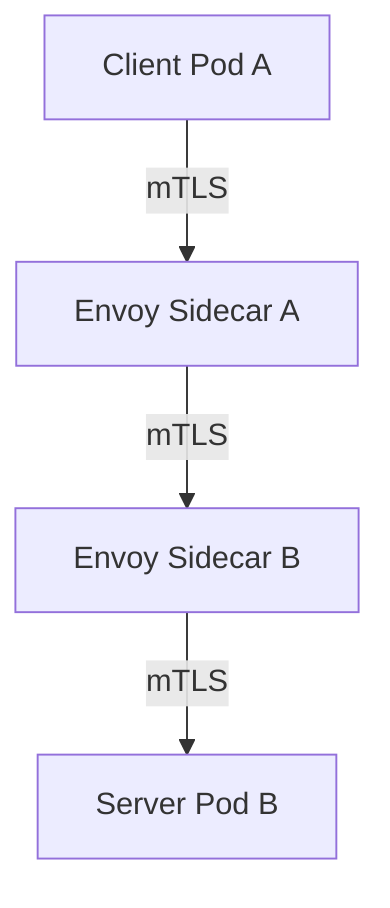

对于GCP里面的GKE而言，GKE集群内的传输级加密，它们是否针对Pod到Pod通讯或集群内通讯实施TLS或者MTLS 

在 **Google Kubernetes Engine（GKE）** 中，**默认情况下，GKE 不会对 Pod 与 Pod 之间的通信自动启用 TLS 或 mTLS 加密**。下面是对 GKE 内部通信加密的详细解析：

---

## **🔒 GKE 集群内通信的加密情况**

|**通信路径**|**默认是否加密**|**说明**|
|---|---|---|
|Pod ↔ Pod|❌ 未加密（明文传输）|需应用层或 Service Mesh 实现 TLS/mTLS|
|Node ↔ Node（节点间通信）|✅ GCP 网络层加密|Google Cloud 自动对节点间数据进行透明加密|
|kube-apiserver ↔ kubelet|✅ TLS 加密|默认由 GKE 使用 TLS|
|用户 ↔ kube-apiserver|✅ TLS 加密|kubectl 默认通过 HTTPS 访问 API Server|
|控制面 ↔ 节点（如 kube-proxy）|✅ TLS 加密|GKE 默认加密控制面通信|

---

## **✅ 想实现 Pod 之间的 TLS/mTLS，你有两个常见选择：**

  

### **1.** 

### **使用 Service Mesh（推荐）**

  

GKE 推荐使用 [**Anthos Service Mesh（基于 Istio）**](https://cloud.google.com/service-mesh)，它可以自动实现：

- Pod ↔ Pod 通信的 **mTLS 加密**
    
- 零信任身份验证
    
- 流量控制（如重试、熔断、流量镜像）
    

  

实现方式包括：

- 每个 Pod 自动注入一个 sidecar proxy（如 Envoy）
    
- 代理之间使用 mTLS 加密通信
    

  

### **2.** 

### **应用层自带 TLS**

  

你也可以在业务服务本身实现 TLS（例如 Nginx、gRPC、Spring Boot 启用 TLS），但这种方式：

- 管理复杂度高（证书管理）
    
- 不具备统一策略和自动化能力
    
- 缺乏服务级身份认证和加密策略控制
    

---

## **📌 总结**

  

GKE 集群内部通信（尤其 Pod ↔ Pod）**默认不加密**，需要你：

- **显式地引入 TLS（通过 Service Mesh 或应用自身）**
    
- 或者依赖 GCP 提供的底层网络层加密（但这无法替代 TLS/mTLS 的端到端安全）
    

---

## **🔁 可选架构流程图（启用 mTLS）**



---

如你准备使用 Service Mesh，我可以帮你提供开启 mTLS 所需的 YAML 样例和 Anthos Service Mesh 的快速配置流程。需要我继续补充吗？

如果我的Pod默认启动必须是443端口而且我的namespace之间 默认是Deny ALl 仅仅允许对应的标签才能访问 那么是不是Pod之间就是TLS的？

这是一个非常好的问题。你说的场景中有两个核心要素：

1. **Pod 启动监听的是 443 端口（即 HTTPS/TLS 通信端口）**
    
2. **不同 namespace 之间默认是 NetworkPolicy Deny All，仅允许指定标签访问**
    

  

现在我们来逐项拆解：

---

## **❓ 是否 “仅监听 443 端口 + Deny All” 就意味着 Pod 之间是 TLS 通信？**

  

> **✅ 简短回答：不是，监听 443 并不等于通信一定是 TLS 加密。**

---

## **🔍 详细解析**

  

### **1.** 

### **监听 443 ≠ TLS 加密**

  

监听 443 端口只是惯例上的 HTTPS 使用端口，是否真正使用 TLS，要看 Pod 内部的服务有没有启用 TLS：

|**情况**|**是否加密**|
|---|---|
|服务监听 443，但未启用 TLS（明文 HTTP）|❌ 实际是明文|
|服务监听 443，并启用了 TLS 证书/私钥|✅ 是 TLS 加密|

**示例说明：**

```
# 服务可能监听 443 但其实接受 HTTP 请求
curl http://pod-ip:443  # 能返回响应 => 并不是加密的
```

只有应用（如 Nginx、gRPC 服务等）**真的配置了 TLS** 才是加密传输。

---

### **2.** 

### **NetworkPolicy 限制访问 ≠ TLS 加密**

  

你提到使用了 Kubernetes 的 NetworkPolicy 实现 **Namespace 默认 Deny + 标签控制访问**，这是很好的 **访问控制** 手段，但它并不加密数据。

- NetworkPolicy 限制谁可以连接
    
- 不涉及对传输内容是否加密的处理
    

---

## **✅ 如何确保 Pod ↔ Pod 是 TLS / mTLS？**

  

你需要做到以下至少一项：

|**方法**|**是否推荐**|**实现方式**|
|---|---|---|
|应用层启用 TLS|✅ 常用于公开服务或定制安全场景|你要配置服务证书、私钥、证书校验|
|使用 Service Mesh（如 Istio）启用 mTLS|✅ 推荐方式，自动注入 Sidecar 统一管理 TLS|提供自动证书分发、身份认证、mTLS 加密|
|使用 Linkerd、Consul Connect 等轻量 Mesh|可选|类似 Istio，mTLS 默认开启或易于配置|

---

## **🧠 总结**

|**条件**|**是否意味着 TLS/mTLS**|
|---|---|
|Pod 监听 443 端口|❌ 不能保证（除非服务配置了 TLS）|
|使用 NetworkPolicy 限制访问|❌ 只是访问控制，不加密|
|显式启用 TLS（如 Nginx、gRPC）|✅ 是 TLS|
|使用 Service Mesh + mTLS|✅ 推荐方式，自动实现加密通信|

---

## **🧪 补充建议：怎么验证通信是否加密？**

  

你可以使用如下方式测试：

```
# 用 curl 发起请求，尝试以 HTTP 或 HTTPS 协议访问目标 Pod
curl -v http://<pod-ip>:443     # 如果返回成功，说明不是 TLS
curl -vk https://<pod-ip>:443   # 如果返回成功，是 TLS，加上 -v 会看到证书握手信息
```

---

是否需要我帮你写一个示例 TLS 启动服务配置（比如基于 Nginx/gRPC）或 Service Mesh mTLS 配置样本？

