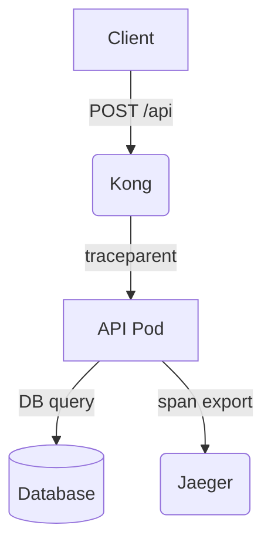

# GKE  node 在做升级的时候肯定是逐个替换 然后会做对应的排水 比如我的一个deployment 有两个Pod 且他们都运行在不同的node 。 我的Pod需要收到一个终止信号。 我能不能获取到的收到这个信号的时间

# summary 

- filter 
```bash
resouce.labels.pod_name="api-service-pa-health-monitor-0-0-2"
Stopping container 
```


# claude 

根据你提到的关键字 "Stopping container"，我来帮你获取 Pod 终止信号的时间。以下是具体方法：

1. 使用 GCP Cloud Logging 查询（推荐方法）：
```bash
# 查询包含 Stopping container 的日志
gcloud logging read 'resource.type="k8s_container" AND textPayload:"Stopping container"' \
--project=YOUR_PROJECT_ID \
--format='table(timestamp,resource.labels.pod_name,textPayload)'
```

2. 使用 kubectl 命令查看事件：
```bash
# 查看所有包含 Stopping container 的事件
kubectl get events --sort-by='.lastTimestamp' | grep "Stopping container"

# 如果知道具体的 Pod 名称，可以使用
kubectl get events --field-selector involvedObject.name=YOUR_POD_NAME --sort-by='.lastTimestamp'
```

3. 直接从 kubelet 日志查找：
```bash
# 在节点上执行
journalctl -u kubelet | grep "Stopping container"
```

4. 使用标准化的日志查询格式：
```bash
# 更精确的 GCP logging 查询
gcloud logging read '
resource.type="k8s_container" AND
jsonPayload.message:"Stopping container" AND
resource.labels.pod_name:"your-pod-name"
' --format='table(timestamp,jsonPayload.message)'
```

建议：
1. 优先使用 GCP Cloud Logging，因为它保留时间更长，查询更方便
2. 记得替换查询中的 YOUR_PROJECT_ID 和 your-pod-name
3. 可以加上时间范围限制，比如添加 `--freshness=1h` 只查看最近一小时的日志

这样你就能看到 Pod 收到终止信号的具体时间戳了。


关于 Kubernetes Pod 收到终止信号（SIGTERM）的时间获取问题，这里为你梳理一个完整的解决方案：

---

### 核心机制解析
当 GKE 节点升级触发 Pod 迁移时，**准确获取 SIGTERM 时间的四个层级**：

#### 1. **节点排空（Drain）触发时机** *(控制平面层)*
- **触发条件**：GKE 节点升级时会自动执行 `kubectl drain <node>`
- **关键日志位置**：
  ```bash
  # 查看节点事件时间戳（精确到秒）
  kubectl describe node <node-name> | grep -A 10 "Events:"
  ```
  ```log
  Events:
    Type    Reason      Age   From            Message
    ----    ------      ----  ----            -------
    Normal  Drain       117s  cluster-manager  Draining node for upgrade
    Normal  Terminating 113s  kubelet         Stopping container api-service
  ```

#### 2. **Pod 删除事件时间** *(Pod 生命周期层)*
- **查看精确时间**：
  ```bash
  # 获取 Pod 事件时间（ISO8601 格式）
  kubectl get pod <pod-name> -o jsonpath='{.metadata.creationTimestamp}' && \
  kubectl get events --field-selector involvedObject.name=<pod-name> --sort-by=.metadata.creationTimestamp
  ```
  ```log
  LAST SEEN   TYPE     REASON      OBJECT          MESSAGE
  5s          Normal   Killing    pod/api-pod-xyz  Stopping container api-service
  3s          Normal   PreStop    pod/api-pod-xyz  Executing preStop hook
  ```

#### 3. **应用接收 SIGTERM 的时间** *(应用层)*
通过代码捕获信号并记录时间戳：

```python
# Python 示例（其他语言逻辑类似）
import signal
import datetime
import logging

logging.basicConfig(filename='/var/log/app_termination.log', level=logging.INFO)

def handle_sigterm(signum, frame):
    timestamp = datetime.datetime.utcnow().isoformat() + "Z"
    logging.info(f"[SIGTERM Received] {timestamp}")
    # 这里添加清理逻辑
    raise SystemExit()

signal.signal(signal.SIGTERM, handle_sigterm)
```

#### 4. **PreStop Hook 执行时间** *(容器层)*
在 PreStop Hook 中记录时间：
```yaml
# deployment.yaml 片段
lifecycle:
  preStop:
    exec:
      command:
        - sh
        - -c
        - 'date -u +"%Y-%m-%dT%H:%M:%SZ" > /tmp/prestop_time.log; sleep 20'
```

---

### 时间轴可视化
```
[事件流]（假设节点升级从 14:00:00 开始）

14:00:00 | GKE 开始排空 Node-A
14:00:02 | kubelet 发送 SIGTERM 到 Pod (记录于 kubelet 日志)
14:00:02.100 | 应用代码捕获 SIGTERM (应用日志时间)
14:00:02.200 | PreStop Hook 启动 (容器内时间)
14:00:22.200 | PreStop 完成 → 强制终止（若未完成）
```

---

### 精准时间获取方案

#### 方案 1：应用层主动记录
```python
# 增强型日志记录
import time

def handle_sigterm(signum, frame):
    # 获取高精度时间戳（Unix 时间戳 + 毫秒）
    timestamp = time.time_ns() // 1_000_000  # 毫秒级
    logging.info(f"SIGTERM at {timestamp} (epoch ms)")
    # 同步写入磁盘
    with open('/var/log/sigterm.log', 'a') as f:
        f.write(f"{timestamp}\n")
    # 执行清理...
```

#### 方案 2：Sidecar 监控容器
```yaml
# 注入监控 sidecar
containers:
- name: sigterm-monitor
  image: busybox
  command: ["sh", "-c"]
  args:
    - "while true; do
         if [ -f /sigterm/signal.log ]; then
           echo 'SIGTERM detected at $(date -u +'%Y-%m-%dT%H:%M:%S.%NZ')' >> /var/log/sigterm.log;
           exit 0;
         fi;
         sleep 0.1;
       done"
  volumeMounts:
    - name: sigterm-volume
      mountPath: /sigterm

- name: main-app
  # 主容器配置...
  lifecycle:
    preStop:
      exec:
        command: ["sh", "-c", "touch /sigterm/signal.log; sleep 20"]
  volumeMounts:
    - name: sigterm-volume
      mountPath: /sigterm
```

#### 方案 3：Kubernetes 审计日志
启用 GKE 审计日志（需配置）：
```bash
# 查看 API Server 审计日志中的 Pod 删除事件
gcloud logging read 'resource.type="k8s_pod" AND protoPayload.methodName="delete"' \
  --format json \
  --project <your-project-id>
```
日志示例：
```json
{
  "protoPayload": {
    "@type": "type.googleapis.com/google.cloud.audit.AuditLog",
    "methodName": "io.k8s.core.v1.pods.delete",
    "requestMetadata": {
      "callerIp": "192.168.128.1",
      "callerSuppliedUserAgent": "kube-controller-manager/v1.24.9 (linux/amd64) kubernetes/..."
    },
    "resourceName": "projects/<project>/locations/us-central1-c/clusters/<cluster>/k8s/namespaces/default/pods/api-pod-xyz",
    "response": {},
    "status": {},
    "authenticationInfo": {
      "principalEmail": "system:serviceaccount:kube-system:node-updater"
    },
    "request": {
      "name": "api-pod-xyz",
      "namespace": "default"
    },
    "metadata": {
      "@type": "type.googleapis.com/kubernetes.io/events/v1.Event",
      "creationTimestamp": "2023-10-05T14:00:02.000000Z" // 精确到微秒
    }
  }
}
```

---

### 时间误差校准建议

1. **节点时间同步**：
   ```bash
   # 在 GKE 节点上强制同步时间
   sudo systemctl restart systemd-timesyncd
   ```
   
2. **日志时间戳规范**：
   - 统一使用 UTC 时区
   - 记录到至少毫秒级精度（推荐 ISO8601 格式：`2023-10-05T14:00:02.123Z`）

3. **关联分析工具**：
   ```bash
   # 使用 fluent-bit 收集日志时添加高精度时间字段
   [INPUT]
     Name              tail
     Path              /var/log/app.log
     Tag               app.*
     Read_from_Head    true
     Mem_Buf_Limit     5MB
     # 提取应用日志中的纳秒时间戳
     Parser            nano_time_parser

   [PARSER]
     Name        nano_time_parser
     Format      regex
     Regex       ^(?<time>\d{4}-\d{2}-\d{2}T\d{2}:\d{2}:\d{2}.\d+Z)
     Time_Key    time
     Time_Format %Y-%m-%dT%H:%M:%S.%LZ
   ```

---

### 关键验证步骤

1. **模拟测试**：
   ```bash
   # 强制触发 Pod 删除（记录精确时间）
   DELETE_TIME=$(date -u +"%Y-%m-%dT%H:%M:%SZ") && kubectl delete pod <target-pod>
   
   # 检索日志
   kubectl logs <target-pod> -c sigterm-monitor | grep "SIGTERM detected"
   ```

2. **时序分析**：
   ```bash
   # 获取各层级时间戳对比
   # K8s 事件时间
   kubectl get event --field-selector involvedObject.name=<pod> --template='{{range .items}}{{.lastTimestamp}}{{"\n"}}{{end}}'
   
   # 应用日志时间
   kubectl exec <pod> -c main-app -- cat /var/log/sigterm.log
   
   # Sidecar 记录时间
   kubectl exec <pod> -c sigterm-monitor -- cat /var/log/sigterm.log
   ```

3. **误差统计**：
   ```python
   # 简单分析脚本示例
   import pandas as pd

   k8s_time = "2023-10-05T14:00:02Z"  # 从事件获取
   app_time = "2023-10-05T14:00:02.123Z"  # 应用日志
   sidecar_time = "2023-10-05T14:00:02.150Z"  # sidecar 记录

   # 转换为 datetime 对象
   def parse(t):
       return pd.to_datetime(t, utc=True)

   delta = parse(sidecar_time) - parse(k8s_time)
   print(f"Total delay: {delta.total_seconds() * 1000:.2f} ms")
   ```

---

### 生产环境建议
1. **关键指标监控**：
   - `sigterm_receive_delay_seconds`（histogram 类型）
   - `pod_termination_phase_duration_seconds`（记录各阶段耗时）

2. **告警规则示例**（Prometheus）：
   ```yaml
   groups:
   - name: pod_termination
     rules:
     - alert: LongSIGTERMDelay
       expr: histogram_quantile(0.99, rate(sigterm_receive_delay_seconds_bucket[5m])) > 1.5
       for: 5m
       labels:
         severity: warning
       annotations:
         summary: "Pod termination signal delay exceeds threshold"
         description: "SIGTERM processing delay is {{ $value }}s (pod={{ $labels.pod }})"
   ```

3. **GKE 特性优化**：
   - 启用 [Pod 中断预算 (PDB)](https://cloud.google.com/kubernetes-engine/docs/how-to/disruption-budgets)
     ```yaml
     apiVersion: policy/v1
     kind: PodDisruptionBudget
     metadata:
       name: api-service-pdb
     spec:
       minAvailable: 1
       selector:
         matchLabels:
           app: api-service
     ```
   - 使用 [节点自动修复策略](https://cloud.google.com/kubernetes-engine/docs/how-to/node-auto-repair) 减少意外中断

---

通过以上方法，你可以精确追踪到从节点排空开始到 Pod 实际收到 SIGTERM 的完整时间链条，结合应用层和基础设施层的监控，确保关键请求在滚动更新期间的完整性。


针对已删除 Pod 的终止时间节点追踪问题，即使 Pod 已被销毁，仍有以下 **5 种有效方法** 可获取关键时间信息：

---

### 方法 1：Kubernetes 事件历史（即使 Pod 已删除）
**适用场景**：Pod 删除后 1 小时内（默认事件保留时间）  
```bash
# 查看集群范围内所有与 Pod 终止相关的事件（按时间倒序）
kubectl get events --field-selector=reason=Killing,reason=PreStop --all-namespaces --sort-by=.metadata.creationTimestamp
```

**输出示例**（关键字段已高亮）：
```log
LAST SEEN   TYPE     REASON      OBJECT          MESSAGE
5m          Normal   Killing    pod/api-pod-xyz  Stopping container api-service
5m          Normal   PreStop    pod/api-pod-xyz  Executing preStop hook
```

**增强保留时长**：  
通过修改 kube-apiserver 配置（GKE 需使用 Autopilot 或自行管理集群）：
```yaml
# /etc/kubernetes/manifests/kube-apiserver.yaml
spec:
  containers:
  - command:
    - kube-apiserver
    - --event-ttl=24h # 将事件保留时间延长至 24 小时
```

---

### 方法 2：GCP 审计日志（永久保留）
**操作步骤**：  
1. 打开 [GCP Logs Explorer](https://console.cloud.google.com/logs/query)  
2. 输入查询语句：
```sql
resource.type="k8s_pod"
protoPayload.methodName="io.k8s.core.v1.pods.delete"
protoPayload.resourceName:"projects/YOUR-PROJECT-ID/pods/api-pod-xyz"
```
3. 展开日志条目查看详细时间戳：  
   

**关键字段**：
- `protoPayload.metadata.createTime`：API Server 处理删除请求的时间（UTC 微秒级）
- `protoPayload.requestMetadata.callerSuppliedUserAgent`：触发删除的组件（如 `kube-controller-manager`）

---

### 方法 3：应用日志结合 Loki/Promtail
**前提条件**：应用需记录 SIGTERM 事件  
**日志收集架构**：  
```
Pod → Promtail (sidecar) → Loki → Grafana
```

**应用日志记录示例**（Python）：
```python
import signal, datetime, logging

logging.basicConfig(format='%(asctime)s.%(msecs)03dZ %(message)s', 
                   datefmt='%Y-%m-%dT%H:%M:%S',
                   handlers=[logging.FileHandler('/var/log/app.log')])

def handle_sigterm(signum, frame):
    logging.error("Received SIGTERM at UTC: %s", datetime.datetime.utcnow())
    # 执行清理逻辑...

signal.signal(signal.SIGTERM, handle_sigterm)
```

**在 Loki 中查询**：
```sql
{container="api-service"} |= "Received SIGTERM"
```

---

### 方法 4：Node 系统日志（需启用 GKE 节点日志收集）
**配置步骤**：  
1. 在 GKE 集群启用 **系统日志**：  
   GCP Console → Logging → Logs Router → 创建 Sink 路由 `compute.googleapis.com/kubernetes.io/node/*` 到 BigQuery  
2. 查询节点级操作：
```sql
SELECT
  timestamp,
  jsonPayload.message
FROM
  `your-project-id.your_dataset.gke_node_logs`
WHERE
  jsonPayload.message LIKE "%Stopping container%"
  AND jsonPayload.message LIKE "%api-pod-xyz%"
```

**关键日志示例**：  
```log
Stopping container api-service (pod "api-pod-xyz") with grace period 30s
```

---

### 方法 5：OpenTelemetry 分布式追踪
**架构设计**：  


**代码植入**（Python with OpenTelemetry）：
```python
from opentelemetry import trace
from opentelemetry.sdk.trace import TracerProvider
from opentelemetry.sdk.resources import Resource

resource = Resource(attributes={"service.name": "api-service"})
tracer_provider = TracerProvider(resource=resource)
trace.set_tracer_provider(tracer_provider)

# 在 SIGTERM 处理中记录事件
def handle_sigterm(signum, frame):
    tracer = trace.get_tracer(__name__)
    with tracer.start_as_current_span("graceful_shutdown") as span:
        span.add_event("SIGTERM received", {"timestamp": datetime.datetime.utcnow().isoformat()})
        # 清理逻辑...
```

**在 Jaeger 中查看**：  


---

### 时间轴重建工具
使用 **Stern** 实时捕获多 Pod 日志：
```bash
stern "api-service-.*" --template '{{.NodeName}} | {{.Message}}'
```
输出示例：
```log
gke-cluster-node-1 | 2023-10-06T08:00:01.123Z Received SIGTERM
gke-cluster-node-1 | 2023-10-06T08:00:21.456Z Shutdown completed
```

---

### 生产环境推荐组合
| 方案                | 时间精度   | 数据保留 | 实现复杂度 |  
|---------------------|-----------|----------|------------|  
| **GCP Audit Logs**  | 微秒级     | 永久     | 低         |  
| **Loki + App Logs** | 毫秒级     | 自定义   | 中         |  
| **OpenTelemetry**   | 纳秒级     | 自定义   | 高         |  

---

### 终极保障方案：Termination Lifecycle Hook
在 Pod 中注入 **Termination Reporter** Sidecar：  
```yaml
apiVersion: apps/v1
kind: Deployment
spec:
  template:
    spec:
      containers:
      - name: term-logger
        image: busybox
        command: ["sh", "-c"]
        args:
          - while true; do
              if [ -f /tmp/term.signal ]; then
                echo "TERM at $(date -u +'%Y-%m-%dT%H:%M:%S.%NZ')" >> /var/log/term.log;
                exit 0;
              fi;
              sleep 0.1;
            done
        volumeMounts:
          - name: term-volume
            mountPath: /tmp

      - name: main-app
        lifecycle:
          preStop:
            exec:
              command: ["sh", "-c", "touch /tmp/term.signal; sleep 30"]
        volumeMounts:
          - name: term-volume
            mountPath: /tmp
```

该方案可在 **任何容器环境** 中可靠记录以下时间节点：  
1. SIGTERM 接收时间（通过主容器 preStop 触发）  
2. Sidecar 实际记录时间  
3. 容器终止完成时间（通过日志时间差计算）  

---

通过以上方法组合，即使 Pod 已被完全删除，仍可精确重建其终止生命周期。建议在生产环境中至少启用 **GCP 审计日志 + 应用级 SIGTERM 日志记录** 的组合方案。


在 Kubernetes 中，Pod 的终止信号 (SIGTERM) 发送的时机，以及其他与 Pod 终止相关的操作，可以通过以下几个方式进行查看和监控。特别是对于 GKE 和 Kubernetes 平台，您可以使用不同的命令和工具来获取相关信息。

1. 查看 Pod 的终止时间和状态

当您删除一个 Pod 时，它会进入 “Terminating” 状态，您可以使用 kubectl describe pod 命令来查看 Pod 的详细信息，包括容器接收到 SIGTERM 的时间和相关的事件。

kubectl describe pod <pod-name>

输出中会包括以下信息：
	•	状态：Pod 是否处于 “Terminating” 状态。
	•	事件：每个容器收到 SIGTERM 的时间，以及是否执行了 preStop 钩子（如果有的话）。
	•	TerminationGracePeriodSeconds：Pod 的终止宽限期（默认为 30 秒）。

例如，您可以在事件部分看到类似以下的内容：

Events:
  Type    Reason             Age   From               Message
  ----    ------             ----  ----               -------
  Normal  Killing            4s    kubelet, gke-cluster-xyz-1234  Killing container with id docker://<container-id>: Container failed liveness probe
  Normal  PreStopHook        3s    kubelet, gke-cluster-xyz-1234  Running preStop hook for container <container-name>
  Normal  TerminationGracePeriodExceeded  2s    kubelet, gke-cluster-xyz-1234  Termination grace period exceeded, sending SIGKILL

在这里，您会看到 Killing 事件，以及是否有 PreStopHook 被触发的记录。

2. 查看容器接收到 SIGTERM 的时间

Kubernetes 并没有直接提供一个命令来显示 SIGTERM 信号发送的具体时间，但您可以通过查看容器日志来间接了解这一过程。如果容器中有日志输出在收到 SIGTERM 时（例如，通过自定义的应用逻辑记录），则可以通过以下命令查看日志：

kubectl logs <pod-name> -c <container-name> --timestamps

在容器日志中，您可以查找 SIGTERM 信号触发的相关输出，通常在收到 SIGTERM 后会有相应的日志（例如，SIGTERM received, shutting down...）。

3. 查看 GKE 上的 Pod 终止日志

在 GKE 中，您还可以通过 Stackdriver（现在是 Google Cloud Operations Suite）查看与 Pod 终止相关的日志。您可以通过 GCP 控制台访问日志：
	1.	打开 Google Cloud Console.
	2.	导航到 Logging -> Log Explorer。
	3.	在查询框中输入类似以下的查询：

resource.type="k8s_container"
resource.labels.cluster_name="<your-cluster-name>"
resource.labels.namespace_name="<your-namespace>"
"pod" AND "Killing"

这将显示与 Pod 终止相关的日志，您可以看到 Pod 是否正常收到 SIGTERM 信号，以及是否有任何与容器关闭或钩子相关的日志。

4. 其他检查项
	•	Pod 的生命周期事件：可以使用 kubectl get events 来查看与 Pod 终止相关的所有事件，特别是与 Pod 终止和重新启动相关的事件。

kubectl get events --sort-by='.lastTimestamp'


总结：
	•	使用 kubectl describe pod 查看 Pod 状态和事件，包括收到 SIGTERM 信号的时间。
	•	查看容器日志 可以了解容器在收到 SIGTERM 后的行为。
	•	在 GKE 上使用 Google Cloud Logging 来检查与 Pod 终止相关的日志，特别是容器终止过程中的事件和错误。

如果有其他具体的需求或操作，随时可以继续提问！


是的，您可以在 GKE 节点升级 时，获取 Pod 收到终止信号（SIGTERM）的时间。以下是几种方法来记录和分析 Pod 何时收到终止信号的时间：

1. 在 Pod 的日志中记录 SIGTERM 时间

当 GKE 节点升级时，Kubernetes 会执行 节点排水（Drain），从而触发 Pod 终止流程。Pod 终止时，Kubernetes 会向其主进程发送 SIGTERM 信号。如果您的应用程序可以捕获 SIGTERM 信号，您可以在应用日志中记录该时间。例如：

方法 1：修改应用程序代码

在 Java、Go、Python 等语言的应用程序中，监听 SIGTERM 并记录时间：

示例：Go 语言

package main

import (
	"fmt"
	"os"
	"os/signal"
	"syscall"
	"time"
)

func main() {
	// 创建一个通道监听 SIGTERM 信号
	sigChan := make(chan os.Signal, 1)
	signal.Notify(sigChan, syscall.SIGTERM)

	fmt.Println("Pod is running...")

	// 等待接收 SIGTERM
	sig := <-sigChan
	fmt.Printf("Received %s at %s\n", sig, time.Now().Format(time.RFC3339))

	// 在这里可以添加清理逻辑

	time.Sleep(5 * time.Second) // 模拟清理工作
	fmt.Println("Cleanup complete. Exiting.")
}

当 Pod 被终止时，日志会输出：

Received SIGTERM at 2025-02-17T12:34:56Z

示例：Bash 脚本

如果您使用 bash，可以通过 trap 监听 SIGTERM：

#!/bin/bash
trap 'echo "Received SIGTERM at $(date)" >> /var/log/pod-termination.log; sleep 5; exit 0' SIGTERM

while true; do
  echo "Running..."
  sleep 10
done

然后可以查看 cat /var/log/pod-termination.log 以获取收到 SIGTERM 的时间。

2. 在 Kubernetes 事件中查找 Pod 终止时间

Kubernetes 事件会记录 Pod 终止的相关信息，可以使用以下命令查看：

kubectl get events --sort-by='.lastTimestamp' -n <namespace>

或者查看特定 Pod 的事件：

kubectl describe pod <pod-name> -n <namespace>

如果 Pod 由于 节点升级 而终止，您会看到类似的事件：

Reason: Killing
Message: Stopping container due to node drain

时间戳即是 Pod 终止的时间。

3. 在 GKE 日志 (Google Cloud Logging) 中查找

如果 GKE 已启用 Cloud Logging（原 Stackdriver），您可以通过查询 Kubernetes 日志来获取终止时间：

resource.type="k8s_container"
logName="projects/YOUR_PROJECT_ID/logs/stderr"
textPayload:"SIGTERM"

此方法适用于 您的应用程序已经记录了 SIGTERM 的情况。

4. 在 Node 日志中查找 Kubelet 发送 SIGTERM 的时间

GKE 的 kubelet 在执行节点排水时，会在系统日志中记录 Pod 终止事件。可以在 GCE VM 日志 或 GKE Cloud Logging 中搜索 kubelet 相关的日志：

journalctl -u kubelet | grep "Stopping container"

或者在 Google Cloud Logging 查询：

resource.type="k8s_node"
logName="projects/YOUR_PROJECT_ID/logs/kubelet"
jsonPayload.message:"Stopping container"

日志时间即是 SIGTERM 发送的时间。

总结

方法	说明	适用场景
应用程序监听 SIGTERM	修改应用程序代码，记录 SIGTERM 时间	适用于自定义应用，主动记录终止时间
查看 kubectl events	使用 kubectl get events 找到 Killing 事件	适用于临时查看 Pod 终止时间
GKE Cloud Logging	搜索日志 SIGTERM 关键字	适用于 GKE 已启用 Cloud Logging
Node 日志 (journalctl)	在 kubelet 日志中查找 Stopping container	适用于访问 GKE 节点的情况

最推荐的方法：
	1.	应用代码监听 SIGTERM（最可靠）
	2.	kubectl get events 查看 Pod 终止事件
	3.	GKE Cloud Logging 搜索 SIGTERM

这样您就可以准确知道 Pod 何时收到 SIGTERM，以及 它的终止时间！


要了解一个已删除 Pod 从 收到终止信号（SIGTERM）到结束 的时间节点，尤其是在历史 Pod 已经删除的情况下，获取这些信息会有一定挑战，但有几种方法可以尽量还原这个过程：

1. 查看 Kubernetes 事件（kubectl get events）

在节点升级或 Pod 终止过程中，Kubernetes 会生成事件记录，包含 Pod 的终止信息。虽然历史 Pod 已被删除，但如果 Pod 终止事件的记录还保留在集群的事件系统中，您可以通过查询事件来查看何时开始终止。

查询 Pod 终止相关的事件：

kubectl get events --sort-by='.lastTimestamp' -n <namespace>

查看是否有关于 Pod 被终止、删除或滚动更新的事件。如果有终止的事件，您会看到类似于以下的日志：

LAST SEEN   TYPE      REASON    OBJECT     MESSAGE
2m          Normal    Killing   pod/<pod-name>  Stopping container due to node drain

通过事件的 lastTimestamp，您可以获取 Pod 被终止的时间，但无法直接知道收到 SIGTERM 到退出的时间差，只能知道 Pod 被删除的时刻。

2. 启用更长时间的日志存储

如果您的集群已经集成了 Cloud Logging（Stackdriver），可以查看日志中的容器启动和关闭信息。尤其是如果您的应用程序内部处理了 SIGTERM 信号并输出了日志，您可以通过日志中的时间戳还原 Pod 终止过程。

Google Cloud Logging 查询（假设启用了 Cloud Logging）：

resource.type="k8s_container"
logName="projects/YOUR_PROJECT_ID/logs/stderr"
textPayload:"SIGTERM"

您可以在日志中找到 SIGTERM 相关的消息，记录 Pod 收到信号的时间点。结合其他日志信息，您可以推测出 Pod 的终止过程。

3. 在应用程序中记录 SIGTERM 处理时间

如果 Pod 已经删除，直接通过 kubectl 命令是无法获取到从收到 SIGTERM 到完全结束的时间的。最可靠的做法是在应用程序中捕获 SIGTERM 信号，并将收到信号的时间与容器退出时间一起记录到外部存储（如数据库、日志文件等）。如果您的 Pod 终止过程已经包含了这一逻辑，您可以通过应用日志来查看时间差。

例如，Go、Java 或 Bash 中的 SIGTERM 处理：
	•	在收到 SIGTERM 时，记录当前时间。
	•	在容器退出时记录退出时间。
	•	使用时间差来计算从收到 SIGTERM 到容器完全退出所用的时间。

这种方法要求您提前配置应用程序，以便在 Pod 终止过程中记录详细信息。

4. 查看 GKE 节点日志

如果您可以访问 GKE 的节点日志，您可以尝试查看 kubelet 执行节点排水时的日志，了解 Pod 何时被发出终止请求。虽然这也不直接告诉您 SIGTERM 的时间，但它可以提供一些线索。

在 GKE 节点上运行：

journalctl -u kubelet | grep "drain"

此命令会显示节点排水时的日志，您可以查看是否有涉及 Pod 终止的日志，并推测 Pod 收到 SIGTERM 的时间。

5. Node 的 Kubelet 日志（GKE 适用）

您可以通过 kubelet 日志或 GKE 提供的日志存储查看排水操作：

在 GKE 节点的 日志 中查找：

resource.type="k8s_node"
logName="projects/YOUR_PROJECT_ID/logs/kubelet"
jsonPayload.message:"Killing pod"

如果 GKE 已启用日志聚合，可以通过 Google Cloud Logging 查询 kubelet 日志中有关 Pod 的终止操作。日志中会记录 Pod 被标记为删除、接收到 SIGTERM 信号等事件。

6. 使用 Prometheus/Grafana 监控

如果您的集群配置了 Prometheus 和 Grafana 监控，您可以查看监控指标来推测 Pod 终止时间。在 Pod 被终止前，Prometheus 可能会监控到容器的健康检查、CPU 和内存的使用率等指标，帮助您分析 Pod 被终止的时刻。

您可以根据容器的停止时间点来推测终止的时间。

总结

对于已删除的 Pod，获取从 收到 SIGTERM 到结束的时间节点 主要依赖于以下几种方法：
	1.	查看 Kubernetes 事件（kubectl get events），查看是否记录 Pod 终止的时间。
	2.	Google Cloud Logging（Stackdriver）：如果启用日志聚合，可以通过查询日志找到 SIGTERM 收到的时间点。
	3.	应用程序内记录：在应用中记录 SIGTERM 的时间和退出时间，结合日志推测时间差。
	4.	查看节点日志：GKE 节点上的 kubelet 日志中可能记录 Pod 终止的时间。

如果 Pod 已经删除且没有提前记录相关数据，那么获取精确的 SIGTERM 到退出的时间会比较困难。最好的做法是在应用中提前捕获这些信号并记录相关信息。

