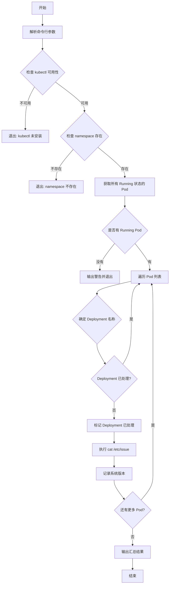

# GKE Pod 系统版本查询脚本

## 问题分析

需要创建一个脚本来：

1. 连接到指定 namespace 的 GKE Pod
2. 筛选状态为 Running 的 Pod
3. 每个 Deployment 只查询一个 Pod
4. 执行 `cat /etc/issue` 获取系统版本
5. 输出 Deployment 名称和对应的系统版本列表

## 解决方案

### 脚本实现

```bash
#!/bin/bash

# 脚本名称: check-pod-versions.sh
# 用途: 查询 GKE 中每个 Deployment 的 Pod 系统版本

set -e

# 默认值
NAMESPACE="default"

# 使用说明
usage() {
    cat << EOF
使用方法: $0 [选项]

选项:
    -n NAMESPACE    指定 Kubernetes namespace (默认: default)
    -h              显示此帮助信息

示例:
    $0 -n production
    $0 -n staging
EOF
    exit 1
}

# 解析命令行参数
while getopts "n:h" opt; do
    case $opt in
        n)
            NAMESPACE="$OPTARG"
            ;;
        h)
            usage
            ;;
        \?)
            echo "无效选项: -$OPTARG" >&2
            usage
            ;;
    esac
done

# 检查 kubectl 是否可用
if ! command -v kubectl &> /dev/null; then
    echo "错误: kubectl 未安装或不在 PATH 中"
    exit 1
fi

# 检查 namespace 是否存在
if ! kubectl get namespace "$NAMESPACE" &> /dev/null; then
    echo "错误: Namespace '$NAMESPACE' 不存在"
    exit 1
fi

echo "=========================================="
echo "Namespace: $NAMESPACE"
echo "查询时间: $(date '+%Y-%m-%d %H:%M:%S')"
echo "=========================================="
echo ""

# 获取所有 Running 状态的 Pod,包含 Deployment 标签
PODS=$(kubectl get pods -n "$NAMESPACE" \
    --field-selector=status.phase=Running \
    -o jsonpath='{range .items[*]}{.metadata.name}{"\t"}{.metadata.labels.app}{"\t"}{.metadata.ownerReferences[0].name}{"\n"}{end}')

# 检查是否有 Running 的 Pod
if [ -z "$PODS" ]; then
    echo "警告: 在 namespace '$NAMESPACE' 中没有找到 Running 状态的 Pod"
    exit 0
fi

# 用于存储已处理的 Deployment
declare -A processed_deployments

# 输出表头
printf "%-40s %-40s %-50s\n" "DEPLOYMENT" "POD" "OS VERSION"
printf "%-40s %-40s %-50s\n" "$(printf '%.0s-' {1..40})" "$(printf '%.0s-' {1..40})" "$(printf '%.0s-' {1..50})"

# 处理每个 Pod
while IFS=$'\t' read -r pod_name app_label owner_name; do
    # 跳过空行
    [ -z "$pod_name" ] && continue
    
    # 尝试从不同来源获取 Deployment 名称
    deployment_name=""
    
    # 方法1: 从 owner reference 获取(适用于 ReplicaSet)
    if [[ "$owner_name" =~ ^(.+)-[a-z0-9]+$ ]]; then
        deployment_name="${BASH_REMATCH[1]}"
    fi
    
    # 方法2: 使用 app 标签
    if [ -z "$deployment_name" ] && [ -n "$app_label" ]; then
        deployment_name="$app_label"
    fi
    
    # 方法3: 从 Pod 名称推断
    if [ -z "$deployment_name" ]; then
        if [[ "$pod_name" =~ ^(.+)-[a-z0-9]+-[a-z0-9]+$ ]]; then
            deployment_name="${BASH_REMATCH[1]}"
        else
            deployment_name="$pod_name"
        fi
    fi
    
    # 检查此 Deployment 是否已处理
    if [ -n "${processed_deployments[$deployment_name]}" ]; then
        continue
    fi
    
    # 标记此 Deployment 已处理
    processed_deployments[$deployment_name]=1
    
    # 执行命令获取系统版本
    os_version=$(kubectl exec -n "$NAMESPACE" "$pod_name" -- cat /etc/issue 2>/dev/null | head -n 1 | tr -d '\n' || echo "无法获取")
    
    # 清理版本信息中的特殊字符
    os_version=$(echo "$os_version" | sed 's/\\[a-z]//g' | xargs)
    
    # 输出结果
    printf "%-40s %-40s %-50s\n" "$deployment_name" "$pod_name" "$os_version"
    
done <<< "$PODS"

echo ""
echo "查询完成!"
```

## 使用方法

### 1. 保存并设置执行权限

```bash
# 保存脚本
vim check-pod-versions.sh

# 添加执行权限
chmod +x check-pod-versions.sh
```

### 2. 执行脚本

```bash
# 查询 default namespace
./check-pod-versions.sh

# 查询指定 namespace
./check-pod-versions.sh -n production

# 查询 kube-system namespace
./check-pod-versions.sh -n kube-system
```

### 3. 输出示例

```
==========================================
Namespace: production
查询时间: 2025-10-20 15:30:45
==========================================

DEPLOYMENT                               POD                                      OS VERSION
---------------------------------------- ---------------------------------------- --------------------------------------------------
nginx-deployment                         nginx-deployment-7d5c6b8f9d-abc12       Ubuntu 22.04.3 LTS
redis-cluster                            redis-cluster-6f8b9c7d5e-def34          Debian GNU/Linux 11 (bullseye)
api-server                               api-server-5c7d8e9f6a-ghi56             Alpine Linux v3.18

查询完成!
```

## 执行流程图



## 脚本特性说明

### 功能特点

1. **智能 Deployment 识别**
    
    - 从 ownerReferences 获取 ReplicaSet 信息
    - 从 Pod 标签 (app) 获取应用名称
    - 从 Pod 名称模式推断 Deployment
2. **状态过滤**
    
    - 仅处理 `Running` 状态的 Pod
    - 自动跳过 Pending/Failed/Unknown 状态
3. **去重机制**
    
    - 使用关联数组记录已处理的 Deployment
    - 确保每个 Deployment 只查询一次
4. **错误处理**
    
    - 检查 kubectl 可用性
    - 验证 namespace 存在性
    - 捕获命令执行错误

### 版本信息清理

脚本会自动清理 `/etc/issue` 中的特殊字符（如 `\n`, `\l` 等转义序列）

## 增强版本（可选功能）

### 支持并发查询

如果 Pod 数量较多,可以使用并发版本提高查询速度:

```bash
#!/bin/bash

# 并发查询版本
NAMESPACE="default"
MAX_JOBS=10

while getopts "n:j:h" opt; do
    case $opt in
        n) NAMESPACE="$OPTARG" ;;
        j) MAX_JOBS="$OPTARG" ;;
        h) usage ;;
    esac
done

# 创建临时文件存储结果
TEMP_FILE=$(mktemp)

# 并发执行查询
while IFS=$'\t' read -r pod_name app_label owner_name; do
    [ -z "$pod_name" ] && continue
    
    # 后台执行
    (
        deployment_name=$(determine_deployment_name)
        os_version=$(kubectl exec -n "$NAMESPACE" "$pod_name" -- cat /etc/issue 2>/dev/null | head -n 1)
        echo "$deployment_name|$pod_name|$os_version" >> "$TEMP_FILE"
    ) &
    
    # 控制并发数
    while [ $(jobs -r | wc -l) -ge $MAX_JOBS ]; do
        sleep 0.1
    done
done <<< "$PODS"

# 等待所有后台任务完成
wait

# 去重并输出结果
sort -u -t'|' -k1,1 "$TEMP_FILE" | while IFS='|' read -r deployment pod version; do
    printf "%-40s %-40s %-50s\n" "$deployment" "$pod" "$version"
done

rm -f "$TEMP_FILE"
```

## 注意事项

### 前置要求

1. **kubectl 配置**
    
    ```bash
    # 确认已配置 GKE 集群访问
    kubectl config current-context
    
    # 测试连接
    kubectl cluster-info
    ```
    
2. **权限要求**
    
    - 需要对目标 namespace 的 `pods` 资源有 `get` 和 `list` 权限
    - 需要有 `pods/exec` 权限执行命令
3. **Pod 容器要求**
    
    - Pod 必须包含 `/etc/issue` 文件
    - 某些精简镜像（如 distroless）可能没有此文件

### 常见问题处理

1. **无法获取版本信息**
    
    ```bash
    # 某些容器可能使用不同的文件
    # 可修改脚本支持多种查询方式:
    cat /etc/os-release | grep PRETTY_NAME
    uname -a
    ```
    
2. **Deployment 名称识别不准确**
    
    - 检查 Pod 的 `app` 或 `app.kubernetes.io/name` 标签
    - 可根据实际标签规范调整脚本逻辑
3. **权限被拒绝**
    
    ```bash
    # 检查当前用户权限
    kubectl auth can-i get pods -n <namespace>
    kubectl auth can-i exec pods -n <namespace>
    ```
    

## 最佳实践

1. **定期备份查询结果**
    
    ```bash
    ./check-pod-versions.sh -n production > versions_$(date +%Y%m%d).txt
    ```
    
2. **与 CI/CD 集成**
    
    - 可集成到持续部署流程中
    - 自动验证部署后的系统版本一致性
3. **监控版本差异**
    
    - 定期运行脚本检查版本是否统一
    - 及时发现未更新或异常的 Pod