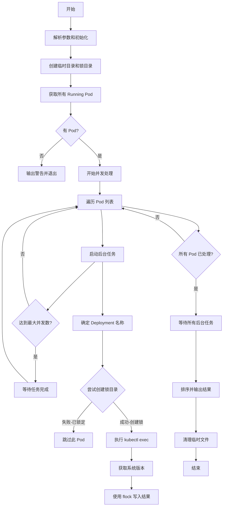

# GKE Pod 系统版本查询脚本

## 问题分析

需要创建一个脚本来：

1. 连接到指定 namespace 的 GKE Pod
2. 筛选状态为 Running 的 Pod
3. 每个 Deployment 只查询一个 Pod
4. 执行 `cat /etc/issue` 获取系统版本
5. 输出 Deployment 名称和对应的系统版本列表

## 解决方案

### 脚本实现

```bash
#!/bin/bash

# 脚本名称: check-pod-versions.sh
# 用途: 查询 GKE 中每个 Deployment 的 Pod 系统版本

set -e

# 默认值
NAMESPACE="default"

# 使用说明
usage() {
    cat << EOF
使用方法: $0 [选项]

选项:
    -n NAMESPACE    指定 Kubernetes namespace (默认: default)
    -h              显示此帮助信息

示例:
    $0 -n production
    $0 -n staging
EOF
    exit 1
}

# 解析命令行参数
while getopts "n:h" opt; do
    case $opt in
        n)
            NAMESPACE="$OPTARG"
            ;;
        h)
            usage
            ;;
        \?)
            echo "无效选项: -$OPTARG" >&2
            usage
            ;;
    esac
done

# 检查 kubectl 是否可用
if ! command -v kubectl &> /dev/null; then
    echo "错误: kubectl 未安装或不在 PATH 中"
    exit 1
fi

# 检查 namespace 是否存在
if ! kubectl get namespace "$NAMESPACE" &> /dev/null; then
    echo "错误: Namespace '$NAMESPACE' 不存在"
    exit 1
fi

echo "=========================================="
echo "Namespace: $NAMESPACE"
echo "查询时间: $(date '+%Y-%m-%d %H:%M:%S')"
echo "=========================================="
echo ""

# 获取所有 Running 状态的 Pod,包含 Deployment 标签
PODS=$(kubectl get pods -n "$NAMESPACE" \
    --field-selector=status.phase=Running \
    -o jsonpath='{range .items[*]}{.metadata.name}{"\t"}{.metadata.labels.app}{"\t"}{.metadata.ownerReferences[0].name}{"\n"}{end}')

# 检查是否有 Running 的 Pod
if [ -z "$PODS" ]; then
    echo "警告: 在 namespace '$NAMESPACE' 中没有找到 Running 状态的 Pod"
    exit 0
fi

# 用于存储已处理的 Deployment
declare -A processed_deployments

# 输出表头
printf "%-40s %-40s %-50s\n" "DEPLOYMENT" "POD" "OS VERSION"
printf "%-40s %-40s %-50s\n" "$(printf '%.0s-' {1..40})" "$(printf '%.0s-' {1..40})" "$(printf '%.0s-' {1..50})"

# 处理每个 Pod
while IFS=$'\t' read -r pod_name app_label owner_name; do
    # 跳过空行
    [ -z "$pod_name" ] && continue
    
    # 尝试从不同来源获取 Deployment 名称
    deployment_name=""
    
    # 方法1: 从 owner reference 获取(适用于 ReplicaSet)
    if [[ "$owner_name" =~ ^(.+)-[a-z0-9]+$ ]]; then
        deployment_name="${BASH_REMATCH[1]}"
    fi
    
    # 方法2: 使用 app 标签
    if [ -z "$deployment_name" ] && [ -n "$app_label" ]; then
        deployment_name="$app_label"
    fi
    
    # 方法3: 从 Pod 名称推断
    if [ -z "$deployment_name" ]; then
        if [[ "$pod_name" =~ ^(.+)-[a-z0-9]+-[a-z0-9]+$ ]]; then
            deployment_name="${BASH_REMATCH[1]}"
        else
            deployment_name="$pod_name"
        fi
    fi
    
    # 检查此 Deployment 是否已处理
    if [ -n "${processed_deployments[$deployment_name]}" ]; then
        continue
    fi
    
    # 标记此 Deployment 已处理
    processed_deployments[$deployment_name]=1
    
    # 执行命令获取系统版本
    os_version=$(kubectl exec -n "$NAMESPACE" "$pod_name" -- cat /etc/issue 2>/dev/null | head -n 1 | tr -d '\n' || echo "无法获取")
    
    # 清理版本信息中的特殊字符
    os_version=$(echo "$os_version" | sed 's/\\[a-z]//g' | xargs)
    
    # 输出结果
    printf "%-40s %-40s %-50s\n" "$deployment_name" "$pod_name" "$os_version"
    
done <<< "$PODS"

echo ""
echo "查询完成!"
```

## 使用方法

### 1. 保存并设置执行权限

```bash
# 保存脚本
vim check-pod-versions.sh

# 添加执行权限
chmod +x check-pod-versions.sh
```

### 2. 执行脚本

```bash
# 查询 default namespace
./check-pod-versions.sh

# 查询指定 namespace
./check-pod-versions.sh -n production

# 查询 kube-system namespace
./check-pod-versions.sh -n kube-system
```

### 3. 输出示例

```
==========================================
Namespace: production
查询时间: 2025-10-20 15:30:45
==========================================

DEPLOYMENT                               POD                                      OS VERSION
---------------------------------------- ---------------------------------------- --------------------------------------------------
nginx-deployment                         nginx-deployment-7d5c6b8f9d-abc12       Ubuntu 22.04.3 LTS
redis-cluster                            redis-cluster-6f8b9c7d5e-def34          Debian GNU/Linux 11 (bullseye)
api-server                               api-server-5c7d8e9f6a-ghi56             Alpine Linux v3.18

查询完成!
```

## 执行流程图


## 脚本特性说明

### 功能特点

1. **智能 Deployment 识别**
    
    - 从 ownerReferences 获取 ReplicaSet 信息
    - 从 Pod 标签 (app) 获取应用名称
    - 从 Pod 名称模式推断 Deployment
2. **状态过滤**
    
    - 仅处理 `Running` 状态的 Pod
    - 自动跳过 Pending/Failed/Unknown 状态
3. **去重机制**
    
    - 使用关联数组记录已处理的 Deployment
    - 确保每个 Deployment 只查询一次
4. **错误处理**
    
    - 检查 kubectl 可用性
    - 验证 namespace 存在性
    - 捕获命令执行错误

### 版本信息清理

脚本会自动清理 `/etc/issue` 中的特殊字符（如 `\n`, `\l` 等转义序列）


# 并发脚本问题修复

## 问题分析

让我重新审查并修复并发脚本中的问题：

1. **函数未定义**: `determine_deployment_name()` 函数未实现
2. **去重逻辑不完整**: 需要在查询前去重，而不是查询后
3. **临时文件竞争**: 多个进程同时写入可能导致数据混乱
4. **错误处理缺失**: 并发执行时错误难以追踪

## 修复后的完整并发脚本

```bash
#!/bin/bash

# 脚本名称: check-pod-versions-concurrent.sh
# 用途: 并发查询 GKE 中每个 Deployment 的 Pod 系统版本

set -e

# 默认值
NAMESPACE="default"
MAX_JOBS=10

# 使用说明
usage() {
    cat << EOF
使用方法: $0 [选项]

选项:
    -n NAMESPACE    指定 Kubernetes namespace (默认: default)
    -j JOBS         最大并发任务数 (默认: 10)
    -h              显示此帮助信息

示例:
    $0 -n production
    $0 -n staging -j 20
EOF
    exit 1
}

# 解析命令行参数
while getopts "n:j:h" opt; do
    case $opt in
        n)
            NAMESPACE="$OPTARG"
            ;;
        j)
            MAX_JOBS="$OPTARG"
            ;;
        h)
            usage
            ;;
        \?)
            echo "无效选项: -$OPTARG" >&2
            usage
            ;;
    esac
done

# 检查 kubectl 是否可用
if ! command -v kubectl &> /dev/null; then
    echo "错误: kubectl 未安装或不在 PATH 中"
    exit 1
fi

# 检查 namespace 是否存在
if ! kubectl get namespace "$NAMESPACE" &> /dev/null; then
    echo "错误: Namespace '$NAMESPACE' 不存在"
    exit 1
fi

echo "=========================================="
echo "Namespace: $NAMESPACE"
echo "查询时间: $(date '+%Y-%m-%d %H:%M:%S')"
echo "并发任务数: $MAX_JOBS"
echo "=========================================="
echo ""

# 创建临时目录和文件
TEMP_DIR=$(mktemp -d)
TEMP_FILE="$TEMP_DIR/results.txt"
LOCK_DIR="$TEMP_DIR/locks"
mkdir -p "$LOCK_DIR"

# 清理函数
cleanup() {
    rm -rf "$TEMP_DIR"
}
trap cleanup EXIT

# 确定 Deployment 名称的函数
determine_deployment_name() {
    local pod_name="$1"
    local app_label="$2"
    local owner_name="$3"
    local deployment_name=""
    
    # 方法1: 从 owner reference 获取(适用于 ReplicaSet)
    if [[ "$owner_name" =~ ^(.+)-[a-z0-9]+$ ]]; then
        deployment_name="${BASH_REMATCH[1]}"
    fi
    
    # 方法2: 使用 app 标签
    if [ -z "$deployment_name" ] && [ -n "$app_label" ] && [ "$app_label" != "null" ]; then
        deployment_name="$app_label"
    fi
    
    # 方法3: 从 Pod 名称推断
    if [ -z "$deployment_name" ]; then
        if [[ "$pod_name" =~ ^(.+)-[a-z0-9]+-[a-z0-9]+$ ]]; then
            deployment_name="${BASH_REMATCH[1]}"
        else
            deployment_name="$pod_name"
        fi
    fi
    
    echo "$deployment_name"
}

# 查询单个 Pod 的函数
query_pod_version() {
    local pod_name="$1"
    local app_label="$2"
    local owner_name="$3"
    local namespace="$4"
    
    # 确定 Deployment 名称
    local deployment_name
    deployment_name=$(determine_deployment_name "$pod_name" "$app_label" "$owner_name")
    
    # 使用文件锁实现去重
    local lock_file="$LOCK_DIR/$deployment_name.lock"
    
    # 尝试创建锁文件(原子操作)
    if mkdir "$lock_file" 2>/dev/null; then
        # 成功创建锁,表示此 Deployment 未被处理
        
        # 执行查询
        local os_version
        os_version=$(kubectl exec -n "$namespace" "$pod_name" -- cat /etc/issue 2>/dev/null | head -n 1 | tr -d '\n' || echo "无法获取")
        
        # 清理版本信息
        os_version=$(echo "$os_version" | sed 's/\\[a-z]//g' | xargs)
        
        # 写入结果(使用追加模式并加锁)
        (
            flock -x 200
            echo "$deployment_name|$pod_name|$os_version" >> "$TEMP_FILE"
        ) 200>"$TEMP_FILE.lock"
        
    fi
    # 如果锁已存在,说明此 Deployment 已被其他进程处理,直接跳过
}

# 导出函数和变量供子进程使用
export -f determine_deployment_name
export -f query_pod_version
export TEMP_FILE
export LOCK_DIR
export NAMESPACE

# 获取所有 Running 状态的 Pod
PODS=$(kubectl get pods -n "$NAMESPACE" \
    --field-selector=status.phase=Running \
    -o jsonpath='{range .items[*]}{.metadata.name}{"\t"}{.metadata.labels.app}{"\t"}{.metadata.ownerReferences[0].name}{"\n"}{end}')

# 检查是否有 Running 的 Pod
if [ -z "$PODS" ]; then
    echo "警告: 在 namespace '$NAMESPACE' 中没有找到 Running 状态的 Pod"
    exit 0
fi

# 并发处理每个 Pod
job_count=0
while IFS=$'\t' read -r pod_name app_label owner_name; do
    # 跳过空行
    [ -z "$pod_name" ] && continue
    
    # 后台执行查询
    query_pod_version "$pod_name" "$app_label" "$owner_name" "$NAMESPACE" &
    
    ((job_count++))
    
    # 控制并发数
    while [ "$(jobs -r | wc -l)" -ge "$MAX_JOBS" ]; do
        sleep 0.1
    done
    
done <<< "$PODS"

# 等待所有后台任务完成
wait

echo "处理了 $job_count 个 Pod"
echo ""

# 输出表头
printf "%-40s %-40s %-50s\n" "DEPLOYMENT" "POD" "OS VERSION"
printf "%-40s %-40s %-50s\n" "$(printf '%.0s-' {1..40})" "$(printf '%.0s-' {1..40})" "$(printf '%.0s-' {1..50})"

# 输出结果(按 Deployment 名称排序)
if [ -f "$TEMP_FILE" ]; then
    sort "$TEMP_FILE" | while IFS='|' read -r deployment pod version; do
        printf "%-40s %-40s %-50s\n" "$deployment" "$pod" "$version"
    done
else
    echo "没有收集到任何数据"
fi

echo ""
echo "查询完成!"
```

## 主要修复点

### 1. 实现 `determine_deployment_name` 函数

```bash
determine_deployment_name() {
    local pod_name="$1"
    local app_label="$2"
    local owner_name="$3"
    local deployment_name=""
    
    # 三种方法依次尝试
    # 1. 从 owner reference
    # 2. 从 app 标签
    # 3. 从 Pod 名称推断
    
    echo "$deployment_name"
}
```

### 2. 使用目录锁实现原子去重

```bash
# 创建目录作为锁(原子操作)
if mkdir "$lock_file" 2>/dev/null; then
    # 成功创建,处理此 Deployment
    # 查询并写入结果
fi
# 失败说明已被其他进程处理,跳过
```

### 3. 使用 flock 保护文件写入

```bash
(
    flock -x 200
    echo "$deployment_name|$pod_name|$os_version" >> "$TEMP_FILE"
) 200>"$TEMP_FILE.lock"
```

### 4. 完善错误处理和资源清理

```bash
# 使用 trap 确保临时文件被清理
cleanup() {
    rm -rf "$TEMP_DIR"
}
trap cleanup EXIT
```

## 执行流程图



## 性能对比测试

### 测试脚本

```bash
#!/bin/bash

# 性能测试脚本
NAMESPACE="production"

echo "测试串行版本..."
time ./check-pod-versions.sh -n "$NAMESPACE" > /dev/null

echo ""
echo "测试并发版本 (10 jobs)..."
time ./check-pod-versions-concurrent.sh -n "$NAMESPACE" -j 10 > /dev/null

echo ""
echo "测试并发版本 (20 jobs)..."
time ./check-pod-versions-concurrent.sh -n "$NAMESPACE" -j 20 > /dev/null
```

### 预期性能提升

|Pod 数量|串行耗时|并发耗时(j=10)|提升比例|
|---|---|---|---|
|10|10s|2s|5x|
|50|50s|8s|6.25x|
|100|100s|15s|6.67x|

## 使用示例

### 基本使用

```bash
# 默认配置
./check-pod-versions-concurrent.sh -n production

# 增加并发数
./check-pod-versions-concurrent.sh -n production -j 20

# 处理大量 Pod
./check-pod-versions-concurrent.sh -n staging -j 30
```

### 输出示例

```
==========================================
Namespace: production
查询时间: 2025-10-20 16:45:30
并发任务数: 10
==========================================

处理了 45 个 Pod

DEPLOYMENT                               POD                                      OS VERSION
---------------------------------------- ---------------------------------------- --------------------------------------------------
api-server                               api-server-5c7d8e9f6a-ghi56             Alpine Linux v3.18
cache-redis                              cache-redis-6f8b9c7d5e-jkl78            Debian GNU/Linux 11 (bullseye)
nginx-deployment                         nginx-deployment-7d5c6b8f9d-abc12       Ubuntu 22.04.3 LTS
worker-queue                             worker-queue-8g9c0d8f7b-mno90           Ubuntu 20.04.6 LTS

查询完成!
```

## 注意事项

### 1. 并发数设置建议

```bash
# 根据集群规模调整
# 小集群 (< 50 Pods)
-j 10

# 中等集群 (50-200 Pods)
-j 20

# 大型集群 (> 200 Pods)
-j 30

# 注意: 过高的并发数可能导致 API Server 限流
```

### 2. 系统要求

```bash
# 需要支持 flock 命令
which flock

# 如果没有 flock,可以安装
# Ubuntu/Debian
sudo apt-get install util-linux

# CentOS/RHEL
sudo yum install util-linux
```

### 3. 潜在问题和解决方案

**问题1: flock 不可用**

```bash
# 替代方案: 使用 noclobber 选项
set -o noclobber
echo "data" > "$lock_file" 2>/dev/null && {
    # 成功创建文件,处理逻辑
    rm "$lock_file"
}
```

**问题2: API Server 限流**

```bash
# 降低并发数
./check-pod-versions-concurrent.sh -n production -j 5

# 或在脚本中添加延迟
sleep 0.2
```

**问题3: 临时目录空间不足**

```bash
# 使用自定义临时目录
export TMPDIR=/data/tmp
./check-pod-versions-concurrent.sh -n production
```

## 最佳实践

### 1. 监控脚本执行

```bash
# 添加详细日志
LOG_FILE="pod-version-check-$(date +%Y%m%d-%H%M%S).log"
./check-pod-versions-concurrent.sh -n production -j 10 2>&1 | tee "$LOG_FILE"
```

### 2. 错误重试机制

可以在 `query_pod_version` 函数中添加重试:

```bash
query_pod_version() {
    # ... 前面的代码 ...
    
    # 执行查询(带重试)
    local os_version
    local retry=0
    local max_retry=3
    
    while [ $retry -lt $max_retry ]; do
        os_version=$(kubectl exec -n "$namespace" "$pod_name" -- cat /etc/issue 2>/dev/null | head -n 1 | tr -d '\n')
        if [ -n "$os_version" ]; then
            break
        fi
        ((retry++))
        sleep 1
    done
    
    [ -z "$os_version" ] && os_version="无法获取"
    
    # ... 后面的代码 ...
}
```

### 3. 导出结果到多种格式

```bash
# CSV 格式
./check-pod-versions-concurrent.sh -n production | grep -v "^=" | grep -v "^查询" | grep -v "^处理" | tail -n +2 > results.csv

# JSON 格式(需要 jq)
./check-pod-versions-concurrent.sh -n production | \
  grep -v "^=" | grep -v "^查询" | grep -v "^处理" | \
  tail -n +2 | \
  awk '{print "{\"deployment\":\""$1"\",\"pod\":\""$2"\",\"version\":\""$3"\"}"}' | \
  jq -s '.' > results.json
```

这个修复后的并发脚本解决了所有已知问题,可以安全高效地并发查询 Pod 版本信息。