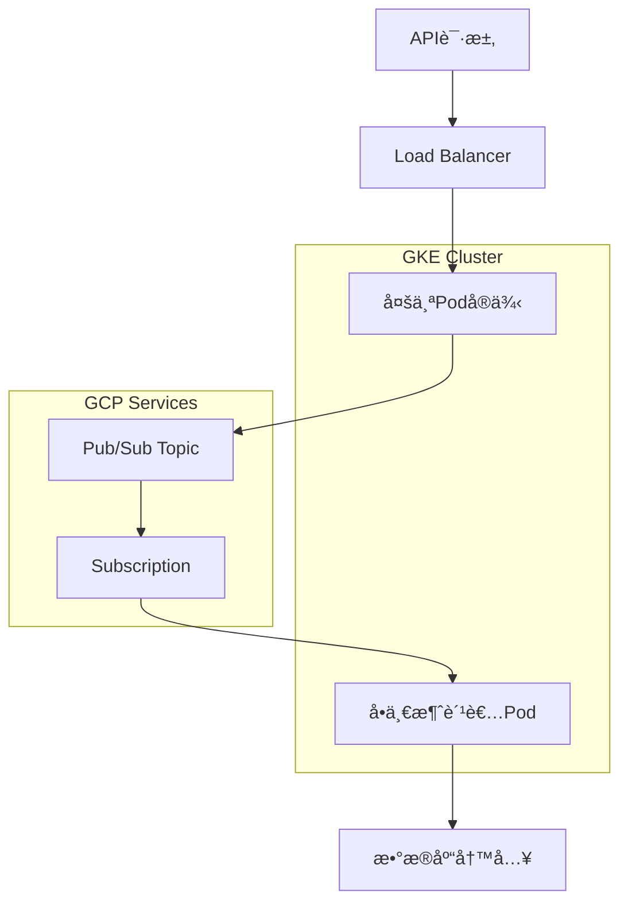
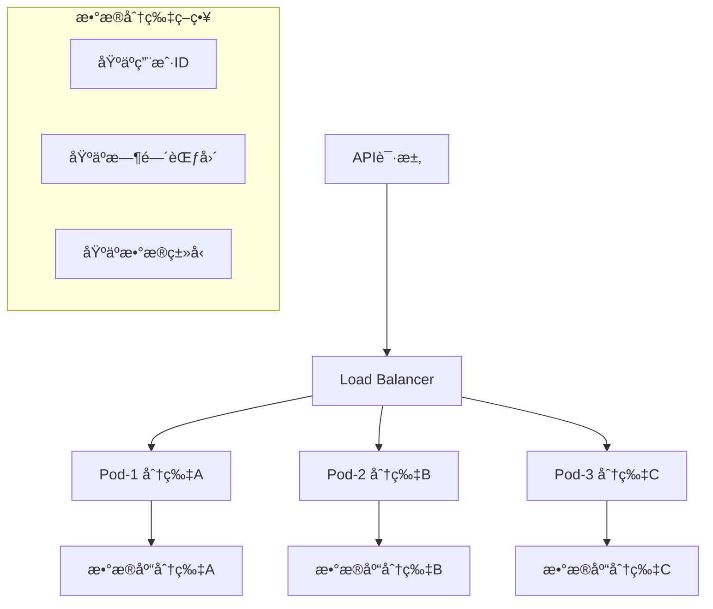
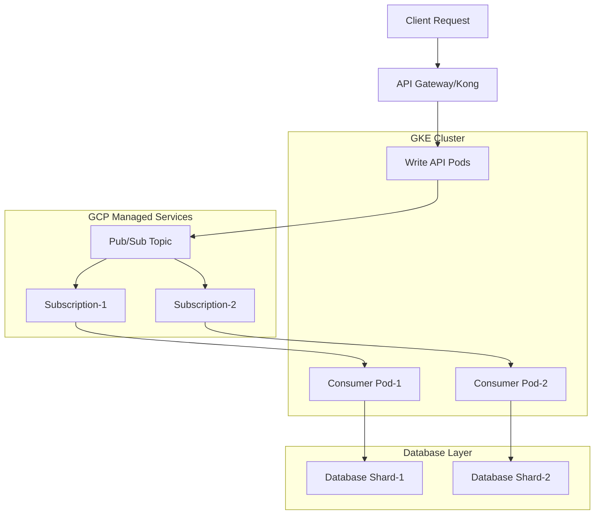
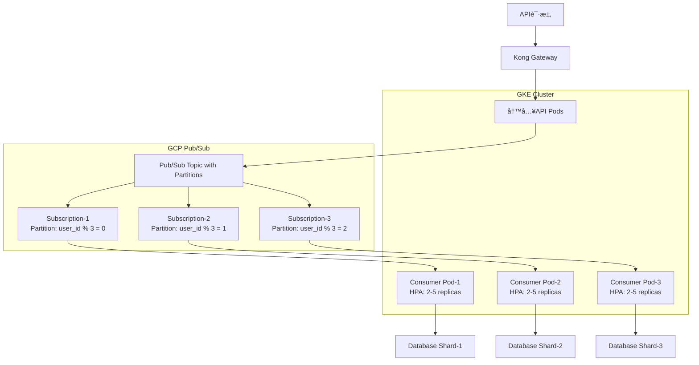
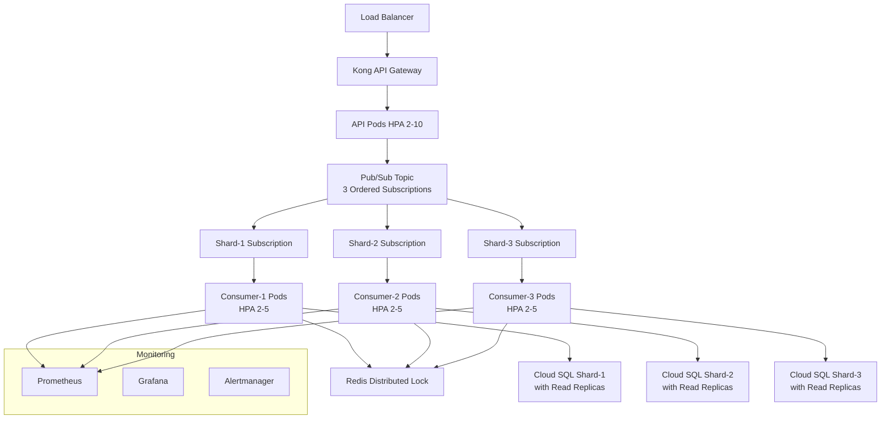
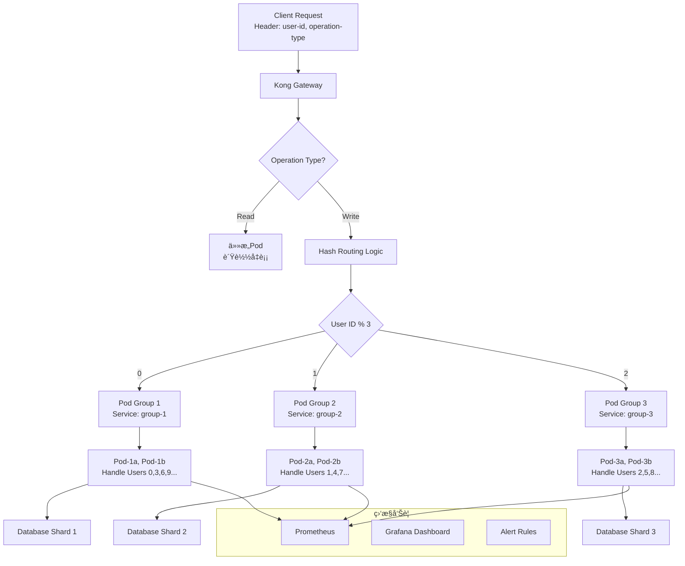
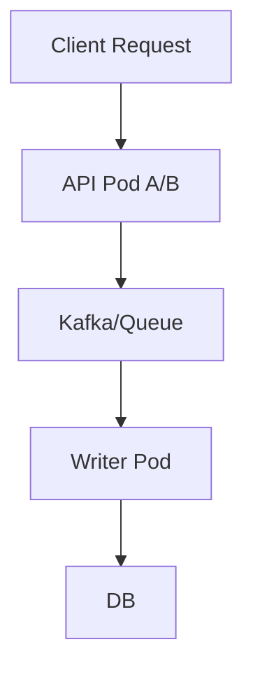
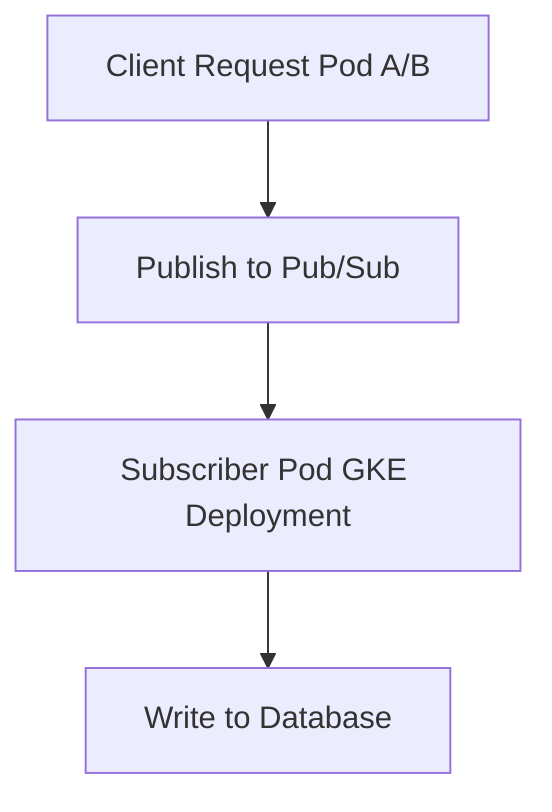
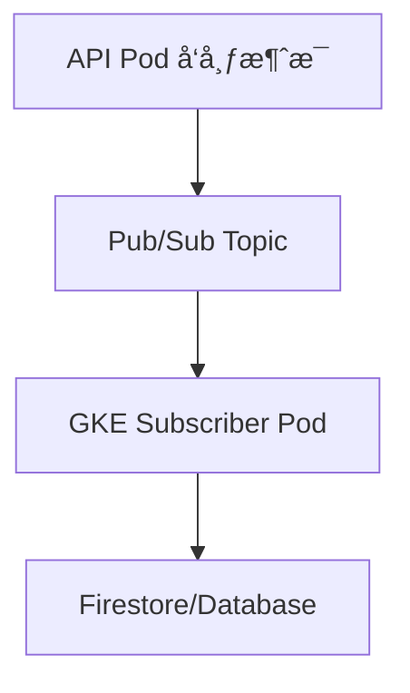

- [Claude4](#claude4)
  - [主è¦è§£å†³æ–¹æ¡ˆ](#主è¦è§£å†³æ–¹æ¡ˆ)
    - [1. é˜Ÿåˆ—æ¨¡å¼ (使用 Pub/Sub)](#1-队列模å¼-使用-pubsub)
    - [2. 主ä»æ¨¡å¼ (Leader Election)](#2-主ä»æ¨¡å¼-leader-election)
    - [3. 分片写入模å¼](#3-分片写入模å¼)
    - [4. 事务é”机制](#4-事务é”机制)
    - [5. 使用 StatefulSet + PVC](#5-使用-statefulset--pvc)
  - [æ¨èæ¶æ„组åˆ](#æ¨èæ¶æ„组åˆ)
    - [Pub/Sub + æ¶ˆè´¹è€…æ¨¡å¼ (最æ¨è)](#pubsub--消费者模å¼-最æ¨è)
    - [å®ç°ç¤ºä¾‹](#å®ç°ç¤ºä¾‹)
  - [方案对比表](#方案对比表)
  - [改进的队列模å¼æ¶æ„](#改进的队列模å¼æ¶æ„)
    - [1. 多消费者 + 分区处ç†](#1-多消费者--分区处ç†)
    - [2. 基äºæ¶ˆæ¯å±æ€§çš„分区策略](#2-基äºæ¶ˆæ¯å±æ€§çš„分区策略)
    - [3. 消费者高å¯ç”¨é…ç½®](#3-消费者高å¯ç”¨é…ç½®)
    - [4. 改进的消费者逻辑](#4-改进的消费者逻辑)
    - [5. 分布å¼é”å®ç° (使用 Redis)](#5-分布å¼é”å®ç°-使用-redis)
  - [完整的高å¯ç”¨æ¶æ„](#完整的高å¯ç”¨æ¶æ„)
  - [æ•…éšœæ¢å¤æœºåˆ¶](#æ•…éšœæ¢å¤æœºåˆ¶)
  - [1. åŸºäº Session Affinity (最简å•)](#1-基äº-session-affinity-最简å•)
    - [Kubernetes Service é…ç½®](#kubernetes-service-é…ç½®)
  - [2. 使用 Kong å®ç°ç²¾ç¡®æµé‡æ§åˆ¶](#2-使用-kong-å®ç°ç²¾ç¡®æµé‡æ§åˆ¶)
    - [Kong æ’件é…ç½®](#kong-æ’件é…ç½®)
    - [自定义 Kong æ’件å®ç°](#自定义-kong-æ’件å®ç°)
  - [3. 使用 Istio Service Mesh](#3-使用-istio-service-mesh)
    - [DestinationRule é…ç½®](#destinationrule-é…ç½®)
    - [VirtualService é…ç½®](#virtualservice-é…ç½®)
  - [4. 应用层负载å‡è¡¡æ§åˆ¶](#4-应用层负载å‡è¡¡æ§åˆ¶)
    - [自定义负载å‡è¡¡å™¨](#自定义负载å‡è¡¡å™¨)
  - [5. åŸºäº Deployment Label 的精确æ§åˆ¶](#5-基äº-deployment-label-的精确æ§åˆ¶)
    - [创建带标签的 Deployment](#创建带标签的-deployment)
    - [对应的多个 Service](#对应的多个-service)
  - [6. 完整的æµé‡æ§åˆ¶æ¶æ„](#6-完整的æµé‡æ§åˆ¶æ¶æ„)
  - [å®ç°å»ºè®®ä¼˜å…ˆçº§](#å®ç°å»ºè®®ä¼˜å…ˆçº§)
- [ChatGPT](#chatgpt)
- [Pod A æˆåŠŸæ‹¿åˆ° Redis é”åæ‰èƒ½æ‰§è¡Œå†™æ“作](#pod-a-æˆåŠŸæ‹¿åˆ°-redis-é”åæ‰èƒ½æ‰§è¡Œå†™æ“作)
  - [**✅ 使用 Pub/Sub çš„ä¼˜åŠ¿ï¼ˆç‰¹åˆ«é€‚ç”¨äº GKE）**](#-使用-pubsub-的优势特别适用äº-gke)
  - [**📌 æ¨èæ¶æ„模å¼ï¼šPub/Sub + Worker 写入 DB**](#-æ¨èæ¶æ„模å¼pubsub--worker-写入-db)
    - [**说æ˜ï¼š**](#说æ˜)
  - [**🔧 å®ç°å»ºè®®**](#-å®ç°å»ºè®®)
    - [**1.** ](#1)
    - [**Producer 端（GKE API Pod）**](#producer-端gke-api-pod)
    - [**2.** ](#2)
    - [**Consumer 端（独立 GKE Worker 或 Cloud Run）**](#consumer-端独立-gke-worker-或-cloud-run)
  - [**🧱 å¯é€‰å¢å¼ºç»„件**](#-å¯é€‰å¢å¼ºç»„件)
  - [**✅ 总结：为什么 Pub/Sub + GKE 是一个é常好的选择？**](#-总结为什么-pubsub--gke-是一个é常好的选择)
  - [**🔧 å‰æ**](#-å‰æ)
  - [**1. Python 消费脚本（subscriber.py）**](#1-python-消费脚本subscriberpy)
  - [**2. Dockerfile**](#2-dockerfile)
  - [**3. GKE Deployment 示例（subscriber-deployment.yaml）**](#3-gke-deployment-示例subscriber-deploymentyaml)
  - [**4. å¯é€‰ HPA é…置（按 CPU 或自定义指标）**](#4-å¯é€‰-hpa-é…置按-cpu-或自定义指标)
  - [**5. Pub/Sub Subscription 创建（命令）**](#5-pubsub-subscription-创建命令)
  - [**✅ 总结**](#-总结)


# Claude4

对äºå¤š Pod åŒæ—¶å†™æ•°æ®å¯èƒ½å¼•èµ·å†²çªçš„问题，有多ç§è§£å†³æ–¹æ¡ˆã€‚以下是常è§çš„几ç§æ¶æ„模å¼ï¼š

## 主è¦è§£å†³æ–¹æ¡ˆ

### 1. é˜Ÿåˆ—æ¨¡å¼ (使用 Pub/Sub)

```yaml
# deployment.yaml
apiVersion: apps/v1
kind: Deployment
metadata:
  name: data-writer
spec:
  replicas: 3
  selector:
    matchLabels:
      app: data-writer
  template:
    spec:
      containers:
        - name: writer
          image: your-app:latest
          env:
            - name: PUBSUB_SUBSCRIPTION
              value: "data-write-subscription"
```



### 2. 主ä»æ¨¡å¼ (Leader Election)

```yaml
# leader-election-deployment.yaml
apiVersion: apps/v1
kind: Deployment
metadata:
  name: writer-with-leader
spec:
  replicas: 3
  template:
    spec:
      containers:
        - name: writer
          image: your-app:latest
          env:
            - name: LEADER_ELECTION_NAMESPACE
              value: "default"
            - name: LEADER_ELECTION_NAME
              value: "data-writer-leader"
```

```go
// 示例代ç ï¼šKubernetes Leader Election
import (
    "k8s.io/client-go/tools/leaderelection"
    "k8s.io/client-go/tools/leaderelection/resourcelock"
)

func startLeaderElection() {
    lock := &resourcelock.LeaseLock{
        LeaseMeta: metav1.ObjectMeta{
            Name:      "data-writer-leader",
            Namespace: "default",
        },
    }

    leaderelection.RunOrDie(ctx, leaderelection.LeaderElectionConfig{
        Lock:          lock,
        LeaseDuration: 15 * time.Second,
        RenewDeadline: 10 * time.Second,
        RetryPeriod:   2 * time.Second,
        Callbacks: leaderelection.LeaderCallbacks{
            OnStartedLeading: func(ctx context.Context) {
                // 开始处ç†å†™æ“作
                startWriteOperations()
            },
            OnStoppedLeading: func() {
                // åœæ­¢å†™æ“作
                stopWriteOperations()
            },
        },
    })
}
```

### 3. 分片写入模å¼



### 4. 事务é”机制

```sql
-- æ•°æ®åº“层é¢çš„é”机制
BEGIN TRANSACTION;

-- è·å–è¡Œé”或表é”
SELECT * FROM data_table WHERE id = ? FOR UPDATE;

-- 执行写æ“作
UPDATE data_table SET value = ? WHERE id = ?;

COMMIT;
```

### 5. 使用 StatefulSet + PVC

```yaml
# statefulset.yaml
apiVersion: apps/v1
kind: StatefulSet
metadata:
  name: data-writer
spec:
  serviceName: "data-writer"
  replicas: 3
  template:
    spec:
      containers:
        - name: writer
          image: your-app:latest
          volumeMounts:
            - name: data-storage
              mountPath: /data
  volumeClaimTemplates:
    - metadata:
        name: data-storage
      spec:
        accessModes: ["ReadWriteOnce"]
        resources:
          requests:
            storage: 10Gi
```

## æ¨èæ¶æ„组åˆ

### Pub/Sub + æ¶ˆè´¹è€…æ¨¡å¼ (最æ¨è)



### å®ç°ç¤ºä¾‹

```go
// Producer (API Pod)
func writeDataHandler(w http.ResponseWriter, r *http.Request) {
    data := extractDataFromRequest(r)

    // å‘é€åˆ° Pub/Sub 而ä¸æ˜¯ç›´æ¥å†™æ•°æ®åº“
    message := &pubsub.Message{
        Data: json.Marshal(data),
        Attributes: map[string]string{
            "operation": "insert",
            "timestamp": time.Now().Format(time.RFC3339),
        },
    }

    result := topic.Publish(ctx, message)
    if _, err := result.Get(ctx); err != nil {
        http.Error(w, "Failed to publish message", 500)
        return
    }

    w.WriteHeader(http.StatusAccepted)
    json.NewEncoder(w).Encode(map[string]string{"status": "queued"})
}

// Consumer (Background Worker Pod)
func startConsumer() {
    subscription.Receive(ctx, func(ctx context.Context, msg *pubsub.Message) {
        var data DataStruct
        if err := json.Unmarshal(msg.Data, &data); err != nil {
            msg.Nack()
            return
        }

        // 串行化写入数æ®åº“
        if err := writeToDatabase(data); err != nil {
            msg.Nack()
            return
        }

        msg.Ack()
    })
}
```

## 方案对比表

| 方案            | 高å¯ç”¨æ€§ | æ•°æ®ä¸€è‡´æ€§ | å¤æ‚度 | 性能  | 适用场景     |
| --------------- | -------- | ---------- | ------ | ----- | ------------ |
| Pub/Sub 队列    | ✅ 高    | ✅ 强      | 🟡 中  | ✅ 高 | 异步写入场景 |
| Leader Election | ✅ 高    | ✅ 强      | 🟡 中  | 🔴 ä½ | 简å•å†™å…¥åœºæ™¯ |
| æ•°æ®åˆ†ç‰‡        | ✅ 高    | ✅ 强      | 🔴 高  | ✅ 高 | 大数æ®é‡åœºæ™¯ |
| æ•°æ®åº“é”        | 🟡 中    | ✅ 强      | 🟢 ä½  | 🔴 ä½ | å°å¹¶å‘场景   |
| StatefulSet     | 🟡 中    | ✅ 强      | 🟡 中  | 🟡 中 | 有状æ€åº”用   |

对äºç”Ÿäº§ç¯å¢ƒï¼Œ**æ¨è使用 Pub/Sub + 消费者模å¼**，既ä¿è¯äº†é«˜å¯ç”¨æ€§ï¼Œåˆé¿å…了数æ®å†²çªï¼ŒåŒæ—¶ä¿æŒäº†è‰¯å¥½çš„性能和扩展性。

ç¡®å®ï¼Œå•ä¸€æ¶ˆè´¹è€… Pod ä»ç„¶æ˜¯å•ç‚¹é—®é¢˜ï¼è¿™æ˜¯ä¸ªå¾ˆå¥½çš„观察。让我é‡æ–°è®¾è®¡æ›´å®Œå–„的方案：

## 改进的队列模å¼æ¶æ„

### 1. 多消费者 + 分区处ç†



### 2. 基äºæ¶ˆæ¯å±æ€§çš„分区策略

```go
// Producer: å‘é€å¸¦åˆ†åŒºé”®çš„消æ¯
func publishMessage(data WriteRequest) error {
    // 基äºä¸šåŠ¡é€»è¾‘确定分区键
    partitionKey := generatePartitionKey(data)

    message := &pubsub.Message{
        Data: json.Marshal(data),
        Attributes: map[string]string{
            "partition_key": partitionKey,
            "message_type": data.Type,
            "timestamp":    time.Now().Format(time.RFC3339),
        },
        OrderingKey: partitionKey, // ç¡®ä¿åŒä¸€åˆ†åŒºçš„消æ¯æœ‰åº
    }

    result := topic.Publish(ctx, message)
    return result.Get(ctx)
}

func generatePartitionKey(data WriteRequest) string {
    switch data.Type {
    case "user_data":
        return fmt.Sprintf("user_%d", data.UserID%3)
    case "order_data":
        return fmt.Sprintf("order_%s", data.OrderID[:2])
    default:
        return fmt.Sprintf("default_%d", time.Now().Unix()%3)
    }
}
```

### 3. 消费者高å¯ç”¨é…ç½®

```yaml
# consumer-deployment.yaml
apiVersion: apps/v1
kind: Deployment
metadata:
  name: data-consumer-shard-1
spec:
  replicas: 2 # 最少2个副本
  selector:
    matchLabels:
      app: data-consumer
      shard: "1"
  template:
    metadata:
      labels:
        app: data-consumer
        shard: "1"
    spec:
      containers:
        - name: consumer
          image: your-consumer:latest
          env:
            - name: SUBSCRIPTION_NAME
              value: "data-write-subscription-shard-1"
            - name: SHARD_ID
              value: "1"
            - name: MAX_CONCURRENT_HANDLERS
              value: "10"
          resources:
            requests:
              cpu: 100m
              memory: 128Mi
            limits:
              cpu: 500m
              memory: 512Mi
          livenessProbe:
            httpGet:
              path: /health
              port: 8080
            initialDelaySeconds: 30
            periodSeconds: 10
          readinessProbe:
            httpGet:
              path: /ready
              port: 8080
            initialDelaySeconds: 5
            periodSeconds: 5
---
apiVersion: autoscaling/v2
kind: HorizontalPodAutoscaler
metadata:
  name: consumer-shard-1-hpa
spec:
  scaleTargetRef:
    apiVersion: apps/v1
    kind: Deployment
    name: data-consumer-shard-1
  minReplicas: 2
  maxReplicas: 10
  metrics:
    - type: Resource
      resource:
        name: cpu
        target:
          type: Utilization
          averageUtilization: 70
    - type: Pods
      pods:
        metric:
          name: pubsub_subscription_num_undelivered_messages
        target:
          type: AverageValue
          averageValue: "100"
```

### 4. 改进的消费者逻辑

```go
// 支æŒå¤šå®ä¾‹çš„消费者
func startConsumer(shardID string) {
    subscriptionName := fmt.Sprintf("data-write-subscription-shard-%s", shardID)

    // é…置并å‘æ¥æ”¶
    subscription := client.Subscription(subscriptionName)
    subscription.ReceiveSettings.MaxConcurrentHandlers = 10
    subscription.ReceiveSettings.MaxOutstandingMessages = 100

    // å¯åŠ¨å¤šä¸ªgoroutine处ç†æ¶ˆæ¯
    for i := 0; i < runtime.NumCPU(); i++ {
        go func(workerID int) {
            subscription.Receive(ctx, func(ctx context.Context, msg *pubsub.Message) {
                handleMessage(msg, shardID, workerID)
            })
        }(i)
    }
}

func handleMessage(msg *pubsub.Message, shardID string, workerID int) {
    // 添加分布å¼é”防止é‡å¤å¤„ç†
    lockKey := fmt.Sprintf("msg_lock_%s", msg.ID)

    if !acquireDistributedLock(lockKey, 30*time.Second) {
        log.Printf("Message %s already being processed", msg.ID)
        msg.Ack() // 已被其他å®ä¾‹å¤„ç†
        return
    }
    defer releaseDistributedLock(lockKey)

    // 幂等性检查
    if isMessageProcessed(msg.ID) {
        log.Printf("Message %s already processed", msg.ID)
        msg.Ack()
        return
    }

    // 处ç†æ¶ˆæ¯
    var data WriteRequest
    if err := json.Unmarshal(msg.Data, &data); err != nil {
        log.Printf("Failed to unmarshal message: %v", err)
        msg.Nack()
        return
    }

    // 写入数æ®åº“
    if err := writeToDatabase(data, shardID); err != nil {
        log.Printf("Failed to write to database: %v", err)
        msg.Nack()
        return
    }

    // 标记消æ¯å·²å¤„ç†
    markMessageProcessed(msg.ID)
    msg.Ack()
}
```

### 5. 分布å¼é”å®ç° (使用 Redis)

```go
// 使用Rediså®ç°åˆ†å¸ƒå¼é”
func acquireDistributedLock(key string, expiration time.Duration) bool {
    lockValue := generateUniqueID()

    result := redisClient.SetNX(ctx, key, lockValue, expiration)
    if result.Err() != nil {
        return false
    }

    return result.Val()
}

func releaseDistributedLock(key string) {
    // 使用Lua脚本确ä¿åŸå­æ€§
    script := `
        if redis.call("get", KEYS[1]) == ARGV[1] then
            return redis.call("del", KEYS[1])
        else
            return 0
        end
    `
    redisClient.Eval(ctx, script, []string{key}, lockValue)
}
```

## 完整的高å¯ç”¨æ¶æ„



## æ•…éšœæ¢å¤æœºåˆ¶

| 故障场景                 | 解决方案                     | æ¢å¤æ—¶é—´ |
| ------------------------ | ---------------------------- | -------- |
| å•ä¸ª Consumer Pod æ•…éšœ   | HPA 自动扩容 + 其他 Pod æ¥ç®¡ | < 30 秒  |
| 整个 Shard Consumer æ•…éšœ | 消æ¯å †ç§¯ + å‘Šè­¦ + 手动介入   | < 5 分钟 |
| Pub/Sub 故障             | GCP 自动故障转移             | < 1 分钟 |
| æ•°æ®åº“ Shard æ•…éšœ        | Read Replica æå‡ä¸º Master   | < 2 分钟 |
| Redis é”æœåŠ¡æ•…éšœ         | é™çº§ä¸ºæ— é”æ¨¡å¼ + 幂等性ä¿è¯  | ç«‹å³     |

这样设计就消除了å•ç‚¹æ•…障，åŒæ—¶ä¿è¯äº†æ•°æ®ä¸€è‡´æ€§å’Œé«˜å¯ç”¨æ€§ã€‚æ¯ä¸ªç»„件都有冗余，整个系统具备自愈能力。

å¯ä»¥ï¼æœ‰å¤šç§æ–¹å¼åœ¨ç”Ÿäº§ç¯å¢ƒä¸­æ§åˆ¶æµé‡åªè·¯ç”±åˆ°ç‰¹å®š Pod。以下是几ç§å®ç°æ–¹æ¡ˆï¼š

## 1. åŸºäº Session Affinity (最简å•)

### Kubernetes Service é…ç½®

```yaml
# service-with-affinity.yaml
apiVersion: v1
kind: Service
metadata:
  name: data-writer-service
spec:
  selector:
    app: data-writer
  ports:
    - port: 80
      targetPort: 8080
  sessionAffinity: ClientIP # 基äºå®¢æˆ·ç«¯IP的会è¯äº²å’Œæ€§
  sessionAffinityConfig:
    clientIP:
      timeoutSeconds: 3600 # 1å°æ—¶å†…åŒä¸€IP路由到åŒä¸€Pod
```

## 2. 使用 Kong å®ç°ç²¾ç¡®æµé‡æ§åˆ¶

### Kong æ’件é…ç½®

```yaml
# kong-consumer-groups.yaml
apiVersion: configuration.konghq.com/v1
kind: KongPlugin
metadata:
  name: upstream-routing
plugin: request-transformer
config:
  add:
    headers:
      - "X-Target-Pod:$(headers.user-id | hash % pod-count)"
---
apiVersion: configuration.konghq.com/v1
kind: KongIngress
metadata:
  name: pod-routing
upstream:
  algorithm: consistent-hashing
  hash_on: header
  hash_on_header: X-Target-Pod
```

### 自定义 Kong æ’件å®ç°

```lua
-- kong-pod-router.lua
local kong = kong
local ngx = ngx

local function route_to_specific_pod()
    local user_id = kong.request.get_header("user-id")
    local operation_type = kong.request.get_header("operation-type")

    if operation_type == "write" and user_id then
        -- 基äºç”¨æˆ·ID计算目标Pod
        local pod_index = tonumber(user_id) % 3 + 1
        kong.service.request.set_header("X-Target-Pod", "pod-" .. pod_index)
    end
end

return {
    PRIORITY = 1000,
    VERSION = "1.0.0",
    access = route_to_specific_pod
}
```

## 3. 使用 Istio Service Mesh

### DestinationRule é…ç½®

```yaml
# istio-destination-rule.yaml
apiVersion: networking.istio.io/v1beta1
kind: DestinationRule
metadata:
  name: data-writer-dr
spec:
  host: data-writer-service
  subsets:
    - name: pod-1
      labels:
        pod-index: "1"
    - name: pod-2
      labels:
        pod-index: "2"
    - name: pod-3
      labels:
        pod-index: "3"
  trafficPolicy:
    consistentHash:
      httpHeaderName: "user-id"
```

### VirtualService é…ç½®

```yaml
# istio-virtual-service.yaml
apiVersion: networking.istio.io/v1beta1
kind: VirtualService
metadata:
  name: data-writer-vs
spec:
  hosts:
    - data-writer-service
  http:
    - match:
        - headers:
            operation-type:
              exact: "write"
            user-id:
              regex: ".*[0369]$" # 用户ID末ä½ä¸º0,3,6,9
      route:
        - destination:
            host: data-writer-service
            subset: pod-1
    - match:
        - headers:
            operation-type:
              exact: "write"
            user-id:
              regex: ".*[147]$" # 用户ID末ä½ä¸º1,4,7
      route:
        - destination:
            host: data-writer-service
            subset: pod-2
    - match:
        - headers:
            operation-type:
              exact: "write"
            user-id:
              regex: ".*[258]$" # 用户ID末ä½ä¸º2,5,8
      route:
        - destination:
            host: data-writer-service
            subset: pod-3
    - route: # 默认路由
        - destination:
            host: data-writer-service
```

## 4. 应用层负载å‡è¡¡æ§åˆ¶

### 自定义负载å‡è¡¡å™¨

```go
// custom-lb-controller.go
package main

type PodRouter struct {
    podEndpoints map[string][]string
    hashRing     *consistent.Consistent
}

func (pr *PodRouter) RouteRequest(userID string, operationType string) string {
    if operationType == "write" {
        // 写æ“作路由到特定Pod
        return pr.getConsistentPod(userID)
    }
    // 读æ“作å¯ä»¥è·¯ç”±åˆ°ä»»æ„Pod
    return pr.getRandomPod()
}

func (pr *PodRouter) getConsistentPod(key string) string {
    node, err := pr.hashRing.Get(key)
    if err != nil {
        return pr.getRandomPod()
    }
    return node
}

// HTTP代ç†å®ç°
func proxyHandler(w http.ResponseWriter, r *http.Request) {
    userID := r.Header.Get("User-ID")
    operationType := r.Header.Get("Operation-Type")

    targetPod := router.RouteRequest(userID, operationType)

    // 创建åå‘代ç†
    target, _ := url.Parse(fmt.Sprintf("http://%s", targetPod))
    proxy := httputil.NewSingleHostReverseProxy(target)

    // 添加路由信æ¯åˆ°Header
    r.Header.Set("X-Routed-To", targetPod)

    proxy.ServeHTTP(w, r)
}
```

## 5. åŸºäº Deployment Label 的精确æ§åˆ¶

### 创建带标签的 Deployment

```yaml
# labeled-deployments.yaml
apiVersion: apps/v1
kind: Deployment
metadata:
  name: data-writer-pod-1
spec:
  replicas: 2
  selector:
    matchLabels:
      app: data-writer
      pod-group: "group-1"
  template:
    metadata:
      labels:
        app: data-writer
        pod-group: "group-1"
        pod-index: "1"
    spec:
      containers:
        - name: writer
          image: your-app:latest
          env:
            - name: POD_GROUP
              value: "group-1"
            - name: HANDLED_USER_RANGE
              value: "0-999"
---
apiVersion: apps/v1
kind: Deployment
metadata:
  name: data-writer-pod-2
spec:
  replicas: 2
  selector:
    matchLabels:
      app: data-writer
      pod-group: "group-2"
  template:
    metadata:
      labels:
        app: data-writer
        pod-group: "group-2"
        pod-index: "2"
    spec:
      containers:
        - name: writer
          image: your-app:latest
          env:
            - name: POD_GROUP
              value: "group-2"
            - name: HANDLED_USER_RANGE
              value: "1000-1999"
```

### 对应的多个 Service

```yaml
# group-specific-services.yaml
apiVersion: v1
kind: Service
metadata:
  name: data-writer-group-1
spec:
  selector:
    app: data-writer
    pod-group: "group-1"
  ports:
    - port: 80
      targetPort: 8080
---
apiVersion: v1
kind: Service
metadata:
  name: data-writer-group-2
spec:
  selector:
    app: data-writer
    pod-group: "group-2"
  ports:
    - port: 80
      targetPort: 8080
```

## 6. 完整的æµé‡æ§åˆ¶æ¶æ„



## å®ç°å»ºè®®ä¼˜å…ˆçº§

| 方案               | å¤æ‚度 | å¯é æ€§ | 性能  | 维护æˆæœ¬ | æ¨è场景          |
| ------------------ | ------ | ------ | ----- | -------- | ----------------- |
| Session Affinity   | 🟢 ä½  | 🟡 中  | 🟢 高 | 🟢 ä½    | 简å•åœºæ™¯          |
| Kong æ’件          | 🟡 中  | ✅ 高  | ✅ 高 | 🟡 中    | API 网关已用 Kong |
| Istio Service Mesh | 🔴 高  | ✅ 高  | ✅ 高 | 🔴 高    | å¾®æœåŠ¡æ¶æ„        |
| 应用层 LB          | 🟡 中  | ✅ 高  | 🟡 中 | 🟡 中    | 自定义需求        |
| 多 Service 分组    | 🟢 ä½  | ✅ 高  | ✅ 高 | 🟢 ä½    | **æ¨è PRD ç¯å¢ƒ** |

**对äºç”Ÿäº§ç¯å¢ƒï¼Œæ¨è使用"多 Service 分组"方案**，因为它简å•å¯é ï¼Œæ˜“äºç›‘æ§å’Œæ•…éšœæ’除，åŒæ—¶ä¿æŒäº†é«˜å¯ç”¨æ€§ã€‚

# ChatGPT

对äºè¿è¡Œåœ¨ PRD 生产ç¯å¢ƒçš„ GKE ,比如我们默认 HPA 最少 2 个 Pod.但是有这样业务逻辑,比如我的 Pod 里é¢æœ‰ä¸€ä¸ªå†™æ•°æ®åº“çš„ API, 那么如æœåŒæ—¶éƒ½è¿è¡Œçš„è¯.那么å¯èƒ½ä¼šå¼•èµ·å†™æ•°æ®æ··ä¹±?但是我这个仅仅是一个场景设想.å…¶å®æ ¸å¿ƒå°±æ˜¯å¤š Pod åŒæ—¶å†™æ•°æ®.带æ¥çš„æ•°æ®å¯èƒ½å†²çªçš„问题.对äºè¿™ç§åœºæ™¯.一般有什么对应的解决方案? 因为如æœæˆ‘åªè¿è¡Œä¸€ä¸ª Pod.那么 Pod 就没有高å¯ç”¨äº†

ä½ æ到的**多 Pod 高å¯ç”¨ä¸‹å†™æ•°æ®åº“引å‘æ•°æ®å†²çªçš„问题**，是生产ç¯å¢ƒä¸­å¸¸è§çš„设计难题。核心挑战是：**如何在ä¿æŒæ°´å¹³æ‰©å±•ï¼ˆå¤šå‰¯æœ¬ã€é«˜å¯ç”¨ï¼‰çš„åŒæ—¶ï¼Œç¡®ä¿å†™æ“作的数æ®ä¸€è‡´æ€§å’Œå¹‚等性**。

⸻

**💡 场景问题归纳**

• **多副本 Pod 写数æ®åº“**：å¯èƒ½å‡ºç°é‡å¤å†™å…¥ã€å†™é¡ºåºé”™è¯¯ã€èµ„æºç«äº‰ç­‰é—®é¢˜ã€‚

• **ä¸èƒ½åªè·‘一个 Pod**：å¦åˆ™å°±å¤±å»äº†å®¹ç¾èƒ½åŠ›ï¼ˆæ¯”如 HPAã€è‡ªåŠ¨ failover）。

• **å…¸å‹ä¸šåŠ¡åœºæ™¯**：

• 创建订å•ï¼ˆä¸èƒ½é‡å¤ï¼‰

• 更新库存（ä¸èƒ½å‡ºç°ç«æ€ï¼‰

• 写入日志（è¦æ±‚æ—¶åºã€å¹‚等）

⸻

**✅ 解决方案概览**

| 方案类别           | 具体方案                     | 适用场景                         |
| ------------------ | ---------------------------- | -------------------------------- |
| æ•°æ®åº“层æ§åˆ¶       | ä¹è§‚é”ã€æ‚²è§‚é”               | å•è¡¨å¹¶å‘写较高ã€æ›´æ–°å†²çªå¯èƒ½æ€§å¤§ |
| 应用层æ§åˆ¶         | 幂等性设计ã€å…¨å±€é”ã€å¹‚ç­‰ Key | REST API æ¥å£ã€é¿å…é‡å¤å†™å…¥      |
| 分布å¼å调机制     | leader election / 分布å¼é”   | Kafka 消费ã€å®šæ—¶ä»»åŠ¡ã€åºåˆ—生æˆç­‰ |
| æ•°æ®ä¸€è‡´æ€§æ¶æ„优化 | 使用消æ¯é˜Ÿåˆ—ã€Saga/è¡¥å¿æœºåˆ¶  | 异步写æ“作ã€å¾®æœåŠ¡äº‹åŠ¡           |
| Kubernetes æ§åˆ¶    | podAffinityã€HPA tuningã€PDB | 强制åŒä¸€ä»»åŠ¡åªç”±ä¸€ä¸ª Pod 执行    |

⸻

**🯠典å‹è®¾è®¡æ–¹æ¡ˆè¯´æ˜**

**1. 幂等性设计（强烈æ¨è）**

**适用：** 多 Pod 对åŒä¸€ä¸ªå†™æ¥å£å‘请求，但希望写入唯一记录或é¿å…é‡å¤ã€‚

**æ–¹å¼ï¼š**

• 为æ¯ä¸ªå†™è¯·æ±‚设置 **唯一幂等 Key（idempotent key）**（如 UUIDã€è®¢å•å·ï¼‰

• 在数æ®åº“加唯一约æŸï¼Œå†™å¤±è´¥æ—¶è¿”å›é‡å¤é”™è¯¯

• æ¥å£è¿”å›å·²å†™å…¥è®°å½•ï¼ˆä¸é‡è¯•ï¼‰

-- 以订å•åˆ›å»ºä¸ºä¾‹

```sql
CREATE TABLE orders (
order_id VARCHAR PRIMARY KEY,
user_id VARCHAR,
product_id VARCHAR,
created_at TIMESTAMP DEFAULT now()
);
```

```java
// æ¥å£ä¼ªä»£ç 
if (db.exists(order_id)) {
return db.get(order_id);
} else {
db.insert(order);
return order;
}

```

⸻

**2. 基äºæ•°æ®åº“的悲观é”/ä¹è§‚é”**

**适用：** 并å‘写入相åŒæ•°æ®è®°å½•æ—¶ï¼Œè¦æ±‚严格一致性。

• **悲观é”**：SELECT ... FOR UPDATE，é¿å…并å‘æ›´æ–°

• **ä¹è§‚é”**：加 version 字段，更新时版本对比，ä¸ä¸€è‡´åˆ™å¤±è´¥é‡è¯•

-- ä¹è§‚é”示例

```sql
UPDATE inventory
SET stock = stock - 1, version = version + 1
WHERE product_id = '123' AND version = 10;
```

⸻

**3. 引入分布å¼é”（如 Redisã€etcd）**

**适用：** 任务必须串行执行（例如定时任务ã€å”¯ä¸€å¤„ç†å™¨ï¼‰

• 多 Pod åŒæ—¶è¿è¡Œï¼Œä½†æŸä¸€ç±»å†™ä»»åŠ¡é€šè¿‡ **é”åè°ƒåªç”±ä¸€ä¸ª Pod 执行**

• å¯ä½¿ç”¨ Redlock（Redis 分布å¼é”）ã€K8S leader election

# Pod A æˆåŠŸæ‹¿åˆ° Redis é”åæ‰èƒ½æ‰§è¡Œå†™æ“作

SETNX lock:write:job "pod-a" EX 10

⸻

**4. Leader Election + 任务隔离**

**适用：** 定时写任务ã€æ‰¹é‡å¤„ç†ã€å¯¼å…¥æ•°æ®ç­‰ä»»åŠ¡

• 在多 Pod 中选出“Leaderâ€æ¥æ‰§è¡Œæ•æ„Ÿå†™å…¥

• Kubernetes 中å¯ç”¨ ConfigMap 或第三方组件（如 [kube-leader-elector](https://github.com/kubernetes-client/python/blob/master/examples/leader_election.py)）
```yaml
affinity:
  podAntiAffinity:
    preferredDuringSchedulingIgnoredDuringExecution:
      - podAffinityTerm:
          labelSelector:
            matchLabels:
              app: db-writer
          topologyKey: "kubernetes.io/hostname"
```
⸻

**5. 通过异步队列å®ç°ä¸²è¡Œå†™å…¥**

**适用：** 高并å‘场景，例如订å•ã€æ”¯ä»˜ç­‰

• 多 Pod æ¥æ”¶è¯·æ±‚，写入 Kafkaã€Pub/Sub 等队列

• 独立的 Consumer Pod 按顺åºæ¶ˆè´¹å†™å…¥æ•°æ®åº“（å¯é…åˆå¹‚等性）



⸻

**✅ 最佳å®è·µå»ºè®®ï¼ˆç”Ÿäº§ï¼‰**

1. **优先使用幂等性设计**：设计æ¥å£æ—¶å°±è€ƒè™‘é‡å¤è¯·æ±‚/é‡å¤å†™çš„å»é‡é€»è¾‘

2. **æ•æ„Ÿé€»è¾‘å•ç‹¬æœåŠ¡åŒ–**：比如写订å•çš„æœåŠ¡éš”离，é¿å…公共逻辑影å“

3. **任务写入通过队列串行化**：消æ¯é˜Ÿåˆ—å¯è§£è€¦+高å¯ç”¨

4. **é¿å…åªé å• Pod 执行**：失å»äº† Kubernetes 高å¯ç”¨èƒ½åŠ›

5. **监æ§å†²çªé”™è¯¯ä¸é”ç«äº‰**：确ä¿å†™å…¥ä¸ä¼š silently fail

⸻

如你希望我根æ®ä½ å…·ä½“业务场景（比如 Java 或 Spring Boot）进一步细化设计，我å¯ä»¥å¸®ä½ å‡ºå…·ä½“模æ¿æˆ–å®ç°ç¤ºä¾‹ã€‚是å¦éœ€è¦ï¼Ÿ

是的，**在 GKE 中结åˆä½¿ç”¨ Google Cloud Pub/Sub 是处ç†å¤š Pod 写数æ®åº“冲çªã€å®ç°é«˜å¹¶å‘安全写入的æ佳解决方案之一**，特别适åˆä»¥ä¸‹åœºæ™¯ï¼š

---

## **✅ 使用 Pub/Sub çš„ä¼˜åŠ¿ï¼ˆç‰¹åˆ«é€‚ç”¨äº GKE）**

| **优势**                                | **说æ˜**                                                 |
| --------------------------------------- | -------------------------------------------------------- |
| **天然解耦**                            | GKE 中多个 Pod å¯ä»¥å¹¶å‘å‘布消æ¯ï¼Œä¸éœ€è¦ç›´æ¥å†™æ•°æ®åº“      |
| **高å¯ç”¨ + 高扩展**                     | Pub/Sub 是托管æœåŠ¡ï¼Œæ”¯æŒæ°´å¹³æ‰©å±•ï¼Œä¸æ˜“æˆä¸ºç“¶é¢ˆ           |
| **幂等写入更易å®ç°**                    | 使用 messageId 或业务自定义 deduplication key åšå¹‚ç­‰å»é‡ |
| **æŒä¹…化ä¿éšœ**                          | 消æ¯é»˜è®¤å­˜å‚¨ 7 天，é¿å…ç¬æ—¶ç³»ç»Ÿå¼‚å¸¸ä¸¢æ•°æ®                |
| **ä¸ GKE/GCS/Cloud Functions 集æˆç´§å¯†** | ä½ å¯ä»¥ç”¨ Cloud Run / GKE çš„åå°è®¢é˜…写逻辑                |

---

## **📌 æ¨èæ¶æ„模å¼ï¼šPub/Sub + Worker 写入 DB**



### **说æ˜ï¼š**

- Client 请求由多个 GKE Pod 处ç†ï¼Œå‘布写入任务到 Pub/Sub（é¿å…ç›´æ¥å†™ DB）
- 独立的 Subscriber Deployment（å¯ä»¥æœ‰å¤šä¸ª Pod）消费消æ¯ï¼Œé¡ºåºæˆ–并å‘写入 DB
- å¯åœ¨ Subscriber 中加入幂等性校验逻辑ã€é‡è¯•æœºåˆ¶ã€æ­»ä¿¡é˜Ÿåˆ—处ç†

---

## **🔧 å®ç°å»ºè®®**

### **1.** 

### **Producer 端（GKE API Pod）**

```
# 示例: 将订å•å†™å…¥ pub/sub
publisher = pubsub_v1.PublisherClient()
topic_path = publisher.topic_path('your-project-id', 'order-topic')
data = json.dumps(order_payload).encode("utf-8")
future = publisher.publish(topic_path, data, order_id="123456")
```

### **2.** 

### **Consumer 端（独立 GKE Worker 或 Cloud Run）**

```
# 示例: æ¥æ”¶è®¢é˜…消æ¯å¹¶å†™å…¥æ•°æ®åº“
def callback(message):
    payload = json.loads(message.data)
    order_id = payload["order_id"]
    # 幂等检查
    if not db.exists(order_id):
        db.insert(payload)
    message.ack()
```

ä½ å¯ä»¥é€šè¿‡ GKE çš„ Deployment å¯å¤šä¸ª Pod 消费该 Topic，ä¿æŒæ¶ˆè´¹èƒ½åŠ›å†—余。

---

## **🧱 å¯é€‰å¢å¼ºç»„件**

| **功能** | **工具/建议**                            |
| -------- | ---------------------------------------- |
| 幂等å»é‡ | æ•°æ®åº“主键ã€å¹‚ç­‰ keyã€Redis 布隆过滤器   |
| 错误追踪 | Pub/Sub Dead Letter Topic（DLT）         |
| æ¶ˆè´¹ç›‘æ§ | Cloud Monitoring + Log-based Metric      |
| 自动弹性 | Worker Pod é… HPAï¼ˆæ ¹æ® CPU/MQ backlog） |
| é™æµ     | ç»“åˆ Cloud Tasks 或 Token Bucket         |

---

## **✅ 总结：为什么 Pub/Sub + GKE 是一个é常好的选择？**

| **特性**             | **说æ˜**                                        |
| -------------------- | ----------------------------------------------- |
| **å¹³å°å†…åŸç”Ÿæ•´åˆ**   | ä¸ GKEã€IAMã€Cloud Loggingã€Monitoring 集æˆé¡ºç•… |
| **解耦业务写入å‹åŠ›** | æ¥æ”¶è¯·æ±‚çš„ Pod åªè´Ÿè´£å‘é€æ¶ˆæ¯ï¼Œä¸å‚ä¸å¤æ‚写æ“作 |
| **容错能力强**       | 支æŒé‡è¯•ã€æ­»ä¿¡é˜Ÿåˆ—，é¿å…æ•°æ®ä¸¢å¤±                |
| **适é…高并å‘æ¶æ„**   | å¯åŠ¨æ€æ‰©å®¹ Subscriber Podï¼ˆæ”¯æŒ HPA）           |

---

如æœä½ æ„¿æ„，我å¯ä»¥å¸®ä½ å‡ºä¸€ä¸ª **Pub/Sub + GKE Subscriber Deployment çš„ YAML 模æ¿** 或 Python 示例程åºï¼Œå¿«é€Ÿæ„建这个æ¶æ„。是å¦éœ€è¦ï¼Ÿ
好的，以下是一个**完整的 Google Cloud Pub/Sub + GKE 中使用 Deployment 消费消æ¯å¹¶å†™å…¥æ•°æ®åº“的示例**，包å«ï¼š

1. Pub/Sub Topic + Subscription 创建
2. Python 消费脚本
3. Dockerfile
4. GKE Deployment YAML（使用 Secret + ServiceAccount 认è¯ï¼‰
5. 建议性 HPA 设置（å¯é€‰ï¼‰

---

## **🔧 å‰æ**

- å·²å¯ç”¨ Pub/Sub API
- 已创建 Topic（例如：order-topic）
- 已为 GKE é…置好访问æƒé™ï¼ˆWorkload Identity 或 GCP ServiceAccount）

---

## **1. Python 消费脚本（subscriber.py）**

```Python
import os
import json
from google.cloud import pubsub_v1
from google.cloud import firestore

# 设置 Google 应用凭è¯ï¼ˆå®¹å™¨å†…用 Workload Identity ä¸éœ€è¦æ‰‹åŠ¨è®¾ç½®ï¼‰
project_id = os.environ["GCP_PROJECT"]
subscription_id = os.environ["SUBSCRIPTION_ID"]
db = firestore.Client()

def callback(message: pubsub_v1.subscriber.message.Message):
    try:
        data = json.loads(message.data.decode("utf-8"))
        order_id = data["order_id"]

        # 幂等性判断
        doc_ref = db.collection("orders").document(order_id)
        if not doc_ref.get().exists:
            doc_ref.set(data)
            print(f"Inserted order {order_id}")
        else:
            print(f"Duplicate order {order_id} skipped.")

        message.ack()
    except Exception as e:
        print(f"Error: {e}")
        message.nack()

if __name__ == "__main__":
    subscriber = pubsub_v1.SubscriberClient()
    subscription_path = subscriber.subscription_path(project_id, subscription_id)
    streaming_pull_future = subscriber.subscribe(subscription_path, callback=callback)

    print("Listening for messages...")
    try:
        streaming_pull_future.result()
    except KeyboardInterrupt:
        streaming_pull_future.cancel()
```

---

## **2. Dockerfile**

```Dockerfile
FROM python:3.10-slim

WORKDIR /app

COPY subscriber.py .

RUN pip install --no-cache-dir google-cloud-pubsub google-cloud-firestore

CMD ["python", "subscriber.py"]
```

---

## **3. GKE Deployment 示例（subscriber-deployment.yaml）**

```
apiVersion: apps/v1
kind: Deployment
metadata:
  name: pubsub-subscriber
  labels:
    app: pubsub-subscriber
spec:
  replicas: 2
  selector:
    matchLabels:
      app: pubsub-subscriber
  template:
    metadata:
      labels:
        app: pubsub-subscriber
    spec:
      serviceAccountName: gke-pubsub-access-sa  # Workload Identity 绑定的 SA
      containers:
        - name: subscriber
          image: gcr.io/YOUR_PROJECT_ID/pubsub-subscriber:latest
          env:
            - name: GCP_PROJECT
              value: "YOUR_PROJECT_ID"
            - name: SUBSCRIPTION_ID
              value: "order-topic-sub"
          resources:
            limits:
              memory: "256Mi"
              cpu: "200m"
```

> âš ï¸ è¯·æ›¿æ¢ YOUR_PROJECT_ID 和订阅å称为你å®é™…的值。

---

## **4. å¯é€‰ HPA é…置（按 CPU 或自定义指标）**

```
apiVersion: autoscaling/v2
kind: HorizontalPodAutoscaler
metadata:
  name: pubsub-subscriber-hpa
spec:
  scaleTargetRef:
    apiVersion: apps/v1
    kind: Deployment
    name: pubsub-subscriber
  minReplicas: 2
  maxReplicas: 10
  metrics:
    - type: Resource
      resource:
        name: cpu
        target:
          type: Utilization
          averageUtilization: 60
```

---

## **5. Pub/Sub Subscription 创建（命令）**

```
# 创建 Topic（如æœè¿˜æ²¡åˆ›å»ºï¼‰
gcloud pubsub topics create order-topic

# 创建 Subscription
gcloud pubsub subscriptions create order-topic-sub \
  --topic=order-topic \
  --ack-deadline=60
```

---

## **✅ 总结**

ä½ ç°åœ¨æ‹¥æœ‰äº†ä¸€ä¸ªå®Œæ•´çš„端到端æµç¨‹ï¼š



- 业务逻辑无需直æ¥å†™åº“，åªå‘消æ¯
- 写入逻辑集中处ç†ï¼Œå¯æ§ã€å¹‚ç­‰ã€æ˜“观察
- æ”¯æŒ HPA，高å¯ç”¨ä¸å¯æ‰©å±•å…¼å¾—

---

是å¦éœ€è¦æˆ‘帮你创建 Cloud Build CI/CD é…置（cloudbuild.yaml）或 Terraform 资æºå®šä¹‰æ¥è‡ªåŠ¨åŒ–这套æµç¨‹ï¼Ÿ
