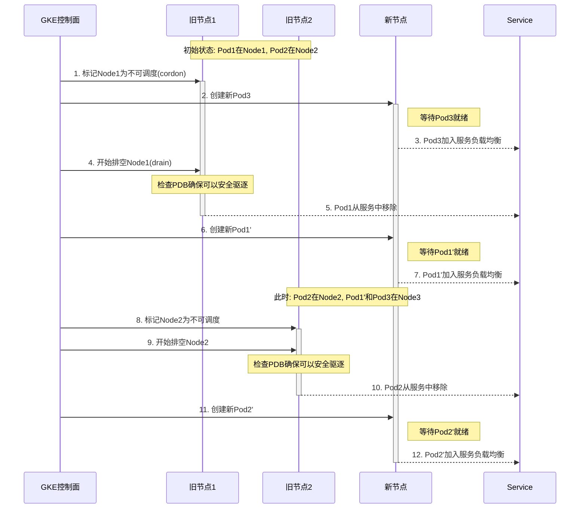

# Q 
对于GKE 集群我有如下配置
Deployment层面
replicas至少大于等于2
spec:
  replicas: 2
   - `maxUnavailable`  
     ```yaml
     strategy:
       rollingUpdate:
         maxSurge: 2
         maxUnavailable: 1
       type: RollingUpdate
     ```
   - Pod反亲和性（Anti-Affinity）  
     分散Pod到不同节点，防止单节点故障：
     ```yaml
     affinity:
       podAntiAffinity:
         requiredDuringSchedulingIgnoredDuringExecution:
         - labelSelector:
             matchLabels:
               app: my-app
           topologyKey: "kubernetes.io/hostname"
     ```

集群层面
   - PodDisruptionBudget (PDB)  
     定义驱逐Pod时的最小可用实例数
     ```yaml
     apiVersion: policy/v1
     kind: PodDisruptionBudget
     metadata:
       name: my-pdb
     spec:
       minAvailable: 1
       selector:
         matchLabels:
           app: my-app
     ```
我想了解如果我在做GKE  Node节点的升级过程中.比如Drain 每次排除一个节点. 我能保障我的服务的高可用么?
比如deployment一般默认至少2个Pod服务,前面是SVC.然后开始做节点升级? 我想了解详细的升级过程,比如old pod1  ,old pod 2到new pod 1 ,new pod2 的创建过程,帮我分析 如果可以把过程Markdown的sequediagram
# Grok3

直接回答

关键点：

- 如果集群节点数多于副本数（例如，2个副本需要至少3个节点），服务在节点升级期间可以保持高可用性，保持所有副本运行。
    
- 如果集群只有2个节点且2个副本，升级期间可能暂时失去一个副本，服务仍可用但冗余性降低。
    
- 使用涌入升级策略（surge upgrade）可以帮助维持节点数量，减少中断。
    

集群配置与高可用性  
您的部署配置了2个副本（replicas: 2），并启用了Pod反亲和性（pod anti-affinity），确保Pod分布在不同节点上，防止单节点故障影响服务。PodDisruptionBudget（PDB）设置了最小可用实例数为1（minAvailable: 1），意味着在节点升级期间，至少1个Pod必须保持运行。

节点升级过程

- 标准升级（默认）： GKE会逐个升级节点，排水（drain）一个节点后，其上的Pod会被驱逐，部署会尝试重新调度新Pod。如果集群只有2个节点，新的Pod可能因反亲和性无法调度到剩余节点，导致暂时只有1个Pod运行，服务可用但冗余性受影响。
    
- 如果集群有3个或更多节点： 排水一个节点后，新Pod可以调度到空闲节点，保持2个Pod运行，服务高可用性得到保证。
    
- 令人意外的细节： 如果集群只有2个节点，升级期间服务会暂时失去冗余，这可能不符合高可用性的严格定义，但PDB确保服务仍可访问。
    

如何保证高可用性

- 确保集群节点数多于副本数，例如2个副本需要至少3个节点。
    
- 考虑使用涌入升级策略，GKE会在升级前创建新节点，确保始终有足够节点调度Pod，减少中断。相关文档见Node Upgrade Strategies。
    

---

详细分析报告

引言

在Google Kubernetes Engine (GKE) 集群中，节点升级是维护集群健康的重要操作，但可能会影响服务的可用性。用户配置了一个部署（Deployment）具有至少2个副本，并启用了Pod反亲和性（pod anti-affinity）以分散Pod到不同节点，同时设置了PodDisruptionBudget (PDB) 确保最小可用实例数为1。本报告分析在节点升级过程中（如每次排水一个节点），服务的高可用性是否能得到保证，并详细描述升级过程及影响因素。

配置概述

用户的配置包括：

- Deployment层面：
    
    - replicas: 2，确保至少2个Pod运行。
        
    - 滚动更新策略（RollingUpdate）：maxSurge: 2，maxUnavailable: 1，允许最多2个额外Pod，1个Pod不可用。
        
    - Pod反亲和性：通过 topologyKey: "kubernetes.io/hostname" 确保同一应用的Pod不会调度到同一节点，防止单节点故障影响所有实例。
        
- 集群层面：
    
    - PodDisruptionBudget (PDB)：minAvailable: 1，selector匹配标签 app: my-app，确保在节点排水等干扰期间至少1个Pod可用。
        

这些配置旨在提高服务的容错能力和可用性，但节点升级可能因调度约束（如反亲和性）而影响Pod的重新调度。

节点升级过程分析

GKE支持两种主要升级策略：标准升级和涌入升级（surge upgrade）。默认使用标准升级，逐个升级节点；涌入升级则先创建新节点再移除旧节点。以下分析基于标准升级，假设用户按描述“每次排水一个节点”操作。

1. 集群节点数的影响

节点升级涉及排水（drain）节点，驱逐其上的Pod，并尝试重新调度到其他节点。Pod反亲和性要求新Pod不能调度到已有相同标签Pod的节点，这对集群节点数有直接影响：

- 假设集群有2个节点，2个副本：
    
    - 初始状态：Node1运行Pod1，Node2运行Pod2。
        
    - 升级Node1：排水Node1，驱逐Pod1。部署尝试创建新Pod1，但由于反亲和性，新Pod1无法调度到Node2（Node2已有Pod2）。结果，新Pod1进入Pending状态，服务暂时只有Pod2运行，满足PDB的minAvailable: 1，但副本数降为1，失去冗余。
        
    - 升级完成后，Node1恢复可用，新Pod1可调度回Node1，服务恢复2个Pod。
        
    - 结论： 在2节点集群，升级期间服务可用但冗余性受损，可能不符合高可用性的严格定义（高可用通常要求无单点故障，需多个实例运行）。
        
- 假设集群有3个节点，2个副本：
    
    - 初始状态：Node1运行Pod1，Node2运行Pod2，Node3空闲。
        
    - 升级Node1：排水Node1，驱逐Pod1。部署创建新Pod1，调度器可将新Pod1调度到Node3（Node3无相同标签Pod），服务保持Pod2（Node2）和新Pod1（Node3）运行，副本数维持2。
        
    - 类似地，升级其他节点（如Node2或Node3空节点）均可保持2个Pod运行。
        
    - 结论： 在3节点集群，服务在升级期间保持2个Pod运行，高可用性（包括冗余）得到保证。
        

1. PDB与服务可用性

PDB设置minAvailable: 1，确保在节点排水等干扰期间至少1个Pod可用。这意味着即使在2节点集群升级期间，服务暂时降为1个Pod运行，仍然满足PDB要求，服务不会完全中断。但部署的replicas: 2目标未达到，表明冗余性受损。

1. 升级策略的影响

- 标准升级（默认）： GKE逐个升级节点，排水时节点不可用。如果集群节点数等于副本数（如2节点2副本），新Pod可能因反亲和性无法调度，导致服务暂时失去冗余。
    
- 涌入升级（surge upgrade）： GKE先创建新节点（如maxSurge: 2），然后移除旧节点。在2节点集群，若使用涌入升级，可先创建2个新节点，排水旧节点时，新Pod可调度到新节点，保持服务可用性。相关文档见Node Upgrade Strategies。
    

1. 调度约束与反亲和性

Pod反亲和性通过 requiredDuringSchedulingIgnoredDuringExecution 和 topologyKey: "kubernetes.io/hostname" 确保Pod分布在不同节点。这是高可用性的关键，但也限制了Pod在节点升级时的重新调度：

- 如果所有可用节点已有相同标签的Pod，新Pod无法调度，进入Pending状态。
    
- 因此，集群必须有足够空闲节点（无相同标签Pod）以满足调度需求，这要求节点数N > 副本数R。
    

详细升级过程与序列图

以下为3节点集群（N=3，R=2）的升级过程序列图，展示服务如何保持高可用性：

|步骤|描述|状态|
|---|---|---|
|初始状态|Node1: Pod1，Node2: Pod2，Node3: 空闲|2个Pod运行，服务正常|
|升级Node1：排水Node1|驱逐Pod1，部署创建新Pod1|Pod2在Node2运行，Pod1Pending|
|调度新Pod1|调度器将新Pod1调度到Node3（Node3空闲，无冲突）|Pod2（Node2），新Pod1（Node3）|
|Node1升级完成，解锁Node1|Node1恢复可用，但新Pod1保持在Node3|2个Pod运行，服务正常|

对比2节点集群（N=2，R=2）：

|步骤|描述|状态|
|---|---|---|
|初始状态|Node1: Pod1，Node2: Pod2|2个Pod运行，服务正常|
|升级Node1：排水Node1|驱逐Pod1，部署创建新Pod1|Pod2在Node2运行，Pod1Pending|
|尝试调度新Pod1|无法调度到Node2（已有Pod2，反亲和性冲突）|只有Pod2运行，服务可用但无冗余|
|Node1升级完成，解锁Node1|新Pod1调度回Node1|恢复2个Pod运行，服务正常|

从序列图可见，2节点集群升级期间服务暂时失去冗余，而3节点集群保持2个Pod运行。

结论与建议

- 服务高可用性保证：
    
    - 如果集群节点数N > 副本数R（如3节点2副本），服务在节点升级期间可保持所有Pod运行，高可用性（包括冗余）得到保证。
        
    - 如果集群节点数N = R（如2节点2副本），升级期间服务可能暂时失去一个Pod，满足PDB但冗余性受损，高可用性部分受影响。
        
- 改进建议：
    
    - 确保集群节点数多于副本数，例如2个副本的部署需要至少3个节点。
        
    - 使用涌入升级策略，设置适当的maxSurge（如maxSurge: 1），在升级前增加节点，确保始终有足够节点调度Pod。
        
    - 检查集群配置，确认节点池规模，必要时启用集群自动扩展（Cluster Autoscaler），但注意反亲和性可能限制自动扩展的效果。
        

关键引用

- Node Upgrade Strategies in GKE
    
- Pod Affinity and Anti-Affinity in Kubernetes
    
- PodDisruptionBudget Configuration


# Claude

我来帮你分析 GKE 节点升级过程中的 Pod 迁移流程，并用序列图展示。

基于你的配置：
1. Deployment 配置了 3 个副本
2. maxSurge=2（可以超出期望副本数的 Pod 数量）
3. maxUnavailable=1（最多允许一个 Pod 不可用）
4. Pod 反亲和性确保 Pod 分布在不同节点
5. PDB 确保至少有 1 个 Pod 可用

以下是节点升级过程的序列图：



关键流程说明：

1. **初始状态**
   - Pod1 和 Pod2 分别运行在不同的旧节点上
   - Service 将流量分发到这些 Pod

2. **升级第一个节点**
   - 标记 Node1 为不可调度（cordon）
   - 创建新的 Pod3（利用 maxSurge=2 的配置）
   - 等待 Pod3 就绪并加入服务
   - 安全驱逐 Node1 上的 Pod1（由 PDB 保证）
   - 创建 Pod1' 在新节点上

3. **升级第二个节点**
   - 标记 Node2 为不可调度
   - 安全驱逐 Node2 上的 Pod2
   - 创建 Pod2' 在新节点上

在整个过程中：
- PDB 确保至少有 1 个 Pod 可用
- maxSurge=2 允许临时多创建 Pod，加速迁移
- maxUnavailable=1 确保最多只有 1 个 Pod 不可用
- Pod 反亲和性会在有新节点加入时自动将 Pod 分散到不同节点
- Service 会自动更新后端 Pod，保证服务持续可用

这个配置可以保证服务的高可用性，因为：
1. 始终至少有 1 个 Pod 在提供服务
2. 新 Pod 完全就绪才会驱逐旧 Pod
3. 自动负载均衡确保流量平滑迁移

需要更详细的某个阶段的说明吗？