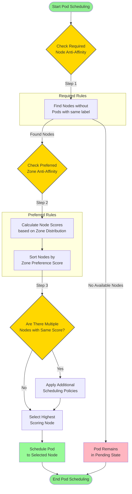

https://kubernetes.io/docs/concepts/scheduling-eviction/assign-pod-node/

# summary
我现在有这样的需求，
 比如我有8个Pod或者小于8个Pod。我的zone有三个，比如 a b c 我想要如下调度我的资源
1  我要求我的Pod必须分布在不同的zone ,比如2个Pod那么个a b 各一个就可以
2 因为如果1可以满足 那么我的Pod其实已经分不在不同的Node了
但是我知道比如我有大于3个的Pod。比如是5个 我强制要求分配到不同的zone 那么 我的zone只有三个会造成2个Pod是pending的状态，会创建失败
所以平衡这些因素
1 我要求多Pod必须在不同的Node
2 最好是在不同的zone 
应该如何来实现
我是不是可以先用nodeAffinity设置required到不同的zone 然后在设置再不同的Node？

我来帮你分析这个Pod调度的需求，并提供具体的实现方案。​​​​​​​​​​​​​​​​


# 方案
## English
-  Eg： Deployment
apiVersion: apps/v1
kind: Deployment
metadata:
  name: distributed-app
  labels:
    app: nginx
spec:
  replicas: 5  # Set the desired number of Pod replicas
  selector:
    matchLabels:
      app: nginx
  template:
    metadata:
      labels:
        app: nginx
    spec:
      affinity:
        podAntiAffinity:
          # 1. Required rule: Pods must be distributed across different Nodes
          requiredDuringSchedulingIgnoredDuringExecution:
            - labelSelector:
                matchExpressions:
                  - key: app
                    operator: In
                    values:
                      - nginx
              topologyKey: kubernetes.io/hostname
          # 2. Preferred rule: Pods should try to be distributed across different Zones
          preferredDuringSchedulingIgnoredDuringExecution:
            - weight: 1
              podAffinityTerm:
                labelSelector:
                  matchExpressions:
                    - key: app
                      operator: In
                      values:
                        - nginx
                topologyKey: topology.kubernetes.io/zone
      automountServiceAccountToken: false  # Security setting: Disable automatic mounting of the default service account token
      containers:
      - name: nginx
        image: nginx:latest
Let me explain each important part of this configuration in detail:

1. **Pod Anti-Affinity Configuration (podAntiAffinity)**:
   - Two types of scheduling rules are defined under the same `podAntiAffinity`:
     a. Required rules
     b. Preferred rules

2. **Required Rules (requiredDuringSchedulingIgnoredDuringExecution)**:
   ```yaml
   requiredDuringSchedulingIgnoredDuringExecution:
     - labelSelector:
         matchExpressions:
           - key: app
             operator: In
             values:
               - nginx
       topologyKey: kubernetes.io/hostname
   ```
   - This is a mandatory requirement
   - Uses `kubernetes.io/hostname` as topology key to ensure Pods are distributed across different nodes
   - If this requirement cannot be met, Pods will remain in Pending state

3. **Preferred Rules (preferredDuringSchedulingIgnoredDuringExecution)**:
   ```yaml
   preferredDuringSchedulingIgnoredDuringExecution:
     - weight: 1
       podAffinityTerm:
         labelSelector:
           matchExpressions:
             - key: app
               operator: In
               values:
                 - nginx
         topologyKey: topology.kubernetes.io/zone
   ```
   - This is a soft requirement
   - Uses `topology.kubernetes.io/zone` as topology key to attempt to distribute Pods across different availability zones
   - Weight: 1 indicates the priority of this rule in the scheduler's decision-making
   - Pods can still be scheduled if this requirement cannot be met

4. **Label Selector (labelSelector)**:
   - Uses `matchExpressions` to select Pods with the same app=nginx label
   - Ensures anti-affinity rules only apply between Pods of the same application

5. **Scheduling Behavior Explanation**:
   - First, the scheduler ensures Pods are distributed across different nodes
   - Then, within that constraint, it tries to distribute Pods across different availability zones
   - In case of 5 Pods but only 3 availability zones:
     * All Pods will be on different nodes
     * They will preferentially spread across different zones, but multiple Pods are allowed on different nodes within the same zone

6. **Other Important Settings**:
   - `automountServiceAccountToken: false` is a security setting that disables automatic mounting of the default service account token
   - This is a best practice to reduce potential security risks

Main advantages of this configuration:
1. Ensures high availability (Pods distributed across different nodes)
2. Provides zone-level disaster recovery capability when possible
3. Works properly even when the number of Pods exceeds the number of available zones
4. Clear configuration that is easy to maintain

Important note: This configuration requires enough nodes in the cluster to meet the Pod distribution requirements; otherwise, some Pods may remain in a Pending state.​​​​​​​​​​​​​​​​


## 中文
apiVersion: apps/v1
kind: Deployment
metadata:
  name: distributed-app
  labels:
    app: nginx
spec:
  replicas: 5  # 设置需要的 Pod 副本数
  selector:
    matchLabels:
      app: nginx
  template:
    metadata:
      labels:
        app: nginx
    spec:
      affinity:
        podAntiAffinity:
          # 1. 强制性要求：Pod 必须分布在不同的 Node 上
          requiredDuringSchedulingIgnoredDuringExecution:
            - labelSelector:
                matchExpressions:
                  - key: app
                    operator: In
                    values:
                      - nginx
              topologyKey: kubernetes.io/hostname
          # 2. 软性要求：Pod 尽量分布在不同的 Zone 上
          preferredDuringSchedulingIgnoredDuringExecution:
            - weight: 1
              podAffinityTerm:
                labelSelector:
                  matchExpressions:
                    - key: app
                      operator: In
                      values:
                        - nginx
                topologyKey: topology.kubernetes.io/zone
      automountServiceAccountToken: false  # 安全设置：禁用默认的服务账号令牌挂载
      containers:
      - name: nginx
        image: nginx:latest

让我详细解释这个配置的每个重要部分：

1. **Pod 反亲和性配置（podAntiAffinity）**：
   - 在同一个 `podAntiAffinity` 下定义了两种调度规则：
     a. 必需规则（required）
     b. 首选规则（preferred）

2. **必需规则（requiredDuringSchedulingIgnoredDuringExecution）**：
   ```yaml
   requiredDuringSchedulingIgnoredDuringExecution:
     - labelSelector:
         matchExpressions:
           - key: app
             operator: In
             values:
               - nginx
       topologyKey: kubernetes.io/hostname
   ```
   - 这是强制性要求
   - 使用 `kubernetes.io/hostname` 作为拓扑键，确保 Pod 分布在不同的节点上
   - 如果无法满足这个要求，Pod 将无法被调度（处于 Pending 状态）

3. **首选规则（preferredDuringSchedulingIgnoredDuringExecution）**：
   ```yaml
   preferredDuringSchedulingIgnoredDuringExecution:
     - weight: 1
       podAffinityTerm:
         labelSelector:
           matchExpressions:
             - key: app
               operator: In
               values:
                 - nginx
         topologyKey: topology.kubernetes.io/zone
   ```
   - 这是软性要求
   - 使用 `topology.kubernetes.io/zone` 作为拓扑键，尝试将 Pod 分布在不同的可用区
   - weight: 1 表示这个规则的权重，影响调度器的优先级判断
   - 如果无法满足这个要求，Pod 仍然可以被调度

4. **标签选择器（labelSelector）**：
   - 使用 `matchExpressions` 来选择具有相同 app=nginx 标签的 Pod
   - 这确保反亲和性规则只应用于相同应用的 Pod 之间

5. **调度行为说明**：
   - 首先，调度器会强制确保 Pod 分布在不同的节点上
   - 然后，在满足第一个条件的基础上，尽量将 Pod 分布在不同的可用区
   - 如果有 5 个 Pod 但只有 3 个可用区，那么：
     * 所有 Pod 都会在不同的节点上
     * 优先分布在不同的可用区，但允许多个 Pod 在同一个可用区的不同节点上

6. **其他重要设置**：
   - `automountServiceAccountToken: false` 是一个安全设置，禁用默认的服务账号令牌自动挂载
   - 这是一个最佳实践，可以减少潜在的安全风险

这个配置的主要优势是：
1. 确保高可用性（Pod 分布在不同节点）
2. 尽可能提供区域容灾能力（尽量分布在不同可用区）
3. 在 Pod 数量超过可用区数量时仍然可以正常工作
4. 配置清晰，易于维护

需要注意的是，这个配置要求集群中有足够的节点来满足 Pod 分布的要求，否则部分 Pod 可能会处于 Pending 状态。​​​​​​​​​​​​​​​​


# Flow




我来帮你创建一个展示 Pod 调度流程的 Mermaid 图表。​​​​​​​​​​​​​​​​

让我详细解释这个调度流程图：

1. **启动调度流程（Start Pod Scheduling）**
   - 当新的 Pod 创建请求到达时，Kubernetes 调度器开始工作

2. **必需规则检查（Required Rules）**
   - **检查必需的节点反亲和性**
     * 查找没有运行相同标签（app=nginx）Pod 的节点
     * 这是强制性要求，必须满足
   - **结果判断**
     * 如果找不到满足条件的节点，Pod 将保持在 Pending 状态
     * 如果找到合适的节点，继续下一步

3. **首选规则评估（Preferred Rules）**
   - **检查首选的可用区反亲和性**
     * 计算每个候选节点的区域分布得分
     * 基于现有 Pod 的分布情况评估最佳放置位置
   - **节点评分**
     * 对符合条件的节点进行打分
     * 考虑区域分布的权重（weight: 1）

4. **最终节点选择**
   - **评估多个节点**
     * 如果多个节点得分相同，应用额外的调度策略
     * 选择得分最高的节点
   - **确定最终节点**
     * 将 Pod 调度到选中的节点

5. **完成调度（End Pod Scheduling）**
   - Pod 被成功调度到选中的节点
   - 开始创建 Pod

图表中的颜色编码：
- 🟢 绿色：开始和结束节点
- 🟡 黄色：决策点
- 🔴 红色：错误状态（Pending）
- 🟦 蓝色：处理步骤

这个流程确保了：
1. Pod 一定会被调度到不同的节点上（必需规则）
2. 在满足必需规则的前提下，尽可能分布在不同的可用区（首选规则）
3. 在无法满足所有条件时，提供清晰的失败处理机制

这个调度流程图可以帮助团队更好地理解：
- Pod 的调度决策过程
- 反亲和性规则的应用顺序
- 可能的调度结果和失败情况​​​​​​​​​​​​​​​​

# Other

1. **Pod 反亲和性配置分为两层**：
   - 第一层是强制要求（required）：使用 `requiredDuringSchedulingIgnoredDuringExecution` 确保 Pod 必须调度到不同的 Node 上
   - 第二层是软性要求（preferred）：使用 `preferredDuringSchedulingIgnoredDuringExecution` 优先将 Pod 调度到不同的 Zone

2. **为什么不把 Zone 也设置为强制要求**：
   - 如你所说，如果 Pod 数量超过 Zone 数量（比如 5 个 Pod，3 个 Zone），设置强制要求会导致部分 Pod 无法调度
   - 使用软性要求（preferred）可以确保在有可能的情况下 Pod 会分布在不同 Zone，但当 Zone 不足时，仍然可以调度到同一个 Zone 的不同 Node 上

3. **调度策略的优先级**：
   - 首先满足强制要求：Pod 必须在不同的 Node 上
   - 其次尽量满足软性要求：在满足第一个条件的前提下，尽可能分布在不同的 Zone

4. **权重设置**：
   - 在软性要求中设置了较高的权重（weight: 100），这样调度器会更倾向于将 Pod 分布到不同的 Zone

这样的配置可以确保：
- 当 Pod 数量小于或等于 Zone 数量时，Pod 会分布在不同的 Zone
- 当 Pod 数量大于 Zone 数量时，Pod 仍然会分布在不同的 Node 上，只是可能会有多个 Pod 在同一个 Zone 内

你不需要显式地使用 nodeAffinity，因为 podAntiAffinity 已经能够满足你的需求。这个方案更灵活，因为：
1. 它直接处理了 Pod 之间的关系
2. 它通过软性要求来处理 Zone 分布，避免了调度失败的问题

你觉得这个方案是否满足你的需求？如果需要调整，我们可以进一步修改配置。​​​​​​​​​​​​​​​​