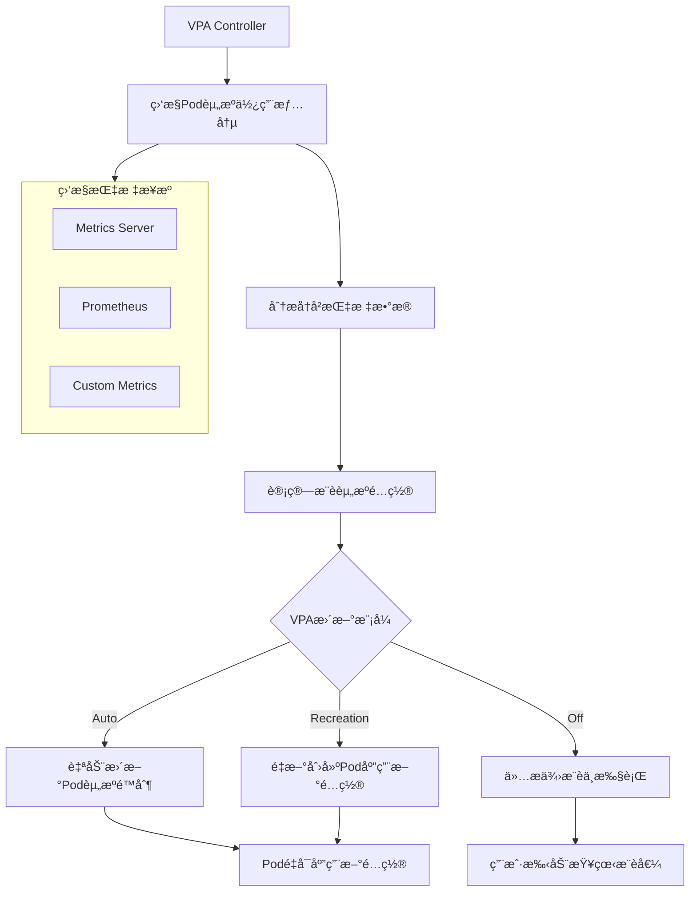

这是个很关键也很å®ç”¨çš„问题。在生产ç¯å¢ƒä¸­å¯ç”¨ VPA（Vertical Pod Autoscaler） 时，如何åˆç†è®¾ç½®åˆå§‹èµ„æºå€¼ï¼ˆDeployment çš„ resource requests/limits），会直æ¥å½±å“ VPA çš„æ¨èè´¨é‡å’Œåº”用稳定性。

  

  

  

  

🌟 ç†è§£æ ¸å¿ƒåŸç†

  

  

VPA çš„æ¨è逻辑 ä¾èµ–äºå®¹å™¨è¿è¡Œå的监æ§æ•°æ®ï¼ˆèµ„æºä½¿ç”¨é‡ï¼‰ï¼Œæ¯”如 CPU/Memory 的真å®ä½¿ç”¨æƒ…况。

  

而它的 第一次æ¨è，是基äºï¼š

  

1. 已有的 resource request（如æœå¤ªä½å¯èƒ½å¯¼è‡´ä¸ç¨³å®šï¼›å¦‚æœå¤ªé«˜åˆ™èµ„æºæµªè´¹ï¼‰
2. å®é™…采样的 Prometheus-like metrics（在 GKE æ˜¯åŸºäº metrics-server）

  

  

  

  

  

✅ 最佳å®è·µå»ºè®®ï¼ˆå†…存资æºï¼‰

  

  

  

1. 

Deployment åˆå§‹é…置建议

  

  

建议设置一个 åˆé€‚çš„åˆå§‹ request/limit 内存值，é¿å…：

  

- VPA æ¨è值å离ç°å®å¤ªè¿œï¼›
- å¯åŠ¨é˜¶æ®µ OOMï¼›
- ä¸åˆç†çš„ pod 分布（导致无法调度）。

  

  

示例如下：

resources:

  requests:

    memory: "512Mi"

  limits:

    memory: "1024Mi"

🔹 建议åˆå§‹ requests 设置为你对业务ç†è§£çš„中ä½ä½¿ç”¨å€¼ï¼Œlimits å¯ä»¥ä¸ºå…¶ 1.5~2 å€ã€‚

  

  

  

  

2. 

VPA 中 minAllowed / maxAllowed æ¨è设置

  

resourcePolicy:

  containerPolicies:

    - containerName: '*'

      minAllowed:

        memory: "256Mi"

      maxAllowed:

        memory: "2048Mi"

|   |   |   |
|---|---|---|
|å‚æ•°|建议值（内存）|说æ˜|
|minAllowed|应 ≥ 你容器å¯åŠ¨æ‰€éœ€æœ€ä½å€¼ï¼ˆå¦‚ 256Mi）|防止刚å¯åŠ¨å°± OOM|
|maxAllowed|应 ≤ 节点资æºçš„åˆç†ä¸Šé™ï¼ˆå¦‚ 2Gi）|防止调度失败或抢å èµ„æº|

â— ä¸å»ºè®®è®¾ç½® maxAllowed 太高，比如超过节点å®é™…内存的一åŠï¼Œä¼šå¯¼è‡´ Pod 难以调度。

  

  

  

  

3. 

观察期建议

  

  

VPA 需è¦ä¸€æ®µâ€œè§‚测期â€æ¥è¯„估资æºä½¿ç”¨ã€‚常è§çš„观察策略：

|   |   |
|---|---|
|阶段|建议|
|å‰æœŸï¼ˆä¸Šçº¿1~3天）|VPA 设置为 Off 模å¼ï¼Œä»…采样æ¨è，观察|
|中期|改为 Initial，新建 Pod 有æ¨è值|
|稳定期|改为 Auto，由 VPA 自动é‡å¯è°ƒæ•´|

  

  

  

  

4. 

æ­é… PDB 使用防止æœåŠ¡ä¸­æ–­

  

  

生产建议：

minAvailable: 1

或你有2个Pod：

minAvailable: 50%

  

  

  

  

🔧 检查å®é™…æ¨è值（命令）

  

kubectl describe vpa myapp-vpa

输出示例：

Recommendations:

  Container Name: myapp-container

    Target:

      CPU: 250m

      Memory: 750Mi

    Lower Bound:

      CPU: 200m

      Memory: 512Mi

    Upper Bound:

      CPU: 500m

      Memory: 1Gi

ä½ å¯ä»¥çœ‹åˆ°æ¨è值和上下é™ï¼Œç”¨æ¥åˆ¤æ–­æ˜¯å¦éœ€è¦è°ƒæ•´ min/max 或 Deployment åŸå§‹é…置。

  

  

  

  

✅ 总结æ¨èç­–ç•¥

  

|   |   |
|---|---|
|项目|建议值 / 方法|
|Deployment åˆå§‹é…ç½®|requests.memory: 512Mi / limits: 1Gi|
|minAllowed|比å¯åŠ¨å†…存略高，例如 256Mi|
|maxAllowed|ä¸è¶…过节点å¯è°ƒåº¦ä¸Šé™ï¼Œä¾‹å¦‚ 2Gi|
|VPA åˆæœŸè¿è¡Œæ¨¡å¼|Off 观察ã€Initial 过渡ã€Auto 稳定|
|é…åˆä½¿ç”¨çš„ PDB|至少ä¿ç•™1个 Pod 在线|
|观察æ¨è值的方å¼|kubectl describe vpa xxx|

  

  

  

如æœä½ èƒ½æä¾› Deployment 中æœåŠ¡çš„内存使用范围或 GC ç±»å‹ï¼ˆæ¯”如是 Java 应用ã€Node.js 应用等），我å¯ä»¥å¸®ä½ æ›´ç²¾ç¡®åœ°å®šä¸ªæ¨èåˆå§‹å€¼ã€‚是å¦éœ€è¦ï¼Ÿ


æ˜ç™½äº†ï¼Œä½ çš„需求是：

  

已知 Deployment 中的内存é…置（requests/limits），希望得到一个åˆç†çš„ VPA é…置对应关系建议表，包括 VPA 中的 minAllowed / maxAllowed / åˆå§‹ resource，以åŠå¦‚何æ¨å¯¼è¿™äº›å€¼ã€‚

  

  

  

  

✅ VPA é…ç½®ä¸ Deployment 内存的æ¨è对应关系

  

  

ä»¥ä¸‹æ˜¯ä¸€ä¸ªåŸºäº Deployment 中的内存é…置的æ¨å¯¼å»ºè®®è¡¨ï¼š

|   |   |   |   |
|---|---|---|---|
|Deployment 中设置（requests.memory）|æ¨è VPA minAllowed.memory|æ¨è VPA maxAllowed.memory|备注说æ˜|
|256Mi|128Mi|512Mi|适åˆè½»é‡çº§æœåŠ¡ï¼Œä¾‹å¦‚ sidecarã€agent|
|512Mi|256Mi|1024Mi|中等æœåŠ¡ï¼Œå¦‚è½»é‡ Web APIã€é JVM|
|1024Mi（1Gi）|512Mi|2048Mi（2Gi）|一般业务æœåŠ¡|
|2048Mi（2Gi）|1024Mi|4096Mi（4Gi）|JVM 应用ã€ç¼“å­˜ã€å›¾åƒå¤„ç†ç­‰|
|4096Mi（4Gi）|2048Mi|8192Mi（8Gi）|高内存æœåŠ¡ã€Kafka client ç­‰|

  

  

  

  

💡 æ¨å¯¼é€»è¾‘解释

  

|   |   |   |
|---|---|---|
|å‚æ•°|æ¨è比例|说æ˜|
|minAllowed|requests × 0.5|防止 VPA æ¨è太ä½ï¼Œå¯¼è‡´åˆšå¯åŠ¨ OOM 或 GC 抖动|
|maxAllowed|requests × 2~4|ä¿è¯ Pod 在高峰期ä¸ä¼š OOM，åˆä¸è‡³äºæ— é™æ‹‰ä¼¸|

  

  

  

  

📌 示例对照表

  

  

以下是你å¯ä»¥ç›´æ¥å‚考套用的 VPA é…置示例（以 Deployment 设置为 512Mi 为例）：

resources:

  requests:

    memory: "512Mi"

  limits:

    memory: "1024Mi"

对应的 VPA æ¨èé…置如下：

spec:

  resourcePolicy:

    containerPolicies:

      - containerName: '*'

        minAllowed:

          memory: "256Mi"

        maxAllowed:

          memory: "1024Mi"

如æœä½  Deployment 设置为 1Gi，则：

minAllowed.memory = 512Mi

maxAllowed.memory = 2048Mi

  

  

  

  

🯠é…ç½® VPA æ¨èå…¬å¼ï¼ˆæ€»ç»“）

  

  

你也å¯ä»¥æŒ‰ç…§ä»¥ä¸‹é€šç”¨å…¬å¼è®¡ç®—：

minAllowed.memory = requests.memory × 0.5

maxAllowed.memory = requests.memory × 2~4

也å¯åšæˆä½ è‡ªå·±çš„自动生æˆè„šæœ¬ï¼ˆæ¯”如 vpa-gen.sh）按上述公å¼ç”Ÿæˆé…ç½®å—。

  

  

  

  

✅ 注æ„点（å³ä½¿ä½ æš‚æ—¶ä¸è€ƒè™‘ Node 资æºï¼‰

  

  

1. ä¸è¦æŠŠ min 设置为比å¯åŠ¨æœ€ä½å€¼è¿˜ä½ï¼ˆå»ºè®®ä½ åŸºå‡†çº¿ memory profile è¦æŒæ¡ï¼‰ã€‚
2. maxAllowed ä¸åº”过高（如 16Gi 以上），å¦åˆ™ä¸€æ—¦å¼‚常会åæ‰æ‰€æœ‰èµ„æºï¼ˆä¾‹å¦‚内存泄æ¼æ—¶ï¼‰ã€‚

  

  

  

  

是å¦éœ€è¦æˆ‘æ供一个å¯ä»¥â€œè¾“å…¥ Deployment requests.memory，输出æ¨è VPA YAML é…置段â€çš„å°å·¥å…·æˆ– shell 脚本？你å¯ä»¥ç›´æ¥åœ¨ CI/CD æµç¨‹ä¸­åŠ¨æ€ç”Ÿæˆã€‚


# Claude

对äºGKE中的扩展机制，确å®å­˜åœ¨å‚直扩展。让我为你详细说æ˜HPAå’ŒVPA的对应关系以åŠå…·ä½“é…置。

## 扩展类å‹å¯¹åº”关系

| æ‰©å±•ç±»å‹ | 英文å称 | æ§åˆ¶å™¨ | 扩展维度 | 作用对象 |
|---------|---------|--------|----------|----------|
| 水平扩展 | Horizontal Pod Autoscaler (HPA) | HPA Controller | Podå‰¯æœ¬æ•°é‡ | Deployment/ReplicaSet |
| å‚直扩展 | Vertical Pod Autoscaler (VPA) | VPA Controller | Pod资æºé™åˆ¶ | Pod规格 |

## VPA工作æµç¨‹â€‹â€‹â€‹â€‹â€‹â€‹â€‹â€‹â€‹â€‹â€‹â€‹â€‹â€‹â€‹â€‹

## Deploymentä¸VPA资æºé…置对应关系

### Deployment资æºé…ç½®

```yaml
apiVersion: apps/v1
kind: Deployment
metadata:
  name: my-app
spec:
  replicas: 3
  template:
    spec:
      containers:
      - name: app-container
        image: nginx
        resources:
          requests:
            cpu: "100m"        # VPA会调整这个值
            memory: "128Mi"    # VPA会调整这个值
          limits:
            cpu: "500m"        # VPA会调整这个值
            memory: "512Mi"    # VPA会调整这个值
```

### 对应的VPAé…ç½®

```yaml
apiVersion: autoscaling.k8s.io/v1
kind: VerticalPodAutoscaler
metadata:
  name: my-app-vpa
spec:
  targetRef:
    apiVersion: apps/v1
    kind: Deployment
    name: my-app              # 对应上é¢çš„Deploymentå称
  updatePolicy:
    updateMode: "Auto"        # Auto/Recreation/Off
  resourcePolicy:
    containerPolicies:
    - containerName: app-container  # 对应containerå称
      minAllowed:
        cpu: "50m"            # 最å°CPU请求
        memory: "64Mi"        # 最å°å†…存请求
      maxAllowed:
        cpu: "2000m"          # 最大CPUé™åˆ¶
        memory: "2Gi"         # 最大内存é™åˆ¶
      controlledResources:
      - cpu                   # VPAæ§åˆ¶CPU资æº
      - memory                # VPAæ§åˆ¶å†…存资æº
      controlledValues: RequestsAndLimits  # æ§åˆ¶requestså’Œlimits
```

## VPAé…ç½®å‚数详解

| VPAå‚æ•° | Deployment对应 | è¯´æ˜ | 示例值 |
|---------|---------------|------|--------|
| `minAllowed.cpu` | `resources.requests.cpu` 最å°å€¼ | VPAä¸ä¼šå°†CPU请求设置ä½äºæ­¤å€¼ | `50m` |
| `minAllowed.memory` | `resources.requests.memory` 最å°å€¼ | VPAä¸ä¼šå°†å†…存请求设置ä½äºæ­¤å€¼ | `64Mi` |
| `maxAllowed.cpu` | `resources.limits.cpu` 最大值 | VPAä¸ä¼šå°†CPUé™åˆ¶è®¾ç½®é«˜äºæ­¤å€¼ | `2000m` |
| `maxAllowed.memory` | `resources.limits.memory` 最大值 | VPAä¸ä¼šå°†å†…å­˜é™åˆ¶è®¾ç½®é«˜äºæ­¤å€¼ | `2Gi` |

## VPA更新模å¼å¯¹æ¯”

| æ›´æ–°æ¨¡å¼ | 行为 | 适用场景 | Podé‡å¯ |
|---------|------|----------|---------|
| `Auto` | 自动更新ç°æœ‰Podèµ„æº | 生产ç¯å¢ƒï¼Œå…许Podé‡å¯ | 是 |
| `Recreation` | é‡æ–°åˆ›å»ºPod应用新é…ç½® | å¼€å‘ç¯å¢ƒï¼Œå¿«é€ŸéªŒè¯ | 是 |
| `Off` | 仅计算æ¨è值，ä¸è‡ªåŠ¨åº”用 | 观察模å¼ï¼Œæ‰‹åŠ¨å†³ç­– | å¦ |

## å®é™…é…置示例

### 当å‰Deploymenté…ç½®è·å–

```bash
# 查看当å‰Deployment资æºé…ç½®
kubectl get deployment my-app -o yaml | grep -A 10 resources:

# 查看Podå®é™…资æºä½¿ç”¨æƒ…况
kubectl top pods -l app=my-app
```

### 基äºå®é™…使用情况é…ç½®VPA

```yaml
apiVersion: autoscaling.k8s.io/v1
kind: VerticalPodAutoscaler
metadata:
  name: my-app-vpa
  namespace: default
spec:
  targetRef:
    apiVersion: apps/v1
    kind: Deployment
    name: my-app
  updatePolicy:
    updateMode: "Auto"
  resourcePolicy:
    containerPolicies:
    - containerName: app-container
      minAllowed:
        cpu: "100m"      # 基äºå½“å‰requests值设置
        memory: "128Mi"   # 基äºå½“å‰requests值设置
      maxAllowed:
        cpu: "4000m"     # æ ¹æ®node资æºå’Œä¸šåŠ¡éœ€æ±‚设置
        memory: "8Gi"    # æ ¹æ®node资æºå’Œä¸šåŠ¡éœ€æ±‚设置
      controlledResources: ["cpu", "memory"]
      controlledValues: "RequestsAndLimits"
```

## 监æ§VPA效æœ

```bash
# 查看VPAæ¨è值
kubectl describe vpa my-app-vpa

# 查看VPA状æ€
kubectl get vpa my-app-vpa -o yaml

# 查看Pod资æºä½¿ç”¨å†å²
kubectl top pods --containers=true
```

这样é…ç½®å，VPA会根æ®å®é™…使用情况自动调整Podçš„CPU和内存é…置，确ä¿èµ„æºåˆ©ç”¨ç‡æœ€ä¼˜åŒ–。​​​​​​​​​​​​​​​​


# grok

我ç†è§£ä½ å¸Œæœ›æ·±å…¥äº†è§£ Google Kubernetes Engine (GKE) 中 Horizontal Pod Autoscaler (HPA) å’Œ Vertical Pod Autoscaler (VPA) çš„é…置关系，特别是如何将 Deployment ä¸­çš„å†…å­˜è®¾ç½®ä¸ VPA é…置对应起æ¥ï¼Œå¹¶ä¸”æ˜ç¡® VPA 如何根æ®èµ„æºä½¿ç”¨æƒ…况调整这些值，而ä¸è€ƒè™‘节点资æºé™åˆ¶ã€‚以下是详细的解答，我会尽é‡æ¸…æ™°ã€ç®€æ´ï¼Œå¹¶æŒ‰ç…§ä½ çš„è¦æ±‚æä¾› Markdown æ ¼å¼çš„输出ã€ç¤ºä¾‹ä»£ç ï¼Œä»¥åŠæµç¨‹å›¾ï¼ˆä½¿ç”¨ Mermaid）æ¥å¸®åŠ©ä½ ç†è§£ã€‚

  

1. HPA å’Œ VPA 的基本概念ä¸å…³ç³»

HPA（水平扩展）

HPA 通过动æ€è°ƒæ•´ Pod 的副本数é‡ï¼ˆreplicas）æ¥åº”对负载å˜åŒ–，主è¦åŸºäºä»¥ä¸‹æŒ‡æ ‡ï¼š

- CPU 利用ç‡ï¼šPod çš„ CPU 使用é‡å è¯·æ±‚é‡ï¼ˆrequests）的百分比。
- 内存利用ç‡ï¼šPod 的内存使用é‡ï¼ˆéœ€è¦ Kubernetes v1.8+，通过 autoscaling/v2 API）。
- 自定义指标：如æ¯ç§’请求数（RPS）或外部指标（如 Pub/Sub 队列长度）。

HPA çš„é…置通常在 HorizontalPodAutoscaler 对象中定义，针对 Deploymentã€StatefulSet 等工作负载。

VPA（å‚直扩展）

VPA 通过调整 Pod 的资æºè¯·æ±‚（requests）和é™åˆ¶ï¼ˆlimits）æ¥ä¼˜åŒ–资æºåˆ†é…，适用äºä»¥ä¸‹åœºæ™¯ï¼š

- Pod 的资æºè¯·æ±‚（requests.cpu 或 requests.memory）设置ä¸åˆç†ï¼Œå¯èƒ½è¿‡é«˜ï¼ˆæµªè´¹èµ„æºï¼‰æˆ–过ä½ï¼ˆå¯¼è‡´æ€§èƒ½ç“¶é¢ˆï¼‰ã€‚
- 动æ€è°ƒæ•´ CPU 和内存以匹é…å®é™…使用情况。

VPA 有三ç§æ¨¡å¼ï¼š

- Auto：VPA 自动调整资æºè¯·æ±‚并é‡æ–°åˆ›å»º Pod。
- Initial：仅在 Pod 创建时设置资æºè¯·æ±‚，ä¸åŠ¨æ€è°ƒæ•´ã€‚
- Off：仅æ供资æºæ¨è，ä¸å®é™…修改 Pod。

HPA 和 VPA 的关系

- 冲çªé—®é¢˜ï¼šHPA å’Œ VPA ä¸èƒ½åŒæ—¶åŸºäº CPU 或内存指标进行缩放，因为它们å¯èƒ½ä¼šäº’相干扰。例如，HPA å¯èƒ½å› é«˜ CPU 使用ç‡å¢åŠ  Pod æ•°é‡ï¼Œè€Œ VPA å¯èƒ½åŒæ—¶å¢åŠ æ¯ä¸ª Pod çš„ CPU 请求，导致资æºåˆ†é…混乱。
- 解决方法：GKE æ供了 多维 Pod 自动扩展（Multidimensional Pod Autoscaling，Beta 阶段），å…许 HPA åŸºäº CPU 扩展，VPA 基äºå†…存扩展，或者使用自定义指标æ¥é¿å…冲çªã€‚
- æ¨èå®è·µï¼šå¦‚æœéœ€è¦åŒæ—¶ä½¿ç”¨ HPA å’Œ VPA，HPA 应基äºè‡ªå®šä¹‰æŒ‡æ ‡ï¼ˆå¦‚ RPS）或外部指标，而 VPA 专注äºè°ƒæ•´ CPU 和内存请求。

  

2. Deployment ä¸­å†…å­˜è®¾ç½®ä¸ VPA é…置的对应关系

在 GKE 中，Deployment çš„ Pod 模æ¿ä¸­å®šä¹‰äº†å®¹å™¨èµ„æºè¯·æ±‚å’Œé™åˆ¶ï¼ˆresources.requests å’Œ resources.limits），VPA æ ¹æ®å†å²èµ„æºä½¿ç”¨æƒ…况动æ€è°ƒæ•´è¿™äº›å€¼ã€‚以下是具体对应关系和é…置方法。

2.1 Deployment 中的内存设置

在 Deployment çš„ Pod 模æ¿ä¸­ï¼Œå†…存设置通常如下：

apiVersion: apps/v1

kind: Deployment

metadata:

  name: my-app

spec:

  replicas: 2

  selector:

    matchLabels:

      app: my-app

  template:

    metadata:

      labels:

        app: my-app

    spec:

      containers:

      - name: my-container

        image: my-image:latest

        resources:

          requests:

            cpu: "100m"

            memory: "256Mi"

          limits:

            cpu: "500m"

            memory: "512Mi"

- requests.memory：指定容器ä¿è¯çš„最å°å†…å­˜é‡ï¼ˆä¾‹å¦‚ 256Mi），Kubernetes 调度器根æ®æ­¤å€¼é€‰æ‹©åˆé€‚的节点。
- limits.memory：指定容器å¯ä½¿ç”¨çš„最大内存é‡ï¼ˆä¾‹å¦‚ 512Mi），超过此值å¯èƒ½å¯¼è‡´å®¹å™¨è¢«ç»ˆæ­¢ã€‚

2.2 VPA çš„é…ç½®

VPA 通过 VerticalPodAutoscaler å¯¹è±¡å®šä¹‰ï¼Œç›‘æ§ Pod 的资æºä½¿ç”¨æƒ…况并æä¾›æ¨è值或自动调整 requests å’Œ limits。以下是一个 VPA é…置示例：

apiVersion: autoscaling.k8s.io/v1

kind: VerticalPodAutoscaler

metadata:

  name: my-app-vpa

spec:

  targetRef:

    apiVersion: apps/v1

    kind: Deployment

    name: my-app

  updatePolicy:

    updateMode: "Auto"

  resourcePolicy:

    containerPolicies:

    - containerName: my-container

      minAllowed:

        cpu: "50m"

        memory: "128Mi"

      maxAllowed:

        cpu: "1000m"

        memory: "1024Mi"

      controlledResources:

        - cpu

        - memory

2.3 对应关系说æ˜

- Deployment çš„ requests.memory å’Œ VPA çš„æ¨è值：

- VPA çš„ vpa-recommender 组件会分æ Pod çš„å†å²å†…å­˜ä½¿ç”¨æƒ…å†µï¼ˆåŸºäº metrics server 或其他监æ§æ•°æ®ï¼‰ã€‚
- æ¨è值会存储在 VPA 对象的 status.recommendation 字段中，例如：status:
-   recommendation:
-     containerRecommendations:
-     - containerName: my-container
-       lowerBound:
-         cpu: "80m"
-         memory: "200Mi"
-       target:
-         cpu: "150m"
-         memory: "300Mi"
-       upperBound:
-         cpu: "300m"
-         memory: "600Mi"
-   
    
- target：VPA 建议的ç†æƒ³èµ„æºè¯·æ±‚值。
- lowerBound：æ¨è的最å°èµ„æºè¯·æ±‚值。
- upperBound：æ¨è的最大资æºè¯·æ±‚值。

- VPA 自动调整（updateMode: Auto）：

- å¦‚æœ updateMode 设置为 Auto，VPA ä¼šæ ¹æ® target 值更新 Pod çš„ requests.memory å’Œ limits.memory（如æœé…置了 controlledResources åŒ…å« memory）。
- 例如，Deployment 中åŸå§‹ requests.memory: 256Mi å¯èƒ½è¢« VPA 调整为 300Miï¼ˆåŸºäº target 值）。
- 调整过程需è¦é‡æ–°åˆ›å»º Pod，因为 Kubernetes ä¸æ”¯æŒè¿è¡Œæ—¶ä¿®æ”¹ Pod 的资æºè¯·æ±‚。

- VPA 的 minAllowed 和 maxAllowed：

- ä½ å¯ä»¥åœ¨ resourcePolicy.containerPolicies 中设置 minAllowed.memory å’Œ maxAllowed.memory，é™åˆ¶ VPA 调整的范围。
- 例如，minAllowed.memory: 128Mi ç¡®ä¿ VPA ä¸ä¼šå°†å†…存请求调ä½äº 128MiBï¼›maxAllowed.memory: 1024Mi ç¡®ä¿ä¸ä¼šè¶…过 1024MiB。

- ä¸è€ƒè™‘节点资æºé™åˆ¶ï¼š

- ç”±äºä½ æ到å¯ä»¥ä¸è€ƒè™‘节点资æºé™åˆ¶ï¼ŒVPA ä¼šæ ¹æ® Pod çš„å®é™…内存使用情况æ¨è值，而ä¸ä¼šå—节点容é‡é™åˆ¶ï¼ˆä¾‹å¦‚，节点最大内存）。但在生产ç¯å¢ƒä¸­ï¼Œå»ºè®®è®¾ç½®åˆç†çš„ maxAllowed 值，以é¿å…æ¨è值超出集群å®é™…å¯ç”¨èµ„æºã€‚

2.4 如何è·å– VPA æ¨è值

ä½ å¯ä»¥é€šè¿‡ä»¥ä¸‹å‘½ä»¤æŸ¥çœ‹ VPA çš„æ¨è值：

kubectl describe vpa my-app-vpa

输出示例：

Status:

  Recommendation:

    Container Recommendations:

      Container Name:  my-container

      Lower Bound:

        Cpu:     80m

        Memory:  200Mi

      Target:

        Cpu:     150m

        Memory:  300Mi

      Upper Bound:

        Cpu:     300m

        Memory:  600Mi

- 手动应用æ¨èå€¼ï¼šå¦‚æœ updateMode: Off，你å¯ä»¥æ‰‹åŠ¨å°†æ¨èçš„ target 值（例如 memory: 300Mi）更新到 Deployment çš„ resources.requests.memory 中。
- è‡ªåŠ¨åº”ç”¨ï¼šå¦‚æœ updateMode: Auto，VPA 会自动将 target 值应用到 Pod çš„ requests.memory å’Œ limits.memory（如æœé…置了）。

2.5 é…ç½® HPA å’Œ VPA çš„ååŒå·¥ä½œ

如æœä½ çš„ GKE 集群已ç»é…置了 HPA，你需è¦ç¡®ä¿ HPA å’Œ VPA ä¸åŸºäºç›¸åŒçš„指标（如内存）工作。以下是一个æ¨è的组åˆé…置：

- HPA 基äºè‡ªå®šä¹‰æŒ‡æ ‡ï¼ˆå¦‚ RPS）：

apiVersion: autoscaling/v2

kind: HorizontalPodAutoscaler

metadata:

  name: my-app-hpa

spec:

  scaleTargetRef:

    apiVersion: apps/v1

    kind: Deployment

    name: my-app

  minReplicas: 1

  maxReplicas: 10

  metrics:

  - type: Pods

    pods:

      metric:

        name: packets_per_second

      target:

        type: AverageValue

        averageValue: 100

- VPA 基äºå†…存和 CPU：

apiVersion: autoscaling.k8s.io/v1

kind: VerticalPodAutoscaler

metadata:

  name: my-app-vpa

spec:

  targetRef:

    apiVersion: apps/v1

    kind: Deployment

    name: my-app

  updatePolicy:

    updateMode: "Auto"

  resourcePolicy:

    containerPolicies:

    - containerName: my-container

      minAllowed:

        memory: "128Mi"

      maxAllowed:

        memory: "1024Mi"

      controlledResources:

        - memory

这样，HPA 负责根æ®è¯·æ±‚é‡è°ƒæ•´ Pod æ•°é‡ï¼ŒVPA 负责优化æ¯ä¸ª Pod 的内存请求，é¿å…冲çªã€‚

  

3. é…ç½®æµç¨‹å›¾ï¼ˆMermaid）

以下是é…ç½® VPA å’Œ Deployment 的内存设置关系的æµç¨‹å›¾ï¼Œä½¿ç”¨ Mermaid æ ¼å¼ï¼š
```mermaid
graph TD

    A[创建 Deployment] -->|定义 resources.requests.memory| B[Pod è¿è¡Œ]

    B -->|监æ§èµ„æºä½¿ç”¨| C[VPA Recommender]

    C -->|生æˆæ¨è值| D{VPA updateMode}

    D -->|Auto| E[自动调整 requests.memory]

    D -->|Off| F[手动应用æ¨è值]

    E -->|é‡æ–°åˆ›å»º Pod| G[Pod 使用新内存设置]

    F -->|更新 Deployment| G

    G -->|ä¸ HPA ååŒ| H[检查 HPA 指标]

    H -->|自定义指标| I[调整 Pod 副本数é‡]

    H -->|é¿å… CPU/内存指标| J[防止 HPA å’Œ VPA 冲çª]
``` 
说æ˜ï¼š

- A → B：在 Deployment 中定义åˆå§‹å†…存请求（如 256Mi）。
- B → C：VPA çš„ vpa-recommender ç›‘æ§ Pod 的内存使用情况。
- C → D：VPA æ ¹æ® updateMode 决定是自动调整还是æä¾›æ¨è。
- E/F → G：自动或手动应用æ¨è的内存请求值。
- G → H → I/Jï¼šç¡®ä¿ HPA 使用自定义指标（如 RPS），é¿å…ä¸ VPA 的内存调整冲çªã€‚

  

4. ç¤ºä¾‹ï¼šä» Deployment 到 VPA çš„é…ç½®

å‡è®¾ä½ æœ‰ä¸€ä¸ª Deployment，åˆå§‹å†…存设置为 requests.memory: 256Mi，希望通过 VPA 优化内存分é…。

步骤 1ï¼šæ£€æŸ¥å½“å‰ Deployment

kubectl get deployment my-app -o yaml

输出（部分）：

spec:

  template:

    spec:

      containers:

      - name: my-container

        resources:

          requests:

            memory: "256Mi"

          limits:

            memory: "512Mi"

步骤 2：创建 VPA

kubectl apply -f - <

步骤 3：查看 VPA æ¨è值

kubectl describe vpa my-app-vpa

å‡è®¾è¾“出显示æ¨è值为 memory: 300Mi，VPA 在 Auto 模å¼ä¸‹ä¼šè‡ªåŠ¨å°† Pod çš„ requests.memory 更新为 300Mi。

步骤 4ï¼šéªŒè¯ Pod 资æº

kubectl describe pod -l app=my-app

输出（部分）：

Containers:

  my-container:

    Resources:

      Requests:

        memory: 300Mi

      Limits:

        memory: 512Mi

步骤 5ï¼šç¡®ä¿ HPA é…ç½®

如æœå·²é…ç½® HPA，确ä¿å…¶åŸºäºè‡ªå®šä¹‰æŒ‡æ ‡ï¼š

kubectl apply -f - <

  

5. 注æ„事项

- Pod é‡å¯ï¼šVPA 在 Auto 模å¼ä¸‹ä¼šé€šè¿‡é‡å¯ Pod æ¥åº”用新的资æºè¯·æ±‚，建议é…ç½® Pod Disruption Budget (PDB) 以æ§åˆ¶é‡å¯é¢‘ç‡ï¼Œé¿å…æœåŠ¡ä¸­æ–­ã€‚  
- apiVersion: policy/v1
- kind: PodDisruptionBudget
- metadata:
-   name: my-app-pdb
- spec:
-   maxUnavailable: 50%
-   selector:
-     matchLabels:
-       app: my-app
-   
    
- VPA ä¸èŠ‚点资æºï¼šè™½ç„¶ä½ æ到ä¸è€ƒè™‘节点资æºé™åˆ¶ï¼Œä½† VPA æ¨è值å¯èƒ½è¶…过节点å¯ç”¨èµ„æºï¼Œå¯¼è‡´ Pod 无法调度。建议设置åˆç†çš„ maxAllowed 值。
- 监æ§ä¸è°ƒè¯•ï¼šä½¿ç”¨ kubectl describe vpa å’Œ kubectl describe pod 检查 VPA çš„æ¨è值和å®é™…应用情况。
- GKE Autopilot：在 Autopilot 集群中，VPA 默认å¯ç”¨ï¼Œæ¨è使用 Auto 模å¼ä»¥ç®€åŒ–管ç†ã€‚

  

6. 总结

- Deployment 内存设置：在 resources.requests.memory å’Œ resources.limits.memory 中定义åˆå§‹å€¼ã€‚
- VPA é…置：通过 VerticalPodAutoscaler çš„ resourcePolicy 设置 minAllowed å’Œ maxAllowed æ¥æ§åˆ¶å†…存调整范围，updateMode: Auto 自动应用æ¨è值。
- HPA ååŒï¼šHPA 应使用自定义指标（如 RPS）以é¿å…ä¸ VPA 冲çªã€‚
- è·å–æ¨è值：通过 kubectl describe vpa 查看 VPA çš„ target 值，并手动或自动应用到 Deployment。

如æœä½ æœ‰è¿›ä¸€æ­¥çš„问题，比如需è¦æ›´è¯¦ç»†çš„é…置示例ã€ç‰¹å®šæŒ‡æ ‡çš„设置，或者对 Kongã€TCP/HTTP å议的结åˆä½¿ç”¨æœ‰ç–‘问，请告诉我，我å¯ä»¥è¿›ä¸€æ­¥æ‰©å±•ï¼

# Gemini

