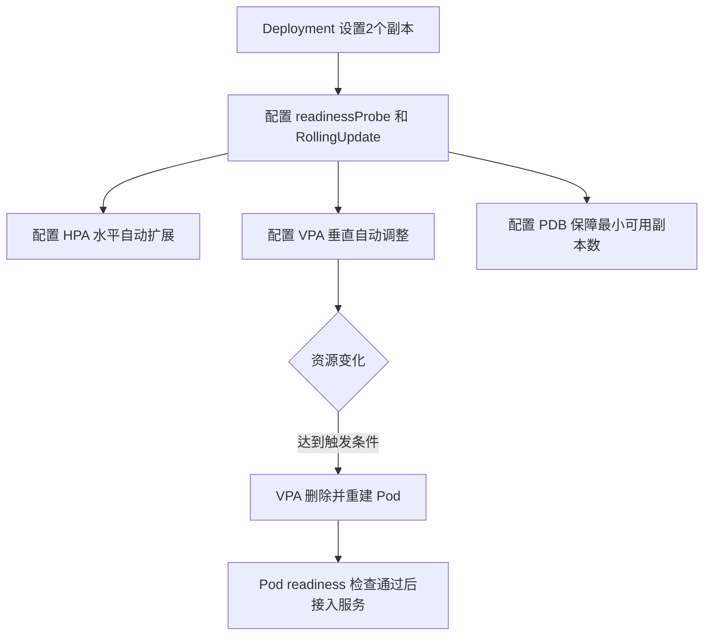

在 GKE 中，除了我们常见的 **HPA（Horizontal Pod Autoscaler）** 进行横向扩展（增加/减少 Pod 数量）以外，**垂直扩展（Vertical Scaling）** 也是一个重要机制，通常由 **VPA（Vertical Pod Autoscaler）** 实现。下面我系统性说明这两个扩展方式及其组合使用方法。

---

## **1. 什么是垂直扩展（Vertical Scaling）**

**\*垂直扩展** 是指 **调整 Pod 的 CPU 和内存资源请求（request）和限制（limit）**，也就是说，不是增加 Pod 数量，而是 **提升或降低单个 Pod 的“规格”** 来适应负载\*。

在 GKE 中，使用 **VPA（Vertical Pod Autoscaler）** 实现。它能基于监控的资源使用情况动态地推荐或直接修改 Deployment/StatefulSet 的资源配置。

---

## **2. 和 HPA 的对比**

| **项目** | **HPA（Horizontal）**                     | **VPA（Vertical）**                       |
| -------- | ----------------------------------------- | ----------------------------------------- |
| 扩展维度 | Pod 数量（副本数）                        | Pod 资源规格（CPU/mem requests & limits） |
| 触发条件 | CPU 利用率、内存、Prometheus 自定义指标等 | 历史资源使用情况（自动推荐/调整）         |
| 适用场景 | 可横向扩展的服务，如 stateless 应用       | 对资源敏感、无法水平扩展的服务            |
| 调整行为 | 增加/减少 Pod 数量                        | 修改 Pod 的资源请求，可能触发重新创建 Pod |
| 常见限制 | 容器资源配额不足、冷启动慢                | 修改后需要重启 Pod；不适合频繁波动的场景  |

---

## **3. 是否可以同时配置 VPA 和 HPA？**

可以**同时配置，但有前提条件**：

- 默认情况下，**HPA 和 VPA 是有冲突的**，因为 HPA 和 VPA 可能会同时修改 resources.requests.cpu，造成不一致。
- 为了兼容，**必须配置 VPA 只调整 memory 或仅做 recommendation**。

### **推荐做法：**

- **启用 HPA 管理副本数**
- **VPA 设置为只推荐，或仅管理 memory**

示例：

```
updatePolicy:
  updateMode: "Off"  # 表示 VPA 只提供推荐，不修改实际资源配置
resourcePolicy:
  containerPolicies:
  - containerName: "*"
    controlledResources: ["memory"]  # 只让 VPA 管理内存
```

---

## **4. 如何配置 VPA（垂直扩展）**

### **步骤一：启用 VPA 组件（GKE 已默认开启）**

无需手动安装，只需部署 VPA 对象。

---

### **步骤二：创建 VPA 对象**

示例 YAML：

```
apiVersion: autoscaling.k8s.io/v1
kind: VerticalPodAutoscaler
metadata:
  name: example-vpa
  namespace: default
spec:
  targetRef:
    apiVersion: "apps/v1"
    kind: Deployment
    name: my-deployment
  updatePolicy:
    updateMode: "Auto"  # 可选 Off、Initial、Auto
  resourcePolicy:
    containerPolicies:
    - containerName: "*"
      controlledResources: ["cpu", "memory"]
      minAllowed:
        cpu: "100m"
        memory: "200Mi"
      maxAllowed:
        cpu: "1000m"
        memory: "1Gi"
```

> **注意**：如果你开启了 Auto 模式，当 VPA 检测到资源不足，会自动重启 Pod 并应用新的 resource requests/limits。

---

### **步骤三：查看推荐结果**

```
kubectl describe vpa example-vpa
```

会显示类似：

```
Recommendation:
    Container: my-container
        Target CPU: 250m
        Target Memory: 512Mi
```

---

## **结论总结**

```
- HPA 适合负载波动频繁的无状态服务。
- VPA 适合负载稳定或无法横向扩展的服务。
- 可以一起使用，但需配置 VPA 避免冲突（只推荐或只改 memory）。
```

---

### **Mermaid 流程图示意：HPA 与 VPA 协同**

```
graph TD;
    A[负载上升] --> B{扩展方式判断}
    B -->|CPU使用率高| C[HPA 扩展 Pod 数量]
    B -->|Pod资源不足| D[VPA 推荐资源规格]
    D --> E{UpdatePolicy}
    E -->|Auto| F[VPA 自动调整并重建 Pod]
    E -->|Off| G[仅推荐，无动作]
```

如果你需要，我可以再提供一个完整 HPA+VPA 的兼容 YAML 配置示例。是否需要？

当 VPA 检测到资源不足，会自动重启 Pod 并应用新的 resource requests/limits 那么这个过程如何确保服务高可用.比如我们生产环境都是默认一个 Deployment 至少 2 个 Pod.

这是一个非常关键的问题，特别是在生产环境中运行服务时，**如何在 VPA 自动调整资源时保障高可用性** 是必须要考虑的重点。

下面我从 **行为机制、可用性保障策略、最佳实践配置** 三个方面来详细解释。

---

## **🧠 1. VPA 如何更新 Pod 资源**

当 VPA 检测到某些 Pod 使用的 CPU 或 Memory 长期超过配置的 requests/limits 时，会按照你设置的 updatePolicy：

- Off: 不做任何动作，只提供推荐
- Initial: 只在 Pod 初次创建时使用推荐值
- Auto: **删除旧的 Pod 并使用推荐的资源配置重建 Pod**

⚠️ 注意：VPA 不能 patch live Pod，它必须删除并重建，这可能造成瞬间的 Pod 缺失。

---

## **🛡️ 2. 高可用保障措施（重点）**

### **✅ 建议：**

### **配置副本数 >=2 且启用 Rolling Update 策略**

你说的很好 —— 如果是 Deployment 且副本数设为 2+，并使用默认的 RollingUpdate 策略，K8s 会确保：

- 每次只重建一个 Pod
- 确保 minAvailable 的 Pod 数量满足需求（默认不全部下线）

### **✅ 配置示例：Deployment 中 RollingUpdate 策略**

```
strategy:
  type: RollingUpdate
  rollingUpdate:
    maxUnavailable: 1
    maxSurge: 1
```

这确保了：

- 最多只能有 1 个 Pod 被终止
- 可额外调起 1 个 Pod，保障无缝迁移

---

## **✅ 配置 PodDisruptionBudget（PDB）**

为了进一步保障在 VPA、手动操作或集群事件（如升级）下的可用性，建议设置 PDB。

示例：

```
apiVersion: policy/v1
kind: PodDisruptionBudget
metadata:
  name: myapp-pdb
spec:
  minAvailable: 1
  selector:
    matchLabels:
      app: myapp
```

这样在 VPA 执行删除 Pod 前，会先判断 PDB，确保服务还有可用副本。

---

## **✅ readinessProbe + readinessGate（配合服务剔除）**

当 VPA 触发 Pod 删除并重建时，新 Pod 需要经历：

- Pull 镜像、启动容器
- readinessProbe 检查通过后才会被加回到负载均衡中（如 kube-proxy、Service 或 GLB）

### **示例：**

```
readinessProbe:
  httpGet:
    path: /healthz
    port: 8080
  initialDelaySeconds: 10
  periodSeconds: 5
```

这可以确保新 Pod 准备就绪后才开始接收请求，保障请求不中断。

---

## **📘 总结：高可用关键点**

| **机制**            | **说明**                                   |
| ------------------- | ------------------------------------------ |
| 多副本 (>=2)        | 确保不会因重建导致服务中断                 |
| RollingUpdate       | 控制最大中断数与最大调度数                 |
| PodDisruptionBudget | 限制同时可中断的 Pod 数量，增强 VPA 容忍性 |
| readinessProbe      | 确保新 Pod 准备好才接收流量                |

---

## **✅ Mermaid 流程图：VPA 自动更新流程 + 高可用保障**

```
graph TD;
    A[VPA 检测资源不足] --> B{updatePolicy == Auto}
    B -->|是| C[删除老 Pod]
    C --> D[创建新 Pod]
    D --> E[执行 readinessProbe]
    E --> F{通过检查?}
    F -->|是| G[Pod 加入 Service 接收流量]
    F -->|否| H[等待通过，暂不接收流量]
    B -->|否| I[仅推荐，不触发重建]
```

---

如果你希望我为你生成一个示例 YAML 文件，包含 HPA + VPA + PDB + readinessProbe 的完整配置，可以随时告诉我。这个组合就是生产级 HPA+VPA 共存的稳定方案。

好的，我们继续从**生产级的配置角度**，补充一个完整的 **HPA + VPA + PDB + readinessProbe** 的最佳实践示例，便于你直接在 GKE 上部署验证。

---

## **✅ HPA + VPA + PDB + readinessProbe 配置示例（完整 YAML）**

这个例子以 myapp 为例，部署两个副本，自动横向扩展（HPA）+ 垂直自动调整资源（VPA）+ 高可用控制（PDB）+ 健康检查：

```
---
apiVersion: apps/v1
kind: Deployment
metadata:
  name: myapp
spec:
  replicas: 2
  strategy:
    type: RollingUpdate
    rollingUpdate:
      maxUnavailable: 1
      maxSurge: 1
  selector:
    matchLabels:
      app: myapp
  template:
    metadata:
      labels:
        app: myapp
    spec:
      containers:
        - name: myapp
          image: gcr.io/my-project/myapp:latest
          ports:
            - containerPort: 8080
          resources:
            requests:
              cpu: "200m"
              memory: "256Mi"
            limits:
              cpu: "500m"
              memory: "512Mi"
          readinessProbe:
            httpGet:
              path: /healthz
              port: 8080
            initialDelaySeconds: 5
            periodSeconds: 5
---
apiVersion: policy/v1
kind: PodDisruptionBudget
metadata:
  name: myapp-pdb
spec:
  minAvailable: 1
  selector:
    matchLabels:
      app: myapp
---
apiVersion: autoscaling/v2
kind: HorizontalPodAutoscaler
metadata:
  name: myapp-hpa
spec:
  scaleTargetRef:
    apiVersion: apps/v1
    kind: Deployment
    name: myapp
  minReplicas: 2
  maxReplicas: 5
  metrics:
    - type: Resource
      resource:
        name: cpu
        target:
          type: Utilization
          averageUtilization: 70
---
apiVersion: autoscaling.k8s.io/v1
kind: VerticalPodAutoscaler
metadata:
  name: myapp-vpa
spec:
  targetRef:
    apiVersion: apps/v1
    kind: Deployment
    name: myapp
  updatePolicy:
    updateMode: "Auto"
  resourcePolicy:
    containerPolicies:
      - containerName: '*'
        minAllowed:
          cpu: "100m"
          memory: "128Mi"
        maxAllowed:
          cpu: "1"
          memory: "1024Mi"
```

---

## **🔍 说明与实践建议**

| **项目**            | **说明与建议**                                                   |
| ------------------- | ---------------------------------------------------------------- |
| Deployment.replicas | 最少设为 2，避免重启时无 Pod 服务                                |
| RollingUpdate       | 默认配置即可，无需修改（maxUnavailable=1）                       |
| HPA + VPA           | 共存时需配合资源范围，避免频繁缩放（如限制 min/max）             |
| VPA updateMode      | 设置为 Auto，表示会主动删除 Pod 重建                             |
| resourcePolicy      | 避免 VPA 分配超出物理限制的资源，建议设 minAllowed 和 maxAllowed |
| PDB                 | 保证删除 Pod 时至少有一个存活，防止 VPA 或集群升级导致全下线     |
| readinessProbe      | 确保新 Pod 启动准备好后才进入流量路径                            |

---

## **🛠️ 补充建议（可选项）**

### **✅ 日志监控建议**

建议结合如下工具监控 VPA 行为是否影响稳定性：

- 使用 Prometheus + Grafana 查看 VPA 重启次数
- 日志中 grep vpa-recommender 或 vpa-updater 查看推荐与删除记录
- 如果频繁重启，可先切回 updateMode: Initial 观测推荐值，再评估是否开启自动更新

---

## **✅ Mermaid：部署与扩展策略的综合视图**



---

如果你有实际的 GKE 环境想做测试部署，我可以帮你生成 GKE 兼容的 kubectl apply 流程或提供 Helm Chart 模板结构。如果你已经使用 ArgoCD / Kustomize 等工具部署，

当然可以，以下是对你上面 YAML 中 **VPA（VerticalPodAutoscaler）配置部分**的逐行详细解析，帮助你完全掌握每一行的含义与作用：

---

```
apiVersion: autoscaling.k8s.io/v1
```

- 使用 autoscaling.k8s.io/v1 API 版本，这是 VPA 的稳定版（v1）。
- 要确保你的 GKE 集群启用了 VPA 组件（Recommender、Updater、Admission Controller）。

---

```
kind: VerticalPodAutoscaler
```

- Kubernetes 对象类型是 VerticalPodAutoscaler。

---

```
metadata:
  name: myapp-vpa
```

- 给这个 VPA 实例命名为 myapp-vpa，你可以根据你的服务名命名。
- 注意：一个 VPA 只能绑定一个 workload（如 Deployment）。

---

```
spec:
  targetRef:
    apiVersion: apps/v1
    kind: Deployment
    name: myapp
```

- targetRef 表示 VPA 控制的目标对象。
- apiVersion/kind/name 三者一起指定它关联的是哪个 workload，这里是名为 myapp 的 Deployment。
- VPA 会基于此 Deployment 中容器的资源使用情况进行推荐与控制。

---

```
  updatePolicy:
    updateMode: "Auto"
```

- 指定 VPA 的更新模式：

| **模式** | **说明**                                                         |
| -------- | ---------------------------------------------------------------- |
| Off      | 不做任何推荐或变更，仅监控资源使用。                             |
| Initial  | 只在 Pod 首次创建时推荐资源，不自动重启。                        |
| Auto     | 自动删除并重建 Pod 以调整资源。⚠️ 生产中应与 HPA、PDB 配合使用。 |

---

```
  resourcePolicy:
    containerPolicies:
      - containerName: '*'
```

- 为哪些容器设定资源策略。
- '\*' 表示对 Pod 中所有容器生效（适用于简单场景，多个容器也可以用数组方式分别指定）。

---

```
        minAllowed:
          cpu: "100m"
          memory: "128Mi"
```

- 设置 **资源请求的最小推荐值**。
- 避免 VPA 把资源调得太小，导致服务抖动或 OOM（适合有一定 baseline 的服务）。

---

```
        maxAllowed:
          cpu: "1"
          memory: "1024Mi"
```

- 设置 **资源请求的最大推荐值**。
- 避免 VPA 把 Pod 调得太大，导致调度失败（如所在节点资源不足）或成本上升。

---

## **📝 总结表格**

| **字段**            | **含义**                                                     |
| ------------------- | ------------------------------------------------------------ |
| targetRef           | VPA 控制的目标资源（Deployment/StatefulSet）                 |
| updateMode          | 是否自动更新资源，并重启 Pod（Auto 会直接触发滚动重启）      |
| minAllowed          | 最小推荐资源，防止资源不足（单位为 Kubernetes 标准资源单位） |
| maxAllowed          | 最大推荐资源，防止资源浪费或调度失败                         |
| containerName: '\*' | 对所有容器生效，也可细粒度指定容器名                         |

---

是否需要我也演示下如何查看 VPA 实际推荐的值（比如用 kubectl describe vpa myapp-vpa 查看当前建议的 CPU/内存），或者帮你排查 VPA 没生效的场景？可继续深入。
