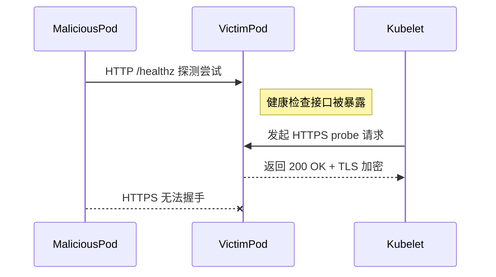
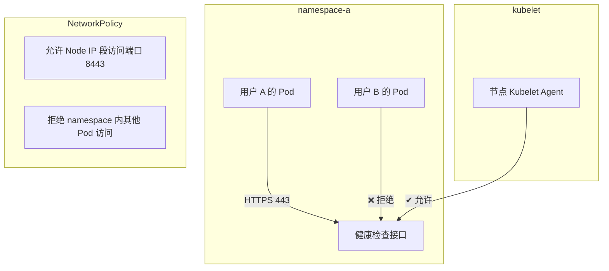

在多租户（multi-tenant）Kubernetes 集群中，尤其是同一个 namespace 中部署了不同用户的服务时，将 Deployment 中的 livenessProbe、readinessProbe 或 startupProbe 使用 HTTPS 协议而不是 HTTP，有以下几个安全层面的好处：

✅ 使用 HTTPS 健康检查的安全优势

|                                     |                                                                                                                                                                                                                  |
| ----------------------------------- | ---------------------------------------------------------------------------------------------------------------------------------------------------------------------------------------------------------------- |
| 安全点                              | 说明                                                                                                                                                                                                             |
| 1. 防止明文传输敏感信息             | 如果健康检查涉及认证信息（如 Token）、Cookie 或内部状态数据，HTTP 是明文传输，容易被抓包或监听。HTTPS 可确保 TLS 加密，防止中间人攻击（MitM）和窃听。                                                            |
| 2. 限制 namespace 内部服务监听      | 在同一个 namespace 里部署多个用户服务时，某些 Pod 可以通过监听其他 Pod 的 IP 和端口尝试连接，若健康检查走 HTTP，容易被滥用或探测（HTTP 无需握手即响应）。而 HTTPS 增加了协议复杂性和验证要求，更难被模拟和利用。 |
| 3. 防止 spoofing 与 forged response | 若是 HTTP，只要有 Pod 监听对应端口即可响应健康检查，可能绕过真实健康状态。而 HTTPS 会检查证书链，伪造 HTTPS 服务成本和难度高得多。                                                                               |
| 4. 利于与 mTLS 架构对齐             | 如果你已经在采用 GCP HTTPS Load Balancer + mTLS 或是 Kong 的双向认证，健康检查用 HTTPS 有助于统一通信方式，简化认证逻辑和审计策略。                                                                              |
| 5. 减少安全审计时 false positive    | 使用 HTTP 健康检查可能在安全审计中被标记为“明文通信”，从而引发告警。使用 HTTPS 则符合现代安全基线。                                                                                                              |

⚠️ 注意事项

|                 |                                                                                                                                                                                                                 |
| --------------- | --------------------------------------------------------------------------------------------------------------------------------------------------------------------------------------------------------------- |
| 项目            | 建议                                                                                                                                                                                                            |
| 证书管理        | 如果 Pod 内部使用 HTTPS，需要为每个 Pod 提供可信证书（可使用自签 CA + sidecar 或 SPIRE/SDS 下发证书）。否则 kubelet 健康检查将因为证书不可信失败。                                                              |
| 跳过 TLS 验证？ | kubelet 的默认行为是不验证证书的 Common Name / SAN 或签发机构，这意味着你可以在 probe 中使用 https，但不用配置复杂的 CA 信任链 —— 适合内部使用。若开启强校验（如通过 Istio），需确保 kubelet 信任目标服务证书。 |
| 性能开销        | 相比 HTTP，HTTPS 存在微小的握手和加密开销，但对现代集群可忽略不计。                                                                                                                                             |

✅ 实际示例

livenessProbe:

httpGet:

scheme: HTTPS

path: /healthz

port: 8443

initialDelaySeconds: 5

periodSeconds: 10

✅ 推荐实践（多用户 namespace 下）

1. 为所有用户的服务统一使用 HTTPS 接口（即便内部），最小化误用风险。
2. 所有 probe 使用 scheme: HTTPS，禁用 HTTP。
3. 如果结合了 service mesh（如 Istio 或 Linkerd），建议开启 mTLS + 授权策略。
4. 日志中隐藏 probe 相关请求记录，防止被利用猜测路径。

📌 Mermaid 流程图：恶意 Pod 尝试探测健康检查



如果你们未来有进一步的安全要求，比如服务之间只允许通过 Sidecar 通信、或 Zero Trust 架构接入，那么使用 HTTPS 健康检查是向更强隔离能力的一步过渡。

如需，我也可以进一步帮你出一份安全策略基线文档，涵盖 namespace 共享场景下的通信约束、认证策略等。

继续补充：

🛡️ 进阶增强建议（续）

|                                       |                                                                                                                                                                     |
| ------------------------------------- | ------------------------------------------------------------------------------------------------------------------------------------------------------------------- |
| 安全措施                              | 说明                                                                                                                                                                |
| 📌 NetworkPolicy 限制探测来源         | 明确声明：只有 kubelet 所在节点的 IP 范围能访问 Pod 的 probe 端口，例如 10256/Node IP。这样即使是 HTTP，也能一定程度防止被 tenant 间滥用探测。                      |
| 🔐 统一探针路径并加验证头             | 使用 /internal-healthz、/liveness-check 等非默认路径，并在服务端校验自定义 header，例如 X-Probe-Token: abc123，防止普通请求访问探针路径（适合 HTTP 场景下做加固）。 |
| 🔁 Istio / mTLS mesh 探针绕行配置     | 如果你的服务开启了 mTLS Sidecar，确保健康检查端口要么使用 HTTPS，要么配置 passthrough/exclude 以让 kubelet 能访问。                                                 |
| 📘 使用 startupProbe 限制初期失败行为 | 避免在初始化阶段暴露过多错误细节，提高安全性。例如初期使用 HTTPS 且返回 minimal 响应，不返回栈信息或敏感配置状态。                                                  |

✅ 全面 HTTPS 健康检查架构建议

适用场景：

- 多用户共享 namespace（但暂未启用全网隔离）
- 服务架构逐步向 Zero Trust 演进
- 有一定证书管理能力或计划引入 SPIRE、Istio、Consul Connect 等工具



✅ 示例强化配置片段（带 token 校验）

假设服务监听 8443，使用 HTTPS 并验证 Header 中的 Token
```yaml
livenessProbe:

httpGet:

scheme: HTTPS

path: /internal-healthz

port: 8443

httpHeaders:

- name: X-Probe-Token

value: abc123securetoken

initialDelaySeconds: 10

timeoutSeconds: 2

periodSeconds: 10
```

应用容器中检查 header：
```java
@GetMapping("/internal-healthz")

public ResponseEntity<String> probe(HttpServletRequest request) {

String token = request.getHeader("X-Probe-Token");

if (!"abc123securetoken".equals(token)) {

return ResponseEntity.status(HttpStatus.UNAUTHORIZED).build();

}

return ResponseEntity.ok("ok");

}
```
🎯 总结：启用 HTTPS 健康检查的实战价值


|           |                                                              |
| --------- | ------------------------------------------------------------ |
| 分类      | 价值                                                         |
| 🔐 安全性 | 防止被嗅探、伪造和滥用。避免敏感状态信息泄露。               |
| 🧱 隔离性 | 降低同 namespace 下横向攻击风险。配合 NetworkPolicy 更有效。 |
| ⚙️ 一致性 | 与生产环境统一为 HTTPS 通信，减少调试、部署差异。            |
| 📊 合规性 | 满足零信任、安全审计、零明文通信等标准要求。                 |


如果你计划进一步隔离或多团队共用同一 namespace，我可以帮你出一份更完整的安全硬化 checklist，涵盖：

- Pod 间通信隔离策略（包括 probe 的特殊规则）
- 探针路径防滥用规范
- kubelet + probe 特殊访问需求规划（如是否需绕过 mTLS）
- 安全审计日志采集建议

是否需要？我可以基于你当前 GKE 或 GCE 架构给出细化建议。
