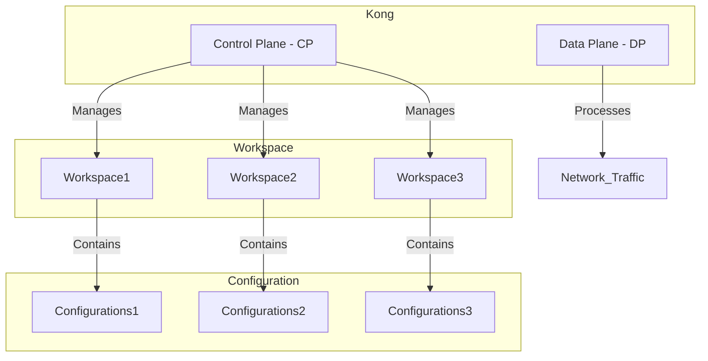
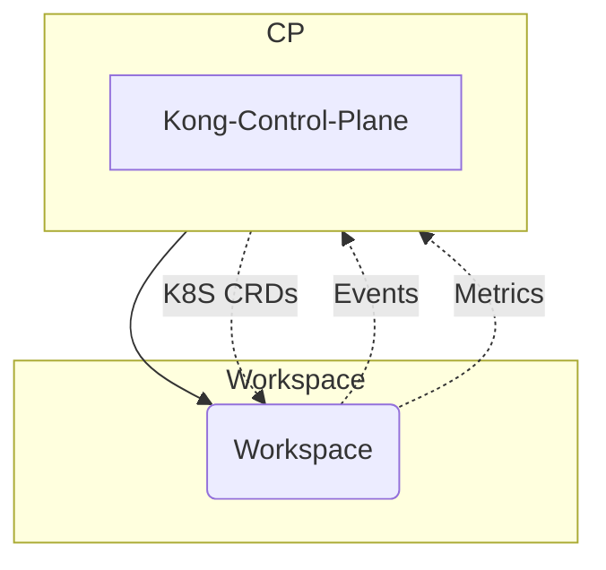
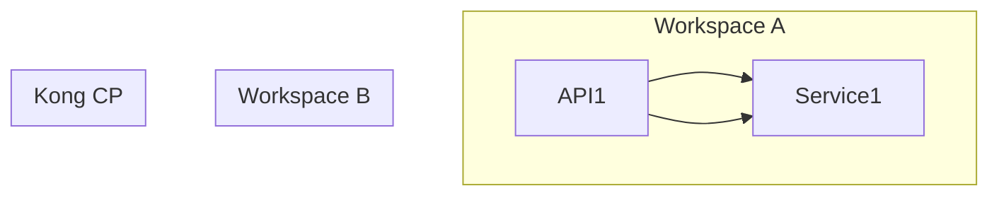

在 Kong 的配置中，CP 和 DP 分别代表 Control Plane 和 Data Plane，它们是 Kong 的架构组件。CP 负责管理和配置 Kong 节点，而 DP 则处理实际的 API 流量。CP 和 DP 之间通过 WSS（WebSocket Secure）协议进行通信，确保配置的同步和实时性。

CP（Control Plane）负责以下工作：

1. 管理 API 和插件的配置信息。
2. 接收来自管理员的配置更改请求，如添加、更新或删除 API、插件等。
3. 将配置变更传播给 DP，以便应用到实际的 API 流量处理。
4. 提供管理界面（例如 Kong 的 Admin API）供管理员操作。

DP（Data Plane）负责以下工作：

1. 处理实际的 API 流量，包括请求的转发、鉴权、限流等。
2. 从 CP 接收配置信息，并根据配置进行流量处理。
3. 向 CP 报告节点的健康状况和统计数据，以帮助监控和决策。

当谈到 Kong 的 CP（Control Plane）和 DP（Data Plane）时，
CP 是负责管理和配置的控制平面，
而 DP 是处理网络流量的数据平面。

Workspace 是 Kong 的一个重要概念，

它允许您在同一个 Kong 实例内部管理多个独立的环境。

Workspace 与 CP 之间的关系是这样的：每个 Workspace 是一个隔离的配置环境，可以有自己的插件、服务、路由等配置。CP 是管理这些 Workspace 的控制平面，您可以在 CP 中创建、编辑和删除 Workspace，以及在 Workspace 中配置各种 Kong 对象。每个 Workspace 中的配置是相互隔离的，这使得您可以在同一个 Kong 实例上管理多个环境，比如开发、测试和生产。

通过 Workspaces，您可以在同一个 Kong 实例上管理多个环境的配置，而不会相互干扰。这有助于简化多环境部署和管理，同时提高了配置的可维护性和灵活性。

当涉及 Kong 的 CP（Control Plane，控制平面）和 Workspace 之间的关系时，可以将其理解为以下几个关键点：

1. **Control Plane（控制平面）**：CP 是 Kong 的管理和配置部分，负责处理 API、插件、路由、服务等的配置和管理。它提供了 API 和界面，供管理员和开发人员使用，以便创建、修改和删除 Kong 的各种配置元素。CP 与实际处理网络流量的 Data Plane（数据平面）是分离的。

2. **Workspace（工作空间）**：Workspace 是 Kong 中的一个重要概念，它允许您在同一个 Kong 实例内部创建多个独立的配置环境。每个 Workspace 都可以拥有自己的 API、插件、路由等配置，这些配置是相互隔离的，不会相互干扰。这意味着您可以在同一个 Kong 实例上管理多个环境，如开发、测试和生产，而不会发生冲突。

3. **关系**：CP 是管理和控制 Workspace 的入口。您可以在 CP 中创建、编辑和删除 Workspace，还可以在 CP 中选择要操作的特定 Workspace，然后在该 Workspace 中配置 Kong 的各种对象。CP 允许您在不同的 Workspace 之间切换，以便有效地管理和维护各个环境的配置。

综上所述，Workspace 是一种机制，允许您在同一个 Kong 实例上管理多个隔离的环境，而 CP 是您与这些 Workspace 交互的接口。通过 Workspace，您可以在不同的环境中配置 Kong，同时保持这些配置的隔离性，从而提高了部署和管理的灵活性和
非常抱歉，我理解您的意思了。以下是经过修正的 Mermaid 格式的 Markdown 流程图，更清楚地展示了 CP、DP 和 Workspace 之间的关系：

复制上述 Markdown 代码并在支持 Mermaid 图的环境中查看，您将会看到一个图表，清楚地显示了 Control Plane（CP）与 Data Plane（DP）之间的关系，以及它们与 Workspace 和数据流之间的交互。

关于 WebSocket 支持，Kong 高级版本中确实支持 WebSocket 的 API。您可以通过 Kong 的插件来启用 WebSocket 支持，例如"websocket-termination"插件。这使得 Kong 能够处理 WebSocket 连接，以及在 WebSocket 连接上执行插件功能，如认证、鉴权、限流等。

总之，CP 和 DP 在 Kong 中扮演着不同的角色，CP 负责配置和管理，DP 负责实际的 API 流量处理，它们通过 WSS 协议进行通信以保持同步。高级版本的 Kong 支持 WebSocket 的 API，并且您可以通过插件来启用和配置 WebSocket 支持功能。

这里是使用 mermaid 绘制 Kong 的 CP 和 Workspace 之间关系的 markdown 代码:

这个 mermaid 图展示了:

- Kong 的 CP 和 Workspace 之间的关系
- CP 通过 K8S CRDs 来配置 Workspace
- Workspace 通过 Events 和 Metrics 来与 CP 进行交互

CP 作为控制平面,负责配置和管理 Workspace。Workspace 作为数据平面,执行真正的服务流量处理。两者通过 CRDs, Events 和 Metrics 相互协作。

Kong CP（Kong Control Plane）的工作区（Workspace）主要用于多租户环境和版本控制。在 Kong CP 中，不同的工作区是相互隔离的，这意味着不同工作区内的配置是分离的，包括 API 定义。因此，你可以在不同的工作区中部署完全相同的 API，而它们之间不会互相干扰。

这种隔离性使得在多个环境中或为不同的客户提供服务时能够更轻松地管理和控制 API 配置的版本和访问权限。但请注意，Kong CP 中的工作区管理需要额外的配置和权限控制，以确保不同工作区之间的隔离性。

以下是一个简单的 Mermaid 流程图，说明了 Kong CP 工作区的隔离性：

上面的图示示例了两个工作区 A 和 B，它们都使用相同的 API1，但它们是相互隔离的，与 Kong CP 中的 Service1 关联。这意味着你可以在不同的工作区中定义和配置 API，而它们不会相互冲突。

对于 Kong 网关来说,如果 Control Plane (CP,控制平面)支持了某个新插件,那么相应的 Data Plane (DP,数据平面)也需要更新才能支持该插件。

Kong 的架构分为控制平面(CP)和数据平面(DP)两部分:

- 控制平面负责管理 Kong 的配置,包括添加/删除服务、路由、插件等。当在 CP 中启用某个新插件时,它只是将该插件的配置持久化到 Kong 的存储层(如 PostgreSQL)中。

- 数据平面负责实际处理客户端请求,包括执行插件逻辑。因此,只有当 DP 也支持该新插件时,插件的处理逻辑才能在请求时真正生效。

所以 CP 和 DP 需要保持版本一致,确保 CP 配置的所有插件都能被 DP 正确执行。如果 CP 支持的插件在 DP 中不存在或版本不匹配,该插件将无法正常工作。因此,当 CP 中添加新插件支持时,对应的 DP 版本也需要更新以支持该插件。

可以，一个 **Kong Control Plane (CP)** 是支持连接多个 **Data Plane (DP)** 的。

这是 Kong Gateway 在 **Hybrid 模式** 下的设计初衷：

- **CP（Control Plane）**：负责存储和分发配置（服务、路由、插件、证书等），通过数据库（DB 或 DB-less）来管理。
- **DP（Data Plane）**：只负责转发流量，不需要连接数据库，而是从 CP 拉取配置。

### **你的场景**

- 你在 **两个不同的 GCP 项目（Project）** 部署了 **Kong DP**。
- 想用同一个 **Kong CP** 统一管理它们。

这是可行的，但要注意几个点：

1. **网络连通性**

    - DP 必须能访问 CP 的 **control_plane API 端口**（默认 8005/gRPC，8446/gRPC+TLS）。
    - 不论是 VPC Peering、VPN、Cloud Interconnect 还是公网 IP，都要保证这条链路可靠。

2. **证书与安全**

    - Hybrid 模式下 CP 和 DP 会用 **mTLS** 来做身份验证。
    - 你需要在两个 Project 里的 DP 都配置相同的 CP 提供的证书/密钥。

3. **延迟和稳定性**

    - 多个 Project 跨区域时，DP 同步配置的延迟可能增加，但一般影响不大。
    - Kong 建议：CP 最好在稳定的 Region 里，DP 尽量靠近用户流量入口。

4. **可观测性和隔离**

    - 通过标签、Workspaces 或分环境的方式区分不同 Project 的 DP。
    - 确保日志和 metrics 采集上能知道流量属于哪个 Project。

### **总结**

✅ 可以，一个 CP 可以同时管理多个 DP，哪怕这些 DP 分布在不同的 GCP Project。

⚠️ 关键是 **网络打通 + mTLS 配置 + 可观测性/隔离设计**。

要不要我帮你画一个 **“一个 CP 管理跨项目多个 DP”的拓扑图**，清楚展示网络和安全点？
