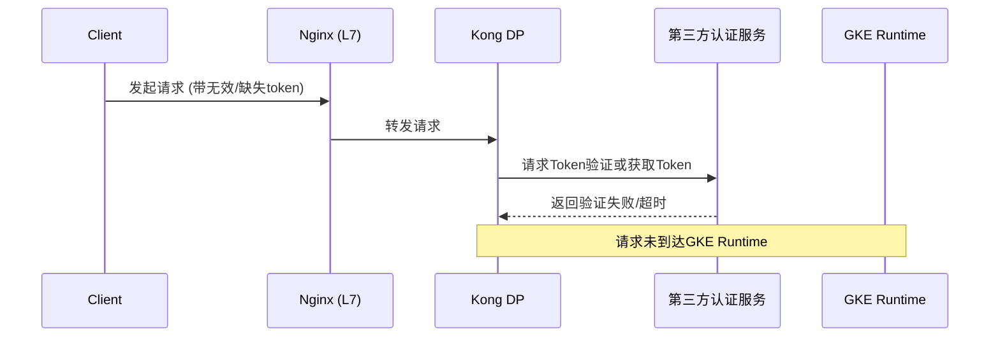
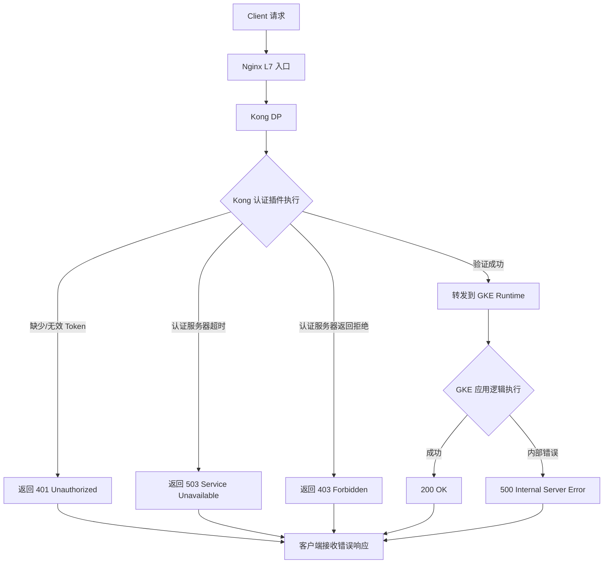
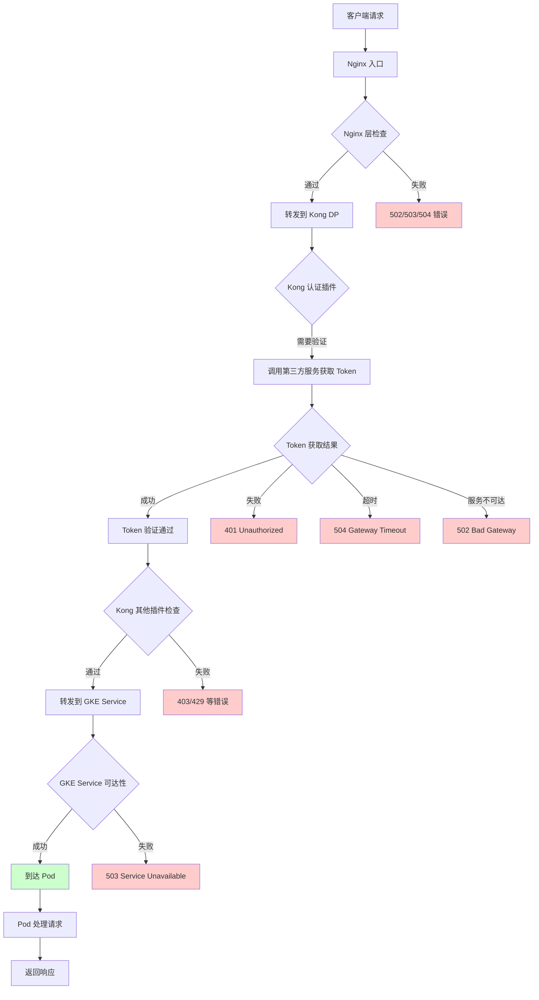
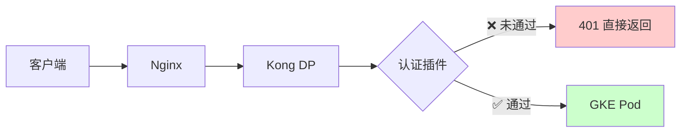

非常好的问题 👍

你这个流程（Nginx → Kong DP → GKE Runtime）中，确实需要清楚地了解 每个阶段的错误来源与响应行为，特别是在启用了 Kong 认证插件（如 OIDC、JWT、Key Auth 等） 的情况下。下面我帮你拆解整个请求链路，说明当认证失败或第三方认证服务不可用时，请求会卡在什么阶段、返回什么错误码，以及是否会触达到你的 GKE Runtime。


🧩 一、请求流程结构分析


🧠 二、不同阶段的错误来源与返回行为

|   |   |   |   |   |   |
|---|---|---|---|---|---|
|阶段|模块|典型错误情况|返回HTTP状态码|错误说明|请求是否进入GKE|
|1|Nginx (入口层)|Nginx本身无法访问Kong（连接超时、DNS失败）|502 / 504|通常为上游服务不可达|❌ 否|
|2|Kong DP|插件执行阶段出错（如请求验证服务失败）|401 / 403 / 500|插件认证失败、或插件调用外部认证接口异常|❌ 否|
|3|Kong → Auth Server|获取token超时、无效凭证、认证服务器挂掉|401 / 503|插件可能返回”Invalid credentials”或”Upstream timeout”|❌ 否|
|4|Kong → GKE Runtime|当认证成功后，Kong将请求转发|200 / 业务码|请求进入GKE|✅ 是|
|5|GKE Runtime|Runtime内部应用逻辑错误|500 / 业务码|应用内部错误|✅ 是|


🧰 三、关键逻辑说明
1. Kong 插件认证逻辑是“前置阻断式”  
    
- 插件在 access phase 阶段执行。
- 如果认证失败（例如第三方Token服务返回401或超时），Kong会立即终止请求并返回错误响应，不会继续往下游（GKE Runtime）转发。
- 所以 ✅ 你的API确实是受保护的，如果没有合法token，请求永远不会打到你的GKE Pod。

4. 典型错误返回示例  
- Token缺失：
```json
{
  "message": "Unauthorized"
}
```
2.   
    
- 返回 401 Unauthorized
- 第三方验证超时：
-   
  
```json
{
  "message": "Authentication service unavailable"
}
```
- Token验证失败：
-   

```json
{
  "message": "Invalid credentials"
}
```
2.   
- 返回 403 Forbidden
-   
4. 认证成功后流程才继续到Runtime  
    

- Kong 验证通过后，会添加一些header（例如 X-Consumer-ID 或 X-Authenticated-User），再将请求转发给你的 GKE Runtime 服务。
- Runtime 接收时，通常已经是经过认证的安全请求。

6.   
    
🧩 四、示例日志参考（定位用）

在实际问题排查时，你可以通过以下日志判断卡点：

|   |   |   |   |
|---|---|---|---|
|节点|日志来源|关键字段|判断依据|
|Nginx|access.log|upstream_status|502/504表示Kong层不可达|
|Kong|kong.log / plugin.log|status / message|返回401/403时说明插件阻断|
|Kong|kong.log|service.name为空|表示未转发到下游服务（被拦截）|
|GKE Pod|container log|正常业务日志|无日志表示未触发到应用|

  
🧭 五、总结与建议


✅ 结论：

- 只要 Kong 插件认证未通过（包括第三方认证服务失败），请求不会到达 GKE Runtime。
- Kong 会直接返回 401/403/503 等错误给客户端。


✅ 建议：

1. 在 Kong 上为认证插件加上 明确的error log & metrics（可用 Prometheus plugin）。
2. 在 Kong DP 上配置 proxy-error 模板，使错误响应可读性更强。
3. 对 Auth 服务调用设置合理的 timeout 和 retries，避免认证慢导致整体卡顿。
4. 在 GKE Runtime 层面，可通过 header 判断请求来源是否合法（例如 X-Authenticated-User）。


是否希望我帮你画出一个包含 错误处理分支（Kong 插件认证失败 / 成功） 的完整 Mermaid 请求流程图？这样你可以放入内部文档或监控设计里。


非常好 👍

以下是完整的 请求流程 + 错误分支 的 Mermaid 流程图（可直接复制到你的文档中使用，例如 .md 文件或监控设计文档中）。


  

🔍 图解说明
  

|   |   |   |   |
|---|---|---|---|
|流程阶段|描述|典型状态码|请求是否进入 GKE|
|Nginx L7 入口|接收并转发请求到 Kong|502 / 504（Kong 不可达）|❌ 否|
|Kong 插件认证|执行验证逻辑，可能调用第三方 Auth Server|401 / 403 / 503|❌ 否|
|验证成功后|Kong 将请求转发到 GKE Runtime|200 / 业务状态码|✅ 是|
|GKE Runtime|应用层执行逻辑|200 / 500|✅ 是|

  
🧠 补充建议

1. 日志追踪建议  
    

- Nginx 日志记录 $upstream_status 可快速判断 Kong 是否返回错误。
- Kong 启用 request-id 或 correlation-id 插件，以便在多层日志中关联请求。
- GKE Runtime 只会记录已通过认证的请求，可安全地统计访问量。

3.   
    
4. 监控建议  
    

- 使用 Prometheus + Grafana 监控 Kong 插件错误率（如 401/403/503 比例）。
- 对认证超时（第三方 Auth）配置警报，避免 Token 获取链路成为瓶颈。

6.   
    
是否希望我再帮你补充一份 针对每个错误分支的日志定位示例表（包含 Nginx、Kong、GKE 三层的关键字段和典型日志样本）？这会非常适合你们排查“卡在哪一层”的问题。

# Claude 
# Kong 认证插件请求流程分析

## 问题分析

您的架构是：**Nginx → Kong DP → GKE Runtime**，Kong 上配置了第三方认证插件，需要从外部服务获取 token 才能访问后端服务。核心问题是：

1. 请求在各节点失败时的错误响应
2. 未通过认证的请求是否能到达 GKE Pod

## 完整请求流程图



## 各节点错误响应详解

### 1. Nginx 层错误

|错误码                    |触发条件       |说明                    |
|-----------------------|-----------|----------------------|
|502 Bad Gateway        |Kong DP 不可达|Nginx 无法连接到 Kong      |
|503 Service Unavailable|Kong 过载    |Kong 返回 503           |
|504 Gateway Timeout    |Kong 响应超时  |超过 Nginx proxy_timeout|

### 2. Kong 认证插件层错误

|错误码                      |触发条件       |返回位置        |
|-------------------------|-----------|------------|
|**401 Unauthorized**     |第三方服务返回认证失败|**Kong 插件层**|
|**401 Unauthorized**     |请求缺少必要的认证头 |**Kong 插件层**|
|502 Bad Gateway          |第三方认证服务不可达 |Kong 插件层    |
|504 Gateway Timeout      |第三方认证服务超时  |Kong 插件层    |
|500 Internal Server Error|插件内部错误     |Kong 插件层    |

### 3. Kong 其他插件层错误

|错误码                  |触发条件            |说明    |
|---------------------|----------------|------|
|403 Forbidden        |ACL/IP 限制失败     |权限不足  |
|429 Too Many Requests|Rate Limiting 触发|超过限流阈值|

### 4. GKE 层错误

|错误码                    |触发条件     |说明                      |
|-----------------------|---------|------------------------|
|503 Service Unavailable|Pod 全部不可用|无健康 Pod                 |
|504 Gateway Timeout    |Pod 处理超时 |超过 Kong upstream timeout|

## 核心问题解答

### ✅ 认证失败是否能到达 GKE Pod？

**答案：不能！**



**关键点：**

1. Kong 的认证插件在 **请求转发前** 执行
2. 认证失败会 **立即返回 401**，不会继续转发
3. 这是 Kong 插件执行顺序决定的（Authentication → Authorization → Upstream）

### 典型认证失败场景

```bash
# 场景 1: 缺少认证信息
curl -X GET https://your-domain.com/api/resource
# 返回: 401 Unauthorized
# 响应体: {"message": "Unauthorized"}

# 场景 2: Token 无效
curl -X GET https://your-domain.com/api/resource \
  -H "Authorization: Bearer invalid_token"
# 返回: 401 Unauthorized
# 响应体: {"message": "Invalid authentication credentials"}

# 场景 3: 第三方服务不可达
# 返回: 502 Bad Gateway
# 响应体: {"message": "An unexpected error occurred"}
```

## Kong 插件配置示例

### 外部认证插件配置

```yaml
plugins:
  - name: external-auth
    config:
      # 第三方认证服务地址
      auth_endpoint: https://auth.example.com/validate
      
      # 超时设置（毫秒）
      timeout: 5000
      
      # 失败时的行为
      on_failure: reject  # reject | allow
      
      # 错误响应配置
      error_status: 401
      error_message: "Authentication failed"
      
      # Token 提取配置
      token_header: Authorization
      token_type: Bearer
```

### 请求头转发配置

```yaml
plugins:
  - name: request-transformer
    config:
      # 在认证插件之后执行
      # 将验证成功的 token 信息传递给后端
      add:
        headers:
          - X-Auth-User-Id: ${auth.user_id}
          - X-Auth-Scope: ${auth.scope}
```

## 故障排查命令

### 1. 检查 Kong 插件状态

```bash
# 查看插件是否启用
curl -i http://kong-admin:8001/plugins

# 查看特定路由的插件
curl -i http://kong-admin:8001/routes/{route_id}/plugins
```

### 2. 模拟认证流程

```bash
# 测试第三方认证服务
curl -X POST https://auth.example.com/validate \
  -H "Content-Type: application/json" \
  -d '{"token": "test_token"}' \
  -v

# 测试完整流程（带认证）
curl -X GET https://your-domain.com/api/resource \
  -H "Authorization: Bearer valid_token" \
  -v
```

### 3. 查看 Kong 日志

```bash
# Kong DP 日志（GKE 环境）
kubectl logs -n kong deployment/kong-dp --tail=100 -f

# 过滤认证相关日志
kubectl logs -n kong deployment/kong-dp | grep -E "auth|401|unauthorized"
```

### 4. 检查 GKE Pod 访问日志

```bash
# 查看后端 Pod 是否收到请求
kubectl logs -n your-namespace deployment/your-app --tail=50

# 如果认证失败，这里应该 **没有任何日志**
```

## 监控指标建议

### Kong 层面监控

```yaml
# 关键指标
metrics:
  - kong_http_status{code="401"}  # 认证失败次数
  - kong_http_status{code="502"}  # 第三方服务不可达
  - kong_latency_bucket            # 请求延迟（含认证时间）
  - kong_upstream_target_health    # 后端健康状态
```

### 告警规则示例

```yaml
# Prometheus 告警规则
- alert: HighAuthFailureRate
  expr: rate(kong_http_status{code="401"}[5m]) > 10
  annotations:
    summary: "认证失败率过高"
    description: "5分钟内 401 错误超过 10 次/秒"

- alert: AuthServiceDown
  expr: kong_http_status{code="502"} > 0
  annotations:
    summary: "认证服务不可达"
    description: "第三方认证服务返回 502"
```

## 安全性验证清单

- [x] **认证插件优先级最高**：确保在所有其他插件之前执行
- [x] **未认证请求被拦截**：401 响应直接返回，不转发到后端
- [x] **第三方服务超时保护**：设置合理的 timeout 避免长时间阻塞
- [x] **错误信息脱敏**：不暴露内部服务详细信息
- [x] **监控覆盖**：401/502 错误有告警机制

## 注意事项

### ⚠️ 关键提醒

1. **认证插件执行顺序**

- 必须是请求链中 **第一个执行** 的插件
- 检查插件优先级配置

1. **第三方服务可用性**

- 建议配置 **失败重试** 和 **熔断机制**
- 设置合理的 **超时时间**（建议 3-5 秒）

1. **日志记录**

- 启用 Kong 的访问日志记录
- 记录认证失败的详细信息（脱敏后）

1. **缓存策略**

- 考虑对验证成功的 token 进行短期缓存
- 减少对第三方服务的调用压力

### 最佳实践

```lua
-- Kong 自定义插件示例（Lua）
-- 演示认证失败时的早期返回
function plugin:access(config)
    local token = kong.request.get_header("Authorization")
    
    if not token then
        return kong.response.exit(401, {
            message = "Missing authentication token"
        })
    end
    
    -- 调用第三方验证
    local res, err = http_client:request({
        url = config.auth_endpoint,
        headers = { Authorization = token }
    })
    
    if not res or res.status ~= 200 then
        -- ❌ 认证失败，立即返回，不继续转发
        return kong.response.exit(401, {
            message = "Invalid token"
        })
    end
    
    -- ✅ 认证成功，继续处理
end
```

-----

**总结**：您的 API 是受保护的，**未通过认证的请求绝对到达不了 GKE Pod**。Kong 认证插件会在请求转发前进行拦截，认证失败时直接返回 401，保护后端服务不受未授权访问。​​​​​​​​​​​​​​​​
