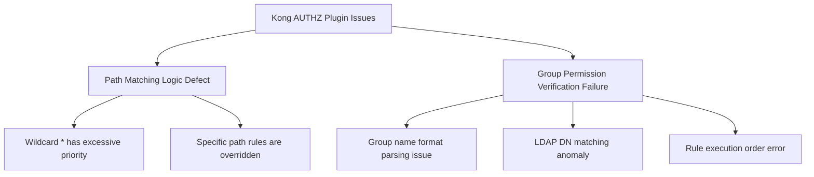
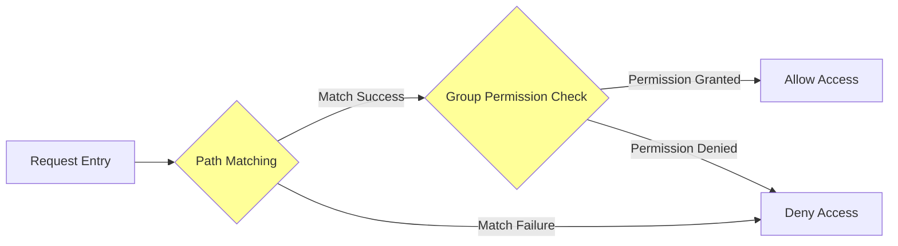
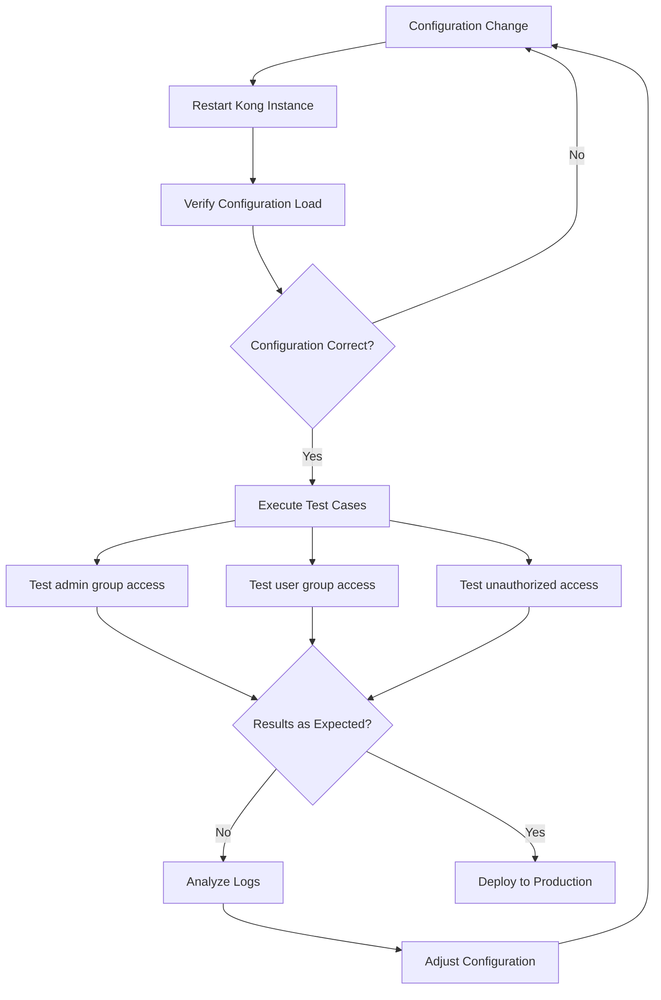

# Kong AUTHZ Plugin Path-based Group Check Issue Analysis

## 1. Problem Summary

### User's Reported Issues

The user encountered two critical problems with Kong's AUTHZ (Authorization) plugin when using the `group_check` feature:

**Issue #1: Wildcard Path Override Problem**
- When configuring both wildcard path `*` and specific path `/api/v1/current-user`
- The wildcard `*` configuration overrides the specific path configuration
- This causes the specific path's access control rules to fail

**Issue #2: Admin Group Authorization Failure**
- Configured path `/api/v1/userreport` with group check rules
- Expected: `admin` group users should have access, regular users should be denied
- Actual: Even `admin` group users cannot pass AUTHZ verification

### Problem Classification



## 2. Root Cause Analysis

### 2.1 Path Matching Priority Issue

The Kong AUTHZ plugin may have the following problems when handling multiple path rules:

| Issue Type | Manifestation | Possible Cause |
|-----------|---------------|----------------|
| Rule Conflict | `*` overrides specific paths | Plugin doesn't implement longest-match principle correctly |
| Execution Order | First matched rule takes effect | Missing path priority sorting mechanism |
| Regex Processing | Improper wildcard handling | Logic error when converting path patterns to regex |

### 2.2 LDAP Group Name Verification Issue

The configuration uses LDAP DN format for group names:
```text
CN=Information-AI-dev-admin,OU=Lex,OU=Applications,OU=Groups,DC=InfoDir,DC=Prod,DC=aibang
```

**Potential Problem Points**:
- Special characters in DN string (commas, equals signs) may cause parsing errors
- Case sensitivity issues
- Inconsistent whitespace handling
- Character encoding problems

## 3. Solution Approaches

### Solution 1: Correct Path Configuration Order (Temporary Fix)

**Steps**:

1. **Avoid mixing wildcard `*` with specific paths**
   ```json
   {
     "ruleName": "group_check",
     "rules": [
       {
         "path": "/api/v1/userreport",
         "grp": ["CN=Information-AI-dev-admin,OU=Lex,OU=Applications,OU=Groups,DC=InfoDir,DC=Prod,DC=aibang"]
       },
       {
         "path": "/api/v1/current-user",
         "grp": ["CN=Information-AI-dev-user,OU=Lex,OU=Applications,OU=Groups,DC=InfoDir,DC=Prod,DC=aibang"]
       }
     ]
   }
   ```

2. **Place specific path rules before wildcard rules**
   ```json
   {
     "ruleName": "group_check",
     "rules": [
       {
         "path": "/api/v1/current-user",
         "grp": ["specific-group"]
       },
       {
         "path": "*",
         "grp": ["general-group"]
       }
     ]
   }
   ```

### Solution 2: Use Path Prefix Matching (Recommended)

**Replace wildcards with regex or prefix matching**:

```json
{
  "ruleName": "group_check",
  "rules": [
    {
      "path": "/api/v1/userreport",
      "match_type": "exact",
      "grp": ["admin-group"]
    },
    {
      "path": "/api/v1/",
      "match_type": "prefix",
      "grp": ["general-group"]
    }
  ]
}
```

### Solution 3: Fix LDAP DN Format Issues

**Check and normalize group name configuration**:

1. **Remove extra spaces**
   ```bash
   # Incorrect (with spaces)
   "CN=Information-AI-dev-admin, OU=Lex, OU=Applications"
   
   # Correct (no spaces)
   "CN=Information-AI-dev-admin,OU=Lex,OU=Applications"
   ```

2. **Use group name abbreviations** (if AUTHZ supports)
   ```json
   {
     "path": "/api/v1/userreport",
     "grp": ["Information-AI-dev-admin"]
   }
   ```

3. **URL encode special characters**
   ```bash
   # If DN needs to be passed in URL
   CN%3DInformation-AI-dev-admin%2COU%3DPeng
   ```

### Solution 4: Debug and Verify Configuration

**Verification Steps**:

```bash
# 1. Check current Kong configuration
curl -X GET http://kong-admin:8001/plugins/{plugin-id}

# 2. View plugin logs
kubectl logs -f deployment/kong -n kong-namespace | grep -i authz

# 3. Test API access
curl -X GET https://api.example.com/api/v1/userreport \
  -H "Authorization: Bearer <token>" \
  -v
```

**Configuration Verification Script**:

```bash
#!/bin/bash

# Kong AUTHZ Configuration Verification Script

KONG_ADMIN_URL="http://localhost:8001"
PLUGIN_ID="your-plugin-id"

echo "=== Retrieving Current AUTHZ Configuration ==="
curl -s "${KONG_ADMIN_URL}/plugins/${PLUGIN_ID}" | jq '.config.group_check'

echo -e "\n=== Testing Path Matching ==="
TEST_PATHS=(
  "/api/v1/userreport"
  "/api/v1/current-user"
  "/api/v2/test"
)

for path in "${TEST_PATHS[@]}"; do
  echo "Testing path: ${path}"
  curl -i -X GET "https://your-api.com${path}" \
    -H "Authorization: Bearer YOUR_TOKEN" 2>&1 | grep "HTTP/"
done
```

## 4. Investigation Directions

### 4.1 Plugin Source Code Analysis



**Code Logic to Examine**:
1. Path matching algorithm implementation
2. Rule priority sorting mechanism
3. LDAP DN parsing logic
4. Group name comparison method (case sensitivity)

### 4.2 Kong Configuration Best Practices

```yaml
# Kong AUTHZ Plugin Recommended Configuration
plugins:
  - name: authz
    config:
      # Enable verbose logging
      verbose: true
      
      # Group check rules
      group_check:
        # Use array format to ensure order
        rules:
          # 1. Most specific paths first
          - path: "/api/v1/userreport"
            method: ["GET", "POST"]
            groups:
              - "CN=Information-AI-dev-admin,OU=Lex,OU=Applications,OU=Groups,DC=InfoDir,DC=Prod,DC=aibang"
            
          # 2. Less specific paths
          - path: "/api/v1/current-user"
            method: ["GET"]
            groups:
              - "CN=Information-AI-dev-user,OU=Lex,OU=Applications,OU=Groups,DC=InfoDir,DC=Prod,DC=aibang"
          
          # 3. General rules last
          - path: "/api/v1/*"
            method: ["GET"]
            groups:
              - "CN=Information-AI-dev-general,OU=Lex,OU=Applications,OU=Groups,DC=InfoDir,DC=Prod,DC=aibang"
      
      # Default deny policy
      default_deny: true
```

## 5. Verification and Testing Workflow



## 6. Important Notes and Recommendations

### Key Alerts
- ⚠️ **Backup existing configuration**: Always backup current AUTHZ config before modifications
- ⚠️ **Phased testing**: Verify in development environment first, then gradually roll out
- ⚠️ **Monitor logs**: Closely watch Kong error logs after configuration changes
- ⚠️ **Version compatibility**: Confirm Kong and AUTHZ plugin versions being used

### Best Practices
1. **Avoid complex path rules**: Use explicit paths rather than wildcards when possible
2. **Simplify group names**: Use short group names instead of full LDAP DN if possible
3. **Document rules**: Maintain clear documentation of access control rules
4. **Regular audits**: Periodically review and clean up outdated access rules

## 7. Follow-up Recommendations

1. **Collect More Information**
   ```bash
   # Get complete error logs
   kubectl logs -f deployment/kong --tail=100 | grep -A 10 -B 10 "authz"
   
   # Export current plugin configuration
   curl -X GET http://kong-admin:8001/plugins/{plugin-id} > authz_config.json
   ```

2. **Contact Kong Official Support**
   - Provide complete configuration files
   - Attach error logs and reproduction steps
   - Specify Kong and plugin version information

3. **Consider Alternative Solutions**
   - Use Kong's native ACL plugin
   - Combine with Request Transformer plugin for custom logic
   - Evaluate other API gateway products (e.g., Traefik, Envoy)

---

## Conclusion

The issue is likely caused by defects in the Kong AUTHZ plugin's handling of path matching priority and LDAP DN parsing. It's recommended to first try adjusting the configuration order and format, while collecting detailed log information. If necessary, report this bug to Kong official support with comprehensive evidence.

### Possible Root Causes:
1. **Path matching algorithm flaw**: Wildcard patterns are evaluated before specific paths
2. **LDAP DN parsing issue**: Special characters or whitespace in DN strings causing validation failures
3. **Rule evaluation order**: Plugin processes rules in configuration order rather than specificity order
4. **Case sensitivity**: Group name comparison may be case-sensitive causing mismatches

### Recommended Actions:
1. Reorder rules with specific paths before wildcards
2. Remove all spaces from LDAP DN strings
3. Enable verbose logging to capture detailed error information
4. Test with simplified group names if possible
5. Consider filing a bug report with Kong if issue persists
