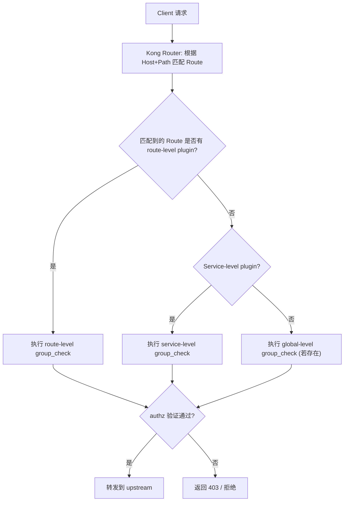
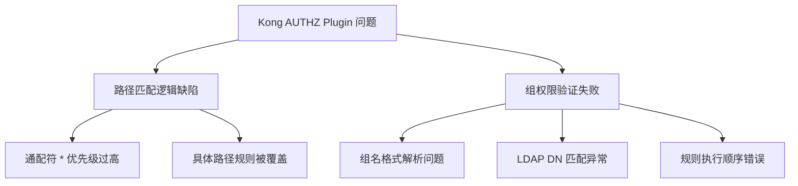
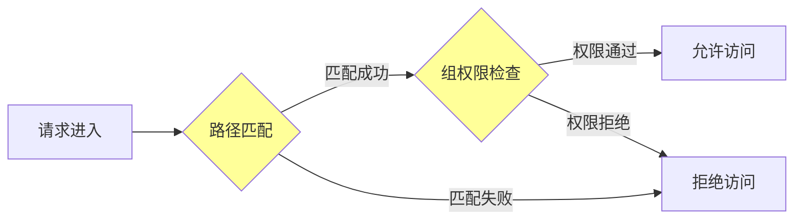
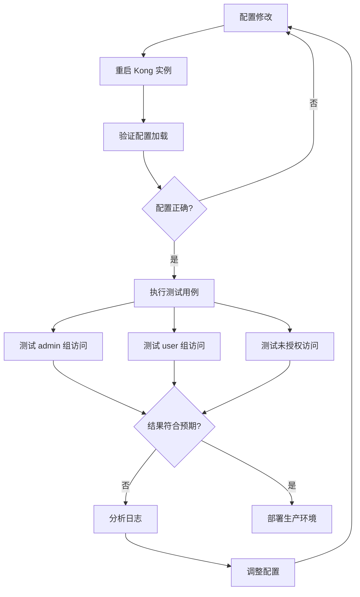

# ChatGPT  

# **问题分析**

Kong AUTHZ Plugin Path-based Group Check 问题分析

简短总结用户反馈的现象与痛点：

- 期望：通过 **path-based** **group_check**（基于路径的授权规则）实现：
    - path: "\*" 能访问所有 API（对应某个组）
    - path: /api/v1/current-user 仅允许访问该具体路径（对应另一个组或限制）
- 实际：当同时存在 \*（通配）规则与更具体路径规则时，**通配规则覆盖/阻断了具体规则**，导致具体路径的授权无法按预期生效（管理员组反而被拒绝）。
- 用户怀疑是 Kong authz / group_check 的配置或实现缺陷。

可能的根因（按概率与影响排序）：

1. **路由/路径匹配优先级问题** — Kong 的 route/path 匹配与插件生效顺序会影响最终哪个配置被应用（长路径/regex 优先于短路径；全局/服务/路由 scope 有优先级）。
2. **插件作用域（scope）配置不当** — 如果 group_check 被配置为全局或 service 级别，而具体路径的规则在 route 级别，可能产生覆盖或冲突（或相反）。Kong 的插件生效与配置优先级会影响哪一份配置被选用。
3. **路径匹配语法差异（通配 vs 正则 vs 前缀）** — \*、尾部斜杠、前缀匹配和正则路由在不同版本/配置下表现不同，某些 kong 版本对 wildcard/regex 行为有已知问题。
4. **authz 插件内部规则优先/合并逻辑或 bug** — 插件内部如何合并多条规则（先匹配到的规则是否短路）可能导致不预期覆盖（需确认插件实现）。
5. **组 DN / 字段匹配问题** — 规则中用到的组字符串（CN=…）是否与认证返回的属性一一对应（大小写、格式、前后空格等），导致 authz 无法验证通过（截图显示“无法验证”）。
6. **请求/消费者上下文缺失** — 插件依赖的身份信息（JWT、header、consumer info、LDAP lookup 等）未正确传递到 authz 插件。

---

# **可行的排查与解决方案（步骤化，按优先执行）**

> 在执行下面命令/修改配置前，**先检查权限（Admin API 权限）、备份当前配置、并在非生产环境复现/验证**。

## **1) 确认路由与 plugin 的 Scope / 绑定位置**

- 列出所有 route 与其 paths，确认是否存在一个“catch-all” route 或短路径先匹配的 route：

```
# 列出所有 routes（Kong Admin API）
curl -sS -X GET http://<KONG_ADMIN>:8001/routes | jq .
```

- 列出所有插件并看它们分别绑定到哪个 entity（route/service/consumer/global）：

```
curl -sS http://<KONG_ADMIN>:8001/plugins | jq .
# 或只看特定 plugin
curl -sS http://<KONG_ADMIN>:8001/plugins?name=group_check | jq .
```

**目标检查点**：确认是否有 global/service 级别的 group_check 或 \* 规则覆盖了 route 级别具体规则。

## **2) 验证路由匹配优先级（路径长度 / regex）**

- Kong 对非 regex 路由按路径长度降序排序；regex 路由按 regex_priority。因此确保具体路径比通配路径“更长”或使用 regex + 更高 regex_priority。
- 如果通配是 "/" 或 "\*"，建议将具体路径改为完整前缀（例如 /api/v1/userreport）并确认该 route 的 paths 明确存在。

## **3) 移动/调整 plugin 作用范围以控制优先级**

- 若现在 group_check 是 global 或 service 级别：**把对特定路径的规则挂到对应的 Route 上**（route-level plugin 覆盖更细粒度）。如果必须全局存在通配规则，考虑**在 route 上单独配置一个更具体的 plugin**来覆盖或排除全局行为。示例：在特定 route 上添加 plugin：

```
curl -X POST http://<KONG_ADMIN>:8001/routes/<route_id>/plugins \
  -H "Content-Type: application/json" \
  -d '{
    "name": "group_check",
    "config": {
      "rules": [
        {"path": "/api/v1/userreport", "grp": ["CN=informationdir-Al-dev-admin,..."] }
      ]
    }
  }'
```

**说明**：优先把“白名单/强例外”放到 route 级别。

## **4) 用更严格的 route 匹配（避免** 

## **\***

##  **作为路径）**

- 尽量避免使用单独 _ 作为路由路径；如果需要 catch-all，请用单独的 route（并给它较低的优先级或放在 service 级别），并确保具体 route 的 path 更长或使用 regex 优先。可考虑将 catch-all 限定为 / 或 /(._) 的 regex route 并调低优先级。

## **5) 检查 authz 执行日志与认证上下文**

- 将 Kong 日志等级调高以观察插件运行细节（在节点上设置）：

```
# 仅示例，实际以部署方式为准
export KONG_LOG_LEVEL=debug
# 重启 kong 节点或相应容器以使配置生效
```

- 请求时抓包/打印 header（尤其是认证/consumer 信息、组信息），确认插件拿到的数据是否符合期望（例如 LDAP 返回的 groups 属性、JWT claim 的 groups/roles 等）。
- 模拟请求并观察插件的 access-phase 日志。

## **6) 验证规则格式与组字符串匹配**

- 用户提供的规则片段中有类似 "CN=informationdir-Al-dev-admin,OU=Lex,...“ 的 DN。确认 group_check 插件内部是否是按 DN 精确匹配还是按 shortName（例如 informationdir-Al-dev-admin）。如果插件期望 short name，但配置用了 DN，会导致不匹配。
- 建议临时配置为更宽松的组匹配测试（例如只用 informationdir-Al-dev-admin）以排除格式问题。

## **7) 最小化复现用例并升级/比对版本**

- 在测试环境只创建两个 route：一个具体 /api/v1/userreport，一个 catch-all（/）。分别在 route 上附加你的 group_check 配置（一个是具体的，一个是 \*），然后用 curl 逐个测试。
- 若复现且确认是 Kong core 或 plugin 的行为异常，请记录 Kong 版本、plugin 版本并对比 changelog/issues；部分版本对 wildcard 路由/匹配有已知变更或 bug。

---

# **推荐实验（快速验证步骤）**

1. 列出 route 与 plugin（见上面 curl 命令）。
2. 在 test route 上只绑定具体规则（删除/禁用 global 的 \* 规则），测试是否能正确放行 admin 用户。若能，说明是覆盖优先问题。
3. 如果无法：在 route 上启 debug 日志，记录 authz 插件接收的身份信息与组信息（确认是否真的是“无法验证”还是“匹配失败”）。
4. 若确认为插件逻辑导致（例如规则短路），建议临时方案：**不要用单一** **\*** **规则覆盖所有**，而是显式为需要访问所有 API 的组在每个 service/route 上配置或通过脚本批量下发规则（消除单点 catch-all），直到 upstream 修复。
5. 若确认是 Kong/plugin 的 bug，请收集最小复现、请求/响应抓包、Kong 版本和 plugin 配置提 issue 给 Kong（或 plugin 作者）。

---

# **示例：把通配规则改为 service-level，具体规则放到 route-level（示例 JSON）**

```
# 1) 在 Service 上放一个 "all-api" 的 group_check（代表通配组）：
curl -X POST http://<KONG_ADMIN>:8001/services/<service_id>/plugins \
  -H "Content-Type: application/json" \
  -d '{
    "name": "group_check",
    "config": {
      "rules": [
        {"path": "*", "grp": ["CN=AllAPI-Group,OU=..."]}
      ]
    }
  }'

# 2) 在具体 route 上放具体限制（覆盖或更具体生效）：
curl -X POST http://<KONG_ADMIN>:8001/routes/<route_id_for_userreport>/plugins \
  -H "Content-Type: application/json" \
  -d '{
    "name": "group_check",
    "config": {
      "rules": [
        {"path": "/api/v1/userreport", "grp": ["CN=informationdir-Al-dev-admin,OU=..."]}
      ]
    }
  }'
```

**注意**：不同版本/实现的 plugin 合并规则不同，务必在测试环境验证。

---

# **故障排除清单（快速核查）**

- 确认 Kong 版本与 authz / group_check 插件版本（是否为自定义插件）。
- 确认插件绑定的 scope（global/service/route/consumer）。
- 检查 route path 的具体值（是否含 trailing slash、是否为 regex、path 长度是否优于 catch-all）。
- 开启 debug 日志并抓取插件 access-phase 日志与请求上下文。
- 验证认证层输出的组信息（JWT claim / LDAP attribute / header）与规则中使用的组格式是否一致。
- 在最简环境中复现（只保留两个 route 与两个 plugin 配置）。
- 若复现且确定非配置问题，准备最小复现用例并在 Kong 社区/GitHub 提 issue（附 Kong 版本、配置、日志）。

---

# **可能的短期绕过策略（若发现是覆盖导致）**

1. **禁止使用单一 global** **\*** **规则**，改为在每个 service/route 上批量配置需要的规则（通过脚本批量下发）。
2. 使用 **更高优先级的 regex route**（regex_priority）或更长路径来确保具体 route 先被匹配。
3. 如果插件支持“exclude”或黑名单功能（某些 global plugin 有类似 issue），利用 exclude 跳过特定 route。若 plugin 不支持，考虑用外部逻辑（Lua 插件 wrapper）做条件判断。

---

# **流程图（请求到授权的决策流程）**



---

# **注意事项 & 最佳实践**

- 在操作生产网关前 **务必在测试环境复现**，并备份当前插件/route 配置。
- 优先使用 **route-level 精细策略** 而非单一 global wildcard 规则。
- 如果 group_check 是第三方/自定义 plugin，请阅读其 schema 与实现，确认规则合并逻辑与匹配准则（是否短路、是否按先后顺序、是否支持 exclude）。
- 收集问题时附上：Kong 版本、插件版本/源码、最小可复现配置、debug 日志与请求/响应抓包，这会显著加速问题定位与修复。

---

如果你愿意，我可以直接为你做以下一项（选一条即可）并在此回复里给出结果或具体命令/JSON：

1. 根据你给的当前 Kong Admin API 地址，**自动列出当前 routes 与 plugins（只读）** 并生成一份对比表（我会给你需要运行的 curl 命令或脚本）。
2. 帮你写一个 **最小复现的 declarative/YAML**（或一组 Admin API 调用），包含：一个 catch-all route + 一个具体 route + 对应 plugin 配置，方便你在 test 环境快速验证。
3. 帮你写一个 **排查脚本**（bash + jq），自动检查可能的覆盖：检测是否存在 global/service plugin 与 route plugin 冲突并输出建议改动。

你选哪一项，我就直接给出对应的实现。


# Claude

# Kong AUTHZ Plugin Path-based Group Check 问题分析

## 1. 问题分析

### 核心问题

用户在使用 Kong 的 AUTHZ (Authorization) 插件的 `group_check` 功能时遇到了**路径匹配规则异常**问题，具体表现为：

1. **通配符路径覆盖问题**
    
    - 当配置了通配符路径 `*` 和具体路径 `/api/v1/current-user` 时
    - 通配符 `*` 会覆盖具体路径配置
    - 导致具体路径的访问控制规则失效
2. **权限验证失败问题**
    
    - 配置了特定路径 `/api/v1/userreport` 的 group check 规则
    - 预期：`admin` 组用户可以访问，普通用户不能访问
    - 实际：`admin` 组用户也无法通过 AUTHZ 验证

### 问题分类



## 2. 根因分析

### 2.1 路径匹配优先级问题

Kong AUTHZ 插件在处理多个路径规则时，可能存在以下问题：

|问题类型|具体表现|可能原因|
|---|---|---|
|规则冲突|`*` 覆盖具体路径|插件未正确实现最长匹配原则|
|执行顺序|先匹配的规则生效|缺少路径优先级排序机制|
|正则表达式|通配符处理不当|路径模式转换为正则表达式时逻辑错误|

### 2.2 LDAP 组名验证问题

从配置示例看到使用了 LDAP DN 格式的组名：

```text
CN=informationdir-Al-dev-admin,OU=Lex,OU=Applications,OU=Groups,DC=informationdir,DC=Prod,DC=aibang
```

**潜在问题点**：

- DN 字符串中的特殊字符（逗号、等号）可能导致解析错误
- 大小写敏感性问题
- 空格处理不一致
- 字符编码问题

## 3. 解决方案探索

### 方案 1：修正路径配置顺序（临时方案）

**操作步骤**：

1. **避免使用通配符 `*` 与具体路径混合配置**
    
    ```json
    {
      "ruleName": "group_check",
      "rules": [
        {
          "path": "/api/v1/userreport",
          "grp": ["CN=informationdir-Al-dev-admin,OU=Lex,OU=Applications,OU=Groups,DC=informationdir,DC=Prod,DC=aibang"]
        },
        {
          "path": "/api/v1/current-user",
          "grp": ["CN=informationdir-Al-dev-user,OU=Lex,OU=Applications,OU=Groups,DC=informationdir,DC=Prod,DC=aibang"]
        }
      ]
    }
    ```
    
2. **将具体路径规则放在前面**
    
    ```json
    {
      "ruleName": "group_check",
      "rules": [
        {
          "path": "/api/v1/current-user",
          "grp": ["specific-group"]
        },
        {
          "path": "*",
          "grp": ["general-group"]
        }
      ]
    }
    ```
    

### 方案 2：使用路径前缀匹配（推荐）

**替代通配符使用正则表达式或前缀匹配**：

```json
{
  "ruleName": "group_check",
  "rules": [
    {
      "path": "/api/v1/userreport",
      "match_type": "exact",
      "grp": ["admin-group"]
    },
    {
      "path": "/api/v1/",
      "match_type": "prefix",
      "grp": ["general-group"]
    }
  ]
}
```

### 方案 3：修正 LDAP DN 格式问题

**检查并规范化组名配置**：

1. **移除多余空格**
    
    ```bash
    # 错误示例（包含空格）
    "CN=informationdir-Al-dev-admin, OU=Lex, OU=Applications"
    
    # 正确示例（无空格）
    "CN=informationdir-Al-dev-admin,OU=Lex,OU=Applications"
    ```
    
2. **使用组名简称**（如果 AUTHZ 支持）
    
    ```json
    {
      "path": "/api/v1/userreport",
      "grp": ["informationdir-Al-dev-admin"]
    }
    ```
    
3. **URL 编码特殊字符**
    
    ```bash
    # 如果需要在 URL 中传递 DN
    CN%3Dinformationdir-Al-dev-admin%2COU%3DPeng
    ```
    

### 方案 4：调试和验证配置

**验证步骤**：

```bash
# 1. 检查当前 Kong 配置
curl -X GET http://kong-admin:8001/plugins/{plugin-id}

# 2. 查看插件日志
kubectl logs -f deployment/kong -n kong-namespace | grep -i authz

# 3. 测试 API 访问
curl -X GET https://api.example.com/api/v1/userreport \
  -H "Authorization: Bearer <token>" \
  -v
```

**配置验证脚本**：

```bash
#!/bin/bash

# Kong AUTHZ 配置验证脚本

KONG_ADMIN_URL="http://localhost:8001"
PLUGIN_ID="your-plugin-id"

echo "=== 获取当前 AUTHZ 配置 ==="
curl -s "${KONG_ADMIN_URL}/plugins/${PLUGIN_ID}" | jq '.config.group_check'

echo -e "\n=== 测试路径匹配 ==="
TEST_PATHS=(
  "/api/v1/userreport"
  "/api/v1/current-user"
  "/api/v2/test"
)

for path in "${TEST_PATHS[@]}"; do
  echo "Testing path: ${path}"
  curl -i -X GET "https://your-api.com${path}" \
    -H "Authorization: Bearer YOUR_TOKEN" 2>&1 | grep "HTTP/"
done
```

## 4. 深入调查方向

### 4.1 插件源码分析



**需要检查的代码逻辑**：

1. 路径匹配算法实现
2. 规则优先级排序机制
3. LDAP DN 解析逻辑
4. 组名比较方法（是否大小写敏感）

### 4.2 Kong 配置最佳实践

```yaml
# Kong AUTHZ Plugin 推荐配置
plugins:
  - name: authz
    config:
      # 启用详细日志
      verbose: true
      
      # 组检查规则
      group_check:
        # 使用数组形式，确保顺序
        rules:
          # 1. 最具体的路径放在前面
          - path: "/api/v1/userreport"
            method: ["GET", "POST"]
            groups:
              - "CN=informationdir-Al-dev-admin,OU=Lex,OU=Applications,OU=Groups,DC=informationdir,DC=Prod,DC=aibang"
            
          # 2. 次具体的路径
          - path: "/api/v1/current-user"
            method: ["GET"]
            groups:
              - "CN=informationdir-Al-dev-user,OU=Lex,OU=Applications,OU=Groups,DC=informationdir,DC=Prod,DC=aibang"
          
          # 3. 通用规则放在最后
          - path: "/api/v1/*"
            method: ["GET"]
            groups:
              - "CN=informationdir-Al-dev-general,OU=Lex,OU=Applications,OU=Groups,DC=informationdir,DC=Prod,DC=aibang"
      
      # 默认拒绝策略
      default_deny: true
```

## 5. 验证和测试流程



## 6. 注意事项与建议

### 关键提示

- ⚠️ **备份现有配置**：修改前务必备份当前 AUTHZ 配置
- ⚠️ **分阶段测试**：先在开发环境验证，再逐步推广
- ⚠️ **监控日志**：配置修改后密切关注 Kong 错误日志
- ⚠️ **版本兼容**：确认使用的 Kong 和 AUTHZ 插件版本

### 最佳实践

1. **避免复杂路径规则**：尽量使用明确的路径而非通配符
2. **组名简化**：如果可能,使用短组名而非完整 LDAP DN
3. **规则文档化**：维护清晰的访问控制规则文档
4. **定期审计**：定期审查和清理过时的访问规则

## 7. 后续跟进建议

1. **收集更多信息**
    
    ```bash
    # 获取完整错误日志
    kubectl logs -f deployment/kong --tail=100 | grep -A 10 -B 10 "authz"
    
    # 导出当前插件配置
    curl -X GET http://kong-admin:8001/plugins/{plugin-id} > authz_config.json
    ```
    
2. **联系 Kong 官方支持**
    
    - 提供完整的配置文件
    - 附上错误日志和复现步骤
    - 说明 Kong 和插件版本信息
3. **考虑替代方案**
    
    - 使用 Kong 原生的 ACL 插件
    - 结合 Request Transformer 插件实现自定义逻辑
    - 评估其他 API 网关产品（如 Traefik、Envoy）

---

**总结**：该问题很可能是 Kong AUTHZ 插件在处理路径匹配优先级和 LDAP DN 解析时存在缺陷。建议先尝试调整配置顺序和格式,同时收集详细日志信息,必要时向 Kong 官方报告该 BUG。