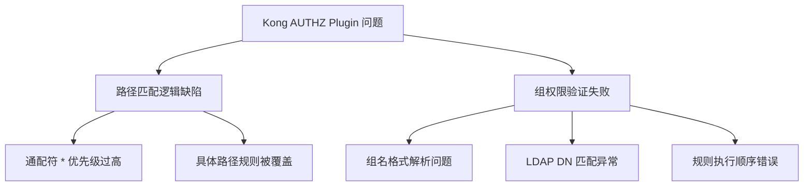
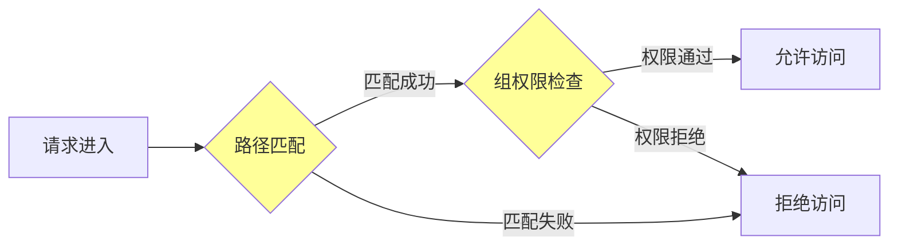
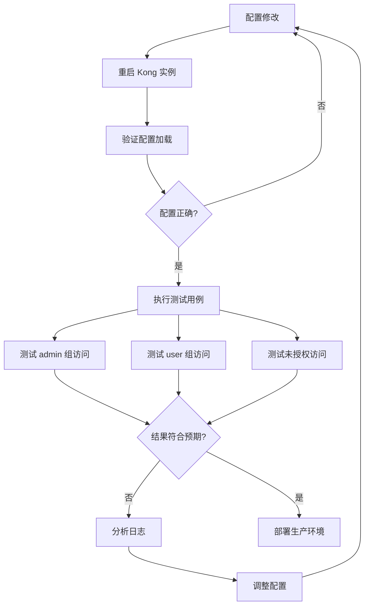

# Kong AUTHZ Plugin Path-based Group Check 问题分析

## 1. 问题分析

### 核心问题
用户在使用 Kong 的 AUTHZ (Authorization) 插件的 `group_check` 功能时遇到了**路径匹配规则异常**问题，具体表现为：

1. **通配符路径覆盖问题**
   - 当配置了通配符路径 `*` 和具体路径 `/api/v1/current-user` 时
   - 通配符 `*` 会覆盖具体路径配置
   - 导致具体路径的访问控制规则失效

2. **权限验证失败问题**
   - 配置了特定路径 `/api/v1/userreport` 的 group check 规则
   - 预期：`admin` 组用户可以访问，普通用户不能访问
   - 实际：`admin` 组用户也无法通过 AUTHZ 验证

### 问题分类


## 2. 根因分析

### 2.1 路径匹配优先级问题

Kong AUTHZ 插件在处理多个路径规则时，可能存在以下问题：

| 问题类型 | 具体表现 | 可能原因 |
|---------|---------|---------|
| 规则冲突 | `*` 覆盖具体路径 | 插件未正确实现最长匹配原则 |
| 执行顺序 | 先匹配的规则生效 | 缺少路径优先级排序机制 |
| 正则表达式 | 通配符处理不当 | 路径模式转换为正则表达式时逻辑错误 |

### 2.2 LDAP 组名验证问题

从配置示例看到使用了 LDAP DN 格式的组名：
```text
CN=Infodir-Al-dev-admin,OU=Peng,OU=Applications,OU=Groups,DC=InfoDir,DC=Prod,DC=aibang
```

**潜在问题点**：
- DN 字符串中的特殊字符（逗号、等号）可能导致解析错误
- 大小写敏感性问题
- 空格处理不一致
- 字符编码问题

## 3. 解决方案探索

### 方案 1：修正路径配置顺序（临时方案）

**操作步骤**：

1. **避免使用通配符 `*` 与具体路径混合配置**
   ```json
   {
     "ruleName": "group_check",
     "rules": [
       {
         "path": "/api/v1/userreport",
         "grp": ["CN=Infodir-Al-dev-admin,OU=Peng,OU=Applications,OU=Groups,DC=InfoDir,DC=Prod,DC=aibang"]
       },
       {
         "path": "/api/v1/current-user",
         "grp": ["CN=Infodir-Al-dev-user,OU=Peng,OU=Applications,OU=Groups,DC=InfoDir,DC=Prod,DC=aibang"]
       }
     ]
   }
   ```

2. **将具体路径规则放在前面**
   ```json
   {
     "ruleName": "group_check",
     "rules": [
       {
         "path": "/api/v1/current-user",
         "grp": ["specific-group"]
       },
       {
         "path": "*",
         "grp": ["general-group"]
       }
     ]
   }
   ```

### 方案 2：使用路径前缀匹配（推荐）

**替代通配符使用正则表达式或前缀匹配**：

```json
{
  "ruleName": "group_check",
  "rules": [
    {
      "path": "/api/v1/userreport",
      "match_type": "exact",
      "grp": ["admin-group"]
    },
    {
      "path": "/api/v1/",
      "match_type": "prefix",
      "grp": ["general-group"]
    }
  ]
}
```

### 方案 3：修正 LDAP DN 格式问题

**检查并规范化组名配置**：

1. **移除多余空格**
   ```bash
   # 错误示例（包含空格）
   "CN=Infodir-Al-dev-admin, OU=Peng, OU=Applications"
   
   # 正确示例（无空格）
   "CN=Infodir-Al-dev-admin,OU=Peng,OU=Applications"
   ```

2. **使用组名简称**（如果 AUTHZ 支持）
   ```json
   {
     "path": "/api/v1/userreport",
     "grp": ["Infodir-Al-dev-admin"]
   }
   ```

3. **URL 编码特殊字符**
   ```bash
   # 如果需要在 URL 中传递 DN
   CN%3DInfodir-Al-dev-admin%2COU%3DPeng
   ```

### 方案 4：调试和验证配置

**验证步骤**：

```bash
# 1. 检查当前 Kong 配置
curl -X GET http://kong-admin:8001/plugins/{plugin-id}

# 2. 查看插件日志
kubectl logs -f deployment/kong -n kong-namespace | grep -i authz

# 3. 测试 API 访问
curl -X GET https://api.example.com/api/v1/userreport \
  -H "Authorization: Bearer <token>" \
  -v
```

**配置验证脚本**：

```bash
#!/bin/bash

# Kong AUTHZ 配置验证脚本

KONG_ADMIN_URL="http://localhost:8001"
PLUGIN_ID="your-plugin-id"

echo "=== 获取当前 AUTHZ 配置 ==="
curl -s "${KONG_ADMIN_URL}/plugins/${PLUGIN_ID}" | jq '.config.group_check'

echo -e "\n=== 测试路径匹配 ==="
TEST_PATHS=(
  "/api/v1/userreport"
  "/api/v1/current-user"
  "/api/v2/test"
)

for path in "${TEST_PATHS[@]}"; do
  echo "Testing path: ${path}"
  curl -i -X GET "https://your-api.com${path}" \
    -H "Authorization: Bearer YOUR_TOKEN" 2>&1 | grep "HTTP/"
done
```

## 4. 深入调查方向

### 4.1 插件源码分析



**需要检查的代码逻辑**：
1. 路径匹配算法实现
2. 规则优先级排序机制
3. LDAP DN 解析逻辑
4. 组名比较方法（是否大小写敏感）

### 4.2 Kong 配置最佳实践

```yaml
# Kong AUTHZ Plugin 推荐配置
plugins:
  - name: authz
    config:
      # 启用详细日志
      verbose: true
      
      # 组检查规则
      group_check:
        # 使用数组形式，确保顺序
        rules:
          # 1. 最具体的路径放在前面
          - path: "/api/v1/userreport"
            method: ["GET", "POST"]
            groups:
              - "CN=Infodir-Al-dev-admin,OU=Peng,OU=Applications,OU=Groups,DC=InfoDir,DC=Prod,DC=aibang"
            
          # 2. 次具体的路径
          - path: "/api/v1/current-user"
            method: ["GET"]
            groups:
              - "CN=Infodir-Al-dev-user,OU=Peng,OU=Applications,OU=Groups,DC=InfoDir,DC=Prod,DC=aibang"
          
          # 3. 通用规则放在最后
          - path: "/api/v1/*"
            method: ["GET"]
            groups:
              - "CN=Infodir-Al-dev-general,OU=Peng,OU=Applications,OU=Groups,DC=InfoDir,DC=Prod,DC=aibang"
      
      # 默认拒绝策略
      default_deny: true
```

## 5. 验证和测试流程



## 6. 注意事项与建议

### 关键提示
- ⚠️ **备份现有配置**：修改前务必备份当前 AUTHZ 配置
- ⚠️ **分阶段测试**：先在开发环境验证，再逐步推广
- ⚠️ **监控日志**：配置修改后密切关注 Kong 错误日志
- ⚠️ **版本兼容**：确认使用的 Kong 和 AUTHZ 插件版本

### 最佳实践
1. **避免复杂路径规则**：尽量使用明确的路径而非通配符
2. **组名简化**：如果可能,使用短组名而非完整 LDAP DN
3. **规则文档化**：维护清晰的访问控制规则文档
4. **定期审计**：定期审查和清理过时的访问规则

## 7. 后续跟进建议

1. **收集更多信息**
   ```bash
   # 获取完整错误日志
   kubectl logs -f deployment/kong --tail=100 | grep -A 10 -B 10 "authz"
   
   # 导出当前插件配置
   curl -X GET http://kong-admin:8001/plugins/{plugin-id} > authz_config.json
   ```

2. **联系 Kong 官方支持**
   - 提供完整的配置文件
   - 附上错误日志和复现步骤
   - 说明 Kong 和插件版本信息

3. **考虑替代方案**
   - 使用 Kong 原生的 ACL 插件
   - 结合 Request Transformer 插件实现自定义逻辑
   - 评估其他 API 网关产品（如 Traefik、Envoy）

---

**总结**：该问题很可能是 Kong AUTHZ 插件在处理路径匹配优先级和 LDAP DN 解析时存在缺陷。建议先尝试调整配置顺序和格式,同时收集详细日志信息,必要时向 Kong 官方报告该 BUG。